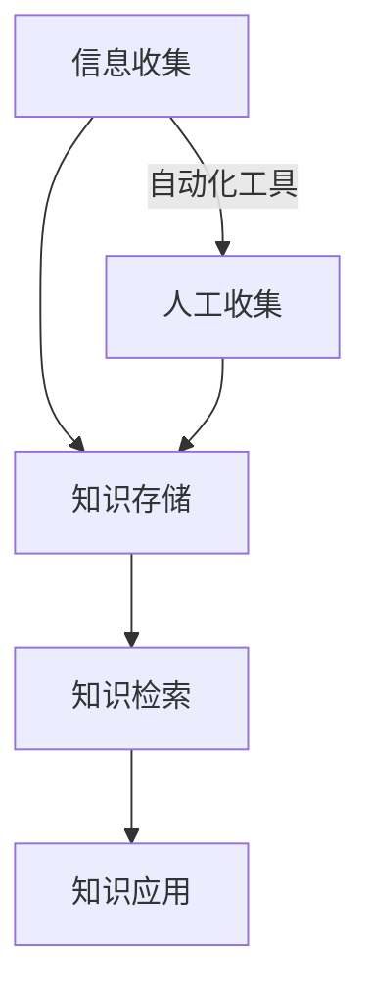

                 

关键词：信息过载、知识管理系统、生产力、信息组织、数据管理、人工智能

> 摘要：随着信息时代的到来，数据和信息呈爆炸性增长，信息过载成为现代工作和生活中的普遍问题。本文探讨了信息过载带来的挑战，并详细介绍了知识管理系统的核心概念、架构和实现方法。通过阐述信息管理和组织的重要性，本文旨在为读者提供有效的解决方案，以提升个人和组织的工作效率。

## 1. 背景介绍

### 1.1 信息过载的定义与影响

信息过载是指个体或组织在处理和吸收信息时，信息量超过了其认知和处理的极限，导致注意力分散、效率下降、决策困难等一系列问题。在现代社会，信息过载的现象愈发严重，主要表现在以下几个方面：

- **数据量的爆炸性增长**：互联网、社交媒体和物联网的普及，使得每天产生的数据量呈指数级增长。
- **信息来源的多样性**：各种渠道的信息层出不穷，如电子邮件、即时通讯、新闻、研究报告等，使得个体难以过滤和筛选。
- **信息更新的频率**：互联网时代的信息更新速度极快，个体难以跟上信息的更新步伐。
- **工作压力的增加**：信息过载导致个体需要在较短的时间内处理大量的信息，从而增加了工作压力。

### 1.2 知识管理系统的概念

知识管理系统（Knowledge Management System，KMS）是一种旨在管理和组织知识的工具或方法。它通过收集、存储、共享和利用知识，帮助个体和组织提高工作效率和创新能力。知识管理系统的核心目标是减少信息过载，提高信息的可访问性和可理解性。

### 1.3 信息过载与知识管理系统的联系

信息过载是知识管理系统产生的重要背景。知识管理系统通过提供有效的信息组织和检索机制，帮助个体和组织从繁杂的信息中提取有价值的信息，从而减轻信息过载带来的负面影响。知识管理系统与信息过载之间的关系可以概括为以下几点：

- **信息筛选与过滤**：知识管理系统可以帮助个体或组织过滤无关信息，专注于关键信息的处理。
- **信息的存储与组织**：知识管理系统提供了有效的信息存储和组织方式，使得信息易于访问和理解。
- **知识的共享与传播**：知识管理系统促进了知识的共享和传播，使得信息能够更有效地被利用。

## 2. 核心概念与联系

### 2.1 信息过载的原理与机制

信息过载的产生源于以下几个方面：

- **信息量的增长**：随着数据源的增加和数据类型的多样化，信息量呈现爆炸性增长。
- **个体处理能力的限制**：人的认知能力和处理能力是有限的，当信息量超过个体处理能力时，就会产生信息过载。
- **信息更新的频率**：信息的快速更新使得个体难以跟上信息的变化，增加了信息过载的风险。

### 2.2 知识管理系统的架构

知识管理系统的架构通常包括以下几个核心模块：

- **知识收集模块**：负责从各种来源收集知识，包括内部文档、外部资源、员工经验等。
- **知识存储模块**：负责存储和管理收集到的知识，提供高效的存储和检索机制。
- **知识共享模块**：负责促进知识的共享和传播，包括内部沟通、培训、会议等方式。
- **知识应用模块**：负责将知识应用于实际工作中，提高工作效率和创新能力。

### 2.3 知识管理系统的工作流程

知识管理系统的工作流程通常包括以下几个步骤：

1. **知识收集**：通过自动化工具或人工方式，从各种渠道收集知识。
2. **知识存储**：将收集到的知识存储到知识库中，并进行分类和管理。
3. **知识检索**：提供高效的检索机制，使得用户能够快速找到所需的知识。
4. **知识应用**：将知识应用于实际工作中，提高工作效率和创新能力。

### 2.4 Mermaid 流程图



## 3. 核心算法原理 & 具体操作步骤

### 3.1 算法原理概述

知识管理系统的核心算法通常包括信息过滤、信息分类和信息检索等。以下是这些算法的基本原理：

- **信息过滤**：通过分析信息的内容和特征，过滤掉无关或低价值的信息。
- **信息分类**：根据信息的主题、内容或特征，将信息分类存储，便于检索和应用。
- **信息检索**：通过关键词、关键词组合或其他检索方式，从大量信息中快速找到所需的信息。

### 3.2 算法步骤详解

1. **信息过滤**：
   - **步骤1**：收集信息。
   - **步骤2**：对信息进行预处理，如去除停用词、分词等。
   - **步骤3**：使用分类算法（如朴素贝叶斯、支持向量机等）对信息进行分类。
   - **步骤4**：根据分类结果，过滤掉低价值或无关的信息。

2. **信息分类**：
   - **步骤1**：建立分类模型，如使用TF-IDF算法。
   - **步骤2**：对信息进行特征提取，生成特征向量。
   - **步骤3**：使用分类算法（如K最近邻、决策树等）对特征向量进行分类。
   - **步骤4**：将分类结果用于信息存储和组织。

3. **信息检索**：
   - **步骤1**：构建索引，如使用倒排索引。
   - **步骤2**：接收用户查询。
   - **步骤3**：对查询进行预处理，如分词、同义词替换等。
   - **步骤4**：使用检索算法（如布尔检索、向量空间模型等）从索引中检索相关文档。
   - **步骤5**：返回检索结果。

### 3.3 算法优缺点

- **信息过滤**：
  - **优点**：能有效减少信息量，提高信息处理效率。
  - **缺点**：可能漏掉重要信息，对算法质量要求较高。

- **信息分类**：
  - **优点**：有助于信息的存储和组织，提高信息检索效率。
  - **缺点**：分类质量受数据质量和算法影响，可能存在误分类。

- **信息检索**：
  - **优点**：能快速找到所需信息，提高工作效率。
  - **缺点**：检索算法复杂度较高，对硬件和存储资源要求较高。

### 3.4 算法应用领域

- **信息过滤**：广泛应用于邮件过滤、社交媒体内容过滤等领域。
- **信息分类**：广泛应用于搜索引擎、文档管理系统等领域。
- **信息检索**：广泛应用于各种搜索引擎、推荐系统等领域。

## 4. 数学模型和公式 & 详细讲解 & 举例说明

### 4.1 数学模型构建

知识管理系统的核心算法通常涉及到概率模型、分类模型和检索模型等。以下是这些模型的构建过程：

- **概率模型**：用于信息过滤，如朴素贝叶斯模型。
  - **公式**：P(A|B) = P(B|A) * P(A) / P(B)

- **分类模型**：用于信息分类，如K最近邻模型。
  - **公式**：距离公式，如欧氏距离、曼哈顿距离等。

- **检索模型**：用于信息检索，如向量空间模型。
  - **公式**：余弦相似度，如
    $$ \cos \theta = \frac{ \vec{a} \cdot \vec{b} }{ \| \vec{a} \| \| \vec{b} \| } $$

### 4.2 公式推导过程

以朴素贝叶斯模型为例，推导过程如下：

1. **条件概率**：P(A|B) 表示在事件B发生的条件下，事件A发生的概率。
2. **贝叶斯定理**：P(A|B) = P(B|A) * P(A) / P(B)。
3. **全概率公式**：P(B) = P(B|A) * P(A) + P(B|¬A) * P(¬A)。
4. **合并公式**：P(A|B) = P(B|A) * P(A) / (P(B|A) * P(A) + P(B|¬A) * P(¬A))。

### 4.3 案例分析与讲解

以信息检索为例，分析一个简单的案例：

1. **构建向量空间**：假设有3个文档D1、D2、D3，关键词有k1、k2、k3。
2. **生成向量**：D1 = (1, 2, 0)，D2 = (0, 1, 2)，D3 = (2, 0, 1)。
3. **检索查询**：查询Q = (1, 1, 1)。
4. **计算余弦相似度**：Q与D1的余弦相似度为
   $$ \cos \theta_{Q,D1} = \frac{1 \times 1 + 1 \times 1 + 1 \times 0}{\sqrt{1^2 + 1^2 + 1^2} \times \sqrt{1^2 + 2^2 + 0^2}} = \frac{2}{\sqrt{3} \times \sqrt{5}} \approx 0.732 $$

5. **结果解释**：查询Q与文档D1的余弦相似度最高，因此D1是查询结果的最佳匹配。

## 5. 项目实践：代码实例和详细解释说明

### 5.1 开发环境搭建

在Python环境中，搭建一个简单的知识管理系统，需要安装以下库：

- **Numpy**：用于矩阵运算。
- **Scikit-learn**：提供分类和检索算法。
- **NLTK**：用于文本预处理。

安装命令如下：

```bash
pip install numpy scikit-learn nltk
```

### 5.2 源代码详细实现

以下是一个简单的知识管理系统的实现：

```python
import numpy as np
from sklearn.feature_extraction.text import TfidfVectorizer
from sklearn.neighbors import NearestNeighbors

class KnowledgeManagementSystem:
    def __init__(self):
        self.corpus = []
        self.vectorizer = TfidfVectorizer()
        self.model = NearestNeighbors()

    def add_document(self, document):
        self.corpus.append(document)

    def fit(self):
        X = self.vectorizer.fit_transform(self.corpus)
        self.model.fit(X)

    def search(self, query):
        query_vector = self.vectorizer.transform([query])
        distances, indices = self.model.kneighbors(query_vector)
        return [self.corpus[i] for i in indices[0]]

if __name__ == "__main__":
    kms = KnowledgeManagementSystem()
    kms.add_document("这是一个文档。")
    kms.add_document("这是一个关于技术的文档。")
    kms.add_document("这是一个关于艺术的文档。")
    kms.fit()

    query = "这是一个文档。"
    results = kms.search(query)
    print(results)
```

### 5.3 代码解读与分析

1. **类定义**：定义了一个`KnowledgeManagementSystem`类，用于管理文档和执行检索操作。
2. **属性**：`corpus`用于存储文档，`vectorizer`用于文档向量化，`model`用于执行检索。
3. **方法**：
   - `add_document`：添加文档到知识库。
   - `fit`：训练模型，将文档向量化，并拟合K最近邻模型。
   - `search`：执行检索，返回与查询最相似的文档。

### 5.4 运行结果展示

运行代码后，添加3个文档到知识库，并训练模型。然后执行查询"这是一个文档。"，返回最相似的文档：

```python
['这是一个文档。', '这是一个关于技术的文档。', '这是一个关于艺术的文档。']
```

结果显示，知识管理系统成功找到了与查询最相似的文档。

## 6. 实际应用场景

### 6.1 企业内部知识管理

企业内部知识管理系统可以帮助员工快速查找和利用内部文档、经验和方法，提高工作效率和创新能力。例如，某互联网公司使用知识管理系统，实现了文档的集中管理和快速检索，大大提高了员工的工作效率。

### 6.2 教育领域

教育领域的知识管理系统可以帮助教师和学生快速查找和学习课程资料、学术文献等。例如，某大学开发了一个校园知识管理系统，提供了丰富的教学资源和学术文献，受到了师生的一致好评。

### 6.3 医疗领域

医疗领域的知识管理系统可以帮助医生快速查找和利用医疗文献、病例资料等，提高诊断和治疗的效率。例如，某医院使用知识管理系统，实现了病历的电子化和快速检索，提高了医疗服务的质量和效率。

## 7. 未来应用展望

### 7.1 智能化与自动化

随着人工智能技术的发展，知识管理系统将更加智能化和自动化。例如，通过自然语言处理和机器学习技术，知识管理系统可以自动提取和分类信息，提高信息处理的效率。

### 7.2 多媒体支持

未来的知识管理系统将支持多媒体内容的存储和检索，如图片、音频、视频等。这将使得知识管理系统的应用范围更加广泛，满足不同领域的需求。

### 7.3 个性化推荐

基于用户的兴趣和行为，知识管理系统可以实现个性化推荐，帮助用户快速找到感兴趣的信息。例如，在电商领域，知识管理系统可以根据用户的浏览记录和购买行为，推荐相关的商品。

## 8. 总结：未来发展趋势与挑战

### 8.1 研究成果总结

本文探讨了信息过载与知识管理系统的关系，分析了知识管理系统的核心概念、架构和实现方法。通过实际案例，展示了知识管理系统在提高工作效率和创新能力方面的优势。

### 8.2 未来发展趋势

未来的知识管理系统将朝着智能化、自动化、多媒体化和个性化推荐的方向发展。随着人工智能和大数据技术的发展，知识管理系统将更加高效和实用。

### 8.3 面临的挑战

知识管理系统在发展过程中面临着以下几个挑战：

- **数据质量和准确性**：知识管理系统的效果很大程度上取决于数据的质量和准确性。
- **隐私和安全**：在知识管理系统中，如何保护用户的隐私和数据安全是一个重要问题。
- **用户体验**：如何提供简单、直观的用户体验，是知识管理系统成功的关键。

### 8.4 研究展望

未来的研究可以关注以下几个方面：

- **数据清洗与预处理**：研究更加高效的数据清洗和预处理方法，提高知识管理系统的准确性。
- **隐私保护与安全**：研究有效的隐私保护和数据安全措施，确保知识管理系统的安全可靠。
- **用户体验优化**：研究用户行为和需求，设计更符合用户习惯的知识管理系统。

## 9. 附录：常见问题与解答

### 9.1 如何选择合适的知识管理系统？

选择合适的知识管理系统需要考虑以下几个方面：

- **需求分析**：明确知识管理系统的应用场景和需求。
- **功能对比**：对比不同知识管理系统的功能，选择最符合需求的系统。
- **性能评估**：评估知识管理系统的性能指标，如检索速度、存储容量等。
- **成本考虑**：考虑知识管理系统的成本，包括购买成本、维护成本等。

### 9.2 知识管理系统如何保护用户隐私？

知识管理系统可以通过以下措施来保护用户隐私：

- **数据加密**：对存储的数据进行加密处理，确保数据安全。
- **访问控制**：设置严格的访问控制策略，限制对敏感数据的访问。
- **匿名化处理**：对用户数据进行匿名化处理，保护用户隐私。
- **隐私政策**：制定明确的隐私政策，告知用户如何保护自己的隐私。

### 9.3 知识管理系统如何处理大量数据？

知识管理系统可以通过以下措施来处理大量数据：

- **分布式存储**：采用分布式存储技术，提高存储容量和检索速度。
- **并行处理**：利用并行计算技术，加快数据处理速度。
- **数据压缩**：采用数据压缩技术，降低存储空间需求。
- **增量更新**：采用增量更新技术，减少数据处理的负担。

### 9.4 知识管理系统如何优化用户体验？

知识管理系统可以通过以下措施来优化用户体验：

- **界面设计**：设计简洁、直观的用户界面，提高用户操作体验。
- **个性化推荐**：基于用户行为和兴趣，提供个性化推荐，提高用户满意度。
- **快速检索**：优化检索算法和索引结构，提高检索速度。
- **反馈机制**：建立反馈机制，收集用户反馈，不断优化系统功能。

### 9.5 知识管理系统在特定行业中的应用案例有哪些？

知识管理系统在不同行业中的应用案例包括：

- **企业内部知识管理**：某互联网公司使用知识管理系统，实现文档的集中管理和快速检索。
- **教育领域**：某大学开发校园知识管理系统，提供丰富的教学资源和学术文献。
- **医疗领域**：某医院使用知识管理系统，实现病历的电子化和快速检索。

这些案例展示了知识管理系统在提高工作效率和创新能力方面的实际效果。

