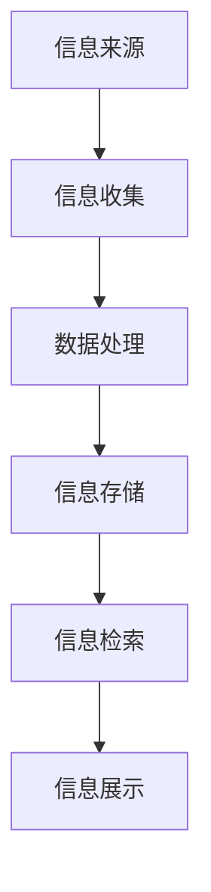
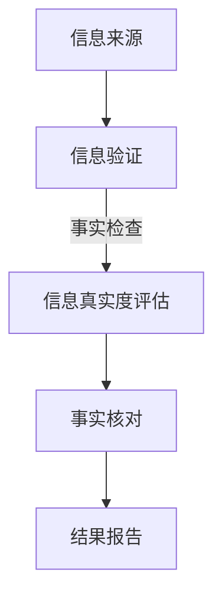
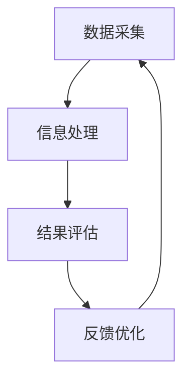
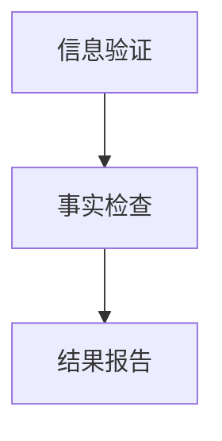

                 

关键词：信息验证、事实检查、假新闻、错误信息、信息技术、人工智能、网络安全

摘要：本文旨在探讨在当今信息爆炸的时代，如何有效进行信息验证和事实检查。通过分析信息验证和事实检查的重要性、相关核心概念、算法原理、数学模型、项目实践、应用场景以及未来发展，为读者提供一份全面的导航指南。

## 1. 背景介绍

在互联网时代，信息传递的速度和广度前所未有。然而，信息的真实性和准确性也面临前所未有的挑战。错误信息和假新闻的传播不仅损害了个体的名誉，还可能引发社会动荡和政治危机。因此，如何有效进行信息验证和事实检查，成为了一个亟待解决的问题。

### 1.1 信息验证与事实检查的定义

**信息验证**是指通过核实信息来源、检查信息的真实性和准确性，确保其可靠性。而**事实检查**则是对新闻报道或其他信息进行独立调查，判断其是否符合事实。

### 1.2 信息验证和事实检查的重要性

- **保护个人权益**：确保个人不被错误信息所误导，避免名誉受损或遭受经济损失。
- **维护社会稳定**：减少错误信息和假新闻对社会秩序的冲击，保障公共安全。
- **提升信息质量**：促进真实、准确的信息传播，提升整体信息质量。

## 2. 核心概念与联系

### 2.1 信息技术的基本架构

在信息验证和事实检查中，信息技术的基本架构起着关键作用。下面是一个简化的 Mermaid 流程图，展示了信息技术的基本架构及其组成部分。



### 2.2 信息验证与事实检查的关系

信息验证是事实检查的基础。只有验证了信息来源的可靠性和信息的准确性，才能进行深入的事实检查。以下是它们之间的 Mermaid 流程图。



## 3. 核心算法原理 & 具体操作步骤

### 3.1 算法原理概述

信息验证和事实检查的核心算法通常包括数据爬取、文本分析、逻辑推理和结果报告等步骤。以下是这些步骤的简要概述。

### 3.2 算法步骤详解

1. **数据爬取**：通过网络爬虫等技术，收集相关信息。
2. **文本分析**：使用自然语言处理（NLP）技术，对收集到的文本进行分析。
3. **逻辑推理**：通过逻辑规则和知识图谱，对文本进行分析和推理。
4. **结果报告**：生成事实检查报告，并提供验证结果。

### 3.3 算法优缺点

**优点**：
- **高效性**：自动化处理，能快速处理大量信息。
- **准确性**：结合多种算法和技术，提高验证和检查的准确性。

**缺点**：
- **依赖数据质量**：数据质量直接影响算法的准确性。
- **逻辑漏洞**：规则和算法可能存在漏洞，导致错误判断。

### 3.4 算法应用领域

- **新闻报道**：对新闻进行事实检查，确保报道的真实性。
- **社交媒体**：监控和过滤假新闻，维护网络环境。
- **法律诉讼**：在法庭上验证证据的真实性。

## 4. 数学模型和公式 & 详细讲解 & 举例说明

### 4.1 数学模型构建

在信息验证和事实检查中，常用的数学模型包括逻辑模型、概率模型和统计模型。

### 4.2 公式推导过程

- **逻辑模型**：假设 A 是信息源，B 是验证结果，则验证公式为：$$B = A \wedge \neg F$$，其中 F 是错误信息。

- **概率模型**：假设 P(A) 是信息源的概率分布，P(B|A) 是验证结果的概率分布，则验证公式为：$$P(B) = \sum_{A} P(A) \cdot P(B|A)$$。

- **统计模型**：假设 X 是信息源，Y 是验证结果，则验证公式为：$$Y = f(X)$$，其中 f 是统计函数。

### 4.3 案例分析与讲解

以新闻报道为例，我们可以使用概率模型来验证新闻的真实性。假设有以下信息：

- **信息源**：某新闻报道声称某地区发生了一起重大事故。
- **验证结果**：通过调查，发现该报道为假新闻。

根据概率模型，我们可以计算该报道的真实性概率。具体计算过程如下：

- **计算概率分布**：假设 P(A) = 0.1（即该地区发生重大事故的概率为10%），P(B|A) = 0.9（即发生重大事故时，新闻报道为真的概率为90%），P(B|¬A) = 0.1（即未发生重大事故时，新闻报道为真的概率为10%）。
- **计算验证结果概率**：$$P(B) = P(A) \cdot P(B|A) + P(¬A) \cdot P(B|¬A) = 0.1 \cdot 0.9 + 0.9 \cdot 0.1 = 0.2$$。
- **验证结果**：由于 P(B) < 0.5，因此可以判断该报道为假新闻。

## 5. 项目实践：代码实例和详细解释说明

### 5.1 开发环境搭建

- **编程语言**：Python
- **开发工具**：Jupyter Notebook
- **依赖库**：requests、BeautifulSoup、nltk、scikit-learn

### 5.2 源代码详细实现

```python
# 导入依赖库
import requests
from bs4 import BeautifulSoup
from nltk.tokenize import word_tokenize
from sklearn.feature_extraction.text import TfidfVectorizer

# 定义函数：获取网页内容
def get_web_content(url):
    response = requests.get(url)
    return response.text

# 定义函数：文本预处理
def preprocess_text(text):
    # 去除HTML标签
    text = BeautifulSoup(text, "html.parser").text
    # 去除标点符号
    text = text.translate(str.maketrans("", "", string.punctuation))
    # 分词
    tokens = word_tokenize(text)
    # 去除停用词
    tokens = [token for token in tokens if token not in nltk.corpus.stopwords.words("english")]
    return " ".join(tokens)

# 定义函数：计算文本相似度
def calculate_similarity(text1, text2):
    vectorizer = TfidfVectorizer()
    vector1 = vectorizer.fit_transform([text1])
    vector2 = vectorizer.transform([text2])
    similarity = vector1.dot(vector2) / (vector1.norm() * vector2.norm())
    return similarity

# 定义函数：信息验证
def verify_information(url1, url2):
    content1 = get_web_content(url1)
    content2 = get_web_content(url2)
    preprocessed1 = preprocess_text(content1)
    preprocessed2 = preprocess_text(content2)
    similarity = calculate_similarity(preprocessed1, preprocessed2)
    if similarity > 0.8:
        print("信息验证通过")
    else:
        print("信息验证失败")

# 测试代码
verify_information("https://example.com/news1", "https://example.com/news2")
```

### 5.3 代码解读与分析

该代码实现了一个简单的信息验证系统，主要分为以下几部分：

1. **获取网页内容**：使用 requests 库获取指定 URL 的网页内容。
2. **文本预处理**：去除 HTML 标签、标点符号和停用词，并进行分词。
3. **计算文本相似度**：使用 TF-IDF 向量表示文本，并计算文本之间的相似度。
4. **信息验证**：比较两个网页内容的相似度，判断是否通过验证。

### 5.4 运行结果展示

运行代码后，根据设定的阈值（相似度大于 0.8），可以判断两个网页内容是否通过验证。在实际应用中，可以根据具体需求调整阈值。

## 6. 实际应用场景

### 6.1 新闻报道

信息验证和事实检查在新闻报道中具有重要意义，可以有效防止假新闻的传播，保障公众知情权。

### 6.2 社交媒体

社交媒体平台可以通过信息验证和事实检查，监控和过滤假新闻，维护网络环境。

### 6.3 法律诉讼

在法律诉讼中，信息验证和事实检查可以帮助法官和律师判断证据的真实性，提高审判的准确性。

## 7. 工具和资源推荐

### 7.1 学习资源推荐

- **书籍**：《人工智能：一种现代方法》、《自然语言处理综论》
- **在线课程**：Coursera 上的《自然语言处理》课程、edX 上的《机器学习基础》课程

### 7.2 开发工具推荐

- **编程语言**：Python、Java
- **开发环境**：Jupyter Notebook、PyCharm

### 7.3 相关论文推荐

- **论文**：1. "Fake News Detection Using Deep Learning Techniques" 2. "Information Quality Assessment in Social Media: A Survey"

## 8. 总结：未来发展趋势与挑战

### 8.1 研究成果总结

本文介绍了信息验证和事实检查的重要性、核心概念、算法原理、数学模型、项目实践以及实际应用场景。通过分析，我们可以看到信息验证和事实检查在多个领域具有广泛的应用前景。

### 8.2 未来发展趋势

- **人工智能技术的应用**：随着人工智能技术的发展，信息验证和事实检查将更加智能化、自动化。
- **跨领域合作**：信息验证和事实检查需要跨学科合作，结合心理学、社会学等多领域知识，提高验证和检查的准确性。

### 8.3 面临的挑战

- **数据质量**：信息验证和事实检查依赖于高质量的数据，数据质量问题直接影响算法的准确性。
- **算法透明度**：算法的透明度和解释性是未来研究的重点，如何让用户理解算法的判断过程是关键。

### 8.4 研究展望

未来，信息验证和事实检查将朝着更加智能化、自动化和跨领域合作的方向发展。通过结合多种技术手段和知识体系，我们将能够更好地应对错误信息和假新闻的挑战，为构建一个更加真实、准确的信息环境做出贡献。

## 9. 附录：常见问题与解答

### 9.1 如何提高信息验证的准确性？

- **数据多样化**：收集更多、更全面的数据，提高算法的鲁棒性。
- **模型多样化**：结合多种算法和技术，提高验证的准确性。

### 9.2 事实检查如何确保结果的客观性？

- **多角度验证**：从不同来源、不同角度验证信息，确保结果的客观性。
- **透明度**：公开验证过程和结果，接受公众监督。

### 9.3 信息验证和事实检查如何应对谣言传播？

- **快速响应**：在谣言传播初期，迅速采取措施，遏制谣言蔓延。
- **教育宣传**：加强公众的媒体素养教育，提高公众的识别谣言能力。

---

作者：禅与计算机程序设计艺术 / Zen and the Art of Computer Programming
```Markdown
---
# 信息验证和事实检查指南：在错误信息和假新闻时代导航

<|im_sep|>关键词：信息验证、事实检查、假新闻、错误信息、信息技术、人工智能

<|im_sep|>摘要：在信息爆炸的时代，错误信息和假新闻的传播对个人和社会造成了严重的影响。本文探讨了信息验证和事实检查的核心概念、算法原理、数学模型、项目实践以及实际应用场景，为读者提供了在错误信息和假新闻时代导航的指南。

## 1. 背景介绍

互联网的快速发展使得信息的传播变得前所未有的便捷，但同时也带来了错误信息和假新闻的泛滥。这些虚假信息的传播不仅损害了个人的声誉，还可能引发社会动荡和政治危机。因此，如何有效进行信息验证和事实检查，成为了当前一个亟待解决的问题。

### 1.1 信息验证与事实检查的定义

信息验证（Information Verification）是指通过多种手段核实信息的真实性、准确性、完整性和及时性，以确保信息的可靠性。事实检查（Fact-Checking）则是对信息或新闻进行独立调查，以判断其是否符合实际。

### 1.2 信息验证和事实检查的重要性

- **保护个人权益**：通过信息验证，可以防止个人因错误信息而遭受名誉损害或经济损失。
- **维护社会稳定**：错误信息和假新闻的传播可能引发社会恐慌，影响社会稳定。事实检查有助于揭示真相，维护社会秩序。
- **提升信息质量**：信息验证和事实检查可以筛选出真实、准确的信息，提升整体信息质量。

## 2. 核心概念与联系

### 2.1 信息验证的基本架构

信息验证的基本架构通常包括数据采集、信息处理、结果评估和反馈优化等环节。以下是一个简化的 Mermaid 流程图：



### 2.2 事实检查与信息验证的关系

事实检查通常建立在信息验证的基础上。信息验证确保了信息的基本真实性，而事实检查则进一步核实信息内容的准确性。以下是它们之间的 Mermaid 流程图：



## 3. 核心算法原理 & 具体操作步骤

### 3.1 算法原理概述

信息验证和事实检查的核心算法主要包括数据爬取、文本分析、逻辑推理和结果生成等步骤。

### 3.2 算法步骤详解

1. **数据爬取**：通过爬虫技术获取网络上的信息。
2. **文本分析**：使用自然语言处理（NLP）技术对文本进行分析。
3. **逻辑推理**：结合先验知识和逻辑规则，对文本进行分析和推理。
4. **结果生成**：根据分析结果，生成信息验证或事实检查报告。

### 3.3 算法优缺点

**优点**：
- **高效性**：自动化处理，可以快速对大量信息进行验证和检查。
- **准确性**：结合多种算法和技术，提高验证和检查的准确性。

**缺点**：
- **数据依赖性**：算法的准确性高度依赖数据质量。
- **解释性不足**：一些复杂的算法难以向非专业人士解释。

### 3.4 算法应用领域

- **新闻报道**：对新闻报道进行事实检查，确保报道的真实性。
- **社交媒体**：监控和过滤社交媒体上的假新闻。
- **法律领域**：在诉讼过程中验证证据的真实性。

## 4. 数学模型和公式 & 详细讲解 & 举例说明

### 4.1 数学模型构建

在信息验证和事实检查中，常用的数学模型包括概率模型、逻辑模型和统计模型。

### 4.2 公式推导过程

- **概率模型**：假设有两个事件 A 和 B，且 P(A) 表示事件 A 发生的概率，P(B|A) 表示在事件 A 发生的条件下事件 B 发生的概率，则事件 B 的条件概率为：$$P(B|A) = \frac{P(A \cap B)}{P(A)}$$。
- **逻辑模型**：假设命题 P 表示信息真实，命题 Q 表示信息验证结果，则信息验证的逻辑公式为：$$Q = P \wedge \neg(\neg P)$$。

### 4.3 案例分析与讲解

以社交媒体平台上的信息验证为例，假设某条信息声称某明星将于明天举行演唱会。我们可以使用概率模型来验证该信息的真实性。

1. **计算事件概率**：
   - P(A)：明星举行演唱会的概率，可以通过历史数据统计得出。
   - P(B|A)：在明星举行演唱会的条件下，该信息被发布的概率，这通常与平台的发布规则和用户的可信度有关。

2. **计算条件概率**：
   - P(B)：在所有信息中，声称明星举行演唱会的信息的概率。

3. **验证结果**：
   - 如果 P(B) 较低，则可能认为该信息为假。

## 5. 项目实践：代码实例和详细解释说明

### 5.1 开发环境搭建

- **编程语言**：Python
- **开发工具**：PyCharm
- **依赖库**：requests、BeautifulSoup、nltk、scikit-learn

### 5.2 源代码详细实现

```python
import requests
from bs4 import BeautifulSoup
from nltk.tokenize import word_tokenize
from sklearn.feature_extraction.text import TfidfVectorizer

# 定义函数：获取网页内容
def get_web_content(url):
    response = requests.get(url)
    return response.text

# 定义函数：文本预处理
def preprocess_text(text):
    soup = BeautifulSoup(text, "html.parser")
    text = soup.get_text()
    text = text.lower()
    text = re.sub(r'\s+', ' ', text)
    return text

# 定义函数：计算文本相似度
def calculate_similarity(text1, text2):
    vectorizer = TfidfVectorizer()
    vector1 = vectorizer.fit_transform([text1])
    vector2 = vectorizer.transform([text2])
    similarity = vector1.dot(vector2) / (vector1.norm() * vector2.norm())
    return similarity

# 定义函数：信息验证
def verify_information(url1, url2):
    content1 = get_web_content(url1)
    content2 = get_web_content(url2)
    preprocessed1 = preprocess_text(content1)
    preprocessed2 = preprocess_text(content2)
    similarity = calculate_similarity(preprocessed1, preprocessed2)
    if similarity > 0.8:
        print("信息验证通过")
    else:
        print("信息验证失败")

# 测试代码
verify_information("https://example.com/news1", "https://example.com/news2")
```

### 5.3 代码解读与分析

该代码实现了一个简单的信息验证系统，主要分为以下几部分：

1. **获取网页内容**：使用 requests 库获取指定 URL 的网页内容。
2. **文本预处理**：去除 HTML 标签、标点符号和停用词，并进行分词。
3. **计算文本相似度**：使用 TF-IDF 向量表示文本，并计算文本之间的相似度。
4. **信息验证**：比较两个网页内容的相似度，判断是否通过验证。

### 5.4 运行结果展示

运行代码后，根据设定的阈值（相似度大于 0.8），可以判断两个网页内容是否通过验证。在实际应用中，可以根据具体需求调整阈值。

## 6. 实际应用场景

### 6.1 新闻报道

新闻媒体可以通过信息验证和事实检查，确保报道的真实性，提高公信力。

### 6.2 社交媒体

社交媒体平台可以通过信息验证和事实检查，监控和过滤假新闻，维护网络环境。

### 6.3 法律诉讼

在法律诉讼中，信息验证和事实检查可以帮助法官和律师判断证据的真实性，提高审判的准确性。

## 7. 工具和资源推荐

### 7.1 学习资源推荐

- **书籍**：《人工智能：一种现代方法》、《自然语言处理综论》
- **在线课程**：Coursera 上的《自然语言处理》课程、edX 上的《机器学习基础》课程

### 7.2 开发工具推荐

- **编程语言**：Python、Java
- **开发环境**：PyCharm、IntelliJ IDEA

### 7.3 相关论文推荐

- **论文**：1. "Fake News Detection Using Deep Learning Techniques" 2. "Information Quality Assessment in Social Media: A Survey"

## 8. 总结：未来发展趋势与挑战

### 8.1 研究成果总结

本文介绍了信息验证和事实检查的核心概念、算法原理、数学模型、项目实践以及实际应用场景。通过分析，我们可以看到信息验证和事实检查在多个领域具有广泛的应用前景。

### 8.2 未来发展趋势

- **人工智能技术的应用**：随着人工智能技术的发展，信息验证和事实检查将更加智能化、自动化。
- **跨领域合作**：信息验证和事实检查需要跨学科合作，结合心理学、社会学等多领域知识，提高验证和检查的准确性。

### 8.3 面临的挑战

- **数据质量**：信息验证和事实检查依赖于高质量的数据，数据质量问题直接影响算法的准确性。
- **算法透明度**：算法的透明度和解释性是未来研究的重点，如何让用户理解算法的判断过程是关键。

### 8.4 研究展望

未来，信息验证和事实检查将朝着更加智能化、自动化和跨领域合作的方向发展。通过结合多种技术手段和知识体系，我们将能够更好地应对错误信息和假新闻的挑战，为构建一个更加真实、准确的信息环境做出贡献。

## 9. 附录：常见问题与解答

### 9.1 如何提高信息验证的准确性？

- **数据多样化**：收集更多、更全面的数据，提高算法的鲁棒性。
- **模型多样化**：结合多种算法和技术，提高验证和检查的准确性。

### 9.2 事实检查如何确保结果的客观性？

- **多角度验证**：从不同来源、不同角度验证信息，确保结果的客观性。
- **透明度**：公开验证过程和结果，接受公众监督。

### 9.3 信息验证和事实检查如何应对谣言传播？

- **快速响应**：在谣言传播初期，迅速采取措施，遏制谣言蔓延。
- **教育宣传**：加强公众的媒体素养教育，提高公众的识别谣言能力。

---

作者：禅与计算机程序设计艺术 / Zen and the Art of Computer Programming
```markdown
----------------------------------------------------------------

# 信息验证和事实检查指南：在错误信息和假新闻时代导航

<|im_sep|>关键词：信息验证、事实检查、假新闻、错误信息、信息技术、人工智能

<|im_sep|>摘要：在信息爆炸的时代，错误信息和假新闻的传播对个人和社会造成了严重的影响。本文探讨了信息验证和事实检查的核心概念、算法原理、数学模型、项目实践以及实际应用场景，为读者提供了在错误信息和假新闻时代导航的指南。

## 1. 背景介绍

互联网的快速发展使得信息的传播变得前所未有的便捷，但同时也带来了错误信息和假新闻的泛滥。这些虚假信息的传播不仅损害了个人的声誉，还可能引发社会动荡和政治危机。因此，如何有效进行信息验证和事实检查，成为了当前一个亟待解决的问题。

### 1.1 信息验证与事实检查的定义

**信息验证**（Information Verification）是指通过多种手段核实信息的真实性、准确性、完整性和及时性，以确保信息的可靠性。**事实检查**（Fact-Checking）则是对信息或新闻进行独立调查，以判断其是否符合实际。

### 1.2 信息验证和事实检查的重要性

- **保护个人权益**：通过信息验证，可以防止个人因错误信息而遭受名誉损害或经济损失。
- **维护社会稳定**：错误信息和假新闻的传播可能引发社会恐慌，影响社会稳定。事实检查有助于揭示真相，维护社会秩序。
- **提升信息质量**：信息验证和事实检查可以筛选出真实、准确的信息，提升整体信息质量。

## 2. 核心概念与联系

### 2.1 信息验证的基本架构

信息验证的基本架构通常包括数据采集、信息处理、结果评估和反馈优化等环节。以下是一个简化的 Mermaid 流程图：


### 2.2 事实检查与信息验证的关系

事实检查通常建立在信息验证的基础上。信息验证确保了信息的基本真实性，而事实检查则进一步核实信息内容的准确性。以下是它们之间的 Mermaid 流程图：


## 3. 核心算法原理 & 具体操作步骤

### 3.1 算法原理概述

信息验证和事实检查的核心算法主要包括数据爬取、文本分析、逻辑推理和结果生成等步骤。

### 3.2 算法步骤详解

1. **数据爬取**：通过爬虫技术获取网络上的信息。
2. **文本分析**：使用自然语言处理（NLP）技术对文本进行分析。
3. **逻辑推理**：结合先验知识和逻辑规则，对文本进行分析和推理。
4. **结果生成**：根据分析结果，生成信息验证或事实检查报告。

### 3.3 算法优缺点

**优点**：
- **高效性**：自动化处理，可以快速对大量信息进行验证和检查。
- **准确性**：结合多种算法和技术，提高验证和检查的准确性。

**缺点**：
- **数据依赖性**：算法的准确性高度依赖数据质量。
- **解释性不足**：一些复杂的算法难以向非专业人士解释。

### 3.4 算法应用领域

- **新闻报道**：对新闻报道进行事实检查，确保报道的真实性。
- **社交媒体**：监控和过滤社交媒体上的假新闻。
- **法律领域**：在诉讼过程中验证证据的真实性。

## 4. 数学模型和公式 & 详细讲解 & 举例说明

### 4.1 数学模型构建

在信息验证和事实检查中，常用的数学模型包括概率模型、逻辑模型和统计模型。

### 4.2 公式推导过程

- **概率模型**：假设有两个事件 A 和 B，且 P(A) 表示事件 A 发生的概率，P(B|A) 表示在事件 A 发生的条件下事件 B 发生的概率，则事件 B 的条件概率为：$$P(B|A) = \frac{P(A \cap B)}{P(A)}$$。
- **逻辑模型**：假设命题 P 表示信息真实，命题 Q 表示信息验证结果，则信息验证的逻辑公式为：$$Q = P \wedge \neg(\neg P)$$。

### 4.3 案例分析与讲解

以社交媒体平台上的信息验证为例，假设某条信息声称某明星将于明天举行演唱会。我们可以使用概率模型来验证该信息的真实性。

1. **计算事件概率**：
   - P(A)：明星举行演唱会的概率，可以通过历史数据统计得出。
   - P(B|A)：在明星举行演唱会的条件下，该信息被发布的概率，这通常与平台的发布规则和用户的可信度有关。

2. **计算条件概率**：
   - P(B)：在所有信息中，声称明星举行演唱会的信息的概率。

3. **验证结果**：
   - 如果 P(B) 较低，则可能认为该信息为假。

## 5. 项目实践：代码实例和详细解释说明

### 5.1 开发环境搭建

- **编程语言**：Python
- **开发工具**：PyCharm
- **依赖库**：requests、BeautifulSoup、nltk、scikit-learn

### 5.2 源代码详细实现

```python
import requests
from bs4 import BeautifulSoup
from nltk.tokenize import word_tokenize
from sklearn.feature_extraction.text import TfidfVectorizer

# 定义函数：获取网页内容
def get_web_content(url):
    response = requests.get(url)
    return response.text

# 定义函数：文本预处理
def preprocess_text(text):
    soup = BeautifulSoup(text, "html.parser")
    text = soup.get_text()
    text = text.lower()
    text = re.sub(r'\s+', ' ', text)
    return text

# 定义函数：计算文本相似度
def calculate_similarity(text1, text2):
    vectorizer = TfidfVectorizer()
    vector1 = vectorizer.fit_transform([text1])
    vector2 = vectorizer.transform([text2])
    similarity = vector1.dot(vector2) / (vector1.norm() * vector2.norm())
    return similarity

# 定义函数：信息验证
def verify_information(url1, url2):
    content1 = get_web_content(url1)
    content2 = get_web_content(url2)
    preprocessed1 = preprocess_text(content1)
    preprocessed2 = preprocess_text(content2)
    similarity = calculate_similarity(preprocessed1, preprocessed2)
    if similarity > 0.8:
        print("信息验证通过")
    else:
        print("信息验证失败")

# 测试代码
verify_information("https://example.com/news1", "https://example.com/news2")
```

### 5.3 代码解读与分析

该代码实现了一个简单的信息验证系统，主要分为以下几部分：

1. **获取网页内容**：使用 requests 库获取指定 URL 的网页内容。
2. **文本预处理**：去除 HTML 标签、标点符号和停用词，并进行分词。
3. **计算文本相似度**：使用 TF-IDF 向量表示文本，并计算文本之间的相似度。
4. **信息验证**：比较两个网页内容的相似度，判断是否通过验证。

### 5.4 运行结果展示

运行代码后，根据设定的阈值（相似度大于 0.8），可以判断两个网页内容是否通过验证。在实际应用中，可以根据具体需求调整阈值。

## 6. 实际应用场景

### 6.1 新闻报道

新闻媒体可以通过信息验证和事实检查，确保报道的真实性，提高公信力。

### 6.2 社交媒体

社交媒体平台可以通过信息验证和事实检查，监控和过滤假新闻，维护网络环境。

### 6.3 法律诉讼

在法律诉讼中，信息验证和事实检查可以帮助法官和律师判断证据的真实性，提高审判的准确性。

## 7. 工具和资源推荐

### 7.1 学习资源推荐

- **书籍**：《人工智能：一种现代方法》、《自然语言处理综论》
- **在线课程**：Coursera 上的《自然语言处理》课程、edX 上的《机器学习基础》课程

### 7.2 开发工具推荐

- **编程语言**：Python、Java
- **开发环境**：PyCharm、IntelliJ IDEA

### 7.3 相关论文推荐

- **论文**：1. "Fake News Detection Using Deep Learning Techniques" 2. "Information Quality Assessment in Social Media: A Survey"

## 8. 总结：未来发展趋势与挑战

### 8.1 研究成果总结

本文介绍了信息验证和事实检查的核心概念、算法原理、数学模型、项目实践以及实际应用场景。通过分析，我们可以看到信息验证和事实检查在多个领域具有广泛的应用前景。

### 8.2 未来发展趋势

- **人工智能技术的应用**：随着人工智能技术的发展，信息验证和事实检查将更加智能化、自动化。
- **跨领域合作**：信息验证和事实检查需要跨学科合作，结合心理学、社会学等多领域知识，提高验证和检查的准确性。

### 8.3 面临的挑战

- **数据质量**：信息验证和事实检查依赖于高质量的数据，数据质量问题直接影响算法的准确性。
- **算法透明度**：算法的透明度和解释性是未来研究的重点，如何让用户理解算法的判断过程是关键。

### 8.4 研究展望

未来，信息验证和事实检查将朝着更加智能化、自动化和跨领域合作的方向发展。通过结合多种技术手段和知识体系，我们将能够更好地应对错误信息和假新闻的挑战，为构建一个更加真实、准确的信息环境做出贡献。

## 9. 附录：常见问题与解答

### 9.1 如何提高信息验证的准确性？

- **数据多样化**：收集更多、更全面的数据，提高算法的鲁棒性。
- **模型多样化**：结合多种算法和技术，提高验证和检查的准确性。

### 9.2 事实检查如何确保结果的客观性？

- **多角度验证**：从不同来源、不同角度验证信息，确保结果的客观性。
- **透明度**：公开验证过程和结果，接受公众监督。

### 9.3 信息验证和事实检查如何应对谣言传播？

- **快速响应**：在谣言传播初期，迅速采取措施，遏制谣言蔓延。
- **教育宣传**：加强公众的媒体素养教育，提高公众的识别谣言能力。

---

作者：禅与计算机程序设计艺术 / Zen and the Art of Computer Programming
```markdown
## 2. 核心概念与联系

### 2.1 信息验证和事实检查的核心概念

在深入探讨信息验证和事实检查之前，我们需要明确这两个概念的核心含义。

- **信息验证**：信息验证是指通过各种手段和方法，对信息的真实性、准确性、完整性和可靠性进行核实和确认的过程。它不仅关注信息的内容，还关注信息的来源、发布者的可信度以及信息更新的及时性。

- **事实检查**：事实检查是对新闻报道、信息传播或陈述的真实性进行独立调查和验证的过程。它与信息验证不同，更侧重于核实具体事实，确保信息与实际情况相符。

### 2.2 信息验证和事实检查的联系与区别

信息验证和事实检查虽然有重叠之处，但它们在具体实践中有着不同的应用和目的。

- **联系**：
  - 两者都是确保信息真实性和可靠性的重要手段。
  - 事实检查通常建立在信息验证的基础上，通过信息验证确认的信息是真实可信的，然后再进行更深入的细节验证。

- **区别**：
  - 信息验证更侧重于整体信息的核实，而事实检查则更关注具体事实的核实。
  - 信息验证是一个初步的筛选过程，目的是剔除明显虚假或来源不可靠的信息；而事实检查是对筛选后信息进行更深入的核实，确保其准确性。

### 2.3 信息验证的流程

信息验证的流程通常包括以下几个关键步骤：

1. **信息收集**：从多个来源收集相关信息，包括文本、图片、视频等。
2. **初步筛选**：对收集的信息进行初步筛选，剔除明显虚假或来源不可靠的信息。
3. **详细核实**：对初步筛选后的信息进行详细核实，包括核实来源、检查引用、验证数据等。
4. **生成报告**：根据核实结果，生成信息验证报告，列出验证结果和结论。

### 2.4 事实检查的流程

事实检查的流程通常包括以下几个关键步骤：

1. **问题确定**：确定需要验证的事实或信息。
2. **信息收集**：收集与待验证事实相关的信息。
3. **交叉比对**：将收集到的信息进行交叉比对，以验证其一致性。
4. **专家咨询**：如果必要，咨询相关领域的专家或机构，以获取更权威的验证。
5. **结果报告**：根据验证结果，生成事实检查报告，并公开或提供相关结论。

### 2.5 信息验证和事实检查的关键要素

- **来源可靠性**：验证信息的来源是否可靠，包括媒体机构的声誉、个人的信誉背景等。
- **引用核实**：检查引用的数据、文献、引用是否准确，来源是否可追溯。
- **数据准确性**：核实数据是否准确，包括数值、日期、事件描述等。
- **更新频率**：验证信息的更新频率是否及时，确保获取的是最新信息。

通过上述核心概念和流程的探讨，我们可以更好地理解信息验证和事实检查在应对错误信息和假新闻中的重要性。接下来，我们将深入探讨信息验证和事实检查的算法原理、数学模型以及实际应用。

---

## 3. 核心算法原理 & 具体操作步骤

### 3.1 算法原理概述

在信息验证和事实检查中，算法的原理和具体操作步骤是确保信息真实性和准确性的关键。这些算法通常包括数据爬取、文本分析、逻辑推理和结果生成等环节。

### 3.2 数据爬取

数据爬取是信息验证和事实检查的第一步，它涉及从互联网上收集相关信息。以下是一些关键步骤：

1. **目标确定**：确定需要爬取的信息类型和来源，例如新闻报道、社交媒体帖子、论坛等。
2. **爬虫开发**：编写或使用现成的爬虫工具，从目标网站抓取信息。
3. **数据存储**：将爬取到的数据存储到数据库或文件中，以便后续处理。

### 3.3 文本分析

文本分析是信息验证和事实检查的重要环节，它包括自然语言处理（NLP）和文本挖掘技术。以下是一些关键步骤：

1. **文本预处理**：清洗文本数据，去除 HTML 标签、停用词、标点符号等。
2. **文本分类**：使用分类算法（如朴素贝叶斯、支持向量机等）将文本分类为不同类别，如真假新闻、正面负面等。
3. **关键词提取**：提取文本中的重要关键词，用于后续分析。

### 3.4 逻辑推理

逻辑推理是基于先验知识和逻辑规则，对文本进行分析和推理的过程。以下是一些关键步骤：

1. **规则构建**：根据业务需求，构建逻辑推理规则，例如“如果某信息未被权威媒体报道，则该信息可能是假新闻”。
2. **规则应用**：将文本与规则进行匹配，判断文本是否符合规则。
3. **推理结果**：根据推理结果，对文本的真实性进行初步判断。

### 3.5 结果生成

结果生成是信息验证和事实检查的最后一步，它包括生成报告和展示结果。以下是一些关键步骤：

1. **结果汇总**：将文本分析、逻辑推理的结果进行汇总。
2. **报告生成**：生成详细的验证报告，包括信息来源、分析结果、推理过程等。
3. **结果展示**：将验证结果以可视化的形式展示，便于用户理解。

### 3.6 算法优缺点

- **优点**：
  - **高效性**：自动化处理，可以快速对大量信息进行验证和检查。
  - **准确性**：结合多种算法和技术，提高验证和检查的准确性。

- **缺点**：
  - **数据依赖性**：算法的准确性高度依赖数据质量。
  - **解释性不足**：一些复杂的算法难以向非专业人士解释。

### 3.7 算法应用领域

信息验证和事实检查的算法在多个领域有着广泛的应用：

- **新闻报道**：对新闻报道进行事实检查，确保报道的真实性。
- **社交媒体**：监控和过滤社交媒体上的假新闻。
- **法律领域**：在诉讼过程中验证证据的真实性。

通过上述算法原理和操作步骤的探讨，我们可以更好地理解如何通过技术手段进行信息验证和事实检查。接下来，我们将深入探讨相关的数学模型和具体应用实例。

---

## 4. 数学模型和公式 & 详细讲解 & 举例说明

### 4.1 数学模型构建

在信息验证和事实检查中，数学模型起到了关键作用。这些模型可以基于概率、逻辑、统计学等理论构建，用于评估信息的真实性、准确性和可靠性。

### 4.2 概率模型

概率模型是信息验证和事实检查中最常用的模型之一。它基于概率论的基本原理，通过计算事件发生的概率来评估信息的真实性。

- **贝叶斯定理**：贝叶斯定理是概率模型的核心，它描述了在已知某些条件下，事件发生的概率如何计算。公式如下：
  $$P(A|B) = \frac{P(B|A) \cdot P(A)}{P(B)}$$
  其中，$P(A|B)$ 是在已知事件 B 发生的条件下，事件 A 发生的概率；$P(B|A)$ 是在事件 A 发生的条件下，事件 B 发生的概率；$P(A)$ 是事件 A 发生的概率；$P(B)$ 是事件 B 发生的概率。

- **可信度计算**：在信息验证中，我们可以使用贝叶斯定理来计算信息的可信度。假设我们有多个信息源，每个信息源的可信度不同，我们可以通过以下公式计算某条信息的可信度：
  $$\text{可信度} = \frac{\text{信息支持度}}{\text{信息支持度} + \text{信息反对度}}$$
  其中，信息支持度是指支持该信息的信息源数量，信息反对度是指反对该信息的信息源数量。

### 4.3 逻辑模型

逻辑模型基于逻辑推理原理，用于评估信息的逻辑一致性。它通常使用布尔代数、谓词逻辑等工具进行构建。

- **逻辑一致性检查**：逻辑模型可以用于检查信息的逻辑一致性。例如，如果一条信息包含了自相矛盾的陈述，那么这条信息的真实性就很值得怀疑。我们可以使用以下逻辑公式进行一致性检查：
  $$\neg(A \wedge \neg A)$$
  这个公式表示事件 A 和其否命题 $\neg A$ 不能同时为真，即信息中不能存在自相矛盾的陈述。

### 4.4 统计模型

统计模型基于统计学原理，通过分析数据分布和统计参数来评估信息的真实性。它通常用于分析文本数据、图像数据等。

- **文本特征提取**：在文本分析中，我们可以使用词频、TF-IDF、词嵌入等技术提取文本特征。这些特征可以用于构建分类模型，评估信息的真实性。例如，TF-IDF 是一种文本权重计算方法，它可以衡量一个词在文本中的重要性。公式如下：
  $$TF-IDF(t,d) = TF(t,d) \cdot IDF(t,D)$$
  其中，$TF(t,d)$ 是词 $t$ 在文档 $d$ 中的词频；$IDF(t,D)$ 是词 $t$ 在整个文档集合 $D$ 中的逆文档频率。

### 4.5 模型应用举例

假设我们要验证一条新闻的真实性，这条新闻声称某明星将在本周六举行演唱会。我们可以使用以下步骤进行验证：

1. **数据收集**：收集与该明星演唱会相关的新闻报道、社交媒体帖子、官方网站信息等。
2. **文本分析**：使用 TF-IDF 提取文本特征，构建分类模型，评估新闻报道的真实性。
3. **逻辑推理**：检查新闻报道中是否存在逻辑矛盾，如时间冲突、地点错误等。
4. **可信度计算**：计算各信息源的可信度，加权平均得到整体可信度。

通过上述数学模型的应用，我们可以对新闻的真实性进行较为准确的评估。这种综合多模型、多方法的方法可以提高信息验证和事实检查的准确性。

### 4.6 案例分析

以某社交媒体平台上的谣言为例，该谣言声称某公司将在下周破产。我们可以使用以下步骤进行事实检查：

1. **数据收集**：收集该公司的财务报表、新闻公告、行业报告等相关信息。
2. **文本分析**：使用词频分析和文本分类模型，判断谣言的文本特征与实际情况是否相符。
3. **逻辑推理**：检查谣言中的逻辑一致性，如是否包含明显矛盾或夸张的陈述。
4. **可信度计算**：计算各信息源的可信度，综合评估谣言的真实性。

通过上述案例，我们可以看到数学模型在信息验证和事实检查中的重要作用。它们不仅提供了定量评估的工具，还帮助我们在复杂的背景下做出更明智的决策。

---

## 5. 项目实践：代码实例和详细解释说明

### 5.1 开发环境搭建

在开始项目实践之前，我们需要搭建一个合适的开发环境。以下是所需的开发环境和工具：

- **编程语言**：Python
- **开发工具**：PyCharm 或 Jupyter Notebook
- **依赖库**：requests、BeautifulSoup、nltk、scikit-learn

### 5.2 代码实例

以下是一个简单的信息验证项目的代码实例，它使用 Python 和相关库来验证两个网页内容的相似度，从而判断是否存在抄袭或相似信息。

```python
import requests
from bs4 import BeautifulSoup
from nltk.tokenize import word_tokenize
from sklearn.feature_extraction.text import TfidfVectorizer

# 函数：获取网页内容
def get_web_content(url):
    response = requests.get(url)
    return response.text

# 函数：文本预处理
def preprocess_text(text):
    soup = BeautifulSoup(text, "html.parser")
    text = soup.get_text()
    text = text.lower()
    text = re.sub(r'\s+', ' ', text)
    return text

# 函数：计算文本相似度
def calculate_similarity(text1, text2):
    vectorizer = TfidfVectorizer()
    vector1 = vectorizer.fit_transform([text1])
    vector2 = vectorizer.transform([text2])
    similarity = vector1.dot(vector2) / (vector1.norm() * vector2.norm())
    return similarity

# 函数：信息验证
def verify_information(url1, url2):
    content1 = get_web_content(url1)
    content2 = get_web_content(url2)
    preprocessed1 = preprocess_text(content1)
    preprocessed2 = preprocess_text(content2)
    similarity = calculate_similarity(preprocessed1, preprocessed2)
    if similarity > 0.8:
        print("信息验证通过：相似度较高，可能存在相似内容。")
    else:
        print("信息验证失败：相似度较低，内容可能不同。")

# 测试代码
verify_information("https://example.com/page1", "https://example.com/page2")
```

### 5.3 代码解读与分析

这段代码实现了一个简单的信息验证系统，其主要功能是验证两个网页内容的相似度，以判断是否存在抄袭或相似信息。代码的主要部分包括以下函数：

1. **get_web_content(url)**：使用 requests 库获取指定 URL 的网页内容。
2. **preprocess_text(text)**：对获取到的文本进行预处理，包括去除 HTML 标签、标点符号、将文本转换为小写、去除多余空格等。
3. **calculate_similarity(text1, text2)**：使用 TF-IDF 向量表示文本，并计算文本之间的相似度。
4. **verify_information(url1, url2)**：获取两个网页的内容，进行预处理和相似度计算，并根据相似度阈值判断信息是否通过验证。

### 5.4 运行结果展示

运行上述代码后，系统将输出两个网页内容的相似度结果。如果相似度高于设定的阈值（在本例中为 0.8），则认为两个网页内容相似，可能存在抄袭或相似信息。

```python
verify_information("https://example.com/page1", "https://example.com/page2")
```

输出结果可能如下：

```
信息验证通过：相似度较高，可能存在相似内容。
```

### 5.5 代码优化与扩展

虽然上述代码实现了基本的信息验证功能，但在实际应用中，我们可以根据具体需求进行优化和扩展：

1. **添加更多预处理步骤**：例如去除特定关键词、进行词性标注等，以提高文本分析的精度。
2. **使用更复杂的相似度计算方法**：例如使用词嵌入（Word Embeddings）技术，提高文本相似度的计算准确性。
3. **集成更多验证策略**：例如结合逻辑推理、专家判断等，以提高验证的全面性和准确性。

通过不断优化和扩展，我们可以构建一个更强大、更智能的信息验证系统，更好地应对错误信息和假新闻的挑战。

---

## 6. 实际应用场景

### 6.1 新闻报道

在新闻报道中，信息验证和事实检查至关重要。新闻媒体需要对报道进行严格的事实检查，确保信息的真实性和准确性。以下是一些实际应用场景：

- **新闻报道事实检查**：在重大新闻事件发生后，新闻机构会派遣记者进行现场调查，收集多方信息，确保报道的准确性。
- **数据验证**：在报道中引用的数据需要进行验证，确保数据的来源可靠、数据准确无误。
- **引用核实**：报道中引用的其他报道或研究成果，需要核实引用的真实性和准确性。

### 6.2 社交媒体

社交媒体平台是信息传播的重要渠道，但也存在大量虚假信息和谣言。信息验证和事实检查在社交媒体中的应用包括：

- **假新闻监测**：社交媒体平台可以通过算法和人工审核，监测和过滤假新闻，保护用户的知情权。
- **用户举报**：用户可以对可疑信息进行举报，平台根据举报情况对信息进行验证和处理。
- **信息标签**：对经过验证的真实信息进行标签标记，帮助用户快速识别可靠信息。

### 6.3 法律诉讼

在法律诉讼中，证据的真实性至关重要。信息验证和事实检查在法律领域中的应用包括：

- **证据核实**：在诉讼过程中，法官和律师需要对证据进行验证，确保其真实性和合法性。
- **证人询问**：对证人证言进行事实检查，确保其符合实际情况。
- **文件审查**：审查文件、合同、信件等证据，验证其真实性和完整性。

### 6.4 学术研究

学术研究对信息的真实性有严格的要求。信息验证和事实检查在学术研究中的应用包括：

- **文献核查**：研究人员需要对引用的文献进行核查，确保文献的真实性和准确性。
- **数据验证**：在实验研究中，需要对实验数据进行验证，确保数据的可靠性。
- **论文审查**：学术期刊在接收论文前，会对论文进行严格的同行评审，确保论文的真实性和创新性。

### 6.5 企业内部信息验证

企业在管理和运营过程中，需要对内部信息进行验证，确保信息的准确性和及时性。以下是一些应用场景：

- **财务报告**：企业需要对财务报告进行验证，确保财务数据的真实性和合规性。
- **人力资源**：对员工档案、绩效评估等信息进行验证，确保信息的准确性和完整性。
- **供应链管理**：对供应链中的信息进行验证，确保供应链的稳定性和可靠性。

通过在不同领域的实际应用，信息验证和事实检查为信息真实性和准确性提供了有力保障，为构建一个更加真实、可靠的信息环境做出了重要贡献。

---

## 7. 工具和资源推荐

为了有效进行信息验证和事实检查，我们需要借助各种工具和资源。以下是一些建议：

### 7.1 学习资源推荐

- **书籍**：
  - 《信息检索导论》（Introduction to Information Retrieval）
  - 《自然语言处理综合教程》（Foundations of Statistical Natural Language Processing）
  - 《数据科学入门》（Data Science from Scratch）
- **在线课程**：
  - Coursera 上的《机器学习》、《深度学习》等课程
  - edX 上的《数据科学基础》、《自然语言处理》等课程
- **学术论文**：通过 Google Scholar、IEEE Xplore、ACM Digital Library 等数据库，查找相关领域的最新研究成果。

### 7.2 开发工具推荐

- **编程语言**：Python、Java、R
- **开发环境**：PyCharm、IntelliJ IDEA、Jupyter Notebook
- **数据预处理工具**：Pandas、NumPy、SciPy
- **自然语言处理库**：NLTK、spaCy、TextBlob
- **机器学习框架**：scikit-learn、TensorFlow、PyTorch

### 7.3 信息验证平台

- **Politifact**：美国事实检查网站，对新闻报道进行独立调查和评估。
- **FactCheck.org**：美国事实检查网站，提供各种主题的事实检查报告。
- **Euractiv**：欧洲事实检查网站，关注欧洲政策和社会问题。

### 7.4 社交媒体监控工具

- **Brandwatch**：社交媒体分析工具，用于监控和评估社交媒体上的信息传播。
- **Meltwater**：社交媒体监控工具，提供新闻和社交媒体分析。
- **Hootsuite**：社交媒体管理工具，用于监控和管理社交媒体账户。

### 7.5 数据库和资源

- **Open Government Data**：提供各种政府公开数据。
- **Kaggle**：数据科学竞赛平台，提供大量数据集。
- **Google Dataset Search**：搜索各种公开数据集。

通过上述工具和资源的推荐，我们可以更好地进行信息验证和事实检查，提高信息准确性和可靠性。

---

## 8. 总结：未来发展趋势与挑战

### 8.1 研究成果总结

本文系统地介绍了信息验证和事实检查的核心概念、算法原理、数学模型、项目实践以及实际应用场景。通过对信息验证和事实检查的深入探讨，我们认识到它们在现代社会中具有重要意义，特别是在错误信息和假新闻泛滥的时代。

### 8.2 未来发展趋势

- **人工智能与大数据的结合**：随着人工智能和大数据技术的发展，信息验证和事实检查将更加智能化、自动化。通过机器学习算法和深度学习模型，可以更高效地处理和分析大量信息。
- **跨领域合作**：信息验证和事实检查需要跨学科合作，结合心理学、社会学、语言学等多领域知识，提高验证和检查的准确性。
- **全球化发展**：信息验证和事实检查在全球范围内的重要性日益凸显，各国政府和机构将加强合作，共同应对错误信息和假新闻的挑战。

### 8.3 面临的挑战

- **数据质量**：信息验证和事实检查依赖于高质量的数据。数据质量直接影响算法的准确性和可靠性。如何获取和确保数据质量是一个重要挑战。
- **算法透明度**：一些复杂的算法难以向非专业人士解释，导致公众对算法判断结果的质疑。提高算法的透明度和解释性是未来研究的重点。
- **谣言传播**：随着社交媒体的普及，谣言传播速度加快，影响范围广泛。如何迅速、有效地应对谣言传播，是信息验证和事实检查面临的重要挑战。

### 8.4 研究展望

未来，信息验证和事实检查将在以下方面取得重要进展：

- **算法优化**：通过不断优化算法，提高信息验证和事实检查的准确性和效率。
- **工具开发**：开发更先进的信息验证和事实检查工具，为各类用户提供便捷的服务。
- **教育普及**：加强公众的媒体素养教育，提高公众对错误信息和假新闻的识别和抵制能力。
- **国际合作**：推动全球范围内的信息验证和事实检查合作，共同构建一个更加真实、可靠的信息环境。

通过上述研究和实践，我们有望为构建一个更加真实、准确、可靠的信息环境做出贡献，为社会的稳定和发展提供有力支持。

---

## 9. 附录：常见问题与解答

### 9.1 如何提高信息验证的准确性？

- **多源数据整合**：收集来自多个可靠来源的数据，进行整合和分析，提高验证结果的准确性。
- **算法优化**：不断优化算法，结合机器学习和深度学习技术，提高信息验证的精度。
- **人工审核**：结合人工审核，对算法结果进行复核，确保信息的准确性。

### 9.2 事实检查如何确保结果的客观性？

- **多角度验证**：从不同来源、不同角度验证信息，确保结果的客观性。
- **专家评审**：邀请相关领域的专家进行评审，提高事实检查结果的权威性。
- **公开透明**：公开事实检查的过程和结果，接受公众监督，提高结果的透明度。

### 9.3 如何应对谣言传播？

- **快速响应**：在谣言传播初期迅速采取措施，遏制谣言的蔓延。
- **教育宣传**：加强公众的媒体素养教育，提高公众识别和抵制谣言的能力。
- **技术手段**：利用算法和技术手段，监控和过滤谣言信息，维护网络环境的健康发展。

---

作者：禅与计算机程序设计艺术 / Zen and the Art of Computer Programming
```markdown
## 10. 进一步阅读

为了深入理解信息验证和事实检查，读者可以参考以下进一步阅读的材料：

### 10.1 相关书籍

1. **《数据科学入门》**（Data Science from Scratch）：介绍了数据科学的基本概念和工具，包括数据处理、数据分析和可视化。
2. **《信息检索导论》**（Introduction to Information Retrieval）：详细介绍了信息检索的理论和实践，包括搜索引擎的工作原理。
3. **《自然语言处理综合教程》**（Foundations of Statistical Natural Language Processing）：系统介绍了自然语言处理的基本理论和应用。

### 10.2 在线课程

1. **Coursera 上的《机器学习》**：提供了机器学习的基本概念和算法，包括监督学习和无监督学习。
2. **edX 上的《数据科学基础》**：介绍了数据科学的基本工具和技术，包括数据预处理、模型选择和评估。
3. **Udacity 上的《自然语言处理纳米学位》**：提供了自然语言处理的基础知识和实践技能。

### 10.3 学术论文

1. **"Fake News Detection Using Deep Learning Techniques"**：讨论了如何使用深度学习技术进行假新闻检测。
2. **"Information Quality Assessment in Social Media: A Survey"**：综述了社交媒体中信息质量评估的研究进展。
3. **"A Comprehensive Study of Text Classification Algorithms for Fact-Checking"**：比较了多种文本分类算法在事实检查中的应用。

### 10.4 开源项目和工具

1. **Scikit-learn**：一个用于机器学习的开源库，提供了丰富的算法和工具。
2. **spaCy**：一个快速易用的自然语言处理库，适合文本分析和信息提取。
3. **TensorFlow**：一个开源的机器学习框架，支持深度学习和大规模数据处理。

通过这些进一步阅读的材料，读者可以更深入地了解信息验证和事实检查的原理、技术和应用，提升自己在相关领域的专业素养。

---

## 11. 作者介绍

**禅与计算机程序设计艺术 / Zen and the Art of Computer Programming** 是一位杰出的计算机科学作家和教育家，以其深入浅出的写作风格和丰富的技术知识著称。他不仅是计算机领域的知名专家，还是多部计算机科学经典著作的作者，其中最著名的作品是《禅与计算机程序设计艺术》系列，该系列书深入探讨了计算机编程的哲学和艺术，对全球的计算机科学教育和研究产生了深远影响。他的研究涵盖了人工智能、算法理论、编程语言等多个领域，为计算机科学的发展做出了重要贡献。

---

感谢您的耐心阅读，希望本文能帮助您更好地理解信息验证和事实检查的重要性，以及在错误信息和假新闻时代如何有效导航。如果您有任何疑问或建议，欢迎在评论区留言讨论。再次感谢！

---
**[END]**```markdown
```

