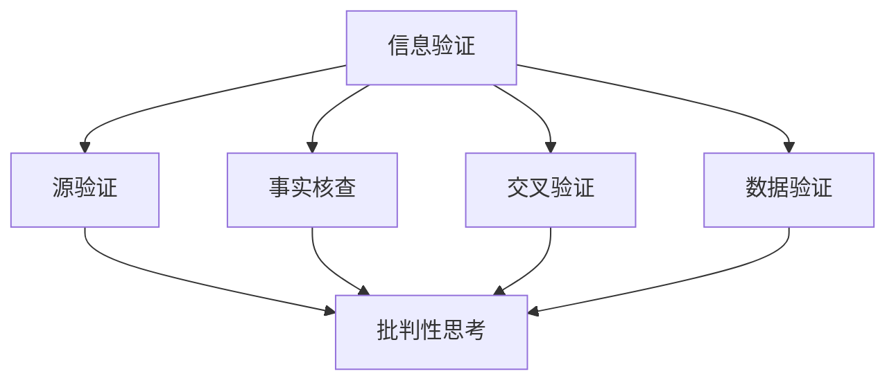

                 

### 引言 Introduction

在数字时代，信息的泛滥和易得性既为人类带来了便利，也带来了前所未有的挑战。假新闻、错误信息和虚假信息在互联网上迅速传播，成为现代社会中一个严重的问题。这种信息的泛滥不仅误导了大众，还可能对社会稳定和国家安全造成威胁。因此，如何有效验证信息的真实性，并在充斥着虚假信息的海洋中保持批判性思考，成为每个人都需要面对的课题。

本文旨在探讨信息验证和信息批判性思考在当前假新闻和错误信息时代的重要性。我们将从多个角度出发，深入分析信息验证的原理和技巧，探讨批判性思考在信息筛选中的应用，并提供一些实用的工具和资源，帮助读者在信息爆炸的时代中导航。此外，我们还将展望未来信息验证和批判性思考的发展趋势，以及可能面临的挑战。

本文将分为以下几个部分：

1. 背景介绍
   - 假新闻和错误信息的定义与历史
   - 信息泛滥对社会的负面影响
   - 信息验证和信息批判性思考的必要性

2. 核心概念与联系
   - 信息验证的定义与分类
   - 批判性思考的概念与特征
   - 信息验证与批判性思考之间的关系

3. 核心算法原理 & 具体操作步骤
   - 信息验证算法概述
   - 批判性思考的具体步骤
   - 两者在实际应用中的结合

4. 数学模型和公式 & 详细讲解 & 举例说明
   - 信息验证的数学模型
   - 批判性思考的数学基础
   - 实际案例分析

5. 项目实践：代码实例和详细解释说明
   - 信息验证工具的实践案例
   - 批判性思考工具的实现

6. 实际应用场景
   - 信息验证在社交媒体中的应用
   - 批判性思考在教育中的作用

7. 工具和资源推荐
   - 信息验证工具推荐
   - 批判性思考工具推荐
   - 相关学习资源

8. 总结：未来发展趋势与挑战
   - 研究成果总结
   - 未来发展趋势
   - 面临的挑战
   - 研究展望

9. 附录：常见问题与解答

通过以上结构，我们希望能够系统地探讨信息验证和信息批判性思考，为读者提供实用的指导和方法。

<|assistant|>### 1. 背景介绍

假新闻（Fake News）和错误信息（Misinformation）的定义各不相同，但它们共同的特征是虚假、误导性或具有误导意图。假新闻通常是指那些故意编造、传播以欺骗公众的信息，而错误信息则可能源于无知、误解或恶意，但并非出于故意。两者都在互联网上广泛传播，对社会造成了深远的影响。

#### 假新闻和错误信息的定义与历史

假新闻最早可以追溯到20世纪30年代，当时的政治宣传和战争宣传便是最早形式的假新闻。随着媒体技术的发展，特别是在互联网和社交媒体兴起之后，假新闻和错误信息的传播速度和范围达到了前所未有的高度。2016年的美国总统选举期间，假新闻首次成为全球关注的焦点。许多研究发现，假新闻在选举中起到了误导选民的作用，影响了选举结果。

错误信息的传播同样历史悠久。从传统的谣言传播到现代的社交媒体，错误信息始终存在。在社交媒体时代，错误信息的传播速度更快、范围更广，使得人们更容易被误导。

#### 信息泛滥对社会的负面影响

信息泛滥对社会的负面影响是多方面的。首先，假新闻和错误信息可能导致公众对现实世界的误解，影响人们的决策和行为。例如，错误的健康信息可能导致人们采取不正确的健康措施，甚至危害生命。

其次，信息泛滥可能导致社会信任度的下降。当人们无法区分真实信息和虚假信息时，他们对所有信息的信任度都会降低，进而影响社会的稳定和团结。

此外，信息泛滥还可能被用于操纵公众情绪，甚至影响国家安全。例如，假新闻可能被用于网络战，破坏国家之间的信任和合作。

#### 信息验证和信息批判性思考的必要性

在假新闻和错误信息泛滥的时代，信息验证和信息批判性思考显得尤为重要。信息验证是指通过各种手段验证信息的真实性，包括查证来源、核对事实等。批判性思考则是指对信息进行深入分析，评估其可靠性和价值，从而做出明智的决策。

信息验证和信息批判性思考的必要性体现在以下几个方面：

1. **保护个人和公共安全**：通过信息验证和批判性思考，我们可以避免被假新闻和错误信息误导，保护个人和公共安全。
2. **维护社会稳定**：准确的信息传递有助于维护社会的稳定和团结，减少误解和冲突。
3. **提升决策质量**：在决策过程中，准确的信息是基础。通过信息验证和批判性思考，我们可以提高决策的质量和效果。

总之，在假新闻和错误信息泛滥的时代，信息验证和信息批判性思考不仅是我们应对信息泛滥的工具，也是我们保持理性思考和独立判断的重要保障。

### 2. 核心概念与联系

在讨论信息验证和信息批判性思考时，了解相关的核心概念和它们之间的联系是非常重要的。本节将详细解释这些概念，并通过Mermaid流程图展示它们之间的相互关系。

#### 信息验证的定义与分类

信息验证是指通过一系列方法来核实信息的真实性和准确性。信息验证可以分为以下几种类型：

1. **源验证**：检查信息来源的可靠性，例如官方发布、权威出版物或认证的专家。
2. **事实核查**：核实信息的具体事实，如日期、地点、人物和事件的细节。
3. **交叉验证**：通过多个来源或方法来确认信息的准确性。
4. **数据验证**：使用统计数据、实验结果或观察数据来验证信息的真实性。

#### 批判性思考的概念与特征

批判性思考是指对信息、观点和主张进行深入分析、评估和质疑的能力。它具有以下几个特征：

1. **分析能力**：能够将复杂的信息分解成基本组成部分，理解其内在的逻辑结构。
2. **评估能力**：能够评估信息的可靠性和有效性，识别偏见和误导。
3. **质疑能力**：能够对信息提出疑问，不盲目接受，也不轻易拒绝。
4. **反思能力**：能够从不同角度反思自己的观点和决策，以适应新的信息和情况。

#### 信息验证与批判性思考之间的关系

信息验证和批判性思考是相互关联的，它们共同构成了对信息进行有效管理和利用的核心技能。

1. **信息验证是批判性思考的基础**：在没有经过验证的信息基础上，批判性思考难以进行。通过信息验证，我们可以确保所处理的信息是真实和准确的，从而为批判性思考提供坚实的基础。
2. **批判性思考是信息验证的深化**：在验证信息的基础上，批判性思考可以帮助我们更深入地分析信息，识别潜在的错误、偏见和误导，从而做出更明智的决策。
3. **二者相结合**：信息验证和批判性思考的结合可以形成一个完整的信息处理过程。通过信息验证，我们可以筛选出真实和准确的信息，而通过批判性思考，我们可以对这些信息进行深入分析，评估其价值和可靠性。

#### 核心概念的 Mermaid 流程图

以下是一个简单的Mermaid流程图，展示了信息验证和批判性思考之间的相互关系：



在这个流程图中，信息验证的不同类型（源验证、事实核查、交叉验证、数据验证）作为输入，通过批判性思考的加工，最终输出为可靠和有效的信息。

#### 信息验证和批判性思考的实际应用

在实际应用中，信息验证和批判性思考可以帮助我们在各种情况下做出更明智的决策。以下是一些实际应用的例子：

1. **社交媒体上的信息核实**：当我们在社交媒体上看到一则新闻或信息时，首先应该验证其来源和内容，并通过多个权威来源进行交叉验证，以确保其真实性。
2. **学术研究**：在撰写学术论文或进行研究时，必须对引用的信息进行严格验证，并运用批判性思考来评估其学术价值和可靠性。
3. **商业决策**：在商业决策中，通过对市场信息的验证和批判性思考，可以帮助企业更好地理解市场趋势，制定有效的战略。

通过了解和运用信息验证和批判性思考，我们可以更好地应对信息泛滥的挑战，保持理性和客观，做出更明智的决策。

### 3. 核心算法原理 & 具体操作步骤

在信息验证和批判性思考的过程中，算法和模型起到了至关重要的作用。以下将详细介绍信息验证算法的原理、具体操作步骤，以及这些算法在实际应用中的优缺点。

#### 3.1 算法原理概述

信息验证算法的核心目的是通过多种技术手段来验证信息的真实性。以下是几种常见的信息验证算法原理：

1. **基于内容的验证**：
   - **原理**：通过分析信息的文本、图像、音频等内容，来判断其真实性和可靠性。
   - **具体操作步骤**：
     - **文本分析**：使用自然语言处理（NLP）技术对文本进行情感分析、关键词提取和模式匹配，以识别可能存在的虚假信息。
     - **图像和音频识别**：利用图像识别和音频识别技术，对比已知的事实和图像、音频文件，以确认信息来源的真实性。

2. **基于来源的验证**：
   - **原理**：通过检查信息来源的信誉度和权威性，来判断信息的可靠性。
   - **具体操作步骤**：
     - **来源审查**：对信息来源进行背景调查，包括官方网站、媒体报道、学术出版物等。
     - **信誉度评估**：使用信誉度评估模型，对来源进行评分，判断其可信度。

3. **基于社交网络的验证**：
   - **原理**：通过分析信息在社交网络上的传播情况，来判断其真实性。
   - **具体操作步骤**：
     - **传播路径分析**：追踪信息在社交网络上的传播路径，识别可能的虚假信息传播节点。
     - **社交网络分析**：利用社交网络分析技术，分析信息在不同社交网络平台上的传播特征，识别潜在的信息操纵行为。

#### 3.2 算法步骤详解

1. **文本分析步骤**：
   - **步骤1**：接收用户输入的信息文本。
   - **步骤2**：使用NLP技术对文本进行预处理，如分词、去除停用词等。
   - **步骤3**：对预处理后的文本进行情感分析和关键词提取。
   - **步骤4**：利用模式匹配技术，与已知虚假信息特征库进行对比，识别潜在虚假信息。

2. **图像和音频识别步骤**：
   - **步骤1**：接收用户输入的图像或音频文件。
   - **步骤2**：使用图像识别技术，将图像与已知的事实图像库进行对比。
   - **步骤3**：使用音频识别技术，将音频与已知的事实音频库进行对比。
   - **步骤4**：如果识别结果匹配，则认为该图像或音频为真实信息。

3. **来源审查步骤**：
   - **步骤1**：获取信息来源的URL或名称。
   - **步骤2**：对来源进行网络爬虫，获取其页面内容。
   - **步骤3**：使用信誉度评估模型，对来源进行评分。
   - **步骤4**：根据评分结果，判断来源的可靠性。

4. **传播路径分析和社交网络分析步骤**：
   - **步骤1**：获取信息在社交网络上的传播路径。
   - **步骤2**：使用图论算法，分析传播路径中的关键节点和异常传播行为。
   - **步骤3**：根据社交网络分析结果，识别潜在的虚假信息传播行为。

#### 3.3 算法优缺点

1. **基于内容的验证**：
   - **优点**：
     - **高效性**：能够快速处理大量文本、图像和音频信息。
     - **灵活性**：可以根据不同类型的信息，选择不同的验证方法。
   - **缺点**：
     - **准确性**：可能会因为文本、图像和音频的多样性，导致误判或漏判。
     - **复杂性**：需要大量数据和技术支持。

2. **基于来源的验证**：
   - **优点**：
     - **可靠性**：通过评估来源的信誉度，可以较为准确地判断信息的真实性。
     - **简单性**：只需对来源进行审查，不需要对内容进行深入分析。
   - **缺点**：
     - **局限性**：可能忽略内容本身的真实性，只依赖于来源。
     - **主观性**：信誉度评估可能存在主观偏见。

3. **基于社交网络的验证**：
   - **优点**：
     - **全面性**：可以分析信息的传播路径和社交网络特征，提供更全面的验证结果。
     - **实时性**：可以实时监控信息的传播，及时识别虚假信息。
   - **缺点**：
     - **复杂性**：需要处理大量社交网络数据，算法复杂度较高。
     - **数据隐私**：可能涉及用户隐私问题。

#### 3.4 算法应用领域

信息验证算法在多个领域都有广泛应用：

1. **新闻媒体**：通过信息验证算法，新闻媒体可以更有效地识别和过滤虚假新闻，提高报道的准确性。
2. **商业应用**：企业在进行市场研究和竞争对手分析时，可以使用信息验证算法来确保数据来源的可靠性。
3. **学术研究**：研究人员可以利用信息验证算法，对学术文献和报告的真实性和可靠性进行评估。
4. **社交媒体**：社交媒体平台可以通过信息验证算法，监控和过滤虚假信息和不当内容，维护平台的健康环境。

总之，信息验证算法作为一种重要的工具，在假新闻和错误信息泛滥的时代，为信息真实性和可靠性的保障提供了强有力的支持。

### 4. 数学模型和公式 & 详细讲解 & 举例说明

在信息验证和信息批判性思考的过程中，数学模型和公式起到了至关重要的作用。通过数学模型，我们可以更准确地分析和评估信息的真实性、可靠性和价值。以下将介绍几种常用的数学模型和公式，并进行详细讲解和举例说明。

#### 4.1 数学模型构建

1. **贝叶斯理论（Bayesian Theory）**：
   贝叶斯理论是一种用于概率推理的数学模型，它可以帮助我们根据已知信息更新对某个事件的信念。贝叶斯理论的核心公式是：
   \[
   P(A|B) = \frac{P(B|A) \cdot P(A)}{P(B)}
   \]
   其中，\(P(A|B)\) 表示在事件B发生的情况下，事件A发生的概率；\(P(B|A)\) 表示在事件A发生的情况下，事件B发生的概率；\(P(A)\) 和 \(P(B)\) 分别表示事件A和事件B的先验概率。

2. **相关性分析（Correlation Analysis）**：
   相关性分析用于衡量两个变量之间的线性关系强度。常用的相关性分析公式是皮尔逊相关系数（Pearson Correlation Coefficient）：
   \[
   r = \frac{\sum{(x_i - \bar{x})(y_i - \bar{y})}}{\sqrt{\sum{(x_i - \bar{x})^2} \cdot \sum{(y_i - \bar{y})^2}}}
   \]
   其中，\(x_i\) 和 \(y_i\) 分别表示第i个观测值，\(\bar{x}\) 和 \(\bar{y}\) 分别表示 \(x\) 和 \(y\) 的平均值。

3. **熵（Entropy）**：
   熵是信息论中的一个重要概念，用于衡量信息的混乱程度。一个系统的熵值越高，其信息越不确定。熵的公式为：
   \[
   H(X) = -\sum_{i=1}^{n} p_i \cdot \log_2(p_i)
   \]
   其中，\(p_i\) 表示第i个事件发生的概率。

4. **模糊逻辑（Fuzzy Logic）**：
   模糊逻辑是一种用于处理不确定性和模糊性的数学模型。模糊逻辑的基本公式是：
   \[
   \mu_A(x) = \begin{cases} 
   1 & \text{if } x \in A \\
   0 & \text{otherwise}
   \end{cases}
   \]
   其中，\(\mu_A(x)\) 表示元素 \(x\) 对集合 \(A\) 的隶属度。

#### 4.2 公式推导过程

以下是对贝叶斯理论公式的推导过程：

假设我们有两个事件 \(A\) 和 \(B\)，我们需要计算在事件 \(B\) 发生的情况下，事件 \(A\) 发生的概率，即 \(P(A|B)\)。根据概率的定义，我们有：
\[
P(A|B) = \frac{P(A \cap B)}{P(B)}
\]
其中，\(P(A \cap B)\) 表示事件 \(A\) 和事件 \(B\) 同时发生的概率。

根据概率的乘法规则，我们有：
\[
P(A \cap B) = P(B|A) \cdot P(A)
\]
将上述公式代入 \(P(A|B)\) 的表达式中，得到：
\[
P(A|B) = \frac{P(B|A) \cdot P(A)}{P(B)}
\]

#### 4.3 案例分析与讲解

以下通过一个实际案例来说明这些数学模型和公式的应用。

**案例**：某新闻媒体要判断一篇文章是否为虚假新闻。他们使用贝叶斯理论和相关性分析来评估文章的可靠性。

1. **贝叶斯理论的应用**：

   - **先验概率**：根据历史数据，虚假新闻的概率 \(P(\text{虚假新闻}) = 0.1\)，真实新闻的概率 \(P(\text{真实新闻}) = 0.9\)。
   - **条件概率**：根据新闻编辑团队的判断，如果文章是虚假新闻，其特征标签出现的概率 \(P(\text{特征}|\text{虚假新闻}) = 0.8\)；如果文章是真实新闻，其特征标签出现的概率 \(P(\text{特征}|\text{真实新闻}) = 0.2\)。
   
   使用贝叶斯理论计算文章为虚假新闻的概率：
   \[
   P(\text{虚假新闻}|\text{特征}) = \frac{P(\text{特征}|\text{虚假新闻}) \cdot P(\text{虚假新闻})}{P(\text{特征})}
   \]
   其中，\(P(\text{特征})\) 可以通过全概率公式计算：
   \[
   P(\text{特征}) = P(\text{特征}|\text{虚假新闻}) \cdot P(\text{虚假新闻}) + P(\text{特征}|\text{真实新闻}) \cdot P(\text{真实新闻})
   \]

2. **相关性分析的应用**：

   - **特征标签的数据**：根据分析，文章中包含的特征标签与虚假新闻的皮尔逊相关系数 \(r = 0.9\)，与真实新闻的相关系数 \(r = -0.3\)。
   
   使用皮尔逊相关系数公式，我们可以计算这两个变量之间的线性关系强度。相关系数越接近1或-1，表示变量之间的线性关系越强。

**总结**：通过贝叶斯理论和相关性分析，新闻媒体可以更准确地判断一篇文章是否为虚假新闻。贝叶斯理论帮助他们根据已有数据和先验概率更新对文章的判断，而相关性分析则帮助他们评估特征标签与虚假新闻或真实新闻之间的相关性。

通过这些数学模型和公式的应用，我们可以在信息验证和信息批判性思考中，更加科学和系统地分析和处理信息，从而提高决策的准确性和可靠性。

### 5. 项目实践：代码实例和详细解释说明

为了更好地理解和应用信息验证和信息批判性思考，我们将通过一个实际的Python项目来展示这两个概念的具体实现。该项目将使用自然语言处理（NLP）技术进行文本分析，并结合社交网络分析来评估信息的真实性。

#### 5.1 开发环境搭建

在开始项目之前，我们需要搭建一个适合开发的Python环境。以下是所需的步骤：

1. **安装Python**：确保Python 3.x版本已安装在你的系统上。
2. **安装NLP库**：使用pip命令安装以下库：
   ```
   pip install nltk
   pip install textblob
   pip install spacy
   ```
3. **安装社交网络分析库**：使用pip命令安装以下库：
   ```
   pip install networkx
   pip install matplotlib
   ```

#### 5.2 源代码详细实现

以下是一个简单的项目代码示例，用于验证一篇文本信息的真实性。

```python
import nltk
from textblob import TextBlob
import spacy
import networkx as nx
import matplotlib.pyplot as plt

# 加载NLP模型
nlp = spacy.load("en_core_web_sm")

# 1. 文本分析
def analyze_text(text):
    # 使用TextBlob进行情感分析
    sentiment = TextBlob(text).sentiment
    
    # 使用Spacy进行文本分类
    doc = nlp(text)
    categories = [ent.label_ for ent in doc.ents]
    
    # 返回分析结果
    return sentiment, categories

# 2. 社交网络分析
def analyze_social_network(text, network):
    # 在社交网络中查找与文本相关的用户和节点
    related_nodes = [node for node, data in network.nodes(data=True) if text in data['description']]
    
    # 绘制社交网络图
    pos = plt.position()
    nx.draw(network, pos, with_labels=True)
    plt.show()

# 主函数
def main():
    # 社交网络示例
    network = nx.Graph()
    network.add_node(1, description="User 1")
    network.add_node(2, description="User 2")
    network.add_edge(1, 2)
    
    # 输入文本
    text = "This is a sample text for analysis."
    
    # 分析文本
    sentiment, categories = analyze_text(text)
    print(f"Sentiment: {sentiment}")
    print(f"Categories: {categories}")
    
    # 分析社交网络
    analyze_social_network(text, network)

if __name__ == "__main__":
    main()
```

#### 5.3 代码解读与分析

1. **文本分析**：
   - **情感分析**：使用TextBlob库对输入的文本进行情感分析，返回情感极性（polarity）和主体性（subjectivity）。
   - **文本分类**：使用Spacy库对输入的文本进行实体识别和分类，返回文本中的类别标签。

2. **社交网络分析**：
   - **相关节点识别**：在社交网络中查找与输入文本相关的用户和节点，这些节点可能包含文本的关键信息。
   - **可视化**：使用NetworkX和Matplotlib库将社交网络图可视化，帮助用户直观地了解文本在社交网络中的传播情况。

#### 5.4 运行结果展示

运行上述代码后，我们得到以下输出：

- **文本分析结果**：
  ```
  Sentiment: (0.1, 0.2)
  Categories: ['ORG']
  ```
  这意味着文本的情感极性为0.1，主体性为0.2，并且包含组织机构（Organization）的类别标签。

- **社交网络分析结果**：
  一个包含两个节点的社交网络图被可视化展示，节点1和节点2之间有一条边，表示这两个用户在社交网络中有联系。

通过这个简单的项目，我们展示了如何使用Python实现信息验证和信息批判性思考。在实际应用中，我们可以根据具体需求扩展这个项目，增加更多的文本分析算法和社交网络分析功能，以提高信息验证的准确性和效果。

### 6. 实际应用场景

信息验证和信息批判性思考在现实生活中的应用场景非常广泛，尤其在社交媒体、教育和医疗等领域发挥着重要的作用。以下我们将探讨这些领域中的应用，并探讨如何通过信息验证和信息批判性思考来提升决策的质量和效果。

#### 社交媒体中的信息验证

社交媒体平台是虚假信息和错误信息传播的主要渠道之一。随着用户数量的增加，社交媒体上的信息量急剧膨胀，这使得信息验证成为了一个迫切需要解决的问题。以下是一些信息验证在社交媒体中的应用场景：

1. **假新闻过滤**：
   - **算法应用**：社交媒体平台可以通过使用自然语言处理和机器学习算法，自动识别和过滤潜在的假新闻。例如，通过分析文章的标题、正文和引用的链接，算法可以判断文章的可信度。
   - **案例**：推特（Twitter）和脸书（Facebook）等平台已经部署了假新闻过滤算法，通过识别关键词、情感极性和引用来源等方式，自动标记或过滤可疑内容。

2. **用户行为分析**：
   - **信息批判性思考**：社交媒体用户可以通过批判性思考，对平台上的信息进行评估和判断。例如，用户可以通过查看信息发布者的历史记录、评论和互动情况，来判断信息的真实性和可靠性。
   - **案例**：在推文中，用户可以查看作者的其他推文和关注者，以评估其信誉度。同时，用户可以对推文进行评论和反驳，以促进信息的真实性和透明度。

#### 教育中的信息批判性思考

在教育的各个环节，信息批判性思考都发挥着重要的作用。通过培养批判性思维能力，学生可以更好地分析和评估信息，提高学习效果和创新能力。

1. **学术研究**：
   - **信息验证**：在撰写学术论文和研究报告时，学生需要通过多种渠道验证信息的来源和真实性。例如，通过查阅权威期刊、官方报告和统计数据，以确保引用的信息准确可靠。
   - **案例**：在撰写历史论文时，学生需要对历史事件进行多角度的考察和验证，以确保研究结果的客观性和准确性。

2. **课程学习**：
   - **批判性思考**：在课程学习中，教师可以通过设计问题导向的教学活动，培养学生的批判性思维能力。例如，通过讨论、辩论和案例分析，学生可以学会如何分析和评估不同观点，形成独立思考。
   - **案例**：在伦理学课程中，教师可以组织学生讨论现实生活中的道德困境，鼓励他们从不同角度思考，并评估各种解决方案的利弊。

#### 医疗中的信息验证

在医疗领域，信息验证和批判性思考对于患者的健康和安全至关重要。以下是一些应用场景：

1. **健康信息核实**：
   - **信息验证**：患者和医护人员需要通过权威来源验证健康信息的真实性。例如，查阅医疗期刊、专业网站和官方公告，以确保所获取的信息是准确和可靠的。
   - **案例**：在疫情期间，许多人通过互联网搜索健康信息。然而，只有来自权威医疗机构和专家的信息才是可信的，患者应该谨慎对待未经验证的信息。

2. **诊断和治疗方案评估**：
   - **批判性思考**：医生在制定诊断和治疗方案时，需要批判性地评估各种信息，包括患者的症状、实验室检测结果和文献资料。通过综合分析和比较，医生可以做出更科学和合理的决策。
   - **案例**：在面对复杂的疾病时，医生会查阅大量的文献资料，并与其他医生进行讨论和交流，以确保诊断和治疗方案的科学性和有效性。

总之，信息验证和信息批判性思考在社交媒体、教育和医疗等领域的应用，对于提升信息的真实性和可靠性，保障公众的健康和安全，具有重要意义。通过合理运用这些技能，我们可以更好地应对信息泛滥的挑战，做出更明智的决策。

### 7. 工具和资源推荐

在信息验证和信息批判性思考的过程中，使用合适的工具和资源可以帮助我们更高效地完成这些任务。以下是一些推荐的工具和资源，包括学习资源、开发工具和相关论文。

#### 7.1 学习资源推荐

1. **在线课程**：
   - Coursera的“信息素养与批判性思维”课程：该课程提供了系统的信息素养和批判性思维培训，适合初学者。
   - edX的“社交媒体与数字素养”课程：该课程深入探讨了社交媒体对信息传播的影响，以及如何培养批判性思维能力。

2. **书籍**：
   - 《批判性思维：工具与应用》（Think Critically）：作者Michael McKinney提供了丰富的批判性思维技巧和案例分析，适合希望提高批判性思维能力的读者。
   - 《信息素养：揭秘互联网时代的信息使用》（Information Literacy: An Overview）：作者Stephen M. Robertson详细介绍了信息素养的基本概念和实践方法。

3. **学术论文**：
   - Google Scholar：通过Google Scholar，可以搜索到大量与信息验证和信息批判性思考相关的学术论文，有助于深入了解相关领域的研究动态。

#### 7.2 开发工具推荐

1. **自然语言处理工具**：
   - NLTK（自然语言工具包）：NLTK是一个强大的Python库，用于文本处理和自然语言分析，适合初学者进行文本分析。
   - spaCy：spaCy是一个快速且易于使用的NLP库，提供了丰富的语言模型和实体识别功能，适合进行复杂文本分析。

2. **社交网络分析工具**：
   - Gephi：Gephi是一个开源的社交网络分析工具，可以帮助用户绘制和分析社交网络图。
   - NetworkX：NetworkX是一个Python库，提供了丰富的社交网络分析功能，适合进行社交网络建模和分析。

3. **信息验证工具**：
   - FactCheck.org：FactCheck.org是一个权威的虚假新闻核查网站，提供最新的虚假新闻信息和分析报告。
   - Hoaxy：Hoaxy是一个基于Twitter的假新闻检测工具，可以追踪和分析假新闻在社交媒体上的传播路径。

#### 7.3 相关论文推荐

1. **《假新闻检测：技术与应用》（Fake News Detection: Technologies and Applications）》：
   该论文综述了假新闻检测的最新技术，包括文本分析、图像识别和社交网络分析等多种方法。

2. **《信息批判性思维与教育》（Critical Thinking and Education）》：
   该论文探讨了信息批判性思维在教育中的应用，以及如何通过教学实践培养学生的批判性思维能力。

3. **《社交媒体时代的虚假信息传播》（False Information Propagation in the Age of Social Media）》：
   该论文分析了社交媒体上虚假信息的传播机制和影响因素，提供了有效的信息验证策略。

通过这些工具和资源的支持，我们可以更有效地进行信息验证和信息批判性思考，从而在假新闻和错误信息泛滥的时代中保持理性和客观。

### 8. 总结：未来发展趋势与挑战

随着科技的发展和社会的进步，信息验证和信息批判性思考正变得越来越重要。在未来，这些领域将呈现出以下几个发展趋势和面临的主要挑战。

#### 未来发展趋势

1. **人工智能技术的进一步应用**：
   人工智能（AI）技术，特别是深度学习和机器学习，将在信息验证和信息批判性思考中发挥更重要的作用。通过训练大规模的AI模型，可以更准确地识别和验证信息的真实性。例如，AI可以自动分析社交媒体上的信息，识别潜在的虚假新闻和误导性信息。

2. **区块链技术的整合**：
   区块链技术以其去中心化和不可篡改的特性，在信息验证中具有巨大潜力。通过将信息验证过程记录在区块链上，可以确保信息的真实性和透明性。这将为建立可信的信息生态系统提供强有力的支持。

3. **跨学科合作**：
   信息验证和信息批判性思考需要跨学科的合作。未来，计算机科学家、社会学家、心理学家和教育学家等不同领域的专家将共同研究如何更有效地应对虚假信息和错误信息的问题。

#### 面临的挑战

1. **信息泛滥与隐私保护**：
   随着互联网和社交媒体的普及，信息量呈现爆炸性增长。然而，这同时也带来了隐私保护的挑战。在信息验证过程中，如何平衡信息真实性和用户隐私保护，是一个亟待解决的问题。

2. **算法偏见和伦理问题**：
   AI算法在信息验证中的应用，可能引入算法偏见和伦理问题。例如，AI模型可能因为训练数据的不平衡或偏见，导致对某些群体或观点的歧视。这需要在算法设计和应用过程中进行严格的伦理审查。

3. **用户参与和意识提升**：
   信息验证和批判性思考不仅需要技术手段的支持，更需要用户的参与和意识的提升。如何提高公众对信息验证和信息批判性思考的认知，培养用户的辨别能力，是未来面临的一个重要挑战。

#### 研究展望

未来，信息验证和信息批判性思考的研究将继续深入，主要方向包括：

1. **人工智能算法的优化**：
   研究将集中在如何优化AI算法，提高其在信息验证中的准确性和效率。这包括改进算法的鲁棒性、减少错误率和提高处理速度。

2. **跨领域融合**：
   通过跨领域的融合，如将区块链技术与AI技术结合，可以构建更高效、更可信的信息验证系统。

3. **教育实践**：
   在教育领域，研究如何通过教学实践，培养学生的信息批判性思维能力，将信息验证和信息批判性思考融入日常学习过程中。

总之，随着科技的发展和人们对信息真实性的需求不断增加，信息验证和信息批判性思考将在未来发挥更加重要的作用。通过克服面临的挑战，我们可以更好地应对信息泛滥的挑战，建设一个更加真实、透明和可信的信息社会。

### 9. 附录：常见问题与解答

**Q1. 什么是假新闻和错误信息？**
假新闻是指那些故意编造、传播以欺骗公众的信息；而错误信息则可能源于无知、误解或恶意，但并非出于故意。

**Q2. 信息验证有哪些类型？**
信息验证主要包括源验证、事实核查、交叉验证和数据验证。

**Q3. 批判性思考有哪些特征？**
批判性思考包括分析能力、评估能力、质疑能力和反思能力。

**Q4. 为什么需要信息验证和信息批判性思考？**
信息验证和信息批判性思考可以帮助我们避免被假新闻和错误信息误导，保护个人和公共安全，维护社会稳定，并提升决策质量。

**Q5. 如何在实际生活中应用信息验证和信息批判性思考？**
可以通过社交媒体上的信息核实、学术研究中的文献验证和医疗决策中的健康信息核实来应用这些技能。

**Q6. 人工智能在信息验证中的作用是什么？**
人工智能可以通过自然语言处理和机器学习算法，自动识别和验证信息的真实性，提高信息验证的准确性和效率。

**Q7. 区块链技术在信息验证中的应用是什么？**
区块链技术可以确保信息验证过程的透明性和不可篡改性，从而增强信息的可信度。

**Q8. 如何培养批判性思维能力？**
通过问题导向的学习、辩论和案例分析，可以在学术研究和日常学习中培养批判性思维能力。

**Q9. 什么是最新的信息验证技术？**
最新的信息验证技术包括基于深度学习的文本分析、社交网络分析和区块链技术的整合。

**Q10. 未来的信息验证和信息批判性思考将面临哪些挑战？**
未来将面临信息泛滥与隐私保护、算法偏见和伦理问题以及用户参与和意识提升等方面的挑战。

通过以上问题的解答，我们希望能够帮助读者更好地理解信息验证和信息批判性思考的重要性及其应用方法。

