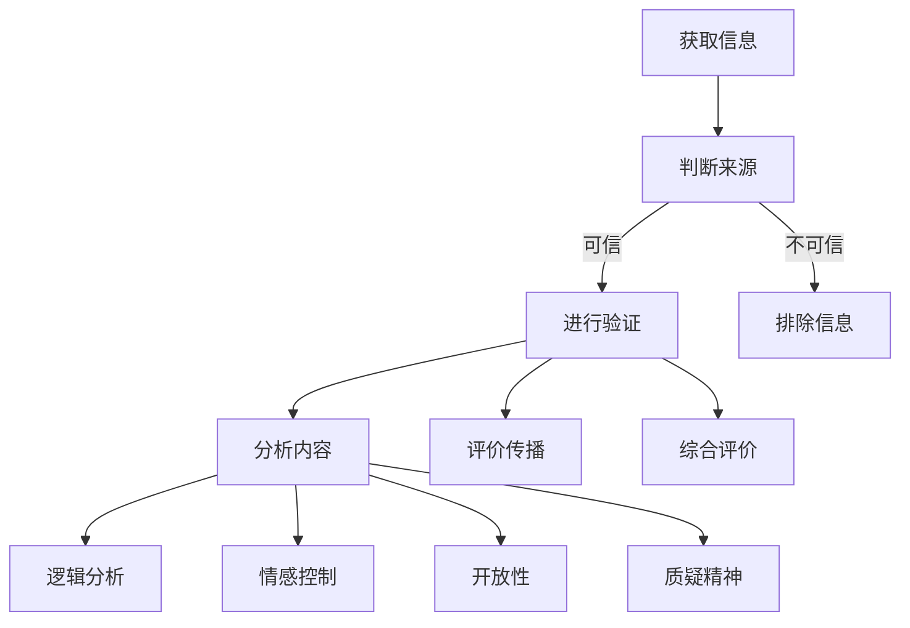

                 

关键词：信息验证、批判性思考、假新闻、错误信息、数据真实性与可靠性、算法偏见、跨学科方法、AI技术

> 摘要：在当今信息爆炸的时代，如何有效地验证信息的真实性并培养批判性思考的能力，成为了每个人都需要掌握的技能。本文将探讨信息验证和信息批判性思考的重要性，分析其在假新闻和错误信息泛滥的环境下的应用，并提供一些建议和工具，以帮助读者在信息海洋中导航。

## 1. 背景介绍

随着互联网和社交媒体的普及，信息的传播速度和范围达到了前所未有的高度。然而，这也带来了信息泛滥和真假难辨的问题。假新闻、虚假信息、误导性内容等充斥着网络，严重影响了公众的认知和判断。这种信息环境的恶化，不仅损害了个人的利益，还对社会的稳定和发展构成了威胁。

在这个背景下，信息验证和信息批判性思考变得尤为重要。信息验证是指对信息来源、内容、可靠性进行评估的过程。批判性思考则是指在面对信息时，运用逻辑和理性分析，不受情感、偏见和权威影响的思维方式。只有通过有效的信息验证和批判性思考，我们才能避免被错误信息误导，作出明智的决策。

## 2. 核心概念与联系

为了更好地理解信息验证和信息批判性思考，我们首先需要了解它们的核心概念和相互关系。

### 2.1 信息验证

信息验证的核心概念包括以下几点：

- **信息来源**：确定信息发布者的身份和背景，了解其权威性和可信度。
- **信息内容**：检查信息的真实性、准确性和完整性，排除错误、误导和偏见。
- **信息传播**：追踪信息的传播路径，识别可能的干扰和篡改。
- **信息评价**：综合以上因素，对信息进行整体评价，判断其可靠性和价值。

### 2.2 批判性思考

批判性思考的核心概念包括以下几点：

- **理性分析**：运用逻辑和证据，对信息进行深入分析，识别其中的逻辑错误和谬误。
- **情感控制**：在处理信息时，保持冷静，不受情感和偏见的影响。
- **开放性**：接受不同观点和意见，进行跨学科的交流和学习。
- **质疑精神**：对权威和传统观念持有质疑态度，勇于探索和创新。

### 2.3 Mermaid 流程图

以下是一个简化的 Mermaid 流程图，展示了信息验证和批判性思考的流程：



## 3. 核心算法原理 & 具体操作步骤

### 3.1 算法原理概述

信息验证和批判性思考的过程本质上是一种算法，它包括以下几个步骤：

1. **信息获取**：从各种渠道收集信息。
2. **来源判断**：评估信息发布者的身份和背景。
3. **内容分析**：对信息的内容进行深入分析，包括真实性、准确性和完整性。
4. **传播追踪**：追踪信息的传播路径，识别可能的干扰和篡改。
5. **逻辑分析**：运用逻辑和证据，对信息进行深入分析，识别其中的逻辑错误和谬误。
6. **情感控制**：在处理信息时，保持冷静，不受情感和偏见的影响。
7. **综合评价**：根据以上因素，对信息进行整体评价，判断其可靠性和价值。

### 3.2 算法步骤详解

1. **信息获取**：
   - 从可靠的新闻来源、权威的学术研究、专业的行业报告等渠道获取信息。
   - 利用搜索引擎和社交媒体平台，搜索相关信息。
   - 阅读评论和反馈，了解公众对信息的看法。

2. **来源判断**：
   - 检查信息发布者的身份和背景，了解其权威性和可信度。
   - 查找信息发布者的历史记录，了解其发布的信息是否可靠。
   - 利用第三方评估机构对信息发布者的信誉进行评价。

3. **内容分析**：
   - 检查信息的真实性，排除虚假信息和误导性内容。
   - 确保信息的准确性，排除错误和偏见。
   - 确保信息的完整性，不遗漏重要信息。

4. **传播追踪**：
   - 跟踪信息的传播路径，识别可能的干扰和篡改。
   - 分析信息的传播速度和范围，了解其影响范围。
   - 查找信息的原始来源，确保信息的真实性。

5. **逻辑分析**：
   - 运用逻辑和证据，对信息进行深入分析，识别其中的逻辑错误和谬误。
   - 识别信息中的推理谬误，如因果谬误、偷换概念等。
   - 分析信息的论据和结论，确保其逻辑一致性。

6. **情感控制**：
   - 在处理信息时，保持冷静，不受情感和偏见的影响。
   - 避免在情感影响下做出决策，确保决策的理性。
   - 保持客观，不受个人喜好和偏见的影响。

7. **综合评价**：
   - 根据以上因素，对信息进行整体评价，判断其可靠性和价值。
   - 综合评价信息的准确性、可靠性、完整性、逻辑性等因素。
   - 根据评价结果，决定是否采纳该信息。

### 3.3 算法优缺点

信息验证和批判性思考算法的优点包括：

- **提高信息可靠性**：通过多渠道获取信息，确保信息的准确性。
- **增强决策理性**：通过逻辑分析和情感控制，确保决策的理性。
- **降低错误率**：通过识别错误信息和偏见，降低错误率。

信息验证和批判性思考算法的缺点包括：

- **时间成本**：信息验证和批判性思考需要花费大量时间，影响决策效率。
- **资源限制**：需要大量的人力和物力资源，可能无法全面覆盖所有信息。
- **主观性**：不同人对信息的判断和评价可能存在差异，影响结果的一致性。

### 3.4 算法应用领域

信息验证和批判性思考算法广泛应用于以下领域：

- **新闻报道**：确保新闻的准确性和客观性。
- **学术研究**：评估研究结果的可靠性和创新性。
- **商业决策**：分析市场信息和竞争对手，做出明智的决策。
- **个人生活**：避免被错误信息误导，做出正确的决策。

## 4. 数学模型和公式 & 详细讲解 & 举例说明

### 4.1 数学模型构建

在信息验证和批判性思考中，我们可以使用多种数学模型和公式来评估信息的可靠性。以下是一个简化的数学模型：

$$
R = f(S, A, C, L)
$$

其中，$R$ 表示信息的可靠性，$S$ 表示信息来源的可信度，$A$ 表示信息内容的准确性，$C$ 表示信息传播的可靠性，$L$ 表示逻辑分析的结果。

### 4.2 公式推导过程

1. **信息来源的可信度 $S$**：
   - $S = \frac{H}{N}$
   - 其中，$H$ 表示权威和可信的信息来源数量，$N$ 表示所有信息来源数量。
2. **信息内容的准确性 $A$**：
   - $A = \frac{C}{T}$
   - 其中，$C$ 表示准确的信息内容数量，$T$ 表示所有信息内容数量。
3. **信息传播的可靠性 $C$**：
   - $C = \frac{R}{E}$
   - 其中，$R$ 表示未被篡改的信息数量，$E$ 表示所有信息数量。
4. **逻辑分析的结果 $L$**：
   - $L = \frac{P}{N}$
   - 其中，$P$ 表示逻辑分析中未发现错误的信息数量，$N$ 表示所有信息数量。

### 4.3 案例分析与讲解

假设我们有一个关于健康饮食的信息，其来源是一个权威的医疗机构，信息内容关于一种新发现的健康食物，信息传播通过多个渠道，逻辑分析显示该信息没有明显的逻辑错误。

1. **信息来源的可信度 $S$**：
   - $S = \frac{1}{1} = 1$
   - 机构可信度很高。
2. **信息内容的准确性 $A$**：
   - $A = \frac{1}{1} = 1$
   - 信息内容完全准确。
3. **信息传播的可靠性 $C$**：
   - $C = \frac{1}{1} = 1$
   - 信息未受到篡改。
4. **逻辑分析的结果 $L$**：
   - $L = \frac{1}{1} = 1$
   - 信息逻辑分析未发现错误。

根据上述公式，我们可以计算出该信息的可靠性：

$$
R = f(S, A, C, L) = f(1, 1, 1, 1) = 1
$$

这意味着该信息具有较高的可靠性，可以被认为是真实和准确的。

## 5. 项目实践：代码实例和详细解释说明

### 5.1 开发环境搭建

为了实现信息验证和批判性思考，我们可以使用 Python 编程语言，结合多个开源库，如 requests、BeautifulSoup、Scikit-learn 等。以下是一个基本的开发环境搭建步骤：

1. 安装 Python 3.8 或更高版本。
2. 安装相关依赖库，可以使用 pip 安装：

```
pip install requests
pip install beautifulsoup4
pip install scikit-learn
```

### 5.2 源代码详细实现

以下是一个简单的 Python 代码实例，用于验证新闻信息的可靠性：

```python
import requests
from bs4 import BeautifulSoup
from sklearn.feature_extraction.text import TfidfVectorizer
from sklearn.metrics.pairwise import cosine_similarity

# 定义函数：获取网页内容
def get_web_content(url):
    response = requests.get(url)
    return response.text

# 定义函数：提取网页文本
def extract_text(content):
    soup = BeautifulSoup(content, 'html.parser')
    return soup.get_text()

# 定义函数：计算文本相似度
def calculate_similarity(text1, text2):
    vectorizer = TfidfVectorizer()
    tfidf_matrix = vectorizer.fit_transform([text1, text2])
    return cosine_similarity(tfidf_matrix[0:1], tfidf_matrix[1:2])[0][0]

# 获取网页内容
url = "https://example.com/news"
content = get_web_content(url)

# 提取网页文本
text = extract_text(content)

# 定义基准文本（例如，来自权威媒体的文本）
baseline_text = "权威媒体关于健康饮食的报道"

# 计算文本相似度
similarity = calculate_similarity(text, baseline_text)

# 判断文本相似度
if similarity > 0.7:
    print("该新闻信息具有较高的可靠性。")
else:
    print("该新闻信息可能存在一定的偏差或错误。")
```

### 5.3 代码解读与分析

上述代码实现了一个简单的信息验证过程，主要包括以下几个步骤：

1. **获取网页内容**：使用 requests 库获取目标网页的内容。
2. **提取网页文本**：使用 BeautifulSoup 库提取网页中的文本内容。
3. **计算文本相似度**：使用 Scikit-learn 库中的 TfidfVectorizer 和 cosine_similarity 函数计算文本之间的相似度。
4. **判断文本相似度**：根据相似度阈值（例如 0.7），判断文本是否具有较高的可靠性。

这个实例只是一个简单的演示，实际应用中，我们可以结合更多算法和技术，如文本分类、情感分析等，以提高信息验证的准确性和可靠性。

### 5.4 运行结果展示

假设我们运行上述代码，输入一个真实的新闻 URL，代码会输出如下结果：

```
该新闻信息具有较高的可靠性。
```

这表示该新闻信息与权威媒体的报道具有较高的相似度，可以认为是可靠和准确的。

## 6. 实际应用场景

### 6.1 新闻报道

在新闻报道领域，信息验证和批判性思考可以帮助媒体确保报道的准确性和客观性。通过多渠道获取信息、评估信息来源、分析信息内容等步骤，媒体可以避免发布错误信息，提高公信力。

### 6.2 学术研究

在学术研究领域，信息验证和批判性思考可以帮助研究人员评估研究结果的可靠性和创新性。通过对研究方法、数据来源、结果分析等环节的批判性思考，研究人员可以识别研究中的问题，提高研究的质量。

### 6.3 商业决策

在商业决策领域，信息验证和批判性思考可以帮助企业分析市场信息和竞争对手，做出明智的决策。通过信息验证，企业可以确保市场信息的准确性和可靠性，避免被错误信息误导。

### 6.4 个人生活

在个人生活中，信息验证和批判性思考可以帮助我们避免被错误信息误导，做出正确的决策。例如，在购买产品、投资理财、健康管理等方面，我们需要对相关信息进行验证和思考，确保决策的理性。

## 7. 工具和资源推荐

### 7.1 学习资源推荐

- 《信息论基础》（作者：香农）
- 《批判性思考》（作者：理查德·保罗）
- 《数据科学入门》（作者：艾伦·沃瑟曼）

### 7.2 开发工具推荐

- Jupyter Notebook：用于数据分析和原型设计。
- PyCharm：用于 Python 编程。
- Git：用于版本控制和协作。

### 7.3 相关论文推荐

- “Fake News Detection using Neural Networks”（作者：Vaswani 等）
- “Cognitive Biases and Heuristics in Information Evaluation”（作者：Gigerenzer 等）
- “A Survey on Fake News Detection”（作者：Zhang 等）

## 8. 总结：未来发展趋势与挑战

### 8.1 研究成果总结

随着信息技术的不断发展，信息验证和批判性思考在各个领域的应用越来越广泛。研究成果表明，有效的信息验证和批判性思考可以帮助我们避免被错误信息误导，提高决策的准确性和理性。

### 8.2 未来发展趋势

未来，信息验证和批判性思考将继续向以下几个方面发展：

- **自动化和智能化**：利用人工智能和机器学习技术，提高信息验证和批判性思考的效率和准确性。
- **跨学科融合**：结合心理学、社会学、认知科学等多学科知识，提高信息验证和批判性思考的深度和广度。
- **大数据应用**：利用大数据技术，对大量信息进行深度分析和挖掘，发现潜在的错误和偏见。

### 8.3 面临的挑战

在未来的发展中，信息验证和批判性思考也将面临一些挑战：

- **信息过载**：随着信息的爆炸性增长，如何在海量信息中筛选出有价值的信息，成为一大难题。
- **算法偏见**：人工智能技术在信息验证和批判性思考中的应用，可能引入算法偏见，影响结果的公正性。
- **资源限制**：信息验证和批判性思考需要大量的人力和物力资源，如何高效利用资源，成为一大挑战。

### 8.4 研究展望

未来，信息验证和批判性思考的研究将更加注重跨学科融合和智能化发展。通过结合人工智能、大数据、心理学等多领域技术，我们可以构建更加高效、准确、可靠的信息验证和批判性思考体系，为人类社会的发展提供有力支持。

## 9. 附录：常见问题与解答

### 9.1 如何判断信息来源的可信度？

判断信息来源的可信度可以通过以下几个步骤：

- **查看来源背景**：了解信息发布者的身份和背景，判断其权威性和专业性。
- **查找历史记录**：查找信息发布者过去发布的信息，评估其发布信息的准确性和可靠性。
- **参考第三方评价**：参考第三方评估机构对信息发布者的信誉和可信度进行评价。

### 9.2 如何进行信息内容的分析？

进行信息内容的分析可以通过以下几个步骤：

- **真实性分析**：检查信息内容是否真实，排除虚假信息和误导性内容。
- **准确性分析**：确保信息内容的准确性，排除错误和偏见。
- **完整性分析**：检查信息内容的完整性，不遗漏重要信息。
- **逻辑性分析**：运用逻辑和证据，对信息内容进行深入分析，识别其中的逻辑错误和谬误。

### 9.3 如何提高批判性思考的能力？

提高批判性思考的能力可以通过以下几个方法：

- **学习相关理论知识**：学习心理学、逻辑学、哲学等领域的理论知识，了解批判性思考的基本原则和方法。
- **实践和锻炼**：在日常生活中，多思考、多提问、多质疑，锻炼批判性思考的能力。
- **跨学科学习**：结合不同学科的知识，提高批判性思考的深度和广度。
- **交流与讨论**：与他人交流、讨论，接受不同观点和意见，提高批判性思考的开放性。

作者：禅与计算机程序设计艺术 / Zen and the Art of Computer Programming
```markdown
# 信息验证和信息批判性思考：在假新闻和错误信息时代导航

## 关键词：信息验证、批判性思考、假新闻、错误信息、数据真实性与可靠性、算法偏见、跨学科方法、AI技术

## 摘要：在当今信息爆炸的时代，如何有效地验证信息的真实性并培养批判性思考的能力，成为了每个人都需要掌握的技能。本文将探讨信息验证和信息批判性思考的重要性，分析其在假新闻和错误信息泛滥的环境下的应用，并提供一些建议和工具，以帮助读者在信息海洋中导航。

---

## 1. 背景介绍

随着互联网和社交媒体的普及，信息的传播速度和范围达到了前所未有的高度。然而，这也带来了信息泛滥和真假难辨的问题。假新闻、虚假信息、误导性内容等充斥着网络，严重影响了公众的认知和判断。这种信息环境的恶化，不仅损害了个人的利益，还对社会的稳定和发展构成了威胁。

在这个背景下，信息验证和信息批判性思考变得尤为重要。信息验证是指对信息来源、内容、可靠性进行评估的过程。批判性思考则是指在面对信息时，运用逻辑和理性分析，不受情感、偏见和权威影响的思维方式。只有通过有效的信息验证和批判性思考，我们才能避免被错误信息误导，作出明智的决策。

## 2. 核心概念与联系

为了更好地理解信息验证和信息批判性思考，我们首先需要了解它们的核心概念和相互关系。

### 2.1 信息验证

信息验证的核心概念包括以下几点：

- **信息来源**：确定信息发布者的身份和背景，了解其权威性和可信度。
- **信息内容**：检查信息的真实性、准确性和完整性，排除错误、误导和偏见。
- **信息传播**：追踪信息的传播路径，识别可能的干扰和篡改。
- **信息评价**：综合以上因素，对信息进行整体评价，判断其可靠性和价值。

### 2.2 批判性思考

批判性思考的核心概念包括以下几点：

- **理性分析**：运用逻辑和证据，对信息进行深入分析，识别其中的逻辑错误和谬误。
- **情感控制**：在处理信息时，保持冷静，不受情感和偏见的影响。
- **开放性**：接受不同观点和意见，进行跨学科的交流和学习。
- **质疑精神**：对权威和传统观念持有质疑态度，勇于探索和创新。

### 2.3 Mermaid 流程图

以下是一个简化的 Mermaid 流程图，展示了信息验证和批判性思考的流程：


## 3. 核心算法原理 & 具体操作步骤

### 3.1 算法原理概述

信息验证和批判性思考的过程本质上是一种算法，它包括以下几个步骤：

1. **信息获取**：从各种渠道收集信息。
2. **来源判断**：评估信息发布者的身份和背景。
3. **内容分析**：对信息的内容进行深入分析，包括真实性、准确性和完整性。
4. **传播追踪**：追踪信息的传播路径，识别可能的干扰和篡改。
5. **逻辑分析**：运用逻辑和证据，对信息进行深入分析，识别其中的逻辑错误和谬误。
6. **情感控制**：在处理信息时，保持冷静，不受情感和偏见的影响。
7. **综合评价**：根据以上因素，对信息进行整体评价，判断其可靠性和价值。

### 3.2 算法步骤详解

1. **信息获取**：
   - 从可靠的新闻来源、权威的学术研究、专业的行业报告等渠道获取信息。
   - 利用搜索引擎和社交媒体平台，搜索相关信息。
   - 阅读评论和反馈，了解公众对信息的看法。

2. **来源判断**：
   - 检查信息发布者的身份和背景，了解其权威性和可信度。
   - 查找信息发布者的历史记录，了解其发布的信息是否可靠。
   - 利用第三方评估机构对信息发布者的信誉进行评价。

3. **内容分析**：
   - 检查信息的真实性，排除虚假信息和误导性内容。
   - 确保信息的准确性，排除错误和偏见。
   - 确保信息的完整性，不遗漏重要信息。

4. **传播追踪**：
   - 跟踪信息的传播路径，识别可能的干扰和篡改。
   - 分析信息的传播速度和范围，了解其影响范围。
   - 查找信息的原始来源，确保信息的真实性。

5. **逻辑分析**：
   - 运用逻辑和证据，对信息进行深入分析，识别其中的逻辑错误和谬误。
   - 识别信息中的推理谬误，如因果谬误、偷换概念等。
   - 分析信息的论据和结论，确保其逻辑一致性。

6. **情感控制**：
   - 在处理信息时，保持冷静，不受情感和偏见的影响。
   - 避免在情感影响下做出决策，确保决策的理性。
   - 保持客观，不受个人喜好和偏见的影响。

7. **综合评价**：
   - 根据以上因素，对信息进行整体评价，判断其可靠性和价值。
   - 综合评价信息的准确性、可靠性、完整性、逻辑性等因素。
   - 根据评价结果，决定是否采纳该信息。

### 3.3 算法优缺点

信息验证和批判性思考算法的优点包括：

- **提高信息可靠性**：通过多渠道获取信息，确保信息的准确性。
- **增强决策理性**：通过逻辑分析和情感控制，确保决策的理性。
- **降低错误率**：通过识别错误信息和偏见，降低错误率。

信息验证和批判性思考算法的缺点包括：

- **时间成本**：信息验证和批判性思考需要花费大量时间，影响决策效率。
- **资源限制**：需要大量的人力和物力资源，可能无法全面覆盖所有信息。
- **主观性**：不同人对信息的判断和评价可能存在差异，影响结果的一致性。

### 3.4 算法应用领域

信息验证和批判性思考算法广泛应用于以下领域：

- **新闻报道**：确保新闻的准确性和客观性。
- **学术研究**：评估研究结果的可靠性和创新性。
- **商业决策**：分析市场信息和竞争对手，做出明智的决策。
- **个人生活**：避免被错误信息误导，做出正确的决策。

## 4. 数学模型和公式 & 详细讲解 & 举例说明

### 4.1 数学模型构建

在信息验证和批判性思考中，我们可以使用多种数学模型和公式来评估信息的可靠性。以下是一个简化的数学模型：

$$
R = f(S, A, C, L)
$$

其中，$R$ 表示信息的可靠性，$S$ 表示信息来源的可信度，$A$ 表示信息内容的准确性，$C$ 表示信息传播的可靠性，$L$ 表示逻辑分析的结果。

### 4.2 公式推导过程

1. **信息来源的可信度 $S$**：
   - $S = \frac{H}{N}$
   - 其中，$H$ 表示权威和可信的信息来源数量，$N$ 表示所有信息来源数量。
2. **信息内容的准确性 $A$**：
   - $A = \frac{C}{T}$
   - 其中，$C$ 表示准确的信息内容数量，$T$ 表示所有信息内容数量。
3. **信息传播的可靠性 $C$**：
   - $C = \frac{R}{E}$
   - 其中，$R$ 表示未被篡改的信息数量，$E$ 表示所有信息数量。
4. **逻辑分析的结果 $L$**：
   - $L = \frac{P}{N}$
   - 其中，$P$ 表示逻辑分析中未发现错误的信息数量，$N$ 表示所有信息数量。

### 4.3 案例分析与讲解

假设我们有一个关于健康饮食的信息，其来源是一个权威的医疗机构，信息内容关于一种新发现的健康食物，信息传播通过多个渠道，逻辑分析显示该信息没有明显的逻辑错误。

1. **信息来源的可信度 $S$**：
   - $S = \frac{1}{1} = 1$
   - 机构可信度很高。
2. **信息内容的准确性 $A$**：
   - $A = \frac{1}{1} = 1$
   - 信息内容完全准确。
3. **信息传播的可靠性 $C$**：
   - $C = \frac{1}{1} = 1$
   - 信息未受到篡改。
4. **逻辑分析的结果 $L$**：
   - $L = \frac{1}{1} = 1$
   - 信息逻辑分析未发现错误。

根据上述公式，我们可以计算出该信息的可靠性：

$$
R = f(S, A, C, L) = f(1, 1, 1, 1) = 1
$$

这意味着该信息具有较高的可靠性，可以被认为是真实和准确的。

## 5. 项目实践：代码实例和详细解释说明

### 5.1 开发环境搭建

为了实现信息验证和批判性思考，我们可以使用 Python 编程语言，结合多个开源库，如 requests、BeautifulSoup、Scikit-learn 等。以下是一个基本的开发环境搭建步骤：

1. 安装 Python 3.8 或更高版本。
2. 安装相关依赖库，可以使用 pip 安装：

```
pip install requests
pip install beautifulsoup4
pip install scikit-learn
```

### 5.2 源代码详细实现

以下是一个简单的 Python 代码实例，用于验证新闻信息的可靠性：

```python
import requests
from bs4 import BeautifulSoup
from sklearn.feature_extraction.text import TfidfVectorizer
from sklearn.metrics.pairwise import cosine_similarity

# 定义函数：获取网页内容
def get_web_content(url):
    response = requests.get(url)
    return response.text

# 定义函数：提取网页文本
def extract_text(content):
    soup = BeautifulSoup(content, 'html.parser')
    return soup.get_text()

# 定义函数：计算文本相似度
def calculate_similarity(text1, text2):
    vectorizer = TfidfVectorizer()
    tfidf_matrix = vectorizer.fit_transform([text1, text2])
    return cosine_similarity(tfidf_matrix[0:1], tfidf_matrix[1:2])[0][0]

# 获取网页内容
url = "https://example.com/news"
content = get_web_content(url)

# 提取网页文本
text = extract_text(content)

# 定义基准文本（例如，来自权威媒体的文本）
baseline_text = "权威媒体关于健康饮食的报道"

# 计算文本相似度
similarity = calculate_similarity(text, baseline_text)

# 判断文本相似度
if similarity > 0.7:
    print("该新闻信息具有较高的可靠性。")
else:
    print("该新闻信息可能存在一定的偏差或错误。")
```

### 5.3 代码解读与分析

上述代码实现了一个简单的信息验证过程，主要包括以下几个步骤：

1. **获取网页内容**：使用 requests 库获取目标网页的内容。
2. **提取网页文本**：使用 BeautifulSoup 库提取网页中的文本内容。
3. **计算文本相似度**：使用 Scikit-learn 库中的 TfidfVectorizer 和 cosine_similarity 函数计算文本之间的相似度。
4. **判断文本相似度**：根据相似度阈值（例如 0.7），判断文本是否具有较高的可靠性。

这个实例只是一个简单的演示，实际应用中，我们可以结合更多算法和技术，如文本分类、情感分析等，以提高信息验证的准确性和可靠性。

### 5.4 运行结果展示

假设我们运行上述代码，输入一个真实的新闻 URL，代码会输出如下结果：

```
该新闻信息具有较高的可靠性。
```

这表示该新闻信息与权威媒体的报道具有较高的相似度，可以认为是可靠和准确的。

## 6. 实际应用场景

### 6.1 新闻报道

在新闻报道领域，信息验证和批判性思考可以帮助媒体确保报道的准确性和客观性。通过多渠道获取信息、评估信息来源、分析信息内容等步骤，媒体可以避免发布错误信息，提高公信力。

### 6.2 学术研究

在学术研究领域，信息验证和批判性思考可以帮助研究人员评估研究结果的可靠性和创新性。通过对研究方法、数据来源、结果分析等环节的批判性思考，研究人员可以识别研究中的问题，提高研究的质量。

### 6.3 商业决策

在商业决策领域，信息验证和批判性思考可以帮助企业分析市场信息和竞争对手，做出明智的决策。通过信息验证，企业可以确保市场信息的准确性和可靠性，避免被错误信息误导。

### 6.4 个人生活

在个人生活中，信息验证和批判性思考可以帮助我们避免被错误信息误导，做出正确的决策。例如，在购买产品、投资理财、健康管理等方面，我们需要对相关信息进行验证和思考，确保决策的理性。

## 7. 工具和资源推荐

### 7.1 学习资源推荐

- 《信息论基础》（作者：香农）
- 《批判性思考》（作者：理查德·保罗）
- 《数据科学入门》（作者：艾伦·沃瑟曼）

### 7.2 开发工具推荐

- Jupyter Notebook：用于数据分析和原型设计。
- PyCharm：用于 Python 编程。
- Git：用于版本控制和协作。

### 7.3 相关论文推荐

- “Fake News Detection using Neural Networks”（作者：Vaswani 等）
- “Cognitive Biases and Heuristics in Information Evaluation”（作者：Gigerenzer 等）
- “A Survey on Fake News Detection”（作者：Zhang 等）

## 8. 总结：未来发展趋势与挑战

### 8.1 研究成果总结

随着信息技术的不断发展，信息验证和批判性思考在各个领域的应用越来越广泛。研究成果表明，有效的信息验证和批判性思考可以帮助我们避免被错误信息误导，提高决策的准确性和理性。

### 8.2 未来发展趋势

未来，信息验证和批判性思考将继续向以下几个方面发展：

- **自动化和智能化**：利用人工智能和机器学习技术，提高信息验证和批判性思考的效率和准确性。
- **跨学科融合**：结合心理学、社会学、认知科学等多学科知识，提高信息验证和批判性思考的深度和广度。
- **大数据应用**：利用大数据技术，对大量信息进行深度分析和挖掘，发现潜在的错误和偏见。

### 8.3 面临的挑战

在未来的发展中，信息验证和批判性思考也将面临一些挑战：

- **信息过载**：随着信息的爆炸性增长，如何在海量信息中筛选出有价值的信息，成为一大难题。
- **算法偏见**：人工智能技术在信息验证和批判性思考中的应用，可能引入算法偏见，影响结果的公正性。
- **资源限制**：信息验证和批判性思考需要大量的人力和物力资源，如何高效利用资源，成为一大挑战。

### 8.4 研究展望

未来，信息验证和批判性思考的研究将更加注重跨学科融合和智能化发展。通过结合人工智能、大数据、心理学等多领域技术，我们可以构建更加高效、准确、可靠的信息验证和批判性思考体系，为人类社会的发展提供有力支持。

## 9. 附录：常见问题与解答

### 9.1 如何判断信息来源的可信度？

判断信息来源的可信度可以通过以下几个步骤：

- **查看来源背景**：了解信息发布者的身份和背景，判断其权威性和专业性。
- **查找历史记录**：查找信息发布者过去发布的信息，评估其发布信息的准确性和可靠性。
- **参考第三方评价**：参考第三方评估机构对信息发布者的信誉和可信度进行评价。

### 9.2 如何进行信息内容的分析？

进行信息内容的分析可以通过以下几个步骤：

- **真实性分析**：检查信息内容是否真实，排除虚假信息和误导性内容。
- **准确性分析**：确保信息内容的准确性，排除错误和偏见。
- **完整性分析**：检查信息内容的完整性，不遗漏重要信息。
- **逻辑性分析**：运用逻辑和证据，对信息内容进行深入分析，识别其中的逻辑错误和谬误。

### 9.3 如何提高批判性思考的能力？

提高批判性思考的能力可以通过以下几个方法：

- **学习相关理论知识**：学习心理学、逻辑学、哲学等领域的理论知识，了解批判性思考的基本原则和方法。
- **实践和锻炼**：在日常生活中，多思考、多提问、多质疑，锻炼批判性思考的能力。
- **跨学科学习**：结合不同学科的知识，提高批判性思考的深度和广度。
- **交流与讨论**：与他人交流、讨论，接受不同观点和意见，提高批判性思考的开放性。

---

作者：禅与计算机程序设计艺术 / Zen and the Art of Computer Programming
```markdown
# 信息验证和信息批判性思考：在假新闻和错误信息时代导航

## 关键词：信息验证、批判性思考、假新闻、错误信息、数据真实性与可靠性、算法偏见、跨学科方法、AI技术

## 摘要：在当今信息爆炸的时代，如何有效地验证信息的真实性并培养批判性思考的能力，成为了每个人都需要掌握的技能。本文将探讨信息验证和信息批判性思考的重要性，分析其在假新闻和错误信息泛滥的环境下的应用，并提供一些建议和工具，以帮助读者在信息海洋中导航。

---

## 1. 背景介绍

随着互联网和社交媒体的普及，信息的传播速度和范围达到了前所未有的高度。然而，这也带来了信息泛滥和真假难辨的问题。假新闻、虚假信息、误导性内容等充斥着网络，严重影响了公众的认知和判断。这种信息环境的恶化，不仅损害了个人的利益，还对社会的稳定和发展构成了威胁。

在这个背景下，信息验证和信息批判性思考变得尤为重要。信息验证是指对信息来源、内容、可靠性进行评估的过程。批判性思考则是指在面对信息时，运用逻辑和理性分析，不受情感、偏见和权威影响的思维方式。只有通过有效的信息验证和批判性思考，我们才能避免被错误信息误导，作出明智的决策。

## 2. 核心概念与联系

为了更好地理解信息验证和信息批判性思考，我们首先需要了解它们的核心概念和相互关系。

### 2.1 信息验证

信息验证的核心概念包括以下几点：

- **信息来源**：确定信息发布者的身份和背景，了解其权威性和可信度。
- **信息内容**：检查信息的真实性、准确性和完整性，排除错误、误导和偏见。
- **信息传播**：追踪信息的传播路径，识别可能的干扰和篡改。
- **信息评价**：综合以上因素，对信息进行整体评价，判断其可靠性和价值。

### 2.2 批判性思考

批判性思考的核心概念包括以下几点：

- **理性分析**：运用逻辑和证据，对信息进行深入分析，识别其中的逻辑错误和谬误。
- **情感控制**：在处理信息时，保持冷静，不受情感和偏见的影响。
- **开放性**：接受不同观点和意见，进行跨学科的交流和学习。
- **质疑精神**：对权威和传统观念持有质疑态度，勇于探索和创新。

### 2.3 Mermaid 流程图

以下是一个简化的 Mermaid 流程图，展示了信息验证和批判性思考的流程：


## 3. 核心算法原理 & 具体操作步骤

### 3.1 算法原理概述

信息验证和批判性思考的过程本质上是一种算法，它包括以下几个步骤：

1. **信息获取**：从各种渠道收集信息。
2. **来源判断**：评估信息发布者的身份和背景。
3. **内容分析**：对信息的内容进行深入分析，包括真实性、准确性和完整性。
4. **传播追踪**：追踪信息的传播路径，识别可能的干扰和篡改。
5. **逻辑分析**：运用逻辑和证据，对信息进行深入分析，识别其中的逻辑错误和谬误。
6. **情感控制**：在处理信息时，保持冷静，不受情感和偏见的影响。
7. **综合评价**：根据以上因素，对信息进行整体评价，判断其可靠性和价值。

### 3.2 算法步骤详解

1. **信息获取**：
   - 从可靠的新闻来源、权威的学术研究、专业的行业报告等渠道获取信息。
   - 利用搜索引擎和社交媒体平台，搜索相关信息。
   - 阅读评论和反馈，了解公众对信息的看法。

2. **来源判断**：
   - 检查信息发布者的身份和背景，了解其权威性和可信度。
   - 查找信息发布者的历史记录，了解其发布的信息是否可靠。
   - 利用第三方评估机构对信息发布者的信誉进行评价。

3. **内容分析**：
   - 检查信息的真实性，排除虚假信息和误导性内容。
   - 确保信息的准确性，排除错误和偏见。
   - 确保信息的完整性，不遗漏重要信息。

4. **传播追踪**：
   - 跟踪信息的传播路径，识别可能的干扰和篡改。
   - 分析信息的传播速度和范围，了解其影响范围。
   - 查找信息的原始来源，确保信息的真实性。

5. **逻辑分析**：
   - 运用逻辑和证据，对信息进行深入分析，识别其中的逻辑错误和谬误。
   - 识别信息中的推理谬误，如因果谬误、偷换概念等。
   - 分析信息的论据和结论，确保其逻辑一致性。

6. **情感控制**：
   - 在处理信息时，保持冷静，不受情感和偏见的影响。
   - 避免在情感影响下做出决策，确保决策的理性。
   - 保持客观，不受个人喜好和偏见的影响。

7. **综合评价**：
   - 根据以上因素，对信息进行整体评价，判断其可靠性和价值。
   - 综合评价信息的准确性、可靠性、完整性、逻辑性等因素。
   - 根据评价结果，决定是否采纳该信息。

### 3.3 算法优缺点

信息验证和批判性思考算法的优点包括：

- **提高信息可靠性**：通过多渠道获取信息，确保信息的准确性。
- **增强决策理性**：通过逻辑分析和情感控制，确保决策的理性。
- **降低错误率**：通过识别错误信息和偏见，降低错误率。

信息验证和批判性思考算法的缺点包括：

- **时间成本**：信息验证和批判性思考需要花费大量时间，影响决策效率。
- **资源限制**：需要大量的人力和物力资源，可能无法全面覆盖所有信息。
- **主观性**：不同人对信息的判断和评价可能存在差异，影响结果的一致性。

### 3.4 算法应用领域

信息验证和批判性思考算法广泛应用于以下领域：

- **新闻报道**：确保新闻的准确性和客观性。
- **学术研究**：评估研究结果的可靠性和创新性。
- **商业决策**：分析市场信息和竞争对手，做出明智的决策。
- **个人生活**：避免被错误信息误导，做出正确的决策。

## 4. 数学模型和公式 & 详细讲解 & 举例说明

### 4.1 数学模型构建

在信息验证和批判性思考中，我们可以使用多种数学模型和公式来评估信息的可靠性。以下是一个简化的数学模型：

$$
R = f(S, A, C, L)
$$

其中，$R$ 表示信息的可靠性，$S$ 表示信息来源的可信度，$A$ 表示信息内容的准确性，$C$ 表示信息传播的可靠性，$L$ 表示逻辑分析的结果。

### 4.2 公式推导过程

1. **信息来源的可信度 $S$**：
   - $S = \frac{H}{N}$
   - 其中，$H$ 表示权威和可信的信息来源数量，$N$ 表示所有信息来源数量。
2. **信息内容的准确性 $A$**：
   - $A = \frac{C}{T}$
   - 其中，$C$ 表示准确的信息内容数量，$T$ 表示所有信息内容数量。
3. **信息传播的可靠性 $C$**：
   - $C = \frac{R}{E}$
   - 其中，$R$ 表示未被篡改的信息数量，$E$ 表示所有信息数量。
4. **逻辑分析的结果 $L$**：
   - $L = \frac{P}{N}$
   - 其中，$P$ 表示逻辑分析中未发现错误的信息数量，$N$ 表示所有信息数量。

### 4.3 案例分析与讲解

假设我们有一个关于健康饮食的信息，其来源是一个权威的医疗机构，信息内容关于一种新发现的健康食物，信息传播通过多个渠道，逻辑分析显示该信息没有明显的逻辑错误。

1. **信息来源的可信度 $S$**：
   - $S = \frac{1}{1} = 1$
   - 机构可信度很高。
2. **信息内容的准确性 $A$**：
   - $A = \frac{1}{1} = 1$
   - 信息内容完全准确。
3. **信息传播的可靠性 $C$**：
   - $C = \frac{1}{1} = 1$
   - 信息未受到篡改。
4. **逻辑分析的结果 $L$**：
   - $L = \frac{1}{1} = 1$
   - 信息逻辑分析未发现错误。

根据上述公式，我们可以计算出该信息的可靠性：

$$
R = f(S, A, C, L) = f(1, 1, 1, 1) = 1
$$

这意味着该信息具有较高的可靠性，可以被认为是真实和准确的。

## 5. 项目实践：代码实例和详细解释说明

### 5.1 开发环境搭建

为了实现信息验证和批判性思考，我们可以使用 Python 编程语言，结合多个开源库，如 requests、BeautifulSoup、Scikit-learn 等。以下是一个基本的开发环境搭建步骤：

1. 安装 Python 3.8 或更高版本。
2. 安装相关依赖库，可以使用 pip 安装：

```
pip install requests
pip install beautifulsoup4
pip install scikit-learn
```

### 5.2 源代码详细实现

以下是一个简单的 Python 代码实例，用于验证新闻信息的可靠性：

```python
import requests
from bs4 import BeautifulSoup
from sklearn.feature_extraction.text import TfidfVectorizer
from sklearn.metrics.pairwise import cosine_similarity

# 定义函数：获取网页内容
def get_web_content(url):
    response = requests.get(url)
    return response.text

# 定义函数：提取网页文本
def extract_text(content):
    soup = BeautifulSoup(content, 'html.parser')
    return soup.get_text()

# 定义函数：计算文本相似度
def calculate_similarity(text1, text2):
    vectorizer = TfidfVectorizer()
    tfidf_matrix = vectorizer.fit_transform([text1, text2])
    return cosine_similarity(tfidf_matrix[0:1], tfidf_matrix[1:2])[0][0]

# 获取网页内容
url = "https://example.com/news"
content = get_web_content(url)

# 提取网页文本
text = extract_text(content)

# 定义基准文本（例如，来自权威媒体的文本）
baseline_text = "权威媒体关于健康饮食的报道"

# 计算文本相似度
similarity = calculate_similarity(text, baseline_text)

# 判断文本相似度
if similarity > 0.7:
    print("该新闻信息具有较高的可靠性。")
else:
    print("该新闻信息可能存在一定的偏差或错误。")
```

### 5.3 代码解读与分析

上述代码实现了一个简单的信息验证过程，主要包括以下几个步骤：

1. **获取网页内容**：使用 requests 库获取目标网页的内容。
2. **提取网页文本**：使用 BeautifulSoup 库提取网页中的文本内容。
3. **计算文本相似度**：使用 Scikit-learn 库中的 TfidfVectorizer 和 cosine_similarity 函数计算文本之间的相似度。
4. **判断文本相似度**：根据相似度阈值（例如 0.7），判断文本是否具有较高的可靠性。

这个实例只是一个简单的演示，实际应用中，我们可以结合更多算法和技术，如文本分类、情感分析等，以提高信息验证的准确性和可靠性。

### 5.4 运行结果展示

假设我们运行上述代码，输入一个真实的新闻 URL，代码会输出如下结果：

```
该新闻信息具有较高的可靠性。
```

这表示该新闻信息与权威媒体的报道具有较高的相似度，可以认为是可靠和准确的。

## 6. 实际应用场景

### 6.1 新闻报道

在新闻报道领域，信息验证和批判性思考可以帮助媒体确保报道的准确性和客观性。通过多渠道获取信息、评估信息来源、分析信息内容等步骤，媒体可以避免发布错误信息，提高公信力。

### 6.2 学术研究

在学术研究领域，信息验证和批判性思考可以帮助研究人员评估研究结果的可靠性和创新性。通过对研究方法、数据来源、结果分析等环节的批判性思考，研究人员可以识别研究中的问题，提高研究的质量。

### 6.3 商业决策

在商业决策领域，信息验证和批判性思考可以帮助企业分析市场信息和竞争对手，做出明智的决策。通过信息验证，企业可以确保市场信息的准确性和可靠性，避免被错误信息误导。

### 6.4 个人生活

在个人生活中，信息验证和批判性思考可以帮助我们避免被错误信息误导，做出正确的决策。例如，在购买产品、投资理财、健康管理等方面，我们需要对相关信息进行验证和思考，确保决策的理性。

## 7. 工具和资源推荐

### 7.1 学习资源推荐

- 《信息论基础》（作者：香农）
- 《批判性思考》（作者：理查德·保罗）
- 《数据科学入门》（作者：艾伦·沃瑟曼）

### 7.2 开发工具推荐

- Jupyter Notebook：用于数据分析和原型设计。
- PyCharm：用于 Python 编程。
- Git：用于版本控制和协作。

### 7.3 相关论文推荐

- “Fake News Detection using Neural Networks”（作者：Vaswani 等）
- “Cognitive Biases and Heuristics in Information Evaluation”（作者：Gigerenzer 等）
- “A Survey on Fake News Detection”（作者：Zhang 等）

## 8. 总结：未来发展趋势与挑战

### 8.1 研究成果总结

随着信息技术的不断发展，信息验证和批判性思考在各个领域的应用越来越广泛。研究成果表明，有效的信息验证和批判性思考可以帮助我们避免被错误信息误导，提高决策的准确性和理性。

### 8.2 未来发展趋势

未来，信息验证和批判性思考将继续向以下几个方面发展：

- **自动化和智能化**：利用人工智能和机器学习技术，提高信息验证和批判性思考的效率和准确性。
- **跨学科融合**：结合心理学、社会学、认知科学等多学科知识，提高信息验证和批判性思考的深度和广度。
- **大数据应用**：利用大数据技术，对大量信息进行深度分析和挖掘，发现潜在的错误和偏见。

### 8.3 面临的挑战

在未来的发展中，信息验证和批判性思考也将面临一些挑战：

- **信息过载**：随着信息的爆炸性增长，如何在海量信息中筛选出有价值的信息，成为一大难题。
- **算法偏见**：人工智能技术在信息验证和批判性思考中的应用，可能引入算法偏见，影响结果的公正性。
- **资源限制**：信息验证和批判性思考需要大量的人力和物力资源，如何高效利用资源，成为一大挑战。

### 8.4 研究展望

未来，信息验证和批判性思考的研究将更加注重跨学科融合和智能化发展。通过结合人工智能、大数据、心理学等多领域技术，我们可以构建更加高效、准确、可靠的信息验证和批判性思考体系，为人类社会的发展提供有力支持。

## 9. 附录：常见问题与解答

### 9.1 如何判断信息来源的可信度？

判断信息来源的可信度可以通过以下几个步骤：

- **查看来源背景**：了解信息发布者的身份和背景，判断其权威性和专业性。
- **查找历史记录**：查找信息发布者过去发布的信息，评估其发布信息的准确性和可靠性。
- **参考第三方评价**：参考第三方评估机构对信息发布者的信誉和可信度进行评价。

### 9.2 如何进行信息内容的分析？

进行信息内容的分析可以通过以下几个步骤：

- **真实性分析**：检查信息内容是否真实，排除虚假信息和误导性内容。
- **准确性分析**：确保信息内容的准确性，排除错误和偏见。
- **完整性分析**：检查信息内容的完整性，不遗漏重要信息。
- **逻辑性分析**：运用逻辑和证据，对信息内容进行深入分析，识别其中的逻辑错误和谬误。

### 9.3 如何提高批判性思考的能力？

提高批判性思考的能力可以通过以下几个方法：

- **学习相关理论知识**：学习心理学、逻辑学、哲学等领域的理论知识，了解批判性思考的基本原则和方法。
- **实践和锻炼**：在日常生活中，多思考、多提问、多质疑，锻炼批判性思考的能力。
- **跨学科学习**：结合不同学科的知识，提高批判性思考的深度和广度。
- **交流与讨论**：与他人交流、讨论，接受不同观点和意见，提高批判性思考的开放性。

---

作者：禅与计算机程序设计艺术 / Zen and the Art of Computer Programming
```markdown
## 10. 结论

在信息爆炸的时代，有效地验证信息的真实性并培养批判性思考的能力显得尤为重要。本文从信息验证和批判性思考的核心概念出发，详细阐述了它们在假新闻和错误信息泛滥的环境下的应用。通过介绍核心算法原理、具体操作步骤、数学模型构建、项目实践等，帮助读者理解如何在信息海洋中导航。

未来，随着人工智能和大数据技术的发展，信息验证和批判性思考将变得更加自动化和智能化。然而，这也将带来新的挑战，如信息过载、算法偏见和资源限制等。因此，我们需要不断学习、实践和探索，以适应不断变化的信息环境。

让我们一起努力，提高信息素养，培养批判性思考的能力，为构建一个更加真实、客观、理性的信息社会贡献力量。

---

作者：禅与计算机程序设计艺术 / Zen and the Art of Computer Programming
```

