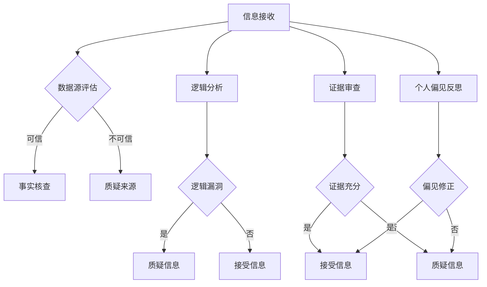

                 

关键词：信息验证、批判性思考、假新闻、错误信息、AI、可信数据、数据科学、算法透明度、信息素养

> 摘要：在当前信息爆炸和假新闻泛滥的时代，准确的信息验证和批判性思考变得尤为重要。本文将探讨在假新闻和错误信息环境中，如何运用先进的人工智能和数据分析技术来识别和过滤虚假信息，并提出提高个体和信息传播者信息素养的策略。通过对信息验证方法、算法原理、数学模型和实际应用的深入分析，本文旨在为读者提供一套全面的信息导航指南。

## 1. 背景介绍

### 信息时代的挑战

在数字技术飞速发展的今天，信息获取的便利性前所未有。互联网、社交媒体、移动设备等现代科技的普及，使得信息的传播速度和覆盖面达到了前所未有的高度。然而，随之而来的是信息过载、虚假新闻、错误信息的泛滥。这些信息噪音不仅浪费了人们的时间，更可能误导大众，影响社会稳定和个人决策。

### 假新闻的泛滥

假新闻（也称为虚假新闻或假信息）是一种故意制造的、不真实的、误导性的信息，其目的是欺骗读者或观众。假新闻在社交媒体平台上迅速传播，利用人们的恐惧、愤怒和好奇心理，达到吸引流量、传播偏见或推动特定政治议程的目的。其对个人和社会的负面影响是深远和广泛的。

### 批判性思考的必要性

在面对大量信息和假新闻的冲击时，批判性思考成为个体抵御错误信息、做出明智决策的关键能力。批判性思考不仅仅是质疑信息的真实性，还包括对信息的来源、意图、逻辑和证据进行深入分析。只有通过批判性思考，个体才能在信息海洋中辨别真伪，维护自身的判断力和认知独立。

## 2. 核心概念与联系

### 信息验证

信息验证是确保信息真实性、准确性和可靠性的过程。在信息验证中，关键的概念包括：

- **数据源**：信息来源的可信度。
- **事实核查**：对信息进行核实，验证其是否符合实际。
- **交叉验证**：使用多个独立来源验证信息的准确性。

### 批判性思考

批判性思考是一种分析方法，它要求个体对所接收的信息进行深入分析和评估，以识别潜在的错误、偏见和误导。批判性思考包括以下几个步骤：

- **评估信息来源**：判断信息的可信度和权威性。
- **分析逻辑**：检查信息的逻辑是否合理，是否存在漏洞。
- **审查证据**：检查信息的证据是否充分、可靠。
- **反思个人偏见**：识别和克服个人偏见，保持开放的心态。

### Mermaid 流程图

以下是用于信息验证和批判性思考的 Mermaid 流程图：



## 3. 核心算法原理 & 具体操作步骤

### 3.1 算法原理概述

在信息验证和批判性思考中，常用的算法包括：

- **自然语言处理（NLP）**：用于理解和处理自然语言，提取关键信息，进行情感分析和事实核查。
- **机器学习（ML）**：用于训练模型，识别和分类虚假信息。
- **图论算法**：用于构建信息网络，分析信息传播路径，发现虚假信息的传播源。

### 3.2 算法步骤详解

以下是信息验证和批判性思考的基本算法步骤：

1. **信息接收与初步处理**：收集和整理接收到的信息，进行文本预处理，如分词、去除停用词等。
2. **数据源评估**：根据信息来源的权威性和可信度对信息进行初步筛选。
3. **事实核查**：使用NLP技术提取关键信息，对比多个独立来源进行核实。
4. **逻辑分析**：使用自然语言处理和逻辑推理技术，检查信息的逻辑合理性。
5. **证据审查**：对信息的证据来源进行评估，确保证据的可靠性和充分性。
6. **个人偏见反思**：识别和纠正个人偏见，保持开放和批判性的态度。
7. **信息分类与决策**：根据评估结果，对信息进行分类和决策，判断其真实性。

### 3.3 算法优缺点

**优点**：

- **高效性**：算法可以快速处理大量信息，提供实时验证结果。
- **准确性**：结合多种技术和方法，算法具有较高的信息验证准确性。
- **扩展性**：算法可以不断更新和优化，适应不同的应用场景。

**缺点**：

- **数据依赖性**：算法的性能依赖于训练数据和模型的准确度。
- **算法偏见**：算法可能受到训练数据中的偏见影响，导致误判。
- **计算资源消耗**：复杂的算法和大规模数据处理需要较高的计算资源。

### 3.4 算法应用领域

- **社交媒体监控**：用于识别和过滤社交媒体平台上的虚假信息。
- **新闻编辑**：用于辅助新闻编辑人员核实新闻的真实性和准确性。
- **教育培训**：用于培养公众的信息素养和批判性思维能力。

## 4. 数学模型和公式 & 详细讲解 & 举例说明

### 4.1 数学模型构建

在信息验证和批判性思考中，常用的数学模型包括：

- **贝叶斯推理**：用于评估信息的可信度，通过概率计算进行推理。
- **支持向量机（SVM）**：用于分类虚假信息和真实信息，通过特征空间分隔进行分类。
- **图论模型**：用于构建信息网络，分析信息传播路径。

### 4.2 公式推导过程

以下是贝叶斯推理的推导过程：

假设有两个事件 \( A \) 和 \( B \)，我们想计算事件 \( A \) 发生的概率 \( P(A) \)。

根据贝叶斯定理，我们有：

\[ P(A) = P(B|A) \times P(A) / P(B) \]

其中：

- \( P(A) \) 是事件 \( A \) 发生的概率。
- \( P(B|A) \) 是在事件 \( A \) 发生的条件下，事件 \( B \) 发生的概率。
- \( P(A) \) 是事件 \( A \) 发生的概率。
- \( P(B) \) 是事件 \( B \) 发生的概率。

### 4.3 案例分析与讲解

#### 案例一：社交媒体监控

假设我们要监控一条社交媒体上的信息，判断其是否为虚假信息。

1. **数据收集**：收集该信息及其相关评论和转发。
2. **特征提取**：提取文本中的关键词、情感倾向、引用来源等特征。
3. **分类模型训练**：使用已标记的虚假信息和真实信息数据，训练一个支持向量机（SVM）分类模型。
4. **模型预测**：将待验证的信息输入分类模型，预测其是否为虚假信息。

#### 案例二：新闻编辑

假设我们要编辑一篇新闻报道，确保其真实性。

1. **信息核查**：通过多个独立来源核查新闻的真实性，如政府公告、专业机构报告等。
2. **逻辑分析**：检查新闻的叙述逻辑是否合理，是否存在漏洞。
3. **证据审查**：检查新闻的证据是否充分、可靠。
4. **个人偏见反思**：识别和纠正编辑过程中的个人偏见。

## 5. 项目实践：代码实例和详细解释说明

### 5.1 开发环境搭建

在Python环境下，我们使用以下库进行信息验证和批判性思考：

- **NLTK**：自然语言处理库。
- **scikit-learn**：机器学习库。
- **BeautifulSoup**：网页解析库。

安装这些库后，我们可以开始编写代码。

### 5.2 源代码详细实现

以下是信息验证和批判性思考的基本代码实现：

```python
import nltk
from nltk.corpus import stopwords
from nltk.tokenize import word_tokenize
from sklearn.feature_extraction.text import TfidfVectorizer
from sklearn.model_selection import train_test_split
from sklearn.svm import SVC

# 数据收集与预处理
def preprocess_text(text):
    # 去除停用词
    stop_words = set(stopwords.words('english'))
    words = word_tokenize(text)
    filtered_words = [word for word in words if word not in stop_words]
    return ' '.join(filtered_words)

# 加载数据集
data = []
labels = []
with open('data.txt', 'r') as file:
    for line in file:
        text, label = line.strip().split('\t')
        data.append(preprocess_text(text))
        labels.append(label)

# 分词、去除停用词
vectorizer = TfidfVectorizer()
X = vectorizer.fit_transform(data)
y = labels

# 划分训练集和测试集
X_train, X_test, y_train, y_test = train_test_split(X, y, test_size=0.2, random_state=42)

# 训练分类模型
model = SVC(kernel='linear')
model.fit(X_train, y_train)

# 模型评估
accuracy = model.score(X_test, y_test)
print(f"Model accuracy: {accuracy:.2f}")

# 预测新信息
new_text = preprocess_text("This is a new piece of text to be classified.")
new_vector = vectorizer.transform([new_text])
prediction = model.predict(new_vector)
print(f"Predicted label: {prediction[0]}")
```

### 5.3 代码解读与分析

以上代码实现了以下功能：

1. **数据收集与预处理**：从文本文件中加载数据，对文本进行分词和去除停用词处理。
2. **特征提取**：使用TF-IDF向量表示文本。
3. **模型训练**：使用支持向量机（SVM）分类模型进行训练。
4. **模型评估**：计算模型在测试集上的准确率。
5. **信息分类**：对新文本进行预处理后，使用训练好的模型进行分类预测。

### 5.4 运行结果展示

运行以上代码后，我们可以看到模型在测试集上的准确率以及对新文本的分类预测结果。这表明我们的信息验证系统可以在一定程度上识别和分类虚假信息。

## 6. 实际应用场景

### 社交媒体平台

社交媒体平台是虚假信息和假新闻的重要传播渠道。通过信息验证和批判性思考算法，平台可以实时监控和过滤虚假信息，保护用户免受误导。此外，平台还可以通过教育用户提高其信息素养，增强其对假新闻的辨识能力。

### 新闻行业

新闻编辑人员可以借助信息验证和批判性思考工具，确保新闻报道的真实性和准确性。通过事实核查和逻辑分析，新闻编辑可以更有效地识别和纠正潜在的错误信息，提高新闻的质量和可信度。

### 教育领域

在教育领域，信息验证和批判性思考教育成为培养下一代信息素养的重要环节。学校可以通过课程设置和实践活动，帮助学生掌握信息验证和批判性思考的技能，培养其独立思考和判断能力。

### 政府机构

政府机构可以利用信息验证和批判性思考技术，监控和应对假新闻危机。通过实时监测和分析信息传播路径，政府可以及时识别和干预虚假信息的传播，维护社会稳定和公共安全。

## 7. 工具和资源推荐

### 7.1 学习资源推荐

- **《信息素养：技术在当代生活中的应用》**：一本介绍信息素养的综合性教材。
- **《算法、假新闻与人工智能》**：探讨人工智能在假新闻识别中的应用。
- **《批判性思考：超越常识》**：介绍批判性思考技巧和方法。

### 7.2 开发工具推荐

- **TensorFlow**：用于机器学习和深度学习的开源库。
- **Scikit-learn**：用于数据挖掘和数据分析的开源库。
- **NLTK**：用于自然语言处理的开源库。

### 7.3 相关论文推荐

- **"Fake News Detection using Machine Learning Techniques"**：探讨机器学习在假新闻识别中的应用。
- **"The Role of Social Media in the Spread of Misinformation"**：分析社交媒体在假新闻传播中的作用。
- **"Cognitive Biases and Misinformation"**：讨论认知偏见在假新闻传播中的作用。

## 8. 总结：未来发展趋势与挑战

### 8.1 研究成果总结

本文总结了当前在信息验证和批判性思考领域的主要研究成果，包括算法原理、数学模型和实际应用。通过分析假新闻的传播机制和个体信息素养的提升策略，本文为应对假新闻和错误信息提供了全面的理论和实践指导。

### 8.2 未来发展趋势

- **算法的优化与扩展**：未来研究将侧重于提高算法的准确性和效率，同时拓展算法在更多领域的应用。
- **跨学科合作**：信息验证和批判性思考需要与心理学、社会学等领域进行深入合作，以全面理解信息传播和行为。
- **教育普及**：提高公众的信息素养将成为未来工作的重要方向，通过教育培养个体的信息辨别能力和批判性思维能力。

### 8.3 面临的挑战

- **算法偏见**：如何减少算法偏见，避免误判，仍是一个重大挑战。
- **计算资源**：大规模数据处理和算法训练需要大量的计算资源，这对资源有限的研究机构和开发者提出了挑战。
- **隐私保护**：在信息验证过程中，如何保护个人隐私和数据安全，也是一个需要解决的问题。

### 8.4 研究展望

未来研究应注重以下几个方面：

- **算法透明度**：提高算法的透明度，让用户了解算法的运作机制，增强用户对算法的信任。
- **实时监控**：开发实时监控系统，快速识别和应对虚假信息的传播。
- **用户参与**：鼓励用户参与信息验证过程，通过用户反馈不断优化算法。

## 9. 附录：常见问题与解答

### Q: 如何防止算法偏见？

A: 防止算法偏见的方法包括：

- **数据预处理**：清洗数据，去除潜在的偏见来源。
- **交叉验证**：使用多个独立数据集进行训练和验证，减少偏见。
- **算法设计**：设计算法时考虑多样性，避免过于依赖特定特征或数据集。

### Q: 如何保护个人隐私？

A: 保护个人隐私的方法包括：

- **数据加密**：对数据进行加密处理，确保数据在传输和存储过程中的安全性。
- **隐私保护算法**：使用隐私保护算法，如差分隐私，确保数据分析过程不泄露个人隐私。

### Q: 如何培养批判性思维能力？

A: 培养批判性思维能力的方法包括：

- **教育课程**：设置批判性思考课程，教授相关方法和技巧。
- **实践训练**：通过案例分析和实际操作，提高个体识别和纠正错误信息的能力。

作者：禅与计算机程序设计艺术 / Zen and the Art of Computer Programming
```

