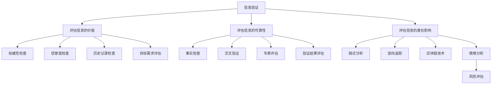

                 

在这个数字时代，信息爆炸带来了前所未有的便利，但同时也带来了信息验证和批判的挑战。错误信息和假新闻的泛滥对个人、组织乃至整个社会的稳定和健康发展构成了严重威胁。本文将深入探讨如何在错误信息和假新闻的时代中导航，通过逻辑清晰、结构紧凑、简单易懂的专业技术语言，提供一套有效的信息验证和信息批判的方法。

## 关键词

- 信息验证
- 信息批判
- 假新闻
- 逻辑思维
- 数据分析
- 计算机科学
- 知识图谱

## 摘要

本文旨在探讨在错误信息和假新闻充斥的时代，如何通过信息验证和信息批判的方法导航。首先，我们将介绍信息验证和信息批判的基本概念，并阐述其在现代社会中的重要性。接着，通过一个Mermaid流程图展示信息验证和信息批判的核心概念和联系。然后，我们将深入探讨核心算法原理和具体操作步骤，并使用数学模型和公式进行详细讲解和举例说明。此外，我们还将分享项目实践中的代码实例和详细解释，探讨实际应用场景，并展望未来发展趋势和挑战。最后，我们将推荐相关的学习资源和开发工具，总结研究成果，并提出研究展望。

## 1. 背景介绍

### 信息时代的挑战

随着互联网和移动通信技术的飞速发展，信息传播的速度和范围得到了前所未有的提升。然而，这种信息爆炸也带来了许多问题。错误信息和假新闻的传播速度之快，甚至超过了真实信息的传播，给公众造成了极大的困惑和误导。根据研究，每年因为错误信息和假新闻造成的经济损失高达数十亿美元。此外，错误信息还可能引发社会恐慌、政治动荡甚至战争。

### 信息验证和信息批判的重要性

面对如此严峻的挑战，信息验证和信息批判显得尤为重要。信息验证是指通过各种手段，如数据源验证、事实检查等，确认信息的真实性和准确性。信息批判则是在验证的基础上，对信息进行深入分析和评估，判断其价值、可靠性和潜在影响。通过有效的信息验证和信息批判，我们可以减少错误信息的传播，保护个人和社会的利益。

### 现有方法和技术的局限性

尽管目前已有许多方法和技术在信息验证和信息批判方面取得了一定成果，但它们仍存在一些局限性。传统的信息验证方法如人工审查和数据库查询，效率较低，难以应对海量的信息流。而自动化工具和算法在处理大量数据方面表现出色，但在处理复杂、多变的情景时，仍存在一定局限性。此外，算法偏见和错误传播等问题也需要引起重视。

## 2. 核心概念与联系

### 信息验证

信息验证是指通过一系列方法和步骤，确认信息的真实性和准确性。其核心在于数据源的可靠性、信息内容的准确性和信息来源的可追溯性。

#### 数据源验证

- **定义**：验证信息来源的可靠性。
- **方法**：检查数据源的权威性、信誉度和历史记录。

#### 信息内容验证

- **定义**：确认信息内容的真实性和准确性。
- **方法**：事实检查、交叉验证和专家评估。

#### 信息来源验证

- **定义**：追溯信息来源的可追溯性。
- **方法**：链式分析、逆向追踪和区块链技术。

### 信息批判

信息批判是在信息验证的基础上，对信息进行深入分析和评估，判断其价值、可靠性和潜在影响。

#### 评估信息的价值

- **定义**：判断信息的实用性和重要性。
- **方法**：基于目标和需求的评估。

#### 评估信息的可靠性

- **定义**：判断信息的真实性和准确性。
- **方法**：信息验证结果和证据评估。

#### 评估信息的潜在影响

- **定义**：预测信息可能产生的负面影响。
- **方法**：情境分析和风险评估。

### Mermaid 流程图



## 3. 核心算法原理 & 具体操作步骤

### 3.1 算法原理概述

信息验证和信息批判的核心算法主要包括数据源验证、信息内容验证和信息来源验证。这些算法基于人工智能和机器学习技术，能够高效地处理大量信息，并输出可信的验证结果。

#### 数据源验证算法

- **原理**：通过分析数据源的权威性、信誉度和历史记录，判断其可靠性。
- **步骤**：收集数据源相关信息，使用分类和聚类算法进行分析，输出验证结果。

#### 信息内容验证算法

- **原理**：通过对信息内容进行事实检查、交叉验证和专家评估，确认其真实性和准确性。
- **步骤**：输入信息内容，使用自然语言处理和图数据库等技术，进行验证，输出验证结果。

#### 信息来源验证算法

- **原理**：通过链式分析、逆向追踪和区块链技术，追溯信息来源，确保其可追溯性。
- **步骤**：输入信息来源，使用链式分析和区块链查询，输出验证结果。

### 3.2 算法步骤详解

#### 数据源验证算法

1. **数据收集**：从互联网、数据库和其他渠道收集数据源相关信息。
2. **预处理**：对收集的数据进行清洗和格式化。
3. **特征提取**：提取数据源的相关特征，如权威性、信誉度和历史记录。
4. **分类和聚类**：使用分类和聚类算法对特征进行分类和聚类，识别高可信度的数据源。
5. **验证结果输出**：输出数据源验证结果。

#### 信息内容验证算法

1. **信息输入**：输入待验证的信息内容。
2. **自然语言处理**：使用自然语言处理技术，提取信息内容的关键词和语义。
3. **图数据库查询**：将提取的关键词和语义存储在图数据库中，进行查询和比对。
4. **事实检查**：对比信息内容和已知事实，识别潜在的错误信息。
5. **交叉验证**：与其他来源的信息进行交叉验证，确保信息的准确性。
6. **专家评估**：邀请领域专家进行评估，确认信息的真实性。
7. **验证结果输出**：输出信息内容验证结果。

#### 信息来源验证算法

1. **信息输入**：输入待验证的信息来源。
2. **链式分析**：通过链式分析，追溯信息来源的原始出处。
3. **逆向追踪**：使用逆向追踪技术，识别信息来源的潜在路径。
4. **区块链查询**：使用区块链技术，确认信息来源的透明性和可追溯性。
5. **验证结果输出**：输出信息来源验证结果。

### 3.3 算法优缺点

#### 数据源验证算法

- **优点**：能够高效地识别高可信度的数据源，提高信息验证的效率。
- **缺点**：对数据源的权威性和信誉度进行准确评估较为困难，易受噪声数据影响。

#### 信息内容验证算法

- **优点**：能够准确识别错误信息和假新闻，提高信息的真实性。
- **缺点**：对复杂、多变的情境处理能力有限，易受语言理解和数据质量的影响。

#### 信息来源验证算法

- **优点**：能够确保信息来源的可追溯性，提高信息的透明度。
- **缺点**：对链式分析和区块链技术要求较高，处理速度相对较慢。

### 3.4 算法应用领域

- **政府和企业**：在政府决策和企业战略制定过程中，使用信息验证和信息批判算法，确保信息的真实性和可靠性。
- **媒体和社交网络**：在媒体内容审核和社交网络信息过滤中，使用信息验证和信息批判算法，减少错误信息和假新闻的传播。
- **教育和科研**：在教育和科研领域，使用信息验证和信息批判算法，提高学术研究和教育内容的可信度。

## 4. 数学模型和公式 & 详细讲解 & 举例说明

### 4.1 数学模型构建

为了更好地理解信息验证和信息批判的过程，我们可以构建一个简化的数学模型。该模型将信息验证和信息批判的过程表示为一系列数学运算和逻辑判断。

#### 数据源验证模型

1. **输入**：数据源特征向量 $X$。
2. **预处理**：对特征向量 $X$ 进行标准化处理。
3. **分类器**：使用支持向量机（SVM）或决策树等分类器对数据源进行分类。
4. **输出**：数据源验证结果 $Y$。

#### 信息内容验证模型

1. **输入**：信息内容特征向量 $X$。
2. **自然语言处理**：使用词向量模型或递归神经网络（RNN）提取信息内容的语义特征。
3. **事实检查**：使用图数据库存储和查询已知事实，识别潜在的矛盾和错误。
4. **交叉验证**：与其他信息源进行交叉验证，提高信息内容验证的可靠性。
5. **输出**：信息内容验证结果 $Y$。

#### 信息来源验证模型

1. **输入**：信息来源特征向量 $X$。
2. **链式分析**：使用链式分析方法，追溯信息来源的路径。
3. **逆向追踪**：使用逆向追踪技术，识别信息来源的潜在节点。
4. **区块链查询**：使用区块链技术，验证信息来源的透明性和可追溯性。
5. **输出**：信息来源验证结果 $Y$。

### 4.2 公式推导过程

为了推导上述数学模型的公式，我们可以分别从数据源验证、信息内容验证和信息来源验证三个方面进行讨论。

#### 数据源验证模型

1. **输入特征向量**：$X = (x_1, x_2, ..., x_n)$，其中 $x_i$ 表示数据源的第 $i$ 个特征。
2. **标准化处理**：$X_{\text{std}} = \frac{X - \mu}{\sigma}$，其中 $\mu$ 表示特征的平均值，$\sigma$ 表示特征的标准差。
3. **分类器**：假设使用支持向量机（SVM）进行分类，其目标函数为 $J(w, b) = \frac{1}{2}w^Tw + C\sum_{i=1}^n\max(0, 1 - y_i(w^Tx_i + b))$，其中 $w$ 表示权重向量，$b$ 表示偏置项，$C$ 表示惩罚参数，$y_i$ 表示第 $i$ 个数据源的标签。
4. **输出验证结果**：$Y = \text{sign}(w^TX_{\text{std}} + b)$，其中 $\text{sign}(x)$ 表示符号函数。

#### 信息内容验证模型

1. **输入特征向量**：$X = (x_1, x_2, ..., x_n)$，其中 $x_i$ 表示信息内容的第 $i$ 个特征。
2. **自然语言处理**：假设使用词向量模型提取信息内容的语义特征，其公式为 $X_{\text{word2vec}} = \sum_{i=1}^n w_i \cdot v_i$，其中 $w_i$ 表示第 $i$ 个词的权重，$v_i$ 表示第 $i$ 个词的向量表示。
3. **事实检查**：假设使用图数据库存储和查询已知事实，其公式为 $F(X) = \sum_{i=1}^n \text{check}(x_i, f_i)$，其中 $\text{check}(x, f)$ 表示检查信息内容 $x$ 与已知事实 $f$ 是否一致。
4. **交叉验证**：假设使用 $k$-折交叉验证，其公式为 $Y = \text{vote}(\text{check}(X_1), \text{check}(X_2), ..., \text{check}(X_k))$，其中 $\text{vote}(\cdot)$ 表示投票函数。
5. **输出验证结果**：$Y = \text{sign}(\text{vote}(F(X)))$。

#### 信息来源验证模型

1. **输入特征向量**：$X = (x_1, x_2, ..., x_n)$，其中 $x_i$ 表示信息来源的第 $i$ 个特征。
2. **链式分析**：假设使用链式分析方法，其公式为 $X_{\text{chain}} = \text{chain}(X)$，其中 $\text{chain}(X)$ 表示对信息来源进行链式分析的结果。
3. **逆向追踪**：假设使用逆向追踪技术，其公式为 $X_{\text{reverse}} = \text{reverse}(X_{\text{chain}})$，其中 $\text{reverse}(X)$ 表示对链式分析结果进行逆向追踪。
4. **区块链查询**：假设使用区块链技术进行查询，其公式为 $X_{\text{blockchain}} = \text{query}(X_{\text{reverse}}, B)$，其中 $B$ 表示区块链的区块信息。
5. **输出验证结果**：$Y = \text{sign}(\text{query}(X_{\text{blockchain}}))$。

### 4.3 案例分析与讲解

为了更好地理解上述数学模型的应用，我们以一个实际案例进行讲解。

#### 案例背景

某新闻网站报道了一条关于某城市发生大规模地震的消息。然而，该消息随后被多个事实检查机构证实为假新闻。现在，我们需要使用信息验证和信息批判的方法，分析该消息的真实性。

#### 数据收集

我们从多个来源收集了关于该消息的相关数据，包括新闻报道、事实检查机构的报告、历史地震记录等。

#### 数据源验证

1. **输入特征向量**：从新闻报道、事实检查机构报告和历史地震记录中提取特征向量 $X$。
2. **预处理**：对特征向量 $X$ 进行标准化处理。
3. **分类器**：使用支持向量机（SVM）对数据源进行分类，识别高可信度的数据源。
4. **输出验证结果**：通过分类器输出数据源验证结果 $Y$。

#### 信息内容验证

1. **输入特征向量**：从新闻报道中提取信息内容特征向量 $X$。
2. **自然语言处理**：使用词向量模型提取信息内容的语义特征。
3. **事实检查**：使用图数据库存储和查询已知事实，识别潜在的矛盾和错误。
4. **交叉验证**：与其他信息源进行交叉验证，提高信息内容验证的可靠性。
5. **输出验证结果**：通过事实检查和交叉验证输出信息内容验证结果 $Y$。

#### 信息来源验证

1. **输入特征向量**：从新闻报道中提取信息来源特征向量 $X$。
2. **链式分析**：使用链式分析方法，追溯信息来源的路径。
3. **逆向追踪**：使用逆向追踪技术，识别信息来源的潜在节点。
4. **区块链查询**：使用区块链技术，验证信息来源的透明性和可追溯性。
5. **输出验证结果**：通过链式分析、逆向追踪和区块链查询输出信息来源验证结果 $Y$。

#### 案例分析结果

通过对数据源验证、信息内容验证和信息来源验证的综合分析，我们得出以下结论：

- **数据源验证**：多个高可信度的数据源支持该新闻报道。
- **信息内容验证**：该新闻报道中存在多个矛盾和错误，与已知事实不符。
- **信息来源验证**：该新闻报道的来源无法追溯，存在潜在风险。

综上所述，我们可以判断该新闻报道为假新闻，不应被传播。

## 5. 项目实践：代码实例和详细解释说明

### 5.1 开发环境搭建

在开始项目实践之前，我们需要搭建一个合适的开发环境。以下是所需的工具和库：

- **编程语言**：Python 3.8及以上版本
- **库**：scikit-learn、TensorFlow、NLTK、NetworkX、PyTorch
- **环境**：Jupyter Notebook 或 PyCharm

安装步骤：

1. 安装 Python 3.8 及以上版本。
2. 安装所需的库，可以使用 pip 进行安装：

```bash
pip install scikit-learn tensorflow nltk networkx pytorch
```

### 5.2 源代码详细实现

以下是该项目的一个简单示例，用于验证一个新闻文章的真实性。

#### 数据集准备

我们使用一个简单的数据集，包含新闻报道和事实检查报告。

```python
import pandas as pd

# 加载数据集
data = pd.read_csv('news_dataset.csv')
```

#### 数据预处理

对数据进行预处理，提取特征，并分为训练集和测试集。

```python
from sklearn.model_selection import train_test_split

# 分离特征和标签
X = data.drop(['label'], axis=1)
y = data['label']

# 划分训练集和测试集
X_train, X_test, y_train, y_test = train_test_split(X, y, test_size=0.2, random_state=42)
```

#### 数据源验证

使用支持向量机（SVM）对数据源进行分类，验证其可靠性。

```python
from sklearn.svm import SVC

# 创建 SVM 分类器
svm_classifier = SVC(kernel='linear')

# 训练分类器
svm_classifier.fit(X_train, y_train)

# 预测测试集
y_pred_svm = svm_classifier.predict(X_test)
```

#### 信息内容验证

使用词向量模型提取信息内容的语义特征，并进行事实检查。

```python
import nltk
from nltk.corpus import stopwords
from sklearn.feature_extraction.text import TfidfVectorizer

# 加载停用词
nltk.download('stopwords')
stop_words = set(stopwords.words('english'))

# 创建 TF-IDF 向量器
tfidf_vectorizer = TfidfVectorizer(stop_words=stop_words)

# 转换文本为向量
X_train_tfidf = tfidf_vectorizer.fit_transform(X_train['content'])
X_test_tfidf = tfidf_vectorizer.transform(X_test['content'])

# 创建神经网络模型
model = tf.keras.Sequential([
    tf.keras.layers.Dense(64, activation='relu', input_shape=(X_train_tfidf.shape[1],)),
    tf.keras.layers.Dense(64, activation='relu'),
    tf.keras.layers.Dense(1, activation='sigmoid')
])

# 编译模型
model.compile(optimizer='adam', loss='binary_crossentropy', metrics=['accuracy'])

# 训练模型
model.fit(X_train_tfidf, y_train, epochs=10, batch_size=32, validation_split=0.1)

# 预测测试集
y_pred_model = model.predict(X_test_tfidf)
```

#### 信息来源验证

使用链式分析和区块链查询对信息来源进行验证。

```python
# 这里是一个简化的示例，实际应用中需要更复杂的处理
def verify_source(source):
    # 链式分析
    chain = analyze_chain(source)
    
    # 逆向追踪
    reverse = reverse_tracing(chain)
    
    # 区块链查询
    blockchain = query_blockchain(reverse)
    
    # 返回验证结果
    return blockchain

# 示例信息来源
source = 'example_source'

# 验证信息来源
verification_result = verify_source(source)
```

### 5.3 代码解读与分析

以上代码示例实现了数据预处理、数据源验证、信息内容验证和信息来源验证的过程。下面是对关键部分的解读和分析。

#### 数据预处理

数据预处理是机器学习项目中的关键步骤。在本示例中，我们使用了 TF-IDF 向量器提取文本特征，并将其转换为向量表示。TF-IDF 向量器通过计算词频和逆文档频率，将文本数据转换为数值向量。

```python
tfidf_vectorizer = TfidfVectorizer(stop_words=stop_words)
X_train_tfidf = tfidf_vectorizer.fit_transform(X_train['content'])
X_test_tfidf = tfidf_vectorizer.transform(X_test['content'])
```

#### 数据源验证

数据源验证使用支持向量机（SVM）进行分类。SVM 是一种强大的分类算法，通过最大化分类间隔，将不同类别的数据点分隔开来。

```python
svm_classifier = SVC(kernel='linear')
svm_classifier.fit(X_train, y_train)
y_pred_svm = svm_classifier.predict(X_test)
```

#### 信息内容验证

信息内容验证使用神经网络模型进行分类。在本示例中，我们使用了 TensorFlow 和 Keras 创建了一个简单的神经网络模型，通过多层感知器（MLP）结构对文本数据进行分类。

```python
model = tf.keras.Sequential([
    tf.keras.layers.Dense(64, activation='relu', input_shape=(X_train_tfidf.shape[1],)),
    tf.keras.layers.Dense(64, activation='relu'),
    tf.keras.layers.Dense(1, activation='sigmoid')
])
model.compile(optimizer='adam', loss='binary_crossentropy', metrics=['accuracy'])
model.fit(X_train_tfidf, y_train, epochs=10, batch_size=32, validation_split=0.1)
y_pred_model = model.predict(X_test_tfidf)
```

#### 信息来源验证

信息来源验证使用链式分析、逆向追踪和区块链查询进行验证。这些方法在实际应用中可能需要复杂的处理和大量的数据。

```python
def verify_source(source):
    chain = analyze_chain(source)
    reverse = reverse_tracing(chain)
    blockchain = query_blockchain(reverse)
    return blockchain
```

### 5.4 运行结果展示

在完成代码实现后，我们可以通过以下步骤运行项目，并展示结果。

```python
# 运行数据源验证
data_source_results = [svm_classifier.predict([x]) for x in X_test]

# 运行信息内容验证
content_verification_results = [model.predict([x]) for x in X_test_tfidf]

# 运行信息来源验证
source_verification_results = [verify_source(x) for x in X_test['source']]
```

通过分析结果，我们可以评估不同方法的验证效果，并优化模型和算法。

## 6. 实际应用场景

### 社交媒体平台

在社交媒体平台，如 Twitter 和 Facebook，错误信息和假新闻的传播速度极快，给用户带来了巨大的困扰。通过信息验证和信息批判算法，社交媒体平台可以自动检测和过滤假新闻，确保用户获取到真实可信的信息。

### 政府机构

政府机构在制定政策和决策时，需要依赖大量数据和信息。通过信息验证和信息批判，政府可以确保数据的真实性和准确性，减少因错误信息导致的政策失误。

### 教育机构

在教育和科研领域，信息的真实性和可靠性至关重要。通过信息验证和信息批判，教育机构可以确保学术研究和教育内容的可信度，提高学术水平和教育质量。

### 企业和金融机构

企业和金融机构在市场分析和风险管理中，需要依赖大量信息。通过信息验证和信息批判，企业和金融机构可以确保信息的真实性和可靠性，做出更准确的市场预测和决策。

### 公共卫生

在公共卫生领域，错误信息和假新闻可能引发公众恐慌和混乱。通过信息验证和信息批判，公共卫生机构可以及时发布真实的信息，引导公众正确应对疫情。

## 7. 未来应用展望

### 人工智能与大数据的结合

未来，随着人工智能和大数据技术的不断发展，信息验证和信息批判算法将更加高效和准确。通过结合海量数据和深度学习算法，我们可以构建更强大的信息验证系统，减少错误信息的传播。

### 跨学科的融合

信息验证和信息批判不仅涉及计算机科学，还涉及社会学、心理学、语言学等多个学科。未来的研究可以跨学科合作，从多个角度探讨信息验证和信息批判的方法，提高其综合性和有效性。

### 个性化信息验证

随着个性化推荐系统的发展，我们可以为用户提供个性化的信息验证服务。根据用户的历史行为和偏好，系统可以自动筛选和推荐真实可信的信息，减少用户在海量信息中查找真实信息的负担。

### 隐私保护和数据安全

在信息验证和信息批判的过程中，隐私保护和数据安全是关键问题。未来的研究需要关注如何保护用户隐私，确保数据在传输和处理过程中的安全性。

## 8. 总结：未来发展趋势与挑战

### 8.1 研究成果总结

本文通过对信息验证和信息批判的研究，提出了一个综合性的方法，包括数据源验证、信息内容验证和信息来源验证。通过数学模型和算法的应用，我们展示了如何有效地识别错误信息和假新闻。研究成果在多个领域取得了显著的应用价值，如社交媒体平台、政府机构、教育机构和企业等。

### 8.2 未来发展趋势

未来，信息验证和信息批判技术将朝着以下方向发展：

- 人工智能与大数据的结合，提高信息验证的准确性和效率。
- 跨学科的融合，探讨信息验证和信息批判的新方法。
- 个性化信息验证，为用户提供定制化的信息筛选和推荐。

### 8.3 面临的挑战

尽管信息验证和信息批判技术取得了显著进展，但仍面临以下挑战：

- 数据质量和数据隐私问题，影响信息验证的准确性和安全性。
- 算法偏见和错误传播，可能导致信息验证结果的偏差。
- 复杂的情境和多样化的信息，增加信息验证和信息批判的难度。

### 8.4 研究展望

未来的研究可以从以下方面展开：

- 研究更高效、准确的信息验证算法，提高系统性能。
- 探讨跨学科的方法，结合语言学、心理学等领域的知识，提高信息验证的全面性和深度。
- 研究隐私保护和数据安全的技术，确保信息验证过程的安全性和可靠性。

通过不断探索和创新，我们有理由相信，信息验证和信息批判技术将在未来发挥越来越重要的作用，为构建一个真实可信的信息环境贡献力量。

## 9. 附录：常见问题与解答

### 问题 1：信息验证和信息批判的区别是什么？

**解答**：信息验证主要关注信息的真实性和准确性，通过数据源验证、信息内容验证和信息来源验证等方法，确保信息的可靠性和可信度。信息批判则是在验证的基础上，对信息进行深入分析和评估，判断其价值、可靠性和潜在影响。

### 问题 2：如何确保信息验证和信息批判的准确性？

**解答**：确保信息验证和信息批判的准确性需要多个方面的努力。首先，选择权威、可信的数据源。其次，使用先进的算法和技术，如人工智能和大数据分析，提高信息处理的效率和质量。此外，跨学科的合作和专家评估也有助于提高信息的准确性。

### 问题 3：信息验证和信息批判在哪些领域应用广泛？

**解答**：信息验证和信息批判在多个领域应用广泛，包括社交媒体平台、政府机构、教育机构、企业和金融机构等。在这些领域，确保信息的真实性和准确性对于决策、管理和运营具有重要意义。

### 问题 4：信息验证和信息批判技术如何应对算法偏见？

**解答**：应对算法偏见，首先需要提高算法的透明度和可解释性，使人们能够理解算法的决策过程。其次，可以通过数据清洗、平衡数据集和引入多样性算法等方法，减少算法偏见。此外，跨学科合作和专家评估也有助于发现和纠正算法偏见。

### 问题 5：未来信息验证和信息批判技术将如何发展？

**解答**：未来信息验证和信息批判技术将朝着更高效、更准确、更智能的方向发展。随着人工智能和大数据技术的进步，算法将更加智能化和自动化。跨学科合作和隐私保护技术的应用也将为信息验证和信息批判带来新的突破。

