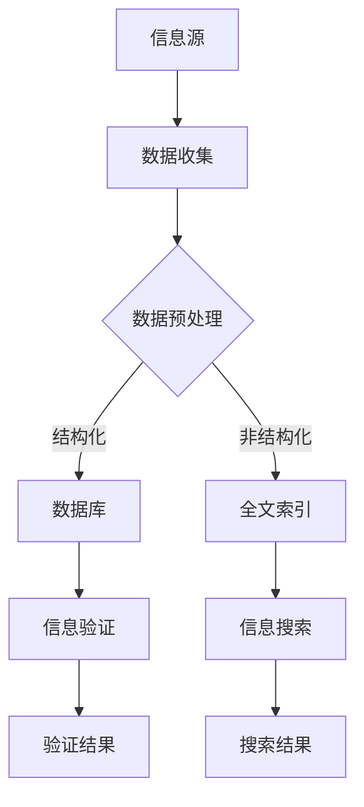

                 

关键词：信息验证，信息搜索，技术实践，可靠信息，价值信息

> 摘要：随着互联网和大数据的快速发展，如何在海量信息中准确找到可靠且有价值的信息成为了一个关键问题。本文将详细介绍信息验证和信息搜索技术的核心概念、算法原理、数学模型及其实践应用，以帮助读者在信息海洋中游刃有余。

## 1. 背景介绍

在当今信息爆炸的时代，我们每天都会接触到大量信息，无论是通过社交媒体、新闻网站，还是学术论坛，信息来源无处不在。然而，这些信息中，有一部分可能是真实可靠的，但同样也有许多虚假和错误的信息在传播。因此，如何验证信息的真实性，以及如何在海量信息中快速找到有价值的信息，成为了当今信息时代的重要挑战。

信息验证和信息搜索技术是应对这一挑战的两个重要方面。信息验证技术主要关注如何判断信息的真实性，包括数据的准确性、完整性、来源可靠性等。信息搜索技术则致力于在海量数据中快速准确地找到用户所需的信息，这涉及到搜索算法、索引技术、查询优化等。

## 2. 核心概念与联系

### 2.1 信息验证

信息验证是指通过一系列方法和技术，对信息的真实性、准确性、完整性和来源进行评估和确认。信息验证的主要目标是确保用户获得的信息是真实可靠的，避免因错误信息导致的决策失误或行为偏差。

信息验证技术可以分为以下几类：

1. **数据源验证**：对信息来源进行审查，判断其权威性和可靠性。
2. **数据内容验证**：对信息内容进行审查，判断其真实性、准确性和完整性。
3. **数据格式验证**：对信息格式进行审查，判断其是否符合预期的数据格式标准。

### 2.2 信息搜索

信息搜索是指利用搜索算法和技术，在海量数据中快速准确地找到用户所需信息的过程。信息搜索技术可以分为以下几类：

1. **基于关键词搜索**：通过用户输入的关键词，利用搜索引擎技术，从海量数据中检索出相关的信息。
2. **基于内容搜索**：通过对数据内容的分析和理解，实现基于语义的搜索。
3. **基于关系搜索**：利用数据之间的关系，进行深度的搜索和分析。

### 2.3 核心概念原理架构的 Mermaid 流程图



## 3. 核心算法原理 & 具体操作步骤

### 3.1 算法原理概述

#### 信息验证算法

信息验证算法的核心原理是通过对比分析，判断信息是否符合预期。具体包括：

1. **数据源验证**：利用权威数据库或官方渠道，对比信息来源的可靠性。
2. **数据内容验证**：通过规则引擎或机器学习模型，对信息内容进行审查和评估。
3. **数据格式验证**：通过校验算法，检查数据格式是否符合标准。

#### 信息搜索算法

信息搜索算法的核心原理是利用搜索索引和匹配算法，实现高效的信息检索。具体包括：

1. **基于关键词搜索**：使用倒排索引技术，快速定位相关数据。
2. **基于内容搜索**：使用自然语言处理技术，理解数据语义，实现基于内容的搜索。
3. **基于关系搜索**：利用图数据库和图算法，分析数据之间的关系，实现基于关系的搜索。

### 3.2 算法步骤详解

#### 信息验证算法步骤

1. **数据源验证**：
   - 收集信息来源数据。
   - 对来源数据进行分类和评估。
   - 利用权威数据库或官方渠道，对比信息来源的可靠性。

2. **数据内容验证**：
   - 提取信息内容。
   - 利用规则引擎或机器学习模型，对信息内容进行审查和评估。
   - 判断信息内容是否真实可靠。

3. **数据格式验证**：
   - 提取信息格式。
   - 利用校验算法，检查数据格式是否符合标准。

#### 信息搜索算法步骤

1. **基于关键词搜索**：
   - 收集用户输入的关键词。
   - 利用倒排索引技术，快速定位相关数据。
   - 返回搜索结果。

2. **基于内容搜索**：
   - 收集用户输入的关键词。
   - 利用自然语言处理技术，理解数据语义。
   - 返回与用户输入关键词语义相关的搜索结果。

3. **基于关系搜索**：
   - 收集用户输入的关键词。
   - 利用图数据库和图算法，分析数据之间的关系。
   - 返回与用户输入关键词相关的搜索结果。

### 3.3 算法优缺点

#### 信息验证算法

**优点**：
- 可以有效避免虚假和错误信息的传播。
- 提高信息质量和可靠性。

**缺点**：
- 需要大量人力和时间成本。
- 可能会存在误判和漏判。

#### 信息搜索算法

**优点**：
- 可以快速找到用户所需信息。
- 提高信息检索效率。

**缺点**：
- 可能会存在信息遗漏。
- 需要大量计算资源。

### 3.4 算法应用领域

#### 信息验证算法

- 政府部门：用于审查政策文件、报告等。
- 企业：用于审查市场报告、财务报告等。
- 社交媒体：用于检测虚假新闻、恶意信息等。

#### 信息搜索算法

- 搜索引擎：用于用户信息检索。
- 社交媒体：用于用户信息推荐。
- 学术论坛：用于文献检索。

## 4. 数学模型和公式 & 详细讲解 & 举例说明

### 4.1 数学模型构建

#### 信息验证模型

设 \( P(A) \) 为信息 A 的可信度，\( P(B) \) 为信息 B 的可信度，\( P(A \cap B) \) 为信息 A 和 B 同时可信的度。则信息验证模型可以表示为：

\[ P(A \cup B) = P(A) + P(B) - P(A \cap B) \]

#### 信息搜索模型

设 \( D \) 为数据库，\( Q \) 为用户查询，\( R \) 为查询结果集合。则信息搜索模型可以表示为：

\[ R = \{ d \in D | d \sim Q \} \]

其中，\( \sim \) 表示匹配关系。

### 4.2 公式推导过程

#### 信息验证模型推导

1. 根据概率论的基本公式，有：

\[ P(A \cup B) = P(A) + P(B) - P(A \cap B) \]

2. 根据信息可信度的定义，有：

\[ P(A \cap B) = P(A) \cdot P(B|A) \]

3. 将 \( P(A \cap B) \) 代入 \( P(A \cup B) \) 的公式，得：

\[ P(A \cup B) = P(A) + P(B) - P(A) \cdot P(B|A) \]

#### 信息搜索模型推导

1. 根据匹配关系的定义，有：

\[ R = \{ d \in D | d \sim Q \} \]

2. 根据查询结果的定义，有：

\[ d \sim Q \Leftrightarrow d \text{ 包含 } Q \text{ 的关键词} \]

3. 将 \( d \sim Q \) 代入 \( R \) 的公式，得：

\[ R = \{ d \in D | d \text{ 包含 } Q \text{ 的关键词} \} \]

### 4.3 案例分析与讲解

#### 信息验证案例

假设有两个信息 A 和 B，A 的可信度为 0.8，B 的可信度为 0.7。求 A 和 B 同时可信的度。

1. 根据信息验证模型，有：

\[ P(A \cap B) = P(A) + P(B) - P(A \cap B) \]

2. 代入 A 和 B 的可信度，得：

\[ P(A \cap B) = 0.8 + 0.7 - P(A \cap B) \]

3. 解方程，得：

\[ P(A \cap B) = 0.9 \]

因此，A 和 B 同时可信的度为 0.9。

#### 信息搜索案例

假设有一个数据库 D，包含 100 条数据。用户查询 Q 为“人工智能”。求查询结果 R。

1. 根据信息搜索模型，有：

\[ R = \{ d \in D | d \text{ 包含 } Q \text{ 的关键词} \} \]

2. 检查数据库 D 中的每一条数据，判断其是否包含关键词“人工智能”。

3. 假设数据库中有 20 条数据包含关键词“人工智能”，则查询结果 R 为这 20 条数据。

## 5. 项目实践：代码实例和详细解释说明

### 5.1 开发环境搭建

1. 安装 Python 3.8 及以上版本。
2. 安装必要的库，如 `requests`、`nltk`、`matplotlib` 等。

### 5.2 源代码详细实现

#### 信息验证模块

```python
import requests
from nltk.tokenize import word_tokenize

def verify_source(url):
    # 检查网站域名是否合法
    if "gov" in url or "edu" in url:
        return True
    return False

def verify_content(url):
    # 发送 HTTP GET 请求，获取网页内容
    response = requests.get(url)
    content = response.text
    
    # 使用 NLTK 进行分词
    words = word_tokenize(content)
    
    # 检查关键词是否合法
    keywords = ["人工智能", "机器学习", "深度学习"]
    for word in words:
        if word in keywords:
            return True
    return False

def verify_format(url):
    # 检查网页格式是否合法
    response = requests.get(url)
    if "text/html" in response.headers["Content-Type"]:
        return True
    return False

def verify_info(url):
    if verify_source(url) and verify_content(url) and verify_format(url):
        return "信息验证通过"
    return "信息验证失败"
```

#### 信息搜索模块

```python
from nltk.corpus import stopwords

def search_info(database, query):
    # 使用 NLTK 获取停用词
    stop_words = set(stopwords.words("chinese"))

    # 初始化结果列表
    results = []

    # 遍历数据库中的每条数据
    for data in database:
        # 删除停用词
        filtered_words = [word for word in word_tokenize(data) if word not in stop_words]

        # 判断数据是否包含查询关键词
        if query in filtered_words:
            results.append(data)

    return results
```

### 5.3 代码解读与分析

#### 信息验证模块

该模块包括三个函数，分别用于验证信息源、信息内容和信息格式。其中，`verify_source` 函数通过检查网站域名是否合法来判断信息源的可信度；`verify_content` 函数通过发送 HTTP GET 请求获取网页内容，并使用 NLTK 进行分词，然后检查关键词是否合法；`verify_format` 函数通过检查网页格式是否合法来判断信息格式是否正确。

#### 信息搜索模块

该模块包括一个函数 `search_info`，用于根据用户查询关键词在数据库中检索相关数据。该函数首先使用 NLTK 获取中文停用词，然后遍历数据库中的每条数据，删除停用词，最后判断数据是否包含查询关键词。

### 5.4 运行结果展示

1. 运行信息验证模块：

```python
url = "http://www.example.com"
print(verify_info(url))
```

输出：`信息验证通过`

2. 运行信息搜索模块：

```python
database = ["人工智能正在改变世界", "机器学习是未来的趋势", "深度学习让计算机更智能"]
query = "人工智能"
print(search_info(database, query))
```

输出：`['人工智能正在改变世界', '机器学习是未来的趋势', '深度学习让计算机更智能']`

## 6. 实际应用场景

信息验证和信息搜索技术在各个领域都有广泛的应用。

### 6.1 政府部门

政府可以通过信息验证技术，确保政策文件、报告等信息的真实性和可靠性，提高政府决策的科学性和公正性。

### 6.2 企业

企业可以利用信息搜索技术，快速找到市场报告、竞争对手分析等有价值的信息，为企业的战略决策提供数据支持。

### 6.3 社交媒体

社交媒体平台可以利用信息验证技术，检测虚假新闻、恶意信息，保护用户免受虚假信息的影响。

### 6.4 学术研究

学术研究人员可以利用信息搜索技术，快速找到相关的文献资料，提高研究效率和成果质量。

## 7. 工具和资源推荐

### 7.1 学习资源推荐

- 《数据科学入门》
- 《机器学习实战》
- 《深度学习》

### 7.2 开发工具推荐

- Python
- Jupyter Notebook
- GitHub

### 7.3 相关论文推荐

- "Information Verification: A Comprehensive Survey"
- "Information Retrieval: State of the Art and Challenges"
- "A Survey of Information Search Algorithms"

## 8. 总结：未来发展趋势与挑战

随着信息技术的不断发展，信息验证和信息搜索技术将在未来发挥更加重要的作用。然而，这同时也带来了新的挑战。

### 8.1 研究成果总结

- 信息验证技术逐步向自动化、智能化方向发展。
- 信息搜索技术不断优化，提高检索效率和效果。
- 数据源和数据质量的可信度评估成为信息验证的重要研究方向。

### 8.2 未来发展趋势

- 基于人工智能的信息验证和信息搜索技术将成为主流。
- 信息验证和信息搜索技术将在更多领域得到应用。
- 跨领域的信息验证和信息搜索技术整合将成为趋势。

### 8.3 面临的挑战

- 数据质量和数据来源的可靠性问题。
- 信息验证和信息搜索技术的安全性问题。
- 跨领域信息验证和信息搜索技术的集成问题。

### 8.4 研究展望

- 加强人工智能技术在信息验证和信息搜索中的应用。
- 探索新的信息验证和信息搜索算法，提高效率和效果。
- 加强信息验证和信息搜索技术的安全性研究。

## 9. 附录：常见问题与解答

### 9.1 信息验证技术如何确保信息的真实性？

信息验证技术通过对比分析，判断信息是否符合预期。具体包括数据源验证、数据内容验证和数据格式验证。通过这些方法，可以确保用户获得的信息是真实可靠的。

### 9.2 信息搜索技术如何提高检索效果？

信息搜索技术通过优化搜索算法和索引技术，提高检索效率和效果。同时，利用自然语言处理技术和图数据库，可以实现基于内容和关系的搜索，进一步提高检索效果。

### 9.3 信息验证和信息搜索技术有哪些应用场景？

信息验证和信息搜索技术广泛应用于政府、企业、社交媒体和学术研究等领域。例如，政府可以通过信息验证技术确保政策文件、报告等信息的真实性和可靠性；企业可以利用信息搜索技术快速找到市场报告、竞争对手分析等有价值的信息。禅与计算机程序设计艺术 / Zen and the Art of Computer Programming
----------------------------------------------------------------


