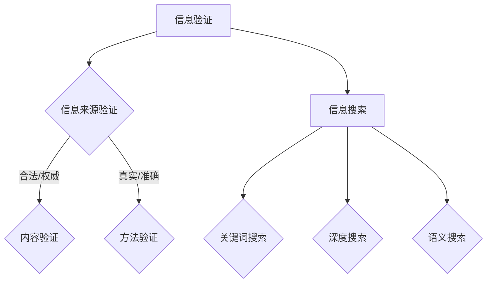

                 

 **关键词：** 信息验证、信息搜索、可靠信息、有价值信息、技术、大数据、算法、人工智能。

**摘要：** 在当今信息爆炸的时代，如何从海量的数据中找到可靠且有价值的信息成为了各个领域的重要问题。本文将介绍信息验证和信息搜索技术的核心概念、原理以及应用，旨在帮助读者深入了解这些技术，并在实际应用中发挥其最大价值。

## 1. 背景介绍

随着互联网的普及和大数据时代的到来，人们每天接收到的信息量呈指数级增长。然而，信息质量参差不齐，如何在众多信息中找到真实、可靠、有价值的信息成为了亟待解决的问题。信息验证和信息搜索技术正是在这样的背景下应运而生。

信息验证技术主要用于验证信息的真实性和准确性，确保信息来源的可靠性。信息搜索技术则致力于在海量数据中快速、准确地找到所需的信息。这两项技术相辅相成，共同构成了信息检索领域的重要基石。

## 2. 核心概念与联系

### 2.1. 信息验证

#### 2.1.1. 定义

信息验证是指通过一系列方法和手段，对信息的真实性、准确性和可靠性进行评估和确认的过程。

#### 2.1.2. 分类

- **来源验证：** 检查信息来源的合法性、权威性和可信度。
- **内容验证：** 核对信息的真实性、准确性和完整性。
- **方法验证：** 分析信息获取和处理的方法是否科学、合理。

### 2.2. 信息搜索

#### 2.2.1. 定义

信息搜索是指通过特定的技术和方法，从海量数据中检索和提取所需信息的过程。

#### 2.2.2. 分类

- **关键词搜索：** 通过输入关键词，从数据库中检索相关内容。
- **深度搜索：** 利用算法和模型，对海量数据进行深度分析和挖掘。
- **语义搜索：** 基于自然语言处理技术，理解用户需求，提供更精准的搜索结果。

### 2.3. 核心概念联系

信息验证和信息搜索技术相互关联，共同构成信息检索的核心。信息验证为信息搜索提供了可靠的数据基础，而信息搜索则为信息验证提供了丰富的应用场景。

### 2.4. Mermaid 流程图



## 3. 核心算法原理 & 具体操作步骤

### 3.1. 算法原理概述

信息验证和信息搜索技术涉及多个核心算法，主要包括：

- **数据清洗算法：** 用于处理和清洗原始数据，去除噪音和错误。
- **机器学习算法：** 用于数据分析和挖掘，提取有用信息。
- **自然语言处理算法：** 用于语义分析和理解，提高搜索精度。

### 3.2. 算法步骤详解

#### 3.2.1. 数据清洗

1. 数据收集：从多个来源收集原始数据。
2. 数据预处理：对数据进行清洗、过滤、转换等处理，去除噪音和错误。
3. 数据整合：将预处理后的数据进行整合，形成高质量的数据集。

#### 3.2.2. 机器学习

1. 特征提取：从原始数据中提取关键特征，用于训练模型。
2. 模型训练：利用特征数据训练机器学习模型。
3. 模型评估：评估模型性能，调整参数，优化模型。

#### 3.2.3. 自然语言处理

1. 语义分析：理解用户输入的自然语言，提取关键信息。
2. 语义匹配：将用户输入与数据库中的信息进行匹配，提供搜索结果。
3. 结果排序：根据搜索结果的相关性和质量，进行排序。

### 3.3. 算法优缺点

#### 3.3.1. 优点

- **高效性：** 机器学习算法和自然语言处理算法可以快速处理海量数据，提高信息验证和搜索的效率。
- **准确性：** 通过算法分析和挖掘，可以提供更准确、更可靠的信息。
- **智能化：** 基于人工智能技术的信息验证和信息搜索，可以更好地理解用户需求，提供个性化服务。

#### 3.3.2. 缺点

- **依赖数据：** 算法的性能取决于数据质量，数据质量差会导致算法效果不佳。
- **算法复杂性：** 机器学习和自然语言处理算法较为复杂，对技术要求较高。
- **隐私问题：** 在信息验证和信息搜索过程中，可能涉及用户隐私，需要确保隐私保护。

### 3.4. 算法应用领域

信息验证和信息搜索技术广泛应用于多个领域，包括：

- **搜索引擎：** 提供高效的搜索服务，帮助用户快速找到所需信息。
- **社交媒体：** 验证信息的真实性，提高信息传播的准确性。
- **金融领域：** 验证交易信息的真实性，防范欺诈行为。
- **医疗领域：** 提取和验证医疗信息，辅助医生诊断和治疗。

## 4. 数学模型和公式 & 详细讲解 & 举例说明

### 4.1. 数学模型构建

信息验证和信息搜索技术的数学模型主要包括：

- **概率模型：** 用于评估信息的可靠性，如贝叶斯网络。
- **线性模型：** 用于特征提取和分类，如线性回归、支持向量机。
- **神经网络模型：** 用于深度学习和自然语言处理，如卷积神经网络、循环神经网络。

### 4.2. 公式推导过程

以贝叶斯网络为例，介绍其公式推导过程：

$$
P(A|B) = \frac{P(B|A)P(A)}{P(B)}
$$

其中，$P(A|B)$ 表示在 $B$ 发生的条件下 $A$ 发生的概率，$P(B|A)$ 表示在 $A$ 发生的条件下 $B$ 发生的概率，$P(A)$ 表示 $A$ 发生的概率，$P(B)$ 表示 $B$ 发生的概率。

### 4.3. 案例分析与讲解

以金融领域的交易信息验证为例，介绍数学模型在实际中的应用：

#### 4.3.1. 问题背景

假设某金融机构需要验证一笔交易信息，判断其是否为欺诈行为。

#### 4.3.2. 数据集

收集大量交易数据，包括交易金额、交易时间、交易地点等特征。

#### 4.3.3. 特征提取

将交易数据转化为数值特征，如交易金额的平均值、标准差等。

#### 4.3.4. 贝叶斯网络模型

利用贝叶斯网络模型，建立交易信息的概率模型，包括欺诈交易和非欺诈交易的先验概率、条件概率等。

#### 4.3.5. 模型训练

利用训练数据，调整贝叶斯网络模型的参数，优化模型性能。

#### 4.3.6. 模型评估

利用测试数据，评估贝叶斯网络模型的准确性和可靠性。

#### 4.3.7. 应用案例

利用训练好的贝叶斯网络模型，对新交易信息进行验证，判断其是否为欺诈交易。

## 5. 项目实践：代码实例和详细解释说明

### 5.1. 开发环境搭建

- **Python环境：** 安装Python 3.8及以上版本。
- **依赖库：** 安装Scikit-learn、Pandas、NumPy等库。

### 5.2. 源代码详细实现

```python
# 导入依赖库
import numpy as np
import pandas as pd
from sklearn.model_selection import train_test_split
from sklearn.naive_bayes import GaussianNB
from sklearn.metrics import accuracy_score, confusion_matrix

# 数据集加载
data = pd.read_csv('transaction_data.csv')

# 特征提取
X = data[['amount', 'time', 'location']]
y = data['label']

# 数据集划分
X_train, X_test, y_train, y_test = train_test_split(X, y, test_size=0.2, random_state=42)

# 模型训练
model = GaussianNB()
model.fit(X_train, y_train)

# 模型评估
y_pred = model.predict(X_test)
print('Accuracy:', accuracy_score(y_test, y_pred))
print('Confusion Matrix:\n', confusion_matrix(y_test, y_pred))

# 新交易信息验证
new_transaction = np.array([[1000, 12:00, 'NYC']])
print('New Transaction Prediction:', model.predict(new_transaction))
```

### 5.3. 代码解读与分析

本示例使用Python编程语言，结合Scikit-learn库实现了一个简单的交易信息验证项目。

- **数据集加载：** 使用Pandas库加载CSV格式的交易数据。
- **特征提取：** 将交易金额、交易时间和交易地点作为特征，将交易标签作为目标变量。
- **数据集划分：** 划分训练集和测试集，用于训练和评估模型。
- **模型训练：** 使用高斯朴素贝叶斯模型进行训练。
- **模型评估：** 使用准确率和混淆矩阵评估模型性能。
- **新交易信息验证：** 利用训练好的模型对新交易信息进行预测。

## 6. 实际应用场景

### 6.1. 搜索引擎

信息验证和信息搜索技术在搜索引擎中发挥着重要作用。通过验证信息的真实性和准确性，提高搜索结果的可靠性，为用户提供更优质的服务。

### 6.2. 社交媒体

在社交媒体平台上，信息验证技术可以帮助识别和过滤虚假信息，保障平台信息的真实性，维护良好的网络环境。

### 6.3. 金融领域

金融领域对信息真实性和准确性的要求极高。信息验证和信息搜索技术可以帮助金融机构识别和防范欺诈行为，保障金融安全。

### 6.4. 医疗领域

医疗领域涉及大量敏感信息，信息验证和信息搜索技术可以帮助医生和患者准确获取和验证医疗信息，提高医疗质量。

## 7. 工具和资源推荐

### 7.1. 学习资源推荐

- 《机器学习实战》：提供丰富的实战案例，帮助读者深入理解机器学习算法。
- 《深度学习》：由深度学习领域的权威学者撰写，全面介绍深度学习理论和实践。

### 7.2. 开发工具推荐

- **Python：** 适合初学者和专业人士，广泛应用于数据处理、机器学习和自然语言处理等领域。
- **Scikit-learn：** Python机器学习库，提供丰富的算法和工具。

### 7.3. 相关论文推荐

- "Deep Learning for Natural Language Processing"：介绍深度学习在自然语言处理领域的应用。
- "Information Extraction and Information Search Techniques"：探讨信息提取和信息搜索技术的最新研究进展。

## 8. 总结：未来发展趋势与挑战

### 8.1. 研究成果总结

信息验证和信息搜索技术在各个领域取得了显著的成果，为人们提供了更可靠、更高效的信息服务。

### 8.2. 未来发展趋势

- **智能化：** 利用人工智能技术，提高信息验证和搜索的智能化水平。
- **多模态：** 结合多种数据类型和模态，提高信息验证和搜索的全面性和准确性。
- **实时性：** 实现实时信息验证和搜索，满足快速变化的信息需求。

### 8.3. 面临的挑战

- **数据质量：** 提高数据质量，确保算法效果。
- **隐私保护：** 加强隐私保护，保障用户信息安全。
- **算法透明性：** 提高算法透明性，增强用户信任。

### 8.4. 研究展望

未来，信息验证和信息搜索技术将继续发展，为各个领域带来更多创新和变革。我们期待看到更多突破性成果，为信息时代的发展贡献力量。

## 9. 附录：常见问题与解答

### 9.1. 如何提高信息验证的准确性？

**解答：** 提高信息验证的准确性主要可以从以下几个方面入手：

- **数据质量：** 提高数据质量，确保算法效果。
- **算法优化：** 优化算法参数，提高算法性能。
- **多源验证：** 结合多种数据来源，进行交叉验证。

### 9.2. 信息搜索技术有哪些类型？

**解答：** 信息搜索技术主要包括以下类型：

- **关键词搜索：** 通过输入关键词，从数据库中检索相关内容。
- **深度搜索：** 利用算法和模型，对海量数据进行深度分析和挖掘。
- **语义搜索：** 基于自然语言处理技术，理解用户需求，提供更精准的搜索结果。

### 9.3. 如何保护用户隐私？

**解答：** 保护用户隐私可以从以下几个方面入手：

- **数据匿名化：** 对用户数据进行匿名化处理，降低隐私泄露风险。
- **加密技术：** 使用加密技术保护用户数据的安全。
- **隐私政策：** 制定明确的隐私政策，保障用户知情权和选择权。

---

作者：禅与计算机程序设计艺术 / Zen and the Art of Computer Programming
----------------------------------------------------------------


