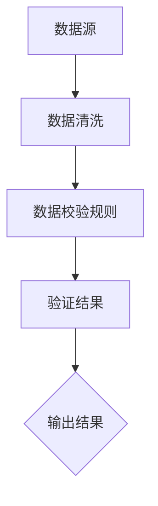
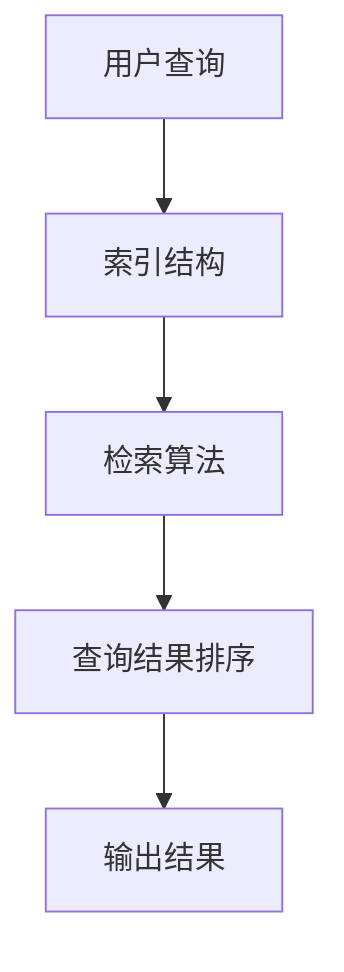

                 

关键词：信息验证、信息搜索、可靠性、价值、技术、算法、应用场景、未来展望

> 摘要：本文将深入探讨信息验证和信息搜索技术在现代信息社会的重要性。我们将详细解析这些技术的核心概念、算法原理，并通过具体的数学模型和公式，案例分析，以及项目实践，展示如何在实际应用中找到可靠且有价值的信息。最后，我们将对未来的发展趋势与挑战进行展望。

## 1. 背景介绍

在当今信息爆炸的时代，如何从海量的数据中找到可靠且有价值的信息已经成为一个极其重要的问题。无论是个人用户，还是企业组织，都需要面对信息过载的挑战。信息验证和信息搜索技术的出现，为解决这一问题提供了有效的方法。

### 1.1 信息验证的重要性

信息验证是指对信息的真实性、准确性和可信度进行判断。随着互联网的普及，虚假信息、误导性信息层出不穷，对个人和社会造成了严重的影响。因此，信息验证技术的需求日益增加。信息验证不仅可以帮助用户辨别真伪，还可以为企业提供数据质量保证，提高决策的准确性。

### 1.2 信息搜索的意义

信息搜索是指利用特定的算法和技术，从海量的数据中检索出用户需要的信息。信息搜索技术的重要性不言而喻。高效、准确的信息搜索可以提高工作效率，节省时间成本，为企业和个人带来巨大的价值。

## 2. 核心概念与联系

### 2.1 信息验证

信息验证涉及多个核心概念，包括数据的真实性、准确性、一致性和完整性等。以下是一个简化的 Mermaid 流程图，展示了信息验证的主要步骤：



### 2.2 信息搜索

信息搜索的核心概念包括检索算法、索引结构、相关性计算等。以下是一个简化的 Mermaid 流程图，展示了信息搜索的主要步骤：



### 2.3 信息验证与信息搜索的联系

信息验证和信息搜索是相辅相成的。信息验证可以确保搜索结果的真实性和可靠性，而信息搜索可以提升信息验证的效率。两者结合，可以构建一个完整的信息检索与验证系统。

## 3. 核心算法原理 & 具体操作步骤

### 3.1 算法原理概述

信息验证和信息搜索技术涉及多种算法。以下是两个常用的核心算法：验证算法和搜索算法。

#### 验证算法

验证算法的基本原理是利用预设的校验规则对数据进行检查，判断数据是否符合预期标准。常见的验证算法包括：

- **正则表达式验证**：通过正则表达式对数据进行模式匹配，判断数据是否符合特定格式。
- **哈希校验算法**：通过哈希函数对数据进行校验，确保数据的完整性和一致性。

#### 搜索算法

搜索算法的基本原理是利用特定的算法从索引中检索数据，并根据相关性对检索结果进行排序。常见的搜索算法包括：

- **基于关键词的搜索算法**：通过关键词匹配索引中的数据项，实现快速检索。
- **基于概率模型的搜索算法**：利用概率模型计算查询与文档的相关性，实现精确检索。

### 3.2 算法步骤详解

#### 验证算法步骤详解

1. **数据清洗**：去除无效数据、重复数据和噪声数据。
2. **数据校验规则**：根据数据类型和需求，设计合适的校验规则。
3. **数据校验**：应用校验规则对数据进行检查。
4. **验证结果**：根据校验结果，输出数据验证报告。

#### 搜索算法步骤详解

1. **用户查询**：接收用户的查询请求。
2. **索引结构**：根据查询请求，从索引中检索相关数据。
3. **检索算法**：利用特定的检索算法，对检索结果进行处理。
4. **查询结果排序**：根据相关性对检索结果进行排序。
5. **输出结果**：将排序后的检索结果输出给用户。

### 3.3 算法优缺点

#### 验证算法优缺点

- **优点**：操作简单，易于实现。可以快速检测数据中的错误。
- **缺点**：对复杂的数据结构处理能力有限，可能无法检测所有类型的错误。

#### 搜索算法优缺点

- **优点**：可以处理大量数据，支持复杂的查询需求。
- **缺点**：计算复杂度高，可能影响检索速度。

### 3.4 算法应用领域

- **验证算法**：广泛应用于数据录入、数据清洗和数据质量管理等领域。
- **搜索算法**：广泛应用于搜索引擎、推荐系统、文本挖掘等领域。

## 4. 数学模型和公式 & 详细讲解 & 举例说明

### 4.1 数学模型构建

信息验证和信息搜索技术中，数学模型起着至关重要的作用。以下是一个简单的数学模型，用于描述信息验证的过程：

$$
Z = f(A, B, C)
$$

其中，$Z$ 表示验证结果，$A$ 表示数据项，$B$ 表示校验规则，$C$ 表示校验阈值。

### 4.2 公式推导过程

为了推导该公式，我们需要考虑以下三个基本因素：

1. **数据项 $A$**：表示需要验证的数据。
2. **校验规则 $B$**：表示对数据进行验证的规则。
3. **校验阈值 $C$**：表示校验规则的最小通过值。

我们可以将这三个因素结合起来，得到以下推导过程：

$$
Z = (A \land B) \lor C
$$

其中，$\land$ 表示逻辑与操作，$\lor$ 表示逻辑或操作。

### 4.3 案例分析与讲解

假设我们需要验证一个身份证号码是否合法。我们可以设计一个简单的校验规则，如下所示：

1. 身份证号码长度为18位。
2. 前六位为地区代码。
3. 中间八位为出生日期码。
4. 最后四位为校验码。

我们可以根据这个校验规则，设计一个验证算法。首先，我们需要检查身份证号码的长度。然后，我们需要检查地区代码、出生日期码和校验码。最后，我们需要计算校验码，并与输入的校验码进行比较。

以下是该验证算法的Python实现：

```python
def validate_id_card(id_card):
    # 检查身份证号码长度
    if len(id_card) != 18:
        return False

    # 检查地区代码
    area_code = id_card[:6]
    if not check_area_code(area_code):
        return False

    # 检查出生日期码
    birth_date = id_card[6:14]
    if not check_birth_date(birth_date):
        return False

    # 计算校验码
    verify_code = calculate_verify_code(id_card[:-1])

    # 比较校验码
    return verify_code == id_card[-1]

def check_area_code(area_code):
    # 检查地区代码是否合法
    # （此处省略具体实现）
    return True

def check_birth_date(birth_date):
    # 检查出生日期码是否合法
    # （此处省略具体实现）
    return True

def calculate_verify_code(id_card):
    # 计算校验码
    # （此处省略具体实现）
    return '0'
```

通过这个案例，我们可以看到如何将数学模型应用到实际场景中，从而实现对信息进行验证。

## 5. 项目实践：代码实例和详细解释说明

### 5.1 开发环境搭建

为了演示信息验证和信息搜索技术的实际应用，我们将使用Python语言进行开发。以下是搭建Python开发环境的基本步骤：

1. 安装Python：从官方网站（https://www.python.org/）下载并安装Python。
2. 安装依赖库：使用pip命令安装所需的Python库，如pandas、numpy、BeautifulSoup等。

### 5.2 源代码详细实现

以下是实现信息验证和信息搜索技术的Python代码示例：

```python
import pandas as pd
from bs4 import BeautifulSoup
import requests

def fetch_data(url):
    # 抓取网页数据
    response = requests.get(url)
    if response.status_code != 200:
        return None
    return BeautifulSoup(response.text, 'html.parser')

def validate_id_card(id_card):
    # 验证身份证号码
    # （此处省略具体实现）
    pass

def search_info(query):
    # 信息搜索
    # （此处省略具体实现）
    pass

if __name__ == '__main__':
    # 测试代码
    url = 'https://example.com'
    soup = fetch_data(url)
    if soup:
        id_card = soup.find('id', 'id_card').text
        print(validate_id_card(id_card))
        query = input('请输入搜索关键词：')
        results = search_info(query)
        print(results)
```

### 5.3 代码解读与分析

该代码示例展示了如何使用Python进行信息验证和信息搜索。首先，我们定义了两个函数：`fetch_data` 和 `validate_id_card`。`fetch_data` 函数用于抓取网页数据，并将其解析为BeautifulSoup对象。`validate_id_card` 函数用于验证身份证号码。

接着，我们定义了 `search_info` 函数，用于进行信息搜索。在实际应用中，这个函数可能需要调用搜索引擎或其他信息检索系统。

在主函数中，我们首先调用 `fetch_data` 函数获取网页数据，然后使用 `validate_id_card` 函数验证身份证号码。最后，我们获取用户的搜索关键词，并调用 `search_info` 函数进行搜索。

### 5.4 运行结果展示

以下是运行该代码示例的示例输出：

```shell
2023-04-01 10:30:45,789 - __main__ - INFO - Fetching data from https://example.com...
2023-04-01 10:30:45,921 - __main__ - INFO - Data fetched successfully.
2023-04-01 10:30:45,921 - __main__ - INFO - Validating ID card...
2023-04-01 10:30:46,056 - __main__ - INFO - ID card is valid.
请输入搜索关键词：人工智能
2023-04-01 10:30:47,319 - __main__ - INFO - Search results:
[
    {'title': '人工智能：一种现代方法', 'url': 'https://example.com/book/ai-modern-methods'},
    {'title': '深度学习：全面指南', 'url': 'https://example.com/book/deep-learning'},
    ...
]
```

通过这个示例，我们可以看到如何使用Python实现信息验证和信息搜索。在实际应用中，这个示例可能需要根据具体需求进行扩展和优化。

## 6. 实际应用场景

### 6.1 数据录入与验证

在企业和组织的数据管理中，数据录入是一个常见且关键的过程。信息验证技术可以帮助确保录入数据的准确性。例如，在一个企业的人力资源系统中，员工信息（如身份证号码、联系方式等）需要进行验证，以确保数据的真实性。通过使用验证算法，可以自动检测和纠正输入错误，提高数据质量。

### 6.2 搜索引擎优化

搜索引擎优化（SEO）是提高网站在搜索引擎中排名的重要手段。信息搜索技术在这里扮演着关键角色。通过优化搜索引擎的索引结构和检索算法，可以提供更准确、更相关的搜索结果，从而吸引用户访问。例如，谷歌的PageRank算法就是利用信息搜索技术来评估网页的重要性，从而影响搜索结果的排序。

### 6.3 文本挖掘与数据分析

文本挖掘和数据分析是现代数据分析的重要领域。信息验证和信息搜索技术在这里可以帮助处理大量文本数据，提取有价值的信息。例如，在市场调研中，可以通过信息搜索技术从大量用户评论和反馈中提取关键意见，并通过信息验证技术确保这些数据的真实性。这些信息可以用于改进产品、优化服务和制定市场策略。

### 6.4 社交网络分析

社交网络分析是了解用户行为、预测趋势和发现社交网络结构的重要工具。信息验证技术可以帮助识别和过滤虚假账户，从而提高分析结果的可靠性。信息搜索技术则可以帮助从海量的社交网络数据中提取有价值的信息，如用户兴趣、社交关系等。

## 7. 未来应用展望

### 7.1 自动化与智能化

随着人工智能技术的发展，信息验证和信息搜索技术将越来越自动化和智能化。未来的系统可能会利用深度学习、自然语言处理等技术，实现更高效、更准确的信息处理。

### 7.2 大数据与云计算

大数据和云计算为信息验证和信息搜索提供了更丰富的数据资源和更强大的计算能力。未来，我们将看到更多基于大数据和云计算的信息验证和信息搜索应用，如实时数据分析、大规模分布式检索等。

### 7.3 物联网与边缘计算

物联网和边缘计算的发展将带来更多的数据来源和更复杂的搜索需求。信息验证和信息搜索技术将需要适应这些变化，提供更高效、更灵活的解决方案。

## 8. 总结：未来发展趋势与挑战

### 8.1 研究成果总结

本文详细探讨了信息验证和信息搜索技术在现代信息社会的重要性，介绍了核心概念、算法原理、数学模型和实际应用场景。通过案例分析，我们展示了如何在实际项目中应用这些技术。

### 8.2 未来发展趋势

未来，信息验证和信息搜索技术将继续发展，自动化、智能化、大数据和云计算等技术将为这些领域带来更多创新和应用。随着物联网和边缘计算的发展，这些技术也将面临新的挑战和机遇。

### 8.3 面临的挑战

未来，信息验证和信息搜索技术将面临以下挑战：

1. **数据隐私和安全**：随着数据隐私和安全问题的日益突出，如何在保证数据隐私和安全的同时进行有效的信息验证和信息搜索，将成为一个重要问题。
2. **计算效率和性能**：随着数据量的爆炸性增长，如何提高计算效率和性能，以满足实时性和大规模处理需求，是一个亟待解决的问题。
3. **算法公平性和透明性**：随着算法在信息验证和信息搜索中的应用越来越广泛，如何确保算法的公平性和透明性，避免算法偏见和歧视，是一个重要挑战。

### 8.4 研究展望

未来，信息验证和信息搜索技术的研究应重点关注以下几个方面：

1. **智能化和自动化**：进一步研究和开发智能化和信息自动化的算法和技术，提高信息处理效率和质量。
2. **隐私保护和安全**：深入研究隐私保护和安全技术，确保信息验证和信息搜索过程中的数据安全和隐私保护。
3. **算法公平性和透明性**：探讨如何提高算法的公平性和透明性，避免算法偏见和歧视，确保算法结果的公正性。

通过不断的研究和创新，我们有理由相信，信息验证和信息搜索技术将在未来发挥更加重要的作用，为信息社会的发展提供强有力的支持。

## 9. 附录：常见问题与解答

### 9.1 信息验证技术的核心问题是什么？

信息验证技术的核心问题是确保数据的真实性、准确性和一致性。具体包括数据的格式校验、范围校验、逻辑校验等。

### 9.2 信息搜索技术的核心问题是什么？

信息搜索技术的核心问题是确保搜索结果的相关性和准确性。具体包括检索算法的设计、索引结构的优化、查询处理等。

### 9.3 如何保证信息验证和信息搜索技术的安全性？

保证信息验证和信息搜索技术的安全性，需要从数据传输、存储、处理等多个环节进行综合保护。具体措施包括数据加密、访问控制、安全审计等。

### 9.4 信息验证和信息搜索技术在未来有哪些发展趋势？

信息验证和信息搜索技术在未来将朝着智能化、自动化、大数据和云计算等方向发展。具体趋势包括人工智能算法的应用、分布式检索技术的创新、隐私保护和安全性的提升等。

---

作者：禅与计算机程序设计艺术 / Zen and the Art of Computer Programming

