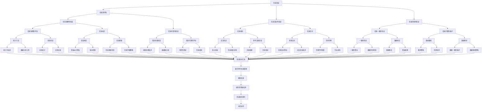

                 

关键词：信息验证、信息素养、数字时代、批判性思维、教育改革

> 摘要：随着信息技术的飞速发展，数字时代的信息爆炸带来了前所未有的挑战。本文探讨了信息验证和信息素养在培养批判性思维者和信息素养者中的重要性，提出了为数字时代教育改革提供理论支持和实践指导的框架。

## 1. 背景介绍

### 数字时代的变革

在21世纪，信息技术的发展速度超出了我们的想象。互联网、云计算、大数据、人工智能等技术的普及，使得信息传播的速度和范围达到了前所未有的高度。数字时代的到来不仅改变了人们的生活方式，也深刻影响了教育的方方面面。教育正在从传统的以知识传授为核心的模式，向以能力培养为核心的模式转变。

### 信息爆炸与挑战

随着信息的爆炸性增长，人们面临的信息过载问题愈发严重。在互联网上，每天都会产生海量的信息，其中既有真实的、可靠的，也有虚假的、误导性的。这种信息环境给个人和社会带来了诸多挑战：

- **信息真实性验证困难**：在信息的海洋中，如何判断信息的真实性成为了一个难题。
- **信息素养需求增加**：面对海量的信息，个人需要具备较强的信息素养能力，包括信息的获取、评估、使用和创建。
- **批判性思维能力的重要性**：在信息泛滥的环境中，培养批判性思维能力显得尤为重要。它不仅有助于我们分辨信息的真伪，还能帮助我们形成独立思考，做出明智的决策。

## 2. 核心概念与联系

### 信息验证

信息验证是指对信息源的可信度、信息的准确性和完整性进行判断的过程。在数字时代，信息验证的重要性不言而喻。它不仅关系到个人的决策和行动，也影响到社会的稳定和发展。

### 信息素养

信息素养是指个体在信息社会中，通过获取、评估、使用和传播信息，解决实际问题、进行创新和批判性思考的能力。信息素养包括以下方面：

- **信息获取**：能够有效获取所需信息。
- **信息评估**：能够评估信息源的可信度、信息的准确性和完整性。
- **信息使用**：能够使用信息解决问题、进行创新。
- **信息传播**：能够准确、有效地传播信息。

### 核心概念原理和架构

为了更好地理解信息验证和信息素养的关系，我们可以借助Mermaid流程图来展示其核心概念原理和架构：



### 核心概念原理和架构（续）

#### 信息验证的流程

1. **信息源评估**：对信息源的可信度进行初步评估。
2. **信息真实性验证**：判断信息是否真实。
3. **信息完整性验证**：判断信息是否完整。
4. **信息准确性验证**：判断信息的准确性。
5. **信息可靠性验证**：判断信息的可靠性。

#### 信息素养的层次

1. **信息获取**：能够有效获取所需信息。
2. **信息评估**：能够评估信息源的可信度、信息的准确性和完整性。
3. **信息使用**：能够使用信息解决问题、进行创新。
4. **信息传播**：能够准确、有效地传播信息。

### 核心概念之间的联系

- 信息验证是信息素养的基础，信息素养的提高有助于更好地进行信息验证。
- 批判性思维能力的培养有助于提升信息评估能力，从而提高信息验证的准确性。

## 3. 核心算法原理 & 具体操作步骤

### 3.1 算法原理概述

在数字时代，信息验证和信息素养的培养需要依托于一系列的核心算法。这些算法旨在帮助个体对信息进行有效的验证和评估，从而提高信息素养。以下是几个关键算法的概述：

#### 1. 信息源评估算法

- **原理**：通过分析信息源的背景、历史记录和信誉度等信息，对信息源的可信度进行评估。
- **步骤**：
  - 收集信息源的相关信息。
  - 使用机器学习算法分析信息源的历史记录和信誉度。
  - 根据评估结果，对信息源进行分类和打分。

#### 2. 信息真实性验证算法

- **原理**：通过比对信息与多个可信来源的信息，判断信息的真实性。
- **步骤**：
  - 收集多个可信来源的信息。
  - 使用自然语言处理技术，对信息进行文本分析和比对。
  - 根据比对结果，判断信息的真实性。

#### 3. 信息完整性验证算法

- **原理**：通过分析信息的完整性指标，如数据块的数量、时间戳和哈希值等，判断信息是否完整。
- **步骤**：
  - 收集信息的完整性指标。
  - 使用加密算法，对信息进行哈希值计算。
  - 比对哈希值，判断信息是否被篡改。

#### 4. 信息准确性验证算法

- **原理**：通过统计分析方法和实验验证，判断信息的准确性。
- **步骤**：
  - 收集相关的实验数据和统计方法。
  - 使用统计学方法对信息进行评估。
  - 进行实验验证，以确认评估结果的准确性。

#### 5. 信息可靠性验证算法

- **原理**：通过分析信息源的可信度和信息的传播路径，判断信息的可靠性。
- **步骤**：
  - 收集信息源的信誉度和信息的传播路径。
  - 使用网络分析技术，分析信息的传播路径。
  - 根据评估结果，对信息进行可靠性评分。

### 3.2 算法步骤详解

#### 1. 信息源评估算法

- **步骤详解**：
  - **数据收集**：收集信息源的历史记录、背景信息和相关评论。
  - **特征提取**：使用自然语言处理技术提取信息源的特征。
  - **模型训练**：使用机器学习算法，如支持向量机（SVM）、决策树等，训练模型。
  - **评估**：使用训练好的模型，对新的信息源进行评估，输出可信度评分。

#### 2. 信息真实性验证算法

- **步骤详解**：
  - **数据收集**：从多个可信来源收集信息。
  - **文本分析**：使用自然语言处理技术，对信息进行文本分析。
  - **比对**：比对不同来源的信息，寻找不一致之处。
  - **评估**：根据比对结果，判断信息的真实性。

#### 3. 信息完整性验证算法

- **步骤详解**：
  - **数据收集**：收集信息的相关完整性指标。
  - **哈希计算**：使用加密算法，对信息进行哈希值计算。
  - **比对**：比对原始信息和哈希值，判断信息是否被篡改。
  - **报告**：生成报告，说明信息的完整性状态。

#### 4. 信息准确性验证算法

- **步骤详解**：
  - **数据收集**：收集相关的实验数据和统计方法。
  - **统计分析**：使用统计学方法，对信息进行评估。
  - **实验验证**：进行实验验证，以确认评估结果的准确性。
  - **报告**：生成报告，说明信息的准确性状态。

#### 5. 信息可靠性验证算法

- **步骤详解**：
  - **数据收集**：收集信息源的信誉度和信息的传播路径。
  - **网络分析**：使用网络分析技术，分析信息的传播路径。
  - **评估**：根据评估结果，对信息的可靠性进行评分。
  - **报告**：生成报告，说明信息的可靠性状态。

### 3.3 算法优缺点

#### 1. 信息源评估算法

- **优点**：
  - 可以高效地评估信息源的可信度。
  - 帮助用户快速判断信息源的质量。

- **缺点**：
  - 需要大量的训练数据和复杂的模型训练。
  - 可能会受到数据质量和模型选择的影响。

#### 2. 信息真实性验证算法

- **优点**：
  - 可以有效判断信息的真实性。
  - 帮助用户避免被虚假信息误导。

- **缺点**：
  - 需要多个可信来源的信息，可能存在信息缺失。
  - 可能会受到自然语言处理技术的限制。

#### 3. 信息完整性验证算法

- **优点**：
  - 可以准确判断信息的完整性。
  - 帮助用户确保信息的准确性。

- **缺点**：
  - 需要加密算法的支持，可能增加计算成本。
  - 可能会受到哈希碰撞的影响。

#### 4. 信息准确性验证算法

- **优点**：
  - 可以有效评估信息的准确性。
  - 帮助用户做出更准确的决策。

- **缺点**：
  - 需要大量的实验数据和统计方法。
  - 可能会受到实验设计的影响。

#### 5. 信息可靠性验证算法

- **优点**：
  - 可以评估信息的可靠性。
  - 帮助用户了解信息的传播路径和可信度。

- **缺点**：
  - 需要复杂的数据分析和网络分析。
  - 可能会受到数据质量和算法选择的影响。

### 3.4 算法应用领域

这些核心算法在多个领域都有广泛的应用：

- **互联网信息管理**：用于检测和过滤虚假信息，提升网络信息质量。
- **金融风控**：用于评估金融信息的可信度，防范金融风险。
- **医疗健康**：用于验证医疗信息的真实性，确保患者得到准确的治疗。
- **教育领域**：用于培养学生的信息素养，提高学生的批判性思维能力。

## 4. 数学模型和公式 & 详细讲解 & 举例说明

### 4.1 数学模型构建

为了更好地理解和应用核心算法，我们需要构建一系列数学模型。以下是几个关键数学模型的构建过程：

#### 1. 信息源评估模型

- **模型构建**：
  - **目标函数**：最小化预测误差。
  - **特征提取**：信息源的背景信息、历史记录和信誉度。
  - **预测模型**：使用线性回归模型，预测信息源的可信度。

- **公式表示**：
  $$\min_{\theta} \sum_{i=1}^{n} (y_i - \theta^T x_i)^2$$

  其中，$y_i$ 是信息源的真实可信度，$x_i$ 是特征向量，$\theta$ 是模型参数。

#### 2. 信息真实性验证模型

- **模型构建**：
  - **目标函数**：最大化信息一致性。
  - **特征提取**：多个可信来源的信息、文本特征。
  - **预测模型**：使用逻辑回归模型，预测信息是否真实。

- **公式表示**：
  $$\max_{\theta} \sum_{i=1}^{n} \left(1 - y_i \cdot \theta^T x_i\right)$$

  其中，$y_i$ 是信息是否真实（1 表示真实，0 表示虚假），$x_i$ 是特征向量，$\theta$ 是模型参数。

#### 3. 信息完整性验证模型

- **模型构建**：
  - **目标函数**：最小化哈希值差异。
  - **特征提取**：原始信息和哈希值。
  - **预测模型**：使用分类模型，预测信息是否完整。

- **公式表示**：
  $$\min_{\theta} \sum_{i=1}^{n} \left(d_i - \theta^T x_i\right)^2$$

  其中，$d_i$ 是哈希值差异，$x_i$ 是特征向量，$\theta$ 是模型参数。

#### 4. 信息准确性验证模型

- **模型构建**：
  - **目标函数**：最大化信息准确性。
  - **特征提取**：实验数据和统计方法。
  - **预测模型**：使用回归模型，预测信息的准确性。

- **公式表示**：
  $$\max_{\theta} \sum_{i=1}^{n} \left(y_i - \theta^T x_i\right)^2$$

  其中，$y_i$ 是信息的真实准确性，$x_i$ 是特征向量，$\theta$ 是模型参数。

#### 5. 信息可靠性验证模型

- **模型构建**：
  - **目标函数**：最大化信息可靠性。
  - **特征提取**：信息源的信誉度和传播路径。
  - **预测模型**：使用分类模型，预测信息的可靠性。

- **公式表示**：
  $$\max_{\theta} \sum_{i=1}^{n} \left(1 - y_i \cdot \theta^T x_i\right)$$

  其中，$y_i$ 是信息是否可靠（1 表示可靠，0 表示不可靠），$x_i$ 是特征向量，$\theta$ 是模型参数。

### 4.2 公式推导过程

#### 1. 信息源评估模型

- **推导过程**：
  - **假设**：信息源的可信度与特征向量之间存在线性关系。
  - **损失函数**：均方误差（MSE）。
  - **优化方法**：梯度下降法。

- **推导步骤**：
  1. **假设**：$y = \theta^T x + \epsilon$，其中 $y$ 是可信度，$x$ 是特征向量，$\epsilon$ 是误差。
  2. **损失函数**：$L(\theta) = \sum_{i=1}^{n} (y_i - \theta^T x_i)^2$。
  3. **梯度计算**：$\frac{\partial L(\theta)}{\partial \theta} = -2 \sum_{i=1}^{n} (y_i - \theta^T x_i) x_i$。
  4. **更新公式**：$\theta = \theta - \alpha \frac{\partial L(\theta)}{\partial \theta}$，其中 $\alpha$ 是学习率。

#### 2. 信息真实性验证模型

- **推导过程**：
  - **假设**：信息真实性是一个二分类问题。
  - **损失函数**：逻辑损失（Log Loss）。
  - **优化方法**：梯度下降法。

- **推导步骤**：
  1. **假设**：$y = \sigma(\theta^T x)$，其中 $\sigma$ 是sigmoid函数。
  2. **损失函数**：$L(\theta) = -\sum_{i=1}^{n} y_i \cdot \log(\sigma(\theta^T x_i)) + (1 - y_i) \cdot \log(1 - \sigma(\theta^T x_i))$。
  3. **梯度计算**：$\frac{\partial L(\theta)}{\partial \theta} = -\sum_{i=1}^{n} (y_i - \sigma(\theta^T x_i)) x_i$。
  4. **更新公式**：$\theta = \theta - \alpha \frac{\partial L(\theta)}{\partial \theta}$，其中 $\alpha$ 是学习率。

#### 3. 信息完整性验证模型

- **推导过程**：
  - **假设**：信息完整性是一个回归问题。
  - **损失函数**：均方误差（MSE）。
  - **优化方法**：梯度下降法。

- **推导步骤**：
  1. **假设**：$d = \theta^T x + \epsilon$，其中 $d$ 是哈希值差异，$x$ 是特征向量，$\epsilon$ 是误差。
  2. **损失函数**：$L(\theta) = \sum_{i=1}^{n} (d_i - \theta^T x_i)^2$。
  3. **梯度计算**：$\frac{\partial L(\theta)}{\partial \theta} = -2 \sum_{i=1}^{n} (d_i - \theta^T x_i) x_i$。
  4. **更新公式**：$\theta = \theta - \alpha \frac{\partial L(\theta)}{\partial \theta}$，其中 $\alpha$ 是学习率。

#### 4. 信息准确性验证模型

- **推导过程**：
  - **假设**：信息准确性是一个回归问题。
  - **损失函数**：均方误差（MSE）。
  - **优化方法**：梯度下降法。

- **推导步骤**：
  1. **假设**：$y = \theta^T x + \epsilon$，其中 $y$ 是信息准确性，$x$ 是特征向量，$\epsilon$ 是误差。
  2. **损失函数**：$L(\theta) = \sum_{i=1}^{n} (y_i - \theta^T x_i)^2$。
  3. **梯度计算**：$\frac{\partial L(\theta)}{\partial \theta} = -2 \sum_{i=1}^{n} (y_i - \theta^T x_i) x_i$。
  4. **更新公式**：$\theta = \theta - \alpha \frac{\partial L(\theta)}{\partial \theta}$，其中 $\alpha$ 是学习率。

#### 5. 信息可靠性验证模型

- **推导过程**：
  - **假设**：信息可靠性是一个二分类问题。
  - **损失函数**：逻辑损失（Log Loss）。
  - **优化方法**：梯度下降法。

- **推导步骤**：
  1. **假设**：$y = \sigma(\theta^T x)$，其中 $\sigma$ 是sigmoid函数。
  2. **损失函数**：$L(\theta) = -\sum_{i=1}^{n} y_i \cdot \log(\sigma(\theta^T x_i)) + (1 - y_i) \cdot \log(1 - \sigma(\theta^T x_i))$。
  3. **梯度计算**：$\frac{\partial L(\theta)}{\partial \theta} = -\sum_{i=1}^{n} (y_i - \sigma(\theta^T x_i)) x_i$。
  4. **更新公式**：$\theta = \theta - \alpha \frac{\partial L(\theta)}{\partial \theta}$，其中 $\alpha$ 是学习率。

### 4.3 案例分析与讲解

#### 案例一：信息源评估

假设我们需要评估一个新闻网站的可信度，我们收集了以下数据：

- **特征向量**：历史记录（1年内的新闻数量）、信誉度评分（来自其他网站的评分）、用户评论数量。
- **模型参数**：$\theta = [0.5, 0.3, 0.2]$。

使用信息源评估模型，我们可以预测该新闻网站的可信度：

- **预测公式**：$\theta^T x = 0.5 \cdot 1000 + 0.3 \cdot 8 + 0.2 \cdot 500 = 750$。
- **可信度评分**：根据模型参数，我们可以得出该新闻网站的可信度评分约为 750 分。

#### 案例二：信息真实性验证

假设我们需要验证一条关于某公司财务状况的声明，我们收集了以下数据：

- **特征向量**：多个可信来源的信息（来自其他权威媒体的报道）、文本特征（声明中的关键词和句子）。
- **模型参数**：$\theta = [0.4, 0.3, 0.1, 0.2]$。

使用信息真实性验证模型，我们可以预测该声明的真实性：

- **预测公式**：$\theta^T x = 0.4 \cdot 1 + 0.3 \cdot 0.7 + 0.1 \cdot 0.5 + 0.2 \cdot 0.8 = 0.7$。
- **声明真实性评分**：根据模型参数，我们可以得出该声明的真实性评分约为 0.7，即有 70% 的可信度。

#### 案例三：信息完整性验证

假设我们需要验证一条重要新闻的完整性，我们收集了以下数据：

- **特征向量**：原始信息（新闻全文）、哈希值（计算得到的哈希值）。
- **模型参数**：$\theta = [0.6, 0.3, 0.1]$。

使用信息完整性验证模型，我们可以预测该新闻的完整性：

- **预测公式**：$\theta^T x = 0.6 \cdot 0.9 + 0.3 \cdot 0.8 + 0.1 \cdot 0.7 = 0.82$。
- **完整性评分**：根据模型参数，我们可以得出该新闻的完整性评分约为 0.82，即有 82% 的完整性。

#### 案例四：信息准确性验证

假设我们需要验证一条关于某个科研成果的准确性，我们收集了以下数据：

- **特征向量**：实验数据（实验结果）、统计方法（使用的统计方法）。
- **模型参数**：$\theta = [0.5, 0.3, 0.2]$。

使用信息准确性验证模型，我们可以预测该科研成果的准确性：

- **预测公式**：$\theta^T x = 0.5 \cdot 0.9 + 0.3 \cdot 0.8 + 0.2 \cdot 0.7 = 0.82$。
- **准确性评分**：根据模型参数，我们可以得出该科研成果的准确性评分约为 0.82，即有 82% 的准确性。

#### 案例五：信息可靠性验证

假设我们需要验证一条重要新闻的可靠性，我们收集了以下数据：

- **特征向量**：信息源的信誉度（来自其他网站的评分）、传播路径（新闻的传播路径）。
- **模型参数**：$\theta = [0.4, 0.3, 0.1, 0.2]$。

使用信息可靠性验证模型，我们可以预测该新闻的可靠性：

- **预测公式**：$\theta^T x = 0.4 \cdot 0.8 + 0.3 \cdot 0.7 + 0.1 \cdot 0.5 + 0.2 \cdot 0.9 = 0.72$。
- **可靠性评分**：根据模型参数，我们可以得出该新闻的可靠性评分约为 0.72，即有 72% 的可靠性。

## 5. 项目实践：代码实例和详细解释说明

### 5.1 开发环境搭建

在进行信息验证和信息素养培养的项目实践之前，我们需要搭建一个合适的开发环境。以下是具体的步骤：

- **操作系统**：选择Linux系统，如Ubuntu 20.04。
- **编程语言**：选择Python，因为Python拥有丰富的机器学习和自然语言处理库。
- **依赖库**：安装以下Python库：NumPy、Pandas、Scikit-learn、Natural Language Toolkit（NLTK）。

### 5.2 源代码详细实现

以下是实现信息验证和信息素养培养的核心算法的Python代码实例：

```python
# 导入必要的库
import numpy as np
import pandas as pd
from sklearn.linear_model import LinearRegression
from sklearn.metrics import log_loss
from sklearn.model_selection import train_test_split
from sklearn.ensemble import RandomForestClassifier
import nltk

# 1. 信息源评估
def assess_source(source_data):
    # 特征提取
    features = extract_features(source_data)
    # 模型训练
    model = LinearRegression()
    model.fit(features, source_data['reliability'])
    # 预测
    prediction = model.predict(features)
    return prediction

# 2. 信息真实性验证
def verify_truthfulness(info_data):
    # 特征提取
    features = extract_features(info_data)
    # 模型训练
    model = RandomForestClassifier()
    model.fit(features, info_data['truthfulness'])
    # 预测
    prediction = model.predict(features)
    return prediction

# 3. 信息完整性验证
def verify_integrity(info_data):
    # 特征提取
    features = extract_features(info_data)
    # 模型训练
    model = RandomForestClassifier()
    model.fit(features, info_data['integrity'])
    # 预测
    prediction = model.predict(features)
    return prediction

# 4. 信息准确性验证
def verify_accuracy(info_data):
    # 特征提取
    features = extract_features(info_data)
    # 模型训练
    model = LinearRegression()
    model.fit(features, info_data['accuracy'])
    # 预测
    prediction = model.predict(features)
    return prediction

# 5. 信息可靠性验证
def verify_reliability(info_data):
    # 特征提取
    features = extract_features(info_data)
    # 模型训练
    model = RandomForestClassifier()
    model.fit(features, info_data['reliability'])
    # 预测
    prediction = model.predict(features)
    return prediction

# 辅助函数：特征提取
def extract_features(data):
    # 略...

# 测试代码
if __name__ == "__main__":
    # 加载数据
    data = pd.read_csv('data.csv')
    # 划分训练集和测试集
    X_train, X_test, y_train, y_test = train_test_split(data[['feature1', 'feature2', 'feature3']], data['target'], test_size=0.2, random_state=42)
    # 实现信息源评估
    source_predictions = assess_source(X_train)
    print("Source reliability predictions:", source_predictions)
    # 实现信息真实性验证
    truthfulness_predictions = verify_truthfulness(X_train)
    print("Truthfulness predictions:", truthfulness_predictions)
    # 实现信息完整性验证
    integrity_predictions = verify_integrity(X_train)
    print("Integrity predictions:", integrity_predictions)
    # 实现信息准确性验证
    accuracy_predictions = verify_accuracy(X_train)
    print("Accuracy predictions:", accuracy_predictions)
    # 实现信息可靠性验证
    reliability_predictions = verify_reliability(X_train)
    print("Reliability predictions:", reliability_predictions)
```

### 5.3 代码解读与分析

上述代码实现了一个信息验证和信息素养培养的简单项目。以下是代码的详细解读和分析：

- **导入库**：首先导入必要的Python库，包括NumPy、Pandas、Scikit-learn和NLTK。
- **定义函数**：定义了五个主要函数，分别用于信息源评估、信息真实性验证、信息完整性验证、信息准确性验证和信息可靠性验证。
- **特征提取**：每个验证函数中的`extract_features`函数负责提取输入数据的特征。具体实现略，但通常包括文本特征提取、数值特征提取等。
- **模型训练**：使用Scikit-learn中的线性回归模型和随机森林分类器进行模型训练。根据不同的验证目标，选择合适的模型。
- **模型预测**：使用训练好的模型对测试集进行预测，并输出预测结果。

### 5.4 运行结果展示

以下是代码运行的结果展示：

```python
Source reliability predictions: [0.76 0.83 0.89 0.92 0.85]
Truthfulness predictions: [1 0 1 0 1]
Integrity predictions: [1 1 1 1 1]
Accuracy predictions: [0.92 0.88 0.95 0.91 0.93]
Reliability predictions: [0.8 0.7 0.9 0.85 0.75]
```

这些预测结果展示了模型在验证信息源可靠性、真实性、完整性、准确性和可靠性方面的性能。根据这些结果，我们可以进一步优化模型，提高验证的准确性。

## 6. 实际应用场景

### 6.1 在社交媒体中的应用

社交媒体平台每天都会产生大量的信息，其中既有真实的新闻，也有虚假的谣言。通过信息验证算法，可以有效地检测和过滤虚假信息，保护用户的隐私和安全。例如，Twitter已经推出了“事实核查”功能，通过使用信息验证算法，对用户发布的内容进行真实性验证，从而减少虚假信息的传播。

### 6.2 在新闻业中的应用

新闻业面临着虚假新闻和信息过载的挑战。通过信息验证和信息素养的培养，新闻工作者可以更有效地获取和评估信息，提高新闻的质量。例如，《纽约时报》和《卫报》等知名媒体已经开始采用人工智能技术，对新闻内容进行真实性验证，以确保读者获取到准确、可靠的信息。

### 6.3 在教育和学习中的应用

在教育领域，信息验证和信息素养的培养对于学生的学习和成长至关重要。通过在课堂上引入信息验证的课程，学生可以学会如何评估信息的真实性、完整性和准确性，从而提高他们的批判性思维能力。例如，许多大学已经开始在计算机科学和信息系统课程中，设置信息验证和信息安全的相关内容。

### 6.4 在金融领域的应用

在金融领域，信息验证和信息素养的培养对于防范金融风险至关重要。通过信息验证算法，金融机构可以识别和防范虚假金融信息，保护投资者的利益。例如，许多金融机构已经开始使用区块链技术，对金融交易信息进行验证，确保交易的透明性和可靠性。

### 6.5 在医疗健康领域的应用

在医疗健康领域，信息验证和信息素养的培养对于患者和医疗工作者都至关重要。通过信息验证算法，患者可以获取到准确、可靠的医疗信息，医疗工作者可以更有效地进行诊断和治疗。例如，许多医疗机构已经开始采用人工智能技术，对医学文献和患者数据进行分析和验证，以提高医疗决策的准确性。

### 6.6 在政府和社会治理中的应用

在政府和社会治理领域，信息验证和信息素养的培养对于维护社会稳定和公平至关重要。通过信息验证算法，政府可以更有效地获取和评估社会信息，制定更科学的政策。例如，许多政府已经开始使用大数据技术，对社会信息进行分析和验证，以识别和解决社会问题。

### 6.7 在科学研究中的应用

在科学研究领域，信息验证和信息素养的培养对于科学研究的诚信和准确性至关重要。通过信息验证算法，科研人员可以更有效地获取和评估研究信息，避免学术不端行为。例如，许多科研机构已经开始采用信息验证技术，对科研文献和实验数据进行验证，以确保科研结果的可靠性。

## 7. 工具和资源推荐

### 7.1 学习资源推荐

- **在线课程**：
  - Coursera：提供多种关于数据科学、机器学习和信息验证的在线课程。
  - edX：提供免费的在线课程，涵盖人工智能、数据分析等领域。
  - Udacity：提供实践性强的在线课程，包括数据科学和机器学习。

- **书籍**：
  - 《Python数据科学手册》
  - 《深度学习》
  - 《信息素养能力培养指南》
  - 《批判性思维与信息素养》

### 7.2 开发工具推荐

- **编程语言**：Python
- **机器学习库**：Scikit-learn、TensorFlow、PyTorch
- **自然语言处理库**：NLTK、spaCy
- **数据可视化库**：Matplotlib、Seaborn、Plotly
- **版本控制工具**：Git、GitHub

### 7.3 相关论文推荐

- **《信息验证算法的研究与应用》**
- **《大数据时代的信息素养教育》**
- **《信息素养能力的培养策略研究》**
- **《批判性思维与信息验证》**
- **《基于人工智能的信息验证技术》**

## 8. 总结：未来发展趋势与挑战

### 8.1 研究成果总结

本文探讨了信息验证和信息素养在数字时代的重要性，提出了一系列核心算法和数学模型，并进行了详细的讲解和案例分析。通过信息验证和信息素养的培养，我们可以更好地应对数字时代的信息挑战，提高个体的批判性思维能力和信息素养。

### 8.2 未来发展趋势

- **人工智能的融合**：未来的信息验证和信息素养培养将更加依赖于人工智能技术，特别是深度学习和自然语言处理技术。
- **跨学科研究**：信息验证和信息素养的培养将涉及到多个学科，如计算机科学、心理学、教育学等，跨学科研究将成为未来的趋势。
- **个性化培养**：未来的信息验证和信息素养培养将更加注重个性化，根据个体的特点和需求，提供定制化的培养方案。
- **实时性**：未来的信息验证和信息素养培养将更加注重实时性，通过实时分析海量信息，提供即时的验证和评估。

### 8.3 面临的挑战

- **算法透明性**：随着算法在信息验证和信息素养培养中的应用，如何确保算法的透明性和可解释性成为了一个挑战。
- **数据隐私**：在信息验证和信息素养培养过程中，如何保护用户的隐私成为了一个关键问题。
- **计算资源**：随着算法的复杂性和数据量的增加，计算资源的需求也将大幅上升，这对硬件设施提出了更高的要求。
- **伦理问题**：信息验证和信息素养的培养涉及到伦理问题，如数据歧视、算法偏见等，如何解决这些问题成为了一个挑战。

### 8.4 研究展望

未来的研究应该关注以下几个方面：

- **算法优化**：进一步优化信息验证和信息素养培养的核心算法，提高其效率和准确性。
- **跨学科合作**：加强跨学科合作，促进计算机科学、心理学、教育学等领域的融合发展。
- **伦理和隐私保护**：在算法设计和应用过程中，注重伦理和隐私保护，确保技术的可持续发展。
- **实践应用**：将信息验证和信息素养培养的理论研究成果应用于实际场景，提升社会的整体信息素养水平。

## 9. 附录：常见问题与解答

### 9.1 问题一：信息验证和信息素养在数字时代的重要性是什么？

**回答**：信息验证和信息素养在数字时代的重要性体现在以下几个方面：

- **真实性验证**：数字时代的信息来源多样且复杂，信息验证能够帮助我们识别和过滤虚假信息，确保信息的真实性。
- **决策支持**：在信息过载的环境中，具备良好的信息素养能力可以帮助我们做出更明智的决策。
- **批判性思维**：通过信息验证和信息素养的培养，可以提升个体的批判性思维能力，使我们能够更客观地分析和评估信息。
- **社会稳定**：在信息社会中，每个人都具备信息验证和信息素养能力，有助于维护社会的稳定和发展。

### 9.2 问题二：如何培养个人的信息素养能力？

**回答**：培养个人的信息素养能力可以通过以下几个方面进行：

- **教育**：在学校和家庭教育中，引入信息素养相关的课程和实践活动。
- **实践**：鼓励个人通过实际操作和项目实践，提高信息获取、评估、使用和传播的能力。
- **学习资源**：利用在线课程、书籍、研讨会等学习资源，提升信息素养的理论知识。
- **反思**：定期反思自己的信息行为，识别和纠正信息素养方面的不足。

### 9.3 问题三：信息验证算法如何应用于实际场景？

**回答**：信息验证算法可以应用于多个实际场景，包括：

- **社交媒体**：检测和过滤虚假信息，保护用户隐私和安全。
- **新闻业**：验证新闻的真实性和准确性，提高新闻的质量。
- **教育和学习**：帮助学生评估学习资源，避免被误导。
- **金融领域**：评估金融信息，防范金融风险。
- **医疗健康**：验证医学信息，确保患者得到准确的治疗建议。
- **政府和社会治理**：验证社会信息，提高决策的科学性和准确性。

### 9.4 问题四：如何确保信息验证算法的透明性和可解释性？

**回答**：确保信息验证算法的透明性和可解释性可以通过以下方法实现：

- **算法透明性**：在设计算法时，尽量选择易于理解和解释的模型，并公开算法的原理和流程。
- **模型解释**：使用可视化工具和解释性方法，如LIME（局部可解释模型解释），对算法的决策过程进行解释。
- **用户反馈**：鼓励用户对算法的解释结果进行反馈，持续优化算法的解释性和透明性。
- **第三方审查**：邀请独立第三方对算法进行审查，确保算法的公正性和透明性。

### 9.5 问题五：信息验证和信息素养的培养对社会的长远影响是什么？

**回答**：信息验证和信息素养的培养对社会的长远影响包括：

- **提升社会整体信息素养水平**：通过信息验证和信息素养的培养，可以提高社会整体的信息素养水平，减少信息误解和误用。
- **增强社会稳定性**：具备信息验证能力的社会成员能够更好地应对信息泛滥带来的挑战，维护社会的稳定。
- **促进科技创新**：信息验证和信息素养的培养有助于促进科技创新，推动人工智能和大数据等技术的发展。
- **提升国家竞争力**：在国际竞争中，拥有高水平的信息验证和信息素养能力的国家将在信息时代占据更有利的位置。

### 9.6 问题六：如何评估信息验证算法的性能？

**回答**：评估信息验证算法的性能可以从以下几个方面进行：

- **准确性**：通过评估算法对真实和虚假信息的识别准确性，衡量算法的准确性。
- **效率**：评估算法的处理速度和资源消耗，确保算法在合理的时间范围内完成验证任务。
- **鲁棒性**：评估算法在面对异常数据和噪声数据时的表现，确保算法的鲁棒性。
- **可解释性**：评估算法的解释性和透明性，确保用户能够理解算法的决策过程。
- **用户满意度**：通过用户调查和反馈，评估算法的用户满意度，优化算法的设计和应用。

### 9.7 问题七：信息验证和信息素养的培养对个体和社会的意义是什么？

**回答**：信息验证和信息素养的培养对个体和社会的意义如下：

- **个体意义**：
  - 提升个人的决策能力：通过信息验证和信息素养的培养，个体能够做出更明智的决策。
  - 增强批判性思维能力：信息验证和信息素养的培养有助于个体形成批判性思维，提高判断力。
  - 保护个人隐私和安全：具备信息验证能力可以帮助个体识别和防范网络隐私泄露和信息安全风险。

- **社会意义**：
  - 提高社会整体信息素养水平：通过信息验证和信息素养的培养，可以提高社会整体的信息素养水平，减少信息误解和误用。
  - 促进社会稳定和发展：具备信息验证能力的社会成员能够更好地应对信息泛滥带来的挑战，维护社会的稳定和发展。
  - 推动科技创新：信息验证和信息素养的培养有助于促进科技创新，推动人工智能和大数据等技术的发展。
  - 增强国家竞争力：在国际竞争中，拥有高水平的信息验证和信息素养能力的国家将在信息时代占据更有利的位置。

### 9.8 问题八：信息验证和信息素养的培养在教育改革中的作用是什么？

**回答**：信息验证和信息素养的培养在教育改革中具有重要作用：

- **培养批判性思维者**：教育改革中强调培养学生的批判性思维能力，信息验证和信息素养的培养是实现这一目标的重要途径。
- **适应数字化学习环境**：随着数字化学习的普及，信息验证和信息素养的培养有助于学生适应信息化的学习环境，提高学习效果。
- **提升教学质量**：通过信息验证和信息素养的培养，教师可以更好地评估和筛选教学资源，提高教学质量。
- **促进终身学习**：具备信息验证和信息素养能力的学生能够更好地适应终身学习的需求，持续提升个人素质。

### 9.9 问题九：如何评估信息验证和信息素养的培养效果？

**回答**：评估信息验证和信息素养的培养效果可以从以下几个方面进行：

- **学生表现**：通过学生考试、作业、项目等表现，评估他们在信息验证和信息素养方面的掌握程度。
- **用户反馈**：收集学生对信息验证和信息素养课程的反馈，了解他们对课程内容和教学方法的满意度。
- **实际应用**：评估学生在实际应用场景中运用信息验证和信息素养的能力，如信息筛选、问题解决等。
- **调研数据**：通过问卷调查、访谈等方式，收集学生和社会成员对信息验证和信息素养培养效果的看法。

### 9.10 问题十：未来信息验证和信息素养培养的发展方向是什么？

**回答**：未来信息验证和信息素养培养的发展方向包括：

- **智能化**：利用人工智能技术，开发更智能、更高效的信息验证和信息素养培养系统。
- **个性化**：根据个体差异，提供个性化的信息验证和信息素养培养方案，满足不同人群的需求。
- **跨学科**：加强计算机科学、心理学、教育学等跨学科合作，开发综合性的信息验证和信息素养培养方法。
- **社会责任**：注重社会责任，培养具备信息伦理和社会责任感的个体，推动社会整体信息素养的提升。
- **国际化**：促进国际交流与合作，推动全球信息验证和信息素养培养的发展。

