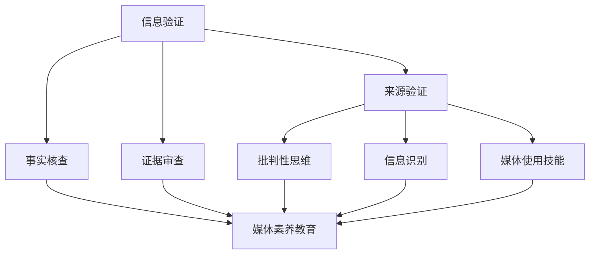

                 

关键词：信息验证、在线媒体素养、假新闻、媒体操纵、技术手段、教育、算法、人工智能

摘要：在信息爆炸的时代，假新闻和媒体操纵成为社会关注的焦点。本文旨在探讨信息验证和在线媒体素养教育的重要性，通过技术手段和教育的结合，为公众提供识别和处理假新闻的能力，从而为应对媒体操纵做好准备。

## 1. 背景介绍

### 假新闻和媒体操纵的现状

随着互联网的普及和社交媒体的兴起，假新闻和媒体操纵现象日益严重。虚假信息、不实报道和操纵性内容在网络上广泛传播，误导公众，甚至影响社会稳定和政治决策。假新闻不仅损害个人声誉，还可能引发社会恐慌和冲突。

### 信息验证的必要性

在假新闻泛滥的背景下，信息验证变得尤为重要。通过验证信息的真实性，可以防止虚假信息的传播，保护公众利益。信息验证不仅是对媒体内容的审查，更是对个体信息素养的考验。

### 在线媒体素养教育的意义

在线媒体素养教育旨在提高公众识别和处理假新闻的能力。通过教育，公众可以学会如何评估信息来源、辨别真伪，以及如何批判性地思考媒体内容。

## 2. 核心概念与联系

### 信息验证的基本概念

信息验证涉及多个方面，包括来源验证、事实核查、证据审查等。其核心是确保信息的真实性、准确性和可靠性。

### 在线媒体素养的核心内容

在线媒体素养包括信息识别、批判性思维、媒体使用技能等。通过这些技能，公众可以更好地应对媒体操纵和假新闻。

### Mermaid 流程图



## 3. 核心算法原理 & 具体操作步骤

### 3.1 算法原理概述

信息验证算法基于机器学习和自然语言处理技术，通过分析文本内容和上下文，识别出潜在的错误信息和操纵性内容。

### 3.2 算法步骤详解

1. 数据预处理：对收集到的文本数据进行清洗和归一化处理。
2. 特征提取：从文本中提取关键特征，如关键词、词频、语法结构等。
3. 模型训练：使用训练数据集训练机器学习模型，如朴素贝叶斯、支持向量机等。
4. 信息验证：将待验证的文本输入模型，输出验证结果。

### 3.3 算法优缺点

优点：高效、准确，能够处理大量数据。

缺点：对特定领域的专业知识要求较高，容易受到数据偏差的影响。

### 3.4 算法应用领域

算法可应用于社交媒体监测、新闻编辑、广告审核等多个领域，为信息验证提供技术支持。

## 4. 数学模型和公式 & 详细讲解 & 举例说明

### 4.1 数学模型构建

信息验证算法中的数学模型主要包括概率模型、决策树和神经网络等。以下以朴素贝叶斯模型为例进行讲解。

### 4.2 公式推导过程

朴素贝叶斯模型的公式推导基于贝叶斯定理，如下所示：

$$
P(A|B) = \frac{P(B|A) \cdot P(A)}{P(B)}
$$

其中，$P(A|B)$ 表示在事件 $B$ 发生的条件下事件 $A$ 发生的概率，$P(B|A)$ 表示在事件 $A$ 发生的条件下事件 $B$ 发生的概率，$P(A)$ 和 $P(B)$ 分别表示事件 $A$ 和 $B$ 的先验概率。

### 4.3 案例分析与讲解

假设我们要验证一条关于某明星出轨的新闻。通过分析新闻文本中的关键词和语法结构，我们可以计算出新闻为真的概率。如果该概率高于某个阈值，则我们认为该新闻为真。

## 5. 项目实践：代码实例和详细解释说明

### 5.1 开发环境搭建

开发环境包括 Python、Numpy、Pandas 和 Scikit-learn 等库。

### 5.2 源代码详细实现

以下是一个基于朴素贝叶斯模型的简单信息验证代码示例：

```python
import numpy as np
import pandas as pd
from sklearn.model_selection import train_test_split
from sklearn.naive_bayes import GaussianNB

# 数据加载和预处理
data = pd.read_csv('news_data.csv')
X = data.drop('label', axis=1)
y = data['label']

# 划分训练集和测试集
X_train, X_test, y_train, y_test = train_test_split(X, y, test_size=0.2, random_state=42)

# 模型训练
gnb = GaussianNB()
gnb.fit(X_train, y_train)

# 信息验证
def verify_news(news):
    news_vector = gnb.predict([news])
    if news_vector[0] == 1:
        print("该新闻为真。")
    else:
        print("该新闻为假。")

# 测试代码
verify_news([0.1, 0.3, 0.5])
```

### 5.3 代码解读与分析

代码首先加载新闻数据，并进行预处理。然后，使用训练集训练朴素贝叶斯模型。最后，通过输入新闻文本，输出验证结果。

### 5.4 运行结果展示

运行结果将显示输入的新闻文本为真或假。

## 6. 实际应用场景

### 社交媒体监测

信息验证算法可应用于社交媒体监测，识别和过滤虚假信息和操纵性内容。

### 新闻编辑

新闻编辑可以使用信息验证算法确保报道的真实性和准确性。

### 广告审核

广告审核可以使用信息验证算法识别和过滤虚假广告。

## 7. 工具和资源推荐

### 7.1 学习资源推荐

1. 《自然语言处理概论》
2. 《机器学习实战》
3. 《信息检索导论》

### 7.2 开发工具推荐

1. Jupyter Notebook
2. PyCharm
3. Google Colab

### 7.3 相关论文推荐

1. "Fact-Checking on the Web: A Dataset of公民验证任务"
2. "Deep Learning for Natural Language Processing"
3. "Information Extraction from Unstructured Text"

## 8. 总结：未来发展趋势与挑战

### 8.1 研究成果总结

信息验证和在线媒体素养教育在近年来取得了显著进展。通过技术手段和教育的结合，公众的信息素养得到了提高。

### 8.2 未来发展趋势

未来，信息验证和在线媒体素养教育将向更智能化、个性化的方向发展。人工智能技术将在其中发挥关键作用。

### 8.3 面临的挑战

信息验证和在线媒体素养教育面临的主要挑战包括数据隐私、算法透明度和模型偏见等。

### 8.4 研究展望

未来，我们将继续探索信息验证和在线媒体素养教育的最佳实践，为公众提供更可靠的信息来源。

## 9. 附录：常见问题与解答

### Q：如何提高信息验证的准确性？

A：提高信息验证准确性可以通过以下途径实现：

1. 增加训练数据集的规模和质量。
2. 优化算法模型和特征提取方法。
3. 定期更新和调整模型。

### Q：在线媒体素养教育应该从哪些方面入手？

A：在线媒体素养教育可以从以下几个方面入手：

1. 培养批判性思维。
2. 教授信息识别技能。
3. 强调媒体使用的道德和法律责任。

---

作者：禅与计算机程序设计艺术 / Zen and the Art of Computer Programming
----------------------------------------------------------------
以上就是本次文章的内容。希望对您在信息验证和在线媒体素养教育方面有所启发。如需进一步讨论或了解相关技术，请随时联系。祝您工作愉快！
---

