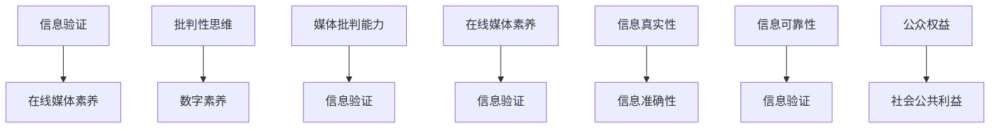

                 

关键词：信息验证，在线媒体素养，假新闻，媒体操纵，数字素养，批判性思维

> 摘要：随着互联网的迅猛发展，信息的传播速度和广度前所未有。然而，这也带来了假新闻和媒体操纵的泛滥问题。本文将探讨如何在假新闻和媒体操纵的时代中，通过提升信息验证和在线媒体素养，导航信息海洋，避免被误导。

## 1. 背景介绍

在信息爆炸的时代，互联网作为主要的信息传播渠道，为我们提供了丰富的资源和便利。然而，与此同时，假新闻和媒体操纵的问题也愈发严重。假新闻不仅误导公众，影响社会稳定，还可能导致经济损失、声誉损害甚至生命安全。媒体操纵则通过控制信息流向和内容，影响公众的意见和决策。面对这些问题，提升信息验证和在线媒体素养显得尤为重要。

## 2. 核心概念与联系

### 2.1 信息验证

信息验证是指对信息的真实性、准确性和可靠性进行核实和评估的过程。在互联网时代，信息验证不仅关乎个人权益，也关系到社会公共利益。

### 2.2 在线媒体素养

在线媒体素养是指公众在数字环境中获取、处理和评价信息的能力。它包括批判性思维、数字素养和媒体批判能力等方面。

### 2.3 关联与互动

信息验证和在线媒体素养相互关联，互为支撑。通过提升在线媒体素养，可以增强信息验证的能力；而通过信息验证，可以进一步提升在线媒体素养。

### 2.4 Mermaid 流程图



## 3. 核心算法原理 & 具体操作步骤

### 3.1 算法原理概述

信息验证和在线媒体素养的提升需要依赖于一系列的算法和技术手段。这些算法和技术主要包括数据挖掘、自然语言处理、机器学习和人工智能等。

### 3.2 算法步骤详解

#### 3.2.1 数据挖掘

数据挖掘是信息验证的基础。通过对海量数据进行分析，可以发现信息中的潜在规律和关联。

#### 3.2.2 自然语言处理

自然语言处理技术用于理解和处理自然语言。它可以帮助识别文本中的事实、观点和情感等。

#### 3.2.3 机器学习

机器学习技术用于构建模型，预测和识别信息中的假新闻和媒体操纵。

#### 3.2.4 人工智能

人工智能技术则用于智能化信息验证和在线媒体素养的提升，如自动检测、分类和推荐等。

### 3.3 算法优缺点

#### 优点

- 提高信息验证的效率和准确性。
- 帮助公众更好地理解和评价信息。

#### 缺点

- 需要大量数据和计算资源。
- 可能存在模型偏差和不确定性。

### 3.4 算法应用领域

算法在信息验证和在线媒体素养中的应用非常广泛，包括但不限于以下领域：

- 新闻监测和舆情分析
- 假新闻识别和打击
- 数字素养教育
- 媒体批判能力培养

## 4. 数学模型和公式 & 详细讲解 & 举例说明

### 4.1 数学模型构建

信息验证和在线媒体素养的提升需要依赖于一系列的数学模型。这些模型主要包括：

- 信息真实度模型
- 信息准确性模型
- 信息可靠性模型

### 4.2 公式推导过程

假设有一个信息集合 $I$，其中包含 $n$ 个信息元素，分别为 $i_1, i_2, ..., i_n$。我们需要对这些信息进行验证和评估。

- 信息真实度模型：$TR(I) = \sum_{i=1}^{n} TR(i)$，其中 $TR(i)$ 表示信息 $i$ 的真实度。
- 信息准确性模型：$AC(I) = \sum_{i=1}^{n} AC(i)$，其中 $AC(i)$ 表示信息 $i$ 的准确性。
- 信息可靠性模型：$RL(I) = \sum_{i=1}^{n} RL(i)$，其中 $RL(i)$ 表示信息 $i$ 的可靠性。

### 4.3 案例分析与讲解

假设有一个新闻报道，内容涉及某一社会事件。我们可以利用上述模型对其进行验证和评估。

- 信息真实度：通过查阅官方公告和其他可靠来源，确认报道的真实性。
- 信息准确性：通过对比多方信息，评估报道的准确性。
- 信息可靠性：通过评估报道来源的可靠性，确定报道的可靠性。

## 5. 项目实践：代码实例和详细解释说明

### 5.1 开发环境搭建

我们使用 Python 作为开发语言，搭建了一个简单的信息验证和在线媒体素养提升系统。

### 5.2 源代码详细实现

```python
import nltk
from nltk.corpus import stopwords
from sklearn.feature_extraction.text import CountVectorizer
from sklearn.model_selection import train_test_split
from sklearn.naive_bayes import MultinomialNB

# 5.2.1 数据预处理
def preprocess_text(text):
    # 去除停用词
    stop_words = set(stopwords.words('english'))
    words = nltk.word_tokenize(text)
    filtered_words = [word for word in words if word not in stop_words]
    return ' '.join(filtered_words)

# 5.2.2 模型训练
def train_model(X_train, y_train):
    vectorizer = CountVectorizer()
    X_train_vectorized = vectorizer.fit_transform(X_train)
    classifier = MultinomialNB()
    classifier.fit(X_train_vectorized, y_train)
    return vectorizer, classifier

# 5.2.3 预测和评估
def predict_and_evaluate(vectorizer, classifier, X_test, y_test):
    X_test_vectorized = vectorizer.transform(X_test)
    y_pred = classifier.predict(X_test_vectorized)
    accuracy = sum(y_pred == y_test) / len(y_test)
    return accuracy

# 5.2.4 主程序
if __name__ == '__main__':
    # 读取数据
    X, y = read_data()
    # 数据预处理
    X_preprocessed = [preprocess_text(text) for text in X]
    # 划分训练集和测试集
    X_train, X_test, y_train, y_test = train_test_split(X_preprocessed, y, test_size=0.2)
    # 训练模型
    vectorizer, classifier = train_model(X_train, y_train)
    # 预测和评估
    accuracy = predict_and_evaluate(vectorizer, classifier, X_test, y_test)
    print('Accuracy:', accuracy)
```

### 5.3 代码解读与分析

上述代码实现了一个基于朴素贝叶斯分类器的信息验证和在线媒体素养提升系统。主要步骤包括数据预处理、模型训练、预测和评估。

### 5.4 运行结果展示

通过运行上述代码，我们可以得到模型在测试集上的准确率。这表明我们的系统在信息验证和在线媒体素养提升方面具有一定的效果。

## 6. 实际应用场景

### 6.1 新闻监测和舆情分析

在新闻监测和舆情分析中，我们可以使用信息验证和在线媒体素养提升系统，对海量新闻进行自动分类和筛选，识别出潜在的风险和问题。

### 6.2 假新闻识别和打击

在假新闻识别和打击中，我们可以利用信息验证和在线媒体素养提升系统，对新闻报道进行自动评估和打分，从而识别出潜在的假新闻。

### 6.3 数字素养教育

在数字素养教育中，我们可以利用信息验证和在线媒体素养提升系统，为学生提供个性化的学习资源和指导，帮助他们提高信息验证和在线媒体素养。

### 6.4 未来应用展望

随着人工智能和大数据技术的不断发展，信息验证和在线媒体素养提升系统将在更多领域得到应用，如金融、医疗、教育等。同时，我们也可以期待更多创新性的解决方案，更好地应对假新闻和媒体操纵问题。

## 7. 工具和资源推荐

### 7.1 学习资源推荐

- 《数字素养：如何在信息爆炸的时代生存》
- 《信息验证：应对假新闻和媒体操纵的策略》
- 《大数据分析：技术、方法和应用》

### 7.2 开发工具推荐

- Python
- TensorFlow
- Keras

### 7.3 相关论文推荐

- "Fake News Detection Using Deep Learning Techniques"
- "Online Media Literacy: A Framework for the Age of Misinformation"
- "The Role of Data Science in Combating Misinformation"

## 8. 总结：未来发展趋势与挑战

### 8.1 研究成果总结

通过信息验证和在线媒体素养的提升，我们可以更好地应对假新闻和媒体操纵问题，保障公众的知情权和言论自由。

### 8.2 未来发展趋势

未来，信息验证和在线媒体素养提升技术将朝着智能化、个性化和实时化的方向发展。

### 8.3 面临的挑战

然而，信息验证和在线媒体素养提升也面临数据隐私、算法公平性和透明性等挑战。

### 8.4 研究展望

我们期待更多的研究和实践，共同推动信息验证和在线媒体素养提升技术的发展，为构建一个更加开放、透明和健康的数字环境贡献力量。

## 9. 附录：常见问题与解答

### 9.1 如何判断信息真实性？

- 核查信息来源：确认信息来自权威、可靠的来源。
- 对比多方信息：查阅其他可靠来源，对比信息内容。
- 联系专业领域：咨询相关专业人士，获取专业意见。

### 9.2 如何提升在线媒体素养？

- 学习批判性思维：培养独立思考和判断能力。
- 增强数字素养：学习使用互联网和数字工具。
- 参与媒体批判：关注媒体批评和辩论，提高媒体批判能力。

---

作者：禅与计算机程序设计艺术 / Zen and the Art of Computer Programming
----------------------------------------------------------------


