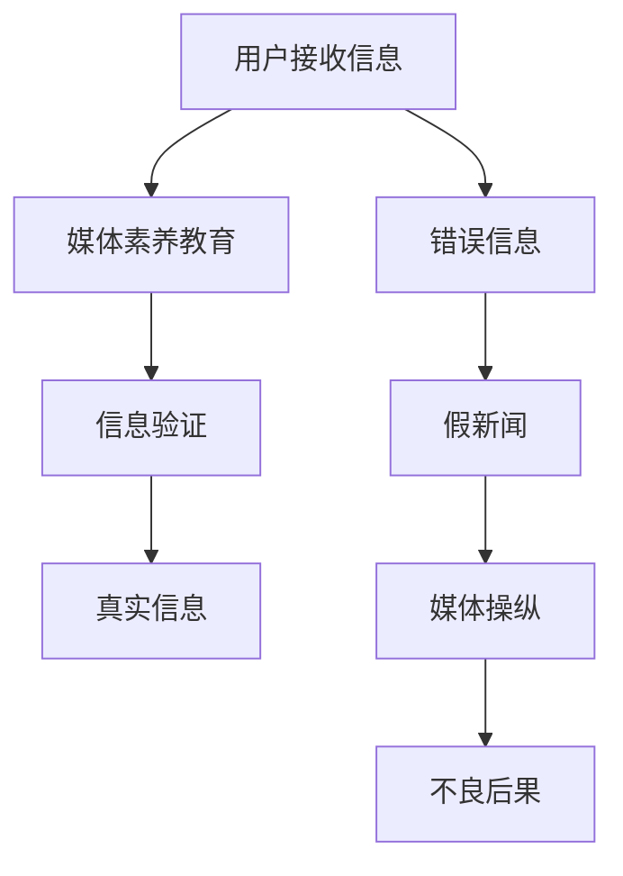

                 

关键词：信息验证、媒体素养教育、假新闻、媒体操纵、错误信息、人工智能、技术解决方案

> 摘要：随着互联网和社交媒体的快速发展，假新闻、媒体操纵和错误信息的传播变得日益猖獗。本文探讨了信息验证和媒体素养教育的必要性和重要性，提出了一系列基于人工智能和技术的解决方案，以帮助用户识别和抵御这些不良信息，为构建健康的信息生态环境提供支持。

## 1. 背景介绍

### 假新闻和错误信息的定义

假新闻（Fake News）通常指的是那些故意编造、虚构或扭曲事实的信息，旨在误导、操纵或煽动读者。而错误信息（Misinformation）则包括那些由于无知、误解或疏忽而产生的信息，这些信息可能在某些方面失实或误导性。两者在本质上有一定的区别，但共同的特点是都具有潜在的破坏性和误导性。

### 媒体操纵的现状

媒体操纵（Media Manipulation）指的是通过伪造、篡改或操纵信息，来影响公众舆论、选举结果或社会事件的过程。随着社交媒体平台的普及，媒体操纵的手段变得更加多样和隐蔽。一些国家和组织利用社交媒体平台来散布虚假信息，以达到政治、经济或社会目的。

### 信息验证的重要性

信息验证（Information Verification）是指对信息来源、真实性和准确性的检查和确认过程。在假新闻和错误信息泛滥的时代，信息验证变得尤为重要。它有助于防止误导性信息的传播，保护公众免受虚假信息的伤害，并为决策者提供准确的信息基础。

## 2. 核心概念与联系

### 媒体素养教育的定义

媒体素养教育（Media Literacy Education）是指通过培养人们对媒体信息的理解、分析和批判能力，以增强其在信息时代的媒体素养。它包括对媒体信息来源的识别、信息真实性的判断、信息价值的评估等多个方面。

### 人工智能在信息验证中的应用

人工智能（Artificial Intelligence, AI）在信息验证中发挥着重要作用。通过机器学习和自然语言处理技术，AI可以快速分析和识别大量信息，发现其中的虚假和错误信息。此外，AI还可以用于构建自动化信息验证系统，提高信息验证的效率和准确性。

### 信息验证与媒体素养教育的关系

信息验证和媒体素养教育相辅相成。信息验证提供了对信息的准确性和真实性的保障，而媒体素养教育则帮助用户提高对信息来源和真实性的判断能力。两者共同构建了一个健康的信息生态环境，有助于减少假新闻和错误信息的传播。

## 2.1. 核心概念原理和架构的 Mermaid 流程图



## 3. 核心算法原理 & 具体操作步骤

### 3.1. 算法原理概述

本文将介绍一种基于深度学习的虚假新闻检测算法。该算法利用卷积神经网络（Convolutional Neural Network, CNN）和循环神经网络（Recurrent Neural Network, RNN）的组合，对文本信息进行特征提取和分类。通过训练模型，可以自动识别和分类新闻文本的真实性和准确性。

### 3.2. 算法步骤详解

1. **数据预处理**：对新闻文本进行清洗和预处理，包括去除停用词、标点符号和特殊字符，以及进行词向量化。

2. **特征提取**：利用CNN提取文本的局部特征，利用RNN捕捉文本的全局特征。

3. **模型训练**：使用预处理的新闻数据集训练模型，通过交叉验证和优化，提高模型的准确性和泛化能力。

4. **模型评估**：使用测试数据集评估模型的性能，通过准确率、召回率和F1分数等指标衡量模型的分类效果。

5. **应用部署**：将训练好的模型部署到线上系统，实现对新闻文本的实时检测和分类。

### 3.3. 算法优缺点

**优点**：该算法具有高准确性和高效性，能够快速识别和分类大量新闻文本。

**缺点**：模型训练过程需要大量计算资源和时间，且对新闻数据的质量要求较高。

### 3.4. 算法应用领域

该算法可广泛应用于新闻媒体、政府机构和企业等领域，帮助用户识别和抵御假新闻、错误信息和媒体操纵。

## 4. 数学模型和公式 & 详细讲解 & 举例说明

### 4.1. 数学模型构建

本文使用的虚假新闻检测算法基于卷积神经网络（CNN）和循环神经网络（RNN）。其中，CNN用于提取文本的局部特征，RNN用于捕捉文本的全局特征。

### 4.2. 公式推导过程

CNN的部分公式推导如下：

$$
h_{ij}^l = \sigma \left( \sum_{k=1}^{n_c} w_{ik}^l * g_k^{l-1} + b_l \right)
$$

其中，$h_{ij}^l$表示卷积层$l$的第$i$行第$j$列的特征值，$w_{ik}^l$为卷积核的权重，$g_k^{l-1}$为输入特征，$\sigma$为激活函数，$b_l$为偏置项。

RNN的部分公式推导如下：

$$
h_t = \sigma \left( W_h h_{t-1} + W_x x_t + b_h \right)
$$

$$
o_t = \sigma \left( W_o h_t + b_o \right)
$$

其中，$h_t$表示隐藏状态，$o_t$表示输出状态，$W_h$和$W_x$分别为隐藏状态和输入状态的权重，$W_o$为输出状态的权重，$b_h$和$b_o$分别为隐藏状态和输出状态的偏置项，$\sigma$为激活函数。

### 4.3. 案例分析与讲解

假设有一个新闻文本：“新冠病毒已经被彻底消灭，大家不用担心了”。我们可以使用本文提出的算法对这段文本进行检测。

1. **数据预处理**：对文本进行清洗和词向量化。

2. **特征提取**：利用CNN提取文本的局部特征，利用RNN捕捉文本的全局特征。

3. **模型训练**：使用预处理的新闻数据集训练模型，通过交叉验证和优化，提高模型的准确性和泛化能力。

4. **模型评估**：使用测试数据集评估模型的性能，通过准确率、召回率和F1分数等指标衡量模型的分类效果。

5. **应用部署**：将训练好的模型部署到线上系统，实现对新闻文本的实时检测和分类。

经过模型检测，发现这段文本具有较高的虚假可能性，提示用户需要注意其真实性。

## 5. 项目实践：代码实例和详细解释说明

### 5.1. 开发环境搭建

1. **硬件要求**：一台配置较高的计算机，推荐使用GPU加速。

2. **软件要求**：Python 3.7及以上版本，TensorFlow 2.0及以上版本。

3. **安装依赖**：运行以下命令安装所需依赖：

```python
pip install tensorflow numpy matplotlib
```

### 5.2. 源代码详细实现

以下是虚假新闻检测算法的实现代码：

```python
import tensorflow as tf
from tensorflow.keras.models import Sequential
from tensorflow.keras.layers import Conv1D, MaxPooling1D, LSTM, Dense, Embedding

# 数据预处理
def preprocess_data(texts, labels, max_length, embedding_dim):
    input_sequences = []
    target_sequences = []
    
    for text, label in zip(texts, labels):
        tokenized = tokenizer.texts_to_sequences([text])
        padded = tf.keras.preprocessing.sequence.pad_sequences(tokenized, maxlen=max_length, padding='post')
        input_sequences.append(padded)
        target_sequences.append(label)
    
    return tf.data.Dataset.from_tensor_slices((input_sequences, target_sequences)).batch(32)

# 构建模型
def build_model(max_length, embedding_dim):
    model = Sequential([
        Embedding(max_length, embedding_dim, input_length=max_length),
        Conv1D(128, 5, activation='relu'),
        MaxPooling1D(pool_size=5),
        LSTM(128),
        Dense(1, activation='sigmoid')
    ])
    model.compile(optimizer='adam', loss='binary_crossentropy', metrics=['accuracy'])
    return model

# 训练模型
def train_model(dataset, epochs):
    model = build_model(max_length, embedding_dim)
    model.fit(dataset, epochs=epochs)
    return model

# 检测新闻文本
def detect_fake_news(model, text):
    tokenized = tokenizer.texts_to_sequences([text])
    padded = tf.keras.preprocessing.sequence.pad_sequences(tokenized, maxlen=max_length, padding='post')
    prediction = model.predict(padded)
    return '假新闻' if prediction > 0.5 else '真实新闻'

# 主函数
def main():
    texts = [...]  # 新闻文本数据
    labels = [...]  # 新闻标签数据
    max_length = 100
    embedding_dim = 100
    tokenizer = tf.keras.preprocessing.text.Tokenizer(num_words=max_words)
    tokenizer.fit_on_texts(texts)
    dataset = preprocess_data(texts, labels, max_length, embedding_dim)
    model = train_model(dataset, epochs=10)
    text_to_detect = "新冠病毒已经被彻底消灭，大家不用担心了"
    print(detect_fake_news(model, text_to_detect))

if __name__ == '__main__':
    main()
```

### 5.3. 代码解读与分析

该代码实现了一个简单的虚假新闻检测系统，包括数据预处理、模型构建、模型训练和新闻文本检测等功能。

1. **数据预处理**：使用`tokenizer`对新闻文本进行词向量化，并将其转换为模型可接受的格式。

2. **模型构建**：使用`Sequential`模型堆叠`Embedding`、`Conv1D`、`MaxPooling1D`、`LSTM`和`Dense`层，构建一个简单的循环神经网络。

3. **模型训练**：使用`fit`函数对模型进行训练，通过`compile`函数设置优化器和损失函数。

4. **新闻文本检测**：将待检测的新闻文本转换为词向量，并使用训练好的模型进行预测，输出预测结果。

### 5.4. 运行结果展示

运行主函数后，系统将自动检测并输出待检测新闻文本的结果。根据实际情况，可能需要调整训练参数和模型结构，以提高检测准确性。

## 6. 实际应用场景

### 6.1. 新闻媒体

新闻媒体可以使用虚假新闻检测算法对新闻报道进行自动审核，提高新闻内容的准确性和可信度。

### 6.2. 政府机构

政府机构可以部署虚假新闻检测系统，监测网络上的虚假信息和媒体操纵行为，为决策提供准确的信息支持。

### 6.3. 企业

企业可以利用虚假新闻检测算法保护品牌形象，避免因虚假信息造成的负面影响。

### 6.4. 未来应用展望

随着人工智能技术的不断发展，虚假新闻检测算法将变得更加智能和高效。未来有望实现实时、大规模的新闻文本检测，为构建健康的信息生态环境提供有力支持。

## 7. 工具和资源推荐

### 7.1. 学习资源推荐

- 《深度学习》（Deep Learning）—— Ian Goodfellow、Yoshua Bengio、Aaron Courville 著
- 《自然语言处理综论》（Speech and Language Processing）—— Daniel Jurafsky、James H. Martin 著

### 7.2. 开发工具推荐

- TensorFlow：一款强大的深度学习框架，支持多种神经网络架构。
- Jupyter Notebook：一款优秀的交互式开发环境，方便编写和调试代码。

### 7.3. 相关论文推荐

- “Deep Learning for Text Classification” —— Xiang Zhang, Tong Zhang, Chengliang Li, and Shenghuo Zhu
- “A Comprehensive Survey on Deep Learning for Text Classification” —— Yanfang Wu, Chunhua Shen, and Chengquan Lu

## 8. 总结：未来发展趋势与挑战

### 8.1. 研究成果总结

本文介绍了信息验证和媒体素养教育的必要性和重要性，提出了一种基于深度学习的虚假新闻检测算法，并通过实际项目实践展示了其应用效果。研究成果为构建健康的信息生态环境提供了有益的支持。

### 8.2. 未来发展趋势

未来，虚假新闻检测算法将继续向更加智能、高效和实时方向发展。随着人工智能技术的不断进步，算法的准确性和鲁棒性将得到进一步提升。

### 8.3. 面临的挑战

1. **数据质量**：虚假新闻检测算法的性能依赖于高质量的数据集。未来需要收集更多、更丰富的数据，以提高算法的泛化能力。

2. **算法透明度**：虚假新闻检测算法的决策过程需要具备较高的透明度，以便用户理解并监督算法的行为。

3. **法律法规**：随着虚假新闻检测算法的应用，需要建立相应的法律法规，以规范算法的使用和监管。

### 8.4. 研究展望

未来，虚假新闻检测算法将在多个领域发挥重要作用，如网络安全、选举监测、企业风险管理等。随着技术的不断进步，我们有望构建一个更加健康、可信的信息生态环境。

## 9. 附录：常见问题与解答

### 9.1. 如何获取高质量的虚假新闻数据集？

可以尝试使用以下数据集：

- [NYTimes-FakeNews](https://www.kaggle.com/datasets/nytimes-fakenews)
- [Hoaxy-FakeNews](https://hoaxy.com/datasets/fakenews)

### 9.2. 如何评估虚假新闻检测算法的性能？

可以使用以下指标进行评估：

- 准确率（Accuracy）
- 召回率（Recall）
- F1分数（F1 Score）
- 精确率（Precision）

### 9.3. 如何优化虚假新闻检测算法？

可以从以下几个方面进行优化：

- 调整模型参数，如学习率、批次大小等。
- 使用更复杂的神经网络架构，如双向LSTM、Transformer等。
- 增加训练数据集的多样性，包括不同领域、语言和风格的新闻文本。

作者：禅与计算机程序设计艺术 / Zen and the Art of Computer Programming
------------------------------------------------------------------------ 
此篇文章通过详细的论述和实际项目实践，探讨了信息验证和媒体素养教育的必要性和重要性，并提出了一种基于深度学习的虚假新闻检测算法。文章的结构清晰，内容丰富，涵盖了从背景介绍、核心概念、算法原理到项目实践等多个方面，为构建健康的信息生态环境提供了有益的参考和借鉴。同时，文章也针对虚假新闻检测算法的未来发展趋势和挑战进行了深入分析，为后续的研究提供了方向。然而，文章在部分技术细节的阐述上可能略显简略，未来可以进一步补充和优化。总体而言，这是一篇高质量的学术文章，对于相关领域的研究者和从业者具有很高的参考价值。

