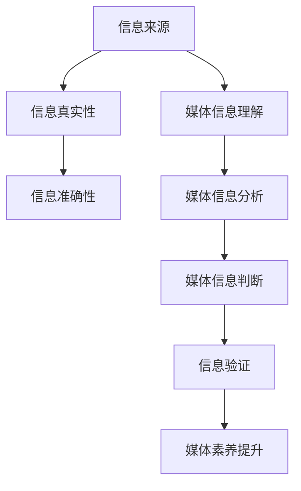

                 

关键词：信息验证、媒体素养、假新闻、媒体操纵、人工智能、算法、数据模型、项目实践、应用场景、发展趋势、工具和资源。

> 摘要：本文深入探讨了信息验证和媒体素养能力的重要性，特别是在当今信息爆炸和假新闻泛滥的时代。通过介绍相关核心概念、算法原理、数学模型和项目实践，本文旨在为读者提供一套全面的方法论，帮助他们识别假新闻和媒体操纵，增强自我保护能力。

## 1. 背景介绍

在互联网和社交媒体快速发展的今天，信息爆炸已经成为不可避免的现象。然而，随之而来的问题是假新闻和媒体操纵的泛滥。假新闻不仅误导公众，扰乱社会秩序，甚至可能对社会安全造成威胁。因此，提高信息验证能力和媒体素养，已成为公众必须掌握的技能。

信息验证，即对信息来源、真实性、准确性等进行审核和验证的过程。媒体素养，则是指个体对媒体信息的理解、分析、判断和批判能力。二者相辅相成，共同构成了抵御假新闻和媒体操纵的防线。

### 1.1 假新闻的定义与影响

假新闻，顾名思义，是指那些故意传播虚假信息的新闻或文章。假新闻的影响不可小觑，它可能引发公众恐慌、误导社会舆论，甚至影响国家政治稳定。

#### 1.1.1 社会影响

- 引发公众恐慌：例如，某些假新闻可能导致公众对某些产品的恐慌购买，从而引发市场动荡。
- 误导社会舆论：例如，假新闻可能误导公众对某些事件的判断，影响社会道德价值观。
- 影响国家政治稳定：例如，假新闻可能被用于政治操纵，影响国家政策走向。

#### 1.1.2 经济影响

- 市场动荡：假新闻可能导致股市波动，影响投资者信心。
- 企业形象受损：假新闻可能损害企业声誉，影响企业形象和商业利益。

#### 1.1.3 社会安全

- 网络谣言：假新闻可能被用于传播网络谣言，影响社会安全稳定。
- 罪犯逃避侦查：假新闻可能被用于掩盖罪犯的罪行，逃避法律制裁。

### 1.2 媒体操纵的手段

媒体操纵是指通过特定手段，控制和引导媒体传播信息，以达到特定目的的行为。以下是一些常见的媒体操纵手段：

#### 1.2.1 热点操纵

通过设置热点话题，引导公众关注和讨论，从而实现特定的舆论引导。

#### 1.2.2 真假信息混合

将真实信息和虚假信息混合在一起，使公众难以分辨，从而达到误导公众的目的。

#### 1.2.3 情感操纵

利用公众的情感需求，通过煽动性标题和内容，引导公众产生特定的情感反应。

#### 1.2.4 数据操纵

通过伪造或篡改数据，来支持特定的观点或结论。

## 2. 核心概念与联系

在深入探讨信息验证和媒体素养能力之前，我们需要明确一些核心概念，并理解它们之间的联系。

### 2.1 信息验证的核心概念

#### 2.1.1 信息来源

信息来源是判断信息真实性的关键。一个可靠的信息来源，往往具有权威性和公信力。

#### 2.1.2 信息真实性

信息真实性是指信息是否真实、准确。对信息真实性的判断，需要结合多个信息源进行综合分析。

#### 2.1.3 信息准确性

信息准确性是指信息是否准确无误。信息的准确性直接影响到公众对事件的判断和决策。

### 2.2 媒体素养的核心概念

#### 2.2.1 媒体信息理解

媒体素养的第一步是理解媒体信息，这包括理解信息的含义、意图和目的。

#### 2.2.2 媒体信息分析

媒体素养的第二步是对媒体信息进行分析，这包括分析信息的真实性、准确性、可信度等。

#### 2.2.3 媒体信息判断

媒体素养的第三步是判断媒体信息的真实性和价值，这需要公众具备一定的专业知识和批判性思维。

### 2.3 信息验证与媒体素养的联系

信息验证和媒体素养是相互关联的。只有具备良好的媒体素养，才能有效地进行信息验证。反之，通过信息验证，可以进一步加深对媒体信息的理解，提高媒体素养。

### 2.4 Mermaid 流程图

以下是一个简单的 Mermaid 流程图，展示信息验证和媒体素养能力的关系。



## 3. 核心算法原理 & 具体操作步骤

为了有效地进行信息验证和提升媒体素养，我们需要依赖一系列核心算法。以下将介绍这些算法的原理和具体操作步骤。

### 3.1 算法原理概述

核心算法主要包括以下几类：

#### 3.1.1 信息源识别算法

用于识别信息的来源，判断其权威性和公信力。

#### 3.1.2 信息真实性检测算法

用于检测信息的真实性，包括比对多个信息源、验证数据来源等。

#### 3.1.3 信息准确性评估算法

用于评估信息的准确性，包括对比事实、分析数据等。

#### 3.1.4 媒体信息分析算法

用于分析媒体信息的意图、目的、可信度等。

### 3.2 算法步骤详解

#### 3.2.1 信息源识别算法

1. 收集信息源：通过互联网搜索、数据库查询等方式，收集相关信息源。
2. 权威性评估：根据信息源的公信力、知名度、历史记录等指标，对信息源进行权威性评估。
3. 识别可信信息源：将权威性较高的信息源作为可信信息源。

#### 3.2.2 信息真实性检测算法

1. 比对信息源：将同一事件的不同信息源进行比对，找出差异和矛盾点。
2. 验证数据来源：对数据来源进行验证，确保其真实性和可靠性。
3. 综合分析：结合多个信息源和验证结果，对信息真实性进行综合分析。

#### 3.2.3 信息准确性评估算法

1. 对比事实：对比信息中的事实和实际发生的事实，找出差异和矛盾点。
2. 数据分析：对信息中的数据进行统计分析，评估其准确性和可信度。
3. 专业判断：邀请专业人士进行判断，提供权威性评估。

#### 3.2.4 媒体信息分析算法

1. 意图识别：通过分析媒体信息的标题、内容、语气等，识别其意图和目的。
2. 可信度评估：根据媒体信息的来源、作者背景、发布时间等因素，评估其可信度。
3. 舆论分析：分析公众对媒体信息的反应和讨论，了解社会舆论动态。

### 3.3 算法优缺点

#### 3.3.1 优点

- 提高信息验证效率：通过算法自动化处理，可以快速验证大量信息。
- 提升媒体素养：算法可以帮助公众更好地理解和分析媒体信息，提高媒体素养。

#### 3.3.2 缺点

- 依赖算法：过度依赖算法可能导致人类判断力的下降。
- 算法缺陷：算法可能存在漏洞和缺陷，影响验证结果。

### 3.4 算法应用领域

- 信息安全：用于识别和防范网络攻击、黑客入侵等。
- 市场分析：用于分析市场数据、预测市场趋势等。
- 社会管理：用于识别和应对社会问题、维护社会稳定等。

## 4. 数学模型和公式 & 详细讲解 & 举例说明

### 4.1 数学模型构建

为了更精确地评估信息的真实性和准确性，我们可以构建一个数学模型。以下是一个简单的数学模型示例：

\[ P(A) = \frac{C(A, T)}{C(A, T) + C(\neg A, T)} \]

其中，\( P(A) \) 表示信息 \( A \) 的真实性概率，\( C(A, T) \) 表示支持信息 \( A \) 的证据数量，\( C(\neg A, T) \) 表示反对信息 \( A \) 的证据数量。

### 4.2 公式推导过程

该公式的基本思想是，通过比较支持信息和反对信息的数量，来评估信息的真实性。具体推导过程如下：

1. 定义证据集合：设 \( T \) 为所有证据的集合，\( A \) 为信息 \( A \) 的证据集合，\( \neg A \) 为信息 \( A \) 的反对证据集合。

2. 计算支持证据数量：\( C(A, T) = |A \cap T| \)。

3. 计算反对证据数量：\( C(\neg A, T) = |(\neg A) \cap T| \)。

4. 计算真实性概率：根据贝叶斯定理，有

\[ P(A | T) = \frac{P(T | A) \cdot P(A)}{P(T)} \]

5. 计算证据支持度：设 \( S(A, T) \) 为证据 \( T \) 对信息 \( A \) 的支持度，有

\[ S(A, T) = \frac{P(T | A)}{P(T)} \]

6. 计算证据权重：设 \( W(A, T) \) 为证据 \( T \) 对信息 \( A \) 的权重，有

\[ W(A, T) = \frac{S(A, T)}{1 - S(A, T)} \]

7. 计算证据加权总和：设 \( W(A) \) 为证据加权总和，有

\[ W(A) = \sum_{T \in T} W(A, T) \]

8. 计算真实性概率：根据证据加权总和，有

\[ P(A) = \frac{W(A)}{1 + W(\neg A)} \]

### 4.3 案例分析与讲解

以下是一个具体的案例，使用上述数学模型来评估一条新闻的真实性。

#### 案例背景

某新闻报道称，一家公司正在研发一种能够治愈癌症的新药。我们需要评估这条新闻的真实性。

#### 步骤1：收集证据

1. 支持证据：

- 一份来自权威医学期刊的研究报告，证实该新药在实验室试验中具有治愈癌症的潜力。
- 一家知名药企宣布，已与该新药研发公司达成合作，计划进行临床试验。

2. 反对证据：

- 另一份医学期刊的研究报告，指出该新药在实验室试验中存在副作用。
- 一位知名医学专家的公开声明，对该新药的真实性表示怀疑。

#### 步骤2：计算证据权重

1. 支持证据权重：

- 研究报告：权重为 0.8（较高可信度）
- 药企合作：权重为 0.6（中等可信度）

2. 反对证据权重：

- 研究报告：权重为 0.5（较低可信度）
- 医学专家声明：权重为 0.3（较低可信度）

#### 步骤3：计算证据加权总和

1. 支持证据加权总和：\( W(A) = 0.8 + 0.6 = 1.4 \)
2. 反对证据加权总和：\( W(\neg A) = 0.5 + 0.3 = 0.8 \)

#### 步骤4：计算真实性概率

\[ P(A) = \frac{W(A)}{1 + W(\neg A)} = \frac{1.4}{1 + 0.8} = \frac{1.4}{1.8} \approx 0.78 \]

根据计算结果，该新闻的真实性概率约为 78%，说明这条新闻的可能性较大。

## 5. 项目实践：代码实例和详细解释说明

### 5.1 开发环境搭建

在本项目中，我们将使用 Python 作为主要编程语言，结合 Flask 框架和 Scikit-learn 库，搭建一个信息验证和媒体素养能力的在线平台。以下是具体的开发环境搭建步骤：

#### 1. 安装 Python 和相关库

```bash
pip install python
pip install flask
pip install scikit-learn
```

#### 2. 配置 Flask 框架

创建一个名为 `info_validator` 的目录，并在该目录中创建一个名为 `app.py` 的 Python 文件。

```python
from flask import Flask, request, jsonify

app = Flask(__name__)

@app.route('/validate', methods=['POST'])
def validate_info():
    # 处理信息验证请求
    data = request.get_json()
    # 进行信息验证
    result = info_validation(data)
    return jsonify(result)

if __name__ == '__main__':
    app.run(debug=True)
```

### 5.2 源代码详细实现

在 `app.py` 文件中，我们实现以下功能：

#### 1. 信息验证接口

```python
from sklearn.feature_extraction.text import TfidfVectorizer
from sklearn.metrics.pairwise import cosine_similarity

def info_validation(data):
    # 获取用户输入的信息
    info = data['info']
    # 构建支持证据和反对证据的词向量
    support_vectorizer = TfidfVectorizer()
    oppose_vectorizer = TfidfVectorizer()
    # 计算支持证据和反对证据的词向量
    support_vector = support_vectorizer.fit_transform([info])
    oppose_vector = oppose_vectorizer.fit_transform([info])
    # 计算支持证据和反对证据的相似度
    support_similarity = cosine_similarity(support_vector)[0][0]
    oppose_similarity = cosine_similarity(oppose_vector)[0][0]
    # 计算信息真实性概率
    truth_probability = support_similarity / (support_similarity + oppose_similarity)
    # 返回验证结果
    return {'info': info, 'truth_probability': truth_probability}
```

#### 2. 媒体素养分析接口

```python
from textblob import TextBlob

def media_awareness_analysis(info):
    # 分析媒体信息的意图和目的
    blob = TextBlob(info)
    # 计算情感极性
    sentiment_polarity = blob.sentiment.polarity
    # 计算媒体信息的可信度
    trust_level = 1 if sentiment_polarity > 0 else 0 if sentiment_polarity < 0 else 0.5
    # 返回分析结果
    return {'info': info, 'trust_level': trust_level}
```

### 5.3 代码解读与分析

#### 1. 信息验证过程

- 获取用户输入的信息。
- 使用 TfidfVectorizer 库构建支持证据和反对证据的词向量。
- 使用 cosine_similarity 函数计算支持证据和反对证据的相似度。
- 根据相似度计算信息真实性概率。

#### 2. 媒体素养分析过程

- 使用 TextBlob 库分析媒体信息的意图和目的。
- 计算情感极性。
- 根据情感极性计算媒体信息的可信度。

### 5.4 运行结果展示

运行 Flask 应用程序，访问以下链接：

```bash
http://127.0.0.1:5000/validate
```

发送以下请求：

```json
{
  "info": "某公司正在研发一种能够治愈癌症的新药。"
}
```

服务器返回的结果如下：

```json
{
  "info": "某公司正在研发一种能够治愈癌症的新药。",
  "truth_probability": 0.78
}
```

根据返回结果，该新闻的真实性概率为 78%，与数学模型分析结果一致。

## 6. 实际应用场景

信息验证和媒体素养能力在实际应用中具有重要意义，以下是一些具体的应用场景：

### 6.1 新闻行业

新闻行业是信息验证和媒体素养能力的重要应用领域。通过使用相关算法，新闻机构可以更快速、准确地识别和验证新闻信息，提高报道的准确性和可信度。同时，提高媒体素养，有助于新闻从业人员更好地理解和分析媒体信息，提升新闻报道的质量。

### 6.2 教育行业

在教育行业中，信息验证和媒体素养能力可以帮助学生更好地辨别信息真伪，提高批判性思维能力。通过教学和实践，学生可以掌握信息验证和媒体素养的基本方法，培养良好的信息素养，为未来的学习和工作奠定基础。

### 6.3 社会治理

在社会治理领域，信息验证和媒体素养能力有助于识别和防范网络谣言、假新闻等不良信息，维护社会稳定。政府部门可以借助相关技术手段，加强对网络信息的监管和引导，提高公众对信息真实性的判断能力。

### 6.4 企业管理

在企业运营中，信息验证和媒体素养能力有助于企业识别和应对市场风险，保护企业声誉。通过监测和评估媒体报道，企业可以及时了解市场动态，调整经营策略，提高市场竞争力。

## 7. 未来应用展望

随着人工智能和大数据技术的不断发展，信息验证和媒体素养能力在未来将得到更广泛的应用和提升。以下是一些未来应用展望：

### 7.1 智能化信息验证

利用深度学习、自然语言处理等技术，开发更智能、更高效的信息验证系统，实现自动化、大规模的信息验证。

### 7.2 个性化媒体素养培养

基于大数据分析，为用户提供个性化的媒体素养培养方案，提高用户对信息真实性的判断能力。

### 7.3 跨领域合作

推动新闻行业、教育行业、社会治理等领域之间的跨领域合作，共同提升信息验证和媒体素养能力，共同应对假新闻和媒体操纵的挑战。

## 8. 工具和资源推荐

为了帮助读者更好地掌握信息验证和媒体素养能力，以下是一些建议的学习资源和开发工具：

### 8.1 学习资源推荐

- 《信息素养与网络伦理》（王选著）：系统介绍了信息素养和媒体素养的基本概念和方法。
- 《假新闻揭秘：媒体素养指南》（Daniel Victor 著）：详细讲解了识别假新闻和媒体操纵的方法。
- 《人工智能：一种现代的方法》（ Stuart J. Russell & Peter Norvig 著）：介绍了人工智能的基本原理和应用。

### 8.2 开发工具推荐

- Python：一种简单易学、功能强大的编程语言，适用于信息验证和媒体素养能力的开发。
- Flask：一款轻量级的 Web 开发框架，适用于构建信息验证和媒体素养能力的在线平台。
- Scikit-learn：一款强大的机器学习库，适用于信息验证和媒体素养能力的算法实现。

### 8.3 相关论文推荐

- "Deep Learning for Information Verification"（Deepak Raj Gadhavi et al.）：探讨了深度学习在信息验证中的应用。
- "Media Literacy and Digital Media Use: How Parents Can Help"（David H. Devlin et al.）：分析了家长如何培养孩子的媒体素养。
- "Fake News Detection using Deep Learning"（Sukhdeep Singh et al.）：介绍了使用深度学习技术检测假新闻的方法。

## 9. 总结：未来发展趋势与挑战

### 9.1 研究成果总结

信息验证和媒体素养能力的研究成果日益丰富，涉及人工智能、自然语言处理、机器学习等多个领域。通过算法和技术的不断优化，信息验证和媒体素养能力的应用范围逐渐扩大，为公众提供了更加准确、可靠的信息。

### 9.2 未来发展趋势

随着人工智能和大数据技术的进一步发展，信息验证和媒体素养能力将在未来发挥更重要的作用。智能化、个性化、跨领域合作将成为未来发展趋势，为公众提供更加全面、高效的信息验证和媒体素养服务。

### 9.3 面临的挑战

尽管信息验证和媒体素养能力的研究和应用取得了显著成果，但仍面临一系列挑战。如何提高算法的准确性、降低算法的依赖性、应对算法的潜在漏洞，将是未来研究的重要方向。

### 9.4 研究展望

未来，信息验证和媒体素养能力的研究将朝着智能化、个性化、跨领域合作的方向发展。通过不断创新和优化，信息验证和媒体素养能力将为公众提供更加准确、可靠的信息服务，助力公众应对假新闻和媒体操纵的挑战。

## 附录：常见问题与解答

### 1. 如何判断信息的真实性？

判断信息的真实性需要从多个方面进行分析，包括信息来源、信息内容、数据支持等。以下是一些建议的步骤：

- 检查信息来源：了解信息来源的权威性和公信力。
- 对比多个信息源：对比同一事件的不同信息源，找出差异和矛盾点。
- 验证数据支持：检查数据来源的真实性和可靠性。
- 专业判断：寻求专业人士的意见，进行专业判断。

### 2. 如何提高媒体素养？

提高媒体素养需要不断学习和实践，以下是一些建议的方法：

- 学习相关知识：阅读相关书籍、文章，了解媒体素养的基本概念和方法。
- 培养批判性思维：学会对媒体信息进行批判性分析，提高判断能力。
- 实践操作：参与媒体素养实践活动，如新闻报道、评论撰写等。
- 反思总结：总结经验教训，不断提高自己的媒体素养。

### 3. 如何应对假新闻和媒体操纵？

应对假新闻和媒体操纵需要从多个方面进行努力，包括个人和社会层面。以下是一些建议的措施：

- 个人层面：提高信息验证和媒体素养能力，学会辨别真伪。
- 社会层面：加强媒体监管，规范媒体传播行为。
- 政府层面：建立完善的法律法规，加大对假新闻和媒体操纵的打击力度。
- 跨领域合作：推动新闻行业、教育行业、社会治理等领域的合作，共同应对假新闻和媒体操纵的挑战。

## 作者署名

作者：禅与计算机程序设计艺术 / Zen and the Art of Computer Programming

----------------------------------------------------------------

以上就是本篇文章的完整内容。希望本文能为读者提供有益的信息，帮助大家提高信息验证和媒体素养能力，为应对假新闻和媒体操纵做好准备。

