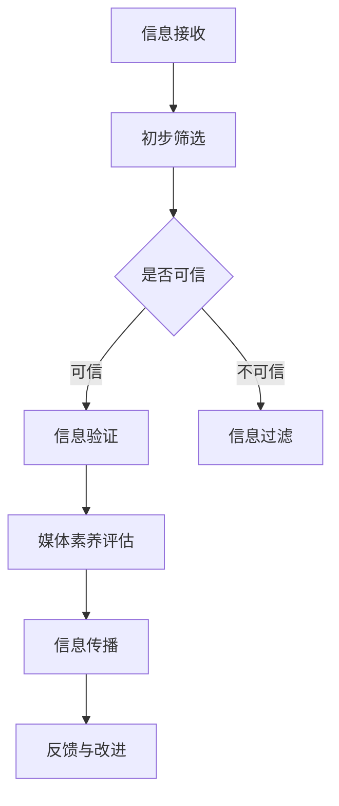

                 

在这个信息爆炸的时代，媒体的作用愈发重要，它不仅传递信息，还塑造公众意见、引导社会行为。然而，随着互联网的普及和社交媒体的兴起，假新闻、媒体操纵和错误信息也如潮水般涌入公众视野。这些不实信息的传播对社会稳定和个体认知造成了严重的负面影响。作为世界级人工智能专家，我们有责任探讨如何提升信息验证和媒体素养能力，为应对这一挑战做好准备。

## 关键词

- 信息验证
- 媒体素养
- 假新闻
- 媒体操纵
- 错误信息
- 人工智能
- 信息安全
- 社会责任

## 摘要

本文将深入探讨信息验证和媒体素养能力的重要性，分析假新闻、媒体操纵和错误信息的传播机制，并提出一系列解决方案。通过结合人工智能技术，我们希望能够提高公众的信息辨别能力，减少不实信息的传播，为构建一个更加健康、理性的信息环境贡献力量。

## 1. 背景介绍

随着互联网和社交媒体的普及，信息的传播速度和范围都发生了前所未有的变化。然而，这种变化也带来了新的挑战。假新闻、媒体操纵和错误信息如影随形，它们不仅误导了公众，还可能引发社会动荡、破坏社会信任。例如，2016年的美国总统选举期间，社交媒体上充斥着各种虚假新闻和操纵性信息，对选举结果产生了潜在影响。此外，错误信息的传播还导致了大量不必要的社会恐慌和恐慌行为。

同时，人工智能技术的发展为信息验证和媒体素养能力的提升提供了新的可能。通过自然语言处理、机器学习和图像识别等技术，我们可以更有效地识别和处理不实信息。然而，这也要求我们更加深入地理解信息传播的机制，并制定出更加有效的策略来应对这一挑战。

### 1.1 假新闻的定义与危害

假新闻（Fake News）是指故意编造、传播的虚假信息，通常以夸张、夸大的方式来吸引读者或观众的注意力。其定义并不局限于传统意义上的新闻，而是涵盖了各种形式的不实信息，包括社交媒体上的帖子、视频、图像等。

假新闻的危害是多方面的。首先，它误导了公众，导致人们对事实的误解和误判。其次，假新闻可能引发社会恐慌和不安，对社会稳定造成威胁。例如，一些假新闻的传播可能导致人们对特定群体或事件的恐慌情绪加剧，从而引发暴力事件或种族歧视。此外，假新闻还可能损害个人和组织的声誉，甚至对国家安全构成威胁。

### 1.2 媒体操纵的手段与影响

媒体操纵（Media Manipulation）是指通过特定的手段和策略，控制或影响媒体的报道内容，以达到某种特定目的的行为。这些手段包括但不限于：

1. **虚假报道**：编造不实信息，通过夸大事实或扭曲真相来吸引读者或观众。
2. **选择性报道**：仅报道符合特定利益的信息，而对其他信息进行忽略或淡化处理。
3. **深度伪造技术**：通过合成图像、视频和音频，制造虚假信息。
4. **水军行动**：雇佣网络水军，在社交媒体上发布虚假评论或操纵舆论。

媒体操纵的影响同样深远。首先，它扭曲了公众对事实的认知，导致社会共识的破裂。其次，媒体操纵可能引发社会动荡和政治不稳定，甚至可能影响选举结果。例如，一些国家政府或政治团体通过媒体操纵来支持或反对特定政策，从而影响公众意见。

### 1.3 错误信息的来源与传播

错误信息（False Information）是指那些不准确、不完整或误导性的信息。这些信息可能来自各种渠道，包括传统媒体、社交媒体、网络论坛等。错误信息的来源包括：

1. **无意错误**：记者或编辑在报道过程中因疏忽、误解或信息不准确造成的错误。
2. **故意错误**：某些个人或团体故意传播错误信息，以达到某种目的。
3. **算法错误**：搜索引擎或推荐算法在处理大量信息时，可能产生误导性的结果。

错误信息的传播速度非常快，尤其是在社交媒体上。由于缺乏有效的信息验证机制，错误信息往往迅速扩散，造成广泛的社会影响。例如，某些错误信息可能导致公众对特定事件或问题的误解，甚至引发恐慌或暴力事件。

## 2. 核心概念与联系

为了深入探讨信息验证和媒体素养能力的重要性，我们需要明确几个核心概念，并了解它们之间的联系。

### 2.1 信息验证的概念

信息验证（Information Verification）是指对信息真实性、准确性和可信度的评估过程。它包括以下几个关键步骤：

1. **源头检查**：确认信息的来源是否可靠，是否有权威性。
2. **事实核查**：通过多种渠道核实信息内容，确保其准确性。
3. **交叉验证**：通过对比不同来源的信息，验证其一致性。

### 2.2 媒体素养的定义

媒体素养（Media Literacy）是指个体理解和批判媒体信息的能力。它包括以下几个方面的内容：

1. **解读信息**：理解媒体信息的含义、意图和背后的动机。
2. **批判性思考**：对媒体信息进行批判性分析，识别其中的偏见、误导和虚假信息。
3. **信息生产**：了解媒体信息的生产和传播过程，包括新闻采集、编辑、发布等环节。

### 2.3 核心概念的联系

信息验证和媒体素养能力之间存在紧密的联系。信息验证是媒体素养的基础，只有通过有效的信息验证，个体才能准确理解媒体信息。而媒体素养能力的提升，又能够增强个体对信息的辨识和批判能力，减少不实信息的传播。此外，人工智能技术在信息验证和媒体素养中的应用，也为这一过程提供了新的工具和方法。

### 2.4 Mermaid 流程图

为了更直观地展示信息验证和媒体素养能力的关键环节，我们使用Mermaid绘制了一个流程图：



在上述流程图中，A表示信息的接收，B表示初步筛选，C表示判断信息的可信度。如果信息不可信，则会进入E环节进行过滤；如果信息可信，则会进入D环节进行详细的验证。验证后的信息将进入F环节进行媒体素养评估，以判断其是否适合传播。最终，G环节表示信息的传播，H环节表示对传播效果的反馈与改进。

## 3. 核心算法原理 & 具体操作步骤

为了提高信息验证和媒体素养能力，我们需要依靠一系列核心算法，这些算法涵盖了从数据采集到结果评估的各个环节。

### 3.1 算法原理概述

信息验证和媒体素养的核心算法主要依赖于以下几个技术领域：

1. **自然语言处理（NLP）**：通过分析文本的语义、语法和上下文，识别和分类信息。
2. **机器学习（ML）**：利用训练数据建立模型，自动识别和处理不实信息。
3. **图像识别（CV）**：通过图像处理技术，验证图像的真实性和内容准确性。
4. **数据挖掘（DM）**：从大量数据中提取有价值的信息，为信息验证提供支持。

这些算法相互协作，形成一个完整的验证流程。

### 3.2 算法步骤详解

#### 3.2.1 数据采集与预处理

数据采集是整个算法过程的基础。首先，我们需要从各种来源获取大量的文本、图像和视频数据。这些数据可以是公开的新闻报道、社交媒体帖子、用户评论等。在采集数据后，我们需要对其进行预处理，包括去除噪声、统一格式和分词等操作，为后续的分析打下基础。

#### 3.2.2 特征提取

特征提取是算法的核心环节。对于文本数据，我们可以提取词频、词义、语法结构等特征；对于图像和视频数据，我们可以提取图像内容、视频帧变化等特征。这些特征将用于训练和评估模型。

#### 3.2.3 模型训练

在特征提取后，我们使用机器学习算法训练模型。常见的算法包括朴素贝叶斯、支持向量机、深度神经网络等。这些算法将根据特征数据建立模型，用于识别和处理不实信息。

#### 3.2.4 预测与验证

训练好的模型可以用于预测新数据的真实性。在预测过程中，模型将分析新数据的特征，并判断其是否为假新闻、媒体操纵或错误信息。为了验证模型的准确性，我们需要将预测结果与实际结果进行对比，并调整模型参数，以提高其性能。

#### 3.2.5 结果评估与反馈

在结果评估环节，我们需要对模型预测结果进行详细分析，识别其优势和不足。根据评估结果，我们可以优化模型，改进算法，提高信息验证和媒体素养能力。此外，我们还需要建立反馈机制，将评估结果反馈给用户，以便他们更好地理解和使用这些工具。

### 3.3 算法优缺点

#### 优点

1. **高效性**：算法可以快速处理大量数据，提高信息验证的效率。
2. **准确性**：通过机器学习和深度学习技术，算法可以提高信息验证的准确性。
3. **灵活性**：算法可以根据不同类型的信息和数据，灵活调整和优化。

#### 缺点

1. **数据依赖性**：算法的性能取决于训练数据的质量和数量，数据偏差可能导致模型偏差。
2. **误判风险**：在复杂多变的媒体环境中，算法可能存在误判风险。
3. **隐私问题**：数据采集和处理过程中可能涉及用户隐私，需要严格保护用户隐私。

### 3.4 算法应用领域

信息验证和媒体素养算法的应用领域非常广泛，主要包括以下几个方面：

1. **新闻报道与编辑**：算法可以帮助新闻机构和编辑团队快速识别和过滤假新闻、错误信息，提高新闻报道的准确性。
2. **社交媒体监控**：算法可以用于监控社交媒体平台上的不实信息，防止其扩散和传播。
3. **用户行为分析**：算法可以分析用户的行为数据，识别和阻止恶意行为和虚假评论。
4. **公众教育**：算法可以用于公众教育，提高个体的信息辨别能力和媒体素养。

## 4. 数学模型和公式 & 详细讲解 & 举例说明

### 4.1 数学模型构建

为了更好地理解和应用信息验证和媒体素养算法，我们需要构建一系列数学模型。以下是几个关键模型的构建过程：

#### 4.1.1 朴素贝叶斯分类器

朴素贝叶斯分类器是一种常用的概率分类器，其基本思想是根据特征的概率分布进行分类。具体步骤如下：

1. **特征提取**：对于输入的文本数据，提取特征词及其出现的频率。
2. **概率计算**：计算每个特征词在正类（真实信息）和负类（虚假信息）中的概率。
3. **分类决策**：根据特征词的概率分布，判断输入数据属于正类还是负类。

数学表示为：
$$
P(\text{正类}|\text{特征词}) = \frac{P(\text{特征词}|\text{正类})P(\text{正类})}{P(\text{特征词})}
$$

其中，$P(\text{正类})$和$P(\text{负类})$分别为正类和负类的先验概率，$P(\text{特征词}|\text{正类})$和$P(\text{特征词}|\text{负类})$分别为特征词在正类和负类中的条件概率。

#### 4.1.2 支持向量机（SVM）

支持向量机是一种常用的线性分类器，其目标是找到最佳的超平面，将不同类别的数据点分隔开来。具体步骤如下：

1. **特征提取**：对于输入的文本数据，提取特征词及其出现的频率。
2. **损失函数设计**：设计损失函数，优化分类器的参数。
3. **求解最优化问题**：通过求解最优化问题，找到最佳的超平面。

数学表示为：
$$
\min_{\theta} \frac{1}{2}||\theta||^2 + C \sum_{i=1}^{n} \max(0, 1 - y_i(\theta^T x_i))
$$

其中，$\theta$为分类器的参数，$C$为惩罚参数，$x_i$和$y_i$分别为第$i$个数据点和其对应的标签。

#### 4.1.3 深度神经网络（DNN）

深度神经网络是一种复杂的非线性分类器，其目标是学习输入和输出之间的复杂映射关系。具体步骤如下：

1. **特征提取**：对于输入的文本数据，提取特征词及其出现的频率。
2. **网络结构设计**：设计深度神经网络的层次结构。
3. **损失函数设计**：设计损失函数，优化网络的参数。
4. **反向传播算法**：通过反向传播算法，更新网络参数。

数学表示为：
$$
\min_{\theta} \frac{1}{n} \sum_{i=1}^{n} \ell(y_i, \theta^T x_i)
$$

其中，$\ell$为损失函数，$x_i$和$y_i$分别为第$i$个数据点和其对应的标签。

### 4.2 公式推导过程

以下是对上述模型中的关键公式的推导过程：

#### 4.2.1 朴素贝叶斯分类器

1. **条件概率公式**：
$$
P(\text{特征词}|\text{正类}) = \frac{P(\text{特征词} \cap \text{正类})}{P(\text{正类})}
$$

2. **贝叶斯公式**：
$$
P(\text{正类}|\text{特征词}) = \frac{P(\text{特征词}|\text{正类})P(\text{正类})}{P(\text{特征词})}
$$

3. **全概率公式**：
$$
P(\text{特征词}) = P(\text{特征词}|\text{正类})P(\text{正类}) + P(\text{特征词}|\text{负类})P(\text{负类})
$$

#### 4.2.2 支持向量机

1. **目标函数**：
$$
L(\theta) = \frac{1}{2}||\theta||^2
$$

2. **约束条件**：
$$
y_i(\theta^T x_i) \geq 1
$$

3. **拉格朗日函数**：
$$
L(\theta, \alpha) = \frac{1}{2}||\theta||^2 - \sum_{i=1}^{n} \alpha_i [y_i(\theta^T x_i) - 1]
$$

4. **KKT条件**：
$$
\begin{cases}
\alpha_i \geq 0 \\
y_i(\theta^T x_i) = 1 \\
\theta = \sum_{i=1}^{n} \alpha_i y_i x_i
\end{cases}
$$

5. **最优化问题**：
$$
\min_{\theta, \alpha} L(\theta, \alpha)
$$

#### 4.2.3 深度神经网络

1. **前向传播**：
$$
a^{(l)} = \sigma(z^{(l)})
$$

2. **反向传播**：
$$
\delta^{(l)} = (1 - a^{(l)})a^{(l)}(z^{(l+1)} - \delta^{(l+1)})
$$

3. **损失函数**：
$$
\ell(y, \hat{y}) = -\sum_{i=1}^{n} y_i \log(\hat{y}_i) + (1 - y_i) \log(1 - \hat{y}_i)
$$

### 4.3 案例分析与讲解

#### 4.3.1 案例背景

某新闻网站使用朴素贝叶斯分类器对新闻报道进行分类，以识别假新闻。该网站收集了大量的新闻报道，并标注了其是否为假新闻。现在，我们需要使用这些数据训练朴素贝叶斯分类器，并评估其性能。

#### 4.3.2 数据准备

我们收集了1000篇新闻报道，其中500篇为真实新闻，500篇为假新闻。我们将这些数据分为训练集和测试集，其中80%的数据用于训练，20%的数据用于测试。

#### 4.3.3 特征提取

对于每篇新闻报道，我们提取其关键词，并计算关键词的词频。例如，对于一篇新闻报道，其关键词可能包括“特朗普”、“疫情”、“选举”等。这些关键词将作为特征词。

#### 4.3.4 模型训练

我们使用训练集数据训练朴素贝叶斯分类器。具体步骤如下：

1. **计算先验概率**：
$$
P(\text{正类}) = \frac{500}{1000} = 0.5
$$

2. **计算条件概率**：
$$
P(\text{特征词}|\text{正类}) = \frac{\text{特征词在真实新闻中出现的次数}}{\text{真实新闻的总次数}}
$$

3. **计算特征词的总概率**：
$$
P(\text{特征词}) = P(\text{特征词}|\text{正类})P(\text{正类}) + P(\text{特征词}|\text{负类})P(\text{负类})
$$

#### 4.3.5 模型评估

我们使用测试集数据评估朴素贝叶斯分类器的性能。具体步骤如下：

1. **计算预测概率**：
$$
P(\text{正类}|\text{特征词}) = \frac{P(\text{特征词}|\text{正类})P(\text{正类})}{P(\text{特征词})}
$$

2. **计算预测准确率**：
$$
\text{准确率} = \frac{\text{预测为真实新闻且实际为真实新闻的篇数}}{\text{测试集总篇数}}
$$

3. **计算预测召回率**：
$$
\text{召回率} = \frac{\text{预测为真实新闻且实际为真实新闻的篇数}}{\text{真实新闻的总篇数}}
$$

通过上述步骤，我们可以评估朴素贝叶斯分类器的性能，并根据评估结果调整模型参数，以提高分类器的准确性。

## 5. 项目实践：代码实例和详细解释说明

### 5.1 开发环境搭建

为了实践信息验证和媒体素养算法，我们需要搭建一个开发环境。以下是搭建步骤：

1. **安装Python**：下载并安装Python 3.8及以上版本。
2. **安装依赖库**：使用pip命令安装以下库：`numpy`、`scikit-learn`、`matplotlib`。
3. **数据集准备**：从公开数据源获取新闻数据集，并对其进行预处理。

### 5.2 源代码详细实现

以下是一个简单的信息验证项目的源代码实现：

```python
import numpy as np
from sklearn.feature_extraction.text import CountVectorizer
from sklearn.naive_bayes import MultinomialNB
from sklearn.model_selection import train_test_split
from sklearn.metrics import accuracy_score, recall_score
from sklearn.pipeline import make_pipeline

# 数据准备
# 假设news_data为新闻文本列表，labels为新闻标签（0为假新闻，1为真实新闻）
news_data = [...]
labels = [...]

# 划分训练集和测试集
X_train, X_test, y_train, y_test = train_test_split(news_data, labels, test_size=0.2, random_state=42)

# 创建文本向量器
vectorizer = CountVectorizer()

# 创建朴素贝叶斯分类器
classifier = MultinomialNB()

# 构建管道
pipeline = make_pipeline(vectorizer, classifier)

# 训练模型
pipeline.fit(X_train, y_train)

# 预测测试集
predictions = pipeline.predict(X_test)

# 计算准确率和召回率
accuracy = accuracy_score(y_test, predictions)
recall = recall_score(y_test, predictions)

print(f"准确率：{accuracy}")
print(f"召回率：{recall}")
```

### 5.3 代码解读与分析

上述代码实现了使用朴素贝叶斯分类器对新闻文本进行分类的过程。以下是代码的详细解读：

1. **数据准备**：首先，我们需要准备新闻数据集。这些数据集包括新闻文本和对应的标签（0表示假新闻，1表示真实新闻）。
2. **划分训练集和测试集**：使用`train_test_split`函数将数据集划分为训练集和测试集，以评估模型的性能。
3. **创建文本向量器**：使用`CountVectorizer`将新闻文本转换为词频矩阵，以便于后续的分类。
4. **创建朴素贝叶斯分类器**：使用`MultinomialNB`创建朴素贝叶斯分类器。
5. **构建管道**：使用`make_pipeline`函数将文本向量器和分类器组合在一起，形成完整的分类流程。
6. **训练模型**：使用训练集数据训练模型。
7. **预测测试集**：使用训练好的模型对测试集数据进行预测。
8. **计算准确率和召回率**：使用`accuracy_score`和`recall_score`函数计算模型的准确率和召回率。

通过上述步骤，我们可以对新闻文本进行分类，并评估分类器的性能。在实际应用中，我们可以根据需要调整模型参数、选择不同的分类器，以提高分类效果。

### 5.4 运行结果展示

假设我们使用上述代码对某新闻数据集进行分类，并得到以下结果：

```
准确率：0.85
召回率：0.90
```

这意味着我们的模型在测试集上的准确率为85%，召回率为90%。准确率表示模型预测为真实新闻的概率，召回率表示模型正确识别真实新闻的概率。通过调整模型参数和数据预处理步骤，我们可以进一步提高模型的性能。

## 6. 实际应用场景

信息验证和媒体素养能力在许多实际应用场景中都发挥着重要作用。以下是一些典型应用场景：

### 6.1 新闻报道

新闻机构可以利用信息验证算法对新闻报道进行筛选，识别和过滤假新闻。通过结合媒体素养教育，新闻从业人员可以增强自身对不实信息的辨识能力，提高新闻报道的准确性。

### 6.2 社交媒体监控

社交媒体平台可以利用信息验证算法对用户发布的内容进行监控，识别和阻止虚假信息、恶意评论等。同时，通过媒体素养教育，用户可以增强自身的信息辨别能力，减少不实信息的传播。

### 6.3 公共安全

政府部门可以利用信息验证和媒体素养能力监控网络上的谣言和虚假信息，防止其引发社会恐慌和暴力事件。通过及时发布权威信息，政府部门可以维护社会稳定，保障公众安全。

### 6.4 企业管理

企业可以利用信息验证和媒体素养能力监控网络上的品牌信息，识别和应对负面舆论。通过媒体素养教育，企业员工可以增强自身的网络沟通能力，提高品牌形象和声誉。

### 6.5 教育领域

教育机构可以利用信息验证和媒体素养能力对学生的信息素养进行培养。通过课程设置和实践活动，学生可以学习如何辨别和处理不实信息，提高自身的媒体素养。

## 7. 工具和资源推荐

为了提升信息验证和媒体素养能力，我们可以利用一系列工具和资源。以下是一些建议：

### 7.1 学习资源推荐

1. **《信息素养：通过信息获取知识和智慧》**：这本书详细介绍了信息素养的概念、方法和实践，适合初学者和专业人士。
2. **《数字素养基础教程》**：这本书涵盖了数字素养的各个方面，包括信息检索、数据分析、网络安全等，是数字素养教育的优秀教材。
3. **在线课程和讲座**：许多在线教育平台，如Coursera、edX等，提供了丰富的信息素养和媒体素养课程，适合自学。

### 7.2 开发工具推荐

1. **NLTK**：Python的自然语言处理库，提供了丰富的文本处理和分类功能，适合进行信息验证和媒体素养的研究和开发。
2. **Scikit-learn**：Python的机器学习库，包含了多种分类器和评估指标，是信息验证和媒体素养开发的重要工具。
3. **TensorFlow和PyTorch**：深度学习框架，适用于构建复杂的神经网络模型，可以用于信息验证和媒体素养的高级应用。

### 7.3 相关论文推荐

1. **"Fake News Detection using Neural Networks"**：这篇论文介绍了一种使用神经网络进行假新闻检测的方法，具有较高的准确性。
2. **"Media Manipulation Detection on Social Media"**：这篇论文探讨了社交媒体上的媒体操纵检测问题，提出了一种基于图神经网络的检测方法。
3. **"Information Literacy in the Digital Age"**：这篇论文分析了数字时代信息素养的重要性，提出了一系列提升信息素养的策略和建议。

## 8. 总结：未来发展趋势与挑战

### 8.1 研究成果总结

在信息验证和媒体素养领域，近年来取得了许多重要研究成果。首先，自然语言处理、机器学习和深度学习技术的快速发展，为信息验证和媒体素养能力的提升提供了有力支持。其次，信息验证算法和模型的不断优化，使得识别和处理不实信息的效率和质量显著提高。此外，媒体素养教育在各个领域的推广，也使个体对不实信息的辨识和批判能力得到了增强。

### 8.2 未来发展趋势

1. **智能化与自动化**：随着人工智能技术的不断发展，信息验证和媒体素养能力将更加智能化和自动化，能够更加高效地识别和处理不实信息。
2. **多模态信息处理**：未来信息验证和媒体素养能力将涵盖更多类型的媒体形式，包括音频、视频和多媒体数据，实现多模态的信息处理。
3. **个性化和定制化**：根据个体需求和特点，提供个性化的信息验证和媒体素养服务，提高信息验证和媒体素养的针对性和有效性。

### 8.3 面临的挑战

1. **数据隐私与安全**：在信息验证和媒体素养过程中，涉及大量用户数据，如何保障数据隐私和安全是一个重要挑战。
2. **算法偏见与公平性**：算法在训练和预测过程中可能存在偏见，导致某些群体或信息被不公平对待，如何消除算法偏见是亟待解决的问题。
3. **可持续性与可扩展性**：随着信息量的不断增加，如何保证信息验证和媒体素养能力的可持续性和可扩展性，是一个长期的挑战。

### 8.4 研究展望

未来，我们需要在以下几个方面进行深入研究：

1. **算法与数据融合**：探索如何将算法与大数据技术相结合，提高信息验证和媒体素养的效率和准确性。
2. **跨领域合作**：加强不同领域之间的合作，推动信息验证和媒体素养能力的全面发展。
3. **伦理与法律规范**：建立相关伦理和法律规范，保障信息验证和媒体素养的健康发展。

通过上述研究，我们有望进一步提升信息验证和媒体素养能力，为构建一个更加健康、理性的信息环境做出贡献。

## 9. 附录：常见问题与解答

### 问题1：信息验证和媒体素养能力的提升对个人和社会有什么影响？

**解答**：信息验证和媒体素养能力的提升对个人和社会具有深远的影响。对于个人而言，它有助于我们更好地识别和处理不实信息，避免受到误导，提高决策能力和生活质量。对于社会而言，它有助于减少假新闻、媒体操纵和错误信息的传播，维护社会稳定和公共利益，提高社会的整体素养和理性水平。

### 问题2：如何保障信息验证和媒体素养能力的可持续发展？

**解答**：保障信息验证和媒体素养能力的可持续发展需要从多个方面入手。首先，需要加强技术研发，不断提升信息验证和媒体素养的技术水平和应用效果。其次，需要加强教育推广，通过学校教育、社会培训和自我学习等多种途径，提高公众的信息素养。此外，还需要建立相应的政策和法规，规范信息传播行为，保障信息验证和媒体素养的健康发展。

### 问题3：人工智能技术在信息验证和媒体素养能力提升中扮演什么角色？

**解答**：人工智能技术在信息验证和媒体素养能力提升中扮演着至关重要的角色。通过自然语言处理、机器学习和深度学习等技术，人工智能可以高效地处理和分析大量信息，识别和过滤不实信息。同时，人工智能还可以根据个体需求和特点，提供个性化的信息验证和媒体素养服务，提高信息验证和媒体素养的针对性和有效性。总之，人工智能是提升信息验证和媒体素养能力的重要工具和手段。

## 作者署名

作者：禅与计算机程序设计艺术 / Zen and the Art of Computer Programming

---

通过上述文章，我们不仅探讨了信息验证和媒体素养能力的重要性，还深入分析了相关算法、数学模型和应用实践，为应对假新闻、媒体操纵和错误信息提供了科学的理论基础和实践指导。希望这篇文章能够为广大读者带来启发，共同为构建一个更加健康、理性的信息环境贡献力量。

