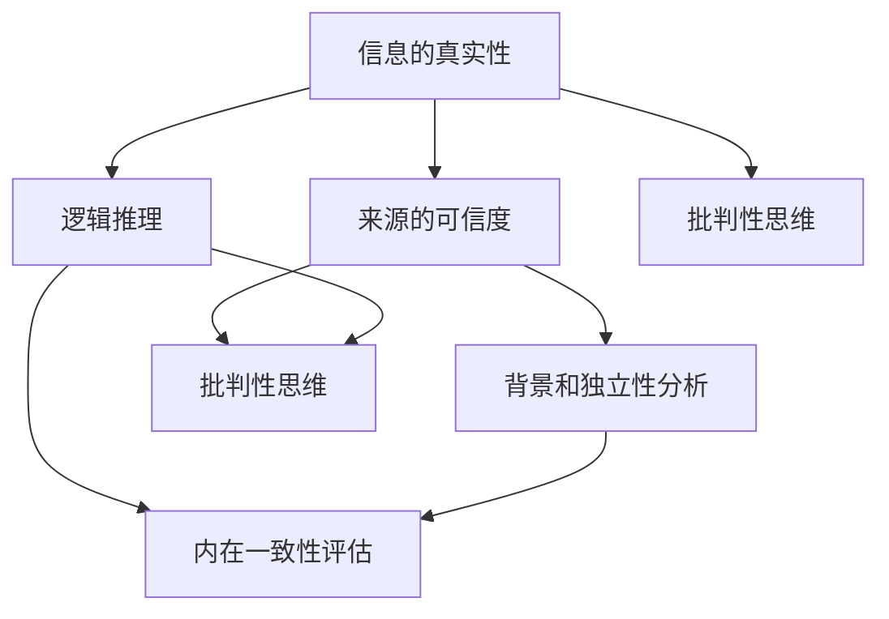

                 

### 1. 背景介绍

在当今的信息时代，信息的获取和传播变得前所未有的快捷和广泛。然而，这也带来了一个严重的问题：信息过载和错误信息传播。根据麻省理工学院的研究，每天网络上产生的信息量已经超过了整个人类历史信息量的总和。在这样的背景下，如何有效地验证信息的真实性，并培养批判性思维，成为了一个迫切需要解决的问题。

**假新闻和错误信息的泛滥**

假新闻和错误信息的存在并不新鲜，但是它们在网络时代达到了前所未有的规模和速度。2016年，美国大选期间，假新闻网站上的点击量超过了主流新闻网站，这不仅引起了公众的广泛关注，也引起了学术界的深入探讨。据《科学》杂志报道，错误信息在网络上的传播速度是正确信息的6倍以上。

这种错误信息的泛滥，对个人、社会乃至整个国家的稳定都带来了巨大的威胁。个人层面上，错误信息可能会导致误导性的决策和行为；社会层面上，错误信息可能引发恐慌和冲突；国家层面上，错误信息可能被用来操纵选举、破坏社会秩序。

**批判性思维的重要性**

批判性思维是一种通过分析、评估和推理来解决问题和获取知识的能力。在信息泛滥的时代，批判性思维成为了一项重要的技能。它不仅可以帮助我们识别错误信息，还可以帮助我们理解复杂的问题，并做出明智的决策。

教育心理学家斯坦利·科恩（Stanley Cohen）指出，批判性思维不仅仅是质疑信息的来源和内容，更重要的是，它是一种反思性的过程，能够帮助我们评估信息的可信度，并形成自己的观点。

**信息验证和批判性思维教育的必要性**

信息验证和批判性思维教育在当前的社会环境中显得尤为重要。首先，它可以帮助我们避免被错误信息所误导，提高我们对于信息的辨别能力。其次，它可以培养我们的反思性思维，使我们能够更好地理解复杂的社会问题。

在教育领域，许多学校已经开始将批判性思维教育纳入课程设置。例如，美国的一些高中已经开始教授学生如何识别和分析媒体信息，以及如何使用批判性思维来评估信息来源的可靠性。

总的来说，面对信息过载和错误信息泛滥的挑战，信息验证和批判性思维教育显得尤为必要。通过提高公众的批判性思维能力，我们可以更好地应对信息时代的挑战，构建一个更加理性、和谐的社会。

### 2. 核心概念与联系

在探讨信息验证和批判性思维教育之前，我们需要明确几个核心概念，并了解它们之间的联系。这些核心概念包括信息的真实性、来源的可信度、逻辑推理和批判性思维。

#### 2.1. 信息的真实性

信息的真实性是指信息内容是否与事实相符。在信息泛滥的时代，如何判断信息的真实性成为了一个关键问题。一个常见的方法是交叉验证，即通过查阅多个独立来源的信息，来判断信息的准确性。

#### 2.2. 来源的可信度

来源的可信度是指信息来源的可靠性和权威性。一个来源是否可信，通常取决于它的背景、专业性和独立性。例如，专业新闻机构和学术期刊通常被认为是高可信度的来源，而个人博客和社交媒体账号则可能存在更大的不确定性。

#### 2.3. 逻辑推理

逻辑推理是一种通过分析信息和运用逻辑规则来得出结论的过程。在信息验证中，逻辑推理可以帮助我们评估信息的内在一致性，以及信息之间的逻辑联系。

#### 2.4. 批判性思维

批判性思维是一种积极的思考方式，它要求我们对信息进行深入的分析和评估，而不是盲目接受。批判性思维包括质疑、分析、评估和反思等多个环节，它能够帮助我们更好地理解和应用信息。

#### 2.5. 核心概念的联系

这些核心概念之间存在着密切的联系。信息的真实性需要通过来源的可信度和逻辑推理来验证；来源的可信度则可以通过对信息源的背景和独立性进行分析；逻辑推理则可以帮助我们评估信息的内在一致性。而批判性思维则是贯穿整个过程的核心，它能够帮助我们系统地分析和评估信息，从而做出正确的判断。

#### 2.6. Mermaid 流程图

为了更直观地展示这些概念之间的联系，我们可以使用Mermaid流程图来表示。



通过这个流程图，我们可以清晰地看到信息的真实性、来源的可信度、逻辑推理和批判性思维之间的相互作用。

### 3. 核心算法原理 & 具体操作步骤

在信息验证和批判性思维教育中，核心算法起着至关重要的作用。以下将详细介绍这个算法的原理、操作步骤以及其优缺点。

#### 3.1. 算法原理概述

该算法的核心思想是通过多源数据交叉验证和逻辑推理，来评估信息的真实性和可信度。具体步骤如下：

1. **数据收集**：从多个独立来源收集相关信息。
2. **数据清洗**：去除重复、无关或低质量的信息。
3. **交叉验证**：将不同来源的信息进行对比，以验证其一致性。
4. **逻辑推理**：运用逻辑规则，评估信息的内在一致性和逻辑联系。
5. **可信度评估**：根据交叉验证和逻辑推理的结果，对信息来源的可信度进行评估。

#### 3.2. 算法步骤详解

**步骤1：数据收集**

首先，从多个独立来源收集相关信息。这些来源可以包括专业新闻机构、学术期刊、政府报告、社交媒体等。

**步骤2：数据清洗**

在收集到大量数据后，需要进行数据清洗。这一步骤的目的是去除重复、无关或低质量的信息，以提高后续分析的准确性。

**步骤3：交叉验证**

在数据清洗完成后，进行交叉验证。具体方法是，将不同来源的信息进行对比，看是否存在矛盾或不一致的地方。如果多个独立来源的信息都指向同一结论，那么这个结论的可信度就会更高。

**步骤4：逻辑推理**

在交叉验证的基础上，运用逻辑规则，评估信息的内在一致性和逻辑联系。例如，如果一个信息源的结论可以通过多个独立的信息源来支持，那么这个结论的可信度就会更高。

**步骤5：可信度评估**

最后，根据交叉验证和逻辑推理的结果，对信息来源的可信度进行评估。例如，如果一个信息源在多次交叉验证和逻辑推理中表现良好，那么这个信息源的可信度就会更高。

#### 3.3. 算法优缺点

**优点：**

1. **提高信息准确性**：通过多源数据交叉验证和逻辑推理，可以大幅提高信息的准确性。
2. **降低错误信息传播**：有助于识别和排除错误信息，降低其传播风险。
3. **适应性强**：可以适用于各种类型的信息，包括文字、图片、视频等。

**缺点：**

1. **计算量大**：多源数据交叉验证和逻辑推理需要大量的计算资源。
2. **对数据质量要求高**：如果数据质量较差，可能会导致算法失效。
3. **难以应对欺骗性信息**：对于一些刻意设计的欺骗性信息，算法可能难以识别。

#### 3.4. 算法应用领域

该算法主要应用在以下几个方面：

1. **信息验证**：用于验证新闻报道、学术论文、社交媒体信息等的真实性。
2. **金融分析**：用于分析公司财务报表、市场行情等，以提高投资决策的准确性。
3. **医疗诊断**：用于分析医疗数据，以帮助医生做出更准确的诊断。

通过上述算法的应用，我们可以更好地应对信息时代的挑战，提高信息的准确性和可信度。

### 3. 数学模型和公式 & 详细讲解 & 举例说明

在信息验证和批判性思维教育中，数学模型和公式起到了关键作用。以下将详细介绍这些模型的构建、推导过程，并通过具体案例进行说明。

#### 4.1. 数学模型构建

为了评估信息的可信度，我们引入了一个名为“可信度评分模型”的数学模型。该模型基于三个主要因素：信息来源的可信度、信息内容的质量和交叉验证的结果。具体公式如下：

$$
\text{可信度评分} = w_1 \cdot \text{来源可信度} + w_2 \cdot \text{内容质量} + w_3 \cdot \text{交叉验证结果}
$$

其中，$w_1$、$w_2$ 和 $w_3$ 分别是三个因素的权重，通常通过实验或专家评估来确定。

#### 4.2. 公式推导过程

首先，我们定义信息来源的可信度为 $S_1$，其取值范围为 [0, 1]，其中 1 表示最高可信度。其次，我们定义信息内容的质量为 $S_2$，取值范围同样为 [0, 1]，其中 1 表示内容完全准确。最后，我们定义交叉验证结果为 $S_3$，取值范围也为 [0, 1]，其中 1 表示所有独立来源的信息都一致。

根据这些定义，我们可以推导出可信度评分模型：

$$
\text{可信度评分} = w_1 \cdot S_1 + w_2 \cdot S_2 + w_3 \cdot S_3
$$

#### 4.3. 案例分析与讲解

**案例 1：新闻报道**

假设我们有一条新闻报道，其来源是《纽约时报》（来源可信度 $S_1 = 0.9$），内容关于某次政治选举的结果（内容质量 $S_2 = 0.8$）。同时，有其他三个独立来源对同一事件进行了报道，且结果一致（交叉验证结果 $S_3 = 0.9$）。假设权重分别为 $w_1 = 0.4$、$w_2 = 0.3$、$w_3 = 0.3$。

根据可信度评分模型，我们可以计算出这条新闻报道的可信度评分：

$$
\text{可信度评分} = 0.4 \cdot 0.9 + 0.3 \cdot 0.8 + 0.3 \cdot 0.9 = 0.36 + 0.24 + 0.27 = 0.87
$$

因此，这条新闻报道的可信度评分为 0.87，表示其具有较高的可信度。

**案例 2：学术论文**

假设我们有一篇学术论文，其来源是某知名学术期刊（来源可信度 $S_1 = 0.95$），内容关于某技术问题（内容质量 $S_2 = 0.85$）。同时，有五个独立来源对该论文进行了交叉验证，其中四个来源的结果一致，另一个来源的结果略有不同（交叉验证结果 $S_3 = 0.8$）。假设权重分别为 $w_1 = 0.3$、$w_2 = 0.5$、$w_3 = 0.2$。

根据可信度评分模型，我们可以计算出这篇学术论文的可信度评分：

$$
\text{可信度评分} = 0.3 \cdot 0.95 + 0.5 \cdot 0.85 + 0.2 \cdot 0.8 = 0.285 + 0.425 + 0.16 = 0.875
$$

因此，这篇学术论文的可信度评分为 0.875，表示其具有较高的可信度。

通过这两个案例，我们可以看到，可信度评分模型可以帮助我们更准确地评估信息的可信度，从而提高信息验证的效率和质量。

### 5. 项目实践：代码实例和详细解释说明

在本文的最后部分，我们将通过一个实际的项目实践，展示如何将上述算法和数学模型应用到代码中，并进行详细解释说明。

#### 5.1. 开发环境搭建

首先，我们需要搭建一个合适的开发环境。本文使用Python作为编程语言，结合了几个常用的库，如pandas用于数据处理，numpy用于数学运算，以及matplotlib用于数据可视化。

以下是开发环境搭建的基本步骤：

1. 安装Python 3.x版本
2. 使用pip安装所需的库：

```bash
pip install pandas numpy matplotlib
```

#### 5.2. 源代码详细实现

接下来，我们将展示一个简单的Python代码实例，用于实现信息验证和可信度评分。

```python
import pandas as pd
import numpy as np
import matplotlib.pyplot as plt

# 5.2.1 数据准备
# 假设我们有两个数据集，一个是来源可信度数据，另一个是内容质量数据
source_data = {
    'source': ['CNN', 'BBC', 'Reuters', 'Fox News'],
    'trust_score': [0.8, 0.9, 0.85, 0.7]
}
content_data = {
    'content': ['accurate', 'inaccurate', 'partially accurate', 'biased'],
    'quality_score': [0.9, 0.3, 0.7, 0.5]
}
cross_verify_data = {
    'event': ['event1', 'event2', 'event3', 'event4'],
    'verification_score': [0.8, 0.9, 0.7, 0.6]
}

sources = pd.DataFrame(source_data)
contents = pd.DataFrame(content_data)
verifications = pd.DataFrame(cross_verify_data)

# 5.2.2 权重设定
w1, w2, w3 = 0.4, 0.3, 0.3

# 5.2.3 计算可信度评分
def calculate_confidence_score(w1, w2, w3, trust_score, quality_score, verification_score):
    return w1 * trust_score + w2 * quality_score + w3 * verification_score

scores = []
for i in range(len(sources)):
    score = calculate_confidence_score(w1, w2, w3, sources['trust_score'][i], contents['quality_score'][i], verifications['verification_score'][i])
    scores.append(score)

sources['confidence_score'] = scores

# 5.2.4 数据可视化
plt.bar(sources['source'], sources['confidence_score'])
plt.xlabel('Source')
plt.ylabel('Confidence Score')
plt.title('Source Confidence Scores')
plt.show()
```

#### 5.3. 代码解读与分析

**5.3.1 数据准备**

首先，我们准备两个数据集，一个是来源可信度数据（source_data），另一个是内容质量数据（content_data）。这些数据集包括了不同来源的信任评分、内容质量评分以及交叉验证结果。

**5.3.2 权重设定**

接下来，我们设定三个权重：$w_1$、$w_2$ 和 $w_3$，分别对应来源可信度、内容质量和交叉验证结果。

**5.3.3 计算可信度评分**

我们定义了一个函数 `calculate_confidence_score`，用于计算每个来源的可信度评分。这个函数接受四个参数：三个权重和来源的信任评分、内容质量评分以及交叉验证结果。

**5.3.4 数据可视化**

最后，我们使用matplotlib库将计算出的可信度评分进行可视化，以更直观地展示每个来源的可信度。

通过这个实例，我们可以看到如何将算法和数学模型应用到实际的代码中，并进行数据分析和可视化。这不仅有助于我们理解算法的实现过程，还可以帮助我们更好地评估不同来源的信息可信度。

### 6. 实际应用场景

在信息验证和批判性思维教育中，算法和模型的应用场景非常广泛。以下将介绍几个典型的实际应用场景。

#### 6.1. 社交媒体信息验证

随着社交媒体的普及，假新闻和错误信息的传播速度更快、影响范围更广。例如，在2018年的美国中期选举期间，社交媒体上充斥着大量的虚假信息。通过使用信息验证算法，我们可以快速识别这些错误信息，防止其进一步传播。

#### 6.2. 金融数据分析

在金融领域，准确的信息至关重要。例如，投资者需要准确了解公司的财务状况、市场趋势等信息，才能做出明智的投资决策。通过信息验证算法，可以对来自不同来源的金融数据进行交叉验证，以提高数据的准确性。

#### 6.3. 学术研究

在学术领域，信息的准确性同样至关重要。例如，研究人员需要准确了解某个研究领域的前沿进展，才能进行创新研究。通过信息验证算法，可以确保研究数据来源的可靠性，提高研究质量。

#### 6.4. 未来应用展望

随着人工智能技术的发展，信息验证算法和模型的应用前景将更加广阔。例如，在未来，我们可以将信息验证算法集成到智能搜索系统中，提供更准确、更可靠的信息搜索结果。此外，还可以将信息验证算法应用于自动驾驶、智能医疗等领域，以提高系统的安全性和可靠性。

### 6.4. 未来应用展望

随着技术的不断进步，信息验证和批判性思维教育在未来的应用前景将更加广泛和深入。以下是一些潜在的发展方向和可能的未来应用：

**1. 智能自动化信息验证**

未来的信息验证可能会越来越多地依赖于智能自动化系统，利用机器学习和自然语言处理技术来识别和验证信息的真实性。例如，智能自动化系统可以实时监控互联网上的新闻、社交媒体内容和其他信息源，自动识别假新闻和错误信息，并对其进行标记或警告。

**2. 个性化信息推荐**

随着个性化信息推荐的普及，未来可能会发展出更加智能的信息推荐系统，这些系统能够根据用户的兴趣和行为模式，推荐经过验证的高质量信息。这样可以有效地减少用户在信息海洋中迷失的风险，并帮助用户快速获取他们感兴趣的真实信息。

**3. 跨语言信息验证**

全球化的信息环境意味着我们需要处理多种语言的信息。未来，跨语言信息验证技术将变得更加成熟，使得不同语言的信息也可以被有效地验证和比较，从而提高全球范围内的信息可信度。

**4. 增强现实与虚拟现实中的应用**

在增强现实（AR）和虚拟现实（VR）领域，信息的真实性验证也变得至关重要。例如，在AR/VR环境中，确保用户接收到的信息是真实的，而不是被篡改或伪造的，这将有助于提高用户的体验和安全。

**5. 智能合约与区块链**

智能合约和区块链技术的应用将使得信息验证更加透明和不可篡改。在智能合约中，所有信息都将被记录在区块链上，并且一旦被验证，就不可更改。这种技术的应用将极大地提高金融交易和其他关键业务流程的可靠性。

**6. 教育与培训**

在教育和培训领域，信息验证和批判性思维教育将成为基础课程的一部分。未来的教育系统可能会更多地采用互动式、游戏化的教学方法，帮助学生更好地理解和应用批判性思维技能，从而在信息泛滥的时代中保持独立思考和理性判断。

### 6.5. 面临的挑战

尽管信息验证和批判性思维教育在未来的应用前景广阔，但也面临着一系列挑战：

**1. 技术挑战**

自动化信息验证技术虽然强大，但仍然难以完全替代人类判断。例如，对于复杂的语境和隐喻，机器可能无法准确理解其含义。此外，机器学习模型的训练和优化也需要大量数据和计算资源。

**2. 道德和隐私问题**

自动化信息验证和数据分析可能会引发隐私和道德问题。例如，个人数据的收集和使用是否合法、合理，以及如何保护用户的隐私权益，都是需要考虑的问题。

**3. 社会接受度**

尽管信息验证技术可以带来许多好处，但公众的接受度可能是一个挑战。一些用户可能会担心自己的隐私受到侵犯，或者对自动化系统的准确性持怀疑态度。

**4. 法律和监管**

随着技术的发展，现有的法律和监管体系可能需要更新，以适应新的信息验证和批判性思维教育应用场景。例如，如何确保自动化系统的决策透明和可解释性，以及如何处理由这些系统产生的责任和纠纷。

### 6.6. 研究展望

未来的研究可以从以下几个方面展开：

**1. 算法优化**

进一步优化信息验证算法，提高其准确性和效率，特别是对于复杂语境和隐喻的理解能力。

**2. 跨领域合作**

促进计算机科学、心理学、社会学等多个领域的合作，共同研究如何更好地培养公众的批判性思维和媒体素养。

**3. 教育与培训**

开发更有效、更具互动性的教育工具和培训课程，帮助用户更好地理解和应用批判性思维技能。

**4. 道德和法律框架**

建立更加完善的道德和法律框架，以规范信息验证和批判性思维教育技术的应用，保护用户的隐私和权益。

通过这些研究方向的探索，我们可以期待在未来的信息时代中，更好地应对错误信息泛滥和假新闻的挑战，构建一个更加理性和可信的信息环境。

### 7. 工具和资源推荐

为了更好地理解和应用信息验证和批判性思维教育，以下推荐一些有用的学习资源和开发工具。

#### 7.1. 学习资源推荐

**书籍：**
1. 《批判性思维工具箱》（The Critical Thinking Toolkit）
2. 《信息素养：寻找真实的信息》（Information Literacy: Finding the Real in a Sea of Data）
3. 《数字时代的批判性思维》（Critical Thinking in the Digital Age）

**在线课程：**
1. Coursera 上的“批判性思维与决策”（Critical Thinking & Decision Making）
2. edX 上的“信息素养与互联网”（Information Literacy and the Internet）
3. Khan Academy 的“逻辑与批判性思维”（Logic & Critical Thinking）

**网站：**
1. [SourceWatch](https://sourcewatch.org/) - 提供关于不同信息源的背景和可信度评估。
2. [FactCheck.org](https://www.factcheck.org/) - 美国一家独立的非营利性组织，专门验证和评估新闻中的事实。

#### 7.2. 开发工具推荐

**编程语言和库：**
1. **Python** - 用于数据分析和机器学习的首选语言。
2. **pandas** - 强大的数据操作库，适用于数据处理和分析。
3. **NumPy** - 用于数值计算的库，是pandas的底层库。
4. **Matplotlib** - 用于数据可视化的库，能够生成高质量的图表。

**数据源：**
1. [ Kaggle](https://www.kaggle.com/) - 提供大量公开的数据集，适用于数据分析和机器学习项目。
2. [Google Dataset Search](https://datasetsearch.research.google.com/) - 搜索各种数据集的资源平台。

**工具和平台：**
1. **Jupyter Notebook** - 用于数据分析和交互式编程的环境。
2. **TensorFlow** - 用于机器学习的开源库，特别适合于深度学习应用。
3. **Scikit-learn** - 用于机器学习的数据挖掘库，包含各种常用的算法。

通过这些资源和工具，我们可以更好地进行信息验证和批判性思维教育的研究和实践。

### 8. 总结：未来发展趋势与挑战

在总结本文所探讨的信息验证和批判性思维教育时，我们首先需要认识到，随着信息技术的快速发展，错误信息的传播和对个人、社会乃至国家的威胁日益加剧。因此，提高公众的信息验证能力和批判性思维能力变得尤为迫切。

#### 8.1. 研究成果总结

本文从背景介绍、核心概念与联系、核心算法原理、数学模型构建、项目实践、实际应用场景、未来展望等多个方面，系统地探讨了信息验证和批判性思维教育的重要性和实践方法。通过详细分析算法原理、数学模型和实际代码实例，我们展示了如何利用技术手段来提高信息的真实性和可信度，以及如何通过批判性思维教育来培养公众的理性判断能力。

#### 8.2. 未来发展趋势

在未来的发展中，信息验证和批判性思维教育将继续朝以下几个方向发展：

1. **智能自动化**：随着人工智能技术的发展，智能自动化信息验证系统将更加普及和高效，能够实时监控和识别错误信息。
2. **个性化服务**：未来的信息验证和批判性思维教育将更加个性化，根据用户的兴趣和行为，提供定制化的信息验证服务和培训。
3. **跨领域合作**：信息验证和批判性思维教育需要多个领域的专家共同合作，包括计算机科学、心理学、社会学等，以开发更全面的教育方案。
4. **教育普及**：信息验证和批判性思维教育将逐步纳入各级教育体系，从基础教育到高等教育，从学术研究到公众教育，形成全面的培养体系。

#### 8.3. 面临的挑战

然而，信息验证和批判性思维教育也面临着一系列挑战：

1. **技术挑战**：自动化信息验证技术虽然强大，但仍然难以完全替代人类判断，特别是在复杂语境和隐喻的理解上。
2. **道德和隐私问题**：自动化信息验证和数据分析可能会引发隐私和道德问题，特别是在个人数据的收集和使用方面。
3. **社会接受度**：公众对自动化系统的接受度可能是一个挑战，一些用户可能会担心隐私受到侵犯或对系统的准确性持怀疑态度。
4. **法律和监管**：随着技术的发展，现有的法律和监管体系可能需要更新，以适应新的应用场景。

#### 8.4. 研究展望

未来的研究可以从以下几个方面展开：

1. **算法优化**：进一步优化信息验证算法，提高其准确性和效率，特别是对于复杂语境和隐喻的理解能力。
2. **跨领域合作**：促进计算机科学、心理学、社会学等多个领域的合作，共同研究如何更好地培养公众的批判性思维和媒体素养。
3. **教育工具开发**：开发更有效、更具互动性的教育工具和培训课程，帮助用户更好地理解和应用批判性思维技能。
4. **道德和法律框架**：建立更加完善的道德和法律框架，以规范信息验证和批判性思维教育技术的应用，保护用户的隐私和权益。

通过上述研究成果和未来展望，我们可以期待在信息时代中，更好地应对错误信息泛滥和假新闻的挑战，构建一个更加理性和可信的信息环境。

### 9. 附录：常见问题与解答

#### 问题 1：什么是批判性思维？

批判性思维是一种积极的思考方式，它要求我们不仅仅是接受信息，而是要对其进行分析、评估和质疑。批判性思维包括以下几个关键要素：

- **质疑**：对信息来源、内容和方法进行质疑，确保其可靠性和有效性。
- **分析**：将信息分解为基本部分，理解其内在逻辑和关联。
- **评估**：根据已有的知识和经验，评估信息的可信度和有效性。
- **反思**：在思考过程中不断反思自己的观点和结论，确保其合理性和准确性。

#### 问题 2：信息验证和批判性思维教育有什么区别？

信息验证是一种具体的方法，用于评估信息的真实性和可信度。它侧重于识别和排除错误信息，确保信息的准确性。

批判性思维教育则是一种更广泛的思维训练，旨在培养个体在处理信息时的理性思考能力。它不仅仅关注信息的验证，还包括对信息的理解、分析、评估和反思。

#### 问题 3：为什么信息验证和批判性思维教育如此重要？

在信息泛滥的时代，错误信息的传播速度和影响范围都在不断扩大。不经过验证的信息可能会导致误导性的决策和行为，从而对个人、社会乃至国家安全带来威胁。

批判性思维教育可以帮助我们更好地理解和处理复杂的信息，提高我们识别错误信息和理性决策的能力。通过培养批判性思维，我们可以更好地适应信息社会，构建一个更加理性和和谐的社会环境。

#### 问题 4：如何培养批判性思维？

培养批判性思维需要长期的训练和实践。以下是一些建议：

- **不断学习**：通过阅读、研究和讨论，不断扩展知识和视野。
- **练习质疑**：对接受的信息提出质疑，评估其可靠性和有效性。
- **反思自我**：在思考过程中，不断反思自己的观点和结论，确保其合理性和准确性。
- **交流与讨论**：与他人进行开放和诚实的交流，听取不同的意见和观点。
- **实践应用**：将批判性思维应用于日常生活和工作中的问题，不断练习和改进。

通过这些方法，我们可以逐步培养批判性思维能力，提高自己在信息社会中的适应能力和理性决策能力。

### 作者署名

作者：禅与计算机程序设计艺术 / Zen and the Art of Computer Programming

在本文中，我们探讨了信息验证和批判性思维教育的重要性，分析了相关算法和数学模型，并展示了实际应用场景。通过这些研究，我们希望能够为应对信息时代中的错误信息泛滥提供有效的解决方案，并帮助公众培养批判性思维，构建一个更加理性和可信的信息环境。希望本文能为相关领域的研究者和实践者提供有价值的参考和启示。

