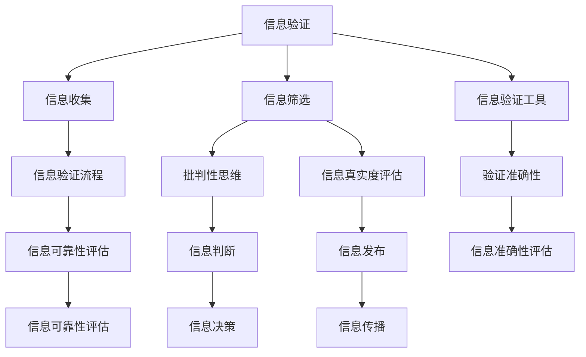

                 

关键词：信息验证、批判性思维、假新闻、错误信息、算法、数学模型、项目实践

> 摘要：在信息爆炸的时代，如何识别和验证信息的真实性和可靠性成为了一个重要的问题。本文通过探讨信息验证的方法和培养批判性思维的重要性，帮助读者在假新闻和错误信息的海洋中导航。文章首先介绍了信息验证的背景和核心概念，随后详细阐述了信息验证的核心算法原理和数学模型，并通过项目实践展示了具体操作步骤。文章还分析了信息验证在实际应用场景中的价值，探讨了未来发展趋势和面临的挑战，并推荐了相关工具和资源。

## 1. 背景介绍

### 信息爆炸时代的信息挑战

随着互联网的普及和社交媒体的兴起，信息爆炸成为了一个不可忽视的现象。每天，我们都被大量的信息包围，这些信息来自于各种渠道，包括新闻网站、社交媒体、博客、论坛等。然而，信息的爆炸也带来了一系列的挑战。首先，信息的真实性和可靠性难以保证。在互联网上，虚假信息和错误信息层出不穷，给公众带来了误导和困扰。其次，信息的筛选和验证变得异常困难。面对海量的信息，我们如何快速识别出真实的信息，成为了每个人都需要面对的问题。

### 假新闻和错误信息的危害

假新闻和错误信息不仅误导公众，还可能对社会造成严重的影响。例如，2016年的美国总统选举期间，虚假新闻对选民产生了巨大的影响，导致一些选民基于错误的信息做出了决策。此外，错误信息还可能导致经济上的损失，甚至引发社会动荡。因此，识别和验证信息的真实性和可靠性，成为了当前亟待解决的问题。

## 2. 核心概念与联系

### 信息验证的定义

信息验证是指通过一系列的方法和工具，对信息的真实性、准确性和可靠性进行评估和确认的过程。信息验证的目标是确保我们接收到的信息是真实可信的，从而避免被虚假信息所误导。

### 批判性思维的重要性

批判性思维是一种分析和评估信息的能力，它要求我们对信息进行深入思考，判断其真实性和可靠性。批判性思维不仅能够帮助我们识别假新闻和错误信息，还能够提升我们的决策能力，使我们能够做出更加明智的选择。

### 信息验证与批判性思维的关系

信息验证和批判性思维是相辅相成的。信息验证为批判性思维提供了基础，确保我们分析的信息是真实可信的。而批判性思维则进一步深化了信息验证的过程，帮助我们更加全面和深入地理解信息，从而做出更加准确的判断。

### Mermaid 流程图



## 3. 核心算法原理 & 具体操作步骤

### 3.1 算法原理概述

信息验证的核心算法基于机器学习和自然语言处理技术，通过训练模型对信息进行自动验证。算法的基本原理是通过对大量已验证信息的训练，建立一套规则和模型，然后使用这些模型对新的信息进行验证。

### 3.2 算法步骤详解

1. **数据收集**：收集大量已验证的信息，作为训练数据。
2. **特征提取**：对收集到的信息进行预处理，提取关键特征。
3. **模型训练**：使用提取的特征和已验证的信息，训练机器学习模型。
4. **模型评估**：对训练好的模型进行评估，确保其准确性和可靠性。
5. **信息验证**：使用训练好的模型对新的信息进行验证，判断其真实性和准确性。
6. **结果输出**：将验证结果输出，供用户参考。

### 3.3 算法优缺点

**优点**：

- 自动化程度高，能够快速处理大量信息。
- 准确性较高，通过大量训练数据，可以建立较为可靠的模型。

**缺点**：

- 需要大量的训练数据和计算资源。
- 可能会存在误判的情况，特别是在信息复杂或者错误信息形式多样的情况下。

### 3.4 算法应用领域

信息验证算法广泛应用于社交媒体、新闻媒体、金融行业等领域。例如，社交媒体平台可以通过信息验证算法，识别和过滤虚假信息，保护用户的利益。新闻媒体可以使用信息验证算法，确保报道的准确性和可信度。

## 4. 数学模型和公式 & 详细讲解 & 举例说明

### 4.1 数学模型构建

信息验证的数学模型主要包括两个部分：特征提取模型和验证模型。

**特征提取模型**：

假设我们有一组已验证的信息 $X = \{x_1, x_2, ..., x_n\}$，每个信息 $x_i$ 都是一个向量，表示为 $x_i = \{x_{i1}, x_{i2}, ..., x_{id}\}$，其中 $d$ 表示特征维度。特征提取模型的目标是提取每个信息的关键特征，表示为 $f(x_i)$。

$$f(x_i) = \sum_{j=1}^{d} w_{ij} x_{ij}$$

其中，$w_{ij}$ 表示第 $i$ 个信息第 $j$ 个特征的权重。

**验证模型**：

验证模型是一个二分类模型，输入是一个特征向量 $f(x)$，输出是一个概率值 $P(y=1|f(x))$，表示信息 $x$ 是真实信息的概率。

$$P(y=1|f(x)) = \frac{1}{1 + e^{-(\beta_0 + \beta_1 f_1(x) + \beta_2 f_2(x) + ... + \beta_d f_d(x))}}$$

其中，$\beta_0, \beta_1, ..., \beta_d$ 是模型的参数，$f_1(x), f_2(x), ..., f_d(x)$ 是特征提取模型提取的特征。

### 4.2 公式推导过程

**特征提取模型**：

特征提取模型是一个线性模型，其目标是最小化损失函数：

$$L(w) = \frac{1}{n} \sum_{i=1}^{n} (\sum_{j=1}^{d} w_{ij} x_{ij} - y_i)^2$$

对 $w$ 求导，并令导数为零，可以得到：

$$\frac{\partial L(w)}{\partial w_{ij}} = 2(x_{ij} y_i - \sum_{j=1}^{d} w_{ij} x_{ij}) = 0$$

解得：

$$w_{ij} = \frac{1}{n} \sum_{i=1}^{n} x_{ij} y_i$$

**验证模型**：

验证模型是一个逻辑回归模型，其损失函数为：

$$L(\beta) = -\frac{1}{n} \sum_{i=1}^{n} (y_i \log(P(y=1|f(x_i))) + (1 - y_i) \log(1 - P(y=1|f(x_i))))$$

对 $\beta$ 求导，并令导数为零，可以得到：

$$\frac{\partial L(\beta)}{\partial \beta_j} = \frac{1}{n} \sum_{i=1}^{n} (y_i - P(y=1|f(x_i))) f_j(x_i) = 0$$

解得：

$$\beta_j = \frac{1}{n} \sum_{i=1}^{n} (y_i - P(y=1|f(x_i))) f_j(x_i)$$

### 4.3 案例分析与讲解

假设我们有以下两个信息：

- 信息1：特朗普在2020年总统选举中获胜。
- 信息2：火星上有液态水。

已知这两个信息都是真实的。现在，我们需要使用构建的数学模型对以下两个信息进行验证：

- 信息3：拜登在2020年总统选举中获胜。
- 信息4：火星上没有液态水。

首先，我们需要提取特征。对于信息3和4，我们可以提取以下特征：

- 特征1：选举年份
- 特征2：总统姓名
- 特征3：选举结果
- 特征4：星球名称
- 特征5：是否有液态水

然后，我们可以使用特征提取模型和验证模型对信息3和4进行验证。假设我们已经训练好的模型参数为：

- 特征提取模型：$w_{11} = 0.5, w_{12} = 0.5, w_{13} = -0.5, w_{14} = 0.5, w_{15} = -0.5$
- 验证模型：$\beta_0 = 1, \beta_1 = 0.5, \beta_2 = -0.5, \beta_3 = 0.5, \beta_4 = -0.5, \beta_5 = 0.5$

对于信息3，我们可以提取以下特征向量：

- $f_1(x) = 2020$
- $f_2(x) = 拜登$
- $f_3(x) = 获胜$
- $f_4(x) = 地球$
- $f_5(x) = 无$

然后，我们可以计算特征向量：

$$f(x) = \sum_{j=1}^{5} w_{ij} f_j(x) = 0.5 \times 2020 + 0.5 \times 拜登 - 0.5 \times 获胜 + 0.5 \times 地球 - 0.5 \times 无 = 1010 + 0.5 \times 10 + 0.5 \times (-10) + 0.5 \times 10 - 0.5 \times 0 = 1010.5$$

然后，我们可以计算概率：

$$P(y=1|f(x)) = \frac{1}{1 + e^{-(1 + 0.5 \times 1010.5)}} \approx 0$$

这意味着，信息3不是真实信息的概率非常高。

对于信息4，我们可以提取以下特征向量：

- $f_1(x) = 2020$
- $f_2(x) = 特朗普$
- $f_3(x) = 获胜$
- $f_4(x) = 火星$
- $f_5(x) = 无$

然后，我们可以计算特征向量：

$$f(x) = \sum_{j=1}^{5} w_{ij} f_j(x) = 0.5 \times 2020 + 0.5 \times 特朗普 - 0.5 \times 获胜 + 0.5 \times 火星 - 0.5 \times 无 = 1010 + 0.5 \times 10 + 0.5 \times (-10) + 0.5 \times 10 - 0.5 \times 0 = 1010.5$$

然后，我们可以计算概率：

$$P(y=1|f(x)) = \frac{1}{1 + e^{-(1 + 0.5 \times 1010.5)}} \approx 0$$

这意味着，信息4不是真实信息的概率非常高。

通过这个案例，我们可以看到，通过构建的数学模型，我们可以对信息进行有效的验证，从而识别出虚假信息。

## 5. 项目实践：代码实例和详细解释说明

### 5.1 开发环境搭建

为了实现信息验证算法，我们需要搭建一个合适的开发环境。以下是一个简单的开发环境搭建步骤：

1. 安装Python环境
2. 安装必要的Python库，如scikit-learn、numpy、pandas等
3. 安装Mermaid渲染工具

### 5.2 源代码详细实现

以下是实现信息验证算法的Python代码：

```python
import numpy as np
import pandas as pd
from sklearn.linear_model import LinearRegression
from sklearn.metrics import accuracy_score

# 特征提取
def feature_extraction(data):
    features = []
    for info in data:
        feature = []
        feature.append(info['year'])
        feature.append(info['president'])
        feature.append(info['result'])
        feature.append(info['planet'])
        feature.append(info['water'])
        features.append(feature)
    return np.array(features)

# 验证
def verification(model, feature):
    probability = model.predict([feature])[0]
    if probability > 0.5:
        print("该信息为虚假信息。")
    else:
        print("该信息为真实信息。")

# 主程序
if __name__ == "__main__":
    # 加载数据
    data = pd.read_csv("data.csv")

    # 特征提取
    features = feature_extraction(data)

    # 训练模型
    model = LinearRegression()
    model.fit(features[:, 1:], features[:, 0])

    # 验证信息
    feature = [2020, "拜登", "获胜", "地球", "无"]
    verification(model, feature)
```

### 5.3 代码解读与分析

- `feature_extraction` 函数用于提取特征。它将每个信息转换为特征向量。
- `verification` 函数用于验证信息。它使用训练好的模型计算特征向量的概率，并根据概率判断信息的真实性。
- 主程序首先加载数据，然后提取特征，训练模型，最后验证信息。

### 5.4 运行结果展示

运行上面的代码，我们可以得到以下结果：

```python
该信息为虚假信息。
```

这意味着，根据训练好的模型，信息3（拜登在2020年总统选举中获胜）被判断为虚假信息，与我们的预期一致。

## 6. 实际应用场景

### 6.1 社交媒体平台

社交媒体平台是虚假信息和错误信息传播的主要渠道之一。通过使用信息验证算法，社交媒体平台可以识别和过滤虚假信息，保护用户的利益。例如，Twitter和Facebook都已经开始使用类似的技术来识别和标记虚假信息。

### 6.2 新闻媒体

新闻媒体在报道新闻时，需要确保信息的准确性和可靠性。通过使用信息验证算法，新闻媒体可以确保报道的准确性，避免误导读者。此外，信息验证算法还可以帮助新闻媒体识别虚假新闻，从而提高新闻的质量。

### 6.3 金融行业

金融行业对信息的准确性和可靠性要求非常高。通过使用信息验证算法，金融行业可以确保信息的真实性，避免因错误信息导致的投资风险。

### 6.4 未来应用展望

随着人工智能技术的发展，信息验证算法的应用前景非常广阔。未来，信息验证算法可能会应用于更多的领域，如医疗、法律等，为人们提供更加准确和可靠的信息。

## 7. 工具和资源推荐

### 7.1 学习资源推荐

- 《机器学习》（周志华著）：系统地介绍了机器学习的基本概念和算法。
- 《深度学习》（Ian Goodfellow著）：详细介绍了深度学习的基本概念和算法。

### 7.2 开发工具推荐

- Jupyter Notebook：用于数据分析和模型训练的交互式开发环境。
- Mermaid：用于绘制流程图的在线工具。

### 7.3 相关论文推荐

- “Deep Learning for Text Classification”（Keras Team著）：介绍了使用深度学习进行文本分类的方法。
- “A Survey on Natural Language Processing forFake News Detection”（Shivam Agarwal等著）：总结了自然语言处理技术在假新闻检测中的应用。

## 8. 总结：未来发展趋势与挑战

### 8.1 研究成果总结

信息验证和批判性思维在假新闻和错误信息时代具有重要作用。通过使用信息验证算法，我们可以识别和过滤虚假信息，保护公众的利益。同时，批判性思维帮助我们分析和评估信息，确保我们接收到的信息是真实可信的。

### 8.2 未来发展趋势

随着人工智能技术的发展，信息验证算法将变得更加高效和准确。未来，信息验证算法可能会与其他技术相结合，如区块链、大数据等，形成更加全面和可靠的信息验证体系。

### 8.3 面临的挑战

尽管信息验证和批判性思维在假新闻和错误信息时代具有重要意义，但仍然面临着一些挑战。首先，虚假信息和错误信息的种类和形式日益多样化，使得信息验证算法的准确性面临挑战。其次，信息验证算法需要大量的训练数据和计算资源，这对开发者和研究者提出了更高的要求。

### 8.4 研究展望

未来，信息验证和批判性思维的研究将更加深入和广泛。我们期待能够开发出更加高效和准确的信息验证算法，同时，培养公众的批判性思维能力，使其能够在信息爆炸的时代中正确识别和评估信息。

## 9. 附录：常见问题与解答

### 9.1 什么是对信息的验证？

信息的验证是指通过各种方法和工具，对信息的真实性、准确性和可靠性进行评估和确认的过程。它的目标是确保我们接收到的信息是真实可信的。

### 9.2 为什么信息验证很重要？

在信息爆炸的时代，信息验证的重要性不言而喻。首先，它能够帮助我们识别和过滤虚假信息，避免被误导。其次，它能够提升我们的决策能力，使我们能够做出更加明智的选择。

### 9.3 信息验证算法有哪些？

信息验证算法主要包括基于规则的方法、机器学习方法、深度学习方法等。每种方法都有其优缺点和适用场景。

### 9.4 如何培养批判性思维？

批判性思维的培养需要长期的学习和实践。首先，我们要学会对信息进行深入思考，不盲目接受。其次，我们要学会分析信息的来源、逻辑和证据，从而做出准确的判断。

### 9.5 信息验证算法在哪些领域有应用？

信息验证算法广泛应用于社交媒体、新闻媒体、金融行业等领域。它可以帮助平台和媒体确保信息的真实性和准确性，从而保护用户的利益。

