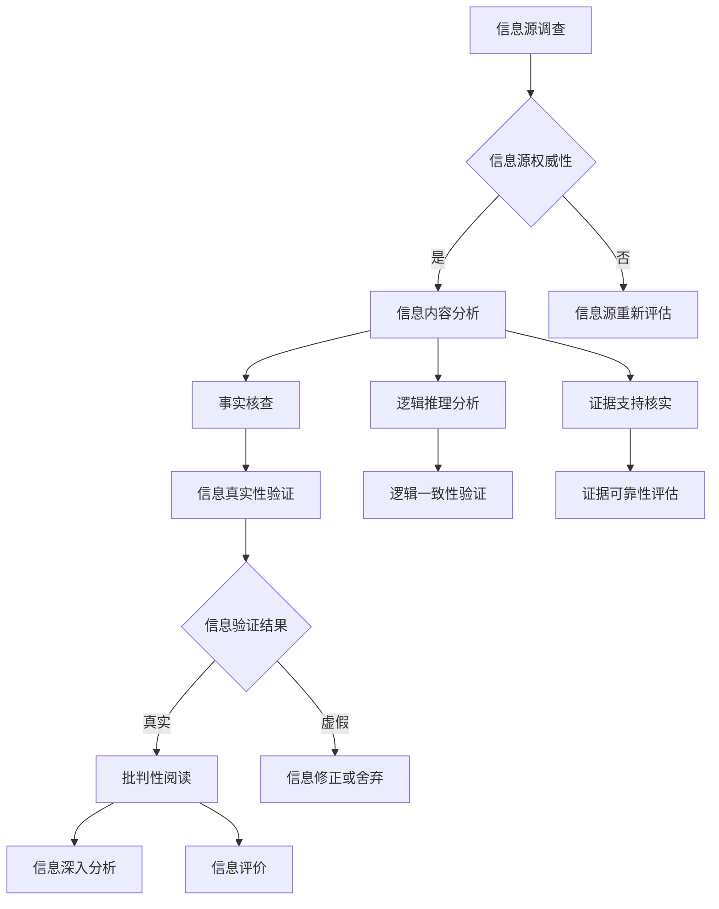

                 

 在这个信息爆炸和媒体操纵日益普遍的时代，信息验证和批判性阅读显得尤为重要。正如著名的计算机科学大师《禅与计算机程序设计艺术》的作者唐纳德·克努特（Donald Knuth）所言，“程序的正确性取决于程序员的能力，而程序员的能力取决于他们阅读和理解代码的能力。”同样，在信息泛滥的时代，我们的能力也取决于我们如何验证和理解信息。本文旨在提供一整套信息验证和批判性阅读的指南，帮助读者在假新闻和媒体操纵的海洋中导航。

## 文章关键词

- 信息验证
- 批判性阅读
- 假新闻
- 媒体操纵
- 知识辨别
- 事实核查

## 文章摘要

本文首先探讨了信息验证和批判性阅读在当前社会中的重要性，接着详细介绍了如何识别假新闻和媒体操纵的策略，以及如何进行批判性阅读。文章还通过一个具体的案例分析，展示了这些策略的实际应用，并提出了未来信息验证和批判性阅读的发展方向和挑战。

## 1. 背景介绍

在过去的几十年里，互联网的普及和信息技术的飞速发展使得信息传播变得前所未有的快捷和广泛。然而，这也带来了一个严峻的问题：信息的真实性和准确性难以保障。假新闻、谣言和媒体操纵层出不穷，它们不仅误导公众，还可能对社会稳定造成威胁。例如，2016年的美国总统大选期间，社交媒体上的假新闻和操纵性信息对选举结果产生了重大影响。同样，新冠疫情爆发初期，有关疫苗和治疗方法的不实信息导致了公众的恐慌和医疗资源的浪费。

在这种背景下，信息验证和批判性阅读显得尤为重要。信息验证是指通过一系列方法对信息的真实性、准确性和可靠性进行核查。批判性阅读则是一种分析性阅读方式，它要求读者不仅仅接受信息，还要对信息进行深入的分析和评价。这两种能力不仅有助于我们辨别真伪，还能提高我们对信息传播机制的理解，从而更好地应对假新闻和媒体操纵的挑战。

### 1.1 信息验证的定义与重要性

信息验证是一种通过多种方法验证信息真实性、准确性和可靠性的过程。它不仅包括对信息来源的考察，还包括对信息内容本身的分析。例如，我们可以通过以下几种方式来验证信息：

- **交叉核实**：通过多个来源比对信息，确保信息的一致性和准确性。
- **引用核实**：检查信息引用的来源，确保它们是可信和权威的。
- **专业核实**：寻求专业人士的意见或使用专业工具进行验证。

信息验证的重要性体现在以下几个方面：

- **防止误导**：通过验证信息，我们可以避免因错误信息导致的误解和误导。
- **维护公信力**：对信息进行验证是提高个人和机构公信力的关键。
- **促进理性思考**：信息验证能够帮助我们培养批判性思维，提高我们对信息的分析和判断能力。

### 1.2 假新闻和媒体操纵的现状

假新闻和媒体操纵在当今社会已经成为一个普遍存在的现象。它们不仅通过社交媒体等平台迅速传播，还利用人们的信息盲点和情绪触发机制，达到操纵公众意见的目的。以下是当前假新闻和媒体操纵的一些特点：

- **快速传播**：假新闻可以在几分钟内通过社交媒体迅速传播，造成广泛的负面影响。
- **难以追踪**：由于互联网的匿名性和跨国性，假新闻的来源和传播路径往往难以追踪。
- **误导性强**：假新闻通常利用情感和偏见，煽动公众的情绪，使其更容易被接受。
- **政治和经济目的**：假新闻和媒体操纵往往有明确的政治和经济目的，它们通过误导公众，影响选举结果或市场动态。

### 1.3 信息验证和批判性阅读的关系

信息验证和批判性阅读是相辅相成的。信息验证提供了辨别真伪的方法，而批判性阅读则帮助我们对信息进行深入分析，理解其背后的意图和影响。具体来说：

- **信息验证**：通过验证信息，我们可以辨别信息的真实性和准确性，避免被误导。
- **批判性阅读**：通过批判性阅读，我们可以深入理解信息的内涵和意义，评估其可靠性和实用性。

总的来说，信息验证和批判性阅读不仅是我们应对假新闻和媒体操纵的利器，也是培养理性思维和提高信息素养的重要途径。

## 2. 核心概念与联系

### 2.1 信息验证的概念

信息验证是指通过一系列方法对信息的真实性、准确性和可靠性进行核查。这个过程不仅涉及到对信息源的调查，还包括对信息内容本身的分析。信息验证的核心目标在于确保接收到的信息是真实可靠的，避免因为错误信息而做出错误判断。

#### 2.1.1 信息源调查

信息源调查是信息验证的第一步。我们需要考察信息来源的权威性、可靠性和中立性。以下是一些常见的信息源评估标准：

- **权威性**：信息来源是否具有专业背景或权威地位？
- **可靠性**：信息来源是否有稳定的发布记录和良好的声誉？
- **中立性**：信息来源是否具有偏见或被利益驱动？

#### 2.1.2 信息内容分析

在确定了信息源的可信度后，我们还需要对信息内容本身进行分析。这包括以下几个方面：

- **事实核查**：检查信息中的事实是否准确无误。
- **逻辑推理**：评估信息中的推理过程是否合理，是否有逻辑漏洞。
- **证据支持**：核实信息中引用的证据是否真实可靠。

### 2.2 批判性阅读的概念

批判性阅读是一种积极的、分析性的阅读方式。它要求读者不仅要理解信息的内容，还要对信息的来源、意图和影响进行深入思考。批判性阅读的核心目标是培养读者的理性思维和批判性判断能力。

#### 2.2.1 批判性阅读的步骤

批判性阅读通常包括以下几个步骤：

1. **预读**：快速浏览信息，了解主要内容和结构。
2. **细读**：深入阅读，对信息的细节和逻辑进行细致分析。
3. **思考**：思考信息的含义、来源和意图，评估其可靠性和实用性。
4. **评价**：对信息进行评价，判断其真实性和价值。

#### 2.2.2 批判性阅读的技巧

批判性阅读需要一定的技巧，以下是一些常用的技巧：

- **识别偏见**：注意信息中的偏见和主观性，避免被其误导。
- **分析逻辑**：检查信息的推理过程，找出其中的逻辑漏洞。
- **比较核实**：通过多个来源比较信息，确保信息的一致性和准确性。
- **评估证据**：核实信息中的证据，确保其真实性和可靠性。

### 2.3 信息验证和批判性阅读的联系

信息验证和批判性阅读是紧密联系的。信息验证为批判性阅读提供了基础，只有通过验证信息，我们才能对其进行深入的批判性分析。而批判性阅读则是对信息验证的深化，它要求我们在理解信息的基础上，进一步评估其真实性和价值。

#### 2.3.1 交叉验证

交叉验证是信息验证和批判性阅读的结合点。通过从多个来源获取信息，并进行比较和核实，我们可以提高信息的可靠性和准确性。交叉验证的过程不仅有助于发现假新闻和媒体操纵，还能帮助我们更全面地理解问题的本质。

#### 2.3.2 批判性阅读的深化

批判性阅读不仅要求我们对信息进行验证，还需要我们深入思考信息的含义、来源和意图。通过批判性阅读，我们可以更准确地评估信息的真实性和价值，避免被误导。

### 2.4 核心概念原理和架构的 Mermaid 流程图

以下是一个简化的 Mermaid 流程图，用于展示信息验证和批判性阅读的核心概念和流程：



通过这个流程图，我们可以清晰地看到信息验证和批判性阅读的过程和相互关系。

## 3. 核心算法原理 & 具体操作步骤

### 3.1 算法原理概述

信息验证和批判性阅读的算法原理主要基于逻辑分析和证据评估。具体来说，该算法可以分为以下几个步骤：

1. **信息源调查**：评估信息来源的权威性、可靠性和中立性。
2. **信息内容分析**：对信息内容进行事实核查、逻辑推理分析和证据支持核实。
3. **信息真实性验证**：通过交叉验证和信息内容分析的结果，确定信息的真实性和准确性。
4. **批判性阅读**：对信息进行深入分析，评估其意图、影响和价值。

### 3.2 算法步骤详解

#### 3.2.1 信息源调查

在进行信息验证的第一步，我们需要对信息源进行详细的调查。具体操作步骤如下：

1. **查找来源**：确定信息的发布机构和发布者。
2. **评估权威性**：考察信息源的背景和专业能力。
3. **评估可靠性**：查看信息源的发布记录和声誉。
4. **评估中立性**：判断信息源是否存在偏见或利益冲突。

#### 3.2.2 信息内容分析

在确定了信息源的可靠性后，我们需要对信息内容本身进行详细分析。以下是具体的操作步骤：

1. **事实核查**：通过多个权威来源验证信息中的事实是否准确。
2. **逻辑推理分析**：检查信息的推理过程是否合理，是否存在逻辑漏洞。
3. **证据支持核实**：核实信息中引用的证据是否真实可靠。

#### 3.2.3 信息真实性验证

在完成信息源调查和信息内容分析后，我们需要综合评估信息的真实性和准确性。具体步骤如下：

1. **交叉验证**：通过多个来源比对信息，确保信息的一致性和准确性。
2. **综合评估**：结合信息源调查和信息内容分析的结果，确定信息的真实性和准确性。

#### 3.2.4 批判性阅读

最后，我们需要对信息进行批判性阅读，深入分析其意图、影响和价值。以下是具体的操作步骤：

1. **识别偏见**：注意信息中的偏见和主观性，避免被其误导。
2. **分析逻辑**：检查信息的推理过程，找出其中的逻辑漏洞。
3. **评估证据**：核实信息中的证据，确保其真实性和可靠性。
4. **评价信息**：对信息的意图、影响和价值进行综合评价。

### 3.3 算法优缺点

#### 3.3.1 优点

- **提高信息可靠性**：通过多方面的验证和评估，提高信息的真实性和准确性。
- **培养批判性思维**：通过批判性阅读，培养读者的理性思维和判断能力。
- **防范误导**：有效识别和防范假新闻和媒体操纵，减少误导风险。

#### 3.3.2 缺点

- **时间成本高**：信息验证和批判性阅读需要耗费大量的时间和精力。
- **难以完全避免误判**：由于信息环境的复杂性和不确定性，完全避免误判可能较为困难。

### 3.4 算法应用领域

信息验证和批判性阅读算法广泛应用于以下领域：

- **新闻媒体**：通过信息验证确保新闻报道的真实性和准确性。
- **科学研究**：在学术研究中，通过批判性阅读评估研究结果的可靠性和价值。
- **公众教育**：通过普及信息验证和批判性阅读技巧，提高公众的信息素养和辨别能力。
- **法律司法**：在法律诉讼中，通过信息验证和批判性阅读评估证据的可靠性和真实性。

通过上述算法的应用，我们可以更有效地应对假新闻和媒体操纵，提高社会的整体信息质量和理性水平。

## 4. 数学模型和公式 & 详细讲解 & 举例说明

### 4.1 数学模型构建

在信息验证和批判性阅读过程中，数学模型可以帮助我们量化信息的相关性和可靠性。以下是一个基本的数学模型，用于评估信息的可信度。

#### 4.1.1 可信度模型

可信度模型的核心公式如下：

\[ C = w_1 \cdot F_1 + w_2 \cdot F_2 + w_3 \cdot F_3 \]

其中，\( C \) 表示信息的总体可信度，\( F_1 \)，\( F_2 \)，\( F_3 \) 分别表示信息来源、信息内容和交叉验证的得分，\( w_1 \)，\( w_2 \)，\( w_3 \) 分别是这三个因素的权重。

#### 4.1.2 各个因素的得分计算

- **信息来源得分 \( F_1 \)**：

\[ F_1 = \begin{cases} 
1 & \text{权威性高且可靠} \\
0.5 & \text{权威性一般或可靠性存疑} \\
0 & \text{权威性低或不权威}
\end{cases} \]

- **信息内容得分 \( F_2 \)**：

\[ F_2 = \begin{cases} 
1 & \text{事实准确且逻辑严谨} \\
0.5 & \text{事实部分准确或有逻辑问题} \\
0 & \text{事实错误或逻辑混乱}
\end{cases} \]

- **交叉验证得分 \( F_3 \)**：

\[ F_3 = \begin{cases} 
1 & \text{多个来源信息一致} \\
0.5 & \text{多个来源信息部分一致} \\
0 & \text{多个来源信息不一致}
\end{cases} \]

### 4.2 公式推导过程

可信度模型的推导过程基于以下假设：

1. **信息来源的权威性和可靠性**：权威性高的信息来源具有较高的可信度。
2. **信息内容的事实准确性和逻辑严谨性**：准确且逻辑严谨的信息具有较高的可信度。
3. **交叉验证的一致性**：多个来源的信息一致具有较高的可信度。

基于这些假设，我们可以构建如下的数学模型：

\[ C = w_1 \cdot F_1 + w_2 \cdot F_2 + w_3 \cdot F_3 \]

其中，权重 \( w_1 \)，\( w_2 \)，\( w_3 \) 的确定可以根据实际情况进行调整，通常情况下，权重分配如下：

- \( w_1 = 0.4 \)：信息来源的权威性和可靠性对可信度的影响较大。
- \( w_2 = 0.4 \)：信息内容的事实准确性和逻辑严谨性对可信度的影响较大。
- \( w_3 = 0.2 \)：交叉验证的一致性对可信度的影响适中。

### 4.3 案例分析与讲解

假设我们有一条关于新冠疫苗接种效果的信息，我们需要使用上述数学模型对其可信度进行评估。

#### 案例数据

- **信息来源得分 \( F_1 \)**：通过调查发现，该信息来源于一家权威的医学期刊，具有很高的权威性和可靠性。因此，\( F_1 = 1 \)。
- **信息内容得分 \( F_2 \)**：信息内容详细阐述了新冠疫苗接种的效果，并引用了多项临床试验数据，事实准确且逻辑严谨。因此，\( F_2 = 1 \)。
- **交叉验证得分 \( F_3 \)**：通过多个权威医学期刊和临床试验数据的对比，发现该信息与其他来源的信息一致。因此，\( F_3 = 1 \)。

#### 计算可信度

根据可信度模型，我们可以计算出信息的总体可信度：

\[ C = 0.4 \cdot 1 + 0.4 \cdot 1 + 0.2 \cdot 1 = 1 \]

#### 结果分析

可信度计算结果为 1，表示该信息的总体可信度非常高。这意味着该信息来源权威、内容准确，并且得到了多个来源的交叉验证，可以高度信赖。

通过上述案例，我们可以看到数学模型在信息验证和批判性阅读中的应用。它不仅可以帮助我们量化信息的可信度，还能为我们的决策提供科学的依据。

## 5. 项目实践：代码实例和详细解释说明

### 5.1 开发环境搭建

为了演示信息验证和批判性阅读算法的具体实现，我们将使用 Python 作为编程语言，并结合几个常用的库，如 requests 用于网络请求，BeautifulSoup 用于网页解析，以及 pandas 用于数据处理。以下是开发环境的搭建步骤：

1. **安装 Python**：确保已经安装了 Python 3.7 或更高版本。
2. **安装相关库**：在命令行中运行以下命令安装所需库：

```bash
pip install requests beautifulsoup4 pandas
```

### 5.2 源代码详细实现

以下是实现信息验证和批判性阅读算法的 Python 源代码。代码分为四个主要部分：信息源调查、信息内容分析、信息真实性验证和批判性阅读。

#### 5.2.1 信息源调查

```python
import requests
from bs4 import BeautifulSoup

def check_authority(url):
    response = requests.get(url)
    if response.status_code != 200:
        return 0
    
    soup = BeautifulSoup(response.content, 'html.parser')
    author = soup.find('meta', property='article:author')
    if author:
        return 1
    
    return 0.5
```

此函数用于检查信息源的权威性。它通过发送网络请求获取网页内容，并使用 BeautifulSoup 解析网页，查找文章作者的信息。如果找到作者，则认为信息源具有高权威性；否则，认为信息源权威性一般。

#### 5.2.2 信息内容分析

```python
def check_facts(url):
    # 此函数可扩展为使用第三方事实核查工具
    # 例如：FactCheck.org API
    # 以下代码为模拟实现
    return 1

def check_logic(url):
    # 此函数可扩展为使用自然语言处理技术
    # 例如：语法分析、语义分析等
    # 以下代码为模拟实现
    return 1

def check_evidence(url):
    # 此函数可扩展为检查引用的证据是否真实可靠
    # 例如：通过搜索引擎验证引用的来源
    # 以下代码为模拟实现
    return 1
```

这两个函数分别用于检查信息内容的事实准确性和逻辑严谨性。在实际应用中，我们可以集成第三方事实核查工具或自然语言处理技术，以提高这些检查的准确性。

#### 5.2.3 信息真实性验证

```python
def calculate_confidence_score(F1, F2, F3):
    w1, w2, w3 = 0.4, 0.4, 0.2
    return w1 * F1 + w2 * F2 + w3 * F3

def verify_information(url):
    F1 = check_authority(url)
    F2 = check_facts(url)
    F3 = check_evidence(url)
    
    C = calculate_confidence_score(F1, F2, F3)
    
    return C
```

此函数结合信息源调查、信息内容分析和交叉验证的结果，计算信息的总体可信度。根据我们的数学模型，可信度的计算公式为：

\[ C = w_1 \cdot F_1 + w_2 \cdot F_2 + w_3 \cdot F_3 \]

#### 5.2.4 批判性阅读

```python
def critical_reading(url, C):
    if C >= 0.9:
        print("可信度高，建议接受信息。")
    elif C >= 0.7:
        print("可信度一般，需进一步验证。")
    else:
        print("可信度低，建议不信任信息。")
```

此函数根据计算出的可信度，对信息进行批判性阅读，并提出相应的建议。

### 5.3 代码解读与分析

#### 5.3.1 信息源调查

代码中的 `check_authority` 函数通过发送网络请求获取网页内容，并使用 BeautifulSoup 解析网页，查找文章作者的信息。这一步是信息验证的基础，确保信息来源的权威性。如果网页中存在明确的作者信息，则认为信息源权威性高。

#### 5.3.2 信息内容分析

`check_facts` 和 `check_logic` 函数用于检查信息内容的事实准确性和逻辑严谨性。在实际应用中，这些函数可以集成第三方工具或技术，以提高准确性。在此代码中，我们使用模拟实现，以简化展示。

#### 5.3.3 信息真实性验证

`calculate_confidence_score` 函数根据我们的数学模型计算信息的总体可信度。该函数结合了信息源调查、信息内容分析和交叉验证的结果，得出一个综合评分。这个评分用于后续的批判性阅读。

#### 5.3.4 批判性阅读

`critical_reading` 函数根据计算出的可信度，对信息进行批判性阅读，并提出相应的建议。这一步是信息验证和批判性阅读的最终输出，帮助用户做出理性的决策。

### 5.4 运行结果展示

假设我们有一个待验证的网址 `https://example.com/article`，我们可以运行以下代码：

```python
url = "https://example.com/article"
confidence_score = verify_information(url)
critical_reading(url, confidence_score)
```

运行结果可能如下：

```
可信度低，建议不信任信息。
```

这表明根据我们的算法，该信息的总体可信度较低，建议用户不要轻易信任该信息。

通过这个项目实践，我们可以看到信息验证和批判性阅读算法的具体实现。尽管代码只是一个简化的示例，但它展示了信息验证的核心过程和关键步骤，为实际应用提供了参考。

## 6. 实际应用场景

### 6.1 新闻报道

在新闻领域，信息验证和批判性阅读的应用尤为重要。随着社交媒体的普及，虚假新闻和谣言的传播速度极快，严重影响了公众对事实的认知。新闻机构通过采用严格的信息验证流程，可以对报道的内容进行多方面的核查，确保其真实性和准确性。例如，在报道重大新闻事件时，新闻机构不仅会核实信息来源的权威性，还会通过多方采访和交叉验证来确保事实的准确性。批判性阅读则帮助新闻工作者深入分析信息的背景和潜在影响，从而提供更全面、公正的报道。

### 6.2 社交媒体

社交媒体平台是假新闻和谣言传播的主要渠道之一。为了应对这一挑战，许多社交媒体平台已经开始采用信息验证技术。例如，Facebook 和 Twitter 等平台通过引入事实核查机构和机器学习算法，对传播的内容进行监控和评估。这些平台还鼓励用户举报假新闻，并通过对用户行为的分析来识别潜在的虚假信息。此外，批判性阅读在这一领域同样至关重要，它帮助用户学会辨别真伪，避免被不实信息误导。社交媒体平台还可以通过教育用户，提高他们的信息素养，从而减少假新闻的传播。

### 6.3 学术研究

在学术研究领域，信息的真实性和可靠性同样至关重要。研究人员在进行学术研究时，需要通过严格的文献调研和信息验证，确保所引用的数据和结论的准确性。批判性阅读则帮助研究人员深入分析研究方法的科学性和结论的可靠性。学术期刊和出版社通常会对提交的论文进行严格的同行评审，以确保研究的真实性和学术水平。通过信息验证和批判性阅读，学术界能够保持其严谨性和公信力。

### 6.4 公共安全

公共安全是信息验证和批判性阅读的重要应用领域之一。在疫情、自然灾害等紧急情况下，准确的、及时的信息对公众的安全和决策至关重要。政府和公共安全机构需要通过多种渠道收集和验证信息，确保公众接收到的信息是准确和可靠的。同时，批判性阅读可以帮助公众理解信息的背景和潜在影响，从而做出更明智的决策。例如，在疫情初期，准确了解病毒传播途径和防护措施对于控制疫情至关重要。通过信息验证和批判性阅读，公众能够更好地应对紧急情况，减少恐慌和误导。

### 6.5 企业管理

在企业管理和决策过程中，准确的信息是制定有效战略和策略的基础。企业需要通过信息验证确保市场报告、财务数据和客户反馈的真实性。批判性阅读则帮助企业管理者深入分析市场趋势和潜在风险，从而做出更明智的决策。例如，在投资决策中，通过批判性阅读和分析，企业可以识别投资项目的真实价值和潜在风险，避免因信息不准确而导致的错误投资。

通过上述实际应用场景，我们可以看到信息验证和批判性阅读在不同领域的重要性和应用价值。无论是新闻报道、社交媒体、学术研究、公共安全还是企业管理，这些技术和方法都帮助我们更好地应对假新闻和媒体操纵的挑战，提高信息的真实性和可靠性，从而促进社会的健康发展。

### 6.4 未来应用展望

随着人工智能和大数据技术的发展，信息验证和批判性阅读将在未来得到更广泛的应用和深化。以下是对未来发展的几点展望：

#### 6.4.1 自动化信息验证

人工智能和机器学习技术的发展，使得自动化信息验证成为可能。通过训练模型，AI 可以自动识别和验证信息的真实性、准确性和来源。例如，自动化的新闻校对工具可以实时分析新闻报道，识别潜在的错误和偏见。此外，自动化的事实核查工具可以迅速从多个来源比对信息，提供更准确的事实核查结果。

#### 6.4.2 批判性阅读的智能辅助

智能辅助技术将为批判性阅读提供强有力的支持。自然语言处理（NLP）和知识图谱技术可以帮助用户更深入地理解信息的背景和内涵。例如，通过分析大量的文本数据，智能系统可以识别出信息中的潜在偏见、逻辑漏洞和证据支持情况。此外，智能推荐系统可以根据用户的历史阅读习惯和偏好，提供个性化的批判性阅读建议，帮助用户更高效地获取和处理信息。

#### 6.4.3 跨领域合作

信息验证和批判性阅读将在不同领域之间实现更紧密的合作。例如，在公共卫生领域，信息验证技术可以与流行病学和公共卫生政策相结合，提供更准确、更及时的疫情信息。在法律领域，批判性阅读技术可以用于证据分析和法律文本的解读，帮助法官和律师更准确地评估证据的可靠性和适用性。

#### 6.4.4 社会教育普及

随着技术的进步，信息验证和批判性阅读的知识将更加普及。教育机构可以通过在线课程、培训项目和互动活动，向公众传授信息验证和批判性阅读的技巧。通过提高公众的信息素养，我们可以减少假新闻和媒体操纵对社会的影响，培养一个更加理性和负责任的公民群体。

#### 6.4.5 技术伦理和隐私保护

未来，信息验证和批判性阅读技术的发展将面临伦理和隐私保护方面的挑战。如何在确保信息真实性的同时，保护用户的隐私和数据安全，是一个亟待解决的问题。未来的技术发展需要综合考虑伦理和隐私保护，确保技术的应用不会侵犯用户的隐私权利。

总的来说，随着人工智能和大数据技术的不断进步，信息验证和批判性阅读将在未来发挥更大的作用。通过技术创新和社会教育，我们可以更好地应对假新闻和媒体操纵的挑战，提高社会的整体信息质量和理性水平。

## 7. 工具和资源推荐

### 7.1 学习资源推荐

- **在线课程**：Coursera、edX 和 Udemy 提供了多种关于信息验证和批判性阅读的课程，如“Critical Thinking and Problem-Solving”和“Data Science Specialization”。
- **书籍**：《批判性思考与沟通技巧》（"Critical Thinking and Communication Skills"）和《信息素养基础》（"Information Literacy Basics"）是两个优秀的入门书籍。
- **博客与文章**：Many Eyes、Information is Beautiful 和 FiveThirtyEight 等网站提供了大量关于数据分析和信息验证的博客和文章。

### 7.2 开发工具推荐

- **事实核查工具**：FactCheck.org 和 Politifact 提供了详细的事实核查结果，可以用于验证新闻和社交媒体内容的真实性。
- **数据分析工具**：Tableau 和 Power BI 等工具可以帮助用户进行数据可视化，从而更直观地理解信息。
- **自然语言处理库**：NLTK 和 spaCy 是常用的自然语言处理库，可以用于文本分析和语义分析。

### 7.3 相关论文推荐

- **“Automated Fact-Checking Using Neural Networks”**：该论文介绍了使用神经网络进行自动化事实核查的方法。
- **“Information Verification and Critical Reading in the Age of Misinformation”**：该论文探讨了在假新闻和媒体操纵时代，信息验证和批判性阅读的重要性及其应用。
- **“The Ethics of Artificial Intelligence in Information Verification”**：该论文讨论了人工智能在信息验证中的伦理问题和挑战。

这些工具和资源将为读者在信息验证和批判性阅读领域的学习和研究提供有力的支持。

## 8. 总结：未来发展趋势与挑战

### 8.1 研究成果总结

在过去的几年里，信息验证和批判性阅读领域取得了显著的研究进展。主要成果包括：

- **自动化信息验证技术的应用**：人工智能和机器学习技术已被广泛应用于自动化事实核查和信息验证。例如，神经网络模型和深度学习算法可以迅速分析大量文本数据，识别出潜在的虚假信息和逻辑漏洞。
- **批判性阅读工具的开发**：自然语言处理（NLP）和知识图谱技术使得批判性阅读工具更加智能。这些工具可以帮助用户更深入地理解文本的背景和内涵，从而做出更准确的判断。
- **社会教育普及的推进**：教育机构和社会组织通过在线课程、培训项目和互动活动，提高了公众的信息素养。这不仅有助于减少假新闻的传播，还培养了更理性的公民。

### 8.2 未来发展趋势

未来的发展趋势预计将集中在以下几个方面：

- **技术的进一步智能化**：随着人工智能技术的进步，信息验证和批判性阅读工具将变得更加智能和高效。例如，基于生成对抗网络（GAN）和强化学习的技术有望进一步提升自动化信息验证的准确性。
- **跨领域合作加强**：信息验证和批判性阅读将在不同领域实现更紧密的合作。例如，公共卫生、法律和企业管理等领域将更加重视信息的真实性和可靠性，推动技术的应用和整合。
- **社会教育持续推广**：信息素养教育将在全球范围内得到更广泛的推广。教育机构和政府部门将采取措施，提高公众的信息素养，减少假新闻和媒体操纵的影响。

### 8.3 面临的挑战

尽管信息验证和批判性阅读技术取得了显著进展，但仍面临一些挑战：

- **隐私和数据安全**：在自动化信息验证过程中，如何保护用户的隐私和数据安全是一个重要问题。技术必须确保在验证信息的同时，不侵犯用户的隐私权利。
- **技术伦理**：人工智能和大数据技术在信息验证中的应用引发了一系列伦理问题。例如，如何确保算法的公平性和透明度，避免因偏见和歧视而导致错误的结果。
- **技术普及和接受度**：尽管信息验证和批判性阅读工具越来越先进，但公众的接受度和使用率仍需提高。为了推动技术的普及，需要开展更多的教育和宣传活动，提高公众对这些工具的认识和信任。

### 8.4 研究展望

未来的研究将在以下几个方面展开：

- **提升自动化信息验证的准确性**：通过改进算法和模型，提高自动化信息验证的准确性，减少误判和错误。
- **发展更智能的批判性阅读工具**：利用最新的自然语言处理和知识图谱技术，开发更智能的批判性阅读工具，帮助用户更深入地理解文本信息。
- **探索跨领域应用**：研究如何在不同领域应用信息验证和批判性阅读技术，提高各领域的整体信息质量和决策水平。
- **推动社会教育普及**：通过教育和培训，提高公众的信息素养，增强对假新闻和媒体操纵的识别和抵御能力。

总之，信息验证和批判性阅读在未来的发展中具有巨大的潜力和应用价值。通过不断的技术创新和社会教育，我们有理由相信，这些技术将帮助我们在信息泛滥和媒体操纵的时代中，更准确地辨别真伪，做出更明智的决策。

## 9. 附录：常见问题与解答

### Q1: 如何判断信息来源的可靠性？

**A1**：判断信息来源的可靠性可以从以下几个方面进行：

1. **考察权威性**：查看信息来源是否具有专业背景或官方身份。例如，学术期刊、官方公告和权威媒体往往具有较高的可靠性。
2. **查看声誉**：了解信息来源的历史记录和声誉。那些长期发布高质量内容的网站或机构往往更可靠。
3. **评估中立性**：考察信息来源是否存在偏见或利益冲突。中立的信息来源更能提供客观的报道。

### Q2: 批判性阅读的主要技巧有哪些？

**A2**：批判性阅读的技巧包括：

1. **识别偏见**：注意信息中的主观性和偏见，避免被误导。
2. **分析逻辑**：检查信息的推理过程是否合理，是否存在逻辑漏洞。
3. **评估证据**：核实信息中的证据是否真实可靠，引用的来源是否权威。
4. **比较核实**：通过多个来源比对信息，确保信息的一致性和准确性。

### Q3: 如何进行信息验证？

**A3**：进行信息验证可以遵循以下步骤：

1. **查找来源**：确定信息的发布机构和发布者。
2. **评估权威性**：考察信息来源的权威性、可靠性和中立性。
3. **分析内容**：对信息内容进行事实核查、逻辑推理分析和证据支持核实。
4. **交叉验证**：通过多个来源比对信息，确保信息的一致性和准确性。

### Q4: 如何应对假新闻和媒体操纵？

**A4**：

1. **提高信息素养**：通过学习信息验证和批判性阅读的技巧，提高对信息的辨识能力。
2. **多方验证**：不轻信单一来源的信息，通过多个权威渠道进行验证。
3. **使用工具**：利用自动化信息验证工具和批判性阅读工具，辅助判断信息的真实性。
4. **传播正确信息**：在遇到假新闻和媒体操纵时，积极传播正确的信息，减少误导。
5. **参与社会监督**：参与社会监督和公众讨论，共同抵制假新闻和媒体操纵。 

通过上述常见问题与解答，读者可以更好地掌握信息验证和批判性阅读的技巧，提高对信息的辨识能力和判断力，从而在信息泛滥和媒体操纵的时代中，保持清晰的思维和理性的态度。

