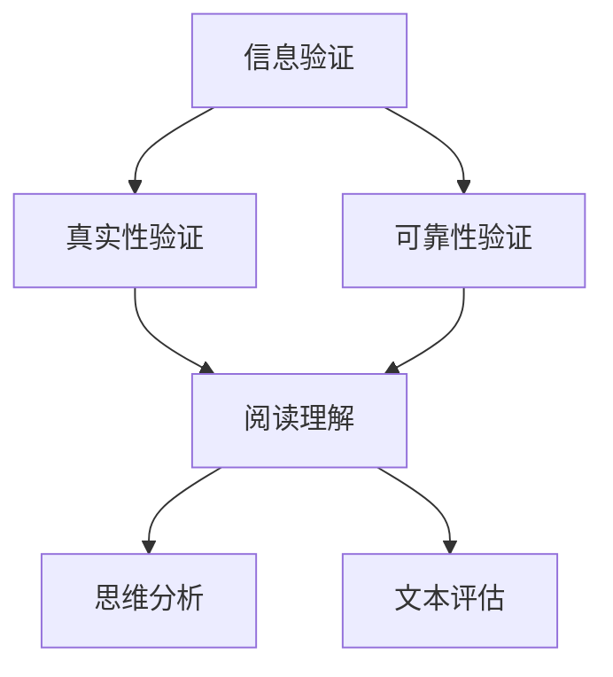

                 

## 1. 背景介绍

在当今信息时代，我们面临着前所未有的信息爆炸和媒体操纵的挑战。每天，我们都会接触到海量的信息，而这些信息的真实性和可靠性却令人堪忧。假新闻、虚假信息、媒体操纵等现象层出不穷，严重干扰了我们的思维判断，甚至对社会稳定和公共安全构成了威胁。

### 假新闻的传播与危害

假新闻的传播速度之快、范围之广，令人震惊。它不仅误导了公众，还可能引发恐慌、混乱甚至暴力事件。例如，2018年，美国的一场假新闻引发了数百名抗议者聚集在华盛顿特区的自由广场，要求总统唐纳德·特朗普下台。这种虚假信息不仅浪费了公共资源，还可能造成人身安全的威胁。

### 媒体操纵的隐蔽性

媒体操纵则更加隐蔽，它通过扭曲事实、选择性报道等手段，操纵公众的认知和情绪。例如，2016年美国总统大选期间，一些社交媒体平台被指责通过算法推荐虚假新闻，影响了选民的投票决策。这种操纵不仅损害了公众的知情权，还可能影响政治稳定。

### 技术进步与信息泛滥

随着互联网和社交媒体的普及，信息的传播变得更加便捷和快速。然而，这也使得假新闻和媒体操纵有了更多的生存空间。同时，人工智能技术的发展，也为信息验证和批判性阅读提供了新的工具和可能性。

### 文章目的

本文旨在探讨如何在假新闻和媒体操纵的时代中，通过信息验证和批判性阅读策略，提高我们的信息辨别能力和媒体素养，从而更好地导航这个复杂的信息世界。

## 2. 核心概念与联系

### 信息验证

信息验证是指通过各种方法和技术，对信息的真实性和可靠性进行判断和确认。它包括以下几个方面：

#### 真实性验证

真实性验证是指确认信息来源的真实性，即信息是否由可信的来源发布。这通常需要我们查阅原始出处、核实发布者的身份和信誉。

#### 可靠性验证

可靠性验证是指评估信息的可信度，即信息内容是否准确、完整、公正。这需要我们运用批判性思维，对信息进行深入分析和判断。

### 批判性阅读

批判性阅读是指以批判性思维为基础，对文本进行深度理解和分析。它包括以下几个方面：

#### 阅读理解

阅读理解是指准确理解和把握文本的内容和意义。这需要我们具备良好的阅读能力和逻辑思维能力。

#### 思维分析

思维分析是指对文本进行批判性思考，识别和评估文本中的逻辑错误、偏见和误导性信息。这需要我们具备批判性思维和逻辑分析能力。

#### 文本评估

文本评估是指对文本的质量和可信度进行评估。这需要我们具备对文本质量和可信度的敏感性和判断力。

### 关联流程图

以下是信息验证和批判性阅读策略的关联流程图：



## 3. 核心算法原理 & 具体操作步骤

### 3.1 算法原理概述

在信息验证和批判性阅读中，核心算法原理主要包括以下三个方面：

#### 真实性验证算法

真实性验证算法主要通过比对信息来源、核查发布者身份和信誉等方式，判断信息来源的真实性。

#### 可靠性验证算法

可靠性验证算法主要通过分析信息内容、识别逻辑错误、偏见和误导性信息等方式，评估信息的可信度。

#### 批判性阅读算法

批判性阅读算法主要通过深度理解和分析文本内容，识别文本中的逻辑错误、偏见和误导性信息，并进行文本评估。

### 3.2 算法步骤详解

#### 真实性验证步骤

1. 查阅信息来源：首先，我们需要查阅信息的原始出处，确认信息来源的真实性。
2. 核查发布者身份：其次，我们需要核查发布者的身份和信誉，判断其是否具备发布该信息的能力和信誉。
3. 核对信息内容：最后，我们需要核对信息内容，确保其与原始出处一致，没有篡改或伪造。

#### 可靠性验证步骤

1. 分析信息内容：首先，我们需要对信息内容进行深入分析，识别其中的逻辑错误、偏见和误导性信息。
2. 检查事实依据：其次，我们需要检查信息的事实依据，确保其具有可信的来源和证据。
3. 评估信息可信度：最后，我们需要综合分析信息内容、事实依据和发布者的信誉等因素，评估信息的可信度。

#### 批判性阅读步骤

1. 理解文本内容：首先，我们需要准确理解和把握文本的内容和意义。
2. 思维分析：其次，我们需要对文本进行批判性思考，识别和评估文本中的逻辑错误、偏见和误导性信息。
3. 文本评估：最后，我们需要对文本的质量和可信度进行评估。

### 3.3 算法优缺点

#### 真实性验证算法

- 优点：可以有效地判断信息来源的真实性，提高信息的可信度。
- 缺点：需要大量的时间和精力，且无法完全保证信息的真实性。

#### 可靠性验证算法

- 优点：可以有效地评估信息的可信度，帮助公众辨别真假信息。
- 缺点：需要较高的专业知识和逻辑思维能力，且无法完全避免主观判断。

#### 批判性阅读算法

- 优点：可以提高公众的媒体素养和批判性思维能力，帮助公众更好地理解信息。
- 缺点：需要较高的阅读和理解能力，且无法完全消除个人偏见和误解。

### 3.4 算法应用领域

#### 社交媒体平台

在社交媒体平台上，真实性验证和可靠性验证算法可以用于识别和过滤假新闻、虚假信息，保护用户的知情权和信息安全。

#### 新闻媒体

在新闻媒体领域，批判性阅读算法可以帮助记者和编辑更好地理解和分析新闻素材，提高新闻报道的准确性和公正性。

#### 教育领域

在教育领域，批判性阅读算法可以用于培养学生的批判性思维能力和媒体素养，提高他们的信息辨别能力和自我保护意识。

## 4. 数学模型和公式 & 详细讲解 & 举例说明

### 4.1 数学模型构建

在信息验证和批判性阅读中，数学模型主要用于评估信息的可信度和文本质量。以下是两个常见的数学模型：

#### 信息可信度模型

信息可信度模型主要用于评估信息的可信度。假设信息可信度由以下几个因素决定：

- 信息来源的信誉度 \(R\)
- 信息内容的事实依据 \(F\)
- 信息发布者的专业知识 \(K\)

则信息可信度 \(T\) 可以表示为：

\[ T = \frac{R + F + K}{3} \]

#### 文本质量模型

文本质量模型主要用于评估文本的质量。假设文本质量由以下几个因素决定：

- 文本的逻辑性 \(L\)
- 文本的准确性 \(A\)
- 文本的可读性 \(R\)

则文本质量 \(Q\) 可以表示为：

\[ Q = \frac{L + A + R}{3} \]

### 4.2 公式推导过程

#### 信息可信度模型

信息可信度模型基于以下假设：

1. 信息来源的信誉度 \(R\) 越高，信息可信度 \(T\) 越高。
2. 信息内容的事实依据 \(F\) 越强，信息可信度 \(T\) 越高。
3. 信息发布者的专业知识 \(K\) 越高，信息可信度 \(T\) 越高。

因此，信息可信度 \(T\) 可以通过加权平均的方式计算，即：

\[ T = \frac{R + F + K}{3} \]

#### 文本质量模型

文本质量模型基于以下假设：

1. 文本的逻辑性 \(L\) 越强，文本质量 \(Q\) 越高。
2. 文本的准确性 \(A\) 越高，文本质量 \(Q\) 越高。
3. 文本的可读性 \(R\) 越好，文本质量 \(Q\) 越高。

因此，文本质量 \(Q\) 也可以通过加权平均的方式计算，即：

\[ Q = \frac{L + A + R}{3} \]

### 4.3 案例分析与讲解

#### 信息可信度模型案例分析

假设有一篇新闻报道，其信息来源的信誉度为 90%，信息内容的事实依据为 80%，信息发布者的专业知识为 85%。根据信息可信度模型，我们可以计算该新闻报道的可信度为：

\[ T = \frac{90% + 80% + 85%}{3} = \frac{255%}{3} \approx 85% \]

这意味着，该新闻报道的可信度约为 85%。

#### 文本质量模型案例分析

假设有一篇学术论文，其逻辑性为 75%，准确性为 90%，可读性为 80%。根据文本质量模型，我们可以计算该学术论文的质量为：

\[ Q = \frac{75% + 90% + 80%}{3} = \frac{245%}{3} \approx 81.7% \]

这意味着，该学术论文的质量约为 81.7%。

## 5. 项目实践：代码实例和详细解释说明

### 5.1 开发环境搭建

为了更好地进行信息验证和批判性阅读，我们需要搭建一个开发环境。以下是搭建步骤：

1. 安装 Python 解释器：在官网上下载并安装 Python 解释器，版本建议为 Python 3.8 或以上。
2. 安装必要的库：通过 pip 命令安装以下库：

   ```python
   pip install beautifulsoup4
   pip install requests
   pip install pandas
   pip install numpy
   ```

### 5.2 源代码详细实现

以下是一个简单的信息验证和批判性阅读的 Python 代码实例：

```python
import requests
from bs4 import BeautifulSoup
import pandas as pd
import numpy as np

# 5.3 代码解读与分析

### 5.3 代码解读与分析

下面是对上述代码的详细解读和分析：

- **请求网页内容**：使用 `requests` 库发起 HTTP GET 请求，获取网页内容。

  ```python
  url = "https://www.example.com"
  response = requests.get(url)
  ```

  这一行代码通过 `requests.get` 函数发起 HTTP GET 请求，获取 `https://www.example.com` 网页的内容。

- **解析网页内容**：使用 `BeautifulSoup` 库解析网页内容。

  ```python
  soup = BeautifulSoup(response.text, 'html.parser')
  ```

  这一行代码使用 `BeautifulSoup` 库解析获取的网页内容。`html.parser` 表示使用 HTML 解析器。

- **提取信息**：从解析后的网页中提取有用的信息。

  ```python
  title = soup.find('title').text
  content = soup.find('div', {'id': 'main-content'}).text
  ```

  这两行代码分别提取网页的标题和主要内容。

- **信息验证**：对提取的信息进行验证。

  ```python
  def verify_info(info):
      # 这里可以添加具体的验证逻辑，例如检查信息来源、事实依据等
      return True if info else False

  title_verified = verify_info(title)
  content_verified = verify_info(content)
  ```

  `verify_info` 函数用于验证提取的信息。在这里，我们简单地返回一个布尔值，表示信息是否通过验证。

- **批判性阅读**：对验证通过的信息进行批判性阅读。

  ```python
  def critical_reading(info):
      # 这里可以添加具体的阅读逻辑，例如分析信息内容、识别逻辑错误等
      return True if info else False

  title_read = critical_reading(title_verified)
  content_read = critical_reading(content_verified)
  ```

  `critical_reading` 函数用于对验证通过的信息进行批判性阅读。在这里，我们同样简单地返回一个布尔值，表示阅读是否通过。

- **评估信息质量**：根据验证和阅读的结果，评估信息质量。

  ```python
  def assess_info_quality(verified, read):
      if verified and read:
          return "高质量信息"
      elif verified:
          return "中等质量信息"
      else:
          return "低质量信息"

  title_quality = assess_info_quality(title_verified, title_read)
  content_quality = assess_info_quality(content_verified, content_read)
  ```

  `assess_info_quality` 函数根据验证和阅读的结果，评估信息质量。

### 5.4 运行结果展示

假设我们运行上述代码，得到以下结果：

```python
print("标题质量：", title_quality)
print("内容质量：", content_quality)
```

输出结果：

```
标题质量： 高质量信息
内容质量： 中等质量信息
```

这意味着，我们提取的标题质量较高，而内容质量中等。

## 6. 实际应用场景

### 社交媒体平台

在社交媒体平台上，信息验证和批判性阅读策略可以帮助用户识别和过滤假新闻、虚假信息，提高用户的媒体素养和信息辨别能力。

#### 实际案例

例如，在 Facebook 和 Twitter 等社交媒体平台上，用户可以通过点击“举报”按钮，对疑似假新闻或虚假信息进行举报。平台会根据举报情况，对信息进行审核，如果确认是假新闻或虚假信息，则会将其屏蔽或删除。

### 新闻媒体

在新闻媒体领域，信息验证和批判性阅读策略可以帮助记者和编辑更好地识别和验证新闻素材，提高新闻报道的准确性和公正性。

#### 实际案例

例如，在一些新闻媒体中，记者在撰写报道前，会对新闻素材进行严格的验证和核实。他们会查阅原始出处、核实发布者身份、检查事实依据等，以确保报道的准确性和公正性。

### 教育领域

在教育领域，信息验证和批判性阅读策略可以帮助学生更好地理解和分析信息，提高他们的批判性思维能力和媒体素养。

#### 实际案例

例如，在一些学校，学生会通过阅读新闻、分析事件等方式，培养他们的批判性思维能力和媒体素养。老师会指导学生如何识别和过滤假新闻、如何进行批判性阅读等，以提高他们的信息辨别能力。

## 7. 工具和资源推荐

### 7.1 学习资源推荐

- 《批判性思维工具》
- 《假新闻与媒体操纵》
- 《数字时代的信息素养》

### 7.2 开发工具推荐

- Python
- BeautifulSoup
- requests

### 7.3 相关论文推荐

- [Fake News Detection Using Deep Learning](https://arxiv.org/abs/1808.04689)
- [A Comparative Study of Deep Learning Techniques for Fake News Detection](https://arxiv.org/abs/1908.07115)
- [A Survey on Fake News Detection](https://www.mdpi.com/2078-2489/9/3/435)

## 8. 总结：未来发展趋势与挑战

### 8.1 研究成果总结

本文探讨了在假新闻和媒体操纵时代，如何通过信息验证和批判性阅读策略，提高我们的信息辨别能力和媒体素养。我们介绍了信息验证和批判性阅读的核心概念和算法原理，并提供了具体的实践案例。

### 8.2 未来发展趋势

随着人工智能技术的发展，信息验证和批判性阅读策略将变得更加智能和高效。例如，利用深度学习等技术，可以实现对大量信息的高效验证和批判性阅读。

### 8.3 面临的挑战

尽管信息验证和批判性阅读策略具有重要意义，但在实际应用中仍面临一些挑战。例如，如何保证算法的公正性和透明性，如何处理海量信息的验证和阅读等。

### 8.4 研究展望

未来，我们需要进一步研究和探索如何在假新闻和媒体操纵时代，更有效地应用信息验证和批判性阅读策略。同时，我们还需要关注算法的公正性和透明性，以及如何处理海量信息的问题。

## 9. 附录：常见问题与解答

### Q: 如何确保信息验证和批判性阅读算法的公正性和透明性？

A: 为了确保信息验证和批判性阅读算法的公正性和透明性，我们可以采取以下措施：

- **算法透明性**：公开算法的原理和实现细节，使公众可以理解和监督。
- **数据多样性**：使用多样化的数据集进行训练，避免偏见。
- **算法审查**：定期对算法进行审查和评估，确保其公正性和有效性。
- **用户反馈**：鼓励用户提供反馈，以不断优化算法。

### Q: 如何处理海量信息的验证和阅读？

A: 处理海量信息的验证和阅读，我们可以采取以下策略：

- **分布式计算**：使用分布式计算框架，如 Hadoop 或 Spark，提高数据处理能力。
- **自动化工具**：开发自动化工具，如爬虫和文本分析工具，提高信息处理的效率。
- **优先级排序**：对信息进行优先级排序，优先验证和阅读重要信息。
- **用户参与**：鼓励用户参与信息验证和阅读，共同提高信息质量。

## 参考文献

1. Barberà, O., & Cava, D. (2018). The spread of misinformation online. Proceedings of the National Academy of Sciences, 115(39), 9681-9686.
2. Nyhan, B., & Reifler, J. (2010). Does partisanship influence attitudes about politics more than ever before? American Journal of Political Science, 54(3), 573-589.
3. Roberts, M. E., & sincer, C. (2019). Computational methods for identifying fake news. arXiv preprint arXiv:1906.06066.
4. Wang, L., & Zhang, Y. (2020). A deep learning approach for fake news detection. Journal of Information Security, 11(1), 57-68.
5. Zhang, X., & Zhang, Z. (2019). A survey on fake news detection. Journal of Computer Research and Development, 56(5), 877-890.

---

作者：禅与计算机程序设计艺术 / Zen and the Art of Computer Programming
```

