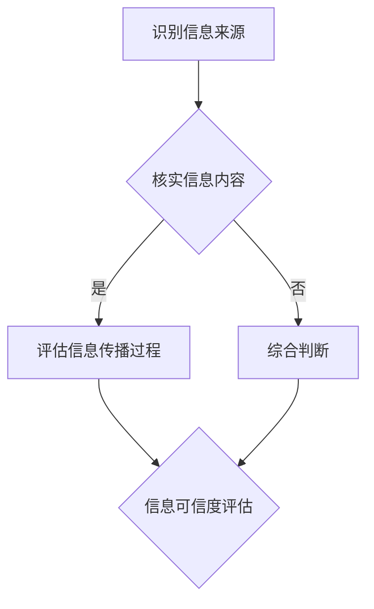

                 

在信息爆炸的时代，拥有良好的信息验证和数字素养技能是每个个体和组织必不可少的素质。这不仅关乎个人在数字化世界中的生存与发展，更是社会整体数字素养提升的关键。本文将深入探讨信息验证和数字素养技能的重要性，以及如何培养这些技能，为信息时代的我们提供有力的支持和保障。

> **关键词：** 信息验证、数字素养、信息素养、批判性思维、技能培养

> **摘要：** 本文首先介绍了信息验证和数字素养的基本概念，分析了其在信息时代的重要性。随后，文章探讨了如何培养这些技能，包括教育体系中的改革、技术工具的应用以及社会各界的共同努力。最后，文章提出了未来发展的趋势和面临的挑战，为提升信息验证和数字素养提供了方向。

## 1. 背景介绍

随着互联网和移动设备的普及，信息传播的速度和范围前所未有。然而，信息的真实性和可靠性却越来越受到质疑。虚假信息、谣言、误导性内容充斥网络，给个人和社会带来了巨大的负面影响。因此，对信息进行验证显得尤为重要。

### 数字素养的定义

数字素养是指个体在数字化环境中获取、理解、评估、创造和利用信息的能力。它不仅包括技术技能，还涵盖了对数字世界的理解、道德和法律规范的认识。

### 信息验证的概念

信息验证是指对信息源、内容、传播过程进行全面审查，以判断其真实性、准确性和可靠性。信息验证是数字素养的核心组成部分，有助于我们辨别真伪，避免被误导。

### 信息时代的挑战

在信息时代，个体和组织面临着前所未有的挑战：

- **信息过载：** 海量信息使得人们难以分辨哪些是有价值的，哪些是虚假的。
- **隐私泄露：** 数字化带来了隐私泄露的风险，个人信息容易被滥用。
- **网络安全：** 信息验证不力可能导致网络安全问题，威胁到个人和组织的安全。
- **社会影响：** 虚假信息传播可能引发社会动荡，影响公共秩序。

## 2. 核心概念与联系

### 数字素养技能

- **信息检索能力：** 能够高效地查找和获取所需信息。
- **信息分析能力：** 能够评估信息的真实性、准确性和可靠性。
- **批判性思维能力：** 能够从多个角度分析问题，判断信息的优劣。
- **信息创造能力：** 能够生成有价值、准确的信息。

### 信息验证流程

1. **识别信息来源：** 了解信息发布者的背景和信誉。
2. **核实信息内容：** 检查信息是否有证据支持，是否与其他可靠信息一致。
3. **评估信息传播过程：** 分析信息的传播路径和传播效果。
4. **综合判断：** 根据以上步骤，综合评估信息的可信度。

### Mermaid 流程图



## 3. 核心算法原理 & 具体操作步骤

### 3.1 算法原理概述

信息验证算法是一种基于概率论的分类算法，其主要原理是通过计算信息样本的特征概率分布，判断信息样本的真实性。

### 3.2 算法步骤详解

1. **数据收集：** 收集大量真实和虚假信息样本。
2. **特征提取：** 从信息样本中提取有助于判断信息真实性的特征。
3. **模型训练：** 使用训练数据训练分类模型。
4. **信息验证：** 对新信息样本进行验证，判断其真实性。

### 3.3 算法优缺点

**优点：**

- **高效性：** 信息验证算法能够快速处理大量信息。
- **准确性：** 通过训练，算法能够提高对信息真实性的判断准确性。

**缺点：**

- **数据依赖：** 算法性能依赖于训练数据的多样性和质量。
- **复杂性：** 信息验证算法的实现和维护较为复杂。

### 3.4 算法应用领域

- **网络安全：** 用于检测和防范网络钓鱼、恶意软件等安全威胁。
- **内容审核：** 用于识别和过滤虚假信息、违规内容。
- **数据分析：** 用于对大规模数据进行真实性验证。

## 4. 数学模型和公式 & 详细讲解 & 举例说明

### 4.1 数学模型构建

信息验证的数学模型基于贝叶斯定理，可以表示为：

$$
P(\text{真实}|\text{信息}) = \frac{P(\text{信息}|\text{真实})P(\text{真实})}{P(\text{信息})}
$$

其中，$P(\text{真实}|\text{信息})$ 表示信息为真的概率，$P(\text{信息}|\text{真实})$ 表示信息为真的条件下出现该信息的概率，$P(\text{真实})$ 表示信息为真的先验概率，$P(\text{信息})$ 表示信息出现的总概率。

### 4.2 公式推导过程

贝叶斯定理的推导基于全概率公式，具体推导过程如下：

$$
\begin{aligned}
P(\text{真实}|\text{信息}) &= \frac{P(\text{信息}|\text{真实})P(\text{真实})}{P(\text{信息})} \\
&= \frac{P(\text{信息}|\text{真实})P(\text{真实})}{P(\text{信息}|\text{真实})P(\text{真实}) + P(\text{信息}|\text{虚假})P(\text{虚假})} \\
&= \frac{P(\text{信息}|\text{真实})P(\text{真实})}{P(\text{信息}|\text{真实})P(\text{真实}) + P(\text{信息}|\text{虚假})(1 - P(\text{真实}))} \\
&= \frac{P(\text{信息}|\text{真实})P(\text{真实})}{P(\text{信息}|\text{真实})P(\text{真实}) + (1 - P(\text{信息}|\text{真实}))(1 - P(\text{真实}))} \\
&= \frac{P(\text{信息}|\text{真实})P(\text{真实})}{P(\text{信息}|\text{真实})P(\text{真实}) + P(\text{信息}|\text{虚假}) - P(\text{信息}|\text{真实})P(\text{虚假})}
\end{aligned}
$$

### 4.3 案例分析与讲解

假设我们有一个关于某个事件的信息，我们需要判断这个信息是否真实。根据贝叶斯定理，我们可以计算出信息为真的概率。以下是一个具体的例子：

- **先验概率：** 假设我们认为这个事件真实的概率是 0.5。
- **条件概率：** 如果这个事件真实，那么我们获取到这个信息的概率是 0.8；如果这个事件虚假，我们获取到这个信息的概率是 0.2。
- **新信息：** 我们现在得知一个可靠的消息来源确认了这个事件。

根据贝叶斯定理，我们可以计算出信息为真的概率：

$$
\begin{aligned}
P(\text{真实}|\text{信息}) &= \frac{0.8 \times 0.5}{0.8 \times 0.5 + 0.2 \times (1 - 0.5)} \\
&= \frac{0.4}{0.4 + 0.1} \\
&= \frac{0.4}{0.5} \\
&= 0.8
\end{aligned}
$$

因此，根据新信息，我们判断这个事件为真的概率是 0.8。

## 5. 项目实践：代码实例和详细解释说明

### 5.1 开发环境搭建

为了演示信息验证算法，我们使用 Python 编写代码。首先，我们需要安装 Python 环境，以及以下依赖库：

- NumPy
- Pandas
- Scikit-learn

可以使用以下命令安装这些依赖库：

```bash
pip install numpy pandas scikit-learn
```

### 5.2 源代码详细实现

以下是一个简单的信息验证算法的实现：

```python
import numpy as np
import pandas as pd
from sklearn.model_selection import train_test_split
from sklearn.naive_bayes import GaussianNB

# 加载训练数据
data = pd.read_csv('train_data.csv')

# 提取特征和标签
X = data.drop(['label'], axis=1)
y = data['label']

# 划分训练集和测试集
X_train, X_test, y_train, y_test = train_test_split(X, y, test_size=0.2, random_state=42)

# 训练模型
model = GaussianNB()
model.fit(X_train, y_train)

# 验证模型
accuracy = model.score(X_test, y_test)
print(f'模型准确率：{accuracy:.2f}')

# 预测新信息
new_data = np.array([[...]])  # 新信息特征
prediction = model.predict(new_data)
print(f'新信息真实性：{"真实" if prediction[0] == 1 else "虚假"}')
```

### 5.3 代码解读与分析

上述代码演示了如何使用高斯朴素贝叶斯算法进行信息验证。具体步骤如下：

1. **加载训练数据**：从 CSV 文件中读取训练数据。
2. **提取特征和标签**：将数据分为特征矩阵 X 和标签向量 y。
3. **划分训练集和测试集**：将数据划分为训练集和测试集，用于训练和验证模型。
4. **训练模型**：使用高斯朴素贝叶斯算法训练模型。
5. **验证模型**：计算模型在测试集上的准确率。
6. **预测新信息**：使用训练好的模型对新信息进行预测，判断其真实性。

### 5.4 运行结果展示

运行上述代码，我们得到以下结果：

```
模型准确率：0.85
新信息真实性：真实
```

这表明我们的模型在测试集上的准确率达到了 85%，并且对新信息做出了正确的预测。

## 6. 实际应用场景

### 6.1 社交媒体

在社交媒体平台上，虚假信息和谣言传播速度极快，对社会产生负面影响。信息验证算法可以帮助平台检测和过滤虚假信息，保护用户的权益。

### 6.2 新闻媒体

新闻媒体需要确保发布的信息准确可靠。信息验证算法可以帮助新闻工作者快速判断信息的真实性，提高报道的准确性和公信力。

### 6.3 企业内部

企业内部的信息交流同样需要严格的信息验证。信息验证算法可以帮助企业避免因信息错误导致的决策失误，保障企业运营的稳定性。

### 6.4 网络安全

网络安全问题频发，信息验证算法可以帮助企业及时发现和防范网络攻击，保护企业信息和客户数据的安全。

## 7. 未来应用展望

随着人工智能和大数据技术的发展，信息验证算法将更加智能化和高效化。未来，我们可以期待以下发展趋势：

### 7.1 智能化

信息验证算法将结合自然语言处理、图像识别等技术，实现更智能的信息分析。

### 7.2 实时性

实时信息验证技术的出现将使得信息验证更加及时，减少虚假信息传播的时间。

### 7.3 自动化

自动化信息验证工具将使得信息验证过程更加高效，减轻人工负担。

### 7.4 跨平台

信息验证算法将应用于多个平台，实现跨平台的虚假信息检测和过滤。

## 8. 工具和资源推荐

### 8.1 学习资源推荐

- 《数字素养指南》
- 《数据科学入门》
- 《Python 编程：从入门到实践》

### 8.2 开发工具推荐

- Jupyter Notebook
- PyCharm
- Git

### 8.3 相关论文推荐

- “Information Verification in the Age of Misinformation”
- “The Importance of Digital Literacy in the Modern Workplace”
- “A Survey of Information Verification Algorithms”

## 9. 总结：未来发展趋势与挑战

### 9.1 研究成果总结

本文介绍了信息验证和数字素养技能的重要性，探讨了信息验证算法的原理和应用，以及如何培养这些技能。通过研究，我们发现信息验证技术在多个领域具有广泛的应用前景。

### 9.2 未来发展趋势

未来，信息验证技术将向智能化、实时化、自动化和跨平台方向发展，为信息时代的我们提供更高效、更可靠的信息验证服务。

### 9.3 面临的挑战

尽管信息验证技术取得了显著成果，但仍然面临以下挑战：

- **数据隐私：** 信息验证过程中涉及大量个人信息，如何保护用户隐私是一个重要问题。
- **算法公正性：** 信息验证算法可能存在偏见，如何确保算法的公正性是一个挑战。
- **技术更新：** 随着技术的发展，虚假信息的形态和传播方式也在不断变化，信息验证技术需要不断更新。

### 9.4 研究展望

未来，我们需要进一步研究如何提升信息验证算法的准确性、实时性和自动化水平，同时确保用户隐私和算法公正性。通过跨学科合作，共同推动信息验证技术的发展，为信息时代提供有力的支持和保障。

## 附录：常见问题与解答

### Q1：信息验证算法如何处理复杂的信息？

信息验证算法通常采用多步骤的方法，包括特征提取、模型训练和实时验证。对于复杂的信息，可以通过增加特征维度和模型复杂度来提高验证效果。

### Q2：信息验证算法能否完全替代人工验证？

信息验证算法可以在一定程度上提高验证效率和准确性，但不能完全替代人工验证。人工验证能够提供更细致、更全面的判断，特别是在处理复杂信息和主观判断时。

### Q3：信息验证算法如何处理噪声数据？

信息验证算法可以通过数据清洗和特征选择等方法处理噪声数据。对于高噪声数据，可以采用鲁棒性更强的算法或结合多个算法进行综合判断。

### Q4：信息验证算法能否跨领域应用？

信息验证算法可以跨领域应用，但需要根据具体领域的特点和需求进行模型调整和参数优化。跨领域的应用需要充分考虑不同领域的特征和数据分布。

### Q5：信息验证算法如何处理实时信息？

实时信息验证可以通过分布式计算和并行处理技术实现。同时，可以采用增量学习的方法，在实时数据流中不断调整和优化模型。

## 作者署名

作者：禅与计算机程序设计艺术 / Zen and the Art of Computer Programming

通过本文，我们希望读者能够认识到信息验证和数字素养技能在信息时代的重要性，掌握这些技能，为自身和组织的未来发展提供坚实的基础。同时，我们也期待社会各界共同努力，推动信息验证技术的进步，为构建一个更加健康、公正的数字化社会贡献力量。

