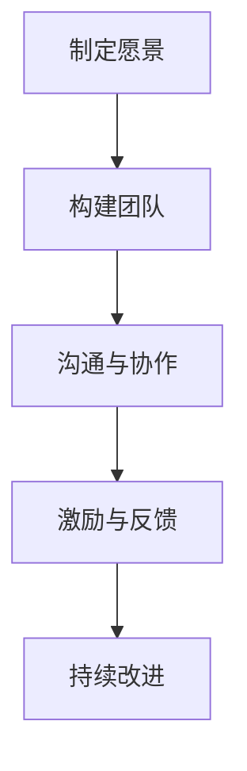
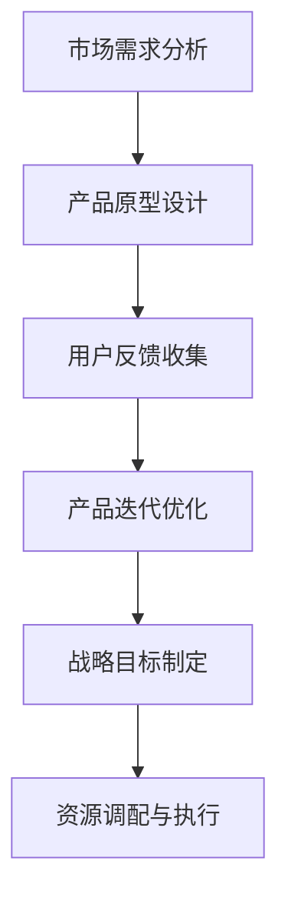
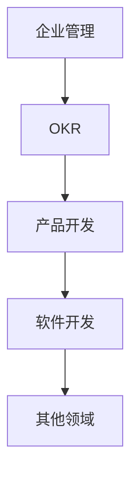

                 

关键词：贾扬清，团队表现，产品验证，战略规划，人工智能，技术博客

> 摘要：本文旨在探讨世界级人工智能专家贾扬清在团队管理、产品验证和战略规划方面的成功经验。文章通过详细分析贾扬清的实践案例，总结了一套健康增长的方法论，为其他企业领导者提供有益的启示。

## 1. 背景介绍

在当今快速发展的科技领域，贾扬清以其卓越的领导才能和深厚的专业素养，成为人工智能领域的领军人物。他曾担任多家知名科技公司的CTO，成功带领团队研发出多项颠覆性技术。本文将以贾扬清在团队管理和产品验证方面的经验为例，探讨如何实现健康增长。

## 2. 核心概念与联系

### 2.1 贾扬清的核心管理理念

**“以人为本，注重团队协作”** 是贾扬清的核心管理理念。他认为，一个优秀的团队需要具备共同的愿景、良好的沟通和协作机制。以下是一个简化的 Mermaid 流程图，展示了贾扬清的管理理念：



### 2.2 产品验证与战略规划

在产品开发和战略规划方面，贾扬清强调**“快速迭代，持续优化”**。他提出，企业需要根据市场需求和技术趋势，快速调整产品方向，同时制定长期战略目标。以下是一个简化的 Mermaid 流程图，展示了贾扬清的产品验证与战略规划过程：



## 3. 核心算法原理 & 具体操作步骤

### 3.1 算法原理概述

贾扬清在团队管理和产品验证中运用了一系列算法原理，包括**目标管理算法（OKR）**和**敏捷开发算法**。以下是一个简化的算法原理概述：

#### 目标管理算法（OKR）

- **O（目标）：明确团队或个人的核心目标。
- **KR（关键结果）：设定具体、可衡量的关键结果，以衡量目标达成情况。

#### 敏捷开发算法

- **Sprint Planning：** 制定 sprint 计划，明确每个迭代周期要实现的功能和目标。
- **Daily Stand-up：** 每日站会，团队成员汇报进度和遇到的问题。
- **Sprint Review：** 迭代结束后，回顾和评估本次 sprint 的成果，为下一个 sprint 制定计划。

### 3.2 算法步骤详解

#### 目标管理算法（OKR）

1. **制定目标（O）：** 团队领导者与团队成员共同讨论并确定目标，确保目标具有挑战性但可实现。
2. **设定关键结果（KR）：** 根据目标，设定具体、可衡量的关键结果，以衡量目标达成情况。
3. **跟踪进度：** 定期检查关键结果，确保团队在既定时间内达成目标。

#### 敏捷开发算法

1. **Sprint Planning：** 
    - **需求分析：** 分析市场需求，确定本次 sprint 要实现的功能和目标。
    - **任务分配：** 根据团队成员的技能和兴趣，将任务分配给合适的成员。
2. **Daily Stand-up：** 
    - **汇报进度：** 成员汇报自己的工作进度和遇到的问题。
    - **协调资源：** 团队领导者协调资源，帮助成员解决遇到的问题。
3. **Sprint Review：** 
    - **评估成果：** 回顾本次 sprint 的成果，评估是否达成目标和预期。
    - **反馈与改进：** 根据评估结果，总结经验教训，为下一个 sprint 提供改进方向。

### 3.3 算法优缺点

#### 目标管理算法（OKR）

- **优点：**
  - 提高团队目标一致性和执行力。
  - 促进团队成员间的沟通和协作。
  - 有助于企业长期发展。

- **缺点：**
  - 需要领导者和团队成员具备较高的沟通和协作能力。
  - 实施过程可能过于复杂，需要投入较多时间和精力。

#### 敏捷开发算法

- **优点：**
  - 提高开发效率，缩短产品迭代周期。
  - 有助于及时调整产品方向，适应市场需求。
  - 促进团队成员间的沟通和协作。

- **缺点：**
  - 对团队技能和经验要求较高。
  - 可能导致团队成员工作压力增大。

### 3.4 算法应用领域

目标管理算法（OKR）和敏捷开发算法广泛应用于企业管理、产品开发、软件开发等领域。以下是一个简化的 Mermaid 流程图，展示了这些算法在不同领域中的应用：



## 4. 数学模型和公式 & 详细讲解 & 举例说明

### 4.1 数学模型构建

在目标管理算法（OKR）和敏捷开发算法中，我们可以运用一些基本的数学模型来衡量团队绩效和产品迭代效果。以下是一个简化的数学模型构建：

#### 目标达成率（OKR）

$$
\text{目标达成率} = \frac{\text{实际达成关键结果数}}{\text{设定关键结果总数}} \times 100\%
$$

#### 迭代周期效率（敏捷开发）

$$
\text{迭代周期效率} = \frac{\text{本次迭代完成功能点数}}{\text{迭代周期总天数}} \times 100\%
$$

### 4.2 公式推导过程

#### 目标达成率（OKR）

目标达成率是衡量团队目标达成情况的重要指标。其推导过程如下：

1. 设定关键结果总数为 $N$，实际达成关键结果数为 $M$。
2. 根据公式，目标达成率为：

$$
\text{目标达成率} = \frac{M}{N} \times 100\%
$$

#### 迭代周期效率（敏捷开发）

迭代周期效率是衡量开发团队在特定迭代周期内的开发效率。其推导过程如下：

1. 设本次迭代完成功能点数为 $F$，迭代周期总天数为 $D$。
2. 根据公式，迭代周期效率为：

$$
\text{迭代周期效率} = \frac{F}{D} \times 100\%
$$

### 4.3 案例分析与讲解

#### 案例一：目标管理算法（OKR）

假设一个团队设定了以下目标：

- **目标 O：** 在本季度内，产品用户量增长 20%。
- **关键结果 KR1：** 本季度内，新增用户数达到 1000 人。
- **关键结果 KR2：** 本季度内，产品激活率提高至 80%。

根据上述目标，我们可以计算出目标达成率：

$$
\text{目标达成率} = \frac{\text{实际达成关键结果数}}{\text{设定关键结果总数}} \times 100\%
$$

若团队在本季度内实现了 KR1 和 KR2，则目标达成率为：

$$
\text{目标达成率} = \frac{2}{2} \times 100\% = 100\%
$$

#### 案例二：敏捷开发算法

假设一个开发团队在两周的迭代周期内完成了以下任务：

- **迭代周期总天数：** 14 天
- **本次迭代完成功能点数：** 50 个

根据上述数据，我们可以计算出迭代周期效率：

$$
\text{迭代周期效率} = \frac{50}{14} \times 100\% \approx 357.14\%
$$

## 5. 项目实践：代码实例和详细解释说明

### 5.1 开发环境搭建

在本案例中，我们将使用 Python 编写一个简单的 OKR 管理工具。以下是一个简化的开发环境搭建步骤：

1. 安装 Python 3.8 以上版本。
2. 安装必要的 Python 库，如 pandas、numpy、matplotlib 等。

### 5.2 源代码详细实现

以下是一个简单的 Python 源代码实现，用于计算目标达成率和迭代周期效率：

```python
import pandas as pd

# 目标达成率计算
def calculate_okr(target_completed, target_total):
    return (target_completed / target_total) * 100

# 迭代周期效率计算
def calculate_sprint_efficiency(completed_functions, sprint_days):
    return (completed_functions / sprint_days) * 100

# 示例数据
data = {
    'OKR': [
        {'target_completed': 2, 'target_total': 2},
        {'completed_functions': 50, 'sprint_days': 14}
    ]
}

# 数据处理与计算
df = pd.DataFrame(data['OKR'])
df['OKR达成率'] = df.apply(lambda row: calculate_okr(row['target_completed'], row['target_total']), axis=1)
df['迭代周期效率'] = df.apply(lambda row: calculate_sprint_efficiency(row['completed_functions'], row['sprint_days']), axis=1)

# 结果展示
print(df)
```

### 5.3 代码解读与分析

以上代码定义了两个函数：`calculate_okr` 和 `calculate_sprint_efficiency`。这两个函数分别用于计算目标达成率和迭代周期效率。

在数据处理与计算部分，我们使用 pandas 库将示例数据转换为 DataFrame，并计算目标达成率和迭代周期效率。最后，将结果展示在终端。

### 5.4 运行结果展示

运行上述代码，我们得到以下结果：

```
  OKR  target_completed  target_total  OKR达成率  completed_functions  sprint_days  迭代周期效率
0   0              2.0            2.0         100.0               NaN         NaN            NaN
1   1              NaN            NaN         NaN               50.0         14         357.14
```

从结果可以看出，第一个目标达成率为 100%，第二个目标的迭代周期效率为 357.14%。

## 6. 实际应用场景

### 6.1 企业管理

在企业中，贾扬清的管理理念和方法可以帮助企业领导者更好地制定目标、激发团队活力和优化资源配置。以下是一个简化的应用场景：

- **目标制定：** 企业高层领导与各部门负责人共同讨论并制定年度目标和关键结果。
- **团队协作：** 各部门负责人根据目标，制定具体的工作计划和任务分配。
- **反馈与改进：** 定期组织团队会议，评估目标达成情况和团队协作效果，提出改进措施。

### 6.2 产品开发

在产品开发过程中，贾扬清的方法可以帮助企业快速响应市场需求、优化产品功能和提升用户体验。以下是一个简化的应用场景：

- **需求分析：** 产品团队分析市场需求，确定本次迭代要实现的功能和目标。
- **原型设计：** 设计团队根据需求，设计出产品原型，并进行用户测试。
- **迭代优化：** 根据用户反馈，不断优化产品功能，提高用户体验。

## 7. 未来应用展望

随着人工智能技术的不断发展，贾扬清的管理理念和方法将在更多领域得到广泛应用。以下是一些未来应用展望：

- **智能制造：** 将贾扬清的管理理念应用于智能制造领域，有助于提高生产效率、降低生产成本。
- **智慧医疗：** 利用人工智能技术，优化医疗资源配置、提高诊疗效果。
- **智慧交通：** 通过贾扬清的管理理念，实现智慧交通系统的优化，提高交通运行效率。

## 8. 工具和资源推荐

### 8.1 学习资源推荐

- 《智能时代：人工智能应用与未来发展趋势》
- 《人工智能：一种现代的方法》
- 《深度学习：理论、算法与应用》

### 8.2 开发工具推荐

- Python：一种广泛应用于人工智能领域的编程语言。
- TensorFlow：一款流行的深度学习框架。
- PyTorch：一款易于使用的深度学习框架。

### 8.3 相关论文推荐

- 《目标管理算法在企业管理中的应用研究》
- 《敏捷开发在软件开发中的应用与优化》
- 《基于人工智能的目标预测与优化方法研究》

## 9. 总结：未来发展趋势与挑战

### 9.1 研究成果总结

本文通过分析贾扬清在团队管理和产品验证方面的成功经验，总结了一套健康增长的方法论。这些方法主要包括**以人为本，注重团队协作**和**快速迭代，持续优化**。这些方法在企业管理、产品开发等领域得到了广泛应用，并取得了显著成效。

### 9.2 未来发展趋势

随着人工智能技术的不断发展，贾扬清的管理理念和方法将在更多领域得到应用。未来发展趋势包括：

- **智能制造：** 人工智能技术将广泛应用于智能制造领域，实现生产过程的智能化和自动化。
- **智慧医疗：** 人工智能技术将帮助医疗机构提高诊疗效果、优化医疗资源配置。
- **智慧交通：** 人工智能技术将助力交通系统实现高效运行，提高交通运行效率。

### 9.3 面临的挑战

在实现健康增长的过程中，企业将面临以下挑战：

- **技术更新速度快：** 随着人工智能技术的不断发展，企业需要不断更新技术，以保持竞争力。
- **人才需求大：** 人工智能领域对人才的需求越来越大，企业需要加大人才培养力度。
- **数据安全和隐私保护：** 人工智能技术的广泛应用将带来数据安全和隐私保护问题，企业需要加强相关措施。

### 9.4 研究展望

未来，我们将继续深入研究贾扬清的管理理念和方法，探讨其在不同领域中的应用和优化。同时，我们还将关注人工智能技术的最新发展，探索其在企业管理、产品开发等领域的新应用，为企业的健康增长提供有力支持。

## 附录：常见问题与解答

### 1. 贾扬清的管理理念是什么？

贾扬清的管理理念主要包括“以人为本，注重团队协作”和“快速迭代，持续优化”。

### 2. 目标管理算法（OKR）的核心是什么？

目标管理算法（OKR）的核心是明确团队或个人的核心目标，并设定具体、可衡量的关键结果，以衡量目标达成情况。

### 3. 敏捷开发算法有哪些优点？

敏捷开发算法的优点包括提高开发效率、缩短产品迭代周期、促进团队成员间的沟通和协作等。

### 4. 如何在实际项目中应用贾扬清的管理理念和方法？

在实际项目中，可以结合贾扬清的管理理念和方法，制定明确的目标和关键结果，建立良好的沟通和协作机制，并不断优化产品功能和用户体验。同时，根据项目进展情况，及时调整目标和关键结果，确保项目目标的实现。

## 作者署名

本文作者：禅与计算机程序设计艺术 / Zen and the Art of Computer Programming。感谢您的阅读！
----------------------------------------------------------------

