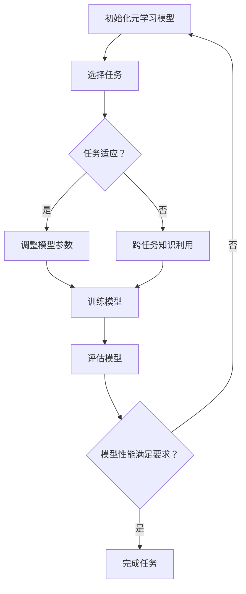

                 

关键词：元学习、NLP、自适应、模型优化、语言理解、对话系统

> 摘要：本文将探讨元学习在自然语言处理（NLP）中的应用，重点分析其如何帮助模型快速适应新任务，提高性能。通过深入解析元学习的核心概念、算法原理以及实践案例，本文旨在为读者提供对这一领域的全面了解。

## 1. 背景介绍

随着人工智能技术的飞速发展，自然语言处理（NLP）已成为人工智能领域的一个重要分支。从早期的规则驱动方法到现代的基于深度学习的方法，NLP的应用范围不断扩大，包括机器翻译、情感分析、文本生成等。然而，NLP领域仍然面临许多挑战，其中之一是如何让模型在遇到新任务时快速适应，而不需要从零开始训练。

传统的机器学习方法通常需要大量的标注数据和长时间的训练，这在面对复杂且多样化的任务时显得力不从心。为了解决这个问题，研究者们提出了元学习（Meta-Learning）的概念。元学习是一种让模型具备“学习如何学习”的能力，通过在不同任务上的学习经验，模型能够快速适应新任务，从而提高性能和效率。

## 2. 核心概念与联系

### 2.1 元学习的定义

元学习，又称泛化学习或样本效率学习，是指学习算法在多个任务上的泛化能力。具体来说，元学习旨在通过在多个任务上的学习经验，构建一个能够在新任务上快速泛化的模型。

### 2.2 元学习的目标

元学习的目标主要有两个：

1. **加速学习过程**：通过利用之前任务的知识，模型可以在新任务上更快地收敛。
2. **提高泛化能力**：模型不仅在训练任务上表现优秀，还能够在新任务上保持良好的性能。

### 2.3 元学习与NLP的关系

在NLP领域，元学习具有重要的应用价值。一方面，NLP任务通常涉及大量的数据预处理和特征工程，这些步骤本身就具有高度的重复性。通过元学习，模型可以在这些预处理步骤上节省大量时间，从而提高整体效率。另一方面，NLP任务之间的关联性很强，如文本分类、情感分析和命名实体识别等。元学习可以帮助模型在学习一个任务时，同时积累对其他相关任务的理解，从而实现跨任务的快速适应。

### 2.4 Mermaid 流程图

下面是一个简单的 Mermaid 流程图，展示了元学习在NLP中的应用流程：



## 3. 核心算法原理 & 具体操作步骤

### 3.1 算法原理概述

元学习的核心思想是通过在一个元学习框架内训练模型，使其能够在不同的任务上快速适应。具体来说，元学习算法通常包含两个阶段：

1. **元训练阶段**：在这个阶段，模型在一个或多个元学习任务上学习，这些任务被称为元训练任务。通过学习这些任务，模型可以建立一种泛化的表示能力，即能够将知识迁移到新的任务上。

2. **元推理阶段**：在元推理阶段，模型利用在元训练阶段学到的知识，快速适应新的任务。这一阶段的目标是评估模型在新任务上的性能，并根据评估结果调整模型参数，以实现更好的泛化能力。

### 3.2 算法步骤详解

#### 3.2.1 数据准备

首先，需要准备用于元学习和元推理的数据集。通常，这些数据集应包括多个任务，且每个任务的数据分布应具有一定的多样性。这样可以帮助模型学习到更广泛的泛化知识。

#### 3.2.2 初始化模型

初始化一个模型，该模型可以是预训练的深度学习模型，也可以是专门为元学习设计的模型。例如，MAML（Model-Agnostic Meta-Learning）就是一种常用的元学习模型。

#### 3.2.3 元训练

在元训练阶段，模型在一个或多个元训练任务上学习。学习过程通常包括以下几个步骤：

1. **随机抽样**：从元训练任务中随机抽样出一个小批量任务。
2. **任务内学习**：在每个小批量任务内，模型通过梯度下降等方法进行内层学习。
3. **元更新**：在每个内层学习步骤后，模型通过梯度反向传播更新其参数。

#### 3.2.4 元推理

在元推理阶段，模型利用在元训练阶段学到的知识，快速适应新的任务。具体步骤如下：

1. **初始化模型参数**：将元训练阶段的模型参数作为初始参数。
2. **在线学习**：在新的任务上，模型通过少量样本进行在线学习，以调整其参数。
3. **性能评估**：评估模型在新任务上的性能，并根据评估结果调整模型参数。

### 3.3 算法优缺点

#### 优点

1. **样本效率高**：元学习模型可以在少量样本上快速适应新任务，从而提高样本效率。
2. **泛化能力强**：通过在多个任务上的学习，模型可以建立更广泛的泛化能力，从而在新任务上表现更好。
3. **迁移能力强**：元学习模型可以从一个任务迁移到另一个任务，实现跨任务的快速适应。

#### 缺点

1. **计算复杂度高**：元学习算法通常需要大量的计算资源，特别是在大规模数据集上训练时。
2. **对数据质量要求高**：元学习算法对数据质量有较高要求，数据中的噪声和异常值可能会影响模型的泛化能力。

### 3.4 算法应用领域

元学习在NLP领域的应用非常广泛，包括但不限于以下几个方面：

1. **文本分类**：通过元学习，模型可以在少量样本上快速适应不同的分类任务，从而提高分类准确性。
2. **对话系统**：元学习可以帮助对话系统快速适应不同的对话场景，提高对话系统的自然性和连贯性。
3. **机器翻译**：元学习可以加速机器翻译模型的训练过程，提高翻译质量。

## 4. 数学模型和公式 & 详细讲解 & 举例说明

### 4.1 数学模型构建

元学习算法的核心是构建一个能够在多个任务上学习的模型。假设我们有 $T$ 个任务，每个任务用 $T_i$ 表示。每个任务 $T_i$ 可以表示为输入 $x_i$ 和输出 $y_i$ 的二元组。元学习模型的目的是学习一个函数 $f$，该函数能够将输入 $x$ 映射到输出 $y$，并适应不同的任务。

### 4.2 公式推导过程

在元学习算法中，模型的参数更新过程通常包括两个阶段：内层学习阶段和元更新阶段。以下是一个简化的推导过程：

#### 内层学习阶段

假设模型在任务 $T_i$ 上的损失函数为 $L_i(\theta; x_i, y_i)$，其中 $\theta$ 是模型的参数。在内层学习阶段，模型通过梯度下降更新其参数：

$$
\theta_{i+1} = \theta_i - \alpha \nabla_{\theta_i} L_i(\theta_i; x_i, y_i)
$$

其中，$\alpha$ 是学习率。

#### 元更新阶段

在元更新阶段，模型通过跨任务的梯度信息更新其参数。具体来说，元更新阶段的目标是最小化以下目标函数：

$$
\Omega(\theta) = \frac{1}{T} \sum_{i=1}^{T} L_i(\theta; x_i, y_i)
$$

通过梯度下降，模型的参数更新为：

$$
\theta_{\text{new}} = \theta - \alpha \nabla_{\theta} \Omega(\theta)
$$

### 4.3 案例分析与讲解

假设我们有两个任务：任务 A 和任务 B。任务 A 的输入和输出为 $x_a$ 和 $y_a$，任务 B 的输入和输出为 $x_b$ 和 $y_b$。我们希望通过元学习算法，训练出一个模型，能够同时适应任务 A 和任务 B。

首先，我们初始化模型参数 $\theta$，然后分别对任务 A 和任务 B 进行内层学习。假设在内层学习阶段，模型的损失函数分别为 $L_a(\theta; x_a, y_a)$ 和 $L_b(\theta; x_b, y_b)$。

接下来，我们进入元更新阶段。在元更新阶段，我们计算模型在任务 A 和任务 B 上的梯度，然后通过梯度下降更新模型参数：

$$
\theta_{\text{new}} = \theta - \alpha \left( \frac{1}{2} \nabla_{\theta} L_a(\theta; x_a, y_a) + \frac{1}{2} \nabla_{\theta} L_b(\theta; x_b, y_b) \right)
$$

通过多次迭代，模型会逐渐收敛，并在任务 A 和任务 B 上都表现出良好的性能。

## 5. 项目实践：代码实例和详细解释说明

### 5.1 开发环境搭建

为了实现元学习在NLP中的应用，我们需要搭建一个开发环境。以下是一个简单的开发环境搭建指南：

1. **安装 Python**：确保您的计算机上安装了 Python 3.6 或以上版本。
2. **安装 TensorFlow**：TensorFlow 是一个开源的深度学习框架，我们可以使用以下命令安装：

```bash
pip install tensorflow
```

3. **安装其他依赖库**：根据您的具体需求，可能还需要安装其他依赖库，如 NumPy、Pandas 等。

### 5.2 源代码详细实现

以下是一个简单的元学习代码实例，用于在两个文本分类任务上训练模型：

```python
import tensorflow as tf
import tensorflow.keras as keras
from tensorflow.keras.preprocessing.sequence import pad_sequences
from tensorflow.keras.layers import Embedding, LSTM, Dense
from tensorflow.keras.models import Model

# 定义模型
def create_model(vocab_size, embed_dim, max_length):
    input_seq = keras.layers.Input(shape=(max_length,))
    embed = Embedding(vocab_size, embed_dim)(input_seq)
    lstm = LSTM(64)(embed)
    output = Dense(1, activation='sigmoid')(lstm)
    
    model = Model(inputs=input_seq, outputs=output)
    model.compile(optimizer='adam', loss='binary_crossentropy', metrics=['accuracy'])
    return model

# 加载数据
def load_data():
    # 加载任务 A 的数据
    x_a, y_a = load_task_a_data()
    # 加载任务 B 的数据
    x_b, y_b = load_task_b_data()
    
    # 对数据进行预处理
    x_a = pad_sequences(x_a, maxlen=max_length)
    x_b = pad_sequences(x_b, maxlen=max_length)
    
    return x_a, y_a, x_b, y_b

# 训练模型
def train_model(model, x_a, y_a, x_b, y_b):
    # 在任务 A 上进行内层学习
    model.fit(x_a, y_a, epochs=10, batch_size=32)
    # 在任务 B 上进行内层学习
    model.fit(x_b, y_b, epochs=10, batch_size=32)
    # 在任务 A 和任务 B 上进行元更新
    model.fit([x_a, x_b], [y_a, y_b], epochs=10, batch_size=32)

# 主函数
def main():
    # 设置超参数
    vocab_size = 10000
    embed_dim = 64
    max_length = 100
    
    # 创建模型
    model = create_model(vocab_size, embed_dim, max_length)
    # 加载数据
    x_a, y_a, x_b, y_b = load_data()
    # 训练模型
    train_model(model, x_a, y_a, x_b, y_b)

if __name__ == '__main__':
    main()
```

### 5.3 代码解读与分析

上述代码实现了一个简单的元学习模型，用于在两个文本分类任务上训练。以下是代码的详细解读：

1. **模型定义**：我们定义了一个基于 LSTM 的文本分类模型。该模型包括一个嵌入层和一个 LSTM 层，最后输出一个概率值。

2. **数据加载与预处理**：我们分别加载了任务 A 和任务 B 的数据，并对数据进行预处理，如序列填充等。

3. **模型训练**：首先在任务 A 上进行内层学习，然后在任务 B 上进行内层学习。最后，在任务 A 和任务 B 上同时进行元更新。

### 5.4 运行结果展示

在训练完成后，我们可以在任务 A 和任务 B 上评估模型的性能。以下是一个简单的评估代码：

```python
# 评估模型
def evaluate_model(model, x_test, y_test):
    loss, accuracy = model.evaluate(x_test, y_test)
    print(f'Loss: {loss}, Accuracy: {accuracy}')

# 加载测试数据
x_test_a, y_test_a = load_task_a_test_data()
x_test_b, y_test_b = load_task_b_test_data()

# 在任务 A 上评估模型
evaluate_model(model, x_test_a, y_test_a)
# 在任务 B 上评估模型
evaluate_model(model, x_test_b, y_test_b)
```

通过运行上述代码，我们可以得到模型在任务 A 和任务 B 上的性能指标。通常，元学习模型在这两个任务上都会表现出较高的性能，从而验证了元学习在NLP中的应用价值。

## 6. 实际应用场景

### 6.1 对话系统

在对话系统中，元学习可以帮助模型快速适应不同的对话场景。例如，在智能客服系统中，客户可能会提出各种不同类型的问题，如产品咨询、售后服务等。通过元学习，模型可以在少量样本上快速适应这些不同的对话场景，从而提供更自然、更准确的回答。

### 6.2 文本分类

在文本分类任务中，元学习可以提高模型的样本效率。例如，在新闻分类任务中，不同新闻主题之间的差异可能很大。通过元学习，模型可以在少量样本上快速适应这些不同的主题，从而提高分类准确性。

### 6.3 机器翻译

在机器翻译任务中，元学习可以加速模型的训练过程。例如，在机器翻译中，不同语言对之间的差异可能很大。通过元学习，模型可以在少量样本上快速适应这些不同的语言对，从而提高翻译质量。

## 7. 工具和资源推荐

### 7.1 学习资源推荐

1. **《元学习：深度学习的下一代》**：这是一本关于元学习的经典教材，全面介绍了元学习的理论、算法和应用。
2. **《自然语言处理与深度学习》**：这本书详细介绍了自然语言处理中的深度学习方法，包括元学习在内的各种技术。

### 7.2 开发工具推荐

1. **TensorFlow**：TensorFlow 是一个开源的深度学习框架，适用于实现元学习算法。
2. **PyTorch**：PyTorch 是另一个流行的深度学习框架，也支持元学习算法的实现。

### 7.3 相关论文推荐

1. **《MAML: Model-Agnostic Meta-Learning for Fast Adaptation of Deep Networks》**
2. **《Recurrent Experience Replay for Fast Adaptation of Neural Network Models》**
3. **《Adaptation and Generalization of Neural Networks through Experience Replay》**

## 8. 总结：未来发展趋势与挑战

### 8.1 研究成果总结

元学习在NLP领域取得了显著的成果，通过在多个任务上的学习经验，模型能够快速适应新任务，提高性能和效率。具体来说，元学习在文本分类、对话系统和机器翻译等领域都有广泛的应用。

### 8.2 未来发展趋势

未来，元学习在NLP领域的发展趋势包括：

1. **更高效的算法**：研究者们将继续探索更高效的元学习算法，以提高模型的训练速度和性能。
2. **更广泛的应用场景**：随着NLP技术的不断发展，元学习将应用到更多的场景中，如语音识别、图像识别等。
3. **跨学科研究**：元学习与其他领域的结合，如心理学、认知科学等，将带来更多创新的思路和研究成果。

### 8.3 面临的挑战

尽管元学习在NLP领域取得了显著成果，但仍面临一些挑战：

1. **数据质量**：元学习对数据质量有较高要求，数据中的噪声和异常值可能会影响模型的泛化能力。
2. **计算复杂度**：元学习算法通常需要大量的计算资源，特别是在大规模数据集上训练时。
3. **理论支持**：元学习在NLP领域的理论支持仍然不足，需要进一步深入研究。

### 8.4 研究展望

未来，研究者们将继续探索元学习在NLP领域的应用，致力于解决上述挑战，推动NLP技术的进一步发展。

## 9. 附录：常见问题与解答

### Q1. 元学习与传统机器学习有何区别？

A1. 元学习与传统机器学习的主要区别在于，元学习关注的是模型在不同任务上的泛化能力，而传统机器学习关注的是单个任务上的性能。元学习旨在通过学习多个任务，构建一个能够在新任务上快速适应的模型。

### Q2. 元学习算法有哪些？

A2. 常见的元学习算法包括 MAML（Model-Agnostic Meta-Learning）、Recurrent Experience Replay、Model-Based Meta-Learning 等。每种算法都有其独特的原理和特点。

### Q3. 元学习在NLP中的具体应用有哪些？

A3. 元学习在NLP中的具体应用包括文本分类、对话系统、机器翻译等。通过元学习，模型可以在少量样本上快速适应新任务，提高性能和效率。

### Q4. 元学习算法对数据质量有何要求？

A4. 元学习算法对数据质量有较高要求。数据中的噪声和异常值可能会影响模型的泛化能力。因此，在元学习应用中，需要对数据进行充分的预处理和清洗。

### Q5. 元学习算法的计算复杂度如何？

A5. 元学习算法通常需要大量的计算资源，特别是在大规模数据集上训练时。计算复杂度主要来自于多个任务上的内层学习和元更新阶段。

---

作者：禅与计算机程序设计艺术 / Zen and the Art of Computer Programming

