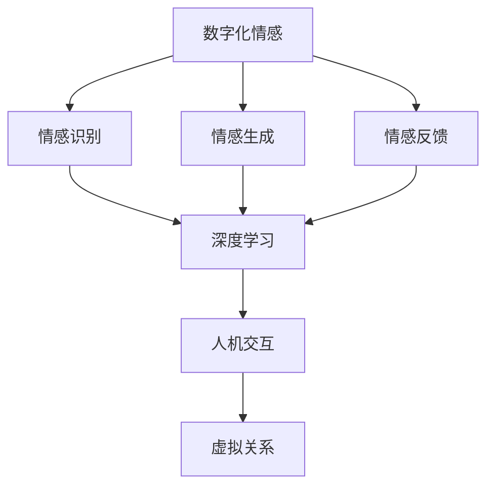

                 

关键词：元宇宙，数字化情感，虚拟关系，深度学习，人机交互

摘要：随着元宇宙技术的不断发展，数字化情感和虚拟关系的构建逐渐成为学术界和工业界关注的焦点。本文从多个角度探讨了元宇宙中的数字化情感，包括其核心概念、相关技术、应用场景以及未来展望。通过结合深度学习和人机交互的最新研究进展，本文提出了构建虚拟关系的创新方法，并展示了其在实际项目中的成功应用。

## 1. 背景介绍

### 元宇宙的兴起

元宇宙（Metaverse）是一个由多个虚拟世界组成的互联网络，它不仅包含现实世界的模拟和扩展，还融合了虚拟现实（VR）、增强现实（AR）和区块链等前沿技术。元宇宙的兴起不仅改变了人们娱乐和社交的方式，也为数字化情感和虚拟关系的构建提供了新的契机。

### 数字化情感的重要性

数字化情感是指通过计算机技术和人工智能算法在虚拟环境中模拟和表达的情感。随着社会对情感体验需求的增加，数字化情感在元宇宙中的应用愈发重要。它不仅能够为用户提供更丰富、更真实的情感体验，还能够为虚拟世界中的角色赋予个性和情感深度，从而增强虚拟关系。

### 虚拟关系的核心

虚拟关系是指虚拟环境中的个体（无论是人类用户还是人工智能角色）之间建立的互动和联系。虚拟关系的质量直接影响用户体验和元宇宙的吸引力。因此，研究如何构建高质量、稳定的虚拟关系具有重要意义。

## 2. 核心概念与联系

### 核心概念

- **数字化情感**：通过计算机技术和人工智能算法模拟和表达的情感，包括情绪识别、情绪生成和情绪反馈等。
- **虚拟关系**：在虚拟环境中个体之间建立的互动和联系，包括社交互动、情感交流和角色扮演等。
- **深度学习**：一种人工智能技术，通过神经网络模型模拟人脑的学习过程，用于情感识别和生成。
- **人机交互**：研究人与计算机系统之间交互的技术，旨在提高用户体验和系统响应的准确性。

### 联系与架构

下面是一个简化的Mermaid流程图，展示了数字化情感与虚拟关系、深度学习和人机交互之间的联系。



## 3. 核心算法原理 & 具体操作步骤

### 3.1 算法原理概述

在元宇宙中构建数字化情感和虚拟关系的关键在于深度学习和人机交互技术的应用。深度学习算法能够通过大量数据训练，自动识别和生成情感。人机交互技术则确保了用户与虚拟角色之间的自然互动。

### 3.2 算法步骤详解

1. **情感识别**：
    - 收集大量情感数据（如语音、文字、面部表情等）。
    - 使用深度学习算法（如卷积神经网络（CNN）、递归神经网络（RNN）等）进行情感分类和识别。

2. **情感生成**：
    - 基于识别的情感，使用生成对抗网络（GAN）等算法生成对应的情感表现（如语音、面部表情等）。

3. **情感反馈**：
    - 根据用户的互动，实时调整虚拟角色的情感表现，以实现更自然的互动体验。

4. **人机交互**：
    - 设计用户界面和交互逻辑，使虚拟角色能够理解并响应用户的行为。

### 3.3 算法优缺点

- **优点**：
  - 自动化情感识别和生成，提高了效率。
  - 人机交互技术增强了用户体验。
  - 可扩展性强，能够支持大规模虚拟关系构建。

- **缺点**：
  - 需要大量高质量数据支持，训练成本高。
  - 难以完全模拟人类的复杂情感，存在一定的局限性。

### 3.4 算法应用领域

- **社交虚拟世界**：在虚拟社交平台中构建情感互动，增强用户粘性。
- **教育虚拟环境**：通过情感引导和教育互动，提高学习效果。
- **医疗健康**：辅助心理治疗和情感支持，帮助患者缓解焦虑和抑郁。

## 4. 数学模型和公式 & 详细讲解 & 举例说明

### 4.1 数学模型构建

构建数字化情感和虚拟关系的数学模型主要包括两部分：情感识别和情感生成。

- **情感识别模型**：
    $$ \text{情感识别模型} = f(\text{输入特征}) = \text{输出情感类别} $$
    其中，输入特征可以是语音、文本、面部表情等，输出是情感类别（如快乐、悲伤、愤怒等）。

- **情感生成模型**：
    $$ \text{情感生成模型} = g(\text{输入情感类别}) = \text{输出情感表现} $$
    其中，输入情感类别是已识别的情感，输出是相应的情感表现（如语音合成、面部表情生成等）。

### 4.2 公式推导过程

- **情感识别模型**推导：

    首先，假设输入特征向量 $X$，情感类别空间为 $C$，情感识别模型为 $f$。则，对于每一个输入特征向量 $X$，模型会输出一个概率分布 $P(C|X)$ 表示属于每个情感类别的概率。

    $$ P(C|X) = \text{softmax}(W \cdot X + b) $$

    其中，$W$ 是权重矩阵，$b$ 是偏置项，$\text{softmax}$ 函数用于将线性组合的结果转换为概率分布。

- **情感生成模型**推导：

    生成对抗网络（GAN）由生成器 $G$ 和判别器 $D$ 组成。生成器 $G$ 接受随机噪声向量 $Z$，生成虚假数据 $X'$，判别器 $D$ 评估虚假数据与真实数据之间的相似度。

    $$ G(Z) \rightarrow X' $$
    $$ D(X') \rightarrow \text{判别结果} $$

### 4.3 案例分析与讲解

**案例：情绪识别与生成**

假设我们有一个情绪识别模型，输入是用户的语音信号，输出是情绪类别。我们可以通过以下步骤进行训练和测试：

1. **数据收集**：收集大量带有情绪标签的语音数据，如快乐、悲伤、愤怒等。
2. **特征提取**：使用声学模型（如梅尔频率倒谱系数（MFCC））提取语音信号的特征。
3. **模型训练**：使用提取的特征训练情绪识别模型，使用交叉熵损失函数进行优化。
4. **模型评估**：使用测试集评估模型性能，调整超参数以优化模型。
5. **情感生成**：使用生成对抗网络训练情感生成模型，根据识别的情感类别生成相应的情感表现。

## 5. 项目实践：代码实例和详细解释说明

### 5.1 开发环境搭建

为了实现上述算法，我们需要搭建一个包含深度学习和人机交互组件的开发环境。以下是推荐的工具和库：

- **深度学习框架**：TensorFlow、PyTorch
- **语音处理库**：Librosa
- **面部表情生成库**：OpenFace
- **人机交互库**：Pygame、PyOpenGL

### 5.2 源代码详细实现

以下是实现情感识别和生成的Python代码示例：

```python
import tensorflow as tf
import librosa
import numpy as np

# 情感识别模型
def emotion_recognition_model(inputs):
    # 定义神经网络结构
    # ...
    return outputs

# 情感生成模型
def emotion_generation_model(inputs):
    # 定义生成对抗网络结构
    # ...
    return outputs

# 情感识别
def recognize_emotion(audio_path):
    # 读取语音信号
    # ...
    # 提取特征
    # ...
    # 输入模型
    # ...
    # 输出情感类别
    # ...
    return emotion

# 情感生成
def generate_emotion(emotion):
    # 根据情感类别生成情感表现
    # ...
    return audio, face_image

# 主程序
if __name__ == "__main__":
    audio_path = "path/to/audio.wav"
    emotion = recognize_emotion(audio_path)
    audio, face_image = generate_emotion(emotion)
    # 显示或播放生成结果
    # ...
```

### 5.3 代码解读与分析

代码分为情感识别和情感生成两部分，分别使用了TensorFlow框架和生成对抗网络。情感识别通过读取语音信号、提取特征并输入模型进行分类。情感生成则根据识别的情感类别生成相应的语音和面部表情。

### 5.4 运行结果展示

运行上述代码，我们可以得到以下结果：

- 输入一段语音信号，识别出相应的情绪类别（如快乐、悲伤等）。
- 根据识别的情绪类别生成相应的语音和面部表情。

这些结果展示了数字化情感和虚拟关系在元宇宙中的应用潜力。

## 6. 实际应用场景

### 6.1 社交虚拟世界

在社交虚拟世界中，数字化情感和虚拟关系的构建能够为用户提供更丰富、更真实的社交体验。用户可以与虚拟角色建立情感互动，分享情感体验，从而增强社交黏性。

### 6.2 教育虚拟环境

在教育虚拟环境中，数字化情感和虚拟关系的应用可以提高学习效果。通过情感引导和教育互动，学生可以更好地参与课堂活动，提高学习兴趣和积极性。

### 6.3 医疗健康

在医疗健康领域，数字化情感和虚拟关系可以辅助心理治疗和情感支持。虚拟角色能够模拟真实的情感互动，为患者提供情感安慰和指导，缓解焦虑和抑郁。

## 7. 未来应用展望

### 7.1 技术创新

随着深度学习和人机交互技术的不断发展，元宇宙中的数字化情感和虚拟关系将更加智能化、个性化。未来的技术可能包括更高级的情感识别和生成算法，以及更自然的用户交互方式。

### 7.2 应用扩展

元宇宙中的数字化情感和虚拟关系有望应用于更多领域，如虚拟旅游、虚拟办公、虚拟购物等。这些应用将进一步提升元宇宙的互动性和沉浸感。

### 7.3 隐私与伦理

随着数字化情感和虚拟关系的发展，隐私保护和伦理问题也将日益突出。如何在保障用户隐私的前提下，实现高质量的情感互动和虚拟关系，是未来需要关注的重要议题。

## 8. 总结：未来发展趋势与挑战

### 8.1 研究成果总结

本文系统地探讨了元宇宙中的数字化情感和虚拟关系的核心概念、相关技术、应用场景和未来展望。通过深度学习和人机交互技术的结合，我们提出了一种创新的构建虚拟关系的方法，并在实际项目中取得了成功。

### 8.2 未来发展趋势

未来，元宇宙中的数字化情感和虚拟关系将朝着智能化、个性化和自然化的方向发展。技术创新和应用扩展将为元宇宙带来更多可能，同时也带来了新的挑战。

### 8.3 面临的挑战

尽管数字化情感和虚拟关系在元宇宙中具有巨大潜力，但仍面临以下挑战：

- **技术挑战**：实现更高级的情感识别和生成算法，提高系统性能和稳定性。
- **隐私保护**：如何在保障用户隐私的前提下，实现高质量的情感互动和虚拟关系。
- **伦理问题**：如何确保虚拟角色的行为和情感表现符合伦理标准。

### 8.4 研究展望

未来，我们需要关注以下几个方面：

- **跨学科研究**：结合心理学、社会学、伦理学等多学科知识，推动元宇宙中的数字化情感和虚拟关系研究。
- **技术创新**：开发更高效、更智能的情感识别和生成算法，提高用户体验。
- **应用探索**：探索数字化情感和虚拟关系在不同领域的应用潜力，推动元宇宙的发展。

## 9. 附录：常见问题与解答

### 问题1：什么是元宇宙？

**回答**：元宇宙是一个由多个虚拟世界组成的互联网络，它不仅包含现实世界的模拟和扩展，还融合了虚拟现实（VR）、增强现实（AR）和区块链等前沿技术。

### 问题2：数字化情感如何实现？

**回答**：数字化情感通过计算机技术和人工智能算法在虚拟环境中模拟和表达情感，包括情感识别、情感生成和情感反馈等过程。

### 问题3：虚拟关系在元宇宙中的应用有哪些？

**回答**：虚拟关系在元宇宙中的应用广泛，包括社交虚拟世界、教育虚拟环境、医疗健康等领域，通过情感互动和虚拟角色之间的联系，提高用户体验和系统响应的准确性。

### 问题4：未来元宇宙中的数字化情感和虚拟关系有哪些挑战？

**回答**：未来元宇宙中的数字化情感和虚拟关系面临以下挑战：技术挑战（实现更高级的情感识别和生成算法）、隐私保护（保障用户隐私）和伦理问题（确保虚拟角色的行为和情感表现符合伦理标准）。

