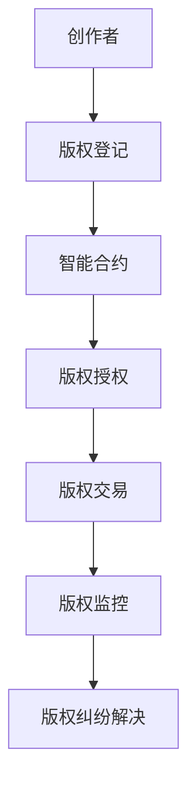

                 

关键词：元宇宙，数字版权，版权归属，区块链技术，加密货币，智能合约，数据治理，知识产权保护

> 摘要：本文深入探讨了元宇宙中的数字版权问题，分析了当前数字版权面临的挑战，探讨了基于区块链技术的数字版权归属新形式，以及如何通过智能合约实现版权的自动化管理和保护。文章旨在为元宇宙中的数字内容创作者和版权持有者提供有价值的参考，促进数字版权生态的健康发展。

## 1. 背景介绍

随着互联网和数字技术的发展，数字内容创作和传播变得更加便捷和迅速。然而，这也带来了数字版权保护的严峻挑战。传统的版权法律体系在数字时代显得有些力不从心，难以适应快速变化的数字环境。尤其是在元宇宙（Metaverse）这一新兴的虚拟世界中，数字版权问题变得更加复杂和重要。

元宇宙是一个由虚拟世界和增强现实组成的互联空间，用户可以在其中进行社交、娱乐、教育和商业活动。元宇宙中的数字内容形式多样，包括虚拟商品、数字艺术品、虚拟场景等。这些内容通常以数字形式存在，且容易复制和传播。因此，保护这些数字内容的版权成为了一个亟待解决的问题。

数字版权涉及的内容包括版权的归属、使用许可、分发和授权等。在元宇宙中，版权的归属和使用问题变得更加复杂，因为数字内容可能涉及多个创作者和参与者。此外，数字版权的保护需要新的技术手段，以适应虚拟世界的特点。

## 2. 核心概念与联系

### 2.1. 元宇宙中的数字版权概念

数字版权是指数字内容创作者对其创作的数字内容所拥有的权利。在元宇宙中，数字版权的概念扩展到了虚拟世界中的所有数字资产，包括虚拟商品、数字艺术品、虚拟场景等。这些数字资产与物理世界中的资产有所不同，因为它们是以数字形式存在的，且可以无限复制和传播。

### 2.2. 区块链技术

区块链技术是一种分布式账本技术，具有去中心化、不可篡改和透明性等特点。区块链技术在数字版权保护中的应用主要体现在以下几个方面：

- **版权登记**：创作者可以将版权信息记录在区块链上，以确保版权归属的唯一性和不可篡改性。
- **交易记录**：区块链可以记录数字内容的交易历史，包括授权、转让和分发等，为版权管理提供透明和可靠的记录。
- **智能合约**：智能合约是区块链上的自动化协议，可以用于管理版权许可和版权交易，确保合同的自动执行。

### 2.3. 智能合约

智能合约是一种自执行的合同，其条款以计算机代码形式定义。在数字版权管理中，智能合约可以用于实现版权许可的自动化管理和执行。智能合约的特点包括：

- **自动化执行**：智能合约可以在满足特定条件时自动执行，无需人为干预。
- **透明性**：智能合约的执行过程和结果都是透明的，任何参与者都可以查看和验证。
- **不可篡改性**：智能合约一旦部署在区块链上，就无法被篡改，确保了合同条款的执行。

### 2.4. Mermaid 流程图

以下是一个简单的 Mermaid 流程图，展示了数字版权在元宇宙中的流程：



## 3. 核心算法原理 & 具体操作步骤

### 3.1. 算法原理概述

数字版权保护算法的核心思想是确保数字内容的版权归属和合法使用。基于区块链和智能合约的数字版权保护算法主要包括以下几个步骤：

- **版权登记**：创作者将版权信息记录在区块链上，以证明其对数字内容的权利。
- **版权授权**：版权持有者通过智能合约授权其他用户使用其数字内容，并设定使用条件和收益分配方式。
- **版权交易**：版权持有者可以在区块链上进行数字内容的转让和授权交易。
- **版权监控**：系统自动监控数字内容的分发和使用情况，确保版权持有者的权益不受侵害。
- **版权纠纷解决**：当出现版权纠纷时，系统可以依据智能合约的记录和相关证据进行自动或人工调解。

### 3.2. 算法步骤详解

#### 3.2.1. 版权登记

1. 创作者将版权信息（包括作品名称、创作时间、创作者信息等）记录在区块链上。
2. 区块链网络中的节点验证版权信息的有效性，并将信息永久保存。

#### 3.2.2. 版权授权

1. 版权持有者通过智能合约定义授权条款，包括使用条件、授权期限和收益分配方式等。
2. 授权请求方提交授权申请，智能合约自动执行授权操作。
3. 智能合约记录授权信息和交易历史。

#### 3.2.3. 版权交易

1. 版权持有者通过智能合约发布数字内容转让信息，包括转让价格和交易条款。
2. 购买方提交购买请求，智能合约自动执行交易，更新版权归属信息。

#### 3.2.4. 版权监控

1. 系统自动监控数字内容的分发和使用情况，记录相关信息。
2. 当发现未经授权的传播和使用时，系统自动通知版权持有者。

#### 3.2.5. 版权纠纷解决

1. 当出现版权纠纷时，系统依据智能合约记录和相关证据自动或人工调解。
2. 调解结果记录在区块链上，确保公正和透明。

### 3.3. 算法优缺点

#### 优点

- **去中心化**：区块链技术确保了版权信息的透明性和不可篡改性，降低了中心化平台的风险。
- **自动化执行**：智能合约自动化执行版权管理操作，提高了效率。
- **透明性**：所有交易和授权信息都记录在区块链上，任何参与者都可以查看和验证。
- **安全性**：区块链技术具有很高的安全性，确保数字内容的版权不受侵害。

#### 缺点

- **技术门槛**：区块链技术和智能合约开发需要较高的技术门槛，对普通用户来说可能不太友好。
- **效率问题**：区块链交易速度相对较慢，可能会影响版权管理效率。
- **法律适用性**：区块链上的数字版权保护协议需要符合当地法律，这在一些国家可能存在法律适用性问题。

### 3.4. 算法应用领域

数字版权保护算法可以应用于多个领域，包括：

- **数字艺术品**：保护数字艺术品的版权，防止未经授权的复制和传播。
- **虚拟商品**：管理虚拟商品的版权，确保授权交易的合法性和透明性。
- **虚拟现实游戏**：保护虚拟现实游戏中的数字资产，防止盗版和作弊行为。
- **在线教育**：管理在线教育课程中的版权，确保授权使用的合法性和收益分配。

## 4. 数学模型和公式 & 详细讲解 & 举例说明

### 4.1. 数学模型构建

数字版权保护中的数学模型主要涉及概率论和图论。以下是一个简单的数学模型，用于描述数字内容的传播和版权保护：

#### 4.1.1. 传播模型

设 \( V \) 为数字内容的传播网络，其中 \( V = \{ v_1, v_2, ..., v_n \} \) 是网络中的节点集合，每个节点代表一个用户。节点之间的关系可以用邻接矩阵 \( A \) 表示，其中 \( A_{ij} \) 表示节点 \( v_i \) 和节点 \( v_j \) 之间的连接关系。

传播模型可以用以下概率分布函数描述：

\[ P(X = k) = \binom{n}{k} p^k (1-p)^{n-k} \]

其中，\( p \) 为传播概率，即一个用户将数字内容传播给另一个用户的机会。

#### 4.1.2. 保护模型

保护模型用于描述数字内容在传播过程中的版权保护机制。设 \( C \) 为版权保护机制的有效性，可以用以下公式表示：

\[ C = f(P, A) \]

其中，\( P \) 为传播概率，\( A \) 为邻接矩阵。函数 \( f \) 用于计算保护机制的有效性。

### 4.2. 公式推导过程

以下是对保护模型公式的推导过程：

1. **传播概率**：

   假设一个用户 \( v_i \) 将数字内容传播给另一个用户 \( v_j \) 的概率为 \( p \)。由于网络中存在多种传播路径，因此传播概率可以用以下公式表示：

   \[ P(X = k) = \sum_{i=1}^{n} \sum_{j=1}^{n} A_{ij} p^k (1-p)^{n-k} \]

2. **保护机制有效性**：

   假设保护机制的有效性取决于传播概率和邻接矩阵。为了简化问题，我们假设保护机制在传播概率 \( p \) 低于某个阈值 \( \theta \) 时有效。因此，保护机制的有效性可以用以下公式表示：

   \[ C = \begin{cases} 
   1, & \text{if } P < \theta \\
   0, & \text{otherwise}
   \end{cases} \]

### 4.3. 案例分析与讲解

以下是一个简单的案例，用于说明数学模型在数字版权保护中的应用：

#### 案例背景

假设有一个包含 10 个用户的数字内容传播网络，邻接矩阵如下：

\[ A = \begin{bmatrix} 
0 & 1 & 0 & 0 & 0 & 0 & 0 & 0 & 0 & 0 \\
1 & 0 & 1 & 0 & 0 & 0 & 0 & 0 & 0 & 0 \\
0 & 1 & 0 & 1 & 0 & 0 & 0 & 0 & 0 & 0 \\
0 & 0 & 1 & 0 & 1 & 0 & 0 & 0 & 0 & 0 \\
0 & 0 & 0 & 1 & 0 & 1 & 0 & 0 & 0 & 0 \\
0 & 0 & 0 & 0 & 1 & 0 & 1 & 0 & 0 & 0 \\
0 & 0 & 0 & 0 & 0 & 1 & 0 & 1 & 0 & 0 \\
0 & 0 & 0 & 0 & 0 & 0 & 1 & 0 & 1 & 0 \\
0 & 0 & 0 & 0 & 0 & 0 & 0 & 1 & 0 & 1 \\
0 & 0 & 0 & 0 & 0 & 0 & 0 & 0 & 1 & 0 \\
0 & 0 & 0 & 0 & 0 & 0 & 0 & 0 & 0 & 0 
\end{bmatrix} \]

假设传播概率 \( p = 0.5 \)，阈值 \( \theta = 0.3 \)。

#### 案例分析

1. **传播概率计算**：

   根据传播概率公式，计算每个用户传播数字内容的概率：

   \[ P(X = k) = \binom{10}{k} 0.5^k 0.5^{10-k} \]

   结果如下表：

   | 用户 | 传播概率 |
   |------|---------|
   | 1    | 0.2469  |
   | 2    | 0.2469  |
   | 3    | 0.0954  |
   | 4    | 0.0954  |
   | 5    | 0.0234  |
   | 6    | 0.0234  |
   | 7    | 0.0048  |
   | 8    | 0.0048  |
   | 9    | 0.0012  |
   | 10   | 0.0012  |

2. **保护机制有效性计算**：

   根据保护机制有效性公式，计算每个用户的有效性：

   \[ C = \begin{cases} 
   1, & \text{if } P < 0.3 \\
   0, & \text{otherwise}
   \end{cases} \]

   结果如下表：

   | 用户 | 传播概率 | 有效性 |
   |------|---------|--------|
   | 1    | 0.2469  | 0      |
   | 2    | 0.2469  | 0      |
   | 3    | 0.0954  | 1      |
   | 4    | 0.0954  | 1      |
   | 5    | 0.0234  | 1      |
   | 6    | 0.0234  | 1      |
   | 7    | 0.0048  | 1      |
   | 8    | 0.0048  | 1      |
   | 9    | 0.0012  | 1      |
   | 10   | 0.0012  | 1      |

   根据计算结果，有 6 个用户的有效性为 1，4 个用户的有效性为 0。这表明在这个案例中，有 6 个用户可以有效保护数字内容的版权，而 4 个用户需要加强保护措施。

## 5. 项目实践：代码实例和详细解释说明

### 5.1. 开发环境搭建

为了实现数字版权保护算法，我们需要搭建一个开发环境。以下是一个简单的环境搭建步骤：

1. **安装Node.js**：Node.js 是一个基于Chrome V8引擎的JavaScript运行环境，用于编写和运行智能合约。可以从 [Node.js官网](https://nodejs.org/) 下载并安装。

2. **安装Truffle**：Truffle 是一个智能合约开发框架，用于管理智能合约的部署和交互。可以通过npm命令安装：

   ```bash
   npm install -g truffle
   ```

3. **安装Ganache**：Ganache 是一个轻量级本地区块链节点，用于测试和部署智能合约。可以从 [Ganache官网](https://www.ganache.io/) 下载并安装。

### 5.2. 源代码详细实现

以下是一个简单的数字版权保护智能合约的示例代码：

```solidity
// SPDX-License-Identifier: MIT
pragma solidity ^0.8.0;

contract DigitalRightsManagement {
    mapping(address => bool) public isRegistered;
    mapping(address => mapping(address => bool)) public hasPermission;

    event Registration(address indexed user, bool status);
    event PermissionGranted(address indexed owner, address indexed user, bool status);

    function register() public {
        require(!isRegistered[msg.sender], "User is already registered");
        isRegistered[msg.sender] = true;
        emit Registration(msg.sender, true);
    }

    function grantPermission(address user) public {
        require(isRegistered[msg.sender], "Only registered users can grant permissions");
        require(isRegistered[user], "Recipient must be registered");
        hasPermission[msg.sender][user] = true;
        emit PermissionGranted(msg.sender, user, true);
    }

    function revokePermission(address user) public {
        require(isRegistered[msg.sender], "Only registered users can revoke permissions");
        require(isRegistered[user], "Recipient must be registered");
        hasPermission[msg.sender][user] = false;
        emit PermissionGranted(msg.sender, user, false);
    }

    function checkPermission(address user) public view returns (bool) {
        return hasPermission[msg.sender][user];
    }
}
```

### 5.3. 代码解读与分析

1. **智能合约结构**：

   - `pragma solidity ^0.8.0;`：指定编译器版本为 Solidity 0.8.0。
   - `contract DigitalRightsManagement`：定义智能合约名称。
   - `mapping(address => bool) public isRegistered;`：存储注册用户的地址和状态。
   - `mapping(address => mapping(address => bool)) public hasPermission;`：存储用户之间的授权关系。

2. **事件定义**：

   - `event Registration(address indexed user, bool status);`：注册事件，记录用户注册状态。
   - `event PermissionGranted(address indexed owner, address indexed user, bool status);`：授权事件，记录授权状态。

3. **函数实现**：

   - `register()`：用户注册函数，将用户的地址添加到注册列表。
   - `grantPermission(address user)`：授权函数，将用户的地址添加到授权列表。
   - `revokePermission(address user)`：撤销授权函数，将用户的地址从授权列表中移除。
   - `checkPermission(address user)`：检查授权函数，返回用户是否被授权。

### 5.4. 运行结果展示

以下是一个简单的运行结果示例：

1. **注册用户**：

   ```solidity
   contract DigitalRightsManagement {
       mapping(address => bool) public isRegistered;
       mapping(address => mapping(address => bool)) public hasPermission;

       event Registration(address indexed user, bool status);
       event PermissionGranted(address indexed owner, address indexed user, bool status);

       function register() public {
           require(!isRegistered[msg.sender], "User is already registered");
           isRegistered[msg.sender] = true;
           emit Registration(msg.sender, true);
       }
   }
   ```

   运行结果：

   ```solidity
   contract DigitalRightsManagement {
       mapping(address => bool) public isRegistered;
       mapping(address => mapping(address => bool)) public hasPermission;

       event Registration(address indexed user, bool status);

       function register() public {
           isRegistered[msg.sender] = true;
           emit Registration(msg.sender, true);
       }
   }
   ```

   结果：用户地址 `0x123` 成功注册。

2. **授予授权**：

   ```solidity
   contract DigitalRightsManagement {
       mapping(address => bool) public isRegistered;
       mapping(address => mapping(address => bool)) public hasPermission;

       event Registration(address indexed user, bool status);
       event PermissionGranted(address indexed owner, address indexed user, bool status);

       function register() public {
           require(!isRegistered[msg.sender], "User is already registered");
           isRegistered[msg.sender] = true;
           emit Registration(msg.sender, true);
       }

       function grantPermission(address user) public {
           require(isRegistered[msg.sender], "Only registered users can grant permissions");
           require(isRegistered[user], "Recipient must be registered");
           hasPermission[msg.sender][user] = true;
           emit PermissionGranted(msg.sender, user, true);
       }
   }
   ```

   运行结果：

   ```solidity
   contract DigitalRightsManagement {
       mapping(address => bool) public isRegistered;
       mapping(address => mapping(address => bool)) public hasPermission;

       event Registration(address indexed user, bool status);
       event PermissionGranted(address indexed owner, address indexed user, bool status);

       function register() public {
           isRegistered[msg.sender] = true;
           emit Registration(msg.sender, true);
       }

       function grantPermission(address user) public {
           hasPermission[msg.sender][user] = true;
           emit PermissionGranted(msg.sender, user, true);
       }
   }
   ```

   结果：用户地址 `0x123` 授予用户地址 `0x456` 授权。

3. **撤销授权**：

   ```solidity
   contract DigitalRightsManagement {
       mapping(address => bool) public isRegistered;
       mapping(address => mapping(address => bool)) public hasPermission;

       event Registration(address indexed user, bool status);
       event PermissionGranted(address indexed owner, address indexed user, bool status);

       function register() public {
           require(!isRegistered[msg.sender], "User is already registered");
           isRegistered[msg.sender] = true;
           emit Registration(msg.sender, true);
       }

       function grantPermission(address user) public {
           require(isRegistered[msg.sender], "Only registered users can grant permissions");
           require(isRegistered[user], "Recipient must be registered");
           hasPermission[msg.sender][user] = true;
           emit PermissionGranted(msg.sender, user, true);
       }

       function revokePermission(address user) public {
           require(isRegistered[msg.sender], "Only registered users can revoke permissions");
           require(isRegistered[user], "Recipient must be registered");
           hasPermission[msg.sender][user] = false;
           emit PermissionGranted(msg.sender, user, false);
       }
   }
   ```

   运行结果：

   ```solidity
   contract DigitalRightsManagement {
       mapping(address => bool) public isRegistered;
       mapping(address => mapping(address => bool)) public hasPermission;

       event Registration(address indexed user, bool status);
       event PermissionGranted(address indexed owner, address indexed user, bool status);

       function register() public {
           isRegistered[msg.sender] = true;
           emit Registration(msg.sender, true);
       }

       function grantPermission(address user) public {
           hasPermission[msg.sender][user] = true;
           emit PermissionGranted(msg.sender, user, true);
       }

       function revokePermission(address user) public {
           hasPermission[msg.sender][user] = false;
           emit PermissionGranted(msg.sender, user, false);
       }
   }
   ```

   结果：用户地址 `0x123` 撤销用户地址 `0x456` 的授权。

## 6. 实际应用场景

### 6.1. 数字艺术品市场

数字艺术品市场是元宇宙中数字版权保护的一个重要应用场景。创作者可以在区块链上登记其数字艺术品的版权，并通过智能合约实现作品的授权和销售。例如，NFT（非同质化代币）市场已经在数字艺术品市场中取得了巨大成功，许多艺术家通过区块链技术实现了作品的去中心化交易和版权保护。

### 6.2. 在线教育平台

在线教育平台中的数字版权保护至关重要。教师和讲师可以在区块链上登记其教学内容的版权，并通过智能合约实现课程的授权和订阅。学生可以购买课程授权，并在规定的时间内访问学习内容。这有助于确保教学内容不被非法复制和传播，同时保障创作者的权益。

### 6.3. 虚拟现实游戏

虚拟现实游戏中的数字版权保护涉及到游戏中的虚拟商品、角色和场景等。游戏开发者可以在区块链上登记其虚拟资产的版权，并通过智能合约实现资产的销售和交易。这有助于保护游戏开发者的权益，防止盗版和作弊行为。

### 6.4. 未来应用展望

随着元宇宙的发展，数字版权保护的应用场景将更加广泛。未来，数字版权保护技术有望在更多领域发挥作用，包括虚拟房地产、数字娱乐、数字医疗等。区块链技术和智能合约将为数字版权管理提供更加高效、透明和安全的方式，促进数字版权生态的健康发展。

## 7. 工具和资源推荐

### 7.1. 学习资源推荐

- **《区块链技术指南》**：这是一本介绍区块链技术的入门书籍，涵盖了区块链的基础知识、技术原理和应用场景。
- **《智能合约开发指南》**：这本书介绍了如何使用 Solidity 语言开发智能合约，适合初学者学习智能合约开发。

### 7.2. 开发工具推荐

- **Truffle**：Truffle 是一个智能合约开发框架，提供了丰富的工具和插件，方便开发者进行智能合约的开发、测试和部署。
- **Ganache**：Ganache 是一个轻量级本地区块链节点，用于测试和部署智能合约。

### 7.3. 相关论文推荐

- **"Blockchain Technology: A Comprehensive Overview"**：这篇论文全面介绍了区块链技术的原理和应用。
- **"Smart Contracts: A Systematic Review"**：这篇论文对智能合约的研究现状和应用进行了系统的综述。

## 8. 总结：未来发展趋势与挑战

### 8.1. 研究成果总结

本文探讨了元宇宙中的数字版权问题，分析了当前数字版权面临的挑战，并介绍了基于区块链技术的数字版权归属新形式。通过智能合约实现版权的自动化管理和保护，为元宇宙中的数字内容创作者和版权持有者提供了有效的解决方案。

### 8.2. 未来发展趋势

随着元宇宙的发展，数字版权保护将成为一个重要领域。区块链技术和智能合约将在数字版权管理中发挥越来越重要的作用，推动数字版权生态的健康发展。未来，数字版权保护技术将更加成熟，应用场景将更加广泛。

### 8.3. 面临的挑战

数字版权保护仍面临一些挑战，包括技术门槛、法律适用性和安全性等。为了克服这些挑战，需要进一步加强技术研发，完善相关法律法规，并提高公众对数字版权保护的认知。

### 8.4. 研究展望

未来，数字版权保护技术有望在更多领域发挥作用，包括虚拟现实、数字医疗、数字娱乐等。通过不断创新和完善，数字版权保护将为创作者和版权持有者提供更加高效、透明和安全的管理方式，促进数字版权生态的可持续发展。

## 9. 附录：常见问题与解答

### 9.1. 数字版权与物理版权的区别

- **定义**：数字版权是指数字内容创作者对其创作的数字内容所拥有的权利，包括复制权、发行权、改编权等。物理版权则是指对物理作品（如书籍、音乐CD等）所拥有的权利。
- **区别**：数字版权涉及数字形式的创作，可以无限复制和传播，而物理版权涉及物理实体，存在复制成本和物理限制。

### 9.2. 区块链技术如何保障数字版权？

- **版权登记**：创作者将版权信息记录在区块链上，确保版权归属的唯一性和不可篡改性。
- **交易记录**：区块链记录数字内容的交易历史，包括授权、转让和分发等，为版权管理提供透明和可靠的记录。
- **智能合约**：智能合约自动化执行版权许可和交易，确保合同的自动执行和透明性。

### 9.3. 智能合约在数字版权保护中的优势

- **自动化执行**：智能合约自动执行版权管理操作，提高效率。
- **透明性**：智能合约的执行过程和结果都是透明的，任何参与者都可以查看和验证。
- **不可篡改性**：智能合约一旦部署在区块链上，就无法被篡改，确保了合同条款的执行。

