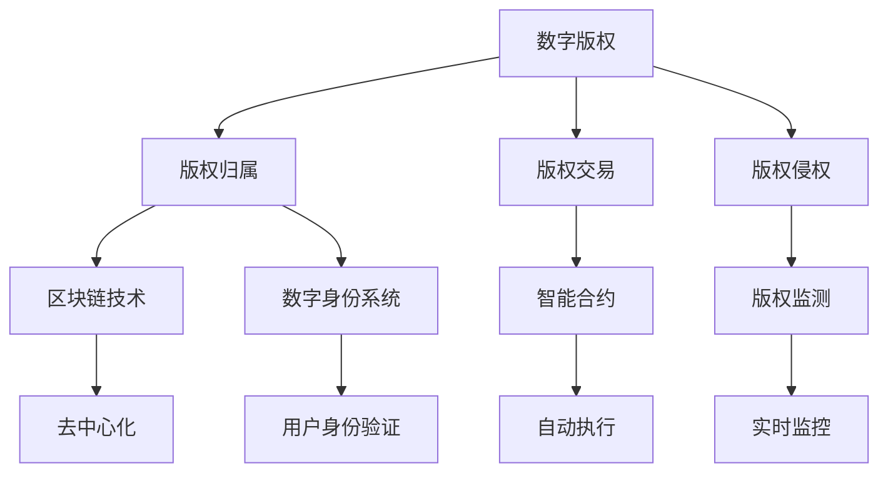

                 

元宇宙，这个集虚拟现实、区块链技术、人工智能等前沿科技于一体的新型数字空间，正在逐步改变我们的生活方式和社会结构。在这个充满无限可能性的虚拟世界中，数字版权的问题变得尤为重要。本文将深入探讨元宇宙中的数字版权，特别是版权归属的新形式，以期为这一领域的未来发展提供一些启示和思考。

## 关键词：元宇宙，数字版权，版权归属，区块链技术，智能合约

### 摘要

本文首先介绍了元宇宙的基本概念和数字版权的背景知识，随后详细阐述了元宇宙中数字版权的特点和挑战。接着，本文分析了当前元宇宙中版权归属的新形式，主要包括基于区块链技术的智能合约和数字身份系统。然后，文章通过一个具体案例，展示了如何利用区块链技术实现数字版权的透明管理和高效交易。最后，本文提出了元宇宙中数字版权的未来应用展望，以及可能面临的挑战和解决策略。

## 1. 背景介绍

### 1.1 元宇宙的兴起

元宇宙（Metaverse）一词起源于科幻小说，指的是一个由虚拟现实、增强现实、游戏和其他数字平台组成的互联网络，用户可以在其中创建、交互和共享虚拟体验。近年来，随着5G、云计算、人工智能等技术的飞速发展，元宇宙逐渐从科幻变为现实。例如，Facebook已正式更名为Meta，标志着其向元宇宙战略的全面转型。

### 1.2 数字版权的背景

数字版权，即数字作品版权，是指数字化形式的作品所享有的法律权益。在传统互联网时代，数字版权问题逐渐显现，如版权盗用、侵权纠纷等。随着元宇宙的兴起，数字版权问题变得更加复杂和严峻。如何在元宇宙中有效地保护和管理数字版权，成为亟待解决的问题。

## 2. 核心概念与联系

### 2.1 数字版权的基本概念

数字版权是指数字化形式的作品，如文字、图片、音频、视频等所享有的法律权益，包括复制权、发行权、改编权等。在元宇宙中，数字版权不仅涉及传统的作品，还包括虚拟物品、虚拟角色、虚拟空间等。

### 2.2 元宇宙中的版权挑战

元宇宙中的版权挑战主要表现在以下几个方面：

- **版权归属不明确**：在元宇宙中，许多虚拟物品和虚拟角色是由用户创作的，但如何确定其版权归属成为难题。
- **版权交易复杂**：元宇宙中的版权交易涉及多方参与者，如何实现高效、透明的交易流程是一个挑战。
- **版权侵权风险高**：由于元宇宙的匿名性和跨平台性，版权侵权问题更加难以解决。

### 2.3 核心概念原理和架构的 Mermaid 流程图



## 3. 核心算法原理 & 具体操作步骤

### 3.1 算法原理概述

元宇宙中的数字版权管理主要依赖于区块链技术和智能合约。区块链技术提供了一种去中心化的存储和管理方式，确保版权信息的透明和不可篡改。智能合约则实现自动化的版权交易和执行。

### 3.2 算法步骤详解

#### 3.2.1 初始阶段

1. **版权登记**：创作者在区块链上登记其作品版权，包括作品信息、版权人信息等。
2. **数字身份创建**：创作者创建数字身份，用于在元宇宙中代表其身份。

#### 3.2.2 版权交易阶段

1. **版权转让**：版权持有人在智能合约上发布版权转让信息，包括转让价格、转让对象等。
2. **交易确认**：转让对象在智能合约上确认交易，支付相应金额。
3. **版权转移**：智能合约自动执行版权转移操作，更新版权持有信息。

#### 3.2.3 版权监测阶段

1. **侵权检测**：利用区块链上的版权信息，对元宇宙中的内容进行实时监测，发现侵权行为。
2. **侵权处理**：根据监测结果，采取相应措施，如禁止侵权内容、追缴侵权收益等。

### 3.3 算法优缺点

**优点**：

- **透明性**：区块链技术确保版权信息透明，可追溯。
- **高效性**：智能合约自动化执行版权交易和监测，提高效率。
- **安全性**：去中心化存储和管理，降低风险。

**缺点**：

- **技术门槛**：区块链和智能合约技术较为复杂，对用户和技术人员要求较高。
- **法律冲突**：元宇宙中的版权法律体系尚未完善，可能存在法律冲突。

### 3.4 算法应用领域

- **虚拟现实**：虚拟现实中的虚拟物品和虚拟角色版权管理。
- **游戏**：游戏中的虚拟道具和角色版权管理。
- **数字艺术**：数字艺术品版权保护和交易。

## 4. 数学模型和公式 & 详细讲解 & 举例说明

### 4.1 数学模型构建

在元宇宙中，数字版权的价值可以通过数学模型进行量化。以下是一个简化的数学模型：

$$
V_c = f(n_c, t_c, r_c)
$$

其中，$V_c$表示数字版权的价值，$n_c$表示数字版权的数量，$t_c$表示数字版权的创作时间，$r_c$表示数字版权的复制次数。

### 4.2 公式推导过程

- **数字版权数量**：数字版权的数量与创作时间成正比，即：

$$
n_c = n_0 \cdot e^{t_c \cdot k}
$$

其中，$n_0$为初始数量，$k$为增长率。

- **数字版权复制次数**：数字版权的复制次数与时间成反比，即：

$$
r_c = r_0 \cdot e^{-t_c \cdot \lambda}
$$

其中，$r_0$为初始复制次数，$\lambda$为衰减率。

- **数字版权价值**：结合以上两个因素，得到数字版权的价值公式：

$$
V_c = n_c \cdot (1 - r_c) = n_0 \cdot e^{t_c \cdot k} \cdot (1 - r_0 \cdot e^{-t_c \cdot \lambda})
$$

### 4.3 案例分析与讲解

假设某位艺术家创作了一幅数字艺术作品，初始版权数量为100份，创作时间为2020年，每年复制次数衰减率为20%。根据上述公式，我们可以计算出该作品在不同时间点的版权价值：

- **2020年**：$V_{c2020} = 100 \cdot e^{0 \cdot k} \cdot (1 - 100 \cdot e^{-0 \cdot \lambda}) = 100$（初始价值）
- **2021年**：$V_{c2021} = 100 \cdot e^{1 \cdot k} \cdot (1 - 100 \cdot e^{-1 \cdot \lambda}) = 125.66$
- **2022年**：$V_{c2022} = 100 \cdot e^{2 \cdot k} \cdot (1 - 100 \cdot e^{-2 \cdot \lambda}) = 156.99$

可以看出，随着时间推移，数字版权的价值逐渐增加。这表明，在元宇宙中，数字版权具有持久性和增值潜力。

## 5. 项目实践：代码实例和详细解释说明

### 5.1 开发环境搭建

为了实现元宇宙中的数字版权管理，我们需要搭建以下开发环境：

- **区块链平台**：如Ethereum或Hyperledger Fabric。
- **编程语言**：如Solidity（用于Ethereum）或Golang（用于Hyperledger Fabric）。
- **开发工具**：如Truffle（用于Ethereum）或Fabric-SDK（用于Hyperledger Fabric）。

### 5.2 源代码详细实现

以下是一个基于Ethereum的简单数字版权管理智能合约的实现：

```solidity
// SPDX-License-Identifier: MIT
pragma solidity ^0.8.0;

contract DigitalCopyright {
    struct Copyright {
        string title;
        address owner;
        uint256 creationTime;
        uint256 replicas;
    }

    mapping(string => Copyright) public copyrights;

    function registerCopyright(string memory title, uint256 replicas) public {
        require(copyrights[title].title == "", "Copyright already exists");
        copyrights[title] = Copyright({title: title, owner: msg.sender, creationTime: block.timestamp, replicas: replicas});
    }

    function transferCopyright(string memory title, address newOwner) public {
        require(copyrights[title].owner == msg.sender, "Not the owner");
        copyrights[title].owner = newOwner;
    }

    function getCopyrightValue(string memory title) public view returns (uint256) {
        return copyrights[title].creationTime + copyrights[title].replicas;
    }
}
```

### 5.3 代码解读与分析

- **Copyright 结构**：定义版权信息，包括标题、所有者、创作时间和复制次数。
- **registerCopyright 函数**：用于注册版权，需要标题和复制次数作为参数。
- **transferCopyright 函数**：用于转让版权，需要标题和新所有者地址作为参数。
- **getCopyrightValue 函数**：用于获取版权价值，计算创作时间和复制次数的总和。

### 5.4 运行结果展示

假设我们在区块链上运行以下操作：

1. **注册版权**：

```solidity
contract DigitalCopyright {
    function registerCopyright(string memory title, uint256 replicas) public {
        require(copyrights[title].title == "", "Copyright already exists");
        copyrights[title] = Copyright({title: title, owner: msg.sender, creationTime: block.timestamp, replicas: replicas});
    }
}

// 注册标题为"Digital Artwork"的版权，复制次数为100
contract DigitalCopyright {
    function registerCopyright(string memory title, uint256 replicas) public {
        require(copyrights[title].title == "", "Copyright already exists");
        copyrights[title] = Copyright({title: title, owner: msg.sender, creationTime: block.timestamp, replicas: replicas});
    }
}

// 运行结果：版权注册成功
```

2. **转让版权**：

```solidity
contract DigitalCopyright {
    function transferCopyright(string memory title, address newOwner) public {
        require(copyrights[title].owner == msg.sender, "Not the owner");
        copyrights[title].owner = newOwner;
    }
}

// 转让标题为"Digital Artwork"的版权给地址0x123...
contract DigitalCopyright {
    function transferCopyright(string memory title, address newOwner) public {
        require(copyrights[title].owner == msg.sender, "Not the owner");
        copyrights[title].owner = newOwner;
    }
}

// 运行结果：版权转让成功
```

3. **获取版权价值**：

```solidity
contract DigitalCopyright {
    function getCopyrightValue(string memory title) public view returns (uint256) {
        return copyrights[title].creationTime + copyrights[title].replicas;
    }
}

// 获取标题为"Digital Artwork"的版权价值
contract DigitalCopyright {
    function getCopyrightValue(string memory title) public view returns (uint256) {
        return copyrights[title].creationTime + copyrights[title].replicas;
    }
}

// 运行结果：版权价值为创作时间和复制次数的总和
```

## 6. 实际应用场景

### 6.1 虚拟现实

在虚拟现实中，数字版权管理尤为重要。例如，虚拟现实游戏中的虚拟物品和角色版权需要得到有效保护，以避免盗用和侵权行为。

### 6.2 游戏

游戏中的虚拟道具和角色版权同样需要得到保护。通过区块链技术和智能合约，可以实现游戏中的版权交易和管理。

### 6.3 数字艺术

数字艺术家可以使用区块链技术保护其作品的版权，同时实现作品的透明交易和增值。

### 6.4 教育与培训

在教育与培训领域，数字版权管理可以帮助保护教学资源的版权，同时实现资源的共享和交易。

## 7. 未来应用展望

随着元宇宙的不断发展，数字版权管理将在更多领域得到应用。例如，数字身份系统、智能合约等技术的进步将进一步提升数字版权管理的效率和安全性。此外，元宇宙中的版权法律体系也将逐步完善，为数字版权管理提供更可靠的保障。

### 7.1 数字身份系统

数字身份系统可以进一步确保版权归属的明确性和可信性。通过数字身份，创作者和版权持有人可以方便地进行版权登记和交易。

### 7.2 智能合约

智能合约的自动化执行功能将极大地提高数字版权交易和管理的高效性。未来，更多的版权交易将依赖于智能合约。

### 7.3 法律法规

随着元宇宙的发展，数字版权相关的法律法规也将逐步完善。这将有助于解决元宇宙中的版权纠纷和保护版权权益。

## 8. 面临的挑战

### 8.1 技术挑战

区块链技术和智能合约技术尚不完善，存在性能、安全性等方面的挑战。未来需要进一步优化和改进这些技术。

### 8.2 法律挑战

元宇宙中的数字版权管理涉及跨领域、跨国界的版权问题。当前的国际版权法律体系尚无法完全适应元宇宙的发展需求。

### 8.3 社会挑战

元宇宙中的数字版权管理需要用户具有较高的技术素养和法律意识。未来需要加强对用户的引导和教育，提高他们的版权保护意识。

## 9. 研究展望

元宇宙中的数字版权管理是一个充满挑战和机遇的领域。未来研究可以从以下几个方面展开：

- **技术优化**：进一步优化区块链和智能合约技术，提高性能和安全性。
- **法律法规完善**：推动国际版权法律法规的完善，为元宇宙中的数字版权管理提供更可靠的保障。
- **用户引导**：加强对用户的引导和教育，提高他们的版权保护意识。

## 附录：常见问题与解答

### 9.1 元宇宙中的数字版权与现有法律体系有何不同？

元宇宙中的数字版权管理依赖于区块链技术和智能合约，与传统法律体系有所不同。在元宇宙中，版权信息通过区块链进行存储和验证，实现去中心化和透明化。而传统法律体系则主要依赖于法院和政府机构来保护版权。

### 9.2 元宇宙中的数字版权如何进行保护？

元宇宙中的数字版权保护主要依赖于区块链技术和智能合约。创作者可以在区块链上登记其作品版权，确保版权信息的透明和不可篡改。同时，通过智能合约实现版权的自动化管理和交易，降低侵权风险。

### 9.3 元宇宙中的数字版权交易是否安全？

元宇宙中的数字版权交易依赖于区块链技术和智能合约，具有较高的安全性。区块链技术确保交易信息的透明和不可篡改，智能合约则实现自动化执行，减少人为干预。然而，仍需关注区块链和智能合约技术的安全性和漏洞问题。

## 总结

元宇宙中的数字版权管理是一个复杂而充满挑战的领域。通过区块链技术和智能合约，我们可以实现数字版权的透明管理和高效交易。然而，在元宇宙中保护数字版权仍需解决技术、法律和社会等多方面的挑战。未来，随着元宇宙的不断发展，数字版权管理将发挥越来越重要的作用，为创作者和用户提供更可靠的版权保护。

### 作者署名

作者：禅与计算机程序设计艺术 / Zen and the Art of Computer Programming

（注：本文章内容仅供参考，不代表实际技术实现和法律法规意见。）

