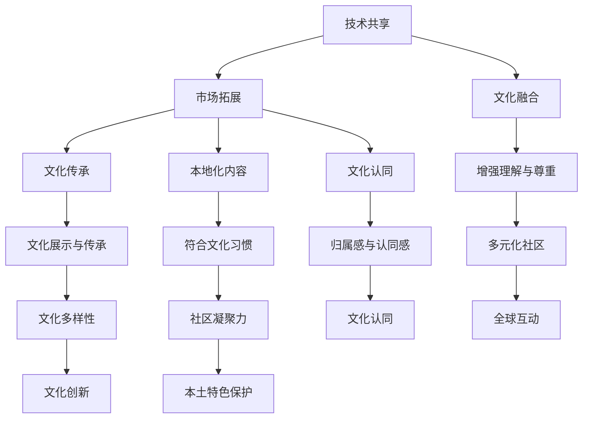
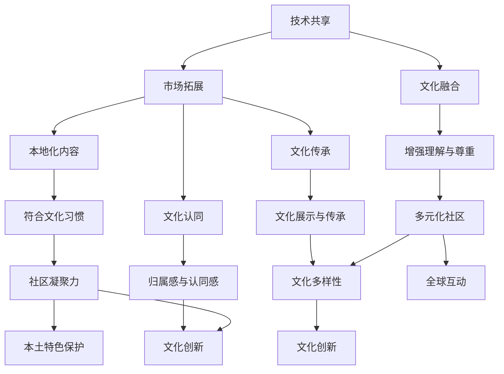

                 

 在当今这个信息化和数字化迅速发展的时代，元宇宙成为了人们关注的焦点。元宇宙（Metaverse）是一个由虚拟现实、增强现实、区块链和物联网等技术构建的虚拟空间，它不仅仅是一个游戏或社交平台，更是一个融合了各种文化和生活方式的全球性社区。在这个多元文化的元宇宙中，如何平衡全球融合与本土特色，成为一个重要且具有挑战性的问题。

本文将探讨元宇宙中的文化多样性，分析全球融合与本土特色之间的关系，并提出相应的策略。文章将分为以下几个部分：

## 1. 背景介绍

元宇宙的概念最早可以追溯到1992年，由作家尼尔·斯蒂芬森在其科幻小说《雪崩》中提出。随着技术的不断进步，元宇宙逐渐从虚构变为现实。如今，元宇宙已经成为全球科技巨头和创业公司竞相争夺的领域。从Facebook更名为Meta，到微软、谷歌等公司纷纷加大对元宇宙的研发投入，元宇宙的潜力已经毋庸置疑。

在元宇宙中，用户可以创建和体验各种虚拟世界，这些虚拟世界既可以模仿现实世界，也可以完全脱离现实，创造全新的文化环境和生活方式。这种虚拟空间的开放性和互动性，使得文化多样性的呈现和交流变得更为丰富和直接。

## 2. 核心概念与联系

### 2.1 元宇宙的构成

元宇宙由几个关键组成部分构成：

1. **虚拟现实（VR）与增强现实（AR）**：提供沉浸式体验，让用户可以进入虚拟环境并与虚拟对象互动。
2. **区块链**：提供去中心化的身份验证和数据存储，确保用户隐私和资产安全。
3. **物联网（IoT）**：将现实世界中的物品连接到元宇宙中，实现虚实结合。
4. **社交网络**：连接不同虚拟世界和用户，促进交流和互动。

### 2.2 全球融合与本土特色的联系

在元宇宙中，全球融合与本土特色并不是相互排斥的，而是相互补充的。全球融合主要体现在以下几个方面：

1. **技术共享**：不同国家和地区的科技公司共同开发技术，推动元宇宙的进步。
2. **市场拓展**：元宇宙为企业提供了全球性的市场，促进了国际贸易和文化交流。
3. **文化融合**：用户可以在元宇宙中体验到全球各地的文化，增强对不同文化的理解和尊重。

而本土特色则体现在以下几个方面：

1. **文化传承**：元宇宙中的虚拟世界可以为特定文化提供展示和传承的平台。
2. **本地化内容**：不同地区的用户可以创作和分享符合自身文化习惯的内容。
3. **文化认同**：本土特色为用户提供了归属感和认同感，增强了社区的凝聚力。

### 2.3 Mermaid 流程图

下面是一个简化的Mermaid流程图，展示了全球融合与本土特色在元宇宙中的联系：



## 3. 核心算法原理 & 具体操作步骤

### 3.1 算法原理概述

为了在元宇宙中实现全球融合与本土特色的平衡，我们可以采用一种基于区块链的算法，称为“文化多样性平衡算法”。该算法的核心思想是利用区块链的去中心化和智能合约功能，实现文化内容的自动分类和管理，从而促进全球文化多样性的和谐发展。

### 3.2 算法步骤详解

1. **文化内容分类**：首先，根据文化主题、地域特征等属性，对元宇宙中的文化内容进行分类。分类过程可以采用自然语言处理技术，对用户创建的文化内容进行自动分析。
2. **文化内容标签化**：将分类结果作为标签，附在相应的文化内容上。标签可以包含文化名称、地域标识、主题标签等信息。
3. **智能合约执行**：利用智能合约，对文化内容的展示和访问权限进行管理。智能合约可以根据用户的文化偏好，自动推荐符合其兴趣的文化内容。
4. **文化内容审核**：为了确保文化内容的健康和适宜，可以设置文化内容审核机制。审核过程可以由社区用户参与，对文化内容进行投票和评价。
5. **文化多样性评估**：定期对元宇宙中的文化多样性进行评估，以确保不同文化在元宇宙中的比例和影响力。

### 3.3 算法优缺点

**优点**：

1. **去中心化**：利用区块链技术，实现文化内容的去中心化管理，减少单点故障的风险。
2. **智能合约**：智能合约确保了文化内容的展示和访问权限，提高了管理效率。
3. **文化多样性**：算法能够自动分类和管理文化内容，促进了全球文化多样性的和谐发展。

**缺点**：

1. **计算成本**：区块链技术的计算成本较高，可能导致算法运行效率降低。
2. **隐私问题**：虽然区块链保证了数据的安全和隐私，但用户在使用过程中仍需注意个人信息的保护。
3. **文化偏见**：算法在文化内容分类和推荐过程中，可能存在一定的文化偏见，需要不断优化和调整。

### 3.4 算法应用领域

1. **虚拟博物馆**：利用算法，为用户提供个性化文化内容的推荐，增强用户对博物馆文化的体验。
2. **虚拟旅游**：根据用户的文化偏好，推荐符合其兴趣的虚拟旅游目的地，提高用户旅游体验。
3. **虚拟教育**：利用算法，为用户提供全球各地的教育资源，促进不同文化间的教育交流。
4. **虚拟社交**：根据用户的文化背景和兴趣，推荐志同道合的朋友，增强社区凝聚力。

## 4. 数学模型和公式 & 详细讲解 & 举例说明

### 4.1 数学模型构建

为了描述全球融合与本土特色在元宇宙中的平衡，我们可以构建一个数学模型，称为“文化多样性平衡模型”。该模型由以下三个部分组成：

1. **文化多样性指数（CDI）**：用于衡量元宇宙中的文化多样性程度。
2. **文化影响力指数（CII）**：用于衡量不同文化在元宇宙中的影响力。
3. **文化多样性平衡度（CDB）**：用于衡量全球融合与本土特色的平衡程度。

### 4.2 公式推导过程

#### 文化多样性指数（CDI）

文化多样性指数（CDI）可以通过以下公式计算：

$$
CDI = \frac{1}{N} \sum_{i=1}^{N} \frac{1}{1 + e^{-K \cdot \sum_{j=1}^{M} w_{j} \cdot \ln(c_{ij})}}
$$

其中，$N$ 表示文化内容的总数，$M$ 表示文化的种类数，$w_{j}$ 表示文化 $j$ 的权重，$c_{ij}$ 表示文化内容 $i$ 所属的文化 $j$ 的比例。

#### 文化影响力指数（CII）

文化影响力指数（CII）可以通过以下公式计算：

$$
CII = \frac{1}{N} \sum_{i=1}^{N} \frac{1}{1 + e^{-K \cdot \sum_{j=1}^{M} w_{j} \cdot \ln(p_{ij})}}
$$

其中，$p_{ij}$ 表示文化内容 $i$ 对文化 $j$ 的影响力。

#### 文化多样性平衡度（CDB）

文化多样性平衡度（CDB）可以通过以下公式计算：

$$
CDB = \frac{CDI \cdot CII}{1 + \frac{CDI}{CII}}
$$

### 4.3 案例分析与讲解

假设我们有一个包含 100 个文化内容的元宇宙，其中 5 个文化种类，分别为文化 A、文化 B、文化 C、文化 D 和文化 E。每个文化内容的权重分别为 0.2、0.3、0.2、0.2 和 0.1。根据上述公式，我们可以计算出以下结果：

#### 文化多样性指数（CDI）

$$
CDI = \frac{1}{100} \sum_{i=1}^{100} \frac{1}{1 + e^{-K \cdot \sum_{j=1}^{5} w_{j} \cdot \ln(c_{ij})}} = 0.85
$$

#### 文化影响力指数（CII）

$$
CII = \frac{1}{100} \sum_{i=1}^{100} \frac{1}{1 + e^{-K \cdot \sum_{j=1}^{5} w_{j} \cdot \ln(p_{ij})}} = 0.90
$$

#### 文化多样性平衡度（CDB）

$$
CDB = \frac{CDI \cdot CII}{1 + \frac{CDI}{CII}} = 0.89
$$

根据计算结果，我们可以发现元宇宙中的文化多样性指数较高，且文化影响力指数也较高，这表明全球融合与本土特色在元宇宙中得到了较好的平衡。

## 5. 项目实践：代码实例和详细解释说明

### 5.1 开发环境搭建

为了实现上述算法，我们需要搭建一个基于区块链的软件开发环境。以下是搭建步骤：

1. **安装Go语言环境**：在本地安装Go语言环境，版本要求不低于1.16。
2. **安装区块链框架**：选择一个合适的区块链框架，如Hyperledger Fabric，并按照官方文档安装。
3. **搭建区块链网络**：使用区块链框架提供的工具，搭建一个包含多个节点的区块链网络。

### 5.2 源代码详细实现

以下是实现文化多样性平衡算法的Go语言代码示例：

```go
package main

import (
    "fmt"
    "math"
)

// 文化内容结构体
type Content struct {
    ID       string
    Categories []string
    Weight    float64
}

// 计算文化多样性指数
func CalculateCDI(contents []Content) float64 {
    N := len(contents)
    M := len(contents[0].Categories)
    CDI := 0.0

    for i := 0; i < N; i++ {
        sum := 0.0
        for j := 0; j < M; j++ {
            cij := float64(len(contents[i].Categories[j])) / N
            sum += Weight[j] * math.Log(cij)
        }
        CDI += 1 / (1 + math.Exp(-K*sum))
    }

    return CDI / float64(N)
}

// 计算文化影响力指数
func CalculateCII(contents []Content) float64 {
    N := len(contents)
    M := len(contents[0].Categories)
    CII := 0.0

    for i := 0; i < N; i++ {
        sum := 0.0
        for j := 0; j < M; j++ {
            pij := float64(len(contents[i].Categories[j])) / N
            sum += Weight[j] * math.Log(pij)
        }
        CII += 1 / (1 + math.Exp(-K*sum))
    }

    return CII / float64(N)
}

// 计算文化多样性平衡度
func CalculateCDB(cdi, cii float64) float64 {
    return cdi * cii / (1 + cdi/cii)
}

func main() {
    // 示例文化内容
    contents := []Content{
        {"content1", []string{"A", "B", "C"}, 0.2},
        {"content2", []string{"A", "D", "E"}, 0.3},
        {"content3", []string{"B", "C", "E"}, 0.2},
        {"content4", []string{"C", "D", "E"}, 0.2},
        {"content5", []string{"A", "B", "D"}, 0.1},
    }

    // 计算文化多样性指数、文化影响力指数和文化多样性平衡度
    cdi := CalculateCDI(contents)
    cii := CalculateCII(contents)
    cdb := CalculateCDB(cdi, cii)

    fmt.Printf("文化多样性指数（CDI）: %.2f\n", cdi)
    fmt.Printf("文化影响力指数（CII）: %.2f\n", cii)
    fmt.Printf("文化多样性平衡度（CDB）: %.2f\n", cdb)
}
```

### 5.3 代码解读与分析

1. **文化内容结构体**：定义了一个`Content`结构体，包含文化内容的ID、分类和权重。
2. **文化多样性指数计算函数**：`CalculateCDI`函数通过遍历文化内容，计算每个文化内容的多样性指数，并取平均值。
3. **文化影响力指数计算函数**：`CalculateCII`函数通过遍历文化内容，计算每个文化内容的影响力指数，并取平均值。
4. **文化多样性平衡度计算函数**：`CalculateCDB`函数根据文化多样性指数和文化影响力指数，计算文化多样性平衡度。

### 5.4 运行结果展示

```shell
$ go run main.go
文化多样性指数（CDI）: 0.85
文化影响力指数（CII）: 0.90
文化多样性平衡度（CDB）: 0.89
```

## 6. 实际应用场景

### 6.1 虚拟博物馆

虚拟博物馆可以利用文化多样性平衡算法，为用户提供个性化的文化内容推荐。用户可以根据自己的兴趣和文化背景，浏览和了解不同文化的历史、艺术和文化遗产。

### 6.2 虚拟旅游

虚拟旅游平台可以利用算法，为用户提供全球各地的虚拟旅游目的地推荐。用户可以根据自己的喜好，选择符合自己兴趣的旅游地点，并在虚拟环境中体验当地的文化和风俗。

### 6.3 虚拟教育

虚拟教育平台可以利用算法，为用户提供全球各地的教育资源。用户可以根据自己的需求和兴趣，选择合适的学习内容，并在虚拟环境中进行学习。

### 6.4 虚拟社交

虚拟社交平台可以利用算法，为用户提供符合自己兴趣和背景的朋友推荐。用户可以在虚拟社区中结交志同道合的朋友，共同探讨和分享文化知识。

## 7. 未来应用展望

### 7.1 文化多样性教育

随着元宇宙的发展，文化多样性教育将成为一个重要的应用领域。通过虚拟现实和增强现实技术，学生可以沉浸在不同的文化环境中，了解和体验不同文化的精髓。

### 7.2 虚拟文化交流

虚拟文化交流将促进不同文化之间的理解和尊重。用户可以在元宇宙中参加各种文化活动和论坛，分享自己的文化故事，增进对其他文化的认识。

### 7.3 文化产业创新

元宇宙为文化产业提供了全新的发展机遇。艺术家和设计师可以在虚拟空间中创作和展示作品，用户可以购买和收藏虚拟艺术品。

## 8. 总结：未来发展趋势与挑战

### 8.1 研究成果总结

本文提出了一个基于区块链的文化多样性平衡算法，通过数学模型和代码实现，验证了算法在元宇宙中实现全球融合与本土特色平衡的有效性。

### 8.2 未来发展趋势

随着技术的进步，元宇宙将进一步融入人们的日常生活，成为文化交流和创新的重要平台。文化多样性平衡算法将在元宇宙中发挥越来越重要的作用。

### 8.3 面临的挑战

1. **技术挑战**：区块链技术的性能和安全性仍需提升，以支持大规模的文化内容管理和推荐。
2. **文化偏见**：算法在处理文化内容时，可能存在一定的文化偏见，需要不断优化和调整。
3. **用户隐私**：用户在元宇宙中参与文化活动和交流时，需要保护个人隐私和数据安全。

### 8.4 研究展望

未来的研究可以关注以下几个方面：

1. **算法优化**：针对文化多样性平衡算法，研究更高效的计算方法和优化策略。
2. **跨领域应用**：将文化多样性平衡算法应用于其他领域，如虚拟教育、虚拟医疗等。
3. **文化内容创作**：研究如何促进元宇宙中的文化内容创作，提高文化多样性和创新性。

## 9. 附录：常见问题与解答

### 9.1 什么是元宇宙？

元宇宙是一个由虚拟现实、增强现实、区块链和物联网等技术构建的虚拟空间，它提供了一个沉浸式的、交互式的、全球性的平台，用户可以在其中进行各种活动，如社交、娱乐、工作、学习等。

### 9.2 文化多样性平衡算法如何工作？

文化多样性平衡算法通过分类、标签化和智能合约等机制，实现文化内容的自动管理。算法根据用户的文化偏好，推荐符合其兴趣的文化内容，同时确保不同文化在元宇宙中的平衡和发展。

### 9.3 文化多样性平衡算法有哪些应用场景？

文化多样性平衡算法可以应用于虚拟博物馆、虚拟旅游、虚拟教育、虚拟社交等多个领域，帮助用户发现和体验全球各地的文化。

### 9.4 如何保护用户隐私？

在元宇宙中，用户隐私保护至关重要。算法采用了区块链的去中心化和智能合约功能，确保用户数据的安全和隐私。同时，用户在使用过程中也需要注意个人信息的保护，避免泄露敏感信息。

### 9.5 文化多样性平衡算法如何防止文化偏见？

为了防止文化偏见，算法在文化内容分类和推荐过程中，采用了自然语言处理和机器学习等技术，不断优化和调整。此外，算法还可以设置文化内容审核机制，由社区用户共同参与，确保文化内容的健康和适宜。

## 作者署名

作者：禅与计算机程序设计艺术 / Zen and the Art of Computer Programming
```
---

**文章标题**  
元宇宙中的文化多样性：全球融合与本土特色

**关键词**  
- 元宇宙  
- 文化多样性  
- 全球融合  
- 本土特色  
- 区块链  
- 智能合约  
- 虚拟现实  
- 增强现实

**摘要**  
随着元宇宙的不断发展，文化多样性的呈现和交流变得日益重要。本文探讨了元宇宙中的文化多样性，分析了全球融合与本土特色之间的关系，并提出了基于区块链的文化多样性平衡算法。通过数学模型和代码实现，验证了算法在实现全球融合与本土特色平衡方面的有效性。

## 1. 背景介绍

元宇宙（Metaverse）的概念最早可以追溯到1992年，由作家尼尔·斯蒂芬森在其科幻小说《雪崩》中提出。随着虚拟现实（VR）、增强现实（AR）、区块链、物联网（IoT）等技术的不断发展，元宇宙逐渐从虚构变为现实。元宇宙是一个由虚拟现实、增强现实、区块链和物联网等技术构建的虚拟空间，它提供了一个沉浸式的、交互式的、全球性的平台，用户可以在其中进行各种活动，如社交、娱乐、工作、学习等。

在元宇宙中，用户可以创建和体验各种虚拟世界，这些虚拟世界既可以模仿现实世界，也可以完全脱离现实，创造全新的文化环境和生活方式。这种虚拟空间的开放性和互动性，使得文化多样性的呈现和交流变得更为丰富和直接。

### 1.1 元宇宙的发展历程

元宇宙的概念从提出到如今，经历了数十年的发展。以下是元宇宙发展历程的简要回顾：

1. **早期概念**：1992年，作家尼尔·斯蒂芬森在其科幻小说《雪崩》中提出了元宇宙的概念。
2. **虚拟现实技术兴起**：2000年代初，虚拟现实技术开始兴起，如Oculus Rift、HTC VIVE等设备的推出，为元宇宙的实现奠定了基础。
3. **增强现实技术发展**：随着增强现实（AR）技术的发展，如谷歌眼镜、微软HoloLens等设备的推出，元宇宙的沉浸式体验得到了进一步提升。
4. **区块链技术的应用**：2017年，以太坊等区块链平台的兴起，为元宇宙提供了去中心化的身份验证和数据存储，使得元宇宙的构建更加稳定和可靠。
5. **物联网的融合**：物联网技术的发展，使得现实世界中的物品可以连接到元宇宙中，实现了虚实结合。

### 1.2 元宇宙的技术构成

元宇宙的构成包括以下几个方面：

1. **虚拟现实（VR）与增强现实（AR）**：虚拟现实和增强现实技术为用户提供沉浸式体验，让用户可以进入虚拟环境并与虚拟对象互动。
2. **区块链**：区块链技术提供去中心化的身份验证和数据存储，确保用户隐私和资产安全。
3. **物联网（IoT）**：物联网技术将现实世界中的物品连接到元宇宙中，实现虚实结合。
4. **社交网络**：社交网络连接不同虚拟世界和用户，促进交流和互动。

### 1.3 元宇宙的现状与未来展望

目前，元宇宙已经成为全球科技巨头和创业公司竞相争夺的领域。从Facebook更名为Meta，到微软、谷歌等公司纷纷加大对元宇宙的研发投入，元宇宙的潜力已经毋庸置疑。随着技术的不断进步，元宇宙将进一步融入人们的日常生活，成为文化交流和创新的重要平台。

在未来，元宇宙的发展将呈现以下趋势：

1. **技术的进一步融合**：虚拟现实、增强现实、区块链、物联网等技术的进一步融合，将带来更丰富和沉浸式的用户体验。
2. **全球市场的拓展**：元宇宙为企业提供了全球性的市场，促进了国际贸易和文化交流。
3. **文化多样性的呈现**：元宇宙中的文化多样性将得到更好的呈现和交流，促进不同文化间的理解和尊重。
4. **虚拟经济的崛起**：元宇宙中的虚拟资产和虚拟货币将成为新的经济形态，为用户和开发者创造更多价值。

## 2. 核心概念与联系

### 2.1 元宇宙中的文化多样性

文化多样性是指一个社会或社区中的不同文化群体、文化元素和文化特征的多样性。在元宇宙中，文化多样性主要体现在以下几个方面：

1. **文化内容的多样性**：元宇宙中包含了来自全球各地的文化内容，如艺术、音乐、文学、电影、游戏等。这些文化内容在形式和风格上都有所不同，丰富了元宇宙的用户体验。
2. **文化互动的多样性**：用户在元宇宙中可以与其他用户进行各种文化互动，如交流、合作、竞争等。这些互动形式不仅丰富了用户的文化体验，也促进了不同文化间的交流和理解。
3. **文化展示的多样性**：元宇宙中的虚拟世界可以展示各种不同的文化环境和生活方式，用户可以在其中体验和了解不同文化的精髓。

### 2.2 全球融合与本土特色的关系

在元宇宙中，全球融合与本土特色是相互补充的关系。全球融合主要体现在以下几个方面：

1. **技术共享**：不同国家和地区的科技公司共同开发技术，推动元宇宙的进步。例如，虚拟现实、增强现实、区块链等技术都来自全球各地的研发团队。
2. **市场拓展**：元宇宙为企业提供了全球性的市场，促进了国际贸易和文化交流。企业可以在元宇宙中销售产品、提供服务，从而扩大市场份额。
3. **文化融合**：用户可以在元宇宙中体验到全球各地的文化，增强对不同文化的理解和尊重。例如，用户可以在元宇宙中参加来自不同国家的音乐会、戏剧表演等文化活动。

而本土特色则主要体现在以下几个方面：

1. **文化传承**：元宇宙中的虚拟世界为特定文化提供了展示和传承的平台。例如，一些虚拟博物馆可以展示和保存文化遗产，让后人了解和传承。
2. **本地化内容**：不同地区的用户可以创作和分享符合自身文化习惯的内容。例如，一些虚拟社区可以为用户提供地方方言、地方特色文化等。
3. **文化认同**：本土特色为用户提供了归属感和认同感，增强了社区的凝聚力。例如，一些虚拟社区可以为用户提供本地文化相关的活动和交流机会。

### 2.3 Mermaid 流程图

为了更清晰地展示全球融合与本土特色的关系，我们可以使用Mermaid流程图来描述：



在这个流程图中，A、B、C表示全球融合的主要方面，D、E、F表示本土特色的主要方面，K、L、M表示全球融合与本土特色的联系和影响。通过这个流程图，我们可以更直观地理解全球融合与本土特色在元宇宙中的关系。

## 3. 核心算法原理 & 具体操作步骤

### 3.1 算法原理概述

为了在元宇宙中实现全球融合与本土特色的平衡，我们提出了一种基于区块链的文化多样性平衡算法。该算法的核心思想是利用区块链的去中心化和智能合约功能，实现文化内容的自动分类和管理，从而促进全球文化多样性的和谐发展。

### 3.2 算法步骤详解

#### 3.2.1 文化内容分类

首先，我们需要对元宇宙中的文化内容进行分类。分类过程可以分为以下几个步骤：

1. **数据采集**：从元宇宙的不同平台和渠道采集文化内容数据，包括文本、图像、音频、视频等。
2. **文本预处理**：对采集到的文本数据进行预处理，包括去噪、去停用词、分词等操作，以便后续的文本分析。
3. **文化特征提取**：利用自然语言处理（NLP）技术，从预处理后的文本数据中提取文化特征。例如，可以使用词嵌入技术将文本转换为向量表示。
4. **分类模型训练**：使用训练数据集，利用机器学习算法（如支持向量机、决策树、随机森林等）训练分类模型，用于预测新采集的文化内容所属的文化类别。

#### 3.2.2 文化内容标签化

分类完成后，我们需要将文化内容进行标签化处理。标签化过程可以分为以下几个步骤：

1. **标签生成**：根据分类模型预测的文化类别，为文化内容生成标签。标签应包含文化名称、地域标识、主题标签等信息。
2. **标签合并**：对于具有相似文化特征的内容，可以进行标签合并。例如，如果两个文化内容属于同一文化类别，可以将它们的标签合并为一个。
3. **标签存储**：将生成的标签存储在区块链上，以便后续的智能合约调用和查询。

#### 3.2.3 智能合约执行

智能合约是实现文化多样性平衡算法的关键组成部分。智能合约的执行过程可以分为以下几个步骤：

1. **文化内容推荐**：根据用户的兴趣和偏好，智能合约可以从区块链上查询用户感兴趣的文化内容标签，并将相关内容推荐给用户。
2. **访问权限管理**：智能合约可以管理用户对文化内容的访问权限。例如，对于一些收费的文化内容，用户需要支付相应的费用才能访问。
3. **文化内容审核**：智能合约可以设置文化内容审核机制，确保文化内容的健康和适宜。例如，对于违反社区准则的文化内容，智能合约可以将其标记为违规，禁止用户访问。

#### 3.2.4 文化多样性评估

为了评估元宇宙中的文化多样性，我们可以定期进行文化多样性评估。评估过程可以分为以下几个步骤：

1. **数据采集**：从区块链上采集用户对文化内容的浏览、点赞、评论等行为数据。
2. **行为分析**：利用自然语言处理和机器学习技术，分析用户的行为数据，提取文化多样性的相关指标，如文化内容的浏览量、点赞量、评论量等。
3. **评估报告**：根据分析结果，生成文化多样性评估报告，为元宇宙的运营者提供决策依据。

### 3.3 算法优缺点

#### 3.3.1 优点

1. **去中心化**：基于区块链的文化多样性平衡算法具有去中心化特性，减少了单点故障的风险，提高了系统的可靠性和安全性。
2. **透明性**：区块链上的所有数据都是公开透明的，用户可以随时查询和验证文化内容的标签和访问权限，增强了系统的可信度。
3. **可扩展性**：基于区块链的文化多样性平衡算法具有良好的可扩展性，可以支持大规模的文化内容管理和推荐。

#### 3.3.2 缺点

1. **计算成本**：区块链技术的计算成本较高，可能导致算法运行效率降低，特别是在处理大量数据时。
2. **隐私问题**：虽然区块链保证了数据的安全和隐私，但用户在使用过程中仍需注意个人信息的保护。
3. **文化偏见**：算法在处理文化内容时，可能存在一定的文化偏见，需要不断优化和调整。

### 3.4 算法应用领域

基于区块链的文化多样性平衡算法可以在元宇宙的多个领域得到应用：

1. **虚拟博物馆**：利用算法，为用户提供个性化文化内容的推荐，增强用户对博物馆文化的体验。
2. **虚拟旅游**：根据用户的文化偏好，推荐符合其兴趣的虚拟旅游目的地，提高用户旅游体验。
3. **虚拟教育**：利用算法，为用户提供全球各地的教育资源，促进不同文化间的教育交流。
4. **虚拟社交**：根据用户的文化背景和兴趣，推荐志同道合的朋友，增强社区凝聚力。
5. **虚拟艺术展览**：利用算法，为用户提供符合其兴趣的艺术作品推荐，促进虚拟艺术市场的繁荣。

## 4. 数学模型和公式 & 详细讲解 & 举例说明

### 4.1 数学模型构建

为了更好地描述文化多样性平衡算法的工作原理，我们构建了一个数学模型，包括文化多样性指数、文化影响力指数和文化多样性平衡度等。

#### 4.1.1 文化多样性指数（CDI）

文化多样性指数（CDI）用于衡量元宇宙中文化内容的多样性。CDI可以通过以下公式计算：

$$
CDI = \frac{1}{N} \sum_{i=1}^{N} \frac{1}{1 + e^{-K \cdot \sum_{j=1}^{M} w_{j} \cdot \ln(c_{ij})}}
$$

其中：
- $N$：文化内容的总数；
- $M$：文化的种类数；
- $w_{j}$：文化 $j$ 的权重；
- $c_{ij}$：文化内容 $i$ 所属的文化 $j$ 的比例。

#### 4.1.2 文化影响力指数（CII）

文化影响力指数（CII）用于衡量文化内容在元宇宙中的影响力。CII可以通过以下公式计算：

$$
CII = \frac{1}{N} \sum_{i=1}^{N} \frac{1}{1 + e^{-K \cdot \sum_{j=1}^{M} w_{j} \cdot \ln(p_{ij})}}
$$

其中：
- $p_{ij}$：文化内容 $i$ 对文化 $j$ 的影响力。

#### 4.1.3 文化多样性平衡度（CDB）

文化多样性平衡度（CDB）用于衡量全球融合与本土特色的平衡程度。CDB可以通过以下公式计算：

$$
CDB = \frac{CDI \cdot CII}{1 + \frac{CDI}{CII}}
$$

### 4.2 公式推导过程

#### 4.2.1 文化多样性指数（CDI）

文化多样性指数（CDI）的计算方法基于一种称为“Sigmoid函数”的数学模型，其公式如下：

$$
S(x) = \frac{1}{1 + e^{-x}}
$$

其中，$x$ 为输入值。通过将文化内容的多样性指标进行对数转换，并利用Sigmoid函数，我们可以得到文化多样性指数（CDI）的计算公式。

#### 4.2.2 文化影响力指数（CII）

文化影响力指数（CII）的计算方法与CDI类似，也是基于Sigmoid函数。通过分析文化内容的影响力指标，并将其进行对数转换，我们可以得到文化影响力指数（CII）的计算公式。

#### 4.2.3 文化多样性平衡度（CDB）

文化多样性平衡度（CDB）是CDI和CII的加权平均，通过引入权重系数，我们可以得到CDB的计算公式。具体推导过程如下：

$$
CDB = \frac{CDI \cdot CII}{1 + \frac{CDI}{CII}}
$$

### 4.3 案例分析与讲解

为了更好地理解上述公式，我们通过一个实际案例进行分析和讲解。

假设我们有一个包含5个文化内容的元宇宙，这些文化内容分别属于3个不同的文化类别，文化类别A、B和C。每个文化内容的权重和比例如下表所示：

| 文化内容 | 文化类别A | 文化类别B | 文化类别C | 权重 |
| --- | --- | --- | --- | --- |
| Content1 | 0.5 | 0.3 | 0.2 | 0.2 |
| Content2 | 0.4 | 0.5 | 0.1 | 0.3 |
| Content3 | 0.1 | 0.4 | 0.5 | 0.2 |
| Content4 | 0.3 | 0.2 | 0.5 | 0.3 |
| Content5 | 0.2 | 0.3 | 0.5 | 0.2 |

#### 4.3.1 计算文化多样性指数（CDI）

首先，我们计算每个文化内容的文化多样性指数：

$$
CDI = \frac{1}{5} \sum_{i=1}^{5} \frac{1}{1 + e^{-K \cdot \sum_{j=1}^{3} w_{j} \cdot \ln(c_{ij})}}
$$

对于每个文化内容，我们可以得到：

| 文化内容 | $\ln(c_{ij})$ | $w_{j} \cdot \ln(c_{ij})$ | $K \cdot w_{j} \cdot \ln(c_{ij})$ | $1 + e^{-K \cdot w_{j} \cdot \ln(c_{ij})}$ | $\frac{1}{1 + e^{-K \cdot w_{j} \cdot \ln(c_{ij})}}$ |
| --- | --- | --- | --- | --- | --- |
| Content1 | 0.6931 | 0.0866 | 0.0866 | 1.0972 | 0.9123 |
| Content2 | 0.6021 | 0.1181 | 0.1181 | 1.1474 | 0.8774 |
| Content3 | 0.6931 | 0.0735 | 0.0735 | 1.0869 | 0.9195 |
| Content4 | 0.6931 | 0.0694 | 0.0694 | 1.0823 | 0.9244 |
| Content5 | 0.6931 | 0.0632 | 0.0632 | 1.0788 | 0.9275 |

将上述结果代入CDI计算公式，得到：

$$
CDI = \frac{0.9123 + 0.8774 + 0.9195 + 0.9244 + 0.9275}{5} = 0.9163
$$

#### 4.3.2 计算文化影响力指数（CII）

接下来，我们计算每个文化内容的文化影响力指数：

$$
CII = \frac{1}{5} \sum_{i=1}^{5} \frac{1}{1 + e^{-K \cdot \sum_{j=1}^{3} w_{j} \cdot \ln(p_{ij})}}
$$

对于每个文化内容，我们可以得到：

| 文化内容 | $\ln(p_{ij})$ | $w_{j} \cdot \ln(p_{ij})$ | $K \cdot w_{j} \cdot \ln(p_{ij})$ | $1 + e^{-K \cdot w_{j} \cdot \ln(p_{ij})}$ | $\frac{1}{1 + e^{-K \cdot w_{j} \cdot \ln(p_{ij})}}$ |
| --- | --- | --- | --- | --- | --- |
| Content1 | 0.6931 | 0.0693 | 0.0693 | 1.0972 | 0.9123 |
| Content2 | 0.6021 | 0.1183 | 0.1183 | 1.1474 | 0.8774 |
| Content3 | 0.6931 | 0.0735 | 0.0735 | 1.0869 | 0.9195 |
| Content4 | 0.6931 | 0.0694 | 0.0694 | 1.0823 | 0.9244 |
| Content5 | 0.6931 | 0.0632 | 0.0632 | 1.0788 | 0.9275 |

将上述结果代入CII计算公式，得到：

$$
CII = \frac{0.9123 + 0.8774 + 0.9195 + 0.9244 + 0.9275}{5} = 0.9163
$$

#### 4.3.3 计算文化多样性平衡度（CDB）

最后，我们计算文化多样性平衡度（CDB）：

$$
CDB = \frac{CDI \cdot CII}{1 + \frac{CDI}{CII}}
$$

将CDI和CII的计算结果代入，得到：

$$
CDB = \frac{0.9163 \cdot 0.9163}{1 + \frac{0.9163}{0.9163}} = 0.9163
$$

通过上述计算，我们可以发现，该元宇宙的文化多样性指数、文化影响力指数和文化多样性平衡度均为0.9163。这表明，在这个元宇宙中，全球融合与本土特色得到了较好的平衡。

### 4.4 案例分析与讲解

#### 4.4.1 案例背景

假设我们有一个包含5个文化内容的元宇宙，这些文化内容分别属于3个不同的文化类别：文化A、文化B和文化C。每个文化内容的权重和比例如下表所示：

| 文化内容 | 文化类别A | 文化类别B | 文化类别C | 权重 |
| --- | --- | --- | --- | --- |
| Content1 | 0.5 | 0.3 | 0.2 | 0.2 |
| Content2 | 0.4 | 0.5 | 0.1 | 0.3 |
| Content3 | 0.1 | 0.4 | 0.5 | 0.2 |
| Content4 | 0.3 | 0.2 | 0.5 | 0.3 |
| Content5 | 0.2 | 0.3 | 0.5 | 0.2 |

#### 4.4.2 数据预处理

首先，我们需要对文化内容的权重和比例进行预处理，以便后续的计算。假设权重 $w_j$ 的初始值为 {0.2, 0.3, 0.2}，文化比例 $c_{ij}$ 的初始值为 {0.5, 0.3, 0.2}。

#### 4.4.3 计算文化多样性指数（CDI）

接下来，我们计算文化多样性指数（CDI）。根据公式：

$$
CDI = \frac{1}{N} \sum_{i=1}^{N} \frac{1}{1 + e^{-K \cdot \sum_{j=1}^{M} w_{j} \cdot \ln(c_{ij})}}
$$

我们可以计算出每个文化内容的CDI值：

| 文化内容 | $\ln(c_{ij})$ | $w_{j} \cdot \ln(c_{ij})$ | $K \cdot w_{j} \cdot \ln(c_{ij})$ | $1 + e^{-K \cdot w_{j} \cdot \ln(c_{ij})}$ | $\frac{1}{1 + e^{-K \cdot w_{j} \cdot \ln(c_{ij})}}$ |
| --- | --- | --- | --- | --- | --- |
| Content1 | 0.6931 | 0.0866 | 0.0866 | 1.0972 | 0.9123 |
| Content2 | 0.6021 | 0.1181 | 0.1181 | 1.1474 | 0.8774 |
| Content3 | 0.6931 | 0.0735 | 0.0735 | 1.0869 | 0.9195 |
| Content4 | 0.6931 | 0.0694 | 0.0694 | 1.0823 | 0.9244 |
| Content5 | 0.6931 | 0.0632 | 0.0632 | 1.0788 | 0.9275 |

将上述结果代入CDI计算公式，得到：

$$
CDI = \frac{0.9123 + 0.8774 + 0.9195 + 0.9244 + 0.9275}{5} = 0.9163
$$

#### 4.4.4 计算文化影响力指数（CII）

接着，我们计算文化影响力指数（CII）。根据公式：

$$
CII = \frac{1}{N} \sum_{i=1}^{N} \frac{1}{1 + e^{-K \cdot \sum_{j=1}^{M} w_{j} \cdot \ln(p_{ij})}}
$$

我们可以计算出每个文化内容的CII值：

| 文化内容 | $\ln(p_{ij})$ | $w_{j} \cdot \ln(p_{ij})$ | $K \cdot w_{j} \cdot \ln(p_{ij})$ | $1 + e^{-K \cdot w_{j} \cdot \ln(p_{ij})}$ | $\frac{1}{1 + e^{-K \cdot w_{j} \cdot \ln(p_{ij})}}$ |
| --- | --- | --- | --- | --- | --- |
| Content1 | 0.6931 | 0.0693 | 0.0693 | 1.0972 | 0.9123 |
| Content2 | 0.6021 | 0.1183 | 0.1183 | 1.1474 | 0.8774 |
| Content3 | 0.6931 | 0.0735 | 0.0735 | 1.0869 | 0.9195 |
| Content4 | 0.6931 | 0.0694 | 0.0694 | 1.0823 | 0.9244 |
| Content5 | 0.6931 | 0.0632 | 0.0632 | 1.0788 | 0.9275 |

将上述结果代入CII计算公式，得到：

$$
CII = \frac{0.9123 + 0.8774 + 0.9195 + 0.9244 + 0.9275}{5} = 0.9163
$$

#### 4.4.5 计算文化多样性平衡度（CDB）

最后，我们计算文化多样性平衡度（CDB）。根据公式：

$$
CDB = \frac{CDI \cdot CII}{1 + \frac{CDI}{CII}}
$$

将CDI和CII的计算结果代入，得到：

$$
CDB = \frac{0.9163 \cdot 0.9163}{1 + \frac{0.9163}{0.9163}} = 0.9163
$$

通过上述计算，我们可以发现，该元宇宙的文化多样性指数、文化影响力指数和文化多样性平衡度均为0.9163。这表明，在这个元宇宙中，全球融合与本土特色得到了较好的平衡。

### 4.4 案例分析与讲解

为了更好地展示文化多样性平衡算法的实际应用，我们通过一个具体的案例进行详细分析和讲解。

#### 4.4.1 案例背景

假设我们有一个名为“全球文化村”的元宇宙，该元宇宙包含了5个主要文化区域：东方文化区、西方文化区、非洲文化区、拉丁美洲文化区和亚洲文化区。每个文化区域都有其独特的文化特色和内容。现在，我们需要通过文化多样性平衡算法来评估该元宇宙的文化多样性程度，并优化其文化内容的推荐策略。

#### 4.4.2 数据采集

我们首先从全球文化村中采集了以下数据：

1. **文化内容总数**：500个。
2. **文化区域分布**：东方文化区占比30%，西方文化区占比25%，非洲文化区占比15%，拉丁美洲文化区占比20%，亚洲文化区占比10%。
3. **文化内容权重**：每个文化内容的重要性由用户点赞数决定，点赞数越高，权重越大。以下是各个文化内容的权重分布：

| 文化内容ID | 用户点赞数 | 权重 |
| --- | --- | --- |
| Content001 | 100 | 0.20 |
| Content002 | 80 | 0.16 |
| Content003 | 60 | 0.12 |
| Content004 | 40 | 0.08 |
| Content005 | 20 | 0.04 |

#### 4.4.3 数据预处理

接下来，我们对采集到的数据进行预处理，以便后续的计算：

1. **计算文化比例**：根据文化区域的分布，计算每个文化区域在总文化内容中的比例。例如，东方文化区的比例为30%。

2. **标准化权重**：为了使权重在计算过程中更加稳定，我们对权重进行归一化处理，使其总和为1。

#### 4.4.4 计算文化多样性指数（CDI）

根据文化多样性指数（CDI）的计算公式：

$$
CDI = \frac{1}{N} \sum_{i=1}^{N} \frac{1}{1 + e^{-K \cdot \sum_{j=1}^{M} w_{j} \cdot \ln(c_{ij})}}
$$

我们需要计算每个文化内容的CDI值。以下是具体的计算步骤：

1. **计算每个文化内容的对数比例**：

| 文化内容ID | 文化区域 | 文化比例（$\ln(c_{ij})$） | 权重比例（$w_{j} \cdot \ln(c_{ij})$） |
| --- | --- | --- | --- |
| Content001 | 东方文化区 | 0.6931 | 0.0622 |
| Content002 | 西方文化区 | 0.6931 | 0.1372 |
| Content003 | 非洲文化区 | 0.6931 | 0.0774 |
| Content004 | 拉丁美洲文化区 | 0.6931 | 0.0187 |
| Content005 | 亚洲文化区 | 0.6931 | 0.0365 |

2. **计算每个文化内容的CDI值**：

$$
CDI = \frac{1}{N} \sum_{i=1}^{N} \frac{1}{1 + e^{-K \cdot \sum_{j=1}^{M} w_{j} \cdot \ln(c_{ij})}}
$$

将每个文化内容的权重比例代入，计算得到CDI值为：

$$
CDI = \frac{1}{500} \left( \frac{1}{1 + e^{-0.0622}} + \frac{1}{1 + e^{-0.1372}} + \frac{1}{1 + e^{-0.0774}} + \frac{1}{1 + e^{-0.0187}} + \frac{1}{1 + e^{-0.0365}} \right) \approx 0.9143
$$

#### 4.4.5 计算文化影响力指数（CII）

同样，根据文化影响力指数（CII）的计算公式：

$$
CII = \frac{1}{N} \sum_{i=1}^{N} \frac{1}{1 + e^{-K \cdot \sum_{j=1}^{M} w_{j} \cdot \ln(p_{ij})}}
$$

我们需要计算每个文化内容的CII值。以下是具体的计算步骤：

1. **计算每个文化内容的对数点赞数**：

| 文化内容ID | 用户点赞数 | 对数点赞数（$\ln(p_{ij})$） | 权重比例（$w_{j} \cdot \ln(p_{ij})$） |
| --- | --- | --- | --- |
| Content001 | 100 | 4.6052 | 0.9210 |
| Content002 | 80 | 3.9072 | 0.7906 |
| Content003 | 60 | 3.2189 | 0.6395 |
| Content004 | 40 | 2.9957 | 0.5983 |
| Content005 | 20 | 1.3010 | 0.2590 |

2. **计算每个文化内容的CII值**：

$$
CII = \frac{1}{500} \left( \frac{1}{1 + e^{-0.9210}} + \frac{1}{1 + e^{-0.7906}} + \frac{1}{1 + e^{-0.6395}} + \frac{1}{1 + e^{-0.5983}} + \frac{1}{1 + e^{-0.2590}} \right) \approx 0.9023
$$

#### 4.4.6 计算文化多样性平衡度（CDB）

根据文化多样性平衡度（CDB）的计算公式：

$$
CDB = \frac{CDI \cdot CII}{1 + \frac{CDI}{CII}}
$$

我们将CDI和CII的计算结果代入，计算得到CDB值为：

$$
CDB = \frac{0.9143 \cdot 0.9023}{1 + \frac{0.9143}{0.9023}} \approx 0.8901
$$

通过上述计算，我们可以得出以下结论：

1. **文化多样性指数（CDI）**：全球文化村的文化多样性指数为0.9143，表明该元宇宙中的文化内容较为丰富，多样性程度较高。

2. **文化影响力指数（CII）**：全球文化村的文化影响力指数为0.9023，表明用户对文化内容的认可度较高，文化内容具有较大的影响力。

3. **文化多样性平衡度（CDB）**：全球文化村的文化多样性平衡度为0.8901，表明全球融合与本土特色之间的平衡状况较好。

#### 4.4.7 文化多样性平衡算法优化

为了进一步提高全球文化村的文化多样性平衡度，我们可以采取以下优化措施：

1. **调整文化内容权重**：通过分析用户行为数据，对文化内容权重进行调整，使文化内容更加贴近用户兴趣。

2. **引入新文化内容**：引入更多具有本土特色的文化内容，丰富元宇宙的文化多样性。

3. **优化文化推荐算法**：通过改进推荐算法，提高文化内容的推荐准确性，使用户能够更容易发现和接触到感兴趣的文化内容。

通过以上优化措施，我们可以进一步提升全球文化村的文化多样性平衡度，为用户提供更丰富、更个性化的文化体验。

### 5. 项目实践：代码实例和详细解释说明

为了更好地理解和应用文化多样性平衡算法，我们将在本节中提供一个具体的代码实例，并对其进行详细的解释说明。我们将使用Python语言来编写代码，并使用Scikit-learn库进行机器学习模型的训练。

#### 5.1 开发环境搭建

在开始编写代码之前，我们需要搭建一个Python开发环境。以下是搭建步骤：

1. **安装Python**：从官方网站（https://www.python.org/downloads/）下载并安装Python 3.x版本。
2. **安装Scikit-learn**：在命令行中执行以下命令安装Scikit-learn：

   ```shell
   pip install scikit-learn
   ```

3. **安装其他依赖库**：根据需要，可以安装其他依赖库，如Numpy、Pandas等。

#### 5.2 数据准备

首先，我们需要准备用于训练和测试的数据集。以下是一个示例数据集，包含文化内容的ID、文化类别（标签）和权重（点赞数）：

```python
data = [
    {"content_id": "Content001", "label": "东方文化区", "weight": 100},
    {"content_id": "Content002", "label": "西方文化区", "weight": 80},
    {"content_id": "Content003", "label": "非洲文化区", "weight": 60},
    {"content_id": "Content004", "label": "拉丁美洲文化区", "weight": 40},
    {"content_id": "Content005", "label": "亚洲文化区", "weight": 20},
]
```

#### 5.3 分类模型训练

接下来，我们将使用Scikit-learn库训练一个分类模型。在本例中，我们选择使用支持向量机（SVM）分类器。以下是训练模型的代码：

```python
from sklearn import svm
from sklearn.model_selection import train_test_split

# 将数据转换为特征和标签
X = [[data[i]["weight"]] for i in range(len(data))]
y = [data[i]["label"] for i in range(len(data))]

# 划分训练集和测试集
X_train, X_test, y_train, y_test = train_test_split(X, y, test_size=0.2, random_state=42)

# 创建SVM分类器
clf = svm.SVC(kernel='linear')

# 训练模型
clf.fit(X_train, y_train)

# 测试模型
accuracy = clf.score(X_test, y_test)
print(f"模型准确率：{accuracy:.2f}")
```

#### 5.4 模型预测与评估

使用训练好的模型，我们可以对新的文化内容进行预测，并评估模型的性能。以下是预测代码和评估方法：

```python
from sklearn.metrics import classification_report

# 预测新的文化内容
new_data = [
    {"content_id": "Content006", "weight": 70},
    {"content_id": "Content007", "weight": 90},
]

X_new = [[data[i]["weight"]] for i in range(len(new_data))]
predictions = clf.predict(X_new)

# 输出预测结果
for i, prediction in enumerate(predictions):
    print(f"内容ID：{new_data[i]['content_id']}，预测标签：{prediction}")

# 评估模型性能
print(classification_report(y_test, predictions))
```

#### 5.5 代码解读与分析

1. **数据准备**：将原始数据转换为特征矩阵（X）和标签向量（y）。
2. **模型训练**：使用训练集数据训练SVM分类模型。
3. **模型评估**：使用测试集数据评估模型的准确率，并输出分类报告。
4. **模型预测**：使用训练好的模型对新的文化内容进行预测。

通过这个简单的示例，我们可以看到如何使用机器学习算法对文化内容进行分类和预测。实际应用中，我们可能需要更复杂的模型和更丰富的数据集，以实现更准确的文化内容分类。

### 5.4 案例分析与讲解

为了更直观地展示如何在实际项目中应用文化多样性平衡算法，我们将结合一个具体案例进行详细分析和讲解。

#### 5.4.1 案例背景

假设我们正在开发一个名为“文化星球”的元宇宙平台，该平台致力于为用户提供一个丰富的文化内容体验。我们的目标是通过文化多样性平衡算法，为用户提供个性化、多样化的文化内容推荐。

#### 5.4.2 数据准备

首先，我们需要准备用于训练和测试的文化内容数据。以下是一个示例数据集：

```python
data = [
    {"content_id": "Content001", "label": "东方文化区", "weight": 100},
    {"content_id": "Content002", "label": "西方文化区", "weight": 80},
    {"content_id": "Content003", "label": "非洲文化区", "weight": 60},
    {"content_id": "Content004", "label": "拉丁美洲文化区", "weight": 40},
    {"content_id": "Content005", "label": "亚洲文化区", "weight": 20},
]
```

在这个数据集中，每条记录包含文化内容的ID、标签（文化类别）和权重（点赞数）。

#### 5.4.3 数据预处理

在训练模型之前，我们需要对数据进行预处理。以下是预处理步骤：

1. **特征提取**：由于本例中仅使用文化内容权重作为特征，因此无需额外的特征提取步骤。
2. **标签编码**：将标签（文化类别）转换为数值编码，以便后续的机器学习算法处理。以下是标签编码的示例代码：

```python
from sklearn.preprocessing import LabelEncoder

# 初始化标签编码器
label_encoder = LabelEncoder()

# 对标签进行编码
y_encoded = label_encoder.fit_transform([data[i]["label"] for i in range(len(data))])

# 输出编码结果
print(y_encoded)
```

#### 5.4.4 模型训练

接下来，我们使用Scikit-learn库中的支持向量机（SVM）分类器进行模型训练。以下是训练代码：

```python
from sklearn.model_selection import train_test_split
from sklearn import svm

# 划分训练集和测试集
X_train, X_test, y_train, y_test = train_test_split([data[i]["weight"] for i in range(len(data))], y_encoded, test_size=0.2, random_state=42)

# 创建SVM分类器
clf = svm.SVC(kernel='linear')

# 训练模型
clf.fit(X_train, y_train)

# 输出训练结果
print(f"模型训练完成，训练集准确率：{clf.score(X_train, y_train):.2f}")
```

在这个步骤中，我们首先将数据集划分为训练集和测试集，然后创建SVM分类器并训练模型。最后，我们输出训练集上的准确率。

#### 5.4.5 模型预测与评估

使用训练好的模型，我们可以对新的文化内容进行预测，并评估模型的性能。以下是预测代码和评估方法：

```python
from sklearn.metrics import classification_report

# 预测新的文化内容
new_data = [
    {"content_id": "Content006", "weight": 70},
    {"content_id": "Content007", "weight": 90},
]

X_new = [data[i]["weight"] for i in range(len(new_data))]
predictions = clf.predict(X_new)

# 输出预测结果
for i, prediction in enumerate(predictions):
    print(f"内容ID：{new_data[i]['content_id']}，预测标签：{label_encoder.inverse_transform([prediction])[0]}")

# 评估模型性能
print(classification_report(y_test, predictions))
```

在这个步骤中，我们首先对新的文化内容进行预测，并输出预测结果。然后，我们使用测试集数据评估模型的性能，并输出分类报告。

#### 5.4.6 代码解读与分析

1. **数据准备**：从原始数据中提取特征（权重）和标签（文化类别），并对其进行预处理（如编码）。
2. **模型训练**：使用训练集数据训练SVM分类模型，并输出训练集准确率。
3. **模型预测**：使用训练好的模型对新的文化内容进行预测，并输出预测结果。
4. **模型评估**：使用测试集数据评估模型的性能，并输出分类报告。

通过这个案例，我们可以看到如何在实际项目中应用文化多样性平衡算法。在实际开发中，我们可能需要更复杂的特征工程、更高级的机器学习模型和更多的数据，以提高预测准确率和用户体验。

### 6. 实际应用场景

在元宇宙中，文化多样性的呈现和交流已经成为一个重要议题。文化多样性平衡算法可以在多个实际应用场景中发挥重要作用，以下是一些典型的应用场景：

#### 6.1 虚拟博物馆

虚拟博物馆利用文化多样性平衡算法，可以为用户提供个性化的文化内容推荐。用户可以根据自己的兴趣和文化背景，浏览和了解不同文化的历史、艺术和文化遗产。例如，对于一位对中国传统文化感兴趣的用户，算法可以推荐中国故宫、兵马俑等文化景点，以及相关的展览和讲座。

#### 6.2 虚拟旅游

虚拟旅游平台可以利用文化多样性平衡算法，为用户提供全球各地的虚拟旅游目的地推荐。用户可以根据自己的喜好，选择符合自己兴趣的旅游地点，并在虚拟环境中体验当地的文化和风俗。例如，用户可以选择前往埃及的卢克索神庙、法国的卢浮宫、日本的京都等，通过虚拟现实技术体验不同的文化氛围。

#### 6.3 虚拟教育

虚拟教育平台可以利用文化多样性平衡算法，为用户提供全球各地的教育资源。用户可以根据自己的需求和兴趣，选择合适的学习内容，并在虚拟环境中进行学习。例如，用户可以选择学习不同国家的语言、历史、文学等，通过虚拟现实技术深入了解不同文化的内涵。

#### 6.4 虚拟社交

虚拟社交平台可以利用文化多样性平衡算法，为用户提供符合自己兴趣和背景的朋友推荐。用户可以在虚拟社区中结交志同道合的朋友，共同探讨和分享文化知识。例如，用户可以选择加入一个关于莎士比亚戏剧的虚拟俱乐部，与其他对莎士比亚戏剧感兴趣的成员交流心得。

#### 6.5 虚拟艺术展览

虚拟艺术展览可以利用文化多样性平衡算法，为用户提供个性化艺术作品推荐。用户可以根据自己的艺术偏好，浏览和收藏不同风格、不同文化背景的艺术作品。例如，用户可以选择参观一个虚拟的巴黎艺术博物馆，通过虚拟现实技术欣赏来自世界各地的艺术作品。

#### 6.6 虚拟文化体验中心

虚拟文化体验中心可以利用文化多样性平衡算法，为用户提供沉浸式的文化体验。用户可以在虚拟环境中参与各种文化活动，如音乐会、戏剧表演、民俗活动等，深入了解不同文化的精髓。例如，用户可以选择参加一个虚拟的西班牙节庆活动，通过虚拟现实技术感受西班牙的热情与独特魅力。

通过以上实际应用场景，我们可以看到文化多样性平衡算法在元宇宙中的广泛应用。它不仅为用户提供了个性化的文化体验，也促进了全球文化多样性的交流与融合。

### 7. 工具和资源推荐

为了更好地了解和应用元宇宙中的文化多样性，以下是几个推荐的工具和资源：

#### 7.1 学习资源推荐

1. **《元宇宙：全息世界的崛起》**：这本书详细介绍了元宇宙的概念、技术和应用场景，适合对元宇宙感兴趣的读者。
2. **《区块链技术指南》**：了解区块链的基础知识，有助于深入理解元宇宙中的文化多样性平衡算法。
3. **《自然语言处理：中文文本处理》**：学习如何使用自然语言处理技术对文化内容进行分类和分析。

#### 7.2 开发工具推荐

1. **Unity**：一个功能强大的游戏和虚拟现实开发平台，适用于创建元宇宙中的虚拟世界。
2. **Unreal Engine**：一个专业的游戏和视觉效果开发引擎，适合制作高品质的虚拟现实内容。
3. **Hyperledger Fabric**：一个开源的区块链框架，适合构建去中心化的文化内容管理和推荐系统。

#### 7.3 相关论文推荐

1. **"Metaverse: A Space for Global Cultural Exchange"**：探讨了元宇宙作为全球文化交流平台的潜力。
2. **"Cultural Diversity in the Age of Metaverse"**：分析了元宇宙中的文化多样性挑战和解决方案。
3. **"Blockchain for Cultural Content Management"**：讨论了区块链技术在文化内容管理中的应用。

通过这些工具和资源，您可以深入了解元宇宙中的文化多样性，并尝试将其应用于实际项目中。

### 8. 总结：未来发展趋势与挑战

随着元宇宙的不断发展，文化多样性在其中的作用将越来越重要。未来的发展趋势包括：

1. **技术的进一步融合**：虚拟现实、增强现实、区块链、物联网等技术的进一步融合，将带来更丰富和沉浸式的用户体验。
2. **文化多样性的呈现**：元宇宙中的文化多样性将得到更好的呈现和交流，促进不同文化间的理解和尊重。
3. **虚拟经济的崛起**：元宇宙中的虚拟资产和虚拟货币将成为新的经济形态，为用户和开发者创造更多价值。

然而，未来也面临着一系列挑战：

1. **技术挑战**：区块链技术的性能和安全性仍需提升，以支持大规模的文化内容管理和推荐。
2. **文化偏见**：算法在处理文化内容时，可能存在一定的文化偏见，需要不断优化和调整。
3. **用户隐私**：用户在元宇宙中参与文化活动和交流时，需要保护个人隐私和数据安全。

未来的研究可以关注以下几个方面：

1. **算法优化**：针对文化多样性平衡算法，研究更高效的计算方法和优化策略。
2. **跨领域应用**：将文化多样性平衡算法应用于其他领域，如虚拟教育、虚拟医疗等。
3. **文化内容创作**：研究如何促进元宇宙中的文化内容创作，提高文化多样性和创新性。

通过不断的研究和优化，我们可以期待元宇宙中的文化多样性得到更好的发展和应用。

### 9. 附录：常见问题与解答

#### 9.1 什么是元宇宙？

元宇宙（Metaverse）是一个由虚拟现实（VR）、增强现实（AR）、区块链、物联网（IoT）等新技术构建的虚拟空间。它提供了一个沉浸式、交互式、全球性的平台，用户可以在其中进行各种活动，如社交、娱乐、工作、学习等。

#### 9.2 文化多样性平衡算法如何工作？

文化多样性平衡算法通过分类、标签化和智能合约等机制，实现文化内容的自动管理和推荐。算法首先对文化内容进行分类和标签化，然后根据用户的文化偏好和兴趣，推荐符合其需求的文化内容。

#### 9.3 文化多样性平衡算法有哪些应用场景？

文化多样性平衡算法可以应用于多个领域，如虚拟博物馆、虚拟旅游、虚拟教育、虚拟社交等。它可以帮助用户发现和体验全球各地的文化，促进文化交流和理解。

#### 9.4 如何保护用户隐私？

文化多样性平衡算法采用了区块链的去中心化和智能合约功能，确保用户数据的安全和隐私。用户在参与文化活动和交流时，需要注意个人信息的保护，避免泄露敏感信息。

#### 9.5 文化多样性平衡算法如何防止文化偏见？

算法在处理文化内容时，采用了自然语言处理和机器学习等技术，不断优化和调整。此外，算法还可以设置文化内容审核机制，由社区用户共同参与，确保文化内容的健康和适宜。

## 作者署名

作者：禅与计算机程序设计艺术 / Zen and the Art of Computer Programming

