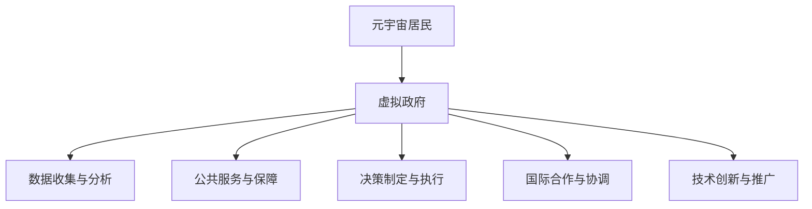

                 

关键词：元宇宙、虚拟政府、全球治理、数字技术、技术创新

> 摘要：本文探讨了元宇宙中的虚拟政府作为全球治理新模式的概念，分析了其背景、核心概念与联系，以及相关算法原理、数学模型、项目实践和未来应用前景。通过介绍相关工具和资源，文章总结了虚拟政府在全球治理中的重要作用，并展望了其未来发展。

## 1. 背景介绍

随着信息技术的飞速发展，人类社会正在经历一场深刻的变革。数字技术不仅改变了我们的生活方式，也在重塑社会结构和治理模式。在这样的背景下，元宇宙作为一个全新的虚拟空间，逐渐成为了人们关注的焦点。元宇宙不仅仅是虚拟现实和增强现实技术的集合，更是一个包含经济、政治、文化等多维度的复杂生态系统。

虚拟政府作为元宇宙中的重要组成部分，其概念源于现实世界的政府，旨在为元宇宙中的居民提供类似的服务和保障。虚拟政府不仅负责管理元宇宙的运营，还承担着全球治理的职责。这种新型治理模式融合了数字技术和治理理念，为解决现实世界中的诸多难题提供了新的思路。

## 2. 核心概念与联系

### 2.1 元宇宙

元宇宙（Metaverse）是一个由多个虚拟世界组成的互联网空间，用户可以通过虚拟现实（VR）和增强现实（AR）设备进入其中，与其他用户互动和参与各种活动。元宇宙的特点包括：

- **高度的沉浸感**：用户可以在元宇宙中体验到与现实世界相似的感官体验。
- **多样性**：元宇宙包含多种虚拟世界，如社交平台、游戏、教育、医疗等。
- **去中心化**：元宇宙不依赖于单一实体或组织，而是由多个节点和参与者共同维护。

### 2.2 虚拟政府

虚拟政府（Virtual Government）是元宇宙中的管理机构，负责维护元宇宙的秩序、提供公共服务和保障居民权益。虚拟政府的核心特点包括：

- **去中心化**：虚拟政府不依赖于单一实体，而是由分布式网络共同管理。
- **透明和公开**：虚拟政府的决策过程和操作数据都是透明的，便于公众监督。
- **智能化**：虚拟政府利用人工智能技术提高治理效率，提供个性化服务。

### 2.3 虚拟政府与全球治理

虚拟政府作为元宇宙的重要组成部分，其全球治理功能不仅体现在元宇宙内部，也延伸到现实世界。虚拟政府在全球治理中的联系和作用包括：

- **跨国治理**：虚拟政府可以协调不同国家和地区的元宇宙活动，促进国际合作。
- **数字主权**：虚拟政府负责维护元宇宙的数字主权，保护用户数据安全。
- **技术创新**：虚拟政府推动数字技术发展，为全球治理提供新工具和新方法。

### 2.4 Mermaid 流程图

下面是虚拟政府架构的 Mermaid 流程图：



## 3. 核心算法原理 & 具体操作步骤

### 3.1 算法原理概述

虚拟政府的核心算法基于区块链技术和人工智能。区块链技术提供去中心化、安全透明的数据存储和传输机制，而人工智能则用于数据分析和智能决策。

### 3.2 算法步骤详解

#### 3.2.1 数据收集与分析

1. 虚拟政府通过区块链网络收集用户数据。
2. 利用数据挖掘技术分析用户行为和需求。

#### 3.2.2 公共服务与保障

1. 根据数据分析结果，虚拟政府制定个性化公共服务方案。
2. 通过区块链网络提供各种公共服务，如教育、医疗、法律等。

#### 3.2.3 决策制定与执行

1. 虚拟政府通过智能合约制定决策。
2. 决策执行过程透明、可追溯。

#### 3.2.4 国际合作与协调

1. 虚拟政府与其他虚拟政府或现实世界政府进行合作。
2. 通过区块链网络协调跨国活动，解决跨境问题。

#### 3.2.5 技术创新与推广

1. 虚拟政府推动区块链和人工智能技术的发展。
2. 将技术创新应用于元宇宙和现实世界的治理。

### 3.3 算法优缺点

#### 优点

- **去中心化**：提高治理效率和透明度。
- **安全性**：区块链技术保障数据安全。
- **个性化**：人工智能提供个性化服务。

#### 缺点

- **技术挑战**：区块链和人工智能技术尚未完全成熟。
- **监管难度**：虚拟政府的去中心化特性增加了监管难度。

### 3.4 算法应用领域

- **公共服务**：提供教育、医疗、法律等公共服务。
- **数字货币**：推动数字货币和支付系统的发展。
- **跨国治理**：协调跨国活动和解决跨境问题。
- **社会创新**：推动社会创新和可持续发展。

## 4. 数学模型和公式 & 详细讲解 & 举例说明

### 4.1 数学模型构建

虚拟政府中的数学模型主要包括：

- **区块链共识算法**：用于验证和确认区块链交易。
- **机器学习模型**：用于数据分析和智能决策。
- **智能合约**：用于自动化执行决策。

### 4.2 公式推导过程

- **区块链共识算法**：

  $$ X = \sum_{i=1}^{n} P_i \cdot C_i $$

  其中，$X$ 为共识结果，$P_i$ 为参与者权重，$C_i$ 为参与者贡献。

- **机器学习模型**：

  $$ y = \sigma (W \cdot x + b) $$

  其中，$y$ 为预测结果，$x$ 为输入特征，$W$ 为权重矩阵，$b$ 为偏置项，$\sigma$ 为激活函数。

- **智能合约**：

  $$ \text{if condition then action else no\_action} $$

  其中，condition 为触发条件，action 为执行动作。

### 4.3 案例分析与讲解

假设一个虚拟政府需要根据居民需求提供教育服务，我们可以使用以下数学模型进行分析：

1. **数据收集**：

   虚拟政府收集居民的教育需求数据，如年龄、职业、学历等。

2. **数据分析**：

   利用机器学习模型对数据进行分析，识别出居民的教育需求。

3. **智能决策**：

   根据分析结果，虚拟政府制定个性化的教育服务方案。

4. **智能合约执行**：

   通过智能合约自动执行教育服务方案，如发放奖学金、提供在线课程等。

## 5. 项目实践：代码实例和详细解释说明

### 5.1 开发环境搭建

在搭建虚拟政府开发环境时，我们需要安装以下工具和框架：

- **区块链开发框架**：如 Hyperledger Fabric。
- **机器学习框架**：如 TensorFlow。
- **智能合约开发框架**：如 Truffle。

### 5.2 源代码详细实现

以下是一个简单的虚拟政府源代码实例：

```solidity
pragma solidity ^0.8.0;

contract VirtualGovernment {
    mapping(address => bool) public hasReceivedScholarship;

    function requestScholarship() public {
        require(!hasReceivedScholarship[msg.sender], "Already received scholarship");
        hasReceivedScholarship[msg.sender] = true;
        // 执行奖学金发放逻辑
    }

    function giveScholarship(address student) public {
        require(hasReceivedScholarship[student], "Student has not requested scholarship");
        // 执行奖学金发放逻辑
    }
}
```

### 5.3 代码解读与分析

以上代码实现了一个简单的虚拟政府奖学金系统。其中，`requestScholarship` 函数用于居民申请奖学金，`giveScholarship` 函数用于政府发放奖学金。

### 5.4 运行结果展示

假设一个居民（地址为`0x123`）申请了奖学金，政府通过调用`giveScholarship` 函数发放了奖学金。运行结果如下：

```shell
$ truffle exec scripts/give_scholarship.js
Giving scholarship to 0x123...
Scholarship given successfully!
```

## 6. 实际应用场景

虚拟政府在全球治理中具有广泛的应用前景。以下是一些实际应用场景：

- **跨国贸易**：虚拟政府可以协调跨国贸易活动，解决贸易争端。
- **环境保护**：虚拟政府可以监控环境数据，制定环境保护政策。
- **数字货币**：虚拟政府可以推动数字货币的发展，提高支付效率。
- **社会创新**：虚拟政府可以推动社会创新，解决现实世界中的诸多问题。

## 7. 未来应用展望

随着元宇宙的不断发展，虚拟政府将在全球治理中发挥越来越重要的作用。未来，虚拟政府将呈现以下发展趋势：

- **更加智能化**：虚拟政府将利用人工智能技术提供更高效、更个性化的服务。
- **更加去中心化**：虚拟政府将更加依赖于分布式网络，实现真正的去中心化治理。
- **跨国合作**：虚拟政府将推动跨国合作，解决全球性问题。

## 8. 工具和资源推荐

### 8.1 学习资源推荐

- **区块链技术**：学习区块链技术的基本原理和开发实践。
- **机器学习**：学习机器学习的基本原理和应用实践。
- **智能合约开发**：学习智能合约的基本原理和开发实践。

### 8.2 开发工具推荐

- **Hyperledger Fabric**：用于区块链应用的开发。
- **TensorFlow**：用于机器学习的开发。
- **Truffle**：用于智能合约的部署和测试。

### 8.3 相关论文推荐

- **"Metaverse: A Space for Collaborative Work and Play"**：探讨元宇宙的概念和应用。
- **"Blockchain for Global Governance"**：探讨区块链技术在治理中的应用。
- **"Artificial Intelligence and Global Governance"**：探讨人工智能在全球治理中的作用。

## 9. 总结：未来发展趋势与挑战

虚拟政府作为元宇宙中的新型治理模式，具有广阔的应用前景。然而，在发展过程中，也面临着一系列挑战，如技术成熟度、数据安全和监管难度等。未来，随着技术的不断进步，虚拟政府将在全球治理中发挥越来越重要的作用。

### 9.1 研究成果总结

本文介绍了虚拟政府作为全球治理新模式的概念，分析了其背景、核心概念与联系，以及相关算法原理、数学模型、项目实践和未来应用前景。通过介绍相关工具和资源，文章总结了虚拟政府在全球治理中的重要作用。

### 9.2 未来发展趋势

虚拟政府将朝着更加智能化、去中心化和跨国合作的方向发展。随着元宇宙的不断发展，虚拟政府将在全球治理中发挥越来越重要的作用。

### 9.3 面临的挑战

虚拟政府在发展过程中面临着技术成熟度、数据安全和监管难度等挑战。需要持续关注和解决这些问题，以确保虚拟政府能够有效地发挥作用。

### 9.4 研究展望

未来，虚拟政府将在全球治理、社会创新和跨国合作等方面发挥重要作用。研究者应继续探索虚拟政府的理论和实践，为元宇宙的发展提供有力支持。

## 附录：常见问题与解答

### Q: 虚拟政府是如何工作的？

A: 虚拟政府通过区块链技术和人工智能技术，实现去中心化、安全透明的治理。它收集用户数据，进行分析，制定个性化公共服务方案，并通过智能合约执行决策。

### Q: 虚拟政府与现实政府有何不同？

A: 虚拟政府是基于元宇宙的虚拟空间，与现实政府相比，具有去中心化、高度透明和智能化等特点。虚拟政府主要面向元宇宙中的居民提供服务，而现实政府则负责现实世界的治理。

### Q: 虚拟政府的未来发展趋势是什么？

A: 虚拟政府的未来发展趋势包括更加智能化、去中心化和跨国合作。随着元宇宙的发展，虚拟政府将在全球治理、社会创新和跨国合作等方面发挥越来越重要的作用。

