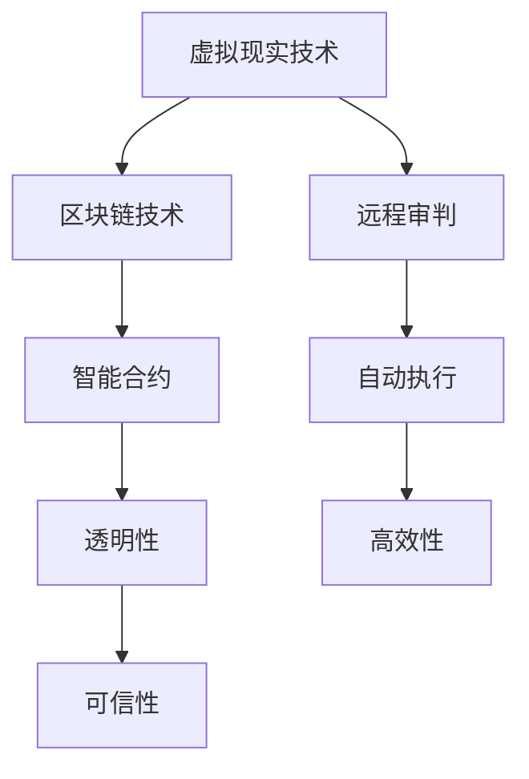

                 

关键词：元宇宙、虚拟法庭、跨国纠纷解决、新平台、技术进步、法律技术融合

> 摘要：随着元宇宙的崛起和技术的飞速发展，虚拟法庭作为一种新兴的跨国纠纷解决平台，正逐渐改变传统的司法实践。本文将探讨元宇宙中的虚拟法庭如何成为解决跨国纠纷的新平台，分析其技术架构、核心算法原理、数学模型、实际应用场景以及未来发展的趋势和挑战。

## 1. 背景介绍

随着全球化的不断深入，跨国纠纷的解决变得越来越重要。然而，传统的司法系统面临着诸如地域限制、语言障碍、司法程序复杂等问题。为了解决这些问题，技术的进步和创新的结合成为必然选择。元宇宙，作为虚拟现实技术的集大成者，提供了一个全新的平台，为跨国纠纷的解决提供了新的思路。

虚拟法庭是将传统法庭的功能搬到线上，通过虚拟现实技术和互联网实现远程审判和纠纷解决。在元宇宙中，虚拟法庭不仅提供了虚拟的物理空间，还集成了先进的智能合约、区块链技术等，使得司法过程更加透明、高效和可信。

## 2. 核心概念与联系

### 2.1 虚拟现实技术

虚拟现实技术（VR）是元宇宙的核心技术之一。通过VR技术，用户可以在虚拟环境中实现沉浸式体验。这种技术为虚拟法庭提供了基础的物理环境，使得法官、律师、当事人等能够在虚拟空间中“面对面”交流。

### 2.2 区块链技术

区块链技术为虚拟法庭提供了去中心化的数据存储和验证机制。通过区块链，司法过程的每一个步骤都可以被记录和验证，保证了整个过程的透明性和不可篡改性。智能合约技术进一步提高了司法效率，实现了自动执行法律条款的功能。

### 2.3 智能合约

智能合约是基于区块链的一种自动执行合同条款的程序。在虚拟法庭中，智能合约可以自动处理纠纷的调解和执行，减少了人为干预，提高了效率。

### 2.4 Mermaid 流程图



## 3. 核心算法原理 & 具体操作步骤

### 3.1 算法原理概述

虚拟法庭的核心算法包括虚拟现实渲染算法、区块链数据验证算法和智能合约执行算法。这些算法协同工作，实现了虚拟法庭的各个方面功能。

### 3.2 算法步骤详解

1. **虚拟现实渲染算法：** 通过计算机图形学技术，生成虚拟法庭的三维模型和环境。法官、律师和当事人在进入虚拟法庭前需要进行身份验证，确保只有授权人员可以进入。

2. **区块链数据验证算法：** 当案件数据被上传到区块链时，区块链网络中的节点会对数据进行验证，确保数据的完整性和真实性。

3. **智能合约执行算法：** 当纠纷调解达成一致后，智能合约会自动执行相应的法律条款，实现纠纷的自动解决。

### 3.3 算法优缺点

- **优点：** 提高了司法效率，降低了纠纷解决的成本，实现了远程审判和自动执行，提高了司法的透明性和可信性。
- **缺点：** 技术复杂性较高，需要大量专业人员维护，且对网络环境的依赖较大。

### 3.4 算法应用领域

虚拟法庭技术不仅适用于跨国纠纷解决，还可以应用于国内纠纷解决、知识产权保护、企业合规审计等领域。

## 4. 数学模型和公式 & 详细讲解 & 举例说明

### 4.1 数学模型构建

虚拟法庭的数学模型主要包括三个部分：虚拟现实模型、区块链模型和智能合约模型。

### 4.2 公式推导过程

虚拟现实模型的公式主要涉及计算机图形学中的三维渲染算法，如：$$
\begin{align*}
P &= V \cdot N \\
\theta &= \arccos(\frac{P \cdot N}{||P|| \cdot ||N||})
\end{align*}
$$

区块链模型的公式主要涉及密码学中的哈希函数和数字签名，如：$$
H = SHA256(plaintext + private_key)
$$

智能合约模型的公式主要涉及图灵完备编程语言中的条件语句和循环语句，如：$$
if condition then \\
    action_1 \\
else \\
    action_2 \\
end
$$

### 4.3 案例分析与讲解

假设有一起跨国合同纠纷，其中一方的公司位于中国，另一方位于美国。通过虚拟法庭，双方可以在虚拟法庭中进行远程审判。首先，双方律师将合同纠纷的相关数据上传到区块链，区块链节点对数据进行验证。然后，双方通过智能合约达成调解协议，智能合约自动执行相应的法律条款，实现纠纷的自动解决。

## 5. 项目实践：代码实例和详细解释说明

### 5.1 开发环境搭建

开发虚拟法庭需要搭建以下环境：
- 虚拟现实引擎（如Unity）
- 区块链开发框架（如Ethereum）
- 编程语言（如Solidity）

### 5.2 源代码详细实现

以下是智能合约的Solidity代码示例：

```solidity
pragma solidity ^0.8.0;

contract VirtualCourt {
    struct Case {
        address plaintiff;
        address defendant;
        string contractId;
        string resolution;
    }

    mapping(string => Case) public cases;

    function submitCase(string memory contractId, address defendant) public {
        cases[contractId] = Case(msg.sender, defendant, contractId, "");
    }

    function resolveCase(string memory contractId, string memory resolution) public {
        require(cases[contractId].plaintiff == msg.sender, "Only the plaintiff can resolve the case");
        cases[contractId].resolution = resolution;
    }
}
```

### 5.3 代码解读与分析

此智能合约定义了一个`Case`结构体，用于存储案件信息。`submitCase`函数用于提交案件，`resolveCase`函数用于解决案件。案件信息存储在区块链上，保证了数据的透明性和不可篡改性。

### 5.4 运行结果展示

通过以太坊区块链开发环境，运行智能合约，可以模拟提交案件和解决案件的过程。智能合约的执行结果将记录在区块链上，供所有节点验证。

## 6. 实际应用场景

虚拟法庭技术可以应用于以下场景：

- **跨国合同纠纷：** 企业可以在虚拟法庭中进行远程审判，减少了时间和成本。
- **知识产权保护：** 创意作品可以在虚拟法庭中进行版权登记和保护。
- **商业纠纷解决：** 企业可以通过虚拟法庭解决商业合同纠纷，提高效率。

## 6.4 未来应用展望

随着技术的不断进步，虚拟法庭的应用前景将更加广阔。未来，虚拟法庭有望实现以下功能：

- **更高效的司法服务：** 通过自动化技术，提高司法效率。
- **更广泛的司法服务：** 跨越地域限制，为全球用户提供司法服务。
- **更透明的司法过程：** 通过区块链技术，提高司法过程的透明度。

## 7. 工具和资源推荐

### 7.1 学习资源推荐

- 《区块链技术指南》
- 《智能合约开发指南》
- 《虚拟现实技术与应用》

### 7.2 开发工具推荐

- Unity：虚拟现实引擎
- Ethereum：区块链开发框架
- Solidity：智能合约开发语言

### 7.3 相关论文推荐

- "Blockchain and Smart Contracts for Law: A Systems Perspective"
- "The Impact of Blockchain Technology on Legal Services"
- "Virtual Reality in the Courtroom: A New Paradigm for Legal Proceedings"

## 8. 总结：未来发展趋势与挑战

虚拟法庭技术为跨国纠纷解决提供了新的平台。随着技术的不断进步，虚拟法庭有望在司法领域发挥更大的作用。然而，虚拟法庭也面临着诸如技术复杂性、网络安全等问题。未来，我们需要不断探索和解决这些问题，推动虚拟法庭技术的发展。

### 8.1 研究成果总结

本文介绍了虚拟法庭的概念、技术架构、算法原理和实际应用场景。通过分析，我们得出了虚拟法庭在跨国纠纷解决中的巨大潜力。

### 8.2 未来发展趋势

虚拟法庭技术将在司法领域得到更广泛的应用，有望成为司法实践的重要组成部分。

### 8.3 面临的挑战

虚拟法庭技术需要解决技术复杂性、网络安全等问题。

### 8.4 研究展望

未来，我们需要在虚拟法庭技术的研究中，关注如何提高其安全性和用户体验，推动其在司法领域的广泛应用。

## 9. 附录：常见问题与解答

### 9.1 虚拟法庭如何保证隐私和安全？

虚拟法庭通过区块链技术和加密算法，确保数据的安全和隐私。同时，身份验证机制和访问控制策略也确保只有授权人员可以访问敏感信息。

### 9.2 虚拟法庭如何处理跨境法律问题？

虚拟法庭通过国际法律合作和跨国法律协议，解决跨境法律问题。通过区块链技术，确保法律条款的执行和跨国司法合作的高效性。

### 9.3 虚拟法庭如何保证司法公正？

虚拟法庭通过智能合约和区块链技术，确保司法过程的透明和不可篡改。同时，法官和律师的独立性和专业性也是保证司法公正的重要因素。

**作者：禅与计算机程序设计艺术 / Zen and the Art of Computer Programming** ----------------------------------------------------------------

以上是关于“元宇宙中的虚拟法庭：跨国纠纷解决的新平台”的完整文章。希望这篇文章能够帮助读者更好地理解虚拟法庭技术及其在司法领域的应用前景。随着技术的不断进步，虚拟法庭有望成为司法实践的重要创新。未来，让我们共同期待这一天的到来。

