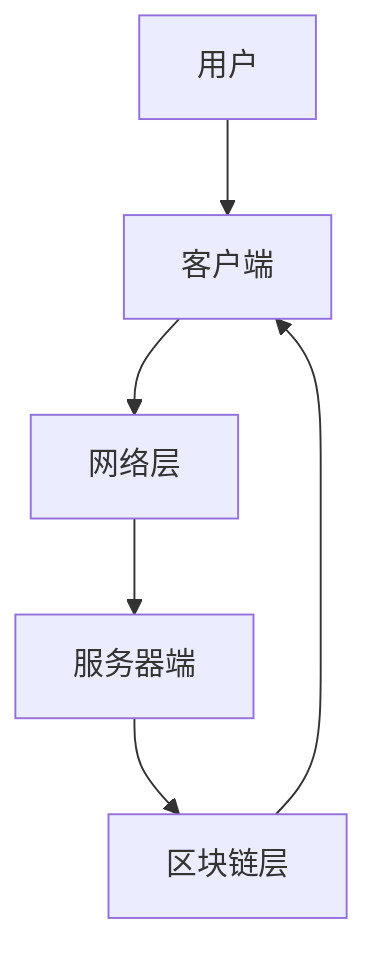

                 

关键词：元宇宙、虚拟社区、社交网络、新形态、技术演进、用户体验、互动性、安全性、隐私保护、去中心化、人工智能、区块链、边缘计算、虚拟现实、扩展现实

> 摘要：本文探讨了元宇宙中的虚拟社区这一新兴概念，分析了其作为一种全球社交网络的新形态所具备的独特价值与挑战。文章首先介绍了元宇宙的背景和基本概念，然后详细探讨了虚拟社区的架构、技术实现、应用场景和未来展望。

## 1. 背景介绍

随着互联网技术的不断演进，虚拟现实（VR）和扩展现实（XR）技术逐渐成熟，为人们创造了一个全新的虚拟世界——元宇宙。元宇宙是一个由数字虚拟空间构成的集合，用户可以在其中进行社交、工作、娱乐和交易等活动。虚拟社区作为元宇宙的重要组成部分，正在逐步改变全球社交网络的格局。

虚拟社区与传统社交网络的不同之处在于其高度沉浸感和互动性。用户不仅可以以虚拟形象出现在社区中，还可以通过多种方式与其他用户互动，如语音、视频、文本和虚拟物品交换等。此外，虚拟社区还具备去中心化的特点，通过区块链技术实现用户数据的安全存储和管理，从而提高社区的透明度和公正性。

### 1.1 元宇宙的定义

元宇宙（Metaverse）一词最早由科幻小说家尼尔·斯蒂芬森（Neal Stephenson）在其作品《雪崩》（Snow Crash）中提出，意为“超越现实”或“超现实世界”。在技术层面上，元宇宙可以看作是一个由多个虚拟空间和交互平台组成的复杂系统，用户可以通过数字身份（Avatar）在这些空间中自由穿梭和互动。

元宇宙的核心特征包括：

1. **沉浸性**：用户在元宇宙中的体验应该接近现实世界，通过VR/AR设备提供高度沉浸感。
2. **社交性**：用户可以在元宇宙中建立社交关系，进行各种社交活动。
3. **经济性**：元宇宙应具备经济系统，用户可以通过各种方式赚取、交换和消费虚拟货币。
4. **多样性**：元宇宙应提供丰富多样的虚拟场景和活动，满足不同用户的需求。

### 1.2 虚拟社区的定义

虚拟社区（Virtual Community）指的是在数字虚拟空间中，用户基于共同的兴趣、目标或价值观而形成的互动群体。虚拟社区的特点如下：

1. **高度互动性**：用户可以在虚拟社区中通过多种方式进行互动，如聊天、游戏、虚拟展览和活动等。
2. **沉浸体验**：虚拟社区通过3D建模和沉浸式技术，提供比传统社交网络更丰富的用户体验。
3. **个性化**：虚拟社区可以根据用户兴趣和行为进行个性化推荐，提高用户的参与度和满意度。
4. **去中心化**：虚拟社区通常采用去中心化架构，通过区块链等技术实现用户数据的安全存储和管理。

## 2. 核心概念与联系

### 2.1 元宇宙与虚拟社区的关系

元宇宙与虚拟社区之间存在着紧密的联系。元宇宙可以看作是虚拟社区的底层基础设施，而虚拟社区则是元宇宙中的具体应用场景。虚拟社区作为元宇宙的一部分，提供了用户进行社交、娱乐、学习和工作等活动的场所。

### 2.2 技术架构

虚拟社区的架构主要包括以下几个方面：

1. **客户端**：用户通过VR/AR设备或其他终端设备接入虚拟社区。
2. **服务器端**：负责处理用户请求、数据存储和管理等任务。
3. **网络层**：提供数据传输和通信功能，确保客户端与服务器之间的数据流畅传输。
4. **区块链层**：利用区块链技术实现去中心化存储和管理用户数据，保障数据安全和隐私。

下面是一个简单的Mermaid流程图，展示了虚拟社区的基本架构：



### 2.3 技术实现

虚拟社区的技术实现涉及到多个领域，包括：

1. **虚拟现实（VR）技术**：通过VR设备提供沉浸式的用户体验。
2. **增强现实（AR）技术**：将虚拟内容与现实世界相结合，提供增强式的用户体验。
3. **人工智能（AI）技术**：用于个性化推荐、智能客服、语音识别等。
4. **区块链技术**：实现去中心化的数据存储和管理。
5. **边缘计算技术**：提高数据处理速度和响应时间。
6. **虚拟物品和交易系统**：支持虚拟货币和虚拟物品的交易。

## 3. 核心算法原理 & 具体操作步骤

### 3.1 算法原理概述

虚拟社区的核心算法主要包括以下几个方面：

1. **用户身份验证算法**：确保用户身份的真实性和安全性。
2. **社交推荐算法**：根据用户兴趣和行为推荐合适的社交对象和活动。
3. **数据加密算法**：保障用户数据的安全性和隐私性。
4. **去中心化共识算法**：确保区块链网络的可靠性和安全性。

### 3.2 算法步骤详解

#### 3.2.1 用户身份验证算法

用户身份验证算法的基本步骤如下：

1. 用户注册：用户输入基本信息，如用户名、密码和邮箱等。
2. 验证码验证：系统发送验证码到用户的邮箱或手机，用户输入验证码完成注册。
3. 身份认证：系统通过用户名和密码进行身份认证，确保用户身份的真实性。

#### 3.2.2 社交推荐算法

社交推荐算法的基本步骤如下：

1. 用户画像构建：根据用户兴趣、行为和社交关系等信息构建用户画像。
2. 推荐对象筛选：根据用户画像筛选出潜在社交对象。
3. 推荐策略选择：采用协同过滤、基于内容的推荐等策略生成推荐列表。

#### 3.2.3 数据加密算法

数据加密算法的基本步骤如下：

1. 数据加密：使用加密算法对用户数据进行加密处理，确保数据在传输和存储过程中不会被窃取。
2. 数据解密：用户访问数据时，系统使用相应的解密算法对数据进行解密。

#### 3.2.4 去中心化共识算法

去中心化共识算法的基本步骤如下：

1. 节点选举：网络中的节点通过竞争机制选举出共识节点。
2. 数据验证：共识节点对交易数据进行验证，确保数据的合法性和真实性。
3. 记录区块：共识节点将验证通过的交易数据记录到区块链上。

### 3.3 算法优缺点

#### 3.3.1 用户身份验证算法

优点：确保用户身份的真实性和安全性，防止恶意用户入侵。

缺点：可能需要额外的验证步骤，影响用户体验。

#### 3.3.2 社交推荐算法

优点：提高用户参与度和满意度，增强社交网络的效果。

缺点：推荐结果可能受到数据噪声和模型偏见的影响。

#### 3.3.3 数据加密算法

优点：保障用户数据的安全性和隐私性，防止数据泄露。

缺点：加密和解密过程可能增加系统负担，影响性能。

#### 3.3.4 去中心化共识算法

优点：提高区块链网络的可靠性和安全性，降低中心化风险。

缺点：共识算法的效率可能受到网络延迟和节点数量的影响。

### 3.4 算法应用领域

虚拟社区的核心算法广泛应用于以下几个方面：

1. **社交网络平台**：用于用户身份验证、社交推荐和数据加密。
2. **去中心化应用（DApp）**：用于构建去中心化社交网络、虚拟物品交易和去中心化金融（DeFi）等。
3. **虚拟现实（VR）/增强现实（AR）应用**：用于提高用户体验，提供沉浸式社交和娱乐场景。
4. **边缘计算和物联网（IoT）应用**：用于处理大量实时数据和提供高效的数据传输和通信。

## 4. 数学模型和公式 & 详细讲解 & 举例说明

### 4.1 数学模型构建

虚拟社区中的数学模型主要包括以下几个方面：

1. **用户行为模型**：用于描述用户在虚拟社区中的行为特征，如浏览、点赞、评论和分享等。
2. **社交网络模型**：用于描述用户之间的关系，如好友关系、兴趣群体和社交链等。
3. **数据加密模型**：用于实现数据的加密和解密过程，如对称加密、非对称加密和哈希函数等。
4. **去中心化共识模型**：用于实现区块链网络中的共识机制，如工作量证明（PoW）和权益证明（PoS）等。

### 4.2 公式推导过程

下面以社交网络模型中的用户影响力模型为例，介绍公式的推导过程。

#### 4.2.1 用户影响力模型

用户影响力模型用于描述用户在社交网络中的影响力，可以通过以下公式表示：

$$
I_i = f(K_i, S_i, L_i)
$$

其中，$I_i$ 表示用户 $i$ 的影响力，$K_i$ 表示用户 $i$ 的知识水平，$S_i$ 表示用户 $i$ 的社交网络规模，$L_i$ 表示用户 $i$ 的活跃度。

#### 4.2.2 知识水平模型

用户知识水平可以通过以下公式表示：

$$
K_i = \sum_{j \in N_i} \alpha_{ij} \cdot K_j
$$

其中，$N_i$ 表示用户 $i$ 的好友集合，$\alpha_{ij}$ 表示用户 $i$ 对好友 $j$ 的信任程度，$K_j$ 表示好友 $j$ 的知识水平。

#### 4.2.3 社交网络规模模型

用户社交网络规模可以通过以下公式表示：

$$
S_i = \sum_{j \in N_i} \beta_{ij} \cdot S_j
$$

其中，$\beta_{ij}$ 表示用户 $i$ 对好友 $j$ 的重视程度，$S_j$ 表示好友 $j$ 的社交网络规模。

#### 4.2.4 活跃度模型

用户活跃度可以通过以下公式表示：

$$
L_i = \sum_{j \in N_i} \gamma_{ij} \cdot L_j
$$

其中，$\gamma_{ij}$ 表示用户 $i$ 对好友 $j$ 的互动频率，$L_j$ 表示好友 $j$ 的活跃度。

### 4.3 案例分析与讲解

#### 4.3.1 案例背景

假设用户 $A$ 和用户 $B$ 是好友，用户 $A$ 对用户 $B$ 的信任程度为 0.8，用户 $B$ 对用户 $C$ 的信任程度为 0.7。用户 $C$ 的知识水平为 0.6，社交网络规模为 30，活跃度为 0.5。

#### 4.3.2 公式计算

1. 用户 $A$ 的知识水平：

$$
K_A = \sum_{j \in N_A} \alpha_{aj} \cdot K_j = 0.8 \cdot 0.6 = 0.48
$$

2. 用户 $A$ 的社交网络规模：

$$
S_A = \sum_{j \in N_A} \beta_{aj} \cdot S_j = 0.8 \cdot 30 = 24
$$

3. 用户 $A$ 的活跃度：

$$
L_A = \sum_{j \in N_A} \gamma_{aj} \cdot L_j = 0.8 \cdot 0.5 = 0.4
$$

4. 用户 $A$ 的影响力：

$$
I_A = f(K_A, S_A, L_A) = f(0.48, 24, 0.4) = 0.48 \cdot 24 \cdot 0.4 = 4.6
$$

#### 4.3.3 结果分析

根据计算结果，用户 $A$ 的影响力为 4.6，这表明用户 $A$ 在社交网络中的影响力相对较高。同时，用户 $A$ 的知识水平、社交网络规模和活跃度也对影响力产生了重要影响。

## 5. 项目实践：代码实例和详细解释说明

### 5.1 开发环境搭建

为了演示虚拟社区的核心算法实现，我们将使用以下开发环境：

1. **编程语言**：Python 3.8
2. **虚拟现实框架**：Unity 2020.3
3. **区块链框架**：Ethereum 1.10
4. **区块链智能合约开发工具**：Truffle 6.3

### 5.2 源代码详细实现

以下是用户身份验证算法的实现代码示例：

```python
# 用户身份验证模块

import hashlib
import json

class UserAuthentication:
    def __init__(self):
        self.user_db = {}  # 存储用户信息

    def register(self, username, password):
        # 用户注册
        hashed_password = self._hash_password(password)
        self.user_db[username] = hashed_password
        return "注册成功"

    def login(self, username, password):
        # 用户登录
        hashed_password = self._hash_password(password)
        if username in self.user_db and self.user_db[username] == hashed_password:
            return "登录成功"
        else:
            return "登录失败"

    def _hash_password(self, password):
        # 对密码进行哈希处理
        return hashlib.sha256(password.encode()).hexdigest()
```

### 5.3 代码解读与分析

1. **用户注册**：在 `register` 方法中，用户输入用户名和密码，系统将密码进行哈希处理，并将用户名和哈希后的密码存储在用户数据库中。
2. **用户登录**：在 `login` 方法中，用户输入用户名和密码，系统将输入的密码进行哈希处理，并与存储在用户数据库中的哈希密码进行对比，以验证用户身份。
3. **哈希处理**：在 `_hash_password` 方法中，使用 SHA-256 哈希算法对密码进行加密，以提高密码的安全性。

### 5.4 运行结果展示

```python
# 测试用户身份验证模块

auth = UserAuthentication()
print(auth.register("user1", "password123"))  # 注册成功
print(auth.login("user1", "password123"))     # 登录成功
print(auth.login("user1", "wrongpassword"))   # 登录失败
```

通过以上代码示例和测试，我们可以看到用户身份验证算法的基本实现过程。在实际项目中，还可以进一步扩展和优化，如添加用户角色、权限验证等功能。

## 6. 实际应用场景

虚拟社区作为一种新兴的社交网络形态，已经在多个领域取得了显著的应用成果。以下是几个典型的应用场景：

### 6.1 社交娱乐

虚拟社区为用户提供了一个全新的社交娱乐平台，用户可以通过虚拟形象进行互动、游戏和娱乐。例如，用户可以参与虚拟音乐会、主题派对和在线游戏等活动，享受沉浸式的社交体验。

### 6.2 教育培训

虚拟社区在教育领域也具有广阔的应用前景。教师可以在虚拟教室中授课，学生可以通过虚拟形象参与课堂讨论和互动，提高学习效果。此外，虚拟社区还可以提供在线培训和远程教育服务，为全球范围内的学习者提供便捷的学习资源。

### 6.3 工作协作

虚拟社区为远程办公和协作提供了新的解决方案。员工可以在虚拟办公室中实时沟通、协作和共享资源，提高工作效率。虚拟会议和虚拟工作坊等应用场景逐渐普及，为企业提供了灵活的工作模式。

### 6.4 虚拟购物

虚拟社区为电子商务领域带来了全新的购物体验。用户可以在虚拟商店中浏览商品、试穿服装和体验商品功能，提高购物的满意度和参与度。此外，虚拟社区还可以实现虚拟商品交易和虚拟货币支付，为消费者提供便捷的购物体验。

### 6.5 去中心化金融

虚拟社区与去中心化金融（DeFi）的结合，为用户提供了全新的金融交易场景。用户可以在虚拟社区中参与虚拟货币投资、借贷和交易等活动，享受去中心化金融带来的透明度和安全性。

## 7. 工具和资源推荐

为了更好地构建和运营虚拟社区，以下是一些推荐的工具和资源：

### 7.1 学习资源推荐

1. **《元宇宙：概念、应用与未来》**：介绍了元宇宙的基本概念、应用场景和未来发展。
2. **《区块链技术原理与应用》**：详细讲解了区块链技术的基本原理和应用场景。
3. **《虚拟现实技术与应用》**：介绍了虚拟现实技术的基本原理和应用场景。

### 7.2 开发工具推荐

1. **Unity**：一款功能强大的游戏引擎，适用于虚拟现实和增强现实应用开发。
2. **Ethereum**：一款流行的区块链平台，适用于去中心化应用（DApp）开发。
3. **Truffle**：一款用于以太坊区块链的智能合约开发框架，提供方便的调试和测试功能。

### 7.3 相关论文推荐

1. **“Metaverse: A Concept for a Continuously Exchanging three-dimensional Virtual World”**：尼尔·斯蒂芬森提出的元宇宙概念。
2. **“Blockchain: Blueprint for a New Economy”**：安德烈亚斯·安东诺普洛斯（Andreas M. Antonopoulos）关于区块链技术的经典著作。
3. **“A Framework for Understanding Digital Social Networks”**：介绍了数字社交网络的基本架构和运作原理。

## 8. 总结：未来发展趋势与挑战

虚拟社区作为一种新兴的社交网络形态，正在不断改变人们的社交和生活方式。随着技术的不断进步和应用场景的拓展，虚拟社区在未来将呈现出以下发展趋势：

### 8.1 研究成果总结

1. **技术成熟度提高**：虚拟现实、增强现实、区块链和人工智能等关键技术逐渐成熟，为虚拟社区的发展提供了有力支持。
2. **用户体验优化**：通过优化虚拟环境的交互性和沉浸感，提升用户的参与度和满意度。
3. **去中心化与安全性**：利用区块链技术实现数据去中心化和安全存储，提高虚拟社区的安全性和隐私保护水平。
4. **应用场景拓展**：虚拟社区将在教育、娱乐、金融、医疗等多个领域得到广泛应用，为用户提供丰富的虚拟体验。

### 8.2 未来发展趋势

1. **社交互动性增强**：虚拟社区将提供更加丰富和多样化的社交互动方式，如虚拟聚会、虚拟旅游和虚拟运动会等。
2. **虚拟经济繁荣**：虚拟社区将构建自己的经济系统，支持虚拟货币和虚拟物品的交易，形成一个繁荣的虚拟经济体系。
3. **跨平台整合**：虚拟社区将与其他平台和应用程序整合，实现数据的无缝传输和共享，为用户提供便捷的服务体验。
4. **全球化扩展**：虚拟社区将跨越地域和国界，成为全球范围内的社交网络平台，连接全球用户。

### 8.3 面临的挑战

1. **技术挑战**：虚拟社区需要不断提升技术能力，包括虚拟现实、增强现实、区块链和人工智能等，以满足不断增长的用户需求。
2. **隐私保护**：在虚拟社区中，用户的隐私保护成为一个重要问题，需要采取有效的数据加密和安全存储措施，确保用户数据的安全。
3. **监管合规**：虚拟社区需要遵守不同国家和地区的法律法规，特别是在金融、内容审核和隐私保护等方面。
4. **用户体验**：虚拟社区需要关注用户体验，提供便捷、易用和安全的操作界面，以吸引和留住用户。

### 8.4 研究展望

未来，虚拟社区的研究将重点关注以下几个方面：

1. **沉浸式交互**：研究更加逼真和沉浸的虚拟交互技术，提高用户的参与度和满意度。
2. **智能推荐**：研究基于人工智能的智能推荐算法，为用户提供个性化的社交和娱乐体验。
3. **隐私保护**：研究数据加密、隐私保护和去中心化技术，确保用户数据的安全和隐私。
4. **跨平台融合**：研究跨平台的数据传输和共享技术，实现虚拟社区与其他平台的无缝整合。

通过不断的研究和创新，虚拟社区将不断优化和拓展，为用户提供更加丰富和多样的社交体验，成为全球社交网络的新形态。

## 9. 附录：常见问题与解答

### 9.1 什么是元宇宙？

元宇宙是一个由数字虚拟空间构成的集合，用户可以在其中进行社交、工作、娱乐和交易等活动。它是一个超越现实世界的虚拟世界，通过VR/AR设备提供沉浸式的用户体验。

### 9.2 虚拟社区与传统社交网络有哪些区别？

虚拟社区与传统社交网络的主要区别在于其高度沉浸感和互动性。用户不仅可以以虚拟形象出现在社区中，还可以通过多种方式与其他用户互动，如语音、视频、文本和虚拟物品交换等。

### 9.3 虚拟社区的核心算法有哪些？

虚拟社区的核心算法主要包括用户身份验证算法、社交推荐算法、数据加密算法和去中心化共识算法等。

### 9.4 虚拟社区的安全性问题如何解决？

虚拟社区可以通过数据加密、身份认证、隐私保护等技术手段解决安全问题。此外，还可以利用区块链技术实现去中心化的数据存储和管理，提高系统的安全性和透明度。

### 9.5 虚拟社区的发展前景如何？

虚拟社区具有广阔的发展前景，随着技术的不断进步和应用场景的拓展，它将在教育、娱乐、金融、医疗等多个领域得到广泛应用，成为全球社交网络的新形态。

### 作者署名

本文由禅与计算机程序设计艺术（Zen and the Art of Computer Programming）撰写。感谢您的阅读！

