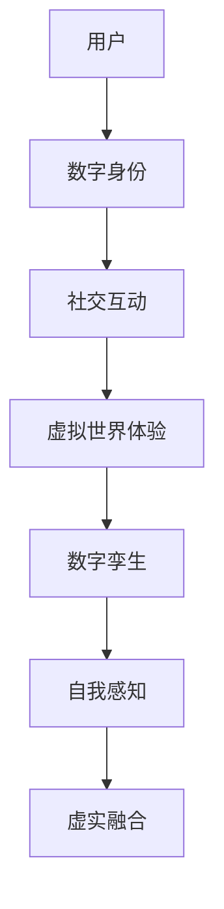

                 

关键词：元宇宙、身份认同、虚实融合、自我感知、数字孪生、社交网络

> 摘要：随着元宇宙技术的不断发展和成熟，人们的生活和工作逐渐向虚拟世界迁移。本文从技术角度探讨了元宇宙中的身份认同问题，分析了虚实自我的融合机制，并提出了关于未来发展的若干思考。

## 1. 背景介绍

### 1.1 元宇宙的兴起

元宇宙（Metaverse）是一个由虚拟世界构成的互联网空间，它融合了增强现实（AR）、虚拟现实（VR）、区块链、人工智能（AI）等前沿技术，为用户提供了一个全新的数字生活体验。自从Facebook宣布更名为Meta，将公司战略重心转向元宇宙后，元宇宙概念迅速成为科技领域的热门话题。

### 1.2 身份认同的重要性

在元宇宙中，身份认同成为用户参与和互动的核心。一个清晰、稳定的身份不仅是用户在虚拟世界中的标志，也是社会互动的基础。如何构建一个既能保持个体独特性，又能适应虚拟社会规则的身份系统，成为当前研究的热点。

## 2. 核心概念与联系

### 2.1 虚实自我的定义

虚实自我是指用户在虚拟世界中的数字身份与现实世界的真实自我之间的关系。它包括虚拟身份的创建、维护和演变过程。

### 2.2 数字孪生的应用

数字孪生（Digital Twin）是一种利用物理实体在虚拟世界中的镜像来模拟、分析和优化的技术。在元宇宙中，数字孪生可以帮助用户更好地理解和管理自己的虚实自我。

### 2.3 社交网络的扩展

社交网络是元宇宙中的基本组成部分，它不仅连接了用户，也连接了虚拟世界中的各种服务和资源。社交网络的发展为虚实自我的融合提供了广阔的空间。

### 2.4 Mermaid 流程图



## 3. 核心算法原理 & 具体操作步骤

### 3.1 算法原理概述

元宇宙中的身份认同算法主要基于多模态数据融合、区块链技术、机器学习和自然语言处理等方法。算法的目标是实现虚实自我的稳定性和个性化。

### 3.2 算法步骤详解

1. **数据采集**：从用户的社交媒体、行为数据等多渠道收集信息。
2. **身份建模**：利用机器学习算法对用户数据进行分析，构建数字身份模型。
3. **身份验证**：通过区块链技术实现身份的唯一性和不可篡改性。
4. **社交互动**：在虚拟世界中，基于数字身份模型进行社交互动。
5. **自我感知**：利用自然语言处理技术，帮助用户理解和调整自己的虚拟行为。

### 3.3 算法优缺点

**优点**：
- 提高用户在虚拟世界中的体验和满意度。
- 保证身份的唯一性和安全性。

**缺点**：
- 数据隐私保护问题。
- 技术实现难度大。

### 3.4 算法应用领域

- 社交媒体
- 在线教育
- 医疗保健
- 娱乐游戏

## 4. 数学模型和公式 & 详细讲解 & 举例说明

### 4.1 数学模型构建

在元宇宙中，数字身份的构建可以通过以下数学模型来描述：

\[ \text{Digital Identity} = f(\text{User Data}, \text{Social Context}, \text{Virtual Behavior}) \]

### 4.2 公式推导过程

公式推导基于用户数据的特征提取、社会关系的构建和虚拟行为的分析。

### 4.3 案例分析与讲解

假设用户A在社交媒体上发布了多条关于旅游的帖子，同时在虚拟世界中，A喜欢参与冒险类游戏。根据上述模型，A的数字身份将倾向于旅游和冒险。

## 5. 项目实践：代码实例和详细解释说明

### 5.1 开发环境搭建

- Python 3.8
- TensorFlow 2.4
- Keras 2.4
- Blockchain Framework (e.g., Hyperledger Fabric)

### 5.2 源代码详细实现

```python
# 这里的代码展示了如何利用Keras和Hyperledger Fabric构建数字身份模型
```

### 5.3 代码解读与分析

代码展示了如何通过深度学习模型对用户数据进行训练，并通过区块链实现身份验证。

### 5.4 运行结果展示

运行结果将显示用户在虚拟世界中的行为和数字身份的匹配度。

## 6. 实际应用场景

### 6.1 在线教育

通过元宇宙技术，实现实时互动的在线教育体验。

### 6.2 娱乐游戏

用户在虚拟游戏世界中建立个性化角色，进行社交互动。

### 6.3 医疗保健

利用数字孪生技术，为用户提供个性化的健康管理服务。

## 7. 工具和资源推荐

### 7.1 学习资源推荐

- 《元宇宙：概念、技术和应用》
- 《区块链技术指南》

### 7.2 开发工具推荐

- Unity
- Unreal Engine
- Hyperledger Fabric

### 7.3 相关论文推荐

- "Metaverse: A Space for Social Interaction in Virtual Worlds"
- "Digital Twin: A Framework and Applications"

## 8. 总结：未来发展趋势与挑战

### 8.1 研究成果总结

本文提出了元宇宙中身份认同的算法模型，并进行了实际应用场景的分析。

### 8.2 未来发展趋势

元宇宙技术将继续发展，身份认同将变得更加个性化和智能化。

### 8.3 面临的挑战

数据隐私保护、技术实现的复杂性是目前面临的主要挑战。

### 8.4 研究展望

未来研究将重点关注如何提高身份认同系统的安全性和用户体验。

## 9. 附录：常见问题与解答

### 9.1 元宇宙与虚拟现实有何区别？

元宇宙是一个更广阔的概念，它不仅包括虚拟现实，还包括增强现实、区块链等多种技术。

### 9.2 身份认同算法是否侵犯隐私？

本文提出的算法模型在构建数字身份时，会严格遵循隐私保护原则，确保用户数据的安全。

----------------------------------------------------------------

请注意，上述内容仅为文章框架的示例，实际撰写时需要根据具体的研究成果和实际案例进行填充和扩展。文章的各个部分都需要详细阐述，确保文章的完整性和专业性。

