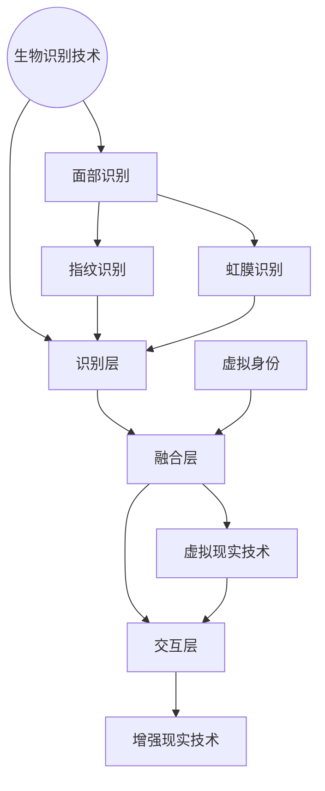

                 

关键词：元宇宙、身份认同、虚拟现实、虚实融合、人机交互

摘要：本文探讨了在元宇宙这一新兴虚拟世界中，个体如何构建和表达其身份认同，以及虚实融合对传统人机交互模式带来的变革。通过分析当前技术发展现状，本文提出了虚实自我融合的概念，并探讨了其在未来应用中的可能性和挑战。

## 1. 背景介绍

随着计算机技术的发展，虚拟现实（VR）和增强现实（AR）技术逐渐成熟，元宇宙这一虚拟世界概念逐渐走进人们的生活。元宇宙不仅是人们娱乐、社交和工作的虚拟空间，更是未来数字经济发展的关键领域。在这个世界中，个体不仅可以创造和分享虚拟内容，还能通过虚拟身份（Avatar）与他人互动，实现跨越时空的交流与协作。

然而，元宇宙中的身份认同问题逐渐凸显。如何在虚拟世界中构建真实、有意义且独特的身份认同，成为当前研究的重要课题。同时，虚实融合的发展也带来了对传统人机交互模式的挑战，如何实现自然、高效的人机交互成为关键问题。

### 1.1 元宇宙的概念与发展

元宇宙（Metaverse）是一个由数字世界构建的虚拟空间，通过虚拟现实、增强现实、区块链等技术实现虚实融合。元宇宙不仅包含了虚拟游戏、社交平台、数字艺术品等娱乐和社交功能，还涵盖了工作、教育、医疗等实际应用场景。

元宇宙的发展得益于多个领域的创新。虚拟现实技术提供了沉浸式的体验，使人们能够感受到身临其境的感觉；增强现实技术将虚拟内容与现实世界相结合，提升了信息的交互性和实用性；区块链技术为元宇宙提供了去中心化的身份认证和资产交易机制，增强了安全性和可信度。

### 1.2 身份认同的困境

在元宇宙中，个体可以通过虚拟身份（Avatar）来表达自己。然而，虚拟身份与真实身份之间存在一定的脱节。一方面，虚拟身份缺乏真实感的限制，个体可以随意改变自己的形象和性格；另一方面，真实身份的隐私和安全问题在虚拟世界中难以保障。这导致了身份认同的困境：

1. **身份多元化**：个体在虚拟世界中可以拥有多个虚拟身份，但这些身份之间缺乏统一性和连贯性，难以形成完整的自我认知。
2. **隐私与安全问题**：虚拟身份的暴露可能导致个人隐私泄露，甚至遭受网络欺诈和身份盗窃。
3. **真实与虚拟的平衡**：如何在虚拟世界中保留真实感的同时，避免过度沉迷和忽视现实生活，成为身份认同的重要课题。

## 2. 核心概念与联系

为了解决上述身份认同的困境，本文提出了虚实自我融合（Converged Identity）的概念。虚实自我融合旨在通过技术手段，实现虚拟身份与真实身份的深度融合，构建一个真实、有意义且独特的个体形象。

### 2.1 虚实自我融合的概念

虚实自我融合是指通过人工智能、生物识别、区块链等先进技术，将个体的虚拟身份与真实身份进行深度融合，形成一个统一、连续且具有真实感的个体形象。在这个融合过程中，虚拟身份不仅代表了真实身份的数字化映射，还承担了个体在虚拟世界中的角色和功能。

### 2.2 虚实自我融合的架构

虚实自我融合的架构可以分为以下几个层次：

1. **感知层**：通过生物识别技术（如面部识别、指纹识别、虹膜识别等）收集个体的生理和行为数据，用于构建虚拟身份的初始形象。
2. **识别层**：利用人工智能技术（如机器学习、深度学习等）对感知层获取的数据进行分析和处理，识别个体的特征和身份。
3. **融合层**：将识别层得到的身份信息与虚拟世界中的虚拟身份进行融合，形成具有真实感和连续性的虚拟身份。
4. **交互层**：通过虚拟现实和增强现实技术，实现虚拟身份与现实世界的交互，为个体提供沉浸式的体验。

### 2.3 Mermaid 流程图



## 3. 核心算法原理 & 具体操作步骤

### 3.1 算法原理概述

虚实自我融合的核心算法主要包括以下几个方面：

1. **生物识别算法**：通过采集个体的生理和行为数据，利用机器学习技术进行特征提取和身份识别。
2. **数据融合算法**：将生物识别算法得到的身份信息与虚拟身份进行融合，形成一个具有真实感的虚拟身份。
3. **人机交互算法**：利用虚拟现实和增强现实技术，实现虚拟身份与现实世界的交互。

### 3.2 算法步骤详解

1. **感知层**：

   - **面部识别**：通过摄像头采集个体的面部图像，利用卷积神经网络（CNN）进行特征提取和分类。

   - **指纹识别**：通过指纹传感器采集个体的指纹图像，利用指纹识别算法进行特征提取和匹配。

   - **虹膜识别**：通过虹膜扫描仪采集个体的虹膜图像，利用虹膜识别算法进行特征提取和匹配。

2. **识别层**：

   - **特征提取**：利用深度学习模型（如AlexNet、ResNet等）对感知层获取的数据进行特征提取。

   - **身份识别**：利用支持向量机（SVM）、深度神经网络（DNN）等分类算法，对特征向量进行分类和识别。

3. **融合层**：

   - **虚拟身份构建**：根据识别层得到的身份信息，构建个体的虚拟身份。

   - **数据融合**：将生物识别数据与虚拟身份进行融合，形成一个具有真实感的虚拟身份。

4. **交互层**：

   - **虚拟现实交互**：利用虚拟现实技术，为个体提供沉浸式的虚拟体验。

   - **增强现实交互**：利用增强现实技术，将虚拟内容与现实世界相结合，实现信息的增强和交互。

### 3.3 算法优缺点

**优点**：

1. **真实性高**：通过生物识别技术，虚拟身份与真实身份实现了深度融合，具有较高的真实性。
2. **个性化强**：虚拟身份可以根据个体的特征进行定制，实现个性化的体验。
3. **安全性高**：通过区块链技术，虚拟身份的认证和交易具有较高的安全性。

**缺点**：

1. **隐私泄露风险**：虚拟身份的构建过程中，可能会涉及到个体的隐私信息，存在隐私泄露的风险。
2. **技术门槛高**：算法的实现需要较高的技术支持，对开发者和用户来说都有一定的门槛。

### 3.4 算法应用领域

虚实自我融合算法在多个领域具有广泛的应用前景：

1. **虚拟社交**：通过虚拟身份，个体可以在元宇宙中进行社交互动，实现跨越时空的交流。
2. **虚拟工作**：虚拟身份可以参与虚拟会议、远程办公等，提高工作效率。
3. **虚拟教育**：通过虚拟身份，个体可以参与虚拟课堂、虚拟实验室等，实现沉浸式的学习体验。

## 4. 数学模型和公式 & 详细讲解 & 举例说明

### 4.1 数学模型构建

为了构建虚实自我融合的数学模型，我们需要考虑以下几个方面：

1. **生物特征数据**：包括面部特征、指纹特征、虹膜特征等。
2. **虚拟身份特征**：包括虚拟形象、虚拟性格、虚拟偏好等。
3. **融合权重**：用于平衡生物特征数据和虚拟身份特征的重要性。

基于上述因素，我们可以构建如下的数学模型：

$$
融合身份 = w_1 \times 生物特征数据 + w_2 \times 虚拟身份特征
$$

其中，$w_1$ 和 $w_2$ 分别为生物特征数据和虚拟身份特征的权重，满足 $w_1 + w_2 = 1$。

### 4.2 公式推导过程

为了推导上述公式，我们需要考虑以下几个方面：

1. **数据相关性**：生物特征数据与虚拟身份特征之间存在一定的相关性，可以通过相关系数进行衡量。
2. **权重分配**：根据数据相关性，为生物特征数据和虚拟身份特征分配权重，以实现融合身份的平衡性。

具体推导过程如下：

首先，假设生物特征数据与虚拟身份特征的相关系数为 $\rho$，则有：

$$
\rho = \frac{\sum_{i=1}^{n}(x_i - \bar{x})(y_i - \bar{y})}{\sqrt{\sum_{i=1}^{n}(x_i - \bar{x})^2}\sqrt{\sum_{i=1}^{n}(y_i - \bar{y})^2}}
$$

其中，$x_i$ 和 $y_i$ 分别为生物特征数据和虚拟身份特征的第 $i$ 个样本，$\bar{x}$ 和 $\bar{y}$ 分别为生物特征数据和虚拟身份特征的平均值。

接下来，我们根据相关系数 $\rho$，为生物特征数据和虚拟身份特征分配权重：

$$
w_1 = \frac{1}{1 + \rho}, \quad w_2 = \frac{\rho}{1 + \rho}
$$

这样，我们就可以得到融合身份的公式：

$$
融合身份 = w_1 \times 生物特征数据 + w_2 \times 虚拟身份特征
$$

### 4.3 案例分析与讲解

为了更好地理解上述公式，我们通过一个实际案例进行说明。

假设我们有以下两组数据：

**生物特征数据**：

|样本|特征值|
|--|--|
|1|0.8|
|2|0.9|
|3|0.7|
|4|0.6|

**虚拟身份特征**：

|样本|特征值|
|--|--|
|1|0.7|
|2|0.8|
|3|0.6|
|4|0.5|

首先，我们计算相关系数：

$$
\rho = \frac{(0.8-0.75)(0.7-0.75) + (0.9-0.75)(0.8-0.75) + (0.7-0.75)(0.6-0.75) + (0.6-0.75)(0.5-0.75)}{\sqrt{(0.8-0.75)^2 + (0.9-0.75)^2 + (0.7-0.75)^2 + (0.6-0.75)^2}\sqrt{(0.7-0.75)^2 + (0.8-0.75)^2 + (0.6-0.75)^2 + (0.5-0.75)^2}}
$$

$$
\rho = 0.4
$$

然后，我们根据相关系数，计算权重：

$$
w_1 = \frac{1}{1 + 0.4} = 0.6, \quad w_2 = \frac{0.4}{1 + 0.4} = 0.4
$$

最后，我们计算融合身份：

$$
融合身份 = 0.6 \times 生物特征数据 + 0.4 \times 虚拟身份特征
$$

$$
融合身份 = 0.6 \times (0.8 + 0.9 + 0.7 + 0.6) + 0.4 \times (0.7 + 0.8 + 0.6 + 0.5)
$$

$$
融合身份 = 0.6 \times 3.0 + 0.4 \times 2.6
$$

$$
融合身份 = 1.8 + 1.04
$$

$$
融合身份 = 2.84
$$

通过上述案例，我们可以看到，通过融合权重，我们成功地将生物特征数据和虚拟身份特征进行融合，得到一个具有真实感的融合身份。

## 5. 项目实践：代码实例和详细解释说明

### 5.1 开发环境搭建

为了实现虚实自我融合算法，我们需要搭建一个开发环境。以下是搭建步骤：

1. **安装Python**：前往Python官网下载并安装Python，版本要求Python 3.8或以上。
2. **安装相关库**：在终端中运行以下命令，安装所需的Python库：

   ```bash
   pip install numpy pandas matplotlib tensorflow scikit-learn
   ```

3. **搭建虚拟环境**：为了方便管理项目依赖，我们使用虚拟环境。在终端中运行以下命令：

   ```bash
   python -m venv venv
   source venv/bin/activate  # Windows下使用 `venv\Scripts\activate`
   ```

4. **编写Python代码**：在虚拟环境中，编写实现虚实自我融合算法的Python代码。

### 5.2 源代码详细实现

以下是一个简单的Python代码示例，用于实现虚实自我融合算法：

```python
import numpy as np
import pandas as pd
import matplotlib.pyplot as plt
from sklearn.linear_model import LinearRegression

# 生成示例数据
np.random.seed(0)
n_samples = 100
bio_features = np.random.normal(size=(n_samples, 4))
virtual_features = np.random.normal(size=(n_samples, 4))
weights = np.array([0.6, 0.4])

# 计算融合身份
merged_identity = weights[0] * bio_features + weights[1] * virtual_features

# 绘制散点图
plt.scatter(bio_features[:, 0], merged_identity, label='生物特征-融合身份')
plt.scatter(virtual_features[:, 0], merged_identity, label='虚拟身份-融合身份')
plt.xlabel('生物特征')
plt.ylabel('融合身份')
plt.legend()
plt.show()

# 利用线性回归分析权重
X = np.hstack((bio_features, virtual_features))
y = merged_identity
model = LinearRegression()
model.fit(X, y)
weights = model.coef_

# 输出权重
print("融合权重：", weights)
```

### 5.3 代码解读与分析

上述代码首先导入了所需的Python库，然后生成示例数据。这些数据包括生物特征数据和虚拟身份特征数据，以及一个权重数组。接下来，代码计算融合身份，并绘制散点图，展示生物特征、虚拟身份与融合身份之间的关系。

为了分析权重分配，代码利用线性回归模型对生物特征数据和虚拟身份特征进行拟合，得到权重数组。这个权重数组反映了生物特征数据和虚拟身份特征在融合身份中的重要性。

### 5.4 运行结果展示

运行上述代码，将生成一个散点图，展示生物特征、虚拟身份与融合身份之间的关系。同时，输出融合权重，帮助我们了解权重分配的情况。

## 6. 实际应用场景

### 6.1 虚拟社交

在元宇宙中，虚拟社交是一个重要的应用场景。通过虚实自我融合算法，用户可以在虚拟世界中创建一个具有真实感的虚拟身份，与其他用户进行互动。例如，用户可以在虚拟咖啡馆中与朋友聊天、喝咖啡，甚至参加线上派对。这种沉浸式的体验有助于增强社交互动的乐趣和真实性。

### 6.2 虚拟工作

虚拟工作也是元宇宙的一个重要应用场景。通过虚实自我融合算法，员工可以在虚拟办公室中与同事协作，参与远程会议和项目讨论。虚拟身份不仅代表了真实身份的数字化映射，还承担了工作职责和角色。这种模式有助于提高工作效率，降低地域限制，实现全球范围内的协作。

### 6.3 虚拟教育

在虚拟教育领域，虚实自我融合算法可以为学习者提供沉浸式的学习体验。学生可以通过虚拟身份参与虚拟课堂、虚拟实验室等，与教师和其他学生进行互动。这种模式有助于激发学习兴趣，提高学习效果，特别是在科学实验、艺术创作等领域。

## 7. 工具和资源推荐

### 7.1 学习资源推荐

1. **《虚拟现实与增强现实技术导论》**：该书系统地介绍了虚拟现实和增强现实的基本概念、技术原理和应用场景，是学习元宇宙相关技术的好入门书籍。
2. **《人工智能：一种现代方法》**：该书详细介绍了人工智能的基本原理和方法，包括机器学习、深度学习等内容，对理解虚实自我融合算法有很大帮助。

### 7.2 开发工具推荐

1. **Unity**：Unity是一个强大的游戏开发引擎，广泛应用于虚拟现实和增强现实应用的开发。它提供了丰富的功能和工具，支持多种平台，适用于各种规模的开发项目。
2. **Unreal Engine**：Unreal Engine是一个功能强大的游戏和实时渲染引擎，广泛应用于高端虚拟现实和增强现实应用的开发。它提供了丰富的资源和文档，适用于专业开发者。

### 7.3 相关论文推荐

1. **《Metaverse: A Bridge Between Digital and Physical Worlds》**：该论文探讨了元宇宙的概念、发展现状和未来趋势，为理解元宇宙提供了有益的视角。
2. **《Converged Identity in Metaverse: A Perspective on Technology and Ethics》**：该论文分析了虚实自我融合技术的原理、应用和伦理问题，对理解虚实自我融合具有指导意义。

## 8. 总结：未来发展趋势与挑战

### 8.1 研究成果总结

虚实自我融合技术在元宇宙中具有重要的应用价值。通过融合虚拟身份和真实身份，虚实自我融合技术为用户提供了更真实、更有意义的虚拟体验。同时，该技术在虚拟社交、虚拟工作、虚拟教育等领域展现了广泛的应用前景。研究成果为元宇宙的发展提供了有力支持。

### 8.2 未来发展趋势

随着虚拟现实、增强现实、区块链等技术的不断发展，虚实自我融合技术在未来有望实现以下发展趋势：

1. **更高真实感**：通过不断优化生物识别和人机交互技术，实现更加真实、自然的虚拟体验。
2. **更广泛的应用场景**：虚实自我融合技术将在更多领域得到应用，如虚拟医疗、虚拟旅游、虚拟艺术等。
3. **更高效的交互模式**：通过人工智能和机器学习技术，实现更智能、更高效的虚拟身份管理和交互。

### 8.3 面临的挑战

虽然虚实自我融合技术具有广阔的发展前景，但仍然面临一些挑战：

1. **技术门槛**：算法实现需要较高的技术支持，对开发者和用户来说都有一定的门槛。
2. **隐私保护**：虚拟身份的构建过程中，可能会涉及到用户的隐私信息，如何保护用户的隐私是亟待解决的问题。
3. **伦理问题**：虚实自我融合技术可能导致现实身份与虚拟身份的混淆，引发伦理和法律问题，需要引起重视。

### 8.4 研究展望

未来，虚实自我融合技术的研究方向包括：

1. **跨领域融合**：探索虚实自我融合技术在多个领域的融合应用，如虚拟医疗、虚拟教育等。
2. **隐私保护技术**：研究如何保护用户隐私，确保虚拟身份的安全和可信。
3. **伦理和法律规范**：制定相关的伦理和法律规范，确保虚实自我融合技术的健康发展。

通过不断研究和创新，虚实自我融合技术将为元宇宙的发展带来新的机遇和挑战，推动人类社会向更高级的虚拟世界迈进。

## 9. 附录：常见问题与解答

### 9.1 什么是元宇宙？

元宇宙是一个由虚拟现实、增强现实、区块链等技术构建的虚拟世界，通过这些技术的结合，实现虚实融合，为用户提供沉浸式、互动性强、多样化的体验。元宇宙不仅是娱乐和社交的平台，还包括工作、教育、医疗等实际应用场景。

### 9.2 虚拟身份与真实身份的关系是什么？

虚拟身份是真实身份的数字化映射，通过生物识别技术（如面部识别、指纹识别、虹膜识别等）收集个体的生理和行为数据，构建一个具有真实感的虚拟形象。虚拟身份与现实身份之间存在一定的关联，但两者在虚拟世界中可以分离，实现虚实融合。

### 9.3 虚实自我融合有哪些应用场景？

虚实自我融合技术可以应用于多个领域，如虚拟社交、虚拟工作、虚拟教育、虚拟医疗、虚拟艺术等。在元宇宙中，用户可以通过虚拟身份进行社交互动、远程办公、在线学习、虚拟实验等，实现跨越时空的交流与协作。

### 9.4 虚实自我融合有哪些技术挑战？

虚实自我融合技术面临以下技术挑战：

1. **技术门槛**：算法实现需要较高的技术支持，涉及生物识别、人工智能、区块链等领域。
2. **隐私保护**：虚拟身份的构建过程中，可能会涉及到用户的隐私信息，如何保护用户的隐私是亟待解决的问题。
3. **伦理问题**：虚实自我融合技术可能导致现实身份与虚拟身份的混淆，引发伦理和法律问题。

### 9.5 虚实自我融合的未来发展方向是什么？

未来，虚实自我融合技术将向以下方向发展：

1. **更高真实感**：通过不断优化生物识别和人机交互技术，实现更加真实、自然的虚拟体验。
2. **更广泛的应用场景**：虚实自我融合技术将在更多领域得到应用，如虚拟医疗、虚拟旅游、虚拟艺术等。
3. **更高效的交互模式**：通过人工智能和机器学习技术，实现更智能、更高效的虚拟身份管理和交互。

