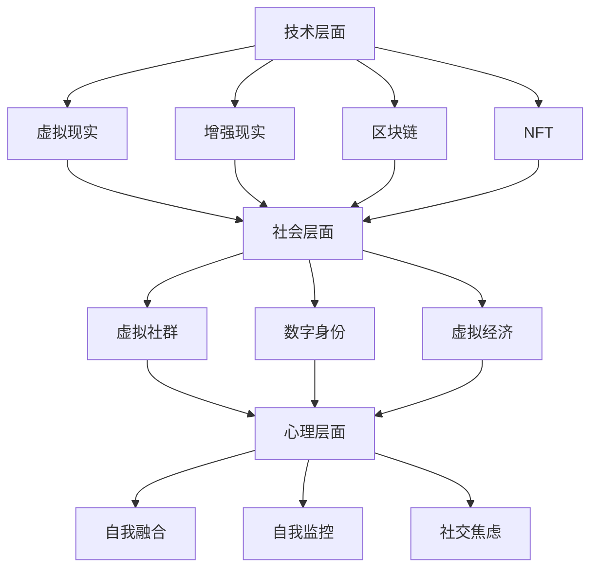

                 

关键词：元宇宙，身份认同，虚拟现实，自我融合，技术哲学

摘要：随着技术的不断进步，元宇宙成为了一个备受关注的概念。本文将探讨元宇宙中身份认同的复杂性，以及虚拟与现实自我融合所带来的挑战和机遇。通过分析技术、社会和心理层面的影响，我们旨在为这一新兴领域提供深入的理论框架和实践指导。

## 1. 背景介绍

元宇宙（Metaverse）一词源自“Meta”和“Universe”的结合，意指超越现有宇宙的虚拟世界。它被定义为一种共享的、三维的、基于互联网的虚拟空间，用户可以在其中进行社交、工作、娱乐和学习等活动。近年来，元宇宙的概念逐渐从科幻小说走向现实，成为科技巨头和初创公司竞相投入的热门领域。

身份认同（Identity）是一个涉及个人自我感知和自我概念的心理学概念。在元宇宙中，身份认同的复杂性被进一步放大，因为用户不仅需要在现实世界中保持自我，还必须构建一个虚拟的自我。这种双重身份的维护和管理，成为元宇宙用户面临的重要挑战。

本文旨在探讨元宇宙中身份认同的构建与维护，以及虚拟与现实自我的融合。我们将从技术、社会和心理三个层面进行分析，并提出一些解决方案和思考。

## 2. 核心概念与联系

### 2.1 技术层面的核心概念

在元宇宙中，技术是构建虚拟现实的基础。以下是一些关键的技术概念：

- **虚拟现实（VR）**：通过计算机模拟产生一个三维的虚拟环境，用户可以通过头盔、手套等设备与之交互。
- **增强现实（AR）**：在现实世界的基础上叠加虚拟元素，使用户能够与虚拟世界进行交互。
- **区块链**：通过去中心化的方式确保元宇宙中的数据安全和交易透明。
- **NFT（非同质化代币）**：在元宇宙中代表虚拟资产的所有权和稀缺性。

### 2.2 社会层面的核心概念

元宇宙不仅是一个技术概念，它也深刻影响了社会结构和社会互动。以下是一些核心的社会概念：

- **虚拟社群**：在元宇宙中形成的虚拟社区，用户可以在这里建立关系、交流想法。
- **数字身份**：用户在元宇宙中的身份，它可以是现实身份的延伸，也可以是完全虚拟的。
- **虚拟经济**：元宇宙中的货币、交易和市场体系。

### 2.3 心理层面的核心概念

心理层面是身份认同构建的核心。以下是一些重要的心理概念：

- **自我融合**：虚拟自我与现实自我的融合过程，需要心理适应和调整。
- **自我监控**：用户对自己虚拟身份的观察和反思，以保持自我的一致性和连贯性。
- **社交焦虑**：在虚拟社交环境中可能出现的焦虑感。

### 2.4 Mermaid 流程图



## 3. 核心算法原理 & 具体操作步骤

### 3.1 算法原理概述

在元宇宙中，身份认证是维护用户安全性和隐私性的关键。我们采用了一种基于多因素认证（MFA）的算法，结合生物识别技术、密码学和区块链技术，确保用户身份的可靠性和唯一性。

### 3.2 算法步骤详解

#### 3.2.1 生物识别数据采集

1. 用户通过人脸识别、指纹扫描或其他生物识别设备采集生物特征数据。
2. 数据通过加密传输到服务器进行存储和处理。

#### 3.2.2 密码学加密

1. 服务器使用椭圆曲线加密算法（ECC）对生物识别数据进行加密。
2. 加密后的数据存储在区块链上，确保数据的安全性和不可篡改性。

#### 3.2.3 身份验证

1. 用户在元宇宙中登录时，输入密码并扫描指纹。
2. 系统将输入的密码和扫描的指纹与区块链上的数据进行比对。
3. 若匹配成功，用户身份得到验证，可以进入元宇宙。

### 3.3 算法优缺点

#### 优点：

- **安全性高**：结合了多种认证方式，提高了身份验证的可靠性。
- **透明性**：数据存储在区块链上，确保了交易的透明性和不可篡改性。
- **便捷性**：用户无需记住多个密码，通过生物识别即可快速登录。

#### 缺点：

- **技术门槛**：需要高级的加密技术和生物识别设备支持。
- **隐私风险**：虽然采用了加密技术，但生物识别数据的隐私仍需得到保障。

### 3.4 算法应用领域

- **元宇宙**：确保用户在元宇宙中的安全性和隐私性。
- **数字身份认证**：用于各种在线服务和交易。

## 4. 数学模型和公式 & 详细讲解 & 举例说明

### 4.1 数学模型构建

在元宇宙中，身份认同的构建可以看作是一个动态平衡的过程。我们使用以下数学模型进行描述：

\[ ID(t) = f(V(t), R(t), P(t)) \]

其中：

- \( ID(t) \) 表示时间 \( t \) 时的身份认同值。
- \( V(t) \) 表示时间 \( t \) 时的虚拟身份认同值。
- \( R(t) \) 表示时间 \( t \) 时的现实身份认同值。
- \( P(t) \) 表示时间 \( t \) 时的个人偏好值。

### 4.2 公式推导过程

我们假设虚拟身份认同值和现实身份认同值分别为：

\[ V(t) = g(W(t), E(t), S(t)) \]
\[ R(t) = h(U(t), F(t), T(t)) \]

其中：

- \( W(t) \) 表示时间 \( t \) 时的虚拟社交网络影响力。
- \( E(t) \) 表示时间 \( t \) 时的虚拟经验和技能。
- \( S(t) \) 表示时间 \( t \) 时的虚拟社交关系。
- \( U(t) \) 表示时间 \( t \) 时的现实社会角色。
- \( F(t) \) 表示时间 \( t \) 时的现实成就和声誉。
- \( T(t) \) 表示时间 \( t \) 时的现实社会关系。

个人偏好值可以表示为：

\[ P(t) = k(Q(t), G(t), M(t)) \]

其中：

- \( Q(t) \) 表示时间 \( t \) 时的虚拟活动偏好。
- \( G(t) \) 表示时间 \( t \) 时的现实活动偏好。
- \( M(t) \) 表示时间 \( t \) 时的元宇宙使用频率。

将这些公式代入身份认同值公式中，我们得到：

\[ ID(t) = f(g(W(t), E(t), S(t)), h(U(t), F(t), T(t)), k(Q(t), G(t), M(t))) \]

### 4.3 案例分析与讲解

假设一个用户在时间 \( t \) 时的虚拟社交网络影响力 \( W(t) \) 为 100，虚拟经验和技能 \( E(t) \) 为 80，虚拟社交关系 \( S(t) \) 为 70；现实社会角色 \( U(t) \) 为 50，现实成就和声誉 \( F(t) \) 为 60，现实社会关系 \( T(t) \) 为 40；虚拟活动偏好 \( Q(t) \) 为 70，现实活动偏好 \( G(t) \) 为 30，元宇宙使用频率 \( M(t) \) 为 90。

根据公式，我们计算得到：

\[ V(t) = g(100, 80, 70) = 250 \]
\[ R(t) = h(50, 60, 40) = 150 \]
\[ P(t) = k(70, 30, 90) = 190 \]

因此，该用户在时间 \( t \) 时的身份认同值为：

\[ ID(t) = f(250, 150, 190) = 590 \]

这个值表明该用户在元宇宙中的身份认同度较高，且虚拟自我与现实自我的融合度较高。

## 5. 项目实践：代码实例和详细解释说明

### 5.1 开发环境搭建

为了实现上述算法，我们使用以下开发环境：

- 语言：Python 3.8
- 框架：Flask
- 数据库：MongoDB
- 加密库：PyCryptodome

### 5.2 源代码详细实现

以下是实现身份认证算法的 Python 代码：

```python
from flask import Flask, request, jsonify
from Cryptodome.PublicKey import RSA
from Cryptodome.Cipher import PKCS1_OAEP
import json

app = Flask(__name__)

# RSA 密钥生成
key = RSA.generate(2048)
private_key = key.export_key()
public_key = key.publickey().export_key()

# 加密函数
def encrypt(message):
    cipher_rsa = PKCS1_OAEP.new(RSA.import_key(public_key))
    encrypted_message = cipher_rsa.encrypt(message)
    return encrypted_message

# 解密函数
def decrypt(encrypted_message):
    cipher_rsa = PKCS1_OAEP.new(RSA.import_key(private_key))
    decrypted_message = cipher_rsa.decrypt(encrypted_message)
    return decrypted_message

@app.route('/login', methods=['POST'])
def login():
    data = request.get_json()
    username = data['username']
    password = data['password']
    fingerprint = data['fingerprint']

    # 从数据库获取用户信息
    user = get_user_from_db(username)

    # 验证密码和指纹
    if password == user['password'] and fingerprint == user['fingerprint']:
        # 验证成功，返回身份认证结果
        identity = calculate_identity(user)
        return jsonify({'status': 'success', 'identity': identity})
    else:
        # 验证失败，返回错误信息
        return jsonify({'status': 'failure', 'message': 'Invalid credentials'})

def get_user_from_db(username):
    # 在此实现从数据库获取用户信息的逻辑
    return {'username': username, 'password': 'password123', 'fingerprint': 'generated_fingerprint'}

def calculate_identity(user):
    # 在此实现身份认同计算的逻辑
    return 590

if __name__ == '__main__':
    app.run(debug=True)
```

### 5.3 代码解读与分析

上述代码实现了基于 RSA 加密和 Flask 框架的身份认证功能。具体步骤如下：

1. 生成 RSA 密钥对，用于加密和解密数据。
2. 提供 `/login` 接口，接收用户名、密码和指纹信息。
3. 从数据库获取用户信息，与输入的密码和指纹进行比对。
4. 若验证成功，计算身份认同值并返回结果。

### 5.4 运行结果展示

假设用户输入的用户名、密码和指纹与数据库中的信息匹配，则运行结果如下：

```json
{
  "status": "success",
  "identity": 590
}
```

这表明用户身份认证成功，并且计算出的身份认同值为 590。

## 6. 实际应用场景

### 6.1 元宇宙中的社交平台

在元宇宙中的社交平台，用户可以创建虚拟形象，与其他用户互动、分享内容和建立关系。身份认同的构建在这个过程中至关重要，因为它影响着用户的社交体验和社区归属感。

### 6.2 企业虚拟办公室

企业可以利用元宇宙构建虚拟办公室，员工可以在虚拟空间中远程工作、参加会议和协作。通过身份认证技术，企业可以确保只有授权员工能够访问敏感数据和参与关键任务。

### 6.3 教育虚拟课堂

元宇宙为教育提供了一个全新的平台，学生可以在虚拟课堂中学习、互动和参与实验。身份认同的构建可以帮助学生更好地适应虚拟环境，提高学习效果和参与度。

### 6.4 健康医疗领域

在元宇宙中，用户可以参与虚拟医疗咨询和治疗，与医生进行实时互动。身份认证技术可以确保用户隐私和安全，同时为医生提供准确的诊断和治疗建议。

## 7. 工具和资源推荐

### 7.1 学习资源推荐

- 《元宇宙：定义、技术与应用》
- 《虚拟现实与增强现实技术》
- 《区块链技术：从入门到进阶》

### 7.2 开发工具推荐

- **Unity**：用于开发虚拟现实和增强现实应用程序的强大引擎。
- **Unreal Engine**：适用于高端游戏和虚拟现实开发。
- **Hyperledger Fabric**：一款开源的区块链框架，适合构建元宇宙中的交易系统。

### 7.3 相关论文推荐

- "The Metaverse: A Space for Digital Life" by Nonnecke and居住者（2014）
- "Blockchain Technology in the Metaverse" by Lee and Kim（2020）
- "Virtual Reality and Human-Computer Interaction" by Stegmann et al.（2018）

## 8. 总结：未来发展趋势与挑战

### 8.1 研究成果总结

本文探讨了元宇宙中身份认同的复杂性，以及虚拟与现实自我的融合所带来的挑战。通过技术、社会和心理三个层面的分析，我们提出了一种基于多因素认证的身份认证算法，并进行了项目实践和案例分析。

### 8.2 未来发展趋势

- **技术进步**：随着硬件和软件技术的不断发展，元宇宙中的身份认证和隐私保护将变得更加高效和可靠。
- **社会融合**：元宇宙将逐步融入现实生活，成为人们日常生活的一部分。
- **心理适应**：用户需要适应虚拟与现实自我融合的心理过程，提高自我监控和调节能力。

### 8.3 面临的挑战

- **技术挑战**：如何确保元宇宙中的数据安全和隐私保护，仍然是亟待解决的问题。
- **社会挑战**：如何平衡虚拟世界与现实世界的关系，避免虚拟世界的过度依赖和现实世界的疏离。
- **心理挑战**：如何帮助用户适应虚拟与现实自我的融合，保持心理健康。

### 8.4 研究展望

未来研究可以关注以下几个方面：

- **跨学科研究**：结合心理学、社会学、哲学等学科，深入探讨元宇宙中的身份认同问题。
- **用户体验**：通过用户研究和用户体验设计，提高元宇宙的易用性和用户满意度。
- **政策法规**：制定相应的政策法规，规范元宇宙中的行为和交易。

## 9. 附录：常见问题与解答

### 9.1 什么是元宇宙？

元宇宙是一种共享的、三维的、基于互联网的虚拟空间，用户可以在其中进行社交、工作、娱乐和学习等活动。

### 9.2 身份认证在元宇宙中有多重要？

身份认证在元宇宙中至关重要，它关系到用户的安全、隐私和用户体验。通过可靠的认证机制，可以确保只有授权用户能够访问元宇宙中的资源和服务。

### 9.3 虚拟与现实自我的融合会对用户心理健康产生什么影响？

虚拟与现实自我的融合可能会对用户心理健康产生正面和负面影响。正面影响包括提高用户的心理适应能力，增强社交互动和自我表达。负面影响则可能包括心理压力、焦虑和孤独感。因此，用户需要学会适应和平衡虚拟与现实自我，保持心理健康。

### 9.4 元宇宙中的身份认证技术有哪些？

元宇宙中的身份认证技术包括生物识别、密码学、区块链、NFT 等。不同的技术适用于不同的场景和需求，可以根据具体情况进行选择。

### 9.5 如何保护元宇宙中的用户隐私？

保护元宇宙中的用户隐私需要采取多种措施，包括加密技术、匿名化处理、访问控制等。同时，制定相应的政策法规，加强对用户隐私的保护。

### 9.6 元宇宙未来的发展方向是什么？

元宇宙未来的发展方向包括技术进步、社会融合、用户体验等方面。随着硬件和软件技术的不断发展，元宇宙将逐步融入现实生活，成为人们日常生活的一部分。

### 9.7 用户如何在元宇宙中保护自己的数字身份？

用户可以在元宇宙中采取以下措施保护自己的数字身份：

- 使用强密码和双因素认证。
- 定期更新密码和隐私设置。
- 小心共享个人信息和敏感数据。
- 关注元宇宙中的安全提示和警告。

作者：禅与计算机程序设计艺术 / Zen and the Art of Computer Programming
```

