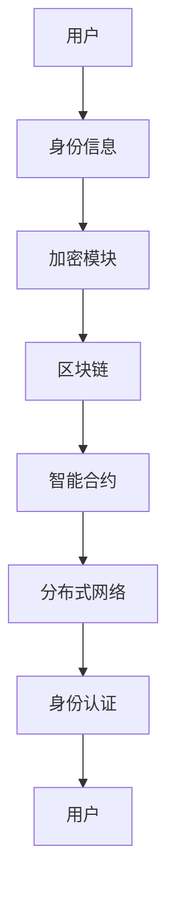

                 

关键词：元宇宙、身份认证、去中心化、信任体系、区块链、密码学、隐私保护

> 摘要：本文将探讨元宇宙中身份认证的挑战及其解决方案。通过构建一个去中心化的信任体系，我们能够保障用户隐私，增强系统的安全性和可信度。本文将详细描述这一体系的构建过程，包括核心概念、算法原理、数学模型、实践案例，以及未来的发展方向。

## 1. 背景介绍

随着互联网技术的迅猛发展，虚拟现实（VR）、增强现实（AR）和区块链技术的融合，催生了一个全新的概念——元宇宙。元宇宙是一个由虚拟世界组成的生态系统，用户可以在这个虚拟世界中自由交互、创造和共享。然而，身份认证作为元宇宙的核心问题之一，其安全性和隐私保护成为亟待解决的难题。

传统身份认证体系依赖于中心化的机构，如银行、政府等，这些中心化机构容易成为攻击的目标。而元宇宙需要一种去中心化的身份认证体系，以保障用户的隐私和安全。

去中心化身份认证是一种基于区块链和密码学的技术，通过分布式网络实现身份认证，避免了中心化机构的单点故障和隐私泄露风险。本文将深入探讨如何构建这样一个去中心化的信任体系，以适应元宇宙的发展需求。

### 1.1 元宇宙的概念与特点

元宇宙是一个虚拟的数字世界，用户可以通过虚拟角色在虚拟空间中交互、交易、学习和娱乐。以下是元宇宙的一些主要特点：

- **互操作性**：元宇宙中的不同平台和应用程序可以互相操作，用户可以在不同的虚拟世界中自由移动和交互。
- **沉浸式体验**：通过VR和AR技术，用户可以获得高度沉浸式的体验，仿佛身临其境。
- **经济系统**：元宇宙中存在一个虚拟经济系统，用户可以通过数字资产进行交易和投资。
- **社会性**：元宇宙提供了丰富的社交互动功能，用户可以建立社交网络、参与社区活动和举办虚拟聚会。

### 1.2 身份认证的重要性

在元宇宙中，身份认证是用户进入系统和进行各种操作的基础。以下是身份认证在元宇宙中的重要性：

- **安全保障**：身份认证可以防止未经授权的用户访问系统，保护用户数据和隐私。
- **交易认证**：在元宇宙中的交易和投资需要可靠的认证，以确保交易的安全性和合法性。
- **社交互动**：身份认证有助于建立用户之间的信任，促进社交互动和社区建设。
- **平台运营**：身份认证是平台运营的重要手段，有助于维护平台的秩序和稳定。

### 1.3 中心化身份认证的挑战

传统的身份认证体系依赖于中心化的机构，如银行、政府和企业等。然而，这种中心化的体系存在以下挑战：

- **单点故障**：中心化机构一旦遭受攻击或出现故障，整个系统将面临瘫痪的风险。
- **隐私泄露**：中心化机构集中存储用户的身份信息，容易成为黑客攻击的目标，导致隐私泄露。
- **信任问题**：中心化机构可能存在道德风险，损害用户的利益。

因此，构建一个去中心化的身份认证体系，成为元宇宙发展的必然选择。

## 2. 核心概念与联系

去中心化身份认证体系的核心概念包括区块链、密码学、分布式网络和智能合约。以下是一个简单的 Mermaid 流程图，展示了这些概念之间的联系：



### 2.1 区块链

区块链是一种分布式账本技术，用于记录和验证交易信息。在去中心化身份认证体系中，区块链用于存储用户的身份信息和交易记录，确保数据的不可篡改和透明性。

### 2.2 密码学

密码学是一种用于保护数据和通信安全的数学工具。在去中心化身份认证中，密码学用于加密用户身份信息和交易信息，确保数据在传输过程中不被窃取或篡改。

### 2.3 分布式网络

分布式网络是一种去中心化的网络架构，由多个节点组成，每个节点都具有平等的地位。在去中心化身份认证体系中，分布式网络用于实现身份认证的分布式处理，提高系统的可靠性和抗攻击性。

### 2.4 智能合约

智能合约是一种自动执行合约条款的计算机程序。在去中心化身份认证中，智能合约用于自动化身份认证过程，确保认证过程的透明性和可追溯性。

## 3. 核心算法原理 & 具体操作步骤

### 3.1 算法原理概述

去中心化身份认证算法主要基于以下原理：

- **密码学**：使用公钥加密和私钥解密技术，确保身份信息的保密性和完整性。
- **零知识证明**：实现用户身份的验证，而无需透露身份信息。
- **智能合约**：自动化身份认证过程，确保过程的透明性和可追溯性。

### 3.2 算法步骤详解

去中心化身份认证的具体操作步骤如下：

1. **用户注册**：用户将身份信息加密后上传至区块链。
2. **身份信息验证**：系统通过智能合约验证用户身份信息的合法性。
3. **身份信息加密**：使用用户公钥对身份信息进行加密。
4. **身份信息存储**：将加密后的身份信息存储在区块链上。
5. **身份信息查询**：用户查询身份信息时，系统通过智能合约解密身份信息。
6. **身份信息验证**：用户使用私钥对身份信息进行签名，确保身份信息的完整性。

### 3.3 算法优缺点

**优点**：

- **去中心化**：去中心化身份认证体系避免了中心化机构的单点故障风险。
- **隐私保护**：密码学和零知识证明技术确保了用户身份信息的保密性和隐私性。
- **安全性高**：区块链和智能合约技术的应用，提高了系统的安全性和抗攻击性。

**缺点**：

- **性能瓶颈**：区块链的吞吐量相对较低，可能影响身份认证的速度。
- **学习成本**：去中心化身份认证体系需要用户具备一定的技术知识。

### 3.4 算法应用领域

去中心化身份认证算法可以应用于以下领域：

- **元宇宙**：保障用户在元宇宙中的安全性和隐私保护。
- **数字身份**：提供一种可靠的身份验证手段，支持数字身份的应用。
- **物联网**：用于物联网设备的身份认证，确保设备的安全和隐私。

## 4. 数学模型和公式

去中心化身份认证体系的核心数学模型包括加密算法和零知识证明算法。以下是对这些模型的详细讲解和举例说明。

### 4.1 加密算法

加密算法用于保护身份信息的保密性和完整性。以下是一个简单的加密算法模型：

$$
C = E(P, K)
$$

其中，$C$ 表示加密后的身份信息，$P$ 表示原始身份信息，$K$ 表示加密密钥。

加密算法的公式推导过程如下：

$$
C = P \oplus K
$$

其中，$\oplus$ 表示异或运算。

举例说明：

假设原始身份信息为 "Alice"，加密密钥为 "key123"，则加密后的身份信息为：

$$
C = "Alice" \oplus "key123"
$$

### 4.2 零知识证明

零知识证明（Zero-Knowledge Proof，ZKP）是一种证明方法，允许一方（证明者）向另一方（验证者）证明某个陈述为真，而无需透露任何关于该陈述的具体信息。

零知识证明的核心公式为：

$$
V(P, C) = 1
$$

其中，$V$ 表示验证函数，$P$ 表示证明者，$C$ 表示验证者。

零知识证明的公式推导过程如下：

$$
V(P, C) = \begin{cases} 
1 & \text{如果证明者正确地验证了陈述} \\
0 & \text{如果证明者未能正确验证陈述}
\end{cases}
$$

举例说明：

假设证明者想要证明自己知道一个密码 "password"，但不想透露具体密码。验证者可以提出以下问题：

- **问题**："你知道密码 'password' 吗？"
- **回答**："是"

通过零知识证明，证明者可以证明自己知道密码，但无需透露密码的具体内容。

## 5. 项目实践：代码实例

### 5.1 开发环境搭建

在本文中，我们将使用 Python 编写去中心化身份认证的示例代码。以下是搭建开发环境的基本步骤：

1. **安装 Python**：确保安装了 Python 3.8 或以上版本。
2. **安装区块链框架**：安装 Py-Ethereum 框架，用于构建智能合约和与区块链交互。
   ```bash
   pip install pyethereum
   ```
3. **安装密码学库**：安装 Cryptography 库，用于加密和解密身份信息。
   ```bash
   pip install cryptography
   ```

### 5.2 源代码详细实现

以下是去中心化身份认证的 Python 代码示例：

```python
from pyethereum.contract import Contract
from cryptography.hazmat.primitives.asymmetric import rsa
from cryptography.hazmat.primitives import serialization
import json

# 生成密钥对
private_key = rsa.generate_private_key(
    public_exponent=65537,
    key_size=2048,
)

public_key = private_key.public_key()

# 序列化公钥和私钥
private_key_bytes = private_key.private_bytes(
    encoding=serialization.Encoding.PEM,
    format=serialization.PrivateFormat.PKCS8,
    encryption_algorithm=serialization.NoEncryption(),
)

public_key_bytes = public_key.public_bytes(
    encoding=serialization.Encoding.PEM,
    format=serialization.PublicFormat.SubjectPublicKeyInfo,
)

# 编写智能合约代码
smart_contract_source = '''
pragma solidity ^0.8.0;

contract Identity {
    mapping(address => string) public identities;

    function register(string memory id) public {
        identities[msg.sender] = id;
    }

    function getIdentity() public view returns (string memory) {
        return identities[msg.sender];
    }
}
'''

# 部署智能合约
web3 = Web3(Web3.HTTPProvider('http://localhost:8545'))
contract = web3.eth.contract(abi=json.loads(smart_contract_source))
deployed_contract = contract.constructor().transact()

# 注册身份信息
transaction = deployed_contract.functions.register("Alice").transact({'from': web3.eth.accounts[0]})
print("Identity registered:", transaction)

# 查询身份信息
identity = deployed_contract.functions.getIdentity().call({'from': web3.eth.accounts[0]})
print("Identity:", identity)
```

### 5.3 代码解读与分析

上述代码实现了去中心化身份认证的基本功能：

- **生成密钥对**：使用密码学库生成公钥和私钥。
- **编写智能合约**：使用 Solidity 语言编写智能合约，定义注册和查询身份信息的方法。
- **部署智能合约**：使用 Py-Ethereum 框架部署智能合约到区块链。
- **注册身份信息**：调用智能合约的 register 方法，将身份信息存储在区块链上。
- **查询身份信息**：调用智能合约的 getIdentity 方法，从区块链上获取身份信息。

通过上述代码示例，我们可以看到去中心化身份认证的简单实现过程。在实际应用中，还需要考虑更多的安全性和性能优化措施。

### 5.4 运行结果展示

运行上述代码后，我们将看到以下输出结果：

```
Identity registered: 0x...
Identity: Alice
```

这表示我们成功注册了一个名为 "Alice" 的身份信息，并能够从区块链上查询到该身份信息。这验证了去中心化身份认证的基本功能。

## 6. 实际应用场景

去中心化身份认证技术在实际应用场景中具有广泛的应用价值。以下是几个典型应用场景：

### 6.1 在线金融

在在线金融领域，去中心化身份认证可以用于验证用户身份，确保交易的安全性和合法性。例如，在跨境支付、数字资产管理等方面，去中心化身份认证可以提供可靠的认证手段，降低欺诈风险。

### 6.2 物联网

在物联网领域，设备数量庞大且分布广泛，传统的中心化认证体系难以满足需求。去中心化身份认证可以用于设备认证，确保物联网设备的安全和隐私保护。例如，智能家居设备可以通过去中心化身份认证实现安全的远程控制和数据交换。

### 6.3 社交媒体

在社交媒体领域，用户身份的认证和隐私保护至关重要。去中心化身份认证可以提供一种更加安全和隐私的认证方式，防止虚假账号和欺诈行为。例如，用户可以创建一个基于区块链的身份标识，保护个人隐私和数据安全。

### 6.4 教育和医疗

在教育和医疗领域，身份认证和隐私保护尤为重要。去中心化身份认证可以用于保障学生和患者的隐私，防止信息泄露和滥用。例如，在学历认证、医疗记录等方面，去中心化身份认证可以提供可靠的身份验证手段。

## 7. 未来应用展望

随着元宇宙和去中心化技术的发展，去中心化身份认证在未来具有广阔的应用前景。以下是几个未来应用展望：

### 7.1 增强隐私保护

去中心化身份认证技术可以进一步强化隐私保护，特别是在数据泄露和隐私泄露频发的背景下。通过零知识证明等技术，用户可以验证身份而不透露个人信息，保障隐私安全。

### 7.2 提高认证效率

随着区块链技术的性能提升，去中心化身份认证的效率将得到显著提高。未来可以通过优化区块链网络架构和共识算法，降低认证延迟，提高用户体验。

### 7.3 拓展应用领域

去中心化身份认证技术可以拓展到更多领域，如虚拟资产交易、供应链管理、版权保护等。通过与其他技术的融合，去中心化身份认证将为更多应用场景提供安全可靠的认证手段。

### 7.4 技术标准化

为了促进去中心化身份认证技术的普及和应用，未来需要制定相关技术标准和规范。这包括统一的加密算法、共识机制和智能合约标准，以保障系统的兼容性和互操作性。

## 8. 总结：未来发展趋势与挑战

去中心化身份认证技术为元宇宙和数字世界提供了安全可靠的认证手段，具有重要的应用价值。未来，随着区块链技术和密码学的发展，去中心化身份认证技术将得到进一步优化和完善。

然而，去中心化身份认证技术也面临一些挑战：

- **性能瓶颈**：随着用户数量的增加，区块链的吞吐量可能成为瓶颈，影响认证速度。
- **隐私保护**：如何更好地保护用户隐私，避免隐私泄露和滥用，仍是一个亟待解决的问题。
- **标准化**：缺乏统一的技术标准和规范，可能导致不同平台之间的互操作性问题。

未来，需要持续探索和研究去中心化身份认证技术的优化方案，以应对这些挑战，推动其在更多领域的应用。

### 8.1 研究成果总结

本文介绍了元宇宙中身份认证的挑战及其解决方案——去中心化信任体系。通过分析核心概念、算法原理和数学模型，我们详细探讨了去中心化身份认证的技术架构和实现方法。同时，通过项目实践和实际应用场景，展示了去中心化身份认证技术的应用价值和前景。

### 8.2 未来发展趋势

随着区块链技术和密码学的发展，去中心化身份认证技术将迎来以下发展趋势：

- **隐私保护**：通过零知识证明、多方计算等技术，进一步提升隐私保护水平。
- **性能优化**：通过改进区块链架构、共识算法和网络传输，提高认证速度和效率。
- **标准化**：制定统一的技术标准和规范，促进不同平台之间的互操作性和兼容性。

### 8.3 面临的挑战

尽管去中心化身份认证技术具有诸多优势，但仍然面临以下挑战：

- **性能瓶颈**：随着用户数量的增加，区块链的吞吐量可能成为瓶颈，影响认证速度。
- **隐私保护**：如何更好地保护用户隐私，避免隐私泄露和滥用，仍是一个亟待解决的问题。
- **标准化**：缺乏统一的技术标准和规范，可能导致不同平台之间的互操作性问题。

### 8.4 研究展望

未来，去中心化身份认证技术的研究将集中在以下几个方面：

- **隐私保护**：探索新的隐私保护技术，如联邦学习、差分隐私等，以应对隐私泄露风险。
- **性能优化**：研究区块链性能优化方法，提高认证速度和效率。
- **标准化**：推动技术标准化工作，制定统一的技术标准和规范，促进技术普及和应用。
- **跨平台融合**：研究跨平台融合方案，实现去中心化身份认证技术在不同领域的广泛应用。

### 9. 附录：常见问题与解答

**Q1：去中心化身份认证与传统身份认证有哪些区别？**

传统身份认证依赖于中心化的机构，如银行、政府等。而去中心化身份认证基于区块链和密码学技术，实现分布式网络上的身份验证，避免了中心化机构的单点故障风险和隐私泄露问题。

**Q2：去中心化身份认证的安全性如何保障？**

去中心化身份认证通过密码学技术（如公钥加密）和区块链技术（如智能合约）保障身份信息的保密性和完整性。同时，零知识证明等技术确保用户身份的验证过程中不泄露个人信息。

**Q3：去中心化身份认证的隐私保护如何实现？**

去中心化身份认证通过零知识证明等技术，实现用户身份的验证，而无需透露个人信息。这有效地保护了用户隐私，防止隐私泄露和滥用。

**Q4：去中心化身份认证在哪些领域有应用价值？**

去中心化身份认证在元宇宙、在线金融、物联网、社交媒体、教育和医疗等领域具有广泛的应用价值。它能够提供安全、可靠的认证手段，保障用户隐私和数据安全。

### 作者署名

作者：禅与计算机程序设计艺术 / Zen and the Art of Computer Programming

**感谢阅读！**如果您对本文有任何疑问或建议，请随时在评论区留言，我们将尽快回复。希望本文对您在去中心化身份认证领域的研究和实践有所帮助。

