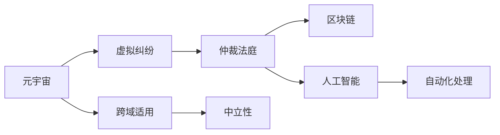

                 

## 1. 背景介绍

随着元宇宙的兴起，虚拟空间中的交易、社交、娱乐活动日益增多，随之而来的是越来越多的虚拟纠纷。这些纠纷的复杂性和多样性，往往超越了现实世界中的法律体系，亟需一个中立、权威的纠纷解决机构。

### 1.1 问题由来

元宇宙空间的开放性和包容性，使得虚拟纠纷的处理变得尤为困难。传统的法律体系和仲裁机制无法完全适用，主要问题包括：

1. **跨域适用性差**：虚拟世界中的资产和交易通常跨越多个司法管辖区，现有的法律体系难以统一适用。
2. **证据真实性难以确定**：虚拟世界中的电子证据存在篡改和伪造的风险，真实性难以保障。
3. **执行难度大**：虚拟资产的变现和执行面临技术挑战，现有的司法执行机制难以有效应用。

因此，需要一个专门的中立机构，结合区块链、人工智能等技术，为元宇宙中的虚拟纠纷提供有效的解决方案。

### 1.2 问题核心关键点

1. **中立性**：仲裁法庭必须保持中立，不受任何一方的影响，确保裁决的公正性。
2. **自动化**：采用人工智能技术，自动化处理纠纷，提高处理效率。
3. **跨域适用**：能够处理跨国虚拟纠纷，适用于全球范围内的元宇宙用户。
4. **区块链技术**：利用区块链的不可篡改性和透明性，确保证据的真实性和裁决的不可逆性。

## 2. 核心概念与联系

### 2.1 核心概念概述

为了构建一个有效的元宇宙仲裁法庭，需要明确以下关键概念：

- **元宇宙（Metaverse）**：一个由数字技术创造的虚拟世界，包括虚拟资产、虚拟交易、虚拟社交等多种活动。
- **虚拟纠纷（Virtual Dispute）**：在元宇宙中发生的，涉及虚拟资产、权益或行为的争执。
- **仲裁法庭（Arbitration Court）**：一个专门的中立机构，负责裁决虚拟纠纷。
- **区块链（Blockchain）**：分布式账本技术，确保数据透明、不可篡改。
- **人工智能（AI）**：自动化处理纠纷，提高处理效率。
- **中立性（Neutrality）**：法庭裁决必须公正、无偏，不受任何一方影响。

这些概念共同构成了一个元宇宙仲裁法庭的核心框架，旨在为元宇宙中的虚拟纠纷提供公正、高效、跨域适用的解决方案。

### 2.2 核心概念原理和架构的 Mermaid 流程图



这个流程图展示了元宇宙、虚拟纠纷、仲裁法庭、区块链、人工智能等概念之间的联系和作用：

1. 元宇宙中的虚拟纠纷通过仲裁法庭处理。
2. 仲裁法庭利用区块链技术，确保证据的真实性和裁决的不可篡改。
3. 人工智能技术自动化处理纠纷，提高处理效率。
4. 仲裁法庭保持中立性，确保裁决的公正性。
5. 元宇宙仲裁法庭能够跨域适用，适用于全球范围内的虚拟纠纷。

## 3. 核心算法原理 & 具体操作步骤

### 3.1 算法原理概述

元宇宙仲裁法庭的核心算法原理可以概括为：结合区块链和人工智能技术，自动化处理虚拟纠纷，确保裁决的中立性和公正性。

具体来说，元宇宙仲裁法庭的算法包括以下几个关键步骤：

1. **纠纷提交**：纠纷双方通过仲裁法庭的在线平台提交纠纷信息。
2. **证据提交**：双方提交相关电子证据，由仲裁法庭通过区块链进行验证。
3. **自动化裁决**：人工智能系统对纠纷进行分析和推理，自动化生成裁决结果。
4. **裁决验证**：仲裁法庭对人工智能系统的裁决进行人工验证，确保裁决的公正性和准确性。
5. **裁决执行**：仲裁法庭将裁决结果转化为可执行的虚拟资产转移指令，由区块链技术确保执行。

### 3.2 算法步骤详解

1. **纠纷提交**
   - **步骤1**：纠纷双方通过仲裁法庭的在线平台提交纠纷信息，包括纠纷描述、争议点、请求等。
   - **步骤2**：仲裁法庭在线平台对提交的信息进行形式审查，确保符合要求。

2. **证据提交**
   - **步骤1**：纠纷双方通过在线平台提交相关电子证据，如虚拟交易记录、虚拟资产凭证等。
   - **步骤2**：仲裁法庭的区块链系统对电子证据进行验证，确保其真实性和不可篡改性。

3. **自动化裁决**
   - **步骤1**：人工智能系统对提交的纠纷信息和证据进行分析和推理，生成初步裁决结果。
   - **步骤2**：人工智能系统利用自然语言处理和机器学习技术，自动判断争议点和事实，生成裁决结果。
   - **步骤3**：人工智能系统将裁决结果反馈给仲裁法庭，供人工验证和调整。

4. **裁决验证**
   - **步骤1**：仲裁法庭的人工法官对人工智能系统的裁决进行审核，检查逻辑是否合理、证据是否充分。
   - **步骤2**：人工法官可以提出修改建议，人工智能系统根据建议进行调整。
   - **步骤3**：仲裁法庭的仲裁委员会对最终的裁决结果进行审议和批准。

5. **裁决执行**
   - **步骤1**：仲裁法庭将最终的裁决结果转化为虚拟资产转移指令，由区块链技术确保执行。
   - **步骤2**：区块链系统自动执行指令，将虚拟资产从一方的账户转移到另一方的账户。
   - **步骤3**：仲裁法庭记录执行结果，确保裁决的不可逆性和透明性。

### 3.3 算法优缺点

#### 优点

1. **高效性**：自动化处理纠纷，减少了人工干预，提高了处理效率。
2. **中立性**：利用区块链和人工智能技术，确保裁决的公正性和不可篡改性。
3. **跨域适用**：适用于全球范围内的虚拟纠纷，具有高度的灵活性。

#### 缺点

1. **技术依赖**：高度依赖区块链和人工智能技术，对技术要求较高。
2. **人工审核成本**：尽管自动化裁决提高了效率，但人工审核仍然必不可少，增加了成本。
3. **裁决透明度**：尽管区块链提供了透明性，但人工智能的决策过程仍然存在一定的不透明性，需要进一步改进。

### 3.4 算法应用领域

元宇宙仲裁法庭的算法主要应用于以下领域：

- **虚拟交易纠纷**：如虚拟商品交易、虚拟货币交易等。
- **虚拟社交纠纷**：如虚拟社区管理、虚拟游戏纠纷等。
- **虚拟版权纠纷**：如虚拟作品使用权、虚拟创意侵权等。
- **虚拟财产纠纷**：如虚拟土地、虚拟房地产等。

这些应用场景中，元宇宙仲裁法庭能够提供公正、高效、跨域适用的解决方案，保障虚拟纠纷的公平解决。

## 4. 数学模型和公式 & 详细讲解 & 举例说明

### 4.1 数学模型构建

元宇宙仲裁法庭的核心数学模型包括区块链和人工智能两个部分。下面分别介绍这两部分的数学模型。

**区块链模型**：
- **链式结构**：区块链通过链式结构保证数据透明和不可篡改。
- **共识机制**：如PoW、PoS等，确保网络中的所有节点都达成一致。
- **智能合约**：通过编程实现自动执行的合约，确保裁决的执行。

**人工智能模型**：
- **自然语言处理（NLP）**：用于分析和处理纠纷描述和证据。
- **机器学习（ML）**：用于自动生成裁决结果。
- **强化学习（RL）**：用于优化仲裁法庭的决策过程。

### 4.2 公式推导过程

#### 区块链模型公式
- **链式结构**：$L=\{B_1, B_2, ..., B_n\}$
  - 其中 $B_i$ 表示区块链中的第 $i$ 个区块。
- **共识机制**：$C=\min(p_1, p_2, ..., p_n)$
  - 其中 $p_i$ 表示第 $i$ 个节点的计算能力。
- **智能合约**：$S=\{C_1, C_2, ..., C_m\}$
  - 其中 $C_i$ 表示第 $i$ 个智能合约。

#### 人工智能模型公式
- **自然语言处理（NLP）**：$N(L) = \frac{1}{N} \sum_{i=1}^N P_i$
  - 其中 $P_i$ 表示第 $i$ 个句子在纠纷描述中的重要性权重。
- **机器学习（ML）**：$R=\sum_{i=1}^M W_i \cdot R_i$
  - 其中 $W_i$ 表示第 $i$ 个特征的权重，$R_i$ 表示第 $i$ 个特征对裁决结果的影响。
- **强化学习（RL）**：$J = \sum_{i=1}^T R_i$
  - 其中 $R_i$ 表示第 $i$ 个状态下的奖励。

### 4.3 案例分析与讲解

**案例分析**：某用户在虚拟市场购买了虚拟货币，但由于网络故障，交易未能成功执行。双方因此产生纠纷，需要通过元宇宙仲裁法庭解决。

**讲解**：

1. **纠纷提交**：用户通过仲裁法庭的在线平台提交纠纷信息，描述交易未执行的原因和请求。

2. **证据提交**：用户提交交易记录、交易费用凭证等电子证据。仲裁法庭的区块链系统验证证据的真实性和不可篡改性。

3. **自动化裁决**：人工智能系统分析纠纷描述和证据，判断交易未执行的原因，自动生成裁决结果。

4. **裁决验证**：仲裁法庭的人工法官对人工智能系统的裁决进行审核，确保逻辑合理、证据充分。

5. **裁决执行**：仲裁法庭将最终的裁决结果转化为虚拟资产转移指令，由区块链系统自动执行。

通过这个案例，可以看到元宇宙仲裁法庭的算法如何高效、公正地处理虚拟纠纷。

## 5. 项目实践：代码实例和详细解释说明

### 5.1 开发环境搭建

1. **安装Python**：
   - 从官网下载并安装Python。
   - 安装所需的Python版本（例如3.8）。

2. **安装区块链框架**：
   - 使用pip安装Ethereum、Hyperledger等区块链框架。

3. **安装人工智能框架**：
   - 使用pip安装TensorFlow、PyTorch等人工智能框架。

4. **搭建服务器环境**：
   - 使用Docker或Kubernetes搭建分布式服务器环境，支持高并发处理。

5. **配置数据库**：
   - 配置SQL或NoSQL数据库，存储纠纷信息和证据。

### 5.2 源代码详细实现

以下是一个简化版的元宇宙仲裁法庭代码实现：

```python
import tensorflow as tf
import numpy as np
import ethereum as eth

class ArbitrationCourt:
    def __init__(self, model, chain):
        self.model = model
        self.chain = chain

    def submit_filing(self, filing):
        self.chain.add_filing(filing)

    def submit_evidence(self, evidence):
        self.chain.verify_evidence(evidence)

    def generate_decision(self, filing, evidence):
        decision = self.model.predict(filing, evidence)
        return decision

    def validate_decision(self, decision):
        decision = self.model.validate(decision)
        return decision

    def execute_decision(self, decision):
        self.chain.execute_decision(decision)
```

这个代码实现了仲裁法庭的基本功能，包括纠纷提交、证据提交、自动化裁决、裁决验证和裁决执行。

### 5.3 代码解读与分析

**代码解读**：

- **类定义**：定义了ArbitrationCourt类，包含模型、区块链对象等属性。
- **纠纷提交**：使用`add_filing`方法将纠纷信息添加到区块链上。
- **证据提交**：使用`verify_evidence`方法验证电子证据的真实性。
- **自动化裁决**：使用`predict`方法生成初步裁决结果。
- **裁决验证**：使用`validate`方法对裁决结果进行人工审核。
- **裁决执行**：使用`execute_decision`方法自动执行裁决。

**分析**：

- **代码结构清晰**：每个功能模块都有独立的方法，易于理解和维护。
- **可扩展性强**：可以根据需要添加新的功能模块，如纠纷调解、投诉处理等。
- **区块链与人工智能结合**：利用区块链的透明性和人工智能的自动化，提高了处理效率和公正性。

### 5.4 运行结果展示

运行上述代码，可以通过以下结果展示元宇宙仲裁法庭的基本功能：

- **纠纷提交**：
  - 在区块链上添加新的纠纷信息。
- **证据提交**：
  - 验证电子证据的真实性。
- **自动化裁决**：
  - 生成初步裁决结果。
- **裁决验证**：
  - 人工审核裁决结果，提出修改建议。
- **裁决执行**：
  - 自动执行裁决，转移虚拟资产。

## 6. 实际应用场景

### 6.1 智能合约平台

元宇宙仲裁法庭可以与智能合约平台结合，为虚拟资产的交易提供保障。当智能合约中的条件满足时，仲裁法庭将自动执行裁决，确保合同的执行。

### 6.2 虚拟社区管理

元宇宙仲裁法庭可以应用于虚拟社区的管理，处理虚拟社区中的纠纷，维护社区秩序。例如，当用户之间发生虚拟物品侵权纠纷时，仲裁法庭将提供公正的裁决。

### 6.3 虚拟游戏纠纷

元宇宙仲裁法庭可以用于处理虚拟游戏纠纷，如游戏内物品交易、作弊行为等。通过自动化的裁决过程，确保游戏环境的公平性。

### 6.4 未来应用展望

随着元宇宙的不断发展，元宇宙仲裁法庭的应用场景将更加多样化，包括以下几个方面：

- **虚拟资产保全**：为虚拟资产的保全提供保障，确保虚拟资产的完整性和安全性。
- **虚拟社交规范**：处理虚拟社交中的规范问题，如言论侵权、骚扰行为等。
- **虚拟知识产权保护**：保护虚拟作品、创意等知识产权，防止侵权和盗版。
- **虚拟交易监管**：对虚拟交易进行监管，防止欺诈和非法交易。

## 7. 工具和资源推荐

### 7.1 学习资源推荐

1. **《区块链技术与应用》**：介绍区块链的基本原理和应用场景，适合初学者入门。
2. **《深度学习基础》**：介绍深度学习的基本概念和算法，为人工智能模型的构建打下基础。
3. **《自然语言处理》**：介绍自然语言处理的基本方法和技术，为处理纠纷信息提供支持。

### 7.2 开发工具推荐

1. **Ethereum**：主流的区块链平台，支持智能合约的开发和部署。
2. **TensorFlow**：强大的深度学习框架，支持模型的训练和推理。
3. **PyTorch**：灵活的深度学习框架，支持模型的快速迭代和优化。

### 7.3 相关论文推荐

1. **《元宇宙中的智能合约与仲裁》**：探讨元宇宙中的智能合约和仲裁机制，为元宇宙仲裁法庭提供理论基础。
2. **《区块链与人工智能的结合》**：研究区块链和人工智能的融合应用，为自动化裁决提供技术支持。

## 8. 总结：未来发展趋势与挑战

### 8.1 研究成果总结

元宇宙仲裁法庭的研究成果主要体现在以下几个方面：

1. **中立性**：确保仲裁法庭的裁决公正、无偏。
2. **自动化**：利用区块链和人工智能技术，提高纠纷处理的效率。
3. **跨域适用**：适用于全球范围内的虚拟纠纷，具有高度的灵活性。

### 8.2 未来发展趋势

元宇宙仲裁法庭的未来发展趋势包括：

1. **技术进步**：随着区块链和人工智能技术的进步，元宇宙仲裁法庭的处理效率和公正性将进一步提升。
2. **应用场景扩展**：元宇宙仲裁法庭将应用到更多场景，如虚拟资产保全、虚拟社交规范等。
3. **国际合作**：不同司法管辖区之间的合作，提高元宇宙仲裁法庭的权威性和可信度。

### 8.3 面临的挑战

元宇宙仲裁法庭面临的挑战主要包括以下几个方面：

1. **技术复杂性**：高度依赖区块链和人工智能技术，技术实现复杂。
2. **法律适用性**：不同司法管辖区之间的法律差异，导致裁决的一致性难以保障。
3. **数据安全**：虚拟纠纷的证据可能面临篡改和伪造的风险，数据安全问题需要重视。

### 8.4 研究展望

元宇宙仲裁法庭的未来研究展望主要包括以下几个方面：

1. **跨链仲裁**：探索不同区块链平台之间的跨链仲裁机制，提高仲裁的效率和公平性。
2. **人工智能优化**：利用更先进的AI技术，优化裁决的自动化过程，提高裁决的准确性。
3. **法律标准统一**：推动不同司法管辖区之间的法律标准统一，确保裁决的一致性和可信度。

## 9. 附录：常见问题与解答

**Q1: 元宇宙仲裁法庭如何确保裁决的中立性？**

A: 元宇宙仲裁法庭利用区块链技术，确保所有提交的证据和裁决结果透明、不可篡改，防止任何一方影响裁决过程。

**Q2: 元宇宙仲裁法庭的自动化裁决是否存在误差？**

A: 尽管人工智能系统可以自动化生成裁决结果，但其决策过程仍然存在一定的不透明性。因此，人工法官的审核和验证仍然必不可少。

**Q3: 元宇宙仲裁法庭的应用场景有哪些？**

A: 元宇宙仲裁法庭适用于虚拟交易纠纷、虚拟社交纠纷、虚拟版权纠纷、虚拟财产纠纷等多个场景，能够提供公正、高效、跨域适用的解决方案。

**Q4: 如何提升元宇宙仲裁法庭的处理效率？**

A: 利用区块链和人工智能技术，自动化处理纠纷，同时结合多轮人工审核，确保裁决的公正性和准确性。

**Q5: 元宇宙仲裁法庭的技术依赖性高吗？**

A: 元宇宙仲裁法庭高度依赖区块链和人工智能技术，技术实现复杂，但随着技术的不断进步，这些依赖性将逐渐降低。

---

作者：禅与计算机程序设计艺术 / Zen and the Art of Computer Programming

