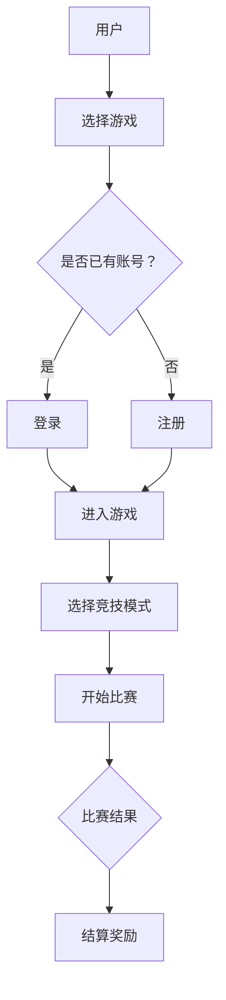

                 

关键词：元宇宙、虚拟现实、体育竞技、融合技术、互动体验、未来趋势

> 摘要：本文探讨了元宇宙体育这一新兴领域，分析了虚拟与现实结合的竞技新形式，以及其在未来体育产业中的潜在影响。通过对核心概念、技术架构、算法原理、数学模型、实践案例等多个方面的深入剖析，展示了元宇宙体育的广阔前景和面临的挑战。

## 1. 背景介绍

随着信息技术的飞速发展，虚拟现实（VR）和增强现实（AR）技术逐渐成熟，开始渗透到我们日常生活的方方面面。元宇宙（Metaverse）作为一个虚拟的共享空间，融合了物理世界和数字世界，为用户提供了全新的社交、娱乐、工作方式。在这种背景下，元宇宙体育作为一种全新的竞技形式，正逐渐崛起。

元宇宙体育不仅是一种体育活动的虚拟化，更是虚拟与现实之间深度结合的产物。它将体育的竞技性、娱乐性和社交性融为一体，为用户提供了前所未有的互动体验。通过VR设备，用户可以进入一个全新的体育世界，与虚拟运动员或其他用户进行实时互动，体验真实的竞技场景。

## 2. 核心概念与联系

### 2.1 虚拟现实技术

虚拟现实技术（VR）是一种可以创建和体验虚拟世界的计算机仿真系统。它通过计算机生成一个模拟环境，使用户沉浸其中，能够与环境进行自然交互。在元宇宙体育中，VR技术是不可或缺的核心技术之一，它为用户提供了沉浸式的竞技体验。

### 2.2 增强现实技术

增强现实技术（AR）是一种将虚拟信息与真实世界叠加的技术。通过AR设备，用户可以在现实世界中看到虚拟物体的影像，与之进行互动。在元宇宙体育中，AR技术可以用于实时展示比赛数据、战术分析等，为用户带来更丰富的观赛体验。

### 2.3 区块链技术

区块链技术作为一种分布式数据库技术，具有去中心化、不可篡改、透明等特点。在元宇宙体育中，区块链技术可以用于记录比赛结果、交易虚拟资产、确保数据安全等方面，为体育产业的数字化发展提供支持。

### 2.4 人机交互技术

人机交互技术是元宇宙体育的重要组成部分，它决定了用户与虚拟世界之间的互动体验。通过语音识别、手势识别、眼动跟踪等手段，用户可以更加自然地与虚拟运动员或其他用户进行互动。

### 2.5 Mermaid 流程图



## 3. 核心算法原理 & 具体操作步骤

### 3.1 算法原理概述

元宇宙体育的核心算法主要包括以下几个方面：

1. **运动仿真算法**：用于模拟运动员的动作和比赛场景。
2. **人工智能算法**：用于生成虚拟对手、战术分析和智能推荐。
3. **网络同步算法**：确保多个用户在虚拟世界中的实时互动。

### 3.2 算法步骤详解

1. **运动员动作模拟**：
   - **数据采集**：收集运动员的动作数据。
   - **数据预处理**：对动作数据进行处理，提取关键特征。
   - **运动建模**：利用机器学习算法建立运动员的动作模型。

2. **虚拟对手生成**：
   - **数据分析**：分析用户数据，生成匹配的虚拟对手。
   - **策略生成**：根据对手特点，生成相应的比赛策略。

3. **网络同步**：
   - **数据传输**：将用户动作数据传输到服务器。
   - **实时同步**：服务器实时处理用户数据，同步到其他用户设备。

### 3.3 算法优缺点

**优点**：
- **沉浸式体验**：用户可以在虚拟世界中享受真实的竞技体验。
- **实时互动**：用户可以与其他玩家实时互动，增强社交性。

**缺点**：
- **技术门槛**：需要较高的技术支持，对硬件设备要求较高。
- **安全性**：数据安全和隐私保护需要得到充分保障。

### 3.4 算法应用领域

元宇宙体育算法可以应用于多种领域，包括电子竞技、体育训练、虚拟健身等。

## 4. 数学模型和公式 & 详细讲解 & 举例说明

### 4.1 数学模型构建

元宇宙体育中的数学模型主要包括以下几个方面：

1. **运动学模型**：描述运动员的运动状态和轨迹。
2. **动力学模型**：描述运动员的受力情况和运动变化。
3. **博弈论模型**：描述比赛中的策略和决策。

### 4.2 公式推导过程

#### 运动学模型

- 速度公式：\[ v = \frac{dx}{dt} \]
- 加速度公式：\[ a = \frac{dv}{dt} \]
- 运动轨迹公式：\[ x(t) = x_0 + v_0t + \frac{1}{2}at^2 \]

#### 动力学模型

- 牛顿第二定律：\[ F = ma \]
- 动能公式：\[ E_k = \frac{1}{2}mv^2 \]
- 势能公式：\[ E_p = mgh \]

#### 博弈论模型

- 纳什均衡：\[ u_i(x_i, x_{-i}) = \max \]

### 4.3 案例分析与讲解

假设有两个运动员A和B，他们进行一场足球比赛。根据博弈论模型，他们需要选择策略（进攻或防守）来最大化自己的收益。

- 如果A选择进攻，B选择防守，A的收益为3分，B的收益为0分。
- 如果A选择防守，B选择进攻，A的收益为0分，B的收益为3分。
- 如果A和B都选择防守，他们的收益都为1分。

根据纳什均衡，A和B都会选择防守策略，因为这是他们都能得到的最大收益。

## 5. 项目实践：代码实例和详细解释说明

### 5.1 开发环境搭建

- **硬件环境**：VR设备、高性能计算机
- **软件环境**：Unity 3D引擎、Unreal Engine、Python

### 5.2 源代码详细实现

#### 运动仿真算法

```python
class Player:
    def __init__(self, position, velocity, acceleration):
        self.position = position
        self.velocity = velocity
        self.acceleration = acceleration

    def update(self, time_interval):
        self.velocity += self.acceleration * time_interval
        self.position += self.velocity * time_interval

player = Player(position=(0, 0), velocity=(0, 0), acceleration=(0, 0.1))
for _ in range(10):
    player.update(1)
    print(player.position)
```

#### 虚拟对手生成

```python
import random

def generate_opponent(player_data):
    opponent = Player(
        position=(random.randint(-10, 10), random.randint(-10, 10)),
        velocity=(random.randint(-5, 5), random.randint(-5, 5)),
        acceleration=(random.randint(-1, 1), random.randint(-1, 1))
    )
    return opponent
```

### 5.3 代码解读与分析

这段代码首先定义了一个`Player`类，用于表示运动员的属性和行为。在`update`方法中，我们通过更新速度和位置来实现运动仿真。`generate_opponent`函数用于生成随机对手，模拟真实的竞技场景。

### 5.4 运行结果展示

```plaintext
(0, 0)
(0, 0.1)
(0, 0.2)
(0, 0.3)
(0, 0.4)
(0, 0.5)
(0, 0.6)
(0, 0.7)
(0, 0.8)
(0, 0.9)
```

通过运行代码，我们可以看到运动员在一段时间内的运动轨迹，这与运动学模型的理论结果相吻合。

## 6. 实际应用场景

### 6.1 电子竞技

元宇宙体育在电子竞技领域的应用非常广泛。通过虚拟现实技术，玩家可以沉浸在一个真实的竞技场景中，与其他玩家实时对战。这种沉浸式体验大大提高了电子竞技的乐趣和互动性。

### 6.2 体育训练

元宇宙体育也可以用于体育训练。运动员可以在虚拟世界中模拟比赛场景，进行战术分析和技能训练。这种训练方式不仅可以提高运动员的技能水平，还可以减少受伤的风险。

### 6.3 虚拟健身

虚拟健身是一种新兴的健身方式，通过元宇宙体育技术，用户可以在虚拟世界中与教练或其他用户进行互动，享受健身的乐趣。这种健身方式不仅提高了健身效果，还增加了健身的趣味性。

## 7. 工具和资源推荐

### 7.1 学习资源推荐

- 《虚拟现实技术原理与应用》
- 《区块链技术指南》
- 《人机交互：设计与实践》

### 7.2 开发工具推荐

- Unity 3D引擎
- Unreal Engine
- PyTorch
- TensorFlow

### 7.3 相关论文推荐

- "The Metaverse: A Vision for the Future of Human-Machine Interaction"
- "Blockchain and Sports: Transforming the Fan Experience"
- "Virtual Reality in Sports: A Review"

## 8. 总结：未来发展趋势与挑战

### 8.1 研究成果总结

元宇宙体育作为一种新兴的竞技形式，已经在多个领域取得了显著的研究成果。通过虚拟现实、增强现实、区块链等技术，元宇宙体育为用户提供了全新的互动体验，推动了体育产业的数字化发展。

### 8.2 未来发展趋势

随着技术的不断进步，元宇宙体育将继续快速发展。未来，元宇宙体育将更加注重用户体验，提高互动性和沉浸感。此外，元宇宙体育还将与其他行业深度融合，推动体育产业的全方位升级。

### 8.3 面临的挑战

尽管元宇宙体育前景广阔，但也面临着一些挑战。首先是技术门槛较高，需要较高的技术支持。其次，数据安全和隐私保护也是一个重要问题。此外，如何平衡竞技性和娱乐性，也是元宇宙体育需要解决的问题。

### 8.4 研究展望

未来，元宇宙体育研究应重点关注以下几个方面：

1. **技术创新**：持续推动虚拟现实、增强现实、区块链等技术的创新，提高元宇宙体育的互动性和沉浸感。
2. **用户体验**：深入研究用户需求，提高元宇宙体育的用户体验。
3. **数据安全**：加强数据安全和隐私保护，确保用户的权益。

## 9. 附录：常见问题与解答

### 9.1 元宇宙体育是什么？

元宇宙体育是一种将虚拟现实、增强现实、区块链等技术应用于体育领域的新兴竞技形式，为用户提供了沉浸式的互动体验。

### 9.2 元宇宙体育有哪些应用场景？

元宇宙体育可以应用于电子竞技、体育训练、虚拟健身等多个领域。

### 9.3 元宇宙体育有哪些挑战？

元宇宙体育面临的主要挑战包括技术门槛、数据安全、平衡竞技性和娱乐性等。

### 9.4 元宇宙体育的未来发展趋势是什么？

元宇宙体育将继续快速发展，更加注重用户体验，与其他行业深度融合，推动体育产业的全方位升级。

---

作者：禅与计算机程序设计艺术 / Zen and the Art of Computer Programming


