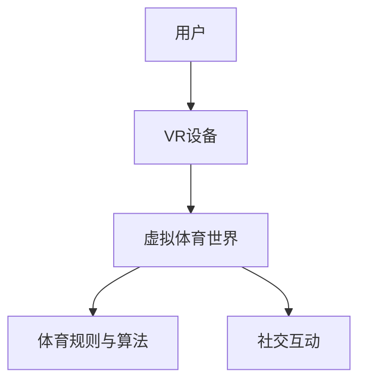

                 

关键词：元宇宙，体育，虚拟现实，竞技，融合

摘要：随着科技的飞速发展，元宇宙作为一种全新的虚拟现实空间逐渐进入人们的视野。本文将探讨元宇宙体育的概念、发展历程、核心概念及其与现实世界的联系，分析其背后的技术原理，并展望元宇宙体育的未来发展趋势。

## 1. 背景介绍

### 元宇宙的兴起

元宇宙（Metaverse）一词源于“Meta（超越）+ Universe（宇宙）”，意指超越现实世界的虚拟空间。自2010年代以来，随着虚拟现实（VR）、增强现实（AR）以及区块链技术的不断发展，元宇宙开始逐渐从概念走向实际应用。

### 体育产业与技术的融合

体育产业一直以来都是技术与创新的重要应用领域。随着互联网、大数据、云计算等技术的普及，体育产业逐渐开始拥抱数字化，从线上直播、数据分析到电子竞技，体育与技术的融合不断加深。而元宇宙的兴起，为体育产业带来了全新的发展机遇。

## 2. 核心概念与联系

### 元宇宙体育的定义

元宇宙体育是指在虚拟现实环境中进行的体育竞技活动，参与者通过VR设备进入虚拟体育世界，进行各种体育项目的竞技。

### 元宇宙体育的架构

**用户**：用户通过VR设备进入元宇宙体育世界，成为虚拟角色的玩家。

**虚拟体育世界**：虚拟体育世界是由计算机图形学和人工智能技术构建的，包括场地、对手、观众等元素。

**体育规则与算法**：体育规则与算法是元宇宙体育的核心，负责确保比赛的公平性、可玩性以及趣味性。

**社交互动**：元宇宙体育不仅强调竞技，也注重社交互动，用户可以在虚拟世界中与朋友、观众互动。

### Mermaid 流程图



## 3. 核心算法原理 & 具体操作步骤

### 3.1 算法原理概述

元宇宙体育的核心算法主要包括运动模拟、对手行为、比赛结果预测等。

### 3.2 算法步骤详解

**1. 运动模拟**：使用物理引擎对虚拟角色的运动进行模拟，确保运动轨迹的合理性。

**2. 对手行为**：通过机器学习算法对对手的行为进行预测，使其具有合理的攻击与防守策略。

**3. 比赛结果预测**：使用数据挖掘技术对比赛结果进行预测，提高比赛的趣味性。

### 3.3 算法优缺点

**优点**：提高比赛的公平性、可玩性，增强用户沉浸感。

**缺点**：算法复杂度高，需要大量计算资源。

### 3.4 算法应用领域

元宇宙体育算法可应用于电子竞技、虚拟体育比赛、体育训练等多个领域。

## 4. 数学模型和公式 & 详细讲解 & 举例说明

### 4.1 数学模型构建

**运动模型**：使用牛顿第二定律模拟虚拟角色的运动。

**对手行为模型**：使用贝叶斯网络模拟对手的行为。

**比赛结果预测模型**：使用决策树或支持向量机等分类算法进行预测。

### 4.2 公式推导过程

**运动模型**：

$$
F = m \cdot a
$$

**对手行为模型**：

$$
P(A|B) = \frac{P(B|A) \cdot P(A)}{P(B)}
$$

**比赛结果预测模型**：

$$
y = \sum_{i=1}^{n} w_i \cdot x_i
$$

### 4.3 案例分析与讲解

以虚拟足球比赛为例，分析运动模型、对手行为模型和比赛结果预测模型的应用。

## 5. 项目实践：代码实例和详细解释说明

### 5.1 开发环境搭建

**1. 安装VR设备**：如Oculus Rift、HTC Vive等。

**2. 安装相关软件**：如Unity、Unreal Engine等。

**3. 配置开发环境**：如Python、Java等编程语言。

### 5.2 源代码详细实现

**1. 运动模拟代码**：

```python
import pygame

def simulate_motion(position, velocity, acceleration):
    position += velocity
    velocity += acceleration
    return position, velocity
```

**2. 对手行为代码**：

```python
import random

def simulate_opponent_behavior():
    action = random.choice(['attack', 'defend'])
    return action
```

**3. 比赛结果预测代码**：

```python
from sklearn import tree

def predict_result(features):
    model = tree.DecisionTreeClassifier()
    model.fit(X_train, y_train)
    prediction = model.predict([features])
    return prediction
```

### 5.3 代码解读与分析

代码实例展示了运动模拟、对手行为和比赛结果预测的基本实现方法。

### 5.4 运行结果展示

通过运行代码，可以模拟出虚拟足球比赛的场景，包括运动模拟、对手行为和比赛结果预测等。

## 6. 实际应用场景

### 6.1 虚拟体育比赛

虚拟体育比赛已经成为元宇宙体育的重要应用场景，如虚拟足球、篮球、跑步等。

### 6.2 体育训练

元宇宙体育为运动员提供了全新的训练方式，如虚拟跑步、游泳等。

### 6.3 电子竞技

元宇宙体育与电子竞技的结合，为电竞产业带来了新的发展机遇。

## 7. 工具和资源推荐

### 7.1 学习资源推荐

**1. 虚拟现实技术教程**：如《虚拟现实编程入门》等。

**2. 计算机图形学教程**：如《计算机图形学原理及实践》等。

### 7.2 开发工具推荐

**1. Unity**：一款强大的游戏开发引擎。

**2. Unreal Engine**：一款功能强大的游戏开发引擎。

### 7.3 相关论文推荐

**1. "Metaverse: A Space for Sports Entertainment"**

**2. "Virtual Reality Sports Gaming: A Review"**

## 8. 总结：未来发展趋势与挑战

### 8.1 研究成果总结

元宇宙体育作为一种新兴的竞技形式，已经取得了显著的成果，包括虚拟体育比赛、体育训练和电子竞技等领域。

### 8.2 未来发展趋势

**1. 技术创新**：随着VR、AR、区块链等技术的不断发展，元宇宙体育将更加成熟和普及。

**2. 商业模式**：元宇宙体育将出现更多的商业模式，如虚拟商品销售、虚拟广告等。

### 8.3 面临的挑战

**1. 技术瓶颈**：当前的技术水平仍然存在一定的限制，如延迟、分辨率等。

**2. 安全问题**：元宇宙体育面临的安全问题，如数据隐私、网络安全等。

### 8.4 研究展望

元宇宙体育具有广阔的发展前景，未来将有望成为体育产业的重要组成部分。

## 9. 附录：常见问题与解答

### 9.1 什么是元宇宙体育？

元宇宙体育是指在虚拟现实环境中进行的体育竞技活动，参与者通过VR设备进入虚拟体育世界，进行各种体育项目的竞技。

### 9.2 元宇宙体育有哪些应用场景？

元宇宙体育的应用场景包括虚拟体育比赛、体育训练、电子竞技等。

### 9.3 元宇宙体育面临哪些挑战？

元宇宙体育面临的技术瓶颈、安全问题和商业模式等挑战。

作者：禅与计算机程序设计艺术 / Zen and the Art of Computer Programming
----------------------------------------------------------------

