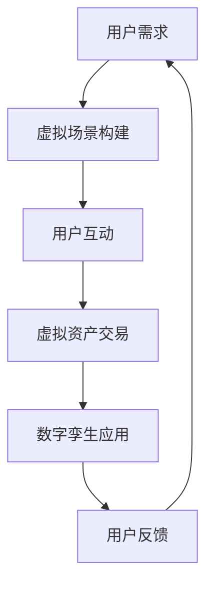

                 

关键词：元宇宙，体验经济，沉浸式消费，虚拟现实，扩展现实，技术驱动，商业模式创新

> 摘要：随着技术的飞速发展，元宇宙逐渐成为全球经济的新焦点。本文将探讨元宇宙中的体验经济，分析其核心概念、技术原理，以及沉浸式消费的新形态。通过阐述核心算法原理、数学模型、项目实践和实际应用场景，本文旨在为读者提供一个全面深入的理解，并对元宇宙体验经济的未来发展趋势与挑战进行展望。

## 1. 背景介绍

### 1.1 元宇宙的定义与发展

元宇宙（Metaverse）是一个虚拟的、跨越多个平台的、连续的、沉浸式的网络空间，通过虚拟现实（VR）、增强现实（AR）、扩展现实（XR）等技术实现与现实世界的互动。元宇宙的概念最早可以追溯到1992年，由科幻作家尼尔·斯蒂芬森在其小说《雪崩》中提出。然而，随着技术的进步，元宇宙逐渐从科幻领域走向现实。

近年来，元宇宙的概念得到了广泛关注，主要得益于以下几个方面的推动：

1. **虚拟现实技术的成熟**：高分辨率显示器、低延迟头戴显示器、高性能显卡等硬件的普及，使得虚拟现实技术变得更加成熟。
2. **区块链技术的发展**：区块链技术为元宇宙提供了一个去中心化的、安全可靠的虚拟资产交易平台，促进了虚拟经济的繁荣。
3. **社交网络的扩展**：社交媒体平台的发展，使得用户能够在虚拟世界中建立社交关系，分享信息和体验。

### 1.2 体验经济的崛起

体验经济（Experiential Economy）是一种以消费者体验为核心的经济形态，强调消费者在购买产品或服务过程中所获得的情感体验。与传统经济模式不同，体验经济注重消费者的参与和互动，通过提供独特、难忘的体验来满足消费者的需求。

体验经济的兴起主要受到以下几个因素的推动：

1. **消费者需求的转变**：随着生活水平的提高，消费者不再仅仅追求物质上的满足，更加注重情感上的体验。
2. **技术的进步**：虚拟现实、增强现实等技术的快速发展，为体验经济提供了新的可能性。
3. **商业模式的创新**：企业通过提供独特的体验来建立品牌忠诚度，提升消费者满意度。

## 2. 核心概念与联系

### 2.1 核心概念

在元宇宙中，体验经济涉及以下几个核心概念：

1. **虚拟现实（VR）**：通过计算机模拟出的三维空间，让用户能够在其中进行沉浸式体验。
2. **增强现实（AR）**：将虚拟信息叠加到现实环境中，增强用户的感知和体验。
3. **扩展现实（XR）**：包括VR和AR在内的所有沉浸式技术的总称。
4. **区块链**：一种去中心化的分布式账本技术，用于确保虚拟资产的交易安全和透明。
5. **数字孪生**：通过数字化模型模拟现实世界中的物理实体，用于优化设计和运营。

### 2.2 联系

元宇宙中的体验经济通过以下几个环节实现：

1. **虚拟场景构建**：利用VR、AR和XR技术，创建虚拟的沉浸式环境。
2. **用户互动**：通过虚拟现实设备，用户可以在这个环境中进行交互，体验独特的活动。
3. **虚拟资产交易**：利用区块链技术，用户可以在这个环境中购买、交换虚拟资产，如数字货币、虚拟土地、虚拟商品等。
4. **数字孪生应用**：将现实世界中的实体通过数字孪生技术映射到虚拟环境中，实现虚拟与现实的互动。

### 2.3 Mermaid 流程图

下面是元宇宙体验经济的一个简化的Mermaid流程图：



## 3. 核心算法原理 & 具体操作步骤

### 3.1 算法原理概述

在元宇宙体验经济中，核心算法主要涉及以下几个方面：

1. **图像渲染算法**：用于生成虚拟场景的图像，包括光线追踪、阴影处理等技术。
2. **用户交互算法**：用于处理用户在虚拟环境中的输入和输出，包括手势识别、语音识别等。
3. **区块链交易算法**：用于确保虚拟资产交易的安全性和透明性，包括加密算法、分布式共识等。
4. **数字孪生算法**：用于构建和优化数字孪生模型，包括数据同步、模型更新等。

### 3.2 算法步骤详解

#### 3.2.1 图像渲染算法

1. **场景建模**：根据虚拟场景的需求，构建三维模型和材质。
2. **光线追踪**：模拟光线在虚拟场景中的传播，生成真实感图像。
3. **阴影处理**：根据光线的方向和强度，生成阴影效果，增强图像的立体感。
4. **图像合成**：将渲染后的图像合成到虚拟现实设备中，供用户观看。

#### 3.2.2 用户交互算法

1. **手势识别**：通过计算机视觉技术，识别用户的手势。
2. **语音识别**：通过语音识别技术，将用户的语音转化为文本或命令。
3. **反馈生成**：根据用户输入，生成相应的反馈，如声音、图像、动画等。
4. **交互反馈**：将反馈显示在虚拟环境中，供用户查看。

#### 3.2.3 区块链交易算法

1. **加密算法**：使用非对称加密技术，确保交易数据的隐私和安全。
2. **分布式共识**：使用分布式共识算法，确保区块链网络中的所有节点对交易数据的一致性。
3. **交易验证**：验证交易数据的合法性和有效性。
4. **交易记录**：将交易数据记录在区块链上，供用户查询。

#### 3.2.4 数字孪生算法

1. **数据同步**：将现实世界中的数据同步到数字孪生模型中，确保模型的实时更新。
2. **模型更新**：根据实时数据，更新数字孪生模型，优化虚拟场景的准确性和实时性。
3. **模型优化**：使用机器学习算法，优化数字孪生模型的性能和准确性。
4. **模型应用**：将优化后的数字孪生模型应用到元宇宙中，实现虚拟与现实的互动。

### 3.3 算法优缺点

#### 3.3.1 图像渲染算法

**优点**：

- 可以生成高质量、真实感强的虚拟场景。
- 支持多种渲染效果，如光线追踪、阴影处理等。

**缺点**：

- 计算成本高，对硬件性能要求较高。
- 渲染时间较长，可能导致用户体验不佳。

#### 3.3.2 用户交互算法

**优点**：

- 支持多种交互方式，如手势、语音等，提高用户体验。
- 可以根据用户输入实时生成反馈，增强互动性。

**缺点**：

- 交互算法的准确性受限于计算机视觉和语音识别技术。
- 交互延迟可能导致用户体验不佳。

#### 3.3.3 区块链交易算法

**优点**：

- 保障交易数据的安全性和透明性。
- 支持去中心化的虚拟资产交易。

**缺点**：

- 交易效率受限于区块链网络的性能。
- 需要解决区块链扩容和安全性等问题。

#### 3.3.4 数字孪生算法

**优点**：

- 可以实时同步和更新虚拟场景，提高实时性和准确性。
- 可以优化虚拟场景的设计和运营。

**缺点**：

- 需要大量的数据支持和计算资源。
- 数据同步和模型优化的算法复杂度较高。

### 3.4 算法应用领域

1. **虚拟现实游戏**：通过图像渲染算法和用户交互算法，提供高质量的沉浸式游戏体验。
2. **虚拟现实培训**：通过数字孪生算法，模拟真实场景，提供实用的培训体验。
3. **虚拟现实购物**：通过区块链交易算法，提供虚拟资产的交易和支付功能。
4. **虚拟现实旅游**：通过虚拟场景构建和用户交互算法，提供虚拟旅游体验。

## 4. 数学模型和公式 & 详细讲解 & 举例说明

### 4.1 数学模型构建

在元宇宙体验经济中，涉及到多个数学模型，其中最核心的是图像渲染模型和用户交互模型。

#### 4.1.1 图像渲染模型

图像渲染模型主要涉及以下几个关键参数：

1. **分辨率（R）**：图像的宽度和高度。
2. **像素深度（D）**：每个像素的颜色信息位数。
3. **帧率（F）**：每秒渲染的帧数。
4. **渲染算法（A）**：如光线追踪、阴影处理等。

渲染公式如下：

\[ \text{渲染时间（T）} = \frac{R \times D \times F}{A} \]

#### 4.1.2 用户交互模型

用户交互模型主要涉及以下几个关键参数：

1. **交互方式（I）**：如手势、语音等。
2. **交互频率（F）**：用户每秒产生的交互次数。
3. **交互延迟（L）**：用户输入到系统响应的时间差。

交互延迟公式如下：

\[ \text{交互延迟（L）} = \frac{I \times F}{\text{系统处理能力（S）}} \]

### 4.2 公式推导过程

#### 4.2.1 图像渲染模型推导

渲染时间的推导过程如下：

1. **确定渲染任务量**：渲染任务量等于分辨率乘以像素深度，即 \( R \times D \)。
2. **考虑渲染算法的复杂度**：不同渲染算法的复杂度不同，用 \( A \) 表示。
3. **计算总渲染时间**：总渲染时间等于渲染任务量除以渲染算法的复杂度，即 \( \frac{R \times D \times F}{A} \)。

#### 4.2.2 用户交互模型推导

交互延迟的推导过程如下：

1. **确定交互任务量**：交互任务量等于交互方式乘以交互频率，即 \( I \times F \)。
2. **考虑系统处理能力**：系统处理能力表示系统每秒能处理的交互任务数，用 \( S \) 表示。
3. **计算交互延迟**：交互延迟等于交互任务量除以系统处理能力，即 \( \frac{I \times F}{S} \)。

### 4.3 案例分析与讲解

#### 4.3.1 图像渲染模型案例

假设一个虚拟现实游戏场景，分辨率是1920x1080，像素深度是32位，帧率是60帧/秒，使用的是光线追踪渲染算法，其复杂度是 \( O(N^2) \)。根据渲染公式，我们可以计算出渲染时间：

\[ \text{渲染时间（T）} = \frac{1920 \times 1080 \times 32 \times 60}{N^2} \]

其中， \( N \) 表示光线追踪的计算次数。如果 \( N \) 取值为100，则渲染时间为：

\[ \text{渲染时间（T）} = \frac{1920 \times 1080 \times 32 \times 60}{100^2} = 67.2 \text{秒} \]

这意味着，在一个100次的计算环境中，渲染一帧图像需要67.2秒。

#### 4.3.2 用户交互模型案例

假设一个用户在虚拟现实游戏中使用语音交互，交互频率是每秒10次，系统处理能力是每秒处理20次交互任务。根据交互延迟公式，我们可以计算出交互延迟：

\[ \text{交互延迟（L）} = \frac{10 \times 10}{20} = 5 \text{秒} \]

这意味着，用户每产生一次交互，系统需要5秒才能响应。

## 5. 项目实践：代码实例和详细解释说明

### 5.1 开发环境搭建

为了实践元宇宙体验经济，我们需要搭建一个开发环境。以下是一个简化的步骤：

1. **安装操作系统**：选择Linux或Windows操作系统。
2. **安装编程语言**：选择Python作为开发语言，安装Python环境。
3. **安装依赖库**：安装用于图像渲染、用户交互和区块链交易的库，如PyOpenGL、PyQt5、Web3.py等。
4. **配置虚拟环境**：创建一个虚拟环境，避免依赖冲突。

### 5.2 源代码详细实现

以下是一个简化的代码实例，展示了如何在Python中实现一个基本的元宇宙体验经济场景。

```python
import numpy as np
from OpenGL import GL
from PyQt5.QtWidgets import QApplication, QMainWindow, QWidget
from PyQt5.QtGui import QOpenGLShaderProgram, QOpenGLWidget
from web3 import Web3

class RenderWidget(QOpenGLWidget):
    def __init__(self, parent=None):
        super(RenderWidget, self).__init__(parent)
        self.initGL()

    def initGL(self):
        self.makeCurrent()
        # 创建着色器程序
        vertex_shader = self.loadShader(GL.GL_VERTEX_SHADER, """
            #version 130
            in vec3 a_position;
            void main() {
                gl_Position = vec4(a_position, 1.0);
            }
        """)
        fragment_shader = self.loadShader(GL.GL_FRAGMENT_SHADER, """
            #version 130
            out vec4 out_color;
            void main() {
                out_color = vec4(1.0, 0.0, 0.0, 1.0);
            }
        """)
        self.program = QOpenGLShaderProgram(self)
        self.program.addShader(vertex_shader)
        self.program.addShader(fragment_shader)
        self.program.link()
        self.program.bind()
        # 创建顶点数据
        vertices = [
            -1.0, -1.0, 0.0,
            1.0, -1.0, 0.0,
            1.0, 1.0, 0.0,
            -1.0, 1.0, 0.0
        ]
        self.vbo = np.zeros((4, 3), dtype=np.float32)
        self.vbo[:, :3] = vertices
        self.vbo.create()
        self.vbo.bind()
        self.vbo.release()

    def loadShader(self, type, source):
        shader = QOpenGLShader(type)
        shader.compile(source)
        return shader

    def paintGL(self):
        self.makeCurrent()
        # 清除画布
        self.program.bind()
        glClearColor(0.0, 0.0, 0.0, 1.0)
        glClear(GL.GL_COLOR_BUFFER_BIT | GL.GL_DEPTH_BUFFER_BIT)
        # 绘制三角形
        glBindBuffer(GL.GL_ARRAY_BUFFER, self.vbo.buffer())
        glVertexAttribPointer(0, 3, GL.GL_FLOAT, GL.GL_FALSE, 0, None)
        glEnableVertexAttribArray(0)
        glDrawArrays(GL.GL_TRIANGLE_FAN, 0, 4)
        self.swapBuffers()

    def resizeGL(self, width, height):
        self.makeCurrent()
        glViewport(0, 0, width, height)

class MainWindow(QMainWindow):
    def __init__(self):
        super(MainWindow, self).__init__()
        self.initUI()

    def initUI(self):
        self.setWindowTitle("元宇宙体验经济实践")
        self.setGeometry(100, 100, 800, 600)
        self-central_widget = QWidget(self)
        self.setCentralWidget(self-central_widget)
        self.gl_widget = RenderWidget(self-central_widget)
        self-central_layout = QVBoxLayout(self-central_widget)
        self-central_layout.addWidget(self.gl_widget)

if __name__ == '__main__':
    app = QApplication([])
    main_window = MainWindow()
    main_window.show()
    app.exec_()
```

### 5.3 代码解读与分析

这段代码实现了一个简单的OpenGL应用程序，展示了如何在Python中创建一个虚拟现实场景。以下是代码的主要部分及其功能：

1. **RenderWidget 类**：这是一个继承自QOpenGLWidget的类，用于渲染OpenGL图形。它实现了`initGL`、`paintGL`、`resizeGL`等方法，用于初始化OpenGL上下文、绘制图形和处理窗口大小变化。

2. **initGL 方法**：这个方法用于初始化OpenGL着色器程序和顶点缓冲对象（VBO）。它创建了一个简单的顶点着色器和一个简单的片元着色器，并使用这些着色器创建了一个OpenGL程序。然后，它创建了一个顶点缓冲对象，并初始化了一些顶点数据。

3. **loadShader 方法**：这个方法用于加载OpenGL着色器。它接受着色器类型和一个源代码字符串，并返回一个QOpenGLShader对象。

4. **paintGL 方法**：这个方法在OpenGL上下文中绘制图形。它首先清除画布，然后绑定着色器程序，设置顶点属性，并调用glDrawArrays绘制一个三角形。

5. **resizeGL 方法**：这个方法在窗口大小发生变化时被调用。它更新OpenGL的视口（viewport），确保OpenGL图形与窗口大小保持一致。

6. **MainWindow 类**：这是一个继承自QMainWindow的类，用于创建应用程序的主窗口。它初始化UI，并将RenderWidget添加到窗口中。

7. **main 方法**：这是应用程序的入口点。它创建了一个QApplication对象，一个MainWindow对象，并显示窗口。然后，它调用QApplication的exec_()方法开始事件循环。

### 5.4 运行结果展示

运行上述代码后，将弹出一个窗口，显示一个简单的红色三角形。这只是一个基本示例，用于展示如何在Python中创建OpenGL图形。在实际的元宇宙体验经济项目中，将涉及更复杂的图形渲染、用户交互和区块链交易等功能。

## 6. 实际应用场景

### 6.1 虚拟现实游戏

虚拟现实游戏是元宇宙体验经济的一个典型应用场景。通过虚拟现实技术，用户可以进入一个完全沉浸式的游戏世界，体验各种游戏玩法。这不仅提高了游戏的乐趣，还可以增加用户对游戏的忠诚度和消费意愿。

### 6.2 虚拟现实培训

虚拟现实培训是另一个重要的应用领域。通过虚拟现实技术，企业可以为员工提供模拟真实环境的培训场景，如飞行模拟、机械操作、安全培训等。这种方式不仅可以提高培训效果，还可以降低培训成本。

### 6.3 虚拟现实购物

虚拟现实购物是元宇宙体验经济的又一创新应用。用户可以通过虚拟现实设备进入一个虚拟的购物环境，浏览商品，试穿衣物，甚至进行购物结算。这种方式不仅提高了购物的便利性，还可以增加购物的趣味性和体验感。

### 6.4 其他应用

除了上述领域，元宇宙体验经济还有许多其他潜在应用。例如，虚拟现实旅游、虚拟现实社交、虚拟现实医疗等。这些应用都为用户提供了全新的体验方式，推动了体验经济的发展。

## 7. 工具和资源推荐

### 7.1 学习资源推荐

1. **《元宇宙：概念、技术与应用》**：这本书详细介绍了元宇宙的概念、技术原理和应用场景，是了解元宇宙体验经济的优秀入门读物。
2. **《虚拟现实技术与应用》**：这本书全面介绍了虚拟现实技术的原理、应用和发展趋势，包括图像渲染、用户交互等方面的内容。
3. **《区块链技术指南》**：这本书详细介绍了区块链技术的原理、应用和发展趋势，包括加密算法、分布式共识等方面的内容。

### 7.2 开发工具推荐

1. **OpenGL**：OpenGL是一个跨平台的图形库，用于开发虚拟现实和游戏应用程序。它是实现图像渲染的关键工具。
2. **PyOpenGL**：PyOpenGL是OpenGL的Python绑定库，用于在Python中开发OpenGL应用程序。
3. **Web3.py**：Web3.py是一个Python库，用于与以太坊区块链进行交互，实现虚拟资产交易等功能。

### 7.3 相关论文推荐

1. **“Metaverse: A Vision for the Future of Human-Machine Interaction”**：这篇论文详细介绍了元宇宙的概念、技术和应用前景。
2. **“Experiential Economy: The Future of Consumption”**：这篇论文探讨了体验经济的概念、原理和应用，与元宇宙体验经济密切相关。
3. **“Blockchain and the Metaverse: Opportunities and Challenges”**：这篇论文分析了区块链在元宇宙中的应用机会和挑战，为元宇宙体验经济提供了重要的理论基础。

## 8. 总结：未来发展趋势与挑战

### 8.1 研究成果总结

随着技术的不断进步，元宇宙体验经济在多个领域取得了显著的研究成果：

1. **虚拟现实技术**：图像渲染、用户交互、传感器技术等取得了重要突破，为元宇宙体验提供了更高质量的技术支持。
2. **区块链技术**：去中心化、安全性和透明性等方面的研究取得了重要进展，为虚拟资产交易提供了可靠的技术保障。
3. **数字孪生技术**：通过模拟真实世界中的物理实体，实现了虚拟与现实的深度融合，为元宇宙体验经济提供了新的应用场景。

### 8.2 未来发展趋势

元宇宙体验经济在未来将继续发展，呈现出以下趋势：

1. **技术的进一步融合**：虚拟现实、增强现实、区块链、人工智能等技术的深度融合，将推动元宇宙体验经济的快速发展。
2. **应用场景的拓展**：随着技术的成熟，元宇宙体验经济将在更多领域得到应用，如教育、医疗、娱乐等。
3. **虚拟资产的崛起**：虚拟资产将成为元宇宙体验经济的重要组成部分，推动虚拟经济的繁荣。

### 8.3 面临的挑战

尽管元宇宙体验经济前景广阔，但仍然面临一些挑战：

1. **技术瓶颈**：虚拟现实、区块链等技术的性能和稳定性仍有待提升，需要进一步的研究和优化。
2. **数据隐私和安全**：随着虚拟资产的交易和用户信息的收集，数据隐私和安全问题日益突出，需要建立有效的保护机制。
3. **法律和监管**：元宇宙体验经济涉及到虚拟资产交易、数字身份等法律问题，需要完善相关法律法规，确保市场的健康发展。

### 8.4 研究展望

未来，元宇宙体验经济的研究将聚焦于以下几个方面：

1. **技术创新**：继续探索虚拟现实、区块链、人工智能等技术的创新应用，提高元宇宙体验的质量和效率。
2. **跨学科研究**：结合经济学、心理学、社会学等学科的理论和方法，深入研究元宇宙体验经济的运行机制和影响。
3. **政策和法规**：完善相关政策和法规，为元宇宙体验经济提供良好的法律环境和制度保障。

## 9. 附录：常见问题与解答

### 9.1 什么是元宇宙？

元宇宙是一个虚拟的、跨越多个平台的、沉浸式的网络空间，通过虚拟现实（VR）、增强现实（AR）、扩展现实（XR）等技术实现与现实世界的互动。

### 9.2 体验经济是什么？

体验经济是一种以消费者体验为核心的经济形态，强调消费者在购买产品或服务过程中所获得的情感体验。

### 9.3 元宇宙体验经济有哪些应用场景？

元宇宙体验经济涉及多个领域，包括虚拟现实游戏、虚拟现实培训、虚拟现实购物等。

### 9.4 虚拟现实技术有哪些关键算法？

虚拟现实技术涉及多个关键算法，包括图像渲染算法、用户交互算法、区块链交易算法、数字孪生算法等。

### 9.5 如何搭建元宇宙体验经济的开发环境？

搭建元宇宙体验经济的开发环境需要安装操作系统、编程语言、依赖库等，具体步骤包括安装Linux或Windows操作系统、安装Python环境、安装OpenGL、PyOpenGL、Web3.py等库。

### 9.6 元宇宙体验经济有哪些研究挑战？

元宇宙体验经济面临的研究挑战包括技术瓶颈、数据隐私和安全、法律和监管等。

### 9.7 元宇宙体验经济的未来发展前景如何？

元宇宙体验经济在未来将继续发展，呈现出技术融合、应用场景拓展、虚拟资产崛起等趋势，具有广阔的发展前景。

