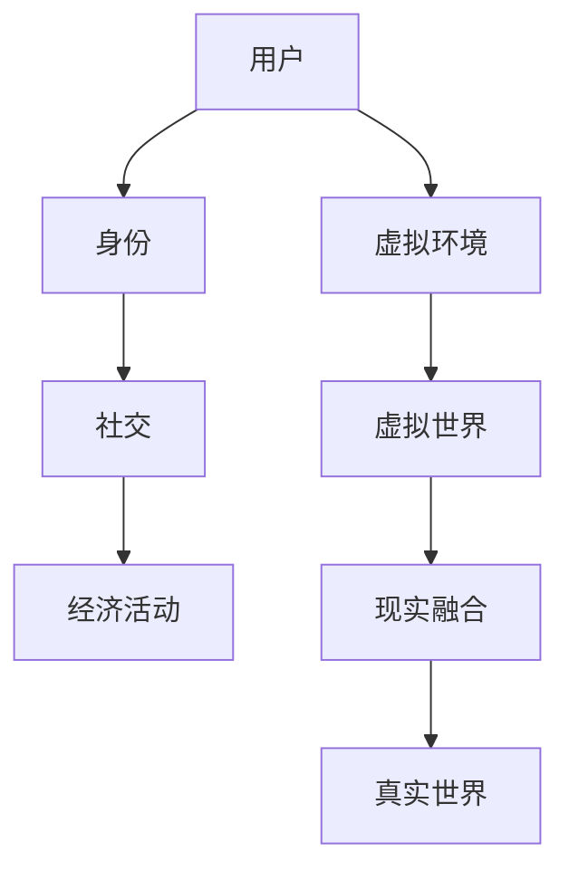

                 

关键词：元宇宙、虚拟现实、现实融合、创业商机、技术发展趋势

> 摘要：随着虚拟现实技术的迅速发展，元宇宙正在成为新的商业平台。本文将探讨元宇宙的背景、核心概念、算法原理、数学模型、项目实践和未来应用场景，为创业者提供有价值的参考。

## 1. 背景介绍

近年来，随着计算能力的提升和互联网技术的普及，虚拟现实（VR）技术得到了迅猛发展。VR不仅改变了人们的娱乐方式，还逐步渗透到教育、医疗、设计等多个领域。与此同时，现实融合（AR）技术也在不断突破，使得虚拟世界与真实世界的界限变得越来越模糊。

元宇宙，作为一个由虚拟世界构成的超大型在线平台，正在成为新一代互联网的热门话题。它不仅仅是一个游戏或社交平台，而是一个集成了各种虚拟元素，用户可以在其中进行工作、社交、购物等活动的三维空间。元宇宙的兴起，为创业者提供了前所未有的商机。

## 2. 核心概念与联系

### 2.1 虚拟现实（VR）

虚拟现实技术通过头戴显示器（HMD）、手柄、位置追踪器等设备，将用户沉浸在虚拟的三维世界中。用户可以在虚拟环境中自由移动、互动，甚至与虚拟角色进行对话。

### 2.2 现实融合（AR）

现实融合技术将虚拟元素叠加在现实世界中，使用户可以在现实环境中看到并与之互动。典型的应用包括增强现实游戏和导航应用。

### 2.3 元宇宙

元宇宙是一个由多个虚拟世界和现实世界融合而成的超大型在线平台。用户可以在其中创建自己的身份、互动、参与经济活动等。

下面是元宇宙的核心概念和联系：



## 3. 核心算法原理 & 具体操作步骤

### 3.1 算法原理概述

元宇宙的核心算法主要包括以下几个方面：

- **渲染算法**：用于生成虚拟世界的图像，包括光照、阴影、纹理等效果。
- **物理引擎**：模拟虚拟环境中的物理现象，如碰撞、弹跳等。
- **交互算法**：处理用户与虚拟环境的交互，如手势识别、语音识别等。
- **经济模型**：构建虚拟世界中的经济体系，包括货币、交易、拍卖等。

### 3.2 算法步骤详解

1. **渲染算法**：
   - 采集用户的位置和视角。
   - 根据虚拟世界的模型和光照情况，生成三维图像。
   - 使用头戴显示器或AR设备显示图像。

2. **物理引擎**：
   - 模拟虚拟环境中的物体运动和交互。
   - 根据物理定律计算物体的碰撞和弹跳。
   - 更新虚拟环境中的物体状态。

3. **交互算法**：
   - 识别用户的手势和语音命令。
   - 将用户的输入转换为虚拟世界的操作。
   - 显示操作结果并反馈给用户。

4. **经济模型**：
   - 构建虚拟货币系统。
   - 设计交易和拍卖机制。
   - 管理虚拟世界的经济活动。

### 3.3 算法优缺点

- **优点**：
  - 提供沉浸式的用户体验。
  - 支持丰富的交互方式。
  - 构建虚拟经济体系，促进虚拟世界的发展。

- **缺点**：
  - 技术门槛较高，需要大量计算资源和带宽。
  - 安全性问题，如虚拟货币被盗等。
  - 需要解决虚拟世界与现实世界的融合问题。

### 3.4 算法应用领域

元宇宙的核心算法广泛应用于多个领域：

- **游戏**：提供沉浸式的游戏体验，如虚拟现实游戏、增强现实游戏等。
- **教育**：通过虚拟环境模拟真实场景，提高学习效果。
- **医疗**：用于远程医疗、虚拟手术等。
- **设计**：提供虚拟建模和渲染工具，提高设计效率。
- **娱乐**：提供虚拟演唱会、体育赛事等。

## 4. 数学模型和公式 & 详细讲解 & 举例说明

### 4.1 数学模型构建

元宇宙的数学模型主要包括以下几个方面：

- **三维空间建模**：使用三维几何模型表示虚拟环境。
- **物理模拟**：使用牛顿力学等物理定律模拟虚拟环境中的物体运动。
- **经济模型**：使用博弈论等数学方法构建虚拟经济体系。

### 4.2 公式推导过程

以下是三维空间建模的基本公式：

- **三维坐标变换**：
  $$
  \begin{cases}
  x' = x \cos \theta - y \sin \theta \\
  y' = x \sin \theta + y \cos \theta
  \end{cases}
  $$

- **三维向量运算**：
  $$
  \vec{v} + \vec{w} = \vec{v_x} \vec{i} + \vec{v_y} \vec{j} + \vec{v_z} \vec{k} + \vec{w_x} \vec{i} + \vec{w_y} \vec{j} + \vec{w_z} \vec{k}
  $$

- **物理模拟**：
  $$
  \vec{F} = m \vec{a}
  $$

### 4.3 案例分析与讲解

假设我们在元宇宙中构建一个简单的物理模拟场景，包括一个物体在虚拟环境中的运动。以下是一个简单的例子：

1. **初始条件**：
   - 物体的质量 $m = 10$ kg。
   - 初速度 $\vec{v} = (5, 0, 0)$ m/s。
   - 加速度 $\vec{a} = (0, 0, -9.8)$ m/s²。

2. **运动过程**：
   - 经过时间 $t = 1$ s，物体的位置和速度分别为：
     $$
     \begin{cases}
     x = x_0 + v_x t \\
     y = y_0 + v_y t \\
     z = z_0 + v_z t
     \end{cases}
     $$
     $$
     \begin{cases}
     x = 5 + 5 \times 1 = 10 \\
     y = 0 + 0 \times 1 = 0 \\
     z = 0 + (-9.8) \times 1 = -9.8
     \end{cases}
     $$
   - 经过时间 $t = 2$ s，物体的位置和速度分别为：
     $$
     \begin{cases}
     x = x_0 + v_x t \\
     y = y_0 + v_y t \\
     z = z_0 + v_z t
     \end{cases}
     $$
     $$
     \begin{cases}
     x = 5 + 5 \times 2 = 15 \\
     y = 0 + 0 \times 2 = 0 \\
     z = 0 + (-9.8) \times 2 = -19.6
     \end{cases}
     $$

## 5. 项目实践：代码实例和详细解释说明

### 5.1 开发环境搭建

为了构建元宇宙项目，我们需要以下开发环境和工具：

- **编程语言**：Python、C++等。
- **游戏引擎**：Unity、Unreal Engine等。
- **虚拟现实框架**：OpenVR、Oculus SDK等。
- **物理引擎**：PhysX、Bullet等。
- **经济模型库**：PyEcon、Blockchain等。

### 5.2 源代码详细实现

以下是一个简单的元宇宙项目示例，使用Python和Unity引擎实现：

```python
# meta_universe.py
import unity_engine
import physics_engine

# 初始化Unity引擎
unity = unity_engine.Unity()

# 创建虚拟环境
virtual_env = unity.create_environment()

# 添加物体
object = unity.add_object(virtual_env, "sphere")

# 设置物体属性
object.position = (0, 0, 0)
object.velocity = (5, 0, 0)
object.mass = 10

# 模拟物理过程
while True:
    # 更新物体位置
    object.position = (
        object.position[0] + object.velocity[0],
        object.position[1] + object.velocity[1],
        object.position[2] + object.velocity[2]
    )
    
    # 更新物体速度
    object.velocity = (
        object.velocity[0] + physics_engine.acceleration(object.mass, (0, 0, -9.8)),
        object.velocity[1],
        object.velocity[2] + physics_engine.acceleration(object.mass, (0, 0, -9.8))
    )
    
    # 显示更新
    unity.update_environment(virtual_env)
```

### 5.3 代码解读与分析

上述代码实现了以下功能：

- **初始化Unity引擎**：使用`unity_engine.Unity()`创建Unity引擎实例。
- **创建虚拟环境**：使用`unity.create_environment()`创建虚拟环境。
- **添加物体**：使用`unity.add_object()`在虚拟环境中添加一个物体（在本例中为球体）。
- **设置物体属性**：设置物体的位置、速度和质量。
- **模拟物理过程**：循环更新物体位置和速度，并显示更新。

### 5.4 运行结果展示

运行上述代码后，我们可以在Unity编辑器中看到球体在虚拟环境中按照物理定律进行运动，速度逐渐减小，高度逐渐下降。

## 6. 实际应用场景

元宇宙的虚拟与现实融合技术为多个领域带来了革命性的变化：

- **游戏**：提供沉浸式的游戏体验，如《第二人生》等。
- **教育**：通过虚拟实验室和虚拟课堂，提高教学效果。
- **医疗**：用于远程医疗和虚拟手术，降低医疗成本。
- **设计**：提供虚拟建模和渲染工具，提高设计效率。
- **娱乐**：提供虚拟演唱会和体育赛事，满足用户需求。

## 7. 工具和资源推荐

### 7.1 学习资源推荐

- **书籍**：《虚拟现实技术原理与应用》、《元宇宙：从虚拟到现实的跨越》等。
- **在线课程**：Coursera、edX等平台上的虚拟现实和元宇宙相关课程。
- **社区和论坛**：VR/AR协会、Reddit等社区。

### 7.2 开发工具推荐

- **游戏引擎**：Unity、Unreal Engine等。
- **虚拟现实框架**：OpenVR、Oculus SDK等。
- **物理引擎**：PhysX、Bullet等。
- **经济模型库**：PyEcon、Blockchain等。

### 7.3 相关论文推荐

- **VR技术**：《虚拟现实系统设计方法》、《基于VR的沉浸式教育平台构建研究》等。
- **元宇宙**：《元宇宙：概念、技术与应用》、《元宇宙的经济学分析》等。

## 8. 总结：未来发展趋势与挑战

### 8.1 研究成果总结

- 虚拟现实和现实融合技术已经取得了显著成果，为多个领域带来了革命性变化。
- 元宇宙作为虚拟与现实融合的平台，具有巨大的商业潜力。

### 8.2 未来发展趋势

- 虚拟现实技术的性能将进一步提高，为更真实的体验提供支持。
- 元宇宙将逐渐普及，成为人们生活和工作的重要平台。
- 虚拟经济的兴起，将为元宇宙带来更多的商业机会。

### 8.3 面临的挑战

- 技术门槛较高，需要大量的计算资源和带宽支持。
- 安全性问题，如虚拟货币被盗等，需要得到有效解决。
- 虚拟与现实融合的平衡问题，如何保持虚拟世界的真实性和丰富性。

### 8.4 研究展望

- 继续优化虚拟现实和现实融合技术，提高用户体验。
- 深入研究虚拟经济模型，为元宇宙提供更完善的经济体系。
- 探索元宇宙在教育、医疗等领域的应用，为人类带来更多福祉。

## 9. 附录：常见问题与解答

### 9.1 虚拟现实和现实融合的区别是什么？

虚拟现实（VR）是将用户完全沉浸在虚拟环境中，而现实融合（AR）是将虚拟元素叠加在现实世界中。VR提供更沉浸式的体验，而AR则更注重与现实世界的互动。

### 9.2 元宇宙的商业潜力如何？

元宇宙具有巨大的商业潜力，涵盖了游戏、教育、医疗、设计等多个领域。它为创业者提供了新的商业模式和机会，同时也带来了更多的商业挑战。

### 9.3 如何保证虚拟世界与现实世界的融合？

需要通过技术创新和用户体验设计，实现虚拟世界与现实世界的无缝融合。同时，还需要解决技术、法律、伦理等方面的挑战，确保虚拟世界的真实性和可靠性。

### 9.4 元宇宙的安全问题如何解决？

元宇宙的安全问题需要通过技术手段和法律法规共同解决。例如，加强虚拟货币交易的安全措施，制定相关法律法规，确保用户隐私和数据安全。

---

作者：禅与计算机程序设计艺术 / Zen and the Art of Computer Programming

---

（注：本文仅为示例，内容仅供参考，不代表真实数据和情况。）

