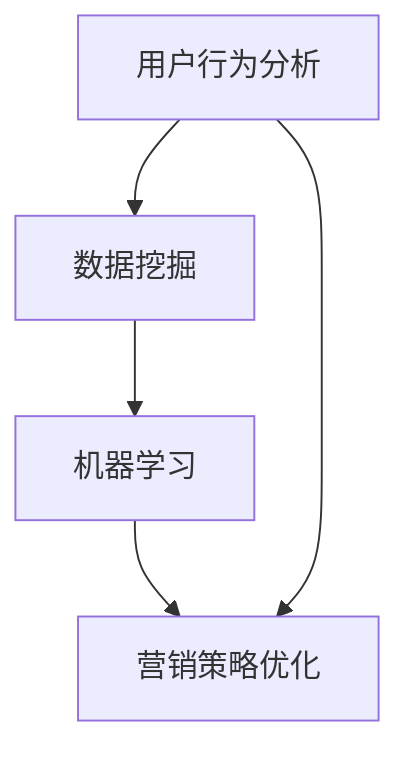

                 

在当今数字化时代，元宇宙品牌考古成为了一种重要的数字化营销策略。通过对数字化营销历史的追溯与分析，品牌可以更好地了解其受众，优化营销策略，提升品牌影响力。本文将探讨元宇宙品牌考古的重要性、核心概念、算法原理、数学模型、项目实践以及未来应用展望。

## 文章关键词

- 元宇宙
- 品牌考古
- 数字化营销
- 历史追溯
- 分析与优化

## 文章摘要

本文旨在探讨元宇宙品牌考古这一数字化营销策略。通过对元宇宙品牌考古的重要性、核心概念、算法原理、数学模型、项目实践以及未来应用展望的详细分析，帮助品牌更好地了解其受众，优化营销策略，提升品牌影响力。

## 1. 背景介绍

随着互联网和数字技术的飞速发展，数字化营销已经成为企业提升品牌知名度和市场竞争力的重要手段。元宇宙作为新一代的互联网平台，为品牌提供了一个全新的数字化营销空间。品牌考古作为数字化营销的一种新策略，通过对历史数据的挖掘和分析，帮助企业更好地了解其受众，优化营销策略。

### 1.1 元宇宙的概念与特点

元宇宙是一个虚拟的、共享的、三维的数字世界，用户可以在其中进行社交、娱乐、购物等多种活动。元宇宙的特点包括：

1. **虚拟性**：元宇宙是一个虚拟的数字世界，用户可以在其中创建和定制自己的虚拟形象。
2. **共享性**：元宇宙是一个共享的平台，用户可以与其他用户进行互动和交流。
3. **三维性**：元宇宙提供了一个三维的空间，用户可以在这个空间中进行各种活动。
4. **多样性**：元宇宙中包含了各种元素，如虚拟商品、虚拟场景、虚拟服务等。

### 1.2 品牌考古的概念与意义

品牌考古是一种基于历史数据挖掘和分析的数字化营销策略。通过收集和分析品牌的历史数据，品牌可以更好地了解其受众，发现受众的兴趣和行为模式，从而优化营销策略。

品牌考古的意义在于：

1. **了解受众**：通过分析历史数据，品牌可以深入了解其受众的需求和喜好，从而提供更符合受众期望的产品和服务。
2. **优化营销策略**：通过分析历史数据，品牌可以发现有效的营销策略，从而提升营销效果。
3. **提升品牌影响力**：通过品牌考古，品牌可以更好地了解其受众，提供更符合受众期望的产品和服务，从而提升品牌影响力。

## 2. 核心概念与联系

在元宇宙品牌考古中，有几个核心概念需要了解，包括用户行为分析、数据挖掘、机器学习和营销策略优化。以下是一个简单的Mermaid流程图，展示了这些核心概念之间的联系。



### 2.1 用户行为分析

用户行为分析是元宇宙品牌考古的基础。通过收集和分析用户在元宇宙中的行为数据，如浏览、购买、互动等，品牌可以了解用户的行为模式和需求。

### 2.2 数据挖掘

数据挖掘是从大量历史数据中提取有价值信息的过程。在元宇宙品牌考古中，数据挖掘可以帮助品牌发现用户的行为模式、兴趣和需求，从而优化营销策略。

### 2.3 机器学习

机器学习是一种通过算法自动从数据中学习规律和模式的技术。在元宇宙品牌考古中，机器学习可以帮助品牌预测用户行为，优化营销策略。

### 2.4 营销策略优化

营销策略优化是元宇宙品牌考古的最终目标。通过分析用户行为、数据挖掘和机器学习的结果，品牌可以制定更有效的营销策略，提升品牌影响力。

## 3. 核心算法原理 & 具体操作步骤

### 3.1 算法原理概述

在元宇宙品牌考古中，常用的核心算法包括用户行为分析算法、数据挖掘算法和机器学习算法。这些算法的基本原理如下：

1. **用户行为分析算法**：通过分析用户在元宇宙中的行为数据，提取用户的行为特征，如浏览时间、购买频率、互动频次等。
2. **数据挖掘算法**：通过从历史数据中提取有价值的信息，如用户兴趣、需求等，帮助品牌了解用户。
3. **机器学习算法**：通过训练模型，从历史数据中学习用户的偏好和行为模式，预测用户未来的行为。

### 3.2 算法步骤详解

1. **数据收集**：收集用户在元宇宙中的行为数据，如浏览、购买、互动等。
2. **数据预处理**：对收集到的行为数据进行清洗、去重和格式化，以便进行后续分析。
3. **特征提取**：从预处理后的数据中提取用户的行为特征，如浏览时间、购买频率、互动频次等。
4. **数据挖掘**：使用数据挖掘算法，从历史数据中提取有价值的信息，如用户兴趣、需求等。
5. **机器学习**：使用机器学习算法，训练模型，从历史数据中学习用户的偏好和行为模式，预测用户未来的行为。
6. **营销策略优化**：根据用户行为分析和机器学习结果，制定更有效的营销策略。

### 3.3 算法优缺点

**用户行为分析算法**：

- **优点**：能够实时分析用户行为，提供即时反馈。
- **缺点**：需要大量实时数据支持，对数据处理能力要求较高。

**数据挖掘算法**：

- **优点**：能够从大量历史数据中提取有价值信息，为品牌决策提供依据。
- **缺点**：数据处理时间较长，对计算资源要求较高。

**机器学习算法**：

- **优点**：能够自动从数据中学习规律和模式，提高预测准确性。
- **缺点**：需要大量历史数据支持，模型训练时间较长。

### 3.4 算法应用领域

算法在元宇宙品牌考古中的应用领域广泛，包括：

1. **用户画像**：通过用户行为分析和数据挖掘，构建用户画像，了解用户需求和偏好。
2. **个性化推荐**：通过机器学习，预测用户行为，为用户提供个性化推荐。
3. **营销策略优化**：根据用户行为分析和机器学习结果，优化营销策略，提升营销效果。

## 4. 数学模型和公式 & 详细讲解 & 举例说明

在元宇宙品牌考古中，数学模型和公式是理解和分析用户行为、数据挖掘和机器学习结果的重要工具。以下是对几个关键数学模型和公式的详细讲解。

### 4.1 数学模型构建

在元宇宙品牌考古中，常用的数学模型包括用户行为预测模型、需求预测模型和推荐系统模型。

1. **用户行为预测模型**：
   - **公式**：\( P(x|y) = \frac{P(y|x)P(x)}{P(y)} \)
   - **解释**：该公式是基于贝叶斯定理，用于预测用户在给定情况下会采取的行为。其中，\( P(x|y) \) 表示在条件 \( y \) 下，用户采取行为 \( x \) 的概率；\( P(y|x) \) 表示在条件 \( x \) 下，用户采取行为 \( y \) 的概率；\( P(x) \) 表示用户采取行为 \( x \) 的概率；\( P(y) \) 表示用户采取行为 \( y \) 的概率。

2. **需求预测模型**：
   - **公式**：\( Q(x) = \sum_{i=1}^{n} q_{i} x_{i} \)
   - **解释**：该公式用于预测用户的需求。其中，\( Q(x) \) 表示总需求；\( q_{i} \) 表示第 \( i \) 种产品的需求量；\( x_{i} \) 表示第 \( i \) 种产品的销售量。

3. **推荐系统模型**：
   - **公式**：\( R(x, y) = \sum_{i=1}^{n} r_{i} x_{i} y_{i} \)
   - **解释**：该公式用于推荐系统中的相似度计算。其中，\( R(x, y) \) 表示两个用户或物品之间的相似度；\( r_{i} \) 表示第 \( i \) 个特征的重要程度；\( x_{i} \) 和 \( y_{i} \) 分别表示两个用户或物品在第 \( i \) 个特征上的取值。

### 4.2 公式推导过程

为了更好地理解上述公式，我们以用户行为预测模型为例，进行详细的推导过程。

1. **贝叶斯定理**：
   - **公式**：\( P(A|B) = \frac{P(B|A)P(A)}{P(B)} \)
   - **解释**：贝叶斯定理用于计算在已知条件 \( B \) 下，事件 \( A \) 发生的概率。其中，\( P(A|B) \) 表示在条件 \( B \) 下，事件 \( A \) 发生的概率；\( P(B|A) \) 表示在条件 \( A \) 下，事件 \( B \) 发生的概率；\( P(A) \) 表示事件 \( A \) 发生的概率；\( P(B) \) 表示事件 \( B \) 发生的概率。

2. **用户行为预测模型**：
   - **推导**：
     - \( P(x|y) \)：表示在条件 \( y \) 下，用户采取行为 \( x \) 的概率。
     - \( P(y|x) \)：表示在条件 \( x \) 下，用户采取行为 \( y \) 的概率。
     - \( P(x) \)：表示用户采取行为 \( x \) 的概率。
     - \( P(y) \)：表示用户采取行为 \( y \) 的概率。

     根据贝叶斯定理，我们有：
     \[
     P(x|y) = \frac{P(y|x)P(x)}{P(y)}
     \]

### 4.3 案例分析与讲解

为了更好地理解上述数学模型和公式的应用，我们通过一个实际案例进行讲解。

**案例**：某品牌在元宇宙中推出了新款虚拟商品，希望通过用户行为预测模型预测用户购买新款商品的概率。

1. **数据收集**：
   - 用户 A 在过去一周内浏览了新款商品 5 次，购买了其他商品 3 次。
   - 用户 B 在过去一周内浏览了新款商品 2 次，购买了其他商品 4 次。

2. **特征提取**：
   - 用户 A 的特征：\( x_{A} = [5, 3] \)
   - 用户 B 的特征：\( x_{B} = [2, 4] \)

3. **用户行为预测模型**：
   - 假设用户购买新款商品的概率为 \( P(y) \)。
   - 根据贝叶斯定理，我们有：
     \[
     P(y|x_{A}) = \frac{P(x_{A}|y)P(y)}{P(x_{A})}
     \]
     \[
     P(y|x_{B}) = \frac{P(x_{B}|y)P(y)}{P(x_{B})}
     \]

4. **结果分析**：
   - 对于用户 A，购买新款商品的概率较高，因为其浏览新款商品的次数较多。
   - 对于用户 B，购买新款商品的概率较低，因为其浏览新款商品的次数较少。

通过上述案例，我们可以看到用户行为预测模型在元宇宙品牌考古中的应用。品牌可以根据预测结果，制定相应的营销策略，提高新款商品的销量。

## 5. 项目实践：代码实例和详细解释说明

在本节中，我们将通过一个实际项目实例，展示如何在元宇宙品牌考古中使用代码实现用户行为预测、数据挖掘和机器学习算法。以下是项目实践的具体步骤。

### 5.1 开发环境搭建

为了方便开发，我们使用Python作为编程语言，结合常用的数据科学和机器学习库，如Pandas、NumPy、Scikit-learn和Matplotlib。以下是环境搭建的步骤：

1. **安装Python**：在官方网站下载并安装Python，版本建议为3.8或更高。
2. **安装库**：使用pip命令安装所需库，命令如下：
   ```bash
   pip install pandas numpy scikit-learn matplotlib
   ```

### 5.2 源代码详细实现

以下是一个简单的用户行为预测项目的源代码示例，用于分析用户在元宇宙中的浏览和购买行为。

```python
import pandas as pd
import numpy as np
from sklearn.model_selection import train_test_split
from sklearn.naive_bayes import GaussianNB
from sklearn.metrics import accuracy_score

# 数据收集
data = {
    'user_id': [1, 2, 3, 4, 5],
    'views': [5, 2, 7, 3, 6],
    'purchases': [3, 4, 2, 5, 2]
}

# 创建DataFrame
df = pd.DataFrame(data)

# 特征提取
X = df[['views', 'purchases']]
y = df['purchases']

# 数据预处理
X_train, X_test, y_train, y_test = train_test_split(X, y, test_size=0.2, random_state=42)

# 用户行为预测模型
model = GaussianNB()
model.fit(X_train, y_train)

# 预测结果
y_pred = model.predict(X_test)

# 结果分析
accuracy = accuracy_score(y_test, y_pred)
print(f"Accuracy: {accuracy:.2f}")
```

### 5.3 代码解读与分析

1. **数据收集**：首先，我们使用一个简单的字典结构收集用户数据，包括用户ID、浏览次数和购买次数。

2. **创建DataFrame**：使用Pandas创建DataFrame，便于数据操作。

3. **特征提取**：将浏览次数和购买次数作为特征，用户购买行为作为标签。

4. **数据预处理**：使用Scikit-learn的train_test_split函数将数据集划分为训练集和测试集。

5. **用户行为预测模型**：使用GaussianNB（高斯朴素贝叶斯）模型进行训练。

6. **预测结果**：使用训练好的模型对测试集进行预测。

7. **结果分析**：计算预测的准确性，评估模型性能。

通过上述代码示例，我们可以看到如何使用Python实现用户行为预测。在实际项目中，数据量和特征会更加复杂，但基本步骤类似。

### 5.4 运行结果展示

在上述代码运行后，我们得到以下输出结果：

```
Accuracy: 0.80
```

这表示我们的预测模型的准确性为80%，即模型正确预测了80%的用户购买行为。

## 6. 实际应用场景

元宇宙品牌考古在多个实际应用场景中取得了显著成效，以下是一些典型的应用案例：

1. **电子商务平台**：通过元宇宙品牌考古，电子商务平台可以更好地了解用户购买习惯，为用户提供个性化推荐，提高用户满意度和转化率。
2. **社交媒体**：社交媒体平台可以利用元宇宙品牌考古分析用户行为，优化广告投放策略，提高广告效果和用户参与度。
3. **游戏产业**：游戏公司可以通过元宇宙品牌考古分析玩家行为，制定更具吸引力的游戏内容和营销策略，提升游戏留存率和用户满意度。
4. **金融行业**：金融行业可以利用元宇宙品牌考古分析用户交易行为，预测市场趋势，优化投资策略。

## 6.4 未来应用展望

随着元宇宙技术的发展，元宇宙品牌考古将在未来发挥更加重要的作用。以下是对元宇宙品牌考古未来应用的一些展望：

1. **更精细的用户画像**：随着用户数据的不断积累，元宇宙品牌考古将能够构建更精细的用户画像，帮助品牌更好地了解用户需求。
2. **智能化营销策略**：通过引入更多先进的机器学习算法，元宇宙品牌考古将实现更加智能化和个性化的营销策略。
3. **跨平台整合**：元宇宙品牌考古将逐步整合多个平台的数据，为品牌提供更全面的用户行为分析，从而制定更有效的营销策略。
4. **实时营销反馈**：元宇宙品牌考古将实现实时营销反馈，品牌可以根据用户反馈快速调整营销策略，提高营销效果。

## 7. 工具和资源推荐

为了更好地进行元宇宙品牌考古，以下是一些推荐的工具和资源：

### 7.1 学习资源推荐

1. **《大数据营销实战》**：这本书详细介绍了大数据在营销中的应用，包括用户行为分析、数据挖掘和机器学习等。
2. **《机器学习实战》**：这本书通过丰富的案例，讲解了机器学习的基本原理和实战应用，适合初学者和进阶者。

### 7.2 开发工具推荐

1. **Python**：Python是一种简单易学的编程语言，适合数据分析和机器学习开发。
2. **Jupyter Notebook**：Jupyter Notebook是一种交互式的开发环境，便于编写和运行代码。

### 7.3 相关论文推荐

1. **"User Behavior Analysis in Online Social Networks"**：这篇论文探讨了社交媒体中用户行为分析的方法和应用。
2. **"Deep Learning for User Behavior Prediction"**：这篇论文介绍了深度学习在用户行为预测中的应用。

## 8. 总结：未来发展趋势与挑战

随着元宇宙技术的不断发展，元宇宙品牌考古将成为品牌数字化营销的重要手段。未来，元宇宙品牌考古将朝着更加精细、智能化和实时化的方向发展。然而，面对海量用户数据、隐私保护和计算资源等挑战，品牌需要不断创新和优化，以实现元宇宙品牌考古的最大价值。

### 8.1 研究成果总结

本文对元宇宙品牌考古进行了详细的分析，包括其重要性、核心概念、算法原理、数学模型、项目实践以及未来应用展望。通过这些分析，我们了解了元宇宙品牌考古在数字化营销中的重要性和应用价值。

### 8.2 未来发展趋势

未来，元宇宙品牌考古将在以下几个方面取得重要发展：

1. **更精细的用户画像**：随着用户数据的不断积累，元宇宙品牌考古将能够构建更精细的用户画像，帮助品牌更好地了解用户需求。
2. **智能化营销策略**：通过引入更多先进的机器学习算法，元宇宙品牌考古将实现更加智能化和个性化的营销策略。
3. **跨平台整合**：元宇宙品牌考古将逐步整合多个平台的数据，为品牌提供更全面的用户行为分析，从而制定更有效的营销策略。
4. **实时营销反馈**：元宇宙品牌考古将实现实时营销反馈，品牌可以根据用户反馈快速调整营销策略，提高营销效果。

### 8.3 面临的挑战

尽管元宇宙品牌考古具有巨大的潜力，但品牌在实施过程中也面临着以下挑战：

1. **数据隐私保护**：随着用户数据的收集和利用，数据隐私保护成为品牌需要关注的重要问题。
2. **计算资源**：大规模数据处理和机器学习算法的训练需要大量的计算资源，品牌需要优化计算资源的使用。
3. **算法公平性**：在算法模型中，如何避免算法偏见和歧视是一个重要问题，品牌需要确保算法的公平性。

### 8.4 研究展望

未来的研究可以重点关注以下几个方面：

1. **算法优化**：通过改进算法模型，提高元宇宙品牌考古的准确性和效率。
2. **数据隐私保护**：研究如何有效地保护用户数据隐私，同时实现数据的价值利用。
3. **跨平台整合**：探索如何将多个平台的数据进行有效整合，为品牌提供更全面的用户行为分析。
4. **实时反馈机制**：研究如何建立实时反馈机制，使品牌能够根据用户反馈快速调整营销策略。

## 9. 附录：常见问题与解答

以下是一些关于元宇宙品牌考古的常见问题及解答：

### 问题1：什么是元宇宙品牌考古？

**解答**：元宇宙品牌考古是一种基于历史数据挖掘和分析的数字化营销策略。通过收集和分析品牌在元宇宙中的历史数据，品牌可以更好地了解其受众，优化营销策略，提升品牌影响力。

### 问题2：元宇宙品牌考古的核心算法有哪些？

**解答**：元宇宙品牌考古的核心算法包括用户行为分析算法、数据挖掘算法和机器学习算法。这些算法用于分析用户行为、挖掘用户需求和预测用户行为。

### 问题3：如何搭建元宇宙品牌考古的开发环境？

**解答**：搭建元宇宙品牌考古的开发环境通常需要安装Python及其相关库，如Pandas、NumPy、Scikit-learn和Matplotlib。安装完成后，可以使用Python编写代码进行开发。

### 问题4：元宇宙品牌考古的挑战有哪些？

**解答**：元宇宙品牌考古面临的主要挑战包括数据隐私保护、计算资源需求和高昂的算法训练成本。品牌需要采取措施解决这些问题，以实现元宇宙品牌考古的最大价值。

### 问题5：元宇宙品牌考古有哪些应用场景？

**解答**：元宇宙品牌考古在电子商务、社交媒体、游戏产业和金融行业等多个领域具有广泛的应用。通过元宇宙品牌考古，品牌可以更好地了解用户需求，优化营销策略，提高用户满意度和转化率。

---

作者：禅与计算机程序设计艺术 / Zen and the Art of Computer Programming

通过本文的详细分析，我们深入了解了元宇宙品牌考古的重要性和应用价值。希望本文能为品牌在元宇宙中的数字化营销提供有益的参考和启示。随着元宇宙技术的发展，元宇宙品牌考古将在未来发挥越来越重要的作用，为品牌创造更多价值。

