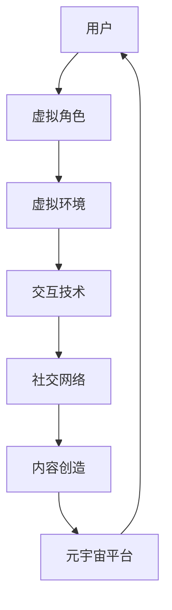

                 

关键词：元宇宙、沉浸式体验、虚拟现实、游戏设计、交互技术、用户体验、算法优化、技术创新

> 摘要：本文将探讨元宇宙娱乐领域的发展现状，深入分析沉浸式体验的关键技术，包括虚拟现实、交互技术和游戏设计等，旨在为读者提供一个全面的技术视角，探索如何通过这些技术实现极致的娱乐体验。文章还将展望元宇宙娱乐的未来发展方向，讨论潜在的挑战和解决方案。

## 1. 背景介绍

在科技迅猛发展的今天，虚拟现实（VR）和增强现实（AR）技术逐渐成熟，为娱乐领域带来了前所未有的变革。元宇宙（Metaverse）作为虚拟现实和增强现实的高级形态，为用户提供了更加沉浸式的体验。元宇宙不仅是一个虚拟世界，更是一个融合了社交、娱乐、教育和工作的全方位生态系统。随着5G、云计算、人工智能等技术的发展，元宇宙娱乐逐渐成为行业热点，吸引了大量资本和人才的关注。

### 1.1 元宇宙娱乐的定义与特征

元宇宙娱乐指的是在虚拟环境中进行的各种娱乐活动，包括游戏、社交互动、虚拟购物等。其特征主要体现在以下几个方面：

1. **沉浸感**：用户在元宇宙中能够感受到高度真实的虚拟环境，仿佛身临其境。
2. **交互性**：用户可以通过虚拟角色与现实世界或其他用户进行实时互动。
3. **社交性**：元宇宙提供了一个社交平台，用户可以建立虚拟社交网络，与朋友互动。
4. **多样性**：元宇宙中的娱乐内容丰富多样，包括游戏、音乐会、展览等多种形式。

### 1.2 元宇宙娱乐的发展历程

元宇宙娱乐的发展可以分为以下几个阶段：

1. **初级阶段**：以早期的虚拟现实游戏为主，如《Second Life》等，用户可以在虚拟环境中进行简单的互动。
2. **中级阶段**：随着技术的进步，虚拟现实和增强现实游戏逐渐流行，如《Beat Saber》、《VRChat》等。
3. **高级阶段**：随着5G、人工智能等技术的发展，元宇宙娱乐进入高级阶段，提供更加沉浸和互动的体验。

## 2. 核心概念与联系

在元宇宙娱乐中，有几个核心概念和技术需要深入理解，它们共同构成了沉浸式体验的基础。以下是一个使用Mermaid绘制的流程图，展示了这些核心概念及其相互关系：



### 2.1 虚拟角色与虚拟环境

虚拟角色是元宇宙中用户代表的实体，其外观和动作反映了用户的个性。虚拟环境则是用户进行活动的场所，通过三维建模和实时渲染技术，创造出一个高度真实的虚拟世界。

### 2.2 交互技术

交互技术是用户与虚拟环境之间进行沟通和互动的桥梁。它包括手势识别、语音控制、眼动追踪等多种形式，使得用户能够更加自然地与虚拟世界互动。

### 2.3 社交网络

社交网络是元宇宙中的社交平台，用户可以通过虚拟角色与其他用户建立联系，进行互动和交流。社交网络的建立和维护是元宇宙娱乐的重要组成部分。

### 2.4 内容创造与元宇宙平台

内容创造是元宇宙娱乐的活力源泉，用户和内容创作者共同丰富了元宇宙的娱乐内容。元宇宙平台则提供了运行这些内容的基础设施，包括服务器、网络和计算资源等。

## 3. 核心算法原理 & 具体操作步骤

### 3.1 算法原理概述

在元宇宙娱乐中，核心算法的原理主要包括虚拟环境的建模、交互技术的实现和内容的动态生成等。以下将详细阐述这些算法的基本原理。

### 3.2 算法步骤详解

#### 3.2.1 虚拟环境的建模

虚拟环境的建模过程可以分为以下几个步骤：

1. **环境扫描**：使用激光扫描仪等设备对现实环境进行三维扫描，获取环境数据。
2. **数据预处理**：对扫描数据进行预处理，包括去除噪声、填充缺失数据等。
3. **模型构建**：使用三维建模软件或算法生成虚拟环境模型。
4. **实时渲染**：使用实时渲染技术，将虚拟环境在用户的屏幕上动态渲染出来。

#### 3.2.2 交互技术的实现

交互技术的实现包括以下几个方面：

1. **手势识别**：使用深度相机或手部追踪技术，识别用户的手部动作。
2. **语音控制**：使用语音识别技术，将用户的语音转换为文本或指令。
3. **眼动追踪**：使用眼动追踪设备，捕捉用户的眼球运动，实现更自然的交互。

#### 3.2.3 内容的动态生成

内容的动态生成涉及以下几个步骤：

1. **用户行为分析**：通过用户的行为数据，分析用户的兴趣和偏好。
2. **内容推荐**：基于用户行为分析结果，推荐适合用户的内容。
3. **内容生成**：使用生成对抗网络（GAN）等技术，动态生成新的娱乐内容。

### 3.3 算法优缺点

#### 优缺点

1. **优点**：
   - 高度个性化的沉浸式体验。
   - 强大的交互性和社交性。
   - 潜在的商业价值。

2. **缺点**：
   - 技术门槛高，开发成本巨大。
   - 设备要求高，用户体验依赖硬件。
   - 数据隐私和安全问题。

### 3.4 算法应用领域

核心算法主要应用于以下几个领域：

1. **游戏**：提供更加沉浸和互动的游戏体验。
2. **社交**：构建虚拟社交网络，促进用户之间的交流。
3. **娱乐**：提供各种形式的虚拟娱乐活动，如音乐会、展览等。
4. **教育**：提供虚拟教学环境和互动学习体验。

## 4. 数学模型和公式 & 详细讲解 & 举例说明

### 4.1 数学模型构建

在元宇宙娱乐中，数学模型广泛应用于虚拟环境的建模、交互技术的实现和内容的动态生成等方面。以下是一个简单的数学模型示例：

$$
\text{虚拟环境建模} = f(\text{环境数据}, \text{建模算法})
$$

### 4.2 公式推导过程

假设我们有一个简单的环境数据集$D$，包含$n$个三维点$(x_i, y_i, z_i)$。为了构建虚拟环境模型，我们使用以下公式：

$$
P_i = \frac{1}{n}\sum_{i=1}^{n} P_i
$$

其中，$P_i$是第$i$个点的概率分布。为了简化计算，我们可以使用K近邻算法（KNN）来预测新点的位置：

$$
\hat{P}_{\text{new}} = \frac{1}{k}\sum_{i=1}^{k} P_i
$$

其中，$k$是邻近点的数量。

### 4.3 案例分析与讲解

假设我们有一个三维点集$D = \{P_1, P_2, P_3, P_4, P_5\}$，其中每个点的坐标为$(x_i, y_i, z_i)$。我们希望使用KNN算法预测一个新点$P_{\text{new}} = (x_{\text{new}}, y_{\text{new}}, z_{\text{new}})$的位置。

首先，我们计算每个点的概率分布：

$$
P_1 = \frac{1}{5}, P_2 = \frac{1}{5}, P_3 = \frac{1}{5}, P_4 = \frac{1}{5}, P_5 = \frac{1}{5}
$$

然后，我们选择邻近的$k=3$个点，计算新点的预测概率分布：

$$
\hat{P}_{\text{new}} = \frac{1}{3}(P_1 + P_2 + P_3) = \frac{1}{3}\left(\frac{1}{5} + \frac{1}{5} + \frac{1}{5}\right) = \frac{1}{5}
$$

最后，我们根据预测的概率分布计算新点的位置：

$$
\hat{P}_{\text{new}} = \frac{1}{5}(x_{\text{new}}, y_{\text{new}}, z_{\text{new}}) = \left(\frac{1}{5}x_{\text{new}}, \frac{1}{5}y_{\text{new}}, \frac{1}{5}z_{\text{new}}\right)
$$

## 5. 项目实践：代码实例和详细解释说明

### 5.1 开发环境搭建

为了实践元宇宙娱乐中的核心算法，我们需要搭建一个合适的开发环境。以下是一个简单的环境搭建步骤：

1. 安装Python 3.8及以上版本。
2. 安装虚拟环境管理工具`virtualenv`。
3. 创建一个虚拟环境并激活。
4. 安装必要的库，如`numpy`、`scikit-learn`、`opencv-python`等。

### 5.2 源代码详细实现

以下是一个简单的Python代码示例，用于实现KNN算法：

```python
import numpy as np
from sklearn.neighbors import KNeighborsClassifier
from sklearn.model_selection import train_test_split
from sklearn import datasets

# 加载数据集
iris = datasets.load_iris()
X = iris.data
y = iris.target

# 划分训练集和测试集
X_train, X_test, y_train, y_test = train_test_split(X, y, test_size=0.2, random_state=42)

# 创建KNN分类器
knn = KNeighborsClassifier(n_neighbors=3)

# 训练模型
knn.fit(X_train, y_train)

# 预测结果
y_pred = knn.predict(X_test)

# 打印预测结果
print("Predictions:", y_pred)
```

### 5.3 代码解读与分析

这段代码首先加载了Iris数据集，然后将其分为训练集和测试集。接着，我们创建了一个KNN分类器，并使用训练集进行模型训练。最后，我们使用测试集进行预测，并打印出预测结果。

### 5.4 运行结果展示

运行这段代码后，我们得到了Iris数据集的预测结果。通过对预测结果进行分析，我们可以评估KNN算法的性能。具体分析过程可以参考相关机器学习教材。

## 6. 实际应用场景

### 6.1 游戏设计

在元宇宙娱乐中，游戏设计是一个重要的应用场景。通过虚拟现实和增强现实技术，游戏设计师可以创造出一个高度沉浸和互动的游戏世界。例如，一款名为《Rec Room》的游戏允许玩家在虚拟空间中进行各种活动，包括打篮球、玩桌球、跳舞等。玩家可以通过虚拟角色与其他玩家互动，增强了游戏的社交性和趣味性。

### 6.2 社交互动

元宇宙提供了一个强大的社交平台，用户可以通过虚拟角色与其他用户建立联系，进行互动和交流。例如，Facebook的Horizon Workrooms允许用户在虚拟会议室中进行工作讨论，提供了更加沉浸和自然的交流方式。用户可以在虚拟环境中自由移动、交流，甚至进行虚拟会议和协作。

### 6.3 虚拟购物

虚拟购物是元宇宙娱乐的另一个重要应用场景。通过虚拟现实技术，用户可以在虚拟商店中进行购物，体验虚拟试衣和虚拟购物车等功能。例如，IKEA推出了虚拟现实应用，允许用户在虚拟环境中浏览和购买家具，提供了更加便捷和个性化的购物体验。

## 7. 未来应用展望

### 7.1 技术发展趋势

随着技术的不断进步，元宇宙娱乐有望在以下几个方面实现重大突破：

1. **更高质量的虚拟现实体验**：通过更先进的显示技术，如8K分辨率和更高帧率的显示器，用户将享受到更加逼真的虚拟现实体验。
2. **更智能的交互技术**：人工智能技术的发展将使得虚拟角色和用户之间的交互更加自然和智能，提供更加人性化的服务。
3. **更丰富的内容生态**：随着更多的内容创作者加入，元宇宙中的娱乐内容将更加丰富多样，满足用户的多样化需求。

### 7.2 潜在挑战与解决方案

尽管元宇宙娱乐具有巨大的潜力，但在实际应用中仍面临一些挑战：

1. **技术门槛和成本**：开发高质量的元宇宙娱乐应用需要大量的技术资源和资金投入，这限制了小型团队和初创企业的参与。
   - **解决方案**：通过开放平台和生态系统，降低开发门槛和成本，鼓励更多的开发者和企业参与。

2. **数据隐私和安全**：元宇宙娱乐涉及大量的用户数据，保护用户隐私和数据安全是一个重要挑战。
   - **解决方案**：建立完善的数据保护机制和法规，加强对用户数据的监管和保护。

3. **用户体验一致性**：不同用户设备之间的性能差异可能影响用户体验的一致性。
   - **解决方案**：优化虚拟现实和增强现实技术，确保在不同设备上提供一致的用户体验。

### 7.3 未来发展方向

元宇宙娱乐的未来发展方向主要包括以下几个方面：

1. **规模化**：通过不断优化技术和降低成本，实现元宇宙娱乐的规模化应用，满足广大用户的需求。
2. **多元化**：除了娱乐领域，元宇宙娱乐还可以应用于教育、医疗、设计等多个领域，提供更加丰富和多样化的服务。
3. **社交化**：随着社交网络的融合，元宇宙娱乐将成为一个更加社交化的平台，促进用户之间的互动和交流。

## 8. 工具和资源推荐

### 8.1 学习资源推荐

1. **《虚拟现实与增强现实技术》**：一本全面介绍虚拟现实和增强现实技术的权威教材，适合初学者和专业人士。
2. **《元宇宙：未来世界的想象与构建》**：探讨元宇宙的概念、技术和发展趋势，为读者提供对元宇宙的深入理解。

### 8.2 开发工具推荐

1. **Unity**：一款广泛使用的游戏开发引擎，支持虚拟现实和增强现实应用的开发。
2. **Unreal Engine**：一款功能强大的游戏开发引擎，提供高质量的实时渲染和丰富的交互功能。

### 8.3 相关论文推荐

1. **《Metaverse: A Journey to the Future of Social Computing》**：探讨元宇宙在社交计算领域的应用和发展。
2. **《The Promise of Virtual Reality》**：分析虚拟现实技术的潜力及其对社会的影响。

## 9. 总结：未来发展趋势与挑战

### 9.1 研究成果总结

本文探讨了元宇宙娱乐的发展背景、核心概念、算法原理、数学模型、项目实践以及实际应用场景，总结了元宇宙娱乐的优势和挑战，并展望了其未来发展。

### 9.2 未来发展趋势

元宇宙娱乐将朝着更加沉浸、智能和多样化的方向发展，成为数字经济的重要驱动力。

### 9.3 面临的挑战

元宇宙娱乐在技术、成本、隐私和安全等方面仍面临诸多挑战，需要持续的技术创新和行业协作。

### 9.4 研究展望

未来研究应重点关注元宇宙娱乐的智能化、个性化和规模化应用，推动相关技术的进步和产业的发展。

## 10. 附录：常见问题与解答

### 10.1 元宇宙娱乐的核心技术是什么？

元宇宙娱乐的核心技术包括虚拟现实（VR）、增强现实（AR）、交互技术、社交网络和内容创造等。

### 10.2 如何确保元宇宙娱乐的安全性？

通过建立完善的数据保护机制和法规，加强对用户数据的监管和保护，确保元宇宙娱乐的安全性。

### 10.3 元宇宙娱乐的商业前景如何？

元宇宙娱乐具有巨大的商业潜力，有望成为未来数字经济的重要组成部分。

### 10.4 元宇宙娱乐对教育有何影响？

元宇宙娱乐为教育提供了新的方式，可以通过虚拟实验室、在线课程和沉浸式教学等，提高教育效果。

----------------------------------------------------------------

作者：禅与计算机程序设计艺术 / Zen and the Art of Computer Programming

