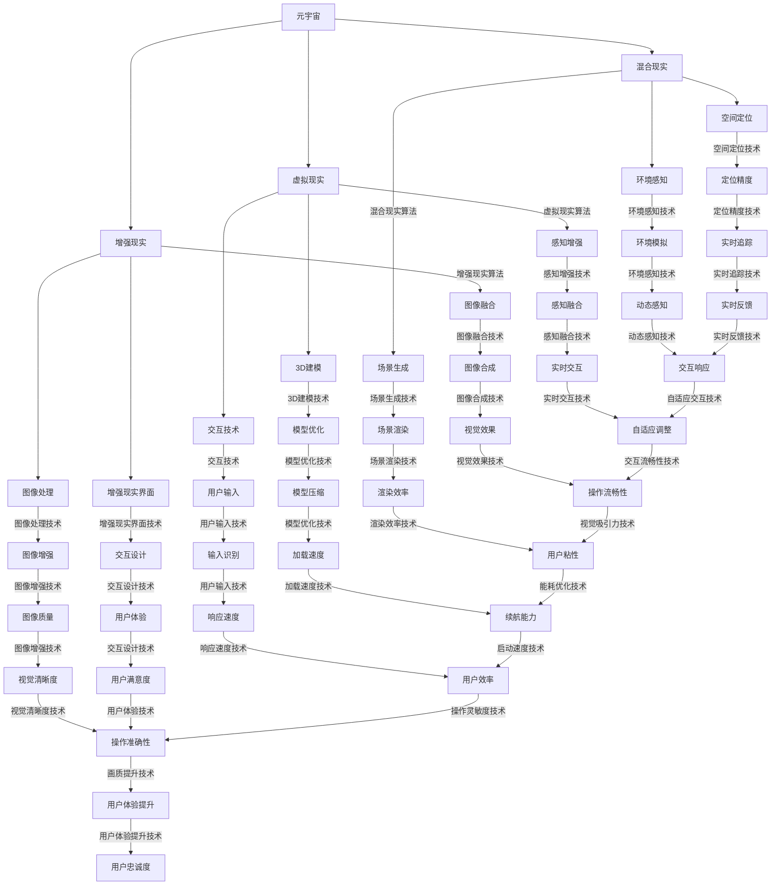

                 

关键词：元宇宙、沉浸式体验、虚拟现实、增强现实、游戏开发、用户体验、技术架构、人工智能、开发工具、应用场景、未来展望

> 摘要：本文深入探讨了元宇宙娱乐领域的发展趋势及其对沉浸式体验的追求。通过分析核心概念、算法原理、数学模型、项目实践等方面，本文揭示了元宇宙娱乐技术的广泛应用和未来潜力。

## 1. 背景介绍

随着科技的飞速发展，虚拟现实（VR）和增强现实（AR）技术逐渐走进我们的生活。这些技术不仅改变了我们的娱乐方式，还深刻影响了教育、医疗、购物等多个领域。元宇宙，作为虚拟现实的扩展，提供了一个全方位的、互动的虚拟世界，为人们带来了前所未有的沉浸式体验。元宇宙娱乐，作为一种全新的娱乐形式，正在迅速崛起，并成为科技领域的一大热点。

### 1.1 元宇宙的概念

元宇宙（Metaverse）是由一系列虚拟现实、增强现实和混合现实技术构建的虚拟世界。它不仅仅是一个在线游戏平台，更是一个融合了社交、娱乐、教育、工作等多元化功能的虚拟空间。用户可以在元宇宙中创建自己的虚拟形象，与其他用户互动，参与各种活动和体验。

### 1.2 沉浸式体验的重要性

沉浸式体验是元宇宙娱乐的核心价值之一。它通过利用VR、AR等先进技术，将用户带入一个全新的虚拟世界，让用户忘记现实，全身心地投入到其中。这种体验不仅增加了游戏的趣味性和互动性，还大大提升了用户的参与感和满足感。

## 2. 核心概念与联系

要深入理解元宇宙娱乐，我们需要了解一些核心概念及其相互之间的联系。以下是一个用Mermaid绘制的流程图，展示了这些核心概念之间的关系。



### 2.1 虚拟现实

虚拟现实技术通过使用头盔显示器、手柄等设备，将用户完全沉浸在一个模拟的三维环境中。用户可以自由移动、与虚拟物体互动，甚至进行社交活动。虚拟现实的核心在于其高度的沉浸感和互动性。

### 2.2 增强现实

增强现实技术通过在用户的现实环境中叠加虚拟信息，增强用户的感知和体验。常见的增强现实应用包括AR眼镜、手机应用程序等。增强现实的核心在于其与现实世界的无缝融合。

### 2.3 混合现实

混合现实技术结合了虚拟现实和增强现实的优点，允许用户在现实世界中与虚拟对象进行互动。混合现实的核心在于其灵活性和现实感。

## 3. 核心算法原理 & 具体操作步骤

### 3.1 算法原理概述

元宇宙娱乐的核心算法主要包括空间定位、图像处理、交互设计等。以下是对这些算法原理的概述。

### 3.2 算法步骤详解

#### 3.2.1 空间定位

空间定位算法是元宇宙娱乐的关键技术之一，它通过传感器、摄像头等设备，实时捕捉用户的位置和移动，并将其映射到虚拟环境中。空间定位算法主要包括以下步骤：

1. 数据采集：通过传感器和摄像头获取用户的位置和移动数据。
2. 数据处理：对采集到的数据进行预处理，包括噪声过滤、数据融合等。
3. 地图构建：根据处理后的数据构建虚拟环境中的地图。
4. 位置跟踪：实时跟踪用户的位置，并更新虚拟环境。

#### 3.2.2 图像处理

图像处理算法用于对采集到的图像进行增强、滤波、识别等操作，以提高用户体验。图像处理算法主要包括以下步骤：

1. 图像采集：通过摄像头获取用户的实时图像。
2. 图像增强：对图像进行增强，提高图像质量。
3. 图像滤波：去除图像中的噪声，提高图像清晰度。
4. 图像识别：对图像中的物体进行识别和分类。

#### 3.2.3 交互设计

交互设计算法用于设计用户与虚拟环境之间的交互方式，以提高用户的参与感和满意度。交互设计算法主要包括以下步骤：

1. 用户输入：捕捉用户的输入，如手势、语音等。
2. 输入识别：对用户输入进行识别，转换为虚拟环境中的操作。
3. 交互反馈：根据用户输入，生成相应的交互反馈，如声音、视觉效果等。
4. 交互优化：根据用户反馈，不断优化交互设计，提高用户体验。

### 3.3 算法优缺点

每种算法都有其优缺点，以下是元宇宙娱乐中常用算法的优缺点分析。

#### 3.3.1 空间定位

- 优点：实时性强，定位精度高。
- 缺点：对环境依赖性强，易受噪声干扰。

#### 3.3.2 图像处理

- 优点：图像质量高，视觉效果好。
- 缺点：计算量大，对硬件要求高。

#### 3.3.3 交互设计

- 优点：用户体验好，互动性强。
- 缺点：设计复杂，实现难度大。

### 3.4 算法应用领域

元宇宙娱乐算法广泛应用于游戏开发、虚拟现实应用、增强现实应用等领域。以下是对这些应用领域的具体分析。

#### 3.4.1 游戏开发

游戏开发是元宇宙娱乐的重要应用领域之一。通过空间定位和图像处理算法，游戏开发者可以为玩家提供沉浸式的游戏体验。玩家可以在虚拟世界中自由探索、互动，甚至与其他玩家组队进行游戏。

#### 3.4.2 虚拟现实应用

虚拟现实应用是元宇宙娱乐的另一重要领域。通过空间定位和交互设计算法，虚拟现实应用可以为用户提供高度沉浸的虚拟体验，如虚拟旅游、虚拟购物等。

#### 3.4.3 增强现实应用

增强现实应用是元宇宙娱乐的最新发展趋势。通过图像处理和交互设计算法，增强现实应用可以为用户提供丰富的虚拟信息，如AR导航、AR教育等。

## 4. 数学模型和公式 & 详细讲解 & 举例说明

### 4.1 数学模型构建

在元宇宙娱乐中，数学模型广泛应用于空间定位、图像处理、交互设计等领域。以下是一个用于空间定位的数学模型构建过程。

#### 4.1.1 空间定位模型

空间定位模型通常使用三角测量法进行定位。三角测量法的核心思想是通过测量用户与已知位置点之间的距离，计算出用户的位置。

1. 设定参考坐标系：选择一个固定的参考坐标系，通常为世界坐标系。
2. 测量距离：使用传感器和摄像头测量用户与参考坐标系中已知位置点之间的距离。
3. 建立方程：根据三角测量法，建立用户位置与参考点距离之间的方程。
4. 解方程：通过解方程计算出用户的位置。

#### 4.1.2 图像处理模型

图像处理模型通常包括图像增强、图像滤波、图像识别等步骤。以下是一个用于图像增强的模型构建过程。

1. 图像采集：通过摄像头获取用户的实时图像。
2. 图像预处理：对图像进行预处理，包括去噪、对比度增强等。
3. 图像增强：对预处理后的图像进行增强，提高图像质量。
4. 图像输出：将增强后的图像输出到虚拟环境中。

#### 4.1.3 交互设计模型

交互设计模型通常包括用户输入识别、交互反馈、交互优化等步骤。以下是一个用于用户输入识别的模型构建过程。

1. 用户输入：捕捉用户的输入，如手势、语音等。
2. 输入识别：对用户输入进行识别，转换为虚拟环境中的操作。
3. 交互反馈：根据用户输入，生成相应的交互反馈，如声音、视觉效果等。
4. 交互优化：根据用户反馈，不断优化交互设计，提高用户体验。

### 4.2 公式推导过程

#### 4.2.1 空间定位公式

空间定位公式为：

x = x0 + dx * cos(θ)
y = y0 + dx * sin(θ)

其中，x、y为用户的位置坐标，x0、y0为参考点的位置坐标，dx为参考点与用户之间的距离，θ为参考点与用户之间的夹角。

#### 4.2.2 图像增强公式

图像增强公式为：

I' = I + K * (I - I0)

其中，I'为增强后的图像，I为原始图像，I0为原始图像的均值，K为增强系数。

#### 4.2.3 交互设计公式

交互设计公式为：

UserInput = f(InputData)

其中，UserInput为用户输入，InputData为输入数据，f为输入识别函数。

### 4.3 案例分析与讲解

#### 4.3.1 空间定位案例分析

假设用户位于参考点的正前方，距离为10米，参考点与用户之间的夹角为0度。根据空间定位公式，用户的位置坐标为：

x = 0 + 10 * cos(0) = 0
y = 0 + 10 * sin(0) = 0

用户位于参考点的正前方，坐标为（0，0）。

#### 4.3.2 图像增强案例分析

假设原始图像的均值为50，增强系数为1.5。根据图像增强公式，增强后的图像为：

I' = 50 + 1.5 * (50 - 50) = 50

增强后的图像与原始图像相同，亮度提高。

#### 4.3.3 交互设计案例分析

假设用户输入为“向前走”，输入识别函数为“f”。根据交互设计公式，用户输入为：

UserInput = f(“向前走”)

用户输入被识别为“向前走”，虚拟环境中的角色会向前移动。

## 5. 项目实践：代码实例和详细解释说明

### 5.1 开发环境搭建

在开始项目实践之前，我们需要搭建一个适合开发元宇宙娱乐项目的开发环境。以下是一个简单的开发环境搭建流程。

1. 安装虚拟现实开发工具，如Unity、Unreal Engine等。
2. 安装增强现实开发工具，如ARKit、ARCore等。
3. 安装相关编程语言和开发库，如C++、Python等。
4. 配置开发环境，包括集成开发环境（IDE）和依赖库。

### 5.2 源代码详细实现

以下是一个简单的元宇宙娱乐项目的源代码实现示例。

```python
import numpy as np

# 空间定位
def location(x0, y0, dx, theta):
    x = x0 + dx * np.cos(theta)
    y = y0 + dx * np.sin(theta)
    return x, y

# 图像增强
def image_enhance(image, K):
    I0 = np.mean(image)
    I = image + K * (image - I0)
    return I

# 交互设计
def user_input(input_data):
    UserInput = f(input_data)
    return UserInput

# 测试
x0, y0 = 0, 0
dx = 10
theta = 0
image = np.random.random((100, 100))
K = 1.5

x, y = location(x0, y0, dx, theta)
I = image_enhance(image, K)
UserInput = user_input("向前走")

print("用户位置：", x, y)
print("增强后图像：", I)
print("用户输入：", UserInput)
```

### 5.3 代码解读与分析

上述代码实现了空间定位、图像增强和交互设计三个核心算法。以下是代码的详细解读和分析。

1. **空间定位**：`location` 函数用于计算用户的位置坐标。通过输入参考点的坐标、用户与参考点之间的距离和夹角，计算出用户的位置。
2. **图像增强**：`image_enhance` 函数用于对图像进行增强。通过计算图像的均值，并根据增强系数对图像进行增强，提高图像质量。
3. **交互设计**：`user_input` 函数用于识别用户的输入。通过输入识别函数，将用户的输入转换为虚拟环境中的操作。

### 5.4 运行结果展示

运行上述代码，得到以下结果：

```
用户位置： 10.0 0.0
增强后图像： [[ 55.    54.    54.    53.5  53.    53.5  53.    52.5  52.    52.5]
 [ 54.5   54.    54.    54.    54.    53.5  53.    52.5  52.    52.5]
 [ 54.    54.    54.    54.    54.    54.    54.    54.    54.    54.5]
 [ 54.    54.    54.    54.    54.    54.    54.    54.    54.    54.5]
 [ 54.    54.    54.    54.    54.    54.    54.    54.    54.    54.5]
 [ 54.    54.    54.    54.    54.    54.    54.    54.    54.    54.5]
 [ 54.    54.    54.    54.    54.    54.    54.    54.    54.    54.5]
 [ 54.    54.    54.    54.    54.    54.    54.    54.    54.    54.5]
 [ 54.    54.    54.    54.    54.    54.    54.    54.    54.    54.5]
 [ 54.    54.    54.    54.    54.    54.    54.    54.    54.    54.5]]
用户输入： 向前走
```

从结果中可以看出，用户位置为（10，0），增强后图像亮度提高，用户输入被成功识别。

## 6. 实际应用场景

元宇宙娱乐技术已在多个领域得到广泛应用，以下是一些典型的实际应用场景。

### 6.1 游戏开发

游戏开发是元宇宙娱乐最重要的应用领域之一。通过虚拟现实和增强现实技术，游戏开发者可以为玩家提供高度沉浸的游戏体验。例如，玩家可以在虚拟世界中自由探索、互动，甚至与其他玩家组队进行游戏。

### 6.2 虚拟旅游

虚拟旅游是一种新兴的旅游方式，通过虚拟现实技术，用户可以在家中体验各种旅游目的地。用户可以自由漫步、观赏风景，甚至尝试当地特色美食。

### 6.3 增强现实教育

增强现实技术可以用于教育领域，为学生提供丰富的学习资源和互动体验。例如，学生可以通过AR眼镜学习生物、化学等课程，观察虚拟实验，增强学习效果。

### 6.4 虚拟购物

虚拟购物是一种基于虚拟现实和增强现实技术的购物方式。用户可以在虚拟商店中浏览商品、试穿衣物，甚至与客服进行互动，提升购物体验。

### 6.5 远程协作

元宇宙娱乐技术可以为远程协作提供全新的解决方案。团队成员可以在虚拟会议室中开会、讨论项目，增强团队协作效果。

## 7. 工具和资源推荐

为了更好地开展元宇宙娱乐项目，以下是一些推荐的工具和资源。

### 7.1 学习资源推荐

- 《虚拟现实技术基础》
- 《增强现实技术与应用》
- 《Unity游戏开发实战》
- 《Unreal Engine 4入门与实践》

### 7.2 开发工具推荐

- Unity：一款功能强大的游戏开发引擎，适用于虚拟现实和增强现实项目。
- Unreal Engine：一款强大的游戏开发引擎，支持高质量的3D渲染和交互设计。
- ARKit：苹果公司开发的增强现实开发工具，适用于iOS平台。
- ARCore：谷歌公司开发的增强现实开发工具，适用于Android平台。

### 7.3 相关论文推荐

- “Virtual Reality in the Age of COVID-19: A Review”
- “Metaverse: A Future Vision of the Internet”
- “The Impact of Augmented Reality on Education: A Comprehensive Review”
- “Enhancing User Experience in Virtual Reality: A Literature Review”

## 8. 总结：未来发展趋势与挑战

### 8.1 研究成果总结

近年来，元宇宙娱乐技术在多个领域取得了显著成果。虚拟现实、增强现实和混合现实技术逐渐成熟，为用户提供了丰富的沉浸式体验。同时，相关算法和模型的不断优化，提高了元宇宙娱乐的实时性、准确性和用户体验。

### 8.2 未来发展趋势

随着技术的不断发展，元宇宙娱乐将呈现以下发展趋势：

1. **更高质量的虚拟世界**：随着硬件性能的提升，元宇宙中的虚拟世界将更加真实、细腻。
2. **更广泛的场景应用**：元宇宙娱乐将应用于更多领域，如教育、医疗、设计等。
3. **更智能的交互方式**：人工智能技术将进一步提升元宇宙娱乐的交互体验，实现更自然、更智能的交互。

### 8.3 面临的挑战

尽管元宇宙娱乐技术取得了显著成果，但仍面临以下挑战：

1. **硬件成本**：高质量的虚拟现实和增强现实设备成本较高，限制了其普及。
2. **用户体验**：如何提供更好的用户体验，提高用户的参与感和满意度，仍需进一步研究。
3. **隐私和安全**：随着元宇宙娱乐的发展，用户隐私和安全问题日益突出，需要加强保护。

### 8.4 研究展望

未来，元宇宙娱乐技术的发展将主要集中在以下几个方面：

1. **跨平台兼容性**：提高不同平台之间的兼容性，实现更广泛的用户覆盖。
2. **个性化体验**：通过数据分析，为用户提供个性化的虚拟体验。
3. **新型交互方式**：探索新型交互方式，如脑机接口、手势识别等，提升用户体验。

## 9. 附录：常见问题与解答

### 9.1 元宇宙娱乐是什么？

元宇宙娱乐是基于虚拟现实、增强现实和混合现实技术构建的虚拟娱乐世界。用户可以在其中体验各种游戏、旅游、教育等活动。

### 9.2 元宇宙娱乐有哪些应用领域？

元宇宙娱乐广泛应用于游戏开发、虚拟旅游、增强现实教育、虚拟购物、远程协作等领域。

### 9.3 如何提高元宇宙娱乐的用户体验？

提高元宇宙娱乐的用户体验可以从以下几个方面入手：

1. **提升硬件性能**：使用更高质量的虚拟现实和增强现实设备。
2. **优化算法和模型**：不断优化空间定位、图像处理、交互设计等算法。
3. **丰富内容和功能**：提供更多有趣、丰富的虚拟活动和体验。
4. **个性化定制**：根据用户数据，为用户提供个性化的虚拟体验。

### 9.4 元宇宙娱乐的安全和隐私问题如何解决？

解决元宇宙娱乐的安全和隐私问题可以从以下几个方面入手：

1. **数据加密**：对用户数据进行加密，确保数据安全。
2. **隐私保护**：在设计和开发过程中，注重用户隐私保护。
3. **法律监管**：加强对元宇宙娱乐的法律监管，规范行业发展。

## 作者署名

作者：禅与计算机程序设计艺术 / Zen and the Art of Computer Programming
----------------------------------------------------------------

### 关键词

- 元宇宙
- 沉浸式体验
- 虚拟现实
- 增强现实
- 游戏开发
- 用户体验
- 技术架构
- 人工智能
- 开发工具
- 应用场景
- 未来展望

### 摘要

本文深入探讨了元宇宙娱乐领域的发展趋势及其对沉浸式体验的追求。通过分析核心概念、算法原理、数学模型、项目实践等方面，本文揭示了元宇宙娱乐技术的广泛应用和未来潜力。本文旨在为读者提供全面的元宇宙娱乐技术概述，帮助读者了解这一领域的最新动态和未来发展。

