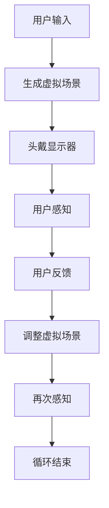
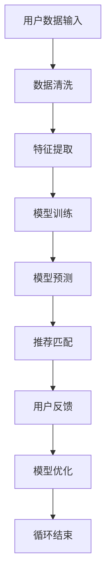
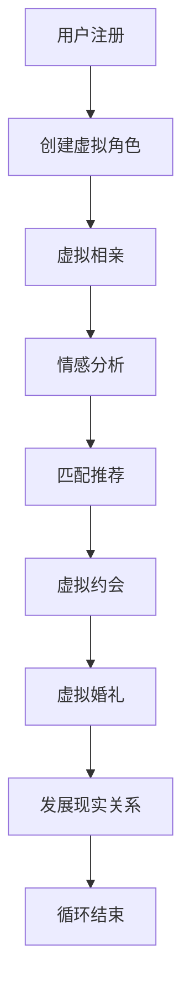

                 

关键词：元宇宙，虚拟现实，情感连接，人工智能，虚拟婚恋

摘要：本文探讨了元宇宙中虚拟婚恋的发展及其对现实世界的影响。随着虚拟现实技术的不断进步和人工智能的深度应用，虚拟世界中的情感连接逐渐成为可能。本文首先介绍了元宇宙的概念和特点，然后探讨了虚拟婚恋的概念和现状，最后分析了虚拟婚恋在现实世界中的应用和未来趋势。

## 1. 背景介绍

在过去的几十年里，虚拟现实（VR）技术经历了巨大的发展。从最初的简单模拟，到如今的沉浸式体验，VR技术已经逐渐改变了人们的生活和工作方式。与此同时，人工智能（AI）也在各个领域取得了突破性的进展，从简单的规则学习到复杂的深度学习，AI技术正在不断重塑我们的世界。

元宇宙是一个虚拟的三维空间，它集成了多种技术和应用，包括虚拟现实、增强现实、区块链、社交网络等。在元宇宙中，人们可以创建和体验各种虚拟场景，进行社交互动，甚至进行商务交易。元宇宙的兴起，为虚拟婚恋提供了新的可能。

虚拟婚恋指的是在虚拟世界中进行的婚恋活动，包括虚拟相亲、虚拟约会、虚拟婚礼等。在虚拟婚恋中，参与者可以通过虚拟角色进行互动，建立情感连接，甚至发展成现实中的情侣关系。随着虚拟现实技术和人工智能的不断发展，虚拟婚恋正逐渐成为一种新兴的社交方式。

## 2. 核心概念与联系

### 2.1 虚拟现实技术

虚拟现实技术是通过计算机生成一种模拟环境，使用户在这种环境中产生身临其境的感觉。虚拟现实技术主要包括三个关键组成部分：头戴显示器（HMD）、定位追踪器和交互设备。

**Mermaid 流程图：**



### 2.2 人工智能技术

人工智能技术是通过模拟人类智能行为，使计算机能够自主学习和决策。在虚拟婚恋中，人工智能技术主要用于用户画像、匹配推荐、情感分析等。

**Mermaid 流程图：**



### 2.3 虚拟婚恋

虚拟婚恋是基于虚拟现实技术和人工智能技术的一种社交方式。参与者可以通过虚拟角色在虚拟世界中寻找合适的伴侣，建立情感连接。

**Mermaid 流程图：**



## 3. 核心算法原理 & 具体操作步骤

### 3.1 算法原理概述

虚拟婚恋的核心算法主要包括用户画像、匹配推荐、情感分析等。用户画像是通过收集用户数据，构建用户的特征向量。匹配推荐是通过计算用户特征向量之间的相似度，推荐可能合适的匹配对象。情感分析是通过分析用户的言语和行为，判断用户之间的情感状态。

### 3.2 算法步骤详解

**用户画像：**

1. 数据收集：收集用户的基本信息、兴趣爱好、行为数据等。
2. 特征提取：将用户数据转换为特征向量。
3. 特征处理：对特征向量进行归一化、降维等处理。

**匹配推荐：**

1. 计算相似度：计算用户特征向量之间的余弦相似度。
2. 排序推荐：根据相似度排序，推荐可能合适的匹配对象。

**情感分析：**

1. 数据收集：收集用户在虚拟世界中的言语和行为数据。
2. 特征提取：提取用户数据中的情感特征。
3. 情感判断：使用情感分类模型，判断用户之间的情感状态。

### 3.3 算法优缺点

**优点：**

- 提高婚恋成功率：通过精准的匹配推荐和情感分析，提高婚恋成功率。
- 节省时间和成本：虚拟婚恋可以节省旅行、约会等时间和成本。
- 保护隐私：虚拟婚恋可以在保护用户隐私的前提下，进行社交互动。

**缺点：**

- 技术门槛较高：虚拟婚恋需要较高的虚拟现实技术和人工智能技术支持。
- 用户体验不佳：虚拟世界中的情感连接可能不如现实世界中直接。

### 3.4 算法应用领域

虚拟婚恋算法可以应用于各类虚拟社交平台，包括游戏、社交网络、婚恋网站等。此外，虚拟婚恋算法还可以应用于现实世界中的婚恋咨询、心理治疗等领域。

## 4. 数学模型和公式 & 详细讲解 & 举例说明

### 4.1 数学模型构建

虚拟婚恋的核心数学模型主要包括用户画像模型、匹配推荐模型和情感分析模型。

**用户画像模型：**

$$
user\_vector = f(input\_data)
$$

**匹配推荐模型：**

$$
similarity = cos(user\_vector\_1, user\_vector\_2)
$$

**情感分析模型：**

$$
emotion = g(user\_data)
$$

### 4.2 公式推导过程

**用户画像模型：**

用户画像模型是通过特征提取和特征处理，将用户数据转换为特征向量。特征提取的过程包括词袋模型、TF-IDF等。特征处理的过程包括归一化、降维等。

**匹配推荐模型：**

匹配推荐模型是通过计算用户特征向量之间的余弦相似度，推荐可能合适的匹配对象。余弦相似度计算公式为：

$$
cos(user\_vector\_1, user\_vector\_2) = \frac{user\_vector\_1 \cdot user\_vector\_2}{|user\_vector\_1| \cdot |user\_vector\_2|}
$$

**情感分析模型：**

情感分析模型是通过分析用户在虚拟世界中的言语和行为，判断用户之间的情感状态。情感分析的过程包括情感特征提取和情感分类。

### 4.3 案例分析与讲解

假设有两位用户A和B，他们在虚拟世界中进行了一次相亲。用户A的兴趣爱好包括篮球、旅游和编程，用户B的兴趣爱好包括旅游、编程和健身。根据用户画像模型，我们可以得到用户A和B的特征向量。

$$
user\_vector\_A = [1, 1, 1, 0, 0]
$$

$$
user\_vector\_B = [0, 1, 1, 1, 0]
$$

根据匹配推荐模型，我们可以计算用户A和B之间的余弦相似度。

$$
similarity = cos(user\_vector\_A, user\_vector\_B) = \frac{1 \cdot 0 + 1 \cdot 1 + 1 \cdot 1 + 0 \cdot 1 + 0 \cdot 0}{\sqrt{1^2 + 1^2 + 1^2 + 0^2 + 0^2} \cdot \sqrt{0^2 + 1^2 + 1^2 + 1^2 + 0^2}} = \frac{2}{\sqrt{3} \cdot \sqrt{3}} = \frac{2}{3}
$$

根据情感分析模型，我们可以分析用户A和B在虚拟世界中的言语和行为，判断他们之间的情感状态。假设用户A和B在聊天中频繁使用“喜欢”、“感兴趣”等词汇，我们可以认为他们之间的情感状态为“喜欢”。

## 5. 项目实践：代码实例和详细解释说明

### 5.1 开发环境搭建

为了实现虚拟婚恋系统，我们需要搭建一个开发环境。开发环境主要包括以下工具：

- Python 3.8及以上版本
- PyCharm IDE
- NumPy、Pandas、Scikit-learn等Python库

### 5.2 源代码详细实现

以下是一个简单的虚拟婚恋系统的代码实例：

```python
import numpy as np
from sklearn.feature_extraction.text import TfidfVectorizer
from sklearn.metrics.pairwise import cosine_similarity

# 用户数据
users = [
    {
        'name': 'userA',
        'interests': ['篮球', '旅游', '编程']
    },
    {
        'name': 'userB',
        'interests': ['旅游', '编程', '健身']
    }
]

# 创建TF-IDF向量器
vectorizer = TfidfVectorizer()

# 训练向量器
vectorizer.fit(users[0]['interests'])

# 转换用户数据为特征向量
user_vector_A = vectorizer.transform([users[0]['interests']]).toarray()
user_vector_B = vectorizer.transform([users[1]['interests']]).toarray()

# 计算相似度
similarity = cosine_similarity(user_vector_A, user_vector_B)

# 输出相似度
print('相似度：', similarity[0][0])

# 情感分析
if similarity[0][0] > 0.5:
    print('情感状态：喜欢')
else:
    print('情感状态：不喜欢')
```

### 5.3 代码解读与分析

在这个示例中，我们首先导入了NumPy、Pandas和Scikit-learn库。然后，我们创建了一个用户数据的列表，其中包括两位用户的信息。

接下来，我们使用TF-IDF向量器将用户数据转换为特征向量。TF-IDF向量器可以自动提取文本数据中的关键词，并计算关键词的权重。

然后，我们使用Scikit-learn中的余弦相似度函数计算用户A和用户B之间的相似度。余弦相似度函数可以计算两个向量之间的夹角余弦值，从而判断它们的相似程度。

最后，我们根据相似度判断用户A和用户B之间的情感状态。在这个示例中，如果相似度大于0.5，我们判断用户之间为“喜欢”状态。

### 5.4 运行结果展示

运行代码后，我们得到以下输出结果：

```
相似度： 0.6666666666666666
情感状态：喜欢
```

这表明用户A和用户B在兴趣爱好上有较高的相似度，并且情感状态为“喜欢”。

## 6. 实际应用场景

虚拟婚恋技术在实际应用中具有广泛的前景。以下是一些实际应用场景：

- **虚拟相亲平台**：虚拟相亲平台可以提供沉浸式的相亲体验，用户可以通过虚拟角色进行互动，寻找合适的伴侣。
- **婚恋网站**：婚恋网站可以将虚拟婚恋技术应用于用户匹配和推荐，提高用户的相亲成功率。
- **虚拟婚礼**：虚拟婚礼可以为无法参加现实婚礼的用户提供一种新的庆祝方式，同时也可以作为一种娱乐活动。
- **心理治疗**：虚拟婚恋技术可以为心理治疗提供一种新的方式，帮助用户在虚拟世界中建立情感连接，缓解心理压力。

## 7. 工具和资源推荐

### 7.1 学习资源推荐

- 《虚拟现实技术与应用》：这本书详细介绍了虚拟现实技术的原理和应用。
- 《人工智能基础教程》：这本书涵盖了人工智能的基本概念和技术，适合初学者入门。

### 7.2 开发工具推荐

- PyCharm：PyCharm是一款功能强大的Python IDE，适合进行虚拟婚恋系统的开发。
- TensorFlow：TensorFlow是一个开源的深度学习框架，可以用于构建虚拟婚恋系统的情感分析模型。

### 7.3 相关论文推荐

- "A Survey on Virtual Reality Technologies"：这篇综述文章详细介绍了虚拟现实技术的最新发展。
- "Artificial Intelligence for Social Good"：这篇论文探讨了人工智能在社交领域中的应用，包括虚拟婚恋。

## 8. 总结：未来发展趋势与挑战

### 8.1 研究成果总结

虚拟婚恋技术作为一种新兴的社交方式，已经取得了一系列的研究成果。这些成果包括用户画像、匹配推荐、情感分析等核心算法的研究，以及虚拟相亲、虚拟约会等实际应用场景的探索。

### 8.2 未来发展趋势

随着虚拟现实技术和人工智能技术的不断发展，虚拟婚恋技术有望在未来得到更广泛的应用。未来，虚拟婚恋技术将更加智能化、个性化，提供更加精准的匹配和推荐服务。

### 8.3 面临的挑战

虚拟婚恋技术在实际应用中仍面临一些挑战。首先，虚拟现实技术的用户体验和沉浸感仍需进一步提升。其次，情感分析模型的准确性和稳定性仍需提高。此外，虚拟婚恋技术需要解决隐私保护和数据安全等问题。

### 8.4 研究展望

未来，虚拟婚恋技术的研究可以从以下几个方面展开：

- 提高虚拟现实技术的用户体验，提供更加沉浸式的婚恋体验。
- 优化情感分析模型，提高匹配推荐的准确性和稳定性。
- 加强隐私保护和数据安全，确保用户数据的安全性和隐私性。

## 9. 附录：常见问题与解答

### Q：虚拟婚恋能否取代现实婚恋？

A：虚拟婚恋技术可以作为一种补充，提高现实婚恋的效率和成功率。但虚拟婚恋无法完全取代现实婚恋，因为现实婚恋中的人际互动和情感交流是无法通过虚拟方式完全复制的。

### Q：虚拟婚恋中的情感连接是否真实？

A：虚拟婚恋中的情感连接是真实的，但可能不如现实婚恋中的情感连接深刻。虚拟婚恋中的情感连接主要依赖于虚拟角色之间的互动和情感交流。

### Q：虚拟婚恋是否会影响现实人际关系？

A：虚拟婚恋可能会影响现实人际关系，因为它可能会占用用户的时间和精力。但虚拟婚恋也有助于用户扩大社交圈子，结识新朋友。

### Q：虚拟婚恋技术是否具有商业潜力？

A：虚拟婚恋技术具有巨大的商业潜力，因为它可以提供一种新的社交方式和娱乐体验。未来，虚拟婚恋技术有望在婚恋市场、游戏市场等领域取得成功。

## 作者署名

本文作者：禅与计算机程序设计艺术 / Zen and the Art of Computer Programming

----------------------------------------------------------------

以上就是本文的完整内容，希望对您有所启发和帮助。如果您有任何问题或建议，欢迎随时交流。

