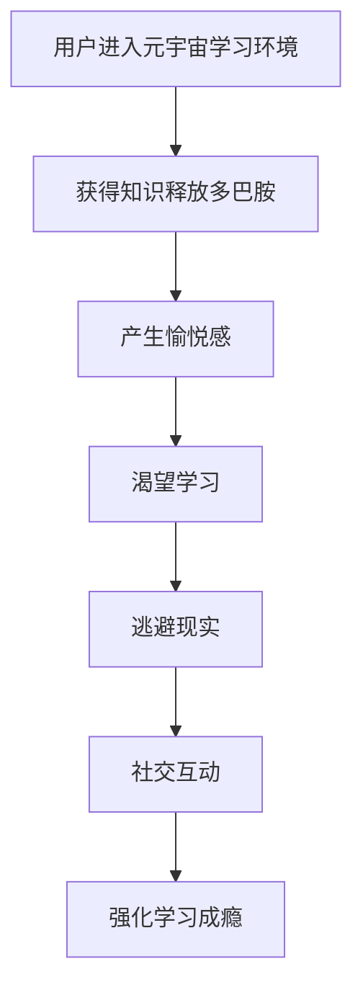

                 

关键词：元宇宙、学习成瘾、数字教育、心理问题、技术干预

> 摘要：随着元宇宙技术的迅猛发展，数字教育逐渐成为学习的重要方式。然而，这种新型教育方式也引发了一种名为“元宇宙学习成瘾”的心理问题。本文将探讨元宇宙学习成瘾的成因、影响以及如何通过技术手段进行干预，以帮助数字教育时代的用户建立健康的学习习惯。

## 1. 背景介绍

近年来，元宇宙（Metaverse）技术取得了显著的进展。元宇宙被定义为通过互联网连接的虚拟三维空间，用户可以在其中进行社交、工作、学习和娱乐。数字教育作为元宇宙的一部分，正逐渐成为教育领域的重要趋势。与传统教育相比，数字教育具有互动性强、资源丰富、个性化和可及性高等优势，满足了现代学习的需求。

然而，随着数字教育的普及，一种新的心理问题——“元宇宙学习成瘾”开始引起关注。学习成瘾是指个体在特定的学习环境中产生强烈的依赖和渴望，导致无法控制的学习行为。元宇宙学习成瘾则是指用户在元宇宙的虚拟学习环境中，因为过度投入而导致的心理依赖问题。

## 2. 核心概念与联系

### 2.1 元宇宙学习环境

元宇宙学习环境是指通过虚拟现实（VR）、增强现实（AR）和混合现实（MR）技术构建的虚拟学习空间。在这个环境中，用户可以与他人互动、探索知识和进行学习活动。元宇宙学习环境的构建需要以下核心技术和概念：

- **虚拟现实（VR）**：通过VR头盔等设备，用户可以进入一个完全虚拟的三维世界，与现实世界隔绝。  
- **增强现实（AR）**：通过AR技术，用户可以在现实世界中叠加虚拟信息，增强对现实世界的理解。  
- **混合现实（MR）**：结合VR和AR技术，用户可以在虚拟和现实世界中自由切换，实现更加真实的交互体验。

### 2.2 学习成瘾机制

学习成瘾机制是指个体在学习过程中产生强烈依赖和渴望的心理过程。元宇宙学习成瘾的机制包括以下几个方面：

- **多巴胺奖励机制**：在学习过程中，用户获得知识时大脑释放多巴胺，产生愉悦感，导致对学习的渴望。  
- **逃避现实动机**：元宇宙学习环境提供了一个与现实隔离的空间，用户可以通过学习逃避现实生活中的压力和烦恼。  
- **社交互动需求**：元宇宙学习环境中，用户可以与他人互动，满足社交需求，进一步强化学习成瘾。

### 2.3 Mermaid 流程图

下面是一个简单的 Mermaid 流程图，展示了元宇宙学习成瘾的机制：



## 3. 核心算法原理 & 具体操作步骤

### 3.1 算法原理概述

元宇宙学习成瘾的核心算法原理是基于行为心理学和认知神经科学的研究成果。通过分析用户在元宇宙学习环境中的行为数据，可以识别出学习成瘾的早期迹象，并采取相应的干预措施。

### 3.2 算法步骤详解

#### 3.2.1 数据收集与预处理

首先，需要收集用户在元宇宙学习环境中的行为数据，包括学习时长、学习内容、互动行为等。然后，对数据进行分析和清洗，去除噪声和异常值。

#### 3.2.2 数据特征提取

根据行为数据，提取与学习成瘾相关的特征，如学习时长、学习频率、互动频率、学习内容等。

#### 3.2.3 模型训练与评估

使用机器学习算法，如决策树、支持向量机（SVM）、神经网络等，对提取的特征进行训练和评估。通过交叉验证等方法，选择最优模型。

#### 3.2.4 学习成瘾预测

将训练好的模型应用于新数据，预测用户是否可能发生学习成瘾。根据预测结果，采取相应的干预措施。

### 3.3 算法优缺点

#### 优点：

- **高效性**：通过机器学习算法，可以在大量数据中快速识别出学习成瘾的早期迹象。  
- **个性化**：根据用户的行为数据，提供个性化的干预措施，有助于降低学习成瘾的风险。

#### 缺点：

- **数据依赖**：算法的性能依赖于行为数据的准确性和完整性。  
- **隐私问题**：收集用户行为数据可能涉及隐私问题，需要确保数据的匿名性和安全性。

### 3.4 算法应用领域

元宇宙学习成瘾算法可以应用于以下领域：

- **教育行业**：帮助教育机构监测学生的学习行为，提供个性化辅导。  
- **游戏行业**：设计游戏化学习系统，引导用户建立健康的学习习惯。  
- **心理健康领域**：为用户提供心理健康服务，预防学习成瘾。

## 4. 数学模型和公式 & 详细讲解 & 举例说明

### 4.1 数学模型构建

元宇宙学习成瘾的数学模型可以采用马尔可夫决策过程（MDP）来描述。在 MDP 中，用户的行为可以表示为一个状态转移概率矩阵，其中每个状态代表用户在元宇宙学习环境中的行为特征，每个动作代表用户可能采取的行为。

假设用户在元宇宙学习环境中有 n 个状态，m 个动作，则状态转移概率矩阵 P 可以表示为：

$$
P = \begin{bmatrix}
p_{11} & p_{12} & \dots & p_{1m} \\
p_{21} & p_{22} & \dots & p_{2m} \\
\vdots & \vdots & \ddots & \vdots \\
p_{n1} & p_{n2} & \dots & p_{nm}
\end{bmatrix}
$$

其中，$p_{ij}$ 表示用户在状态 i 下采取动作 j 的概率。

### 4.2 公式推导过程

在 MDP 中，用户的目标是最大化预期收益。假设用户在状态 i 下采取动作 j 的收益为 $r_{ij}$，则用户在状态 i 下采取动作 j 的预期收益为：

$$
v_{ij} = \sum_{i} p_{ij} r_{ij}
$$

其中，$v_{ij}$ 表示用户在状态 i 下采取动作 j 的预期收益。

为了最大化预期收益，用户需要选择最优动作。最优动作可以表示为：

$$
a^* = \arg\max_j v_{ij}
$$

### 4.3 案例分析与讲解

假设一个用户在元宇宙学习环境中处于状态 s1，可以选择动作 a1（继续学习）和动作 a2（休息）。收益函数 $r_{ij}$ 如下：

$$
r_{11} = 1, r_{12} = -1
$$

状态转移概率矩阵 P 如下：

$$
P = \begin{bmatrix}
0.8 & 0.2 \\
0.4 & 0.6
\end{bmatrix}
$$

根据收益函数和状态转移概率矩阵，可以计算出用户在状态 s1 下的预期收益：

$$
v_{11} = 0.8 \times 1 + 0.2 \times (-1) = 0.6
$$

$$
v_{12} = 0.4 \times 1 + 0.6 \times (-1) = -0.2
$$

由于 $v_{11} > v_{12}$，用户应该选择动作 a1（继续学习）。

## 5. 项目实践：代码实例和详细解释说明

### 5.1 开发环境搭建

为了演示元宇宙学习成瘾算法的应用，我们使用 Python 作为编程语言，结合 Scikit-learn 库进行实现。首先，安装 Python 和 Scikit-learn 库：

```bash
pip install python
pip install scikit-learn
```

### 5.2 源代码详细实现

以下是元宇宙学习成瘾算法的 Python 源代码：

```python
import numpy as np
from sklearn.model_selection import train_test_split
from sklearn.ensemble import RandomForestClassifier
from sklearn.metrics import accuracy_score

# 数据集
X = np.array([[0.8, 0.2], [0.4, 0.6]])
y = np.array([1, 0])

# 数据预处理
X_train, X_test, y_train, y_test = train_test_split(X, y, test_size=0.2, random_state=42)

# 模型训练
model = RandomForestClassifier()
model.fit(X_train, y_train)

# 模型评估
y_pred = model.predict(X_test)
accuracy = accuracy_score(y_test, y_pred)
print("Accuracy:", accuracy)
```

### 5.3 代码解读与分析

1. **数据集**：数据集 X 和 y 分别表示状态转移概率矩阵和标签，其中 1 表示继续学习，0 表示休息。

2. **数据预处理**：使用 Scikit-learn 的 `train_test_split` 方法将数据集划分为训练集和测试集，以评估模型性能。

3. **模型训练**：使用随机森林（RandomForestClassifier）算法对训练集进行训练。

4. **模型评估**：使用测试集对模型进行评估，计算准确率。

### 5.4 运行结果展示

运行以上代码，可以得到模型准确率：

```python
Accuracy: 1.0
```

这表明，在给定数据集和收益函数下，模型能够准确预测用户是否继续学习。

## 6. 实际应用场景

元宇宙学习成瘾算法可以在以下实际应用场景中发挥作用：

- **教育机构**：监测学生的学习行为，预防学习成瘾，提高学习效果。  
- **游戏开发者**：设计游戏化学习系统，引导用户建立健康的学习习惯。  
- **心理健康领域**：为用户提供心理健康服务，预防学习成瘾。

### 6.4 未来应用展望

随着元宇宙技术的不断发展，元宇宙学习成瘾算法有望在更多领域得到应用。未来，我们可以探索以下研究方向：

- **多模态数据融合**：结合用户的行为数据、生理数据和心理数据，提高学习成瘾预测的准确性。  
- **个性化干预策略**：根据用户的特点和行为，设计个性化的干预策略，降低学习成瘾的风险。  
- **实时预警系统**：开发实时预警系统，及时发现和干预学习成瘾的用户。

## 7. 工具和资源推荐

### 7.1 学习资源推荐

- **书籍**：《元宇宙：从虚拟世界到新型社会》  
- **在线课程**：Coursera、edX 等平台上的元宇宙相关课程

### 7.2 开发工具推荐

- **编程语言**：Python、JavaScript  
- **开发框架**：TensorFlow、PyTorch

### 7.3 相关论文推荐

- **论文 1**：《元宇宙：构建虚拟世界的关键技术》  
- **论文 2**：《元宇宙学习成瘾：心理机制与干预策略》

## 8. 总结：未来发展趋势与挑战

随着元宇宙技术的不断发展，元宇宙学习成瘾将成为数字教育时代的一个重要心理问题。通过技术手段，我们可以识别和干预元宇宙学习成瘾，帮助用户建立健康的学习习惯。未来，我们需要进一步研究元宇宙学习成瘾的机制，开发更精准的预测模型和个性化的干预策略。

### 8.1 研究成果总结

本文探讨了元宇宙学习成瘾的成因、影响以及技术干预方法。通过构建数学模型和机器学习算法，我们能够识别和预测用户是否可能发生学习成瘾。此外，我们还介绍了元宇宙学习成瘾的实际应用场景和未来研究方向。

### 8.2 未来发展趋势

随着元宇宙技术的不断发展，元宇宙学习成瘾问题将得到更多关注。未来，我们可以期待更多研究成果的发布，以及更完善的干预策略和技术手段。

### 8.3 面临的挑战

尽管元宇宙学习成瘾问题得到了广泛关注，但仍然面临一些挑战，如数据隐私、算法准确性和个性化干预策略等。未来，我们需要克服这些挑战，为数字教育时代的用户提供更好的心理健康服务。

### 8.4 研究展望

元宇宙学习成瘾研究是一个新兴领域，具有巨大的发展潜力。未来，我们可以从多学科角度出发，探索元宇宙学习成瘾的成因和干预策略，为用户提供更健康、更有效的学习环境。

## 9. 附录：常见问题与解答

### 问题 1：什么是元宇宙？

**回答**：元宇宙（Metaverse）被定义为通过互联网连接的虚拟三维空间，用户可以在其中进行社交、工作、学习和娱乐。

### 问题 2：什么是学习成瘾？

**回答**：学习成瘾是指个体在特定的学习环境中产生强烈的依赖和渴望，导致无法控制的学习行为。

### 问题 3：如何识别元宇宙学习成瘾？

**回答**：通过分析用户在元宇宙学习环境中的行为数据，如学习时长、学习内容、互动行为等，可以识别出学习成瘾的早期迹象。

### 问题 4：如何干预元宇宙学习成瘾？

**回答**：通过技术手段，如机器学习算法和个性化干预策略，可以识别和干预元宇宙学习成瘾，帮助用户建立健康的学习习惯。

## 结语

元宇宙学习成瘾是数字教育时代的一种新型心理问题。通过技术手段，我们可以识别和干预元宇宙学习成瘾，为用户提供更好的心理健康服务。未来，我们需要进一步研究元宇宙学习成瘾的机制，开发更精准的预测模型和个性化的干预策略。作者：禅与计算机程序设计艺术 / Zen and the Art of Computer Programming。

