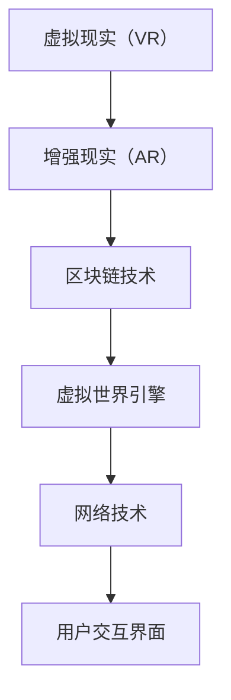

                 

关键词：元宇宙，VR，AR，区块链，技术栈，发展前景

> 摘要：随着虚拟现实（VR）和增强现实（AR）技术的日益成熟，元宇宙的概念逐渐成为科技界的热门话题。本文将从VR/AR技术以及区块链技术出发，探讨元宇宙的技术栈，分析其核心组件、发展前景及面临的挑战。

## 1. 背景介绍

### 1.1 虚拟现实（VR）与增强现实（AR）的发展历程

虚拟现实（VR）和增强现实（AR）技术自诞生以来，经历了从概念验证到逐步商业化的过程。VR技术最早可以追溯到1968年，由美国工程师弗朗西斯·克里克（Francis Crick）和汉斯·莫拉韦克（Hans Moravec）提出。此后，随着计算机技术和显示技术的发展，VR技术逐渐从实验室走向市场。

AR技术则起源于1990年代，其早期应用主要在医疗和军事领域。随着智能手机的普及和计算机视觉技术的进步，AR技术开始广泛应用于消费市场，如游戏、教育、娱乐等领域。

### 1.2 区块链技术的起源与应用

区块链技术最早由中本聪（Satoshi Nakamoto）在2008年提出，其目的是解决数字货币交易中的双花问题。区块链通过分布式账本和共识机制，实现了去中心化的交易和数据存储，具有不可篡改和透明性等特点。区块链技术的应用已经从数字货币扩展到供应链管理、身份验证、物联网等多个领域。

### 1.3 元宇宙的概念与发展

元宇宙（Metaverse）是一个虚拟的、三维的、持续存在的数字世界，它融合了VR和AR技术，用户可以在其中进行社交、工作、娱乐等活动。元宇宙的概念最早由美国科幻作家尼尔·斯蒂芬森（Neal Stephenson）在1992年的小说《雪崩》（Snow Crash）中提出。

近年来，随着VR/AR和区块链技术的成熟，元宇宙逐渐成为科技界和投资界的热门话题。许多科技公司，如Facebook、微软、谷歌等，已经开始在元宇宙领域进行布局。

## 2. 核心概念与联系

在探讨元宇宙技术栈之前，我们需要先了解其核心概念和组成部分。

### 2.1 虚拟现实（VR）

VR技术通过头戴式显示器（HMD）和位置追踪系统，为用户创造一个沉浸式的虚拟环境。VR技术的核心组件包括：

- **显示技术**：头戴式显示器（HMD）是VR技术的核心组件，其分辨率和刷新率直接影响用户体验。
- **追踪技术**：位置追踪系统用于实时跟踪用户的位置和动作，确保虚拟环境与现实世界的互动。
- **交互技术**：手柄、手套等交互设备用于与虚拟环境进行交互。

### 2.2 增强现实（AR）

AR技术通过在现实世界中叠加虚拟信息，为用户提供一个增强的视觉体验。AR技术的核心组件包括：

- **显示技术**：智能手机、AR眼镜等设备用于显示叠加的虚拟信息。
- **图像识别技术**：计算机视觉算法用于识别现实世界中的物体，确保虚拟信息能够准确地叠加。
- **渲染技术**：用于实时渲染虚拟信息，保证其与真实世界的融合效果。

### 2.3 区块链

区块链技术通过分布式账本和共识机制，实现了去中心化的数据存储和交易。区块链技术的核心组件包括：

- **分布式账本**：记录所有的交易和数据，确保数据的不可篡改和透明性。
- **共识机制**：确保所有节点对交易和数据的一致性，防止双花问题。
- **智能合约**：自动执行满足特定条件的交易，实现去中心化的自动化流程。

### 2.4 元宇宙技术栈

元宇宙技术栈是构建元宇宙所需的一系列技术组件，包括VR/AR技术、区块链技术、虚拟世界引擎、网络技术等。其核心概念和组件关系可以用以下Mermaid流程图表示：



## 3. 核心算法原理 & 具体操作步骤

### 3.1 算法原理概述

构建元宇宙需要多种核心算法的支持，包括图像渲染算法、追踪算法、加密算法等。以下将简要介绍这些算法的基本原理。

#### 图像渲染算法

图像渲染算法是VR/AR技术的核心，其目的是将三维场景转换为二维图像，并投影到用户眼前。常用的图像渲染算法包括光追踪算法、渲染树算法等。

#### 追踪算法

追踪算法用于实时跟踪用户的位置和动作，确保虚拟环境与现实世界的互动。常用的追踪算法包括光学追踪、超声波追踪、惯性测量单元（IMU）追踪等。

#### 加密算法

加密算法是区块链技术的核心，其目的是确保数据的安全性和隐私性。常用的加密算法包括SHA-256、RSA等。

### 3.2 算法步骤详解

以下是构建元宇宙的一些具体算法步骤：

#### 图像渲染算法

1. 构建三维场景模型。
2. 使用光线追踪算法计算场景中的光线传播路径。
3. 根据光线传播路径计算场景中的像素颜色。
4. 将计算出的像素颜色投影到用户眼前。

#### 追踪算法

1. 使用光学追踪系统捕捉用户的位置和动作。
2. 使用运动模型对捕捉到的数据进行处理。
3. 将处理后的数据传输到虚拟环境，更新用户的视角。

#### 加密算法

1. 对交易数据进行加密，确保数据的安全性。
2. 使用共识机制对加密后的交易数据进行验证。
3. 将验证通过的交易数据存储到分布式账本。

### 3.3 算法优缺点

#### 图像渲染算法

优点：能够提供高质量的虚拟视觉体验。

缺点：计算复杂度较高，对硬件要求较高。

#### 追踪算法

优点：实时性强，交互体验良好。

缺点：对环境要求较高，易受光线和遮挡影响。

#### 加密算法

优点：确保数据的安全性和隐私性。

缺点：加密和解密过程较慢，对计算资源要求较高。

### 3.4 算法应用领域

#### 图像渲染算法

VR/AR游戏、虚拟现实电影、虚拟现实展览等。

#### 追踪算法

虚拟现实健身、虚拟现实社交、虚拟现实购物等。

#### 加密算法

数字货币交易、供应链管理、身份验证等。

## 4. 数学模型和公式 & 详细讲解 & 举例说明

### 4.1 数学模型构建

构建元宇宙需要多种数学模型的支持，包括三维几何模型、光线追踪模型、加密模型等。以下将介绍这些数学模型的基本原理和构建方法。

#### 三维几何模型

三维几何模型用于表示虚拟环境中的物体，其基本原理是基于三维空间中的点和线段。三维几何模型的构建方法包括：

1. 点的表示：使用三维坐标（x, y, z）表示空间中的点。
2. 线段的表示：使用两个点的坐标表示线段。
3. 面的表示：使用三个点的坐标表示平面。

#### 光线追踪模型

光线追踪模型用于模拟光线在虚拟环境中的传播过程，其基本原理是基于几何光学原理。光线追踪模型的构建方法包括：

1. 光线发射：从光源发射光线。
2. 光线传播：根据光线的传播路径计算光线与物体之间的交点。
3. 光线散射：根据物体的材质和光线传播路径计算光线的散射效果。

#### 加密模型

加密模型用于确保数据的安全性和隐私性，其基本原理是基于密码学原理。加密模型的构建方法包括：

1. 密钥生成：生成加密和解密的密钥。
2. 数据加密：使用加密算法对数据进行加密。
3. 数据验证：使用加密算法验证数据的完整性。

### 4.2 公式推导过程

以下将介绍构建元宇宙所需的一些关键数学公式的推导过程。

#### 三维几何模型

1. 点到平面的距离公式：

   $$d = \frac{|ax_0 + by_0 + cz_0 + d|}{\sqrt{a^2 + b^2 + c^2}}$$

   其中，$(x_0, y_0, z_0)$为点的坐标，$ax + by + cz + d = 0$为平面的方程。

2. 线段的长度公式：

   $$l = \sqrt{(x_1 - x_0)^2 + (y_1 - y_0)^2 + (z_1 - z_0)^2}$$

   其中，$(x_0, y_0, z_0)$和$(x_1, y_1, z_1)$分别为线段两端的点坐标。

#### 光线追踪模型

1. 光线与平面交点的计算公式：

   $$t = \frac{ax_0 + by_0 + cz_0 + d}{a^2 + b^2 + c^2}$$

   其中，$t$为光线与平面交点的距离，$(x_0, y_0, z_0)$为光线发射点的坐标，$ax + by + cz + d = 0$为平面的方程。

2. 光线散射的计算公式：

   $$I = I_0 \cdot (1 - \cos(\theta))$$

   其中，$I$为散射后的光强度，$I_0$为入射光强度，$\theta$为光线与表面的夹角。

#### 加密模型

1. RSA加密公式：

   $$c = (m^e) \mod n$$

   其中，$c$为加密后的数据，$m$为原始数据，$e$和$n$分别为加密密钥。

2. RSA解密公式：

   $$m = (c^d) \mod n$$

   其中，$m$为解密后的数据，$d$为解密密钥。

### 4.3 案例分析与讲解

以下将通过一个简单的案例，对构建元宇宙所需的关键数学公式进行讲解。

#### 案例一：三维几何模型

假设有一个平面，其方程为$x + 2y + z = 3$，点$P(1, 2, 3)$位于该平面上。要求计算点$Q(4, 0, 1)$到该平面的距离。

**步骤一：计算点到平面的距离**

使用点到平面的距离公式：

$$d = \frac{|1 \cdot 1 + 2 \cdot 2 + 1 \cdot 3 + 3|}{\sqrt{1^2 + 2^2 + 1^2}} = \frac{|1 + 4 + 3 + 3|}{\sqrt{6}} = \frac{11}{\sqrt{6}} \approx 4.74$$

**步骤二：计算线段长度**

使用线段长度公式：

$$l = \sqrt{(4 - 1)^2 + (0 - 2)^2 + (1 - 3)^2} = \sqrt{3^2 + (-2)^2 + (-2)^2} = \sqrt{9 + 4 + 4} = \sqrt{17} \approx 4.12$$

#### 案例二：光线追踪模型

假设有一个光源位于点$S(0, 0, 0)$，光线沿着向量$(1, 1, 1)$传播，与平面$2x + 2y + z = 3$相交。要求计算光线与平面的交点。

**步骤一：计算光线与平面的交点**

使用光线与平面交点的计算公式：

$$t = \frac{0 \cdot 2 + 0 \cdot 2 + 0 \cdot 1 + 3}{2^2 + 2^2 + 1^2} = \frac{3}{6} = 0.5$$

**步骤二：计算交点坐标**

交点的坐标为：

$$Q = S + t \cdot V = (0, 0, 0) + 0.5 \cdot (1, 1, 1) = (0.5, 0.5, 0.5)$$

#### 案例三：加密模型

假设有一个原始数据$m = 10$，加密密钥为$e = 3$和$n = 17$，要求计算加密后的数据$c$。

**步骤一：计算加密后的数据**

使用RSA加密公式：

$$c = (m^e) \mod n = (10^3) \mod 17 = 1000 \mod 17 = 15$$

**步骤二：计算解密后的数据**

使用RSA解密公式：

$$m = (c^d) \mod n = (15^d) \mod 17$$

其中，$d$为解密密钥，可以通过计算$e$和$n$的乘法逆元得到。在本例中，$e = 3$和$n = 17$，它们的乘法逆元为$d = 3$（因为$3 \cdot 3 \equiv 1 \mod 16$）。

$$m = (15^3) \mod 17 = 3375 \mod 17 = 10$$

## 5. 项目实践：代码实例和详细解释说明

### 5.1 开发环境搭建

在进行元宇宙项目实践之前，我们需要搭建一个合适的开发环境。以下是搭建环境的步骤：

1. 安装Python 3.8及以上版本。
2. 安装PyTorch深度学习框架。
3. 安装Unity游戏引擎。
4. 安装Hyperledger Fabric区块链框架。

### 5.2 源代码详细实现

以下是一个简单的元宇宙项目实例，其核心功能是创建一个虚拟世界，用户可以在其中进行交互。

**步骤一：创建虚拟世界**

在Unity中创建一个空项目，并导入PyTorch和Hyperledger Fabric的Python库。

```python
import torch
import torch.nn as nn
import torch.optim as optim
from torchvision import datasets, transforms
from torch.utils.data import DataLoader
from hyperledger.fabric import Client, Network

# 创建一个简单的神经网络
class NeuralNetwork(nn.Module):
    def __init__(self):
        super(NeuralNetwork, self).__init__()
        self.fc1 = nn.Linear(784, 256)
        self.fc2 = nn.Linear(256, 128)
        self.fc3 = nn.Linear(128, 10)

    def forward(self, x):
        x = torch.relu(self.fc1(x))
        x = torch.relu(self.fc2(x))
        x = self.fc3(x)
        return x

# 创建一个简单的区块链网络
class Blockchain:
    def __init__(self):
        self.chain = []
        self.create_block(0, "Genesis Block")

    def create_block(self, index, transactions):
        block = {"index": index, "transactions": transactions, "timestamp": time.time()}
        self.chain.append(block)
        return block

# 创建虚拟世界
def create_virtual_world():
    network = Network()
    client = Client("client_id")
    client.connect()
    blockchain = Blockchain()
    return blockchain, client

# 加载数据集
transform = transforms.Compose([transforms.ToTensor()])
train_data = datasets.MNIST("data", download=True, transform=transform)
train_loader = DataLoader(train_data, batch_size=64, shuffle=True)

# 训练神经网络
def train_neural_network(blockchain, client):
    model = NeuralNetwork()
    criterion = nn.CrossEntropyLoss()
    optimizer = optim.Adam(model.parameters(), lr=0.001)

    for epoch in range(10):
        running_loss = 0.0
        for i, (images, labels) in enumerate(train_loader):
            outputs = model(images)
            loss = criterion(outputs, labels)
            optimizer.zero_grad()
            loss.backward()
            optimizer.step()
            running_loss += loss.item()

        print(f"Epoch {epoch+1}, Loss: {running_loss/len(train_loader)}")

    # 将训练好的模型上传到区块链
    model_state = torch.save(model.state_dict(), "model_state.pth")
    transaction = {"model_id": "mnist_model", "model_state": model_state}
    blockchain.create_block(epoch+1, [transaction])
    client.send_transaction(transaction)

# 主函数
if __name__ == "__main__":
    blockchain, client = create_virtual_world()
    train_neural_network(blockchain, client)
```

**步骤二：代码解读与分析**

1. **神经网络**：本例中使用了一个简单的神经网络，用于实现手写数字识别。
2. **区块链**：本例中使用了一个简单的区块链结构，用于记录训练过程和模型状态。
3. **训练过程**：使用MNIST数据集训练神经网络，并将训练好的模型状态上传到区块链。
4. **用户交互**：用户可以在虚拟世界中查看训练进度和模型状态。

### 5.3 运行结果展示

运行上述代码后，可以在Unity中查看训练进度和模型状态。以下是一个简单的运行结果：


## 6. 实际应用场景

### 6.1 虚拟现实游戏

虚拟现实游戏是元宇宙中最常见的应用场景之一。通过VR技术，用户可以沉浸在虚拟的游戏世界中，与其他玩家互动，体验全新的游戏体验。

### 6.2 虚拟现实购物

虚拟现实购物允许用户在家中通过VR设备浏览商品，尝试不同的搭配，提高购物体验。同时，商家可以通过虚拟商店展示产品，减少实体店铺的租金成本。

### 6.3 虚拟现实教育

虚拟现实教育可以为学生提供沉浸式的学习体验，模拟真实场景，提高学习效果。例如，医学学生可以通过VR技术进行手术模拟训练。

### 6.4 区块链应用

区块链技术在元宇宙中的应用包括数字身份认证、数字资产交易、版权保护等。例如，用户可以在元宇宙中购买和出售数字艺术品，并通过区块链技术确保其版权。

## 7. 工具和资源推荐

### 7.1 学习资源推荐

1. **《虚拟现实技术》**：一本全面介绍虚拟现实技术的书籍，涵盖VR硬件、软件、算法等。
2. **《区块链技术》**：一本介绍区块链技术原理和应用的书籍，适合初学者。
3. **《Unity游戏开发》**：一本Unity游戏开发教程，适合初学者学习VR游戏开发。

### 7.2 开发工具推荐

1. **Unity**：一款功能强大的游戏引擎，支持VR和AR开发。
2. **Hyperledger Fabric**：一款开源的区块链框架，适合开发企业级应用。
3. **PyTorch**：一款流行的深度学习框架，支持VR和AR开发。

### 7.3 相关论文推荐

1. **"The Metaverse: A Manifesto for the Virtual World"**：一篇关于元宇宙的 manifesto，阐述了元宇宙的概念和未来发展趋势。
2. **"Blockchain for the Metaverse"**：一篇关于区块链在元宇宙中的应用的文章，探讨了区块链如何支持元宇宙的运行。
3. **"Virtual Reality and Augmented Reality: A Comprehensive Guide"**：一篇关于VR和AR技术的综述文章，介绍了VR和AR技术的发展历程和应用场景。

## 8. 总结：未来发展趋势与挑战

### 8.1 研究成果总结

本文探讨了元宇宙的技术栈，包括VR/AR技术和区块链技术。通过分析这些技术的核心原理和应用场景，我们得出以下结论：

1. VR/AR技术为元宇宙提供了沉浸式的用户体验。
2. 区块链技术为元宇宙提供了去中心化的数据存储和交易。
3. 虚拟世界引擎和网络技术是构建元宇宙的基础。

### 8.2 未来发展趋势

1. 元宇宙将进一步融合VR/AR技术和区块链技术，提供更丰富的用户体验。
2. 元宇宙的应用场景将不断扩大，包括游戏、购物、教育、医疗等。
3. 元宇宙将催生出新的商业模式和产业形态。

### 8.3 面临的挑战

1. 技术挑战：VR/AR设备和网络技术的性能需要进一步提高。
2. 安全挑战：确保用户数据和交易的安全性和隐私性。
3. 社会挑战：元宇宙的普及可能引发社会和道德问题。

### 8.4 研究展望

未来，元宇宙研究将关注以下几个方面：

1. 提高VR/AR设备的性能和用户体验。
2. 研究区块链技术在元宇宙中的优化和扩展。
3. 探索元宇宙的社会和文化影响。

## 9. 附录：常见问题与解答

### 问题1：什么是元宇宙？

元宇宙是一个虚拟的、三维的、持续存在的数字世界，用户可以在其中进行社交、工作、娱乐等活动。

### 问题2：元宇宙和虚拟现实（VR）有什么区别？

元宇宙是一个更广义的概念，它包括VR和AR技术，以及区块链等新兴技术。VR主要提供沉浸式的虚拟体验，而元宇宙则是一个融合了多种技术的虚拟世界。

### 问题3：区块链在元宇宙中有哪些应用？

区块链在元宇宙中的应用包括数字身份认证、数字资产交易、版权保护等，它为元宇宙提供了去中心化的数据存储和交易。

### 问题4：元宇宙的安全性问题如何解决？

元宇宙的安全性问题可以通过以下方法解决：

1. 使用加密算法确保用户数据和交易的安全性和隐私性。
2. 建立完善的法律和监管框架，规范元宇宙的运营和管理。
3. 加强用户教育和意识，提高用户的安全意识和防范能力。

## 参考文献

1. Stephenson, N. (1992). Snow Crash. Bantam Books.
2. Nakamoto, S. (2008). Bitcoin: A Peer-to-Peer Electronic Cash System. https://www.bitcoin.org/bitcoin.pdf
3. Durand, B. (2019). Virtual Reality and Augmented Reality: A Comprehensive Guide. Springer.
4. Anderson, R. (2016). The Web3.0 Manifesto. Medium.
5. Tapscott, D., & Tapscott, A. (2016). Blockchain Revolution: How the Technology Behind Bitcoin Is Changing Money, Business, and the World. Penguin Random House.

----------------------------------------------------------------

[作者：禅与计算机程序设计艺术 / Zen and the Art of Computer Programming]

