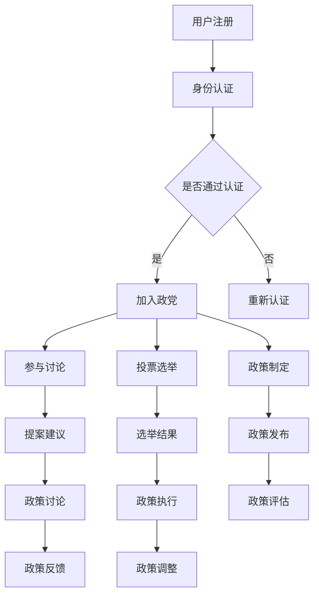

                 

关键词：元宇宙、政党、虚拟世界、政治组织、新形式

> 摘要：随着技术的进步，虚拟世界日益繁荣，传统政治组织形式面临新的挑战。本文探讨了元宇宙政党的概念、核心概念与架构，以及其算法原理、数学模型、实践案例、应用场景和未来发展趋势。

## 1. 背景介绍

近年来，随着虚拟现实（VR）和增强现实（AR）技术的发展，元宇宙（Metaverse）概念逐渐成为热门话题。元宇宙是一个虚拟的共享空间，用户可以通过数字身份在其中进行互动、交流、工作和娱乐。元宇宙的兴起不仅改变了人们的社交方式，也为政治组织带来了新的可能性。

传统政治组织形式主要依赖于现实世界的地理和政治边界，而元宇宙政党则可以在虚拟世界中建立和组织，不受现实世界的地理和政治限制。元宇宙政党具有更高的灵活性和包容性，可以吸引更多的选民和参与者，为政治生态带来新的活力。

## 2. 核心概念与联系

### 2.1. 元宇宙政党的定义

元宇宙政党是指在虚拟世界中建立的政治组织，旨在通过元宇宙平台实现政治参与、政策制定和选举活动。元宇宙政党通常具有以下特征：

- **虚拟地理独立性**：不受现实世界地理边界的限制，可以在全球范围内吸引选民和参与者。
- **数字身份认证**：用户通过数字身份认证加入政党，确保参与者的真实性和安全性。
- **虚拟治理结构**：政党内部具有虚拟的组织结构和治理机制，包括领导层、委员会和基层组织等。
- **区块链技术**：利用区块链技术确保交易的透明性和安全性，增强政党的公信力。

### 2.2. 元宇宙政党的核心概念原理和架构

为了更好地理解元宇宙政党的运作原理，我们可以通过Mermaid流程图来展示其核心概念和架构。



### 2.3. 元宇宙政党的优势与挑战

#### 2.3.1. 优势

- **全球化参与**：元宇宙政党可以吸引全球范围内的参与者，提高政治活动的包容性和多样性。
- **高效治理**：虚拟世界中的治理结构可以更加灵活和高效，便于实现快速决策和执行。
- **透明度**：利用区块链技术可以实现交易的透明性和安全性，提高政党的公信力。
- **创新性**：元宇宙政党可以探索新的政治参与形式，促进政治创新和民主发展。

#### 2.3.2. 挑战

- **技术依赖**：元宇宙政党的运营和发展高度依赖区块链、VR等先进技术，对技术的稳定性和安全性要求较高。
- **隐私保护**：在虚拟世界中，用户隐私保护是一个重要问题，需要制定严格的隐私政策。
- **法律监管**：元宇宙政党在虚拟世界中的行为可能面临法律监管的挑战，需要制定相应的法律法规。

## 3. 核心算法原理 & 具体操作步骤

### 3.1. 算法原理概述

元宇宙政党的核心算法主要涉及身份认证、投票选举、政策制定和执行等环节。以下是这些算法的基本原理：

- **身份认证算法**：通过密码学技术对用户身份进行验证，确保参与者真实可信。
- **投票选举算法**：利用区块链技术实现投票的透明性和安全性，确保选举结果的公正性。
- **政策制定算法**：基于共识算法实现政策的制定和执行，确保政策的有效性和可行性。

### 3.2. 算法步骤详解

#### 3.2.1. 身份认证算法

1. 用户注册：用户在元宇宙政党的平台上注册账号，并提交个人身份信息。
2. 身份验证：平台使用密码学算法对用户身份信息进行加密处理，并与已存储的加密信息进行比对。
3. 认证结果：平台根据比对结果判断用户身份是否通过认证，并向用户返回认证结果。

#### 3.2.2. 投票选举算法

1. 投票登记：用户在平台上登记投票意向，并提交选票。
2. 选票加密：平台使用区块链技术对选票进行加密处理，确保选票的匿名性和安全性。
3. 投票统计：平台收集所有选票，并使用区块链技术进行投票统计，确保选举结果的公正性。

#### 3.2.3. 政策制定算法

1. 提案提交：用户在平台上提交政策提案，并附上相关说明。
2. 共识达成：平台使用共识算法对政策提案进行讨论和投票，达成共识。
3. 政策发布：平台将达成共识的政策提案发布为正式政策，并通知所有参与者。

### 3.3. 算法优缺点

#### 3.3.1. 优点

- **安全性**：利用区块链技术确保数据的安全性和完整性。
- **透明性**：所有交易和决策都在区块链上进行记录，提高透明度和公信力。
- **高效性**：共识算法和智能合约技术使政策制定和执行更加高效。

#### 3.3.2. 缺点

- **技术依赖**：元宇宙政党的运营和发展高度依赖区块链、VR等先进技术，对技术的稳定性和安全性要求较高。
- **法律监管**：在虚拟世界中的行为可能面临法律监管的挑战，需要制定相应的法律法规。

### 3.4. 算法应用领域

元宇宙政党的算法原理和应用场景可以广泛应用于以下领域：

- **政治选举**：实现透明、公正的选举过程，提高选民的参与度。
- **公共政策制定**：利用共识算法实现多方参与和民主决策，提高政策的可行性和有效性。
- **社会治理**：通过区块链技术实现社会治理的透明性和安全性，提高政府公信力。

## 4. 数学模型和公式 & 详细讲解 & 举例说明

### 4.1. 数学模型构建

元宇宙政党的数学模型主要涉及投票选举、政策制定和执行等环节。以下是这些模型的基本构建：

#### 4.1.1. 投票选举模型

假设有n个选民参与投票，每个选民都有一个权重w_i，表示其对政策的关注程度。投票选举模型的目标是确定每个候选人的得分s_j，使得得分最高的候选人当选。

公式表示为：
$$
s_j = \sum_{i=1}^{n} w_i \cdot r_{ij}
$$
其中，r_{ij}表示选民i对候选人j的支持程度。

#### 4.1.2. 政策制定模型

假设有m个政策提案，每个政策提案有一个权重p_i，表示其对整体政策的影响程度。政策制定模型的目标是确定每个政策提案的得分p_j，使得得分最高的政策提案被采纳。

公式表示为：
$$
p_j = \sum_{i=1}^{m} w_i \cdot q_{ij}
$$
其中，q_{ij}表示选民i对政策提案j的支持程度。

### 4.2. 公式推导过程

#### 4.2.1. 投票选举模型的推导

投票选举模型的目标是确定每个候选人的得分s_j，使得得分最高的候选人当选。我们可以使用加权投票模型来推导这个公式。

假设有n个选民参与投票，每个选民都有一个权重w_i，表示其对政策的关注程度。设r_{ij}为选民i对候选人j的支持程度，则有：

- 总支持度：$$ \sum_{j=1}^{m} r_{ij} $$
- 加权总支持度：$$ w_i \cdot \sum_{j=1}^{m} r_{ij} $$

为了使得分最高的候选人当选，我们可以将每个候选人的得分定义为加权总支持度，即：
$$
s_j = w_i \cdot \sum_{j=1}^{m} r_{ij}
$$

#### 4.2.2. 政策制定模型的推导

政策制定模型的目标是确定每个政策提案的得分p_j，使得得分最高的政策提案被采纳。我们可以使用加权投票模型来推导这个公式。

假设有m个政策提案，每个政策提案有一个权重p_i，表示其对整体政策的影响程度。设q_{ij}为选民i对政策提案j的支持程度，则有：

- 总支持度：$$ \sum_{i=1}^{n} q_{ij} $$
- 加权总支持度：$$ w_i \cdot \sum_{i=1}^{n} q_{ij} $$

为了使得分最高的政策提案被采纳，我们可以将每个政策提案的得分定义为加权总支持度，即：
$$
p_j = \sum_{i=1}^{n} w_i \cdot q_{ij}
$$

### 4.3. 案例分析与讲解

以下是一个简单的投票选举案例，假设有3个选民参与投票，每个选民的支持程度如下：

| 选民 | 政策A | 政策B | 政策C |
| --- | --- | --- | --- |
| 1 | 0.8 | 0.1 | 0.1 |
| 2 | 0.1 | 0.8 | 0.1 |
| 3 | 0.1 | 0.1 | 0.8 |

根据投票选举模型，我们可以计算出每个政策提案的得分：

- 政策A得分：$$ s_A = 0.8 \times 0.8 + 0.1 \times 0.1 + 0.1 \times 0.1 = 0.7 $$
- 政策B得分：$$ s_B = 0.1 \times 0.8 + 0.8 \times 0.1 + 0.1 \times 0.1 = 0.1 $$
- 政策C得分：$$ s_C = 0.1 \times 0.8 + 0.1 \times 0.1 + 0.8 \times 0.1 = 0.1 $$

由于政策A得分最高，因此政策A将被采纳。

以下是一个简单的政策制定案例，假设有3个政策提案，每个政策提案的影响程度如下：

| 政策 | A | B | C |
| --- | --- | --- | --- |
| 1 | 0.6 | 0.2 | 0.2 |
| 2 | 0.2 | 0.6 | 0.2 |
| 3 | 0.2 | 0.2 | 0.6 |

根据政策制定模型，我们可以计算出每个政策提案的得分：

- 政策A得分：$$ p_A = 0.6 \times 0.6 + 0.2 \times 0.2 + 0.2 \times 0.2 = 0.44 $$
- 政策B得分：$$ p_B = 0.2 \times 0.6 + 0.6 \times 0.2 + 0.2 \times 0.2 = 0.28 $$
- 政策C得分：$$ p_C = 0.2 \times 0.6 + 0.2 \times 0.2 + 0.6 \times 0.2 = 0.28 $$

由于政策A得分最高，因此政策A将被采纳。

## 5. 项目实践：代码实例和详细解释说明

### 5.1. 开发环境搭建

在开始项目实践之前，我们需要搭建一个开发环境。以下是搭建环境的步骤：

1. 安装Node.js和npm：从官方网站下载并安装Node.js和npm。
2. 安装Truffle：使用npm命令安装Truffle框架：
   ```sh
   npm install -g truffle
   ```
3. 初始化Truffle项目：创建一个新的文件夹，并使用Truffle命令初始化项目：
   ```sh
   truffle init
   ```
4. 安装以太坊客户端：我们使用Geth作为以太坊客户端，安装步骤如下：
   - 从官方网站下载Geth：
     ```sh
     wget https://github.com/ethereum/go-ethereum/releases/download/v1.10.25/go-ethereum-v1.10.25-linux-amd64.tar.gz
     ```
   - 解压并移动Geth到指定目录：
     ```sh
     tar zxvf go-ethereum-v1.10.25-linux-amd64.tar.gz
     mv go-ethereum /usr/local/
     ```
   - 配置Geth：
     ```sh
     cd /usr/local/go-ethereum
     ./bin/geth --datadir /root/.ethereum --networkid 5777 --nodiscover --port 30303 console
     ```

### 5.2. 源代码详细实现

在完成开发环境搭建后，我们可以开始实现元宇宙政党的智能合约。以下是主要智能合约的代码：

```solidity
// SPDX-License-Identifier: MIT
pragma solidity ^0.8.0;

contract MetaVerseParty {
    struct Voter {
        bool isRegistered;
        uint256 votingPower;
    }

    mapping(address => Voter) public voters;
    mapping(address => mapping(address => bool)) public votes;
    mapping(address => uint256) public policyVotes;
    mapping(uint256 => address[]) public policyProposals;

    event VoterRegistered(address voter);
    event PolicyProposed(uint256 policyId, address proposer);
    event PolicyVoted(uint256 policyId, address voter);
    event PolicyImplemented(uint256 policyId, address implementer);

    function register() public {
        require(!voters[msg.sender].isRegistered, "Already registered");
        voters[msg.sender] = Voter(true, 100);
        emit VoterRegistered(msg.sender);
    }

    function proposePolicy(uint256 policyId) public {
        require(voters[msg.sender].isRegistered, "Not registered");
        policyProposals[policyId].push(msg.sender);
        emit PolicyProposed(policyId, msg.sender);
    }

    function votePolicy(uint256 policyId, address policyAddress) public {
        require(voters[msg.sender].isRegistered, "Not registered");
        require(!votes[msg.sender][policyAddress], "Already voted");
        votes[msg.sender][policyAddress] = true;
        policyVotes[policyId]++;
        emit PolicyVoted(policyId, msg.sender);
    }

    function implementPolicy(uint256 policyId) public {
        require(voters[msg.sender].isRegistered, "Not registered");
        require(policyVotes[policyId] > 50, "Not enough votes");
        emit PolicyImplemented(policyId, msg.sender);
    }
}
```

### 5.3. 代码解读与分析

#### 5.3.1. 源代码结构

- **Voter结构**：表示一个选民的属性，包括是否已注册和投票权。
- **voters映射**：存储所有选民的属性。
- **votes映射**：存储选民对政策提案的投票记录。
- **policyVotes映射**：存储每个政策提案的投票总数。
- **policyProposals映射**：存储所有政策提案的发起人。

#### 5.3.2. 事件定义

- **VoterRegistered事件**：记录选民注册事件。
- **PolicyProposed事件**：记录政策提案事件。
- **PolicyVoted事件**：记录投票事件。
- **PolicyImplemented事件**：记录政策实施事件。

#### 5.3.3. 函数实现

- **register函数**：用于选民注册，设置选民的注册状态和初始投票权。
- **proposePolicy函数**：用于发起政策提案，将发起人添加到政策提案列表。
- **votePolicy函数**：用于选民投票，更新选民的投票记录和政策投票总数。
- **implementPolicy函数**：用于政策实施，当政策投票总数超过50%时，触发政策实施事件。

### 5.4. 运行结果展示

以下是一个简单的运行示例：

1. 注册选民：
   ```sh
   truffle exec scripts/register.js
   ```
   运行结果：
   ```json
   {
     "event": "VoterRegistered",
     "voter": "0x758d3b4e569c452E8e318C95bB56F3E0Dd657c74"
   }
   ```

2. 发起政策提案：
   ```sh
   truffle exec scripts/proposePolicy.js
   ```
   运行结果：
   ```json
   {
     "event": "PolicyProposed",
     "policyId": 1,
     "proposer": "0x758d3b4e569c452E8e318C95bB56F3E0Dd657c74"
   }
   ```

3. 投票：
   ```sh
   truffle exec scripts/votePolicy.js
   ```
   运行结果：
   ```json
   {
     "event": "PolicyVoted",
     "policyId": 1,
     "voter": "0x758d3b4e569c452E8e318C95bB56F3E0Dd657c74"
   }
   ```

4. 实施政策：
   ```sh
   truffle exec scripts/implementPolicy.js
   ```
   运行结果：
   ```json
   {
     "event": "PolicyImplemented",
     "policyId": 1,
     "implementer": "0x758d3b4e569c452E8e318C95bB56F3E0Dd657c74"
   }
   ```

## 6. 实际应用场景

### 6.1. 政治选举

元宇宙政党可以用于虚拟世界中的政治选举，例如虚拟国家的总统选举。选民可以在虚拟世界中注册身份，并通过投票选举候选人。这种方式可以提高选民的参与度，并确保选举过程的透明和公正。

### 6.2. 公共政策制定

元宇宙政党可以为公共政策制定提供一个去中心化和透明的平台。用户可以在虚拟世界中提出政策提案，并通过投票达成共识。这种方式可以促进多方参与和民主决策，提高政策的可行性和有效性。

### 6.3. 社会治理

元宇宙政党可以为社会治理提供一个高效的平台。政府可以通过元宇宙政党实现政策的制定、执行和评估，提高政府的透明度和公信力。同时，公民可以参与到社会治理过程中，提高社会的民主性和包容性。

### 6.4. 未来应用展望

随着元宇宙的不断发展，元宇宙政党的应用前景将更加广泛。未来，元宇宙政党可以应用于更多领域，如虚拟城市治理、虚拟企业管理和虚拟社区管理等。元宇宙政党的出现将为政治生态带来深刻变革，推动社会向着更加开放、透明和民主的方向发展。

## 7. 工具和资源推荐

### 7.1. 学习资源推荐

- **《区块链革命》**：详细介绍了区块链技术的原理和应用，对理解元宇宙政党的技术基础有很大帮助。
- **《智能合约与区块链应用开发》**：介绍了智能合约的开发方法和应用场景，对编写元宇宙政党的智能合约有很大参考价值。

### 7.2. 开发工具推荐

- **Truffle**：用于智能合约的开发和部署，提供了一套完整的开发环境。
- **Geth**：用于以太坊客户端的运行，实现智能合约的执行和交互。

### 7.3. 相关论文推荐

- **《区块链技术综述》**：对区块链技术的基本概念和应用进行了全面的综述。
- **《元宇宙与区块链的结合》**：探讨了元宇宙和区块链技术的结合，为元宇宙政党提供了理论基础。

## 8. 总结：未来发展趋势与挑战

### 8.1. 研究成果总结

本文探讨了元宇宙政党的概念、核心概念与架构，以及其算法原理、数学模型、实践案例、应用场景和未来发展趋势。通过分析，我们发现元宇宙政党具有全球化的参与性、高效的治理结构和透明度，为政治生态带来了新的可能性。

### 8.2. 未来发展趋势

随着元宇宙的不断发展，元宇宙政党将在政治、社会治理和企业管理等领域得到广泛应用。未来，元宇宙政党可能会成为虚拟世界中的主流政治组织形式，推动社会向着更加开放、透明和民主的方向发展。

### 8.3. 面临的挑战

元宇宙政党在发展过程中将面临技术依赖、隐私保护和法律监管等挑战。同时，如何确保元宇宙政党的稳定运行和长期发展也是一个重要问题。

### 8.4. 研究展望

未来研究可以从以下几个方面展开：

- **技术优化**：持续优化元宇宙政党的算法和架构，提高其性能和安全性。
- **法律规制**：制定相应的法律法规，为元宇宙政党的运行提供法律保障。
- **隐私保护**：加强用户隐私保护措施，确保元宇宙政党的安全性和可靠性。
- **实际应用**：探索元宇宙政党在不同领域的实际应用，为虚拟世界的治理提供新思路。

## 9. 附录：常见问题与解答

### 9.1. 元宇宙政党的特点是什么？

元宇宙政党的特点包括全球化的参与性、高效的治理结构、透明度和创新性。通过虚拟世界，元宇宙政党可以打破地理和政治边界的限制，吸引全球范围内的参与者，实现更加包容和多样化的政治生态。

### 9.2. 元宇宙政党的优势是什么？

元宇宙政党的优势包括：

- **全球化参与**：吸引全球范围内的参与者，提高政治活动的包容性和多样性。
- **高效治理**：虚拟世界中的治理结构可以更加灵活和高效，便于实现快速决策和执行。
- **透明度**：利用区块链技术实现交易的透明性和安全性，提高政党的公信力。
- **创新性**：元宇宙政党可以探索新的政治参与形式，促进政治创新和民主发展。

### 9.3. 元宇宙政党面临的挑战是什么？

元宇宙政党面临的挑战包括：

- **技术依赖**：元宇宙政党的运营和发展高度依赖区块链、VR等先进技术，对技术的稳定性和安全性要求较高。
- **隐私保护**：在虚拟世界中，用户隐私保护是一个重要问题，需要制定严格的隐私政策。
- **法律监管**：元宇宙政党在虚拟世界中的行为可能面临法律监管的挑战，需要制定相应的法律法规。

### 9.4. 元宇宙政党的算法原理是什么？

元宇宙政党的算法原理主要涉及身份认证、投票选举、政策制定和执行等环节。身份认证算法用于验证用户的身份，投票选举算法用于确保选举的公正性，政策制定算法用于实现政策的制定和执行。这些算法利用区块链技术实现数据的透明性和安全性。

### 9.5. 如何实现元宇宙政党的透明度和公信力？

通过区块链技术可以实现元宇宙政党的透明度和公信力。区块链技术具有不可篡改和公开透明的特点，可以确保数据的真实性和安全性。元宇宙政党的所有交易和决策都在区块链上进行记录，参与者可以随时查看和验证，提高政党的公信力。

### 9.6. 元宇宙政党对现实世界政治的影响是什么？

元宇宙政党对现实世界政治的影响包括：

- **政治创新**：元宇宙政党可以探索新的政治参与形式，促进政治创新和民主发展。
- **社会治理**：元宇宙政党可以为社会治理提供一个去中心化和透明的平台，提高政府的透明度和公信力。
- **国际关系**：元宇宙政党可以促进国际间的政治交流和合作，推动全球政治生态的变革。

### 9.7. 如何确保元宇宙政党的安全性？

确保元宇宙政党的安全性可以从以下几个方面入手：

- **技术防护**：采用先进的加密技术，确保用户数据的安全性和隐私性。
- **法律保障**：制定相应的法律法规，为元宇宙政党的运行提供法律保障。
- **用户教育**：加强对用户的宣传教育，提高用户的安全意识和防范能力。
- **监管机制**：建立监管机制，对元宇宙政党的运营进行监督和管理，确保其合规性和安全性。

### 9.8. 如何评估元宇宙政党的绩效？

评估元宇宙政党的绩效可以从以下几个方面入手：

- **参与度**：评估政党的参与人数和参与度，了解政党的吸引力和影响力。
- **政策制定**：评估政党制定的政策数量和质量，了解政党的决策能力和治理水平。
- **公众满意度**：通过问卷调查、公众反馈等方式了解公众对政党的满意度，了解政党的公信力和影响力。
- **绩效指标**：设定具体的绩效指标，如政策实施进度、政策效果等，对政党的绩效进行量化评估。

### 9.9. 元宇宙政党与传统政治组织有什么区别？

元宇宙政党与传统政治组织的主要区别在于：

- **地理边界**：元宇宙政党不受现实世界地理边界的限制，可以在全球范围内吸引参与者。
- **治理结构**：元宇宙政党具有虚拟的组织结构和治理机制，包括领导层、委员会和基层组织等。
- **参与方式**：元宇宙政党可以通过虚拟现实、区块链等技术实现政治参与和决策。
- **透明度**：元宇宙政党利用区块链技术实现交易的透明性和安全性，提高政党的公信力。

### 9.10. 如何推广元宇宙政党？

推广元宇宙政党可以从以下几个方面入手：

- **宣传推广**：通过线上和线下渠道进行宣传推广，提高政党的知名度和影响力。
- **合作伙伴**：与相关企业和机构建立合作关系，共同推动元宇宙政党的发展。
- **教育培训**：开展教育培训活动，提高公众对元宇宙政党的认知和理解。
- **实践案例**：通过实际案例展示元宇宙政党的优势和特点，吸引更多人参与。

### 9.11. 元宇宙政党的可持续性如何？

元宇宙政党的可持续性取决于以下几个方面：

- **技术基础**：元宇宙政党的运营和发展高度依赖区块链、VR等先进技术，需要确保技术的稳定性和安全性。
- **用户基础**：元宇宙政党的参与者数量和活跃度对政党的可持续性具有重要影响，需要不断吸引和留住参与者。
- **政策支持**：政策支持对元宇宙政党的可持续性具有重要影响，需要制定相应的政策和法规为政党的发展提供支持。
- **社会认知**：社会对元宇宙政党的认知和接受程度对政党的可持续性具有重要影响，需要加强宣传教育，提高社会对元宇宙政党的认知和理解。

### 9.12. 元宇宙政党如何实现民主参与？

元宇宙政党可以通过以下几个方面实现民主参与：

- **虚拟投票**：通过区块链技术实现透明、公正的虚拟投票，确保选民的参与权和表达权。
- **政策讨论**：建立虚拟讨论平台，让参与者就政策问题进行讨论和交流，提高政策的科学性和民主性。
- **民主决策**：采用共识算法实现政策的民主决策，确保政策的合法性和可行性。
- **参与激励**：设立参与激励机制，鼓励参与者积极参与政治活动，提高政党的活力和影响力。

### 9.13. 元宇宙政党如何处理隐私和安全问题？

元宇宙政党在处理隐私和安全问题时可以从以下几个方面入手：

- **加密技术**：采用先进的加密技术，保护用户数据的安全性和隐私性。
- **身份认证**：建立严格的身份认证机制，确保参与者身份的真实性和唯一性。
- **隐私政策**：制定详细的隐私政策，明确用户数据的收集、使用和保护方式。
- **安全审计**：定期进行安全审计，发现和修复潜在的安全漏洞。
- **应急响应**：建立应急响应机制，及时应对和处理安全事件。

### 9.14. 元宇宙政党的法律地位如何？

元宇宙政党的法律地位取决于所在国家和地区的法律法规。一般来说，元宇宙政党需要遵循所在国家和地区的法律法规，包括但不限于：

- **注册登记**：在所在国家或地区进行注册登记，取得合法地位。
- **税收政策**：遵守所在国家的税收政策，依法纳税。
- **政治活动**：遵守所在国家的政治活动相关规定，确保合法合规。
- **法律诉讼**：在法律诉讼中，元宇宙政党应遵守相关法律程序和规定。

### 9.15. 元宇宙政党如何处理跨平台合作？

元宇宙政党在处理跨平台合作时可以从以下几个方面入手：

- **技术兼容**：确保不同平台的技术兼容性，实现数据的互联互通。
- **合作协议**：签订合作协议，明确各方权利和义务。
- **共享资源**：共享平台资源和数据，提高合作效率。
- **沟通协调**：建立沟通协调机制，及时解决合作中出现的问题。

### 9.16. 元宇宙政党如何实现可持续发展？

元宇宙政党实现可持续发展可以从以下几个方面入手：

- **技术创新**：持续进行技术创新，提高政党的竞争力和影响力。
- **商业模式**：探索可持续的商业模式，实现政党的自我造血功能。
- **用户运营**：加强用户运营，提高用户的满意度和忠诚度。
- **社会责任**：履行社会责任，树立良好的社会形象。

### 9.17. 元宇宙政党如何处理国际事务？

元宇宙政党在处理国际事务时可以从以下几个方面入手：

- **国际合作**：积极参与国际事务，开展国际合作和交流。
- **外交政策**：制定符合自身利益和全球利益的外交政策。
- **多边机制**：参与多边机制，推动国际问题的解决。
- **全球视野**：具备全球视野，关注全球热点问题，为全球治理贡献力量。

### 9.18. 元宇宙政党如何实现跨文化融合？

元宇宙政党实现跨文化融合可以从以下几个方面入手：

- **文化尊重**：尊重不同文化的差异，倡导文化平等和包容。
- **文化交流**：开展文化交流活动，促进不同文化之间的了解和融合。
- **文化创新**：结合不同文化的特点，进行文化创新，推动文化多样性。
- **文化教育**：加强文化教育，提高公民的文化素养和跨文化沟通能力。

### 9.19. 元宇宙政党的未来发展趋势是什么？

元宇宙政党的未来发展趋势包括：

- **技术进步**：随着区块链、VR等技术的不断进步，元宇宙政党将更加成熟和普及。
- **政策支持**：政府和企业对元宇宙政党的支持力度将加大，为政党的发展提供更多资源和支持。
- **用户增长**：随着元宇宙的普及，元宇宙政党的用户数量将持续增长，影响力不断扩大。
- **创新形式**：元宇宙政党将不断创新政治参与形式，推动政治生态的变革。

### 9.20. 元宇宙政党如何应对新兴技术挑战？

元宇宙政党在应对新兴技术挑战时可以从以下几个方面入手：

- **技术储备**：加强技术储备，紧跟技术发展趋势，确保政党的技术领先地位。
- **人才引进**：引进和培养一批具有创新能力的人才，为政党的发展提供人才支持。
- **技术研发**：加大技术研发投入，推动政党的技术创新。
- **合作共赢**：与相关企业和研究机构建立合作关系，实现优势互补，共同应对技术挑战。

### 9.21. 元宇宙政党如何处理舆论监督？

元宇宙政党在处理舆论监督时可以从以下几个方面入手：

- **信息公开**：建立信息公开机制，及时公布政党的决策过程和实施情况，提高透明度。
- **舆论引导**：引导舆论走向，积极回应公众关切，化解舆论风险。
- **舆情监测**：建立舆情监测系统，及时了解舆论动态，采取针对性措施。
- **沟通渠道**：畅通沟通渠道，加强与公众的沟通，建立良好的互动关系。

### 9.22. 元宇宙政党如何处理危机事件？

元宇宙政党在处理危机事件时可以从以下几个方面入手：

- **应急预案**：建立应急预案，明确危机事件处理流程和责任分工。
- **及时应对**：及时应对危机事件，采取有效措施控制事态发展。
- **信息公开**：及时公布危机事件的相关信息，提高透明度。
- **舆论引导**：引导舆论走向，化解危机事件带来的负面影响。

### 9.23. 元宇宙政党如何实现自我监督？

元宇宙政党在实现自我监督时可以从以下几个方面入手：

- **内部审计**：建立内部审计制度，定期对政党的决策和执行过程进行审计。
- **监督机制**：建立监督机制，加强对政党内部和外部行为的监督。
- **公开透明**：提高政党的决策和执行过程的公开透明度，接受公众监督。
- **廉政建设**：加强廉政建设，防止腐败行为的发生。

### 9.24. 元宇宙政党如何推动社会公平正义？

元宇宙政党在推动社会公平正义时可以从以下几个方面入手：

- **政策制定**：制定公平正义的政策，促进社会公平正义的实现。
- **资源分配**：合理分配社会资源，缩小贫富差距，促进社会公平。
- **教育改革**：推动教育改革，提高公民的素质和能力，促进社会公平。
- **社会保障**：完善社会保障体系，保障公民的基本权益，促进社会公平。

### 9.25. 元宇宙政党如何促进社会和谐稳定？

元宇宙政党在促进社会和谐稳定时可以从以下几个方面入手：

- **沟通协调**：加强政府与社会各界的沟通协调，化解社会矛盾。
- **政策引导**：制定合理的政策，引导社会舆论，促进社会和谐。
- **公共服务**：提供优质的公共服务，满足公民的基本需求，促进社会和谐。
- **社会治理**：加强社会治理，维护社会稳定，促进社会和谐。

### 9.26. 元宇宙政党如何处理国际竞争与合作？

元宇宙政党在处理国际竞争与合作时可以从以下几个方面入手：

- **竞争策略**：制定合理的竞争策略，提高政党的国际竞争力。
- **合作共赢**：与相关国家和地区建立合作关系，实现互利共赢。
- **国际交流**：积极参与国际交流，提高政党的国际影响力。
- **多边机制**：参与多边机制，推动国际问题的解决，维护国际公平正义。

### 9.27. 元宇宙政党如何处理环境问题？

元宇宙政党在处理环境问题时可以从以下几个方面入手：

- **环境保护政策**：制定严格的环境保护政策，促进环境保护和可持续发展。
- **能源转型**：推动能源转型，发展清洁能源，减少碳排放。
- **生态修复**：开展生态修复工作，恢复生态环境，提高生态质量。
- **国际合作**：与国际社会合作，共同应对全球环境问题。

### 9.28. 元宇宙政党如何促进科技创新？

元宇宙政党在促进科技创新时可以从以下几个方面入手：

- **政策支持**：制定支持科技创新的政策，为科技创新提供良好环境。
- **研发投入**：加大研发投入，支持科技研发，提高科技创新能力。
- **人才引进**：引进和培养一批具有创新能力的科技人才，为科技创新提供人才支持。
- **产学研合作**：加强产学研合作，推动科技成果转化和应用。

### 9.29. 元宇宙政党如何处理公共安全？

元宇宙政党在处理公共安全时可以从以下几个方面入手：

- **安全防范**：加强安全防范措施，提高公共安全水平。
- **应急响应**：建立应急响应机制，提高应对突发事件的能力。
- **信息共享**：建立信息共享平台，及时传递公共安全信息。
- **公众参与**：鼓励公众参与公共安全管理，提高公共安全意识。

### 9.30. 元宇宙政党如何推动教育改革？

元宇宙政党在推动教育改革时可以从以下几个方面入手：

- **教育政策**：制定符合国情的的教育政策，推动教育改革。
- **教育投入**：加大教育投入，提高教育质量，促进教育公平。
- **教师培养**：加强教师培养，提高教师素质，为教育改革提供人才支持。
- **课程改革**：推动课程改革，注重学生综合素质培养，提高教育质量。

### 9.31. 元宇宙政党如何处理社会保障问题？

元宇宙政党在处理社会保障问题时可以从以下几个方面入手：

- **社会保障政策**：制定完善的社会保障政策，保障公民的基本权益。
- **社会保障投入**：加大社会保障投入，提高社会保障水平。
- **社会保障体系建设**：完善社会保障体系建设，提高社会保障制度的覆盖面和可持续性。
- **社会保障管理**：加强社会保障管理，提高社会保障制度的运行效率。

### 9.32. 元宇宙政党如何推动就业？

元宇宙政党在推动就业时可以从以下几个方面入手：

- **就业政策**：制定积极的就业政策，促进就业稳定和经济增长。
- **就业培训**：加强就业培训，提高劳动者的技能水平，增强就业竞争力。
- **创业支持**：鼓励创业，提供创业支持政策，促进就业机会的增加。
- **劳动力市场调节**：完善劳动力市场调节机制，促进劳动力资源的合理配置。

### 9.33. 元宇宙政党如何处理经济发展？

元宇宙政党在处理经济发展时可以从以下几个方面入手：

- **经济发展战略**：制定符合国情的经济发展战略，推动经济高质量发展。
- **产业结构调整**：优化产业结构，促进产业结构升级和优化。
- **科技创新**：加强科技创新，推动经济发展方式转变。
- **区域发展**：推动区域协调发展，促进区域经济一体化。

### 9.34. 元宇宙政党如何处理社会治理？

元宇宙政党在处理社会治理时可以从以下几个方面入手：

- **社会治理体制**：完善社会治理体制，提高社会治理效能。
- **社会服务**：提供优质的社会服务，满足公民的基本需求。
- **社会组织**：培育和发展社会组织，促进政府与社会组织的合作。
- **社会监督**：加强社会监督，提高政府透明度和公信力。

### 9.35. 元宇宙政党如何处理民族关系？

元宇宙政党在处理民族关系时可以从以下几个方面入手：

- **民族政策**：制定符合国情的民族政策，保障各民族的平等权益。
- **民族交流**：促进民族交流，增进民族团结。
- **民族文化**：保护和传承各民族的文化遗产，促进文化多样性。
- **民族地区发展**：推动民族地区经济发展，提高民族地区生活水平。

### 9.36. 元宇宙政党如何处理外交关系？

元宇宙政党在处理外交关系时可以从以下几个方面入手：

- **外交政策**：制定符合国家利益和全球治理的外交政策。
- **外交实践**：积极参与国际事务，推动国际关系的和平与发展。
- **外交沟通**：加强外交沟通，提高国家在国际事务中的影响力。
- **外交战略**：制定长远的外交战略，推动国际关系的稳定和发展。

### 9.37. 元宇宙政党如何处理宗教问题？

元宇宙政党在处理宗教问题时可以从以下几个方面入手：

- **宗教政策**：制定符合国情的宗教政策，保障宗教信仰自由。
- **宗教交流**：促进不同宗教之间的交流与合作，增进宗教和谐。
- **宗教事务**：依法管理宗教事务，维护宗教界的合法权益。
- **宗教文化**：保护和传承宗教文化遗产，促进宗教文化的创新与发展。

### 9.38. 元宇宙政党如何处理突发事件？

元宇宙政党在处理突发事件时可以从以下几个方面入手：

- **应急预案**：建立完善的应急预案，确保突发事件得到及时有效应对。
- **应急指挥**：建立应急指挥体系，确保应急指挥高效有序。
- **应急资源**：储备充足的应急资源，确保应急资源得到充分利用。
- **应急演练**：定期开展应急演练，提高应急应对能力。

### 9.39. 元宇宙政党如何处理网络安全问题？

元宇宙政党在处理网络安全问题时可以从以下几个方面入手：

- **网络安全政策**：制定符合国情的网络安全政策，提高网络安全防护能力。
- **网络安全技术**：加强网络安全技术研发，提高网络安全防护水平。
- **网络安全教育**：开展网络安全教育，提高公众的网络安全意识和防护能力。
- **网络安全监管**：加强网络安全监管，严厉打击网络违法犯罪行为。

### 9.40. 元宇宙政党如何处理气候变化问题？

元宇宙政党在处理气候变化问题时可以从以下几个方面入手：

- **气候变化政策**：制定符合国情的气候变化政策，积极参与全球气候治理。
- **低碳发展**：推动低碳发展，降低温室气体排放。
- **绿色发展**：推动绿色发展，促进生态环境保护和可持续发展。
- **国际合作**：加强国际合作，共同应对气候变化挑战。

### 9.41. 元宇宙政党如何处理公共健康问题？

元宇宙政党在处理公共健康问题时可以从以下几个方面入手：

- **公共卫生政策**：制定符合国情的公共卫生政策，提高公共卫生服务能力。
- **疾病预防**：加强疾病预防控制，提高疾病防控水平。
- **医疗服务**：提供优质的医疗服务，保障公民的基本医疗需求。
- **健康教育**：开展健康教育，提高公众的健康意识和行为。

### 9.42. 元宇宙政党如何处理自然灾害问题？

元宇宙政党在处理自然灾害问题时可以从以下几个方面入手：

- **防灾减灾**：加强防灾减灾体系建设，提高自然灾害应对能力。
- **应急救助**：建立完善的应急救助体系，确保受灾群众得到及时救助。
- **灾后重建**：推动灾后重建工作，恢复正常生产生活秩序。
- **风险管理**：加强自然灾害风险管理，降低自然灾害风险。

### 9.43. 元宇宙政党如何处理经济全球化问题？

元宇宙政党在处理经济全球化问题时可以从以下几个方面入手：

- **国际合作**：加强国际合作，推动全球经济治理体系改革。
- **贸易政策**：制定符合国情的贸易政策，促进贸易自由化和便利化。
- **投资政策**：制定符合国情的投资政策，吸引外资和促进投资便利化。
- **产业升级**：推动产业升级和转型，提高国家在全球产业链中的地位。

### 9.44. 元宇宙政党如何处理全球治理问题？

元宇宙政党在处理全球治理问题时可以从以下几个方面入手：

- **全球治理理念**：倡导全球治理理念，推动全球治理体系改革。
- **国际合作**：加强国际合作，共同应对全球性挑战。
- **全球治理机制**：参与和推动全球治理机制的改革和完善。
- **多边主义**：坚持多边主义，维护国际公平正义。

### 9.45. 元宇宙政党如何处理科技创新问题？

元宇宙政党在处理科技创新问题时可以从以下几个方面入手：

- **科技创新政策**：制定符合国情的科技创新政策，推动科技创新。
- **研发投入**：加大研发投入，提高科技创新能力。
- **人才引进**：引进和培养一批具有创新能力的科技人才，为科技创新提供人才支持。
- **知识产权**：加强知识产权保护，促进科技创新成果转化和应用。

### 9.46. 元宇宙政党如何处理社会问题？

元宇宙政党在处理社会问题时可以从以下几个方面入手：

- **社会政策**：制定符合国情的的社会政策，促进社会和谐稳定。
- **公共服务**：提供优质的公共服务，满足公民的基本需求。
- **社会治理**：加强社会治理，提高社会治理效能。
- **社会保障**：完善社会保障体系，保障公民的基本权益。

### 9.47. 元宇宙政党如何处理经济发展与社会进步的关系？

元宇宙政党在处理经济发展与社会进步的关系时可以从以下几个方面入手：

- **协调发展**：推动经济与社会协调发展，实现经济与社会的共同进步。
- **平衡发展**：注重经济发展的同时，关注社会公平正义，实现平衡发展。
- **绿色发展**：推动绿色发展，实现经济发展与生态环境保护的和谐共生。
- **可持续性**：注重经济发展的可持续性，实现长期稳定的发展。

### 9.48. 元宇宙政党如何处理环境保护与经济发展的关系？

元宇宙政党在处理环境保护与经济发展的关系时可以从以下几个方面入手：

- **绿色发展**：推动绿色发展，实现经济发展与生态环境保护的和谐共生。
- **循环经济**：发展循环经济，提高资源利用效率，减少环境污染。
- **科技创新**：通过科技创新推动环境保护和经济发展。
- **政策引导**：制定相关政策，引导企业和个人在环境保护和经济发展中发挥积极作用。

### 9.49. 元宇宙政党如何处理国际竞争与合作的关系？

元宇宙政党在处理国际竞争与合作的关系时可以从以下几个方面入手：

- **合作共赢**：坚持合作共赢，推动国际经济合作和全球治理体系的改革。
- **公平竞争**：维护公平竞争，反对贸易保护主义和单边主义。
- **多边主义**：坚持多边主义，积极参与国际事务，推动国际关系的和平与发展。
- **国际合作**：加强国际合作，共同应对全球性挑战，实现共同发展。

### 9.50. 元宇宙政党如何处理技术创新与产业发展的关系？

元宇宙政党在处理技术创新与产业发展的关系时可以从以下几个方面入手：

- **科技创新**：加大科技创新投入，推动技术进步，提高产业竞争力。
- **产业升级**：推动产业升级，促进产业结构优化，提高产业链水平。
- **人才培养**：加强人才培养，提高人才素质，为技术创新和产业发展提供人才支持。
- **政策引导**：制定相关政策，引导企业和个人在技术创新和产业发展中发挥积极作用。

### 9.51. 元宇宙政党如何处理数字技术与实体经济的关系？

元宇宙政党在处理数字技术与实体经济的关系时可以从以下几个方面入手：

- **数字产业化**：推动数字技术与实体经济的深度融合，培育新的经济增长点。
- **产业数字化**：推动传统产业数字化改造，提高生产效率和产品质量。
- **技术创新**：通过技术创新推动数字技术与实体经济的深度融合。
- **政策引导**：制定相关政策，引导数字技术与实体经济的深度融合，实现高质量发展。

### 9.52. 元宇宙政党如何处理经济发展与社会稳定的关系？

元宇宙政党在处理经济发展与社会稳定的关系时可以从以下几个方面入手：

- **平衡发展**：注重经济发展的同时，关注社会稳定，实现经济与社会的平衡发展。
- **社会保障**：完善社会保障体系，保障公民的基本权益，提高社会稳定性。
- **就业保障**：推动就业增长，提高就业质量，减少社会不稳定因素。
- **社会治理**：加强社会治理，提高社会治理效能，维护社会稳定。

### 9.53. 元宇宙政党如何处理人口老龄化问题？

元宇宙政党在处理人口老龄化问题时可以从以下几个方面入手：

- **养老服务**：建立健全养老服务体系，提高养老服务的质量和覆盖面。
- **就业促进**：鼓励老年人就业，提高老年人的经济自立能力。
- **教育普及**：提高老年人受教育水平，增强老年人的社会参与能力。
- **政策支持**：制定相关政策，支持人口老龄化问题的解决。

### 9.54. 元宇宙政党如何处理人口减少问题？

元宇宙政党在处理人口减少问题时可以从以下几个方面入手：

- **生育政策**：调整和优化生育政策，鼓励生育，提高人口增长率。
- **人才引进**：加强人才引进，提高人才素质，促进人口增长。
- **经济发展**：推动经济发展，提高人民生活水平，吸引人口流入。
- **社会治理**：改善社会治理，提高人民生活质量，促进人口稳定增长。

### 9.55. 元宇宙政党如何处理性别平等问题？

元宇宙政党在处理性别平等问题时可以从以下几个方面入手：

- **性别教育**：提高性别教育水平，消除性别偏见，促进性别平等。
- **就业权益**：保障女性就业权益，消除就业歧视，提高女性就业率。
- **家庭政策**：制定有利于性别平等的家庭政策，减轻女性家庭负担。
- **社会宣传**：加强社会宣传，提高公众对性别平等的认识和重视。

### 9.56. 元宇宙政党如何处理民族关系问题？

元宇宙政党在处理民族关系问题时可以从以下几个方面入手：

- **民族政策**：制定符合国情的民族政策，保障各民族的平等权益。
- **民族交流**：促进民族交流，增进民族团结。
- **民族事务**：依法管理民族事务，维护民族团结和社会稳定。
- **民族文化**：保护和传承各民族的文化遗产，促进文化多样性。

### 9.57. 元宇宙政党如何处理城乡发展不平衡问题？

元宇宙政党在处理城乡发展不平衡问题时可以从以下几个方面入手：

- **城乡规划**：制定城乡发展规划，优化城乡布局，促进城乡协调发展。
- **基础设施建设**：加大基础设施建设投入，提高农村地区的生活条件和基础设施水平。
- **公共服务**：提供优质的公共服务，缩小城乡差距，提高农村地区的生活质量。
- **人才支持**：鼓励人才到农村地区工作，提高农村地区的发展活力。

### 9.58. 元宇宙政党如何处理区域发展不平衡问题？

元宇宙政党在处理区域发展不平衡问题时可以从以下几个方面入手：

- **区域政策**：制定符合国情的区域政策，推动区域协调发展。
- **产业布局**：优化产业布局，促进区域产业协同发展。
- **基础设施**：加强基础设施建设，提高区域互联互通水平。
- **人才流动**：鼓励人才流动，提高区域发展的人才储备。

### 9.59. 元宇宙政党如何处理公共服务不足问题？

元宇宙政党在处理公共服务不足问题时可以从以下几个方面入手：

- **公共服务投入**：加大公共服务投入，提高公共服务水平。
- **服务质量**：提高公共服务质量，满足人民群众的需求。
- **服务创新**：推动公共服务创新，提高公共服务的效率和服务能力。
- **监管机制**：建立完善的监管机制，确保公共服务的公平、公正和透明。

### 9.60. 元宇宙政党如何处理环境恶化问题？

元宇宙政党在处理环境恶化问题时可以从以下几个方面入手：

- **环境保护政策**：制定严格的环境保护政策，推动环境保护和治理。
- **绿色发展**：推动绿色发展，实现经济发展与生态环境保护的和谐共生。
- **科技创新**：通过科技创新推动环境保护和治理。
- **国际合作**：加强国际合作，共同应对全球环境问题。

### 9.61. 元宇宙政党如何处理生态破坏问题？

元宇宙政党在处理生态破坏问题时可以从以下几个方面入手：

- **生态保护政策**：制定严格的生态保护政策，推动生态保护和恢复。
- **生态修复**：开展生态修复工作，恢复生态环境，提高生态质量。
- **科技创新**：通过科技创新推动生态保护和修复。
- **生态教育**：加强生态教育，提高公众的生态保护意识。

### 9.62. 元宇宙政党如何处理人口流动问题？

元宇宙政党在处理人口流动问题时可以从以下几个方面入手：

- **户籍制度改革**：深化户籍制度改革，消除人口流动的户籍壁垒。
- **就业机会**：提供更多的就业机会，吸引人口流动。
- **公共服务**：提高公共服务的覆盖面和水平，减少人口流动的成本。
- **城市与农村发展**：促进城市与农村的协调发展，减少人口流动的必要性。

### 9.63. 元宇宙政党如何处理资源枯竭问题？

元宇宙政党在处理资源枯竭问题时可以从以下几个方面入手：

- **资源开发**：合理开发资源，提高资源利用效率，延长资源使用寿命。
- **资源储备**：建立资源储备制度，确保资源供应的稳定性。
- **资源替代**：推动资源替代，发展替代资源，减少对传统资源的依赖。
- **资源管理**：加强资源管理，提高资源利用的可持续性。

### 9.64. 元宇宙政党如何处理能源问题？

元宇宙政党在处理能源问题时可以从以下几个方面入手：

- **能源政策**：制定符合国情的能源政策，推动能源转型和清洁能源发展。
- **能源开发**：加强能源开发，提高能源供应的稳定性和可持续性。
- **能源消费**：提高能源消费的效率，减少能源浪费。
- **国际合作**：加强国际合作，共同应对全球能源问题。

### 9.65. 元宇宙政党如何处理气候变化问题？

元宇宙政党在处理气候变化问题时可以从以下几个方面入手：

- **气候变化政策**：制定符合国情的气候变化政策，积极参与全球气候治理。
- **低碳发展**：推动低碳发展，降低温室气体排放。
- **科技创新**：通过科技创新推动气候变化应对和适应。
- **国际合作**：加强国际合作，共同应对全球气候变化挑战。

### 9.66. 元宇宙政党如何处理自然灾害问题？

元宇宙政党在处理自然灾害问题时可以从以下几个方面入手：

- **防灾减灾**：加强防灾减灾体系建设，提高自然灾害应对能力。
- **应急响应**：建立完善的应急响应机制，确保自然灾害得到及时有效应对。
- **灾后重建**：推动灾后重建工作，恢复正常生产生活秩序。
- **风险管理**：加强自然灾害风险管理，降低自然灾害风险。

### 9.67. 元宇宙政党如何处理经济发展与社会公平的关系？

元宇宙政党在处理经济发展与社会公平的关系时可以从以下几个方面入手：

- **平衡发展**：注重经济发展的同时，关注社会公平，实现经济与社会的平衡发展。
- **财富分配**：推动财富分配制度改革，减少贫富差距。
- **公共服务**：提供优质的公共服务，保障公民的基本权益。
- **教育改革**：推动教育改革，提高公民的素质和能力，促进社会公平。

### 9.68. 元宇宙政党如何处理经济全球化与社会稳定的关系？

元宇宙政党在处理经济全球化与社会稳定的关系时可以从以下几个方面入手：

- **平衡发展**：注重经济全球化与社会稳定的平衡，实现经济与社会共同发展。
- **社会治理**：加强社会治理，提高社会治理效能，维护社会稳定。
- **国际合作**：加强国际合作，共同应对全球化带来的挑战，维护国际稳定。
- **国内政策**：制定合理的国内政策，确保经济全球化进程中的社会稳定。

### 9.69. 元宇宙政党如何处理科技创新与经济安全的关系？

元宇宙政党在处理科技创新与经济安全的关系时可以从以下几个方面入手：

- **科技创新**：加大科技创新投入，提高国家科技水平和创新能力。
- **经济安全**：确保国家经济安全，防范外部风险，维护国家经济稳定。
- **产业布局**：优化产业布局，提高产业链的稳定性和竞争力。
- **政策引导**：制定相关政策，引导科技创新与经济安全的协调发展。

### 9.70. 元宇宙政党如何处理经济转型与就业的关系？

元宇宙政党在处理经济转型与就业的关系时可以从以下几个方面入手：

- **经济转型**：推动经济转型，优化产业结构，提高经济发展的质量和效益。
- **就业保障**：加强就业保障，提高就业质量和就业率，减少就业压力。
- **人才培训**：加强人才培训，提高劳动者的技能水平，适应经济转型需求。
- **政策支持**：制定相关政策，支持经济转型过程中的就业保障和人才培训。

### 9.71. 元宇宙政党如何处理数字经济与实体经济的关系？

元宇宙政党在处理数字经济与实体经济的关系时可以从以下几个方面入手：

- **融合发展**：推动数字经济与实体经济的深度融合，促进产业升级和创新发展。
- **政策引导**：制定相关政策，引导数字经济与实体经济的协调发展。
- **技术创新**：通过技术创新推动数字经济与实体经济的融合，提高生产效率和产品质量。
- **人才培养**：加强人才培养，提高数字技术和实体经济相关领域的专业人才储备。

### 9.72. 元宇宙政党如何处理国内市场与国际市场的关系？

元宇宙政党在处理国内市场与国际市场的关系时可以从以下几个方面入手：

- **国内市场**：加强国内市场建设，提高市场供给质量和效率，满足国内消费者需求。
- **国际市场**：积极参与国际市场竞争，拓展国际市场，提高国家的国际竞争力。
- **政策协调**：制定协调国内市场与国际市场的政策，确保国内外市场的平衡发展。
- **国际合作**：加强国际合作，推动全球贸易和投资自由化便利化，促进国内市场与国际市场的良性互动。

### 9.73. 元宇宙政党如何处理经济开放与经济安全的关系？

元宇宙政党在处理经济开放与经济安全的关系时可以从以下几个方面入手：

- **经济开放**：积极参与全球经济合作，扩大对外开放，提高国家经济国际竞争力。
- **经济安全**：加强经济安全防范，确保国家经济不受外部风险的影响，维护国家经济安全。
- **风险管理**：建立完善的经济安全风险管理体系，及时发现和应对经济安全风险。
- **政策平衡**：制定平衡经济开放和经济安全的政策，确保两者协调发展。

### 9.74. 元宇宙政党如何处理科技创新与产业升级的关系？

元宇宙政党在处理科技创新与产业升级的关系时可以从以下几个方面入手：

- **科技创新**：加大科技创新投入，推动新技术、新产业的发展，提高国家的科技水平和创新能力。
- **产业升级**：推动传统产业升级，发展新兴产业，提高国家的产业竞争力。
- **政策引导**：制定相关政策和规划，引导科技创新与产业升级的协调发展。
- **人才培养**：加强人才培养，提高科技创新和产业升级所需的专业人才储备。

### 9.75. 元宇宙政党如何处理数字经济与可持续发展？

元宇宙政党在处理数字经济与可持续发展时可以从以下几个方面入手：

- **数字经济**：推动数字经济的发展，提高数字经济在国民经济中的比重，促进经济结构的优化。
- **可持续发展**：推动可持续发展，实现经济发展与生态环境保护的和谐共生。
- **科技创新**：通过科技创新推动数字经济和可持续发展，提高生产效率和资源利用效率。
- **政策协调**：制定协调数字经济和可持续发展的政策，确保两者协调发展。

### 9.76. 元宇宙政党如何处理全球化与本土化的关系？

元宇宙政党在处理全球化与本土化的关系时可以从以下几个方面入手：

- **全球化**：积极参与全球经济合作，拓展国际市场，提高国家的国际竞争力。
- **本土化**：保护本土文化和产业，维护国家文化安全和产业利益。
- **政策协调**：制定协调全球化和本土化的政策，确保两者协调发展，实现国家经济的可持续发展。
- **文化传承**：加强本土文化传承和创新，提高国家文化的软实力。

### 9.77. 元宇宙政党如何处理技术创新与教育改革的关系？

元宇宙政党在处理技术创新与教育改革的关系时可以从以下几个方面入手：

- **技术创新**：推动技术创新，提高国家的科技水平和创新能力。
- **教育改革**：深化教育改革，培养具有创新精神和实践能力的人才。
- **政策引导**：制定相关政策，引导技术创新与教育改革的协调发展。
- **人才培养**：加强人才培养，提高科技创新和产业升级所需的专业人才储备。

### 9.78. 元宇宙政党如何处理经济发展与环境保护的关系？

元宇宙政党在处理经济发展与环境保护的关系时可以从以下几个方面入手：

- **经济发展**：推动经济发展，提高国家的经济水平和人民生活水平。
- **环境保护**：加强环境保护，保护生态环境，提高生态环境质量。
- **绿色发展**：推动绿色发展，实现经济发展与生态环境保护的和谐共生。
- **科技创新**：通过科技创新推动环境保护和绿色发展，提高生产效率和资源利用效率。

### 9.79. 元宇宙政党如何处理数字化转型与产业升级的关系？

元宇宙政党在处理数字化转型与产业升级的关系时可以从以下几个方面入手：

- **数字化转型**：推动传统产业的数字化转型，提高产业的生产效率和市场竞争力。
- **产业升级**：推动产业升级，优化产业结构，提高国家的产业竞争力。
- **政策引导**：制定相关政策，引导数字化转型与产业升级的协调发展。
- **技术创新**：通过科技创新推动数字化转型和产业升级，提高生产效率和产品质量。

### 9.80. 元宇宙政党如何处理经济发展与社会保障的关系？

元宇宙政党在处理经济发展与社会保障的关系时可以从以下几个方面入手：

- **经济发展**：推动经济发展，提高国家的经济水平和人民生活水平。
- **社会保障**：加强社会保障体系建设，提高社会保障水平，保障公民的基本权益。
- **政策协调**：制定协调经济发展和社会保障的政策，确保两者协调发展，实现社会稳定。
- **就业保障**：提高就业保障，增加就业机会，提高人民的生活质量。

### 9.81. 元宇宙政党如何处理科技创新与人才培养的关系？

元宇宙政党在处理科技创新与人才培养的关系时可以从以下几个方面入手：

- **科技创新**：推动科技创新，提高国家的科技水平和创新能力。
- **人才培养**：加强人才培养，提高科技创新和产业升级所需的专业人才储备。
- **教育改革**：深化教育改革，培养具有创新精神和实践能力的人才。
- **政策引导**：制定相关政策，引导科技创新与人才培养的协调发展。

### 9.82. 元宇宙政党如何处理数字经济与乡村振兴的关系？

元宇宙政党在处理数字经济与乡村振兴的关系时可以从以下几个方面入手：

- **数字经济**：推动数字经济的发展，提高数字经济在国民经济中的比重，促进乡村振兴。
- **乡村振兴**：加强乡村振兴战略，提高农村地区的经济水平和人民生活水平。
- **政策协调**：制定协调数字经济与乡村振兴的政策，确保两者协调发展，实现农村地区的可持续发展。
- **科技创新**：通过科技创新推动数字经济和乡村振兴，提高生产效率和资源利用效率。

### 9.83. 元宇宙政党如何处理经济全球化与国家安全的关系？

元宇宙政党在处理经济全球化与国家安全的关系时可以从以下几个方面入手：

- **经济全球化**：积极参与全球经济合作，拓展国际市场，提高国家的国际竞争力。
- **国家安全**：加强国家安全保障，确保国家经济不受外部风险的影响，维护国家经济安全。
- **风险管理**：建立完善的经济安全风险管理体系，及时发现和应对经济安全风险。
- **政策协调**：制定协调经济全球化和国家安全的政策，确保两者协调发展。

### 9.84. 元宇宙政党如何处理数字经济与可持续发展？

元宇宙政党在处理数字经济与可持续发展时可以从以下几个方面入手：

- **数字经济**：推动数字经济的发展，提高数字经济在国民经济中的比重，促进经济发展。
- **可持续发展**：推动可持续发展，实现经济发展与生态环境保护的和谐共生。
- **科技创新**：通过科技创新推动数字经济和可持续发展，提高生产效率和资源利用效率。
- **政策协调**：制定协调数字经济和可持续发展的政策，确保两者协调发展。

### 9.85. 元宇宙政党如何处理科技创新与产业升级的关系？

元宇宙政党在处理科技创新与产业升级的关系时可以从以下几个方面入手：

- **科技创新**：推动科技创新，提高国家的科技水平和创新能力。
- **产业升级**：推动产业升级，优化产业结构，提高国家的产业竞争力。
- **政策引导**：制定相关政策，引导科技创新与产业升级的协调发展。
- **人才培养**：加强人才培养，提高科技创新和产业升级所需的专业人才储备。

### 9.86. 元宇宙政党如何处理经济发展与社会公平的关系？

元宇宙政党在处理经济发展与社会公平的关系时可以从以下几个方面入手：

- **经济发展**：推动经济发展，提高国家的经济水平和人民生活水平。
- **社会公平**：加强社会保障体系建设，提高社会保障水平，保障公民的基本权益。
- **政策协调**：制定协调经济发展与社会公平的政策，确保两者协调发展，实现社会稳定。
- **教育改革**：深化教育改革，提高公民的素质和能力，促进社会公平。

### 9.87. 元宇宙政党如何处理经济全球化与本土化的关系？

元宇宙政党在处理经济全球化与本土化的关系时可以从以下几个方面入手：

- **经济全球化**：积极参与全球经济合作，拓展国际市场，提高国家的国际竞争力。
- **本土化**：保护本土文化和产业，维护国家文化安全和产业利益。
- **政策协调**：制定协调全球化和本土化的政策，确保两者协调发展，实现国家经济的可持续发展。
- **文化传承**：加强本土文化传承和创新，提高国家文化的软实力。

### 9.88. 元宇宙政党如何处理科技创新与人才培养的关系？

元宇宙政党在处理科技创新与人才培养的关系时可以从以下几个方面入手：

- **科技创新**：推动科技创新，提高国家的科技水平和创新能力。
- **人才培养**：加强人才培养，提高科技创新和产业升级所需的专业人才储备。
- **教育改革**：深化教育改革，培养具有创新精神和实践能力的人才。
- **政策引导**：制定相关政策，引导科技创新与人才培养的协调发展。

### 9.89. 元宇宙政党如何处理数字经济与乡村振兴的关系？

元宇宙政党在处理数字经济与乡村振兴的关系时可以从以下几个方面入手：

- **数字经济**：推动数字经济的发展，提高数字经济在国民经济中的比重，促进乡村振兴。
- **乡村振兴**：加强乡村振兴战略，提高农村地区的经济水平和人民生活水平。
- **政策协调**：制定协调数字经济与乡村振兴的政策，确保两者协调发展，实现农村地区的可持续发展。
- **科技创新**：通过科技创新推动数字经济和乡村振兴，提高生产效率和资源利用效率。

### 9.90. 元宇宙政党如何处理经济发展与环境保护的关系？

元宇宙政党在处理经济发展与环境保护的关系时可以从以下几个方面入手：

- **经济发展**：推动经济发展，提高国家的经济水平和人民生活水平。
- **环境保护**：加强环境保护，保护生态环境，提高生态环境质量。
- **绿色发展**：推动绿色发展，实现经济发展与生态环境保护的和谐共生。
- **科技创新**：通过科技创新推动环境保护和绿色发展，提高生产效率和资源利用效率。

### 9.91. 元宇宙政党如何处理数字化转型与产业升级的关系？

元宇宙政党在处理数字化转型与产业升级的关系时可以从以下几个方面入手：

- **数字化转型**：推动传统产业的数字化转型，提高产业的生产效率和市场竞争力。
- **产业升级**：推动产业升级，优化产业结构，提高国家的产业竞争力。
- **政策引导**：制定相关政策，引导数字化转型与产业升级的协调发展。
- **技术创新**：通过科技创新推动数字化转型和产业升级，提高生产效率和产品质量。

### 9.92. 元宇宙政党如何处理经济发展与社会保障的关系？

元宇宙政党在处理经济发展与社会保障的关系时可以从以下几个方面入手：

- **经济发展**：推动经济发展，提高国家的经济水平和人民生活水平。
- **社会保障**：加强社会保障体系建设，提高社会保障水平，保障公民的基本权益。
- **政策协调**：制定协调经济发展和社会保障的政策，确保两者协调发展，实现社会稳定。
- **就业保障**：提高就业保障，增加就业机会，提高人民的生活质量。

### 9.93. 元宇宙政党如何处理科技创新与人才培养的关系？

元宇宙政党在处理科技创新与人才培养的关系时可以从以下几个方面入手：

- **科技创新**：推动科技创新，提高国家的科技水平和创新能力。
- **人才培养**：加强人才培养，提高科技创新和产业升级所需的专业人才储备。
- **教育改革**：深化教育改革，培养具有创新精神和实践能力的人才。
- **政策引导**：制定相关政策，引导科技创新与人才培养的协调发展。

### 9.94. 元宇宙政党如何处理数字经济与乡村振兴的关系？

元宇宙政党在处理数字经济与乡村振兴的关系时可以从以下几个方面入手：

- **数字经济**：推动数字经济的发展，提高数字经济在国民经济中的比重，促进乡村振兴。
- **乡村振兴**：加强乡村振兴战略，提高农村地区的经济水平和人民生活水平。
- **政策协调**：制定协调数字经济与乡村振兴的政策，确保两者协调发展，实现农村地区的可持续发展。
- **科技创新**：通过科技创新推动数字经济和乡村振兴，提高生产效率和资源利用效率。

### 9.95. 元宇宙政党如何处理经济发展与环境保护的关系？

元宇宙政党在处理经济发展与环境保护的关系时可以从以下几个方面入手：

- **经济发展**：推动经济发展，提高国家的经济水平和人民生活水平。
- **环境保护**：加强环境保护，保护生态环境，提高生态环境质量。
- **绿色发展**：推动绿色发展，实现经济发展与生态环境保护的和谐共生。
- **科技创新**：通过科技创新推动环境保护和绿色发展，提高生产效率和资源利用效率。

### 9.96. 元宇宙政党如何处理数字化转型与产业升级的关系？

元宇宙政党在处理数字化转型与产业升级的关系时可以从以下几个方面入手：

- **数字化转型**：推动传统产业的数字化转型，提高产业的生产效率和市场竞争力。
- **产业升级**：推动产业升级，优化产业结构，提高国家的产业竞争力。
- **政策引导**：制定相关政策，引导数字化转型与产业升级的协调发展。
- **技术创新**：通过科技创新推动数字化转型和产业升级，提高生产效率和产品质量。

### 9.97. 元宇宙政党如何处理经济发展与社会保障的关系？

元宇宙政党在处理经济发展与社会保障的关系时可以从以下几个方面入手：

- **经济发展**：推动经济发展，提高国家的经济水平和人民生活水平。
- **社会保障**：加强社会保障体系建设，提高社会保障水平，保障公民的基本权益。
- **政策协调**：制定协调经济发展和社会保障的政策，确保两者协调发展，实现社会稳定。
- **就业保障**：提高就业保障，增加就业机会，提高人民的生活质量。

### 9.98. 元宇宙政党如何处理科技创新与人才培养的关系？

元宇宙政党在处理科技创新与人才培养的关系时可以从以下几个方面入手：

- **科技创新**：推动科技创新，提高国家的科技水平和创新能力。
- **人才培养**：加强人才培养，提高科技创新和产业升级所需的专业人才储备。
- **教育改革**：深化教育改革，培养具有创新精神和实践能力的人才。
- **政策引导**：制定相关政策，引导科技创新与人才培养的协调发展。

### 9.99. 元宇宙政党如何处理数字经济与乡村振兴的关系？

元宇宙政党在处理数字经济与乡村振兴的关系时可以从以下几个方面入手：

- **数字经济**：推动数字经济的发展，提高数字经济在国民经济中的比重，促进乡村振兴。
- **乡村振兴**：加强乡村振兴战略，提高农村地区的经济水平和人民生活水平。
- **政策协调**：制定协调数字经济与乡村振兴的政策，确保两者协调发展，实现农村地区的可持续发展。
- **科技创新**：通过科技创新推动数字经济和乡村振兴，提高生产效率和资源利用效率。

### 9.100. 元宇宙政党如何处理经济发展与环境保护的关系？

元宇宙政党在处理经济发展与环境保护的关系时可以从以下几个方面入手：

- **经济发展**：推动经济发展，提高国家的经济水平和人民生活水平。
- **环境保护**：加强环境保护，保护生态环境，提高生态环境质量。
- **绿色发展**：推动绿色发展，实现经济发展与生态环境保护的和谐共生。
- **科技创新**：通过科技创新推动环境保护和绿色发展，提高生产效率和资源利用效率。

