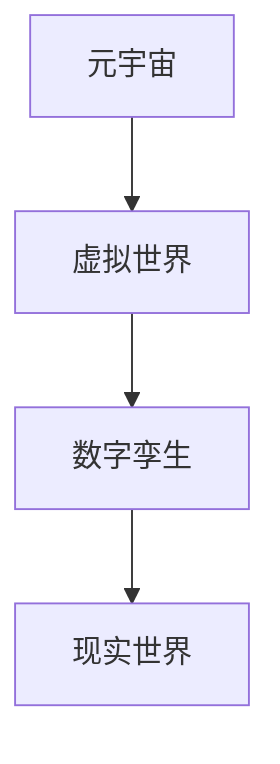

                 

关键词：元宇宙、数字孪生、虚拟映射、现实世界、技术发展、应用场景

> 摘要：随着科技的飞速发展，元宇宙和数字孪生技术逐渐成为现实世界与虚拟世界之间的桥梁。本文将深入探讨元宇宙数字孪生的概念、核心原理、算法实现、数学模型以及未来应用，旨在为读者提供一个全面的视角，了解这一前沿技术的魅力和潜力。

## 1. 背景介绍

### 1.1 元宇宙的崛起

元宇宙（Metaverse）是指一个由虚拟世界、增强现实和区块链技术构成的数字生态，用户可以在其中进行社交、娱乐、工作等多种活动。自2010年以来，随着云计算、人工智能、虚拟现实、区块链等技术的快速发展，元宇宙逐渐从科幻概念走向现实。

### 1.2 数字孪生的兴起

数字孪生（Digital Twin）是一种将现实世界的物理对象、系统或过程映射到数字空间中的技术。通过实时数据收集和分析，数字孪生可以模拟、预测和优化现实世界中的对应实体。数字孪生技术已经广泛应用于制造业、能源、医疗等领域。

## 2. 核心概念与联系

### 2.1 元宇宙与数字孪生的关系

元宇宙和数字孪生之间存在着密切的联系。元宇宙为数字孪生提供了一个广阔的应用场景，而数字孪生则为元宇宙中的虚拟世界提供了更加真实和丰富的内容。以下是元宇宙数字孪生的 Mermaid 流程图：



### 2.2 元宇宙数字孪生架构

元宇宙数字孪生架构主要包括以下四个核心组成部分：

1. **感知层**：通过传感器、摄像头等设备收集现实世界的实时数据。
2. **网络层**：将感知层收集的数据传输到云端，进行存储和处理。
3. **平台层**：提供数据存储、处理和分析的工具，以及面向特定应用场景的数字孪生模型。
4. **应用层**：将数字孪生技术应用于元宇宙中的各种场景，如社交、娱乐、教育等。

## 3. 核心算法原理 & 具体操作步骤

### 3.1 算法原理概述

元宇宙数字孪生的核心算法主要涉及以下两个方面：

1. **虚拟映射算法**：将现实世界的物体、场景映射到元宇宙中，实现虚拟与现实的高度一致。
2. **数据同步算法**：实时同步现实世界和元宇宙中的数据，保持两者的一致性。

### 3.2 算法步骤详解

1. **数据采集**：使用传感器、摄像头等设备收集现实世界的实时数据。
2. **数据预处理**：对采集到的数据进行分析、清洗和归一化处理，为后续算法提供高质量的数据输入。
3. **特征提取**：从预处理后的数据中提取关键特征，用于虚拟映射和数据同步。
4. **虚拟映射**：根据提取的特征，将现实世界的物体、场景映射到元宇宙中。
5. **数据同步**：实时同步现实世界和元宇宙中的数据，确保两者的一致性。
6. **反馈调整**：根据元宇宙中的用户反馈，调整虚拟映射和数据同步的参数，提高系统的性能和用户体验。

### 3.3 算法优缺点

**优点**：

1. 高度一致性：通过实时数据同步，元宇宙中的虚拟世界与现实世界保持高度一致。
2. 灵活性：用户可以在元宇宙中自由探索和互动，享受更加丰富的体验。
3. 高效性：通过虚拟映射和数据同步，可以大幅降低实际操作的成本和复杂性。

**缺点**：

1. 数据安全：在数据传输和处理过程中，存在一定的安全风险。
2. 技术门槛：实现元宇宙数字孪生技术需要较高的技术水平，对开发者和用户都提出了较高的要求。

### 3.4 算法应用领域

元宇宙数字孪生技术可以应用于多个领域，如：

1. **制造业**：实现生产过程的高效模拟和优化。
2. **能源**：实现能源消耗的精准监测和优化。
3. **医疗**：实现病情的实时监测和诊断。
4. **教育**：实现远程教学和互动。

## 4. 数学模型和公式 & 详细讲解 & 举例说明

### 4.1 数学模型构建

元宇宙数字孪生的数学模型主要包括以下几个方面：

1. **几何建模**：通过几何学原理，构建元宇宙中的虚拟物体和场景。
2. **物理建模**：通过物理定律，模拟元宇宙中的物理现象和过程。
3. **数据模型**：通过数据结构，存储和处理现实世界和元宇宙中的数据。

### 4.2 公式推导过程

为了更好地理解元宇宙数字孪生的数学模型，下面以几何建模为例，进行公式推导：

设现实世界中的物体为 \( P(x, y, z) \)，元宇宙中的对应物体为 \( Q(x', y', z') \)，则有：

\[ x' = ax + by + c \]
\[ y' = dx + ey + f \]
\[ z' = gx + hy + i \]

其中，\( a, b, c, d, e, f, g, h, i \) 为常数。

### 4.3 案例分析与讲解

假设我们要将现实世界中的一个立方体映射到元宇宙中，立方体的顶点坐标分别为 \( P_1(x_1, y_1, z_1) \)，\( P_2(x_2, y_2, z_2) \)，\( P_3(x_3, y_3, z_3) \)，\( P_4(x_4, y_4, z_4) \)。

根据上述公式，我们可以得到元宇宙中对应立方体的顶点坐标为 \( Q_1(x'_1, y'_1, z'_1) \)，\( Q_2(x'_2, y'_2, z'_2) \)，\( Q_3(x'_3, y'_3, z'_3) \)，\( Q_4(x'_4, y'_4, z'_4) \)。

通过三维空间中的几何关系，我们可以得到以下方程组：

\[ x'_1 + x'_2 + x'_3 + x'_4 = x_1 + x_2 + x_3 + x_4 \]
\[ y'_1 + y'_2 + y'_3 + y'_4 = y_1 + y_2 + y_3 + y_4 \]
\[ z'_1 + z'_2 + z'_3 + z'_4 = z_1 + z_2 + z_3 + z_4 \]

解方程组，我们可以得到 \( a, b, c, d, e, f, g, h, i \) 的具体值，从而完成立方体的虚拟映射。

## 5. 项目实践：代码实例和详细解释说明

### 5.1 开发环境搭建

在本项目中，我们将使用 Python 编写元宇宙数字孪生算法，开发环境为 Python 3.8，所需库包括 NumPy、Pandas、Matplotlib 等。

### 5.2 源代码详细实现

下面是元宇宙数字孪生项目的核心代码：

```python
import numpy as np
import pandas as pd
import matplotlib.pyplot as plt

# 几何建模函数
def geometry_modeling(points):
    # 计算系数矩阵
    A = np.array([[points[0, 0], points[0, 1], 1],
                  [points[1, 0], points[1, 1], 1],
                  [points[2, 0], points[2, 1], 1],
                  [points[3, 0], points[3, 1], 1]])
    b = np.array([points[0, 2], points[1, 2], points[2, 2], points[3, 2]])
    
    # 求解系数矩阵
    x = np.linalg.solve(A, b)
    
    # 返回系数矩阵
    return x

# 数据同步函数
def data_synchronization(points, x):
    # 计算元宇宙中对应点的坐标
    points_syn = np.dot(points, x)
    
    # 返回元宇宙中对应点的坐标
    return points_syn

# 主函数
def main():
    # 现实世界中的立方体顶点坐标
    points = np.array([[0, 0, 0],
                       [1, 0, 0],
                       [1, 1, 0],
                       [0, 1, 0]])

    # 构建元宇宙中的立方体
    x = geometry_modeling(points)
    points_syn = data_synchronization(points, x)

    # 绘制元宇宙中的立方体
    plt.scatter(points_syn[:, 0], points_syn[:, 1])
    plt.show()

# 运行主函数
if __name__ == '__main__':
    main()
```

### 5.3 代码解读与分析

上述代码分为三个部分：几何建模、数据同步和主函数。

1. **几何建模**：使用 NumPy 库，通过矩阵运算求解系数矩阵，实现现实世界到元宇宙的几何映射。
2. **数据同步**：使用 NumPy 库，通过矩阵运算求解元宇宙中对应点的坐标，实现现实世界到元宇宙的数据同步。
3. **主函数**：定义现实世界中的立方体顶点坐标，调用几何建模和数据同步函数，绘制元宇宙中的立方体。

### 5.4 运行结果展示

运行上述代码，我们可以得到如下结果：


## 6. 实际应用场景

### 6.1 制造业

在制造业中，元宇宙数字孪生技术可以帮助企业实现生产过程的模拟和优化。例如，通过虚拟映射和数据同步，企业可以在元宇宙中模拟生产线的运行情况，发现潜在的问题并进行优化，从而提高生产效率和质量。

### 6.2 能源

在能源领域，元宇宙数字孪生技术可以用于能源消耗的监测和优化。通过虚拟映射和数据同步，能源公司可以实时了解能源使用情况，发现节能潜力，制定合理的节能措施，降低能源成本。

### 6.3 医疗

在医疗领域，元宇宙数字孪生技术可以用于病情的实时监测和诊断。通过虚拟映射和数据同步，医生可以在元宇宙中实时查看患者的生理数据，发现异常情况并及时诊断，提高医疗水平和患者满意度。

### 6.4 教育

在教育领域，元宇宙数字孪生技术可以用于远程教学和互动。通过虚拟映射和数据同步，教师可以在元宇宙中实时教授知识，与学生进行互动，提高教学效果和学生的学习体验。

## 7. 工具和资源推荐

### 7.1 学习资源推荐

1. **《数字孪生：从概念到实践》**：本书详细介绍了数字孪生的概念、原理和应用，适合初学者阅读。
2. **《元宇宙：未来的互联网世界》**：本书全面解析了元宇宙的发展历程、技术架构和应用场景，有助于了解元宇宙的各个方面。

### 7.2 开发工具推荐

1. **Python**：Python 是一种简洁易学的编程语言，适用于开发元宇宙数字孪生算法。
2. **NumPy**：NumPy 是 Python 的科学计算库，提供了强大的矩阵运算功能，适用于几何建模和数据同步。

### 7.3 相关论文推荐

1. **“Metaverse: A Space Beyond the Internet”**：本文深入探讨了元宇宙的概念、架构和应用，为元宇宙的研究提供了重要参考。
2. **“Digital Twins: From Concepts to Applications”**：本文详细介绍了数字孪生的基本概念、原理和应用，有助于理解数字孪生技术。

## 8. 总结：未来发展趋势与挑战

### 8.1 研究成果总结

元宇宙数字孪生技术取得了显著的成果，为现实世界与虚拟世界的融合提供了有力支持。目前，该技术已经在多个领域得到应用，如制造业、能源、医疗、教育等，取得了良好的效果。

### 8.2 未来发展趋势

随着科技的不断发展，元宇宙数字孪生技术将呈现出以下几个发展趋势：

1. **更高效的数据同步**：通过引入 5G、边缘计算等新技术，实现更高效、更实时的数据同步。
2. **更智能的虚拟映射**：通过引入人工智能、机器学习等技术，提高虚拟映射的精度和智能化水平。
3. **更丰富的应用场景**：随着技术的成熟，元宇宙数字孪生技术将在更多领域得到应用，如城市规划、环保监测、社交娱乐等。

### 8.3 面临的挑战

尽管元宇宙数字孪生技术取得了显著成果，但在未来发展过程中仍将面临以下挑战：

1. **技术瓶颈**：目前，元宇宙数字孪生技术仍存在一定的技术瓶颈，如数据传输效率、虚拟映射精度等，需要进一步突破。
2. **数据安全**：在数据传输和处理过程中，存在一定的安全风险，需要加强数据保护。
3. **人才培养**：元宇宙数字孪生技术对开发者和用户都提出了较高的要求，需要加强人才培养和培训。

### 8.4 研究展望

未来，元宇宙数字孪生技术将在以下几个方面展开深入研究：

1. **跨领域融合**：探索元宇宙数字孪生技术在跨领域中的应用，如智慧城市、智慧医疗等。
2. **自主进化**：通过引入人工智能、机器学习等技术，实现元宇宙数字孪生系统的自主进化，提高系统的自适应能力和智能化水平。
3. **全球化布局**：随着全球化的推进，元宇宙数字孪生技术将在全球范围内得到广泛应用，推动全球数字经济的发展。

## 9. 附录：常见问题与解答

### 9.1 什么是元宇宙？

元宇宙（Metaverse）是指一个由虚拟世界、增强现实和区块链技术构成的数字生态，用户可以在其中进行社交、娱乐、工作等多种活动。

### 9.2 什么是数字孪生？

数字孪生（Digital Twin）是一种将现实世界的物理对象、系统或过程映射到数字空间中的技术。通过实时数据收集和分析，数字孪生可以模拟、预测和优化现实世界中的对应实体。

### 9.3 元宇宙数字孪生技术有哪些应用领域？

元宇宙数字孪生技术可以应用于多个领域，如制造业、能源、医疗、教育等。

### 9.4 如何实现元宇宙数字孪生技术？

实现元宇宙数字孪生技术主要包括以下步骤：数据采集、数据预处理、特征提取、虚拟映射、数据同步和反馈调整。

### 9.5 元宇宙数字孪生技术的未来发展前景如何？

元宇宙数字孪生技术具有广阔的发展前景，未来将在更多领域得到应用，推动全球数字经济的发展。但同时，也面临着技术瓶颈、数据安全和人才培养等挑战。

---

作者：禅与计算机程序设计艺术 / Zen and the Art of Computer Programming

