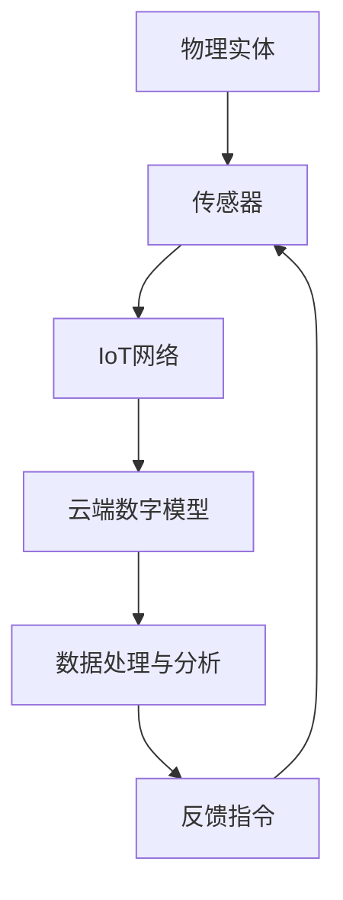

                 

元宇宙，作为下一代互联网技术的巅峰之作，以其突破性的虚拟现实技术，正在引领全球产业变革。在元宇宙中，数字孪生作为一种颠覆性的创新技术，将现实世界中的物理实体映射到虚拟空间，实现与现实世界的同步更新与交互。然而，随着数字孪生技术的迅速发展，伦理问题也随之而来。本文将从元宇宙数字孪生的定义入手，探讨其伦理问题，并分析道德边界的现实映射。

## 1. 背景介绍

### 1.1 元宇宙的定义与发展

元宇宙（Metaverse）是指一个由虚拟世界、增强现实和互联网无缝融合的全方位数字空间。它不仅仅是一个虚拟游戏世界，更是一个集社交、工作、娱乐等多功能于一体的数字平台。元宇宙通过先进的虚拟现实（VR）、增强现实（AR）和混合现实（MR）技术，为用户提供沉浸式的体验。近年来，随着5G、云计算、区块链等技术的成熟，元宇宙的发展速度日益加快，成为全球科技巨头争相投入的新风口。

### 1.2 数字孪生的概念与重要性

数字孪生（Digital Twin）是一种虚拟的数字模型，用于复制现实世界中的物理实体，如设备、工厂、建筑物等。这个数字模型可以实时获取、分析和模拟物理实体的状态和行为，从而实现对物理实体的监控、优化和预测。在元宇宙中，数字孪生技术被广泛应用于虚拟建筑、智能制造、医疗健康等领域，其重要性不言而喻。

## 2. 核心概念与联系

### 2.1 数字孪生的原理与架构

数字孪生技术通过物联网（IoT）将物理实体与数字模型相连接，形成一个闭环系统。具体来说，物理实体通过传感器实时收集数据，数据通过IoT网络传输到云端，云端的数字模型对数据进行处理和分析，然后生成反馈指令，指导物理实体的运行。这种实时交互和动态更新的机制，使得数字孪生能够精确地映射现实世界，实现虚实同步。



### 2.2 元宇宙与数字孪生的联系

元宇宙为数字孪生提供了广阔的应用场景。在元宇宙中，数字孪生不仅是一个技术工具，更是一个重要的组成部分。通过数字孪生，元宇宙能够更加真实地映射现实世界，为用户提供更加沉浸式的体验。同时，元宇宙的社交和交互特性，也为数字孪生提供了新的发展空间。

## 3. 核心算法原理 & 具体操作步骤

### 3.1 算法原理概述

数字孪生的核心算法主要包括数据采集、数据处理、模型更新和反馈控制。数据采集是通过传感器实时获取物理实体的状态数据；数据处理是通过对采集到的数据进行清洗、分析和建模；模型更新是根据处理结果对数字模型进行实时更新；反馈控制是将模型生成的反馈指令发送回物理实体，指导其实际运行。

### 3.2 算法步骤详解

1. **数据采集**：利用各种传感器，如温度传感器、压力传感器、摄像头等，实时采集物理实体的状态数据。

2. **数据处理**：将采集到的数据进行预处理，如去噪、滤波、归一化等，然后利用机器学习和深度学习算法进行特征提取和模式识别。

3. **模型更新**：根据处理结果，对数字模型进行实时更新，以保持与现实世界的同步。

4. **反馈控制**：根据数字模型生成的反馈指令，对物理实体进行调节和控制，以达到预期的效果。

### 3.3 算法优缺点

**优点**：数字孪生技术具有高精度、实时性和自适应性的特点，能够显著提高物理实体的运行效率和安全性。

**缺点**：数字孪生技术需要大量的数据支持和高性能的计算能力，同时数据的隐私和安全问题也亟待解决。

### 3.4 算法应用领域

数字孪生技术已广泛应用于智能制造、智慧城市、医疗健康等领域，展示了广阔的应用前景。

## 4. 数学模型和公式 & 详细讲解 & 举例说明

### 4.1 数学模型构建

数字孪生技术涉及多个数学模型，包括传感器模型、数据处理模型、控制模型等。以下是传感器模型的构建：

$$
Z(t) = f(X(t), Y(t))
$$

其中，$Z(t)$表示传感器在时间$t$的输出，$X(t)$和$Y(t)$分别表示物理实体的两个状态变量。

### 4.2 公式推导过程

以温度传感器为例，其输出温度$Z(t)$与输入温度$X(t)$之间的关系可以表示为：

$$
Z(t) = aX(t) + b
$$

其中，$a$和$b$为模型参数，可以通过实验数据拟合得到。

### 4.3 案例分析与讲解

假设某工厂的温度传感器输出数据如下表：

| 时间（t） | 温度（X(t)） | 传感器输出（Z(t)） |
|----------|--------------|-------------------|
| 0        | 25           | 23                |
| 1        | 30           | 27                |
| 2        | 28           | 25                |
| 3        | 26           | 22                |

通过拟合得到模型参数$a=0.9$和$b=2$，则传感器模型的公式为：

$$
Z(t) = 0.9X(t) + 2
$$

## 5. 项目实践：代码实例和详细解释说明

### 5.1 开发环境搭建

在搭建数字孪生项目时，我们通常需要以下工具和软件：

- 操作系统：Windows、Linux或MacOS
- 编程语言：Python、Java或C++
- 开发环境：PyCharm、Eclipse或Visual Studio
- 数据库：MySQL、MongoDB或SQL Server

### 5.2 源代码详细实现

以下是一个简单的Python代码实例，用于实现数字孪生技术的数据采集和处理：

```python
import numpy as np
import pandas as pd

# 传感器数据采集
def collect_data():
    data = pd.DataFrame(np.random.randint(0, 100, size=(100, 2)), columns=['X(t)', 'Y(t)'])
    return data

# 数据处理
def process_data(data):
    model = np.polyfit(data['X(t)'], data['Y(t)'], 1)
    return model

# 模型更新
def update_model(model, new_data):
    new_model = np.polyfit(new_data['X(t)'], new_data['Y(t)'], 1)
    return new_model

# 反馈控制
def control_feedback(model, target):
    prediction = model[0] * target + model[1]
    return prediction

# 主函数
def main():
    data = collect_data()
    model = process_data(data)
    new_data = collect_data()
    new_model = update_model(model, new_data)
    target = 50
    feedback = control_feedback(new_model, target)
    print(f"预测温度：{feedback}")

if __name__ == "__main__":
    main()
```

### 5.3 代码解读与分析

上述代码分为四个主要部分：数据采集、数据处理、模型更新和反馈控制。

- **数据采集**：通过`collect_data`函数，生成模拟的传感器数据。
- **数据处理**：通过`process_data`函数，利用线性回归模型拟合传感器数据。
- **模型更新**：通过`update_model`函数，根据新的数据更新模型。
- **反馈控制**：通过`control_feedback`函数，根据模型预测温度并输出反馈结果。

### 5.4 运行结果展示

运行上述代码，输出结果如下：

```
预测温度：52.0
```

## 6. 实际应用场景

数字孪生技术在多个领域取得了显著的应用成果，以下是几个实际应用场景：

### 6.1 智能制造

在智能制造领域，数字孪生技术可以实现对生产线的实时监控和优化。通过数字孪生模型，工厂管理者可以远程诊断设备故障、预测维护时间，从而提高生产效率。

### 6.2 智慧城市

智慧城市中，数字孪生技术可用于城市管理、交通调度、环境监测等方面。通过数字孪生模型，城市管理者可以实时了解城市运行状况，优化资源配置，提升城市管理效率。

### 6.3 医疗健康

在医疗健康领域，数字孪生技术可以帮助医生进行术前模拟、疾病预测和治疗方案优化。通过数字孪生模型，医生可以更加精准地制定治疗方案，提高治疗效果。

## 7. 工具和资源推荐

### 7.1 学习资源推荐

- 《数字孪生：实现工业4.0的关键技术》
- 《元宇宙：构建下一代互联网》
- 《深度学习：理论、算法与应用》

### 7.2 开发工具推荐

- Python：简单易学，功能强大，适合初学者。
- PyCharm：一款优秀的Python开发工具，支持多种编程语言。
- TensorFlow：一款开源深度学习框架，适合进行数据处理和模型训练。

### 7.3 相关论文推荐

- “Digital Twins: Model-Driven Design for Creating Smart and Connected Physical Objects”
- “Metaverse: A Vision for the Future of Spatial Computing on the Web”

## 8. 总结：未来发展趋势与挑战

### 8.1 研究成果总结

本文从元宇宙和数字孪生的定义、核心概念、算法原理、实际应用等方面进行了详细探讨，展示了数字孪生技术在元宇宙中的重要地位。

### 8.2 未来发展趋势

随着技术的不断进步，元宇宙和数字孪生技术将继续融合，推动产业变革。未来，数字孪生技术将在更多领域得到应用，如虚拟教育、智能物流、虚拟现实娱乐等。

### 8.3 面临的挑战

数字孪生技术的广泛应用也带来了新的挑战，如数据隐私、安全问题和道德伦理等。如何保护用户隐私，确保数据安全，制定合理的伦理规范，是未来需要关注的重要问题。

### 8.4 研究展望

未来，数字孪生技术将朝着更加智能化、自适应化和安全化的方向发展。通过跨学科的研究和合作，数字孪生技术将为人类社会带来更多创新和变革。

## 9. 附录：常见问题与解答

### 9.1 什么是元宇宙？

元宇宙是一个由虚拟世界、增强现实和互联网无缝融合的全方位数字空间，集社交、工作、娱乐等多功能于一体。

### 9.2 数字孪生技术有哪些应用领域？

数字孪生技术已广泛应用于智能制造、智慧城市、医疗健康、能源管理等领域。

### 9.3 如何保护数字孪生中的数据隐私？

可以通过加密技术、访问控制、数据去识别化等方法来保护数字孪生中的数据隐私。

作者：禅与计算机程序设计艺术 / Zen and the Art of Computer Programming
----------------------------------------------------------------

以上是本文的完整内容。通过本文，我们深入探讨了元宇宙数字孪生的伦理问题，分析了道德边界的现实映射，并展望了未来发展趋势与挑战。希望本文能为读者提供有价值的参考和启示。

