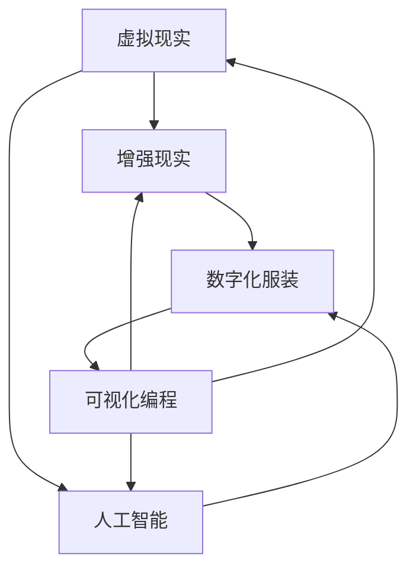

                 

### 关键词 Keyword

- 元宇宙 (Metaverse)
- 时尚设计 (Fashion Design)
- 数字化 (Digitalization)
- 服装设计 (Clothing Design)
- 创新技术 (Innovative Technology)
- 虚拟现实 (Virtual Reality)
- 增强现实 (Augmented Reality)
- 人工智能 (Artificial Intelligence)
- 可视化编程 (Visual Programming)
- 人机交互 (Human-Computer Interaction)

<|assistant|>### 摘要 Abstract

本文旨在探讨元宇宙时尚设计的崛起，以及数字化服装在设计领域的创新与应用。随着虚拟现实、增强现实和人工智能技术的快速发展，时尚设计师们正迎来一个全新的创作时代。本文将介绍元宇宙时尚设计的核心概念，探讨其与传统时尚设计的区别与联系，并分析数字化服装设计中的关键算法和数学模型。通过具体的项目实践和代码实例，本文将展示如何利用现代技术手段打造具有未来感的数字化服装。此外，本文还将探讨元宇宙时尚设计在实际应用场景中的表现，并展望其未来的发展趋势与挑战。希望本文能为时尚设计师们提供一些新的灵感，推动数字化服装设计的进步。

<|assistant|>### 1. 背景介绍 Background

1. **元宇宙的兴起**

随着互联网技术的不断发展，人们对于虚拟世界的需求日益增长。元宇宙（Metaverse）这一概念逐渐成为热门话题。元宇宙被认为是一个沉浸式的虚拟世界，通过互联网连接各个虚拟空间，为用户提供一种全新的交互方式。在元宇宙中，用户可以创建自己的虚拟形象，进行各种社交活动、商业交易以及娱乐体验。

元宇宙的兴起为时尚设计带来了巨大的变革。传统时尚设计主要依赖于物理空间和实体产品，而元宇宙时尚设计则将虚拟世界与时尚设计相结合，创造出一种全新的艺术形式。设计师们可以在虚拟环境中自由发挥创意，打造出独特的数字化服装，为用户提供更加丰富和多样化的体验。

2. **数字化服装的崛起**

数字化服装（Digital Fashion）是指通过计算机技术和数字化手段设计的服装。与传统服装设计不同，数字化服装设计无需依赖物理材料，而是通过虚拟模型和三维建模技术进行设计和制作。这种设计方式不仅提高了设计效率，还使得服装设计更加个性化和多样化。

随着虚拟现实（VR）和增强现实（AR）技术的普及，数字化服装开始逐渐进入人们的日常生活。用户可以通过VR头戴设备或AR眼镜，在虚拟环境中试穿和体验数字化服装。这种体验不仅为用户带来了全新的视觉感受，还使得服装设计更加贴近用户需求。

3. **人工智能与时尚设计的结合**

人工智能（AI）技术的发展为时尚设计带来了新的可能性。通过机器学习和深度学习算法，AI可以分析用户的行为数据、偏好和趋势，为设计师提供有价值的参考。此外，AI还可以自动生成设计灵感，帮助设计师快速创作出新的服装款式。

人工智能在时尚设计中的应用还包括虚拟模特和虚拟试衣。通过AI技术，设计师可以创建出逼真的虚拟模特，展示服装的细节和设计风格。用户则可以通过虚拟试衣技术，在虚拟环境中试穿和评价数字化服装。

4. **可视化编程与元宇宙时尚设计**

可视化编程是一种通过图形界面进行编程的方式，它使得编程变得更加直观和易于理解。在元宇宙时尚设计中，可视化编程可以用于创建和编辑虚拟服装模型。设计师可以通过拖放操作、图形化模块和参数化设计，快速构建出具有复杂结构和细节的数字化服装。

可视化编程还使得元宇宙时尚设计更加开放和协作。设计师们可以共享和复用设计模块，共同创造更加创新和多样化的数字化服装。此外，可视化编程还可以用于用户互动和用户体验设计，为用户提供更加个性化和服务化的时尚体验。

<|assistant|>### 2. 核心概念与联系 Core Concepts and Relationships

在元宇宙时尚设计中，核心概念包括虚拟现实（VR）、增强现实（AR）、人工智能（AI）、数字化服装（Digital Fashion）和可视化编程（Visual Programming）。这些概念相互关联，共同构成了元宇宙时尚设计的技术基础。

1. **虚拟现实（VR）**

虚拟现实是一种通过计算机生成模拟环境，使用户沉浸其中的技术。在元宇宙时尚设计中，VR技术用于创建虚拟试衣间和虚拟秀场。用户可以通过VR头戴设备进入虚拟环境，试穿和体验数字化服装。VR技术使得设计师可以在虚拟空间中自由发挥创意，打造出独特的服装设计。

2. **增强现实（AR）**

增强现实是一种将虚拟信息叠加在现实世界中的技术。在元宇宙时尚设计中，AR技术用于实时展示和互动。用户可以通过AR眼镜或手机摄像头，将虚拟服装叠加在现实世界的物体上，进行试穿和互动。AR技术不仅为用户提供了全新的时尚体验，还使得设计师可以实时获取用户反馈，优化设计。

3. **人工智能（AI）**

人工智能是一种通过模拟人类智能行为，实现自动化决策和任务执行的技术。在元宇宙时尚设计中，AI技术用于分析用户数据、生成设计灵感、创建虚拟模特和虚拟试衣。AI技术提高了设计效率，降低了设计成本，为设计师提供了更多创新的可能性。

4. **数字化服装（Digital Fashion）**

数字化服装是通过计算机技术和数字化手段设计的服装。与传统服装设计不同，数字化服装无需依赖物理材料，而是通过虚拟模型和三维建模技术进行设计和制作。数字化服装设计使得设计师可以在虚拟环境中自由发挥创意，打造出独特的服装款式和风格。

5. **可视化编程（Visual Programming）**

可视化编程是一种通过图形界面进行编程的方式，它使得编程变得更加直观和易于理解。在元宇宙时尚设计中，可视化编程可以用于创建和编辑虚拟服装模型。设计师可以通过拖放操作、图形化模块和参数化设计，快速构建出具有复杂结构和细节的数字化服装。

下面是一个使用Mermaid绘制的元宇宙时尚设计核心概念与联系的流程图：



在这个流程图中，虚拟现实、增强现实、人工智能、数字化服装和可视化编程相互关联，共同构成了元宇宙时尚设计的生态系统。通过这些技术，设计师可以打破传统的创作限制，创造出更加创新和多样化的数字化服装。

<|assistant|>### 3. 核心算法原理 & 具体操作步骤 Core Algorithm Principle and Specific Operational Steps

在元宇宙时尚设计中，核心算法原理主要涉及虚拟现实（VR）、增强现实（AR）和人工智能（AI）技术。以下将详细阐述这些算法的原理以及具体操作步骤。

#### 3.1 算法原理概述

1. **虚拟现实（VR）**

虚拟现实算法主要利用计算机图形学和传感器技术，创建一个虚拟的三维空间，用户可以通过VR头戴设备进入这个空间进行交互。关键算法包括三维建模、实时渲染和物理仿真。

- **三维建模**：通过捕捉现实世界物体的几何形状和纹理，构建虚拟三维模型。常见算法有几何建模、纹理映射和细节雕刻。
- **实时渲染**：利用图形处理单元（GPU）生成虚拟环境的实时图像。关键算法包括光追踪、阴影计算和反射模拟。
- **物理仿真**：模拟虚拟空间中物体的物理行为，如碰撞检测、动力学模拟和重力作用。关键算法包括牛顿力学、碰撞检测和模拟仿真。

2. **增强现实（AR）**

增强现实算法主要利用计算机视觉和图像处理技术，将虚拟信息叠加在现实世界中的图像上。关键算法包括目标检测、姿态估计和图像融合。

- **目标检测**：识别现实世界中的物体，如人脸、手势和物体。常见算法有卷积神经网络（CNN）和特征提取。
- **姿态估计**：估计目标物体的空间姿态，如方向和角度。常见算法有单目视觉和立体视觉。
- **图像融合**：将虚拟信息叠加到现实世界的图像中，实现真实与虚拟的融合。关键算法包括光流法、图像合成和颜色匹配。

3. **人工智能（AI）**

人工智能算法在元宇宙时尚设计中用于生成设计灵感、虚拟模特和虚拟试衣。关键算法包括机器学习和深度学习。

- **生成设计灵感**：利用深度学习模型，如生成对抗网络（GAN），自动生成时尚设计灵感。
- **虚拟模特**：利用计算机图形学和AI算法，创建逼真的虚拟模特，展示服装设计。
- **虚拟试衣**：利用计算机视觉和深度学习算法，识别用户身体轮廓和姿态，实现虚拟试衣。

#### 3.2 算法步骤详解

1. **虚拟现实（VR）**

- **三维建模**：采集现实世界物体的几何形状和纹理，使用三维建模软件（如Blender、Maya）进行建模。
- **实时渲染**：使用图形处理单元（GPU）生成虚拟环境的实时图像，使用渲染引擎（如Unity、Unreal Engine）进行渲染。
- **物理仿真**：模拟虚拟空间中物体的物理行为，使用物理引擎（如PhysX、Bullet）进行仿真。

2. **增强现实（AR）**

- **目标检测**：使用计算机视觉算法（如CNN），识别现实世界中的物体。
- **姿态估计**：使用单目视觉或立体视觉算法，估计目标物体的空间姿态。
- **图像融合**：使用图像合成算法（如光流法、图像合成），将虚拟信息叠加到现实世界的图像中。

3. **人工智能（AI）**

- **生成设计灵感**：使用生成对抗网络（GAN），自动生成时尚设计灵感。
- **虚拟模特**：使用计算机图形学和AI算法，创建逼真的虚拟模特。
- **虚拟试衣**：使用计算机视觉和深度学习算法，识别用户身体轮廓和姿态，实现虚拟试衣。

#### 3.3 算法优缺点

1. **虚拟现实（VR）**

- **优点**：沉浸式体验，丰富的交互性，实时渲染和物理仿真。
- **缺点**：硬件设备成本较高，对网络环境要求较高，易产生眩晕感。

2. **增强现实（AR）**

- **优点**：实时性，互动性，应用场景广泛。
- **缺点**：图像质量受环境光和设备性能影响，虚拟信息叠加在真实世界中的视觉效果有时不太自然。

3. **人工智能（AI）**

- **优点**：自动生成设计灵感，个性化推荐，高效计算。
- **缺点**：需要大量数据训练，算法模型复杂，存在一定的道德和社会问题。

#### 3.4 算法应用领域

1. **虚拟现实（VR）**

- **领域**：游戏、教育、医疗、娱乐、设计等。
- **应用**：虚拟试衣、虚拟展览、虚拟会议、虚拟教学等。

2. **增强现实（AR）**

- **领域**：零售、广告、医疗、导航、制造等。
- **应用**：虚拟广告、产品展示、导航辅助、手术辅助等。

3. **人工智能（AI）**

- **领域**：时尚设计、推荐系统、自动驾驶、语音识别、图像识别等。
- **应用**：时尚设计灵感生成、个性化推荐、自动驾驶辅助、语音交互等。

<|assistant|>### 4. 数学模型和公式 & 详细讲解 & 举例说明

在元宇宙时尚设计中，数学模型和公式起着至关重要的作用。这些模型和公式帮助我们更好地理解和实现虚拟现实（VR）、增强现实（AR）和人工智能（AI）等技术。以下将详细介绍一些关键的数学模型和公式，并给出相应的详细讲解和举例说明。

#### 4.1 数学模型构建

1. **三维空间中的点、线和面**

在三维空间中，点、线和面是基本构建元素。一个点可以用三个坐标表示，例如 \((x, y, z)\)。一条线可以由两个点的坐标确定，使用参数方程表示为：
\[ 
\begin{cases}
x = x_0 + at \\
y = y_0 + bt \\
z = z_0 + ct
\end{cases} 
\]
其中 \((x_0, y_0, z_0)\) 是起始点坐标，\(a, b, c\) 是方向向量。

一个平面可以用三个点确定，使用点法向量表示为：
\[ 
\mathbf{n} \cdot \mathbf{r} = d 
\]
其中 \(\mathbf{n}\) 是平面的法向量，\(\mathbf{r}\) 是平面上任意一点的坐标，\(d\) 是平面的距离。

2. **三维变换**

三维变换包括旋转、平移和缩放。旋转可以使用旋转矩阵表示，例如绕x轴旋转 \(\theta\) 度的旋转矩阵为：
\[ 
\mathbf{R}_x(\theta) = \begin{bmatrix}
1 & 0 & 0 \\
0 & \cos(\theta) & -\sin(\theta) \\
0 & \sin(\theta) & \cos(\theta)
\end{bmatrix} 
\]
类似的，绕y轴和z轴旋转的旋转矩阵分别为：
\[ 
\mathbf{R}_y(\theta) = \begin{bmatrix}
\cos(\theta) & 0 & \sin(\theta) \\
0 & 1 & 0 \\
-\sin(\theta) & 0 & \cos(\theta)
\end{bmatrix} 
\]
\[ 
\mathbf{R}_z(\theta) = \begin{bmatrix}
\cos(\theta) & -\sin(\theta) & 0 \\
\sin(\theta) & \cos(\theta) & 0 \\
0 & 0 & 1
\end{bmatrix} 
\]
平移可以使用平移矩阵表示，例如将点 \((x, y, z)\) 平移 \((p, q, r)\) 的平移矩阵为：
\[ 
\mathbf{T}(p, q, r) = \begin{bmatrix}
1 & 0 & 0 & p \\
0 & 1 & 0 & q \\
0 & 0 & 1 & r \\
0 & 0 & 0 & 1
\end{bmatrix} 
\]
缩放可以使用缩放矩阵表示，例如将点 \((x, y, z)\) 缩放 \(\alpha\) 的缩放矩阵为：
\[ 
\mathbf{S}(\alpha) = \begin{bmatrix}
\alpha & 0 & 0 & 0 \\
0 & \alpha & 0 & 0 \\
0 & 0 & \alpha & 0 \\
0 & 0 & 0 & 1
\end{bmatrix} 
\]

3. **相机模型**

相机模型描述了从三维空间到二维图像的投影过程。最常见的相机模型是正交投影和透视投影。

- **正交投影**：使用正交投影矩阵，例如：
\[ 
\mathbf{P}_{ortho} = \begin{bmatrix}
1 & 0 & 0 & 0 \\
0 & 1 & 0 & 0 \\
0 & 0 & 1 & 0 \\
0 & 0 & 0 & 1
\end{bmatrix} 
\]
- **透视投影**：使用透视投影矩阵，例如：
\[ 
\mathbf{P}_{persp} = \begin{bmatrix}
\frac{f}{z-f} & 0 & 0 & 0 \\
0 & \frac{f}{z-f} & 0 & 0 \\
0 & 0 & \frac{z-n}{f-n} & \frac{2fn}{f-n} \\
0 & 0 & \frac{1-n}{f-n} & \frac{1+n}{f-n}
\end{bmatrix} 
\]
其中 \(f\) 是焦距，\(z\) 是相机到物体的距离，\(n\) 是相机到视平面的距离。

4. **材料属性**

在元宇宙时尚设计中，材料属性是一个重要的因素。常用的材料属性包括反射率、折射率、透明度和光泽度。可以使用以下公式描述：

- **反射率**：\[ R = \frac{4\pi n_2 \cos \theta_i}{(n_1 + n_2 \cos \theta_i)} \]
- **折射率**：\[ n = \frac{\sin \theta_i}{\sin \theta_r} \]
- **透明度**：\[ T = 1 - R \]
- **光泽度**：\[ G = \frac{1}{1 + \frac{\cos^2 \theta_i}{\cos^2 \theta_r}} \]

#### 4.2 公式推导过程

1. **反射率**

反射率是光线在介质界面反射的比例。根据费马定律，光线从介质1进入介质2时，入射角和反射角之间的关系为：
\[ \theta_i = \theta_r \]

根据斯涅尔定律，光线的折射角度与入射角度和介质折射率之间的关系为：
\[ n_1 \sin \theta_i = n_2 \sin \theta_r \]

将反射率定义为：
\[ R = \frac{4\pi n_2 \cos \theta_i}{(n_1 + n_2 \cos \theta_i)} \]

2. **折射率**

折射率是光线的传播速度在真空中的速度与在介质中的速度之比。根据光的传播定律，光线在介质1中的速度 \(v_1\) 与在介质2中的速度 \(v_2\) 之间的关系为：
\[ v_1 = \frac{c}{n_1}, \quad v_2 = \frac{c}{n_2} \]

根据几何关系，入射光线和折射光线之间的角度关系为：
\[ \theta_i = \theta_r \]

将折射率定义为：
\[ n = \frac{\sin \theta_i}{\sin \theta_r} \]

3. **透明度**

透明度是光线透过介质的比例。根据反射率和折射率，可以计算出透明度：
\[ T = 1 - R \]

4. **光泽度**

光泽度描述了物体表面的反射特性。根据反射率和折射率，可以计算出光泽度：
\[ G = \frac{1}{1 + \frac{\cos^2 \theta_i}{\cos^2 \theta_r}} \]

#### 4.3 案例分析与讲解

1. **三维模型渲染**

假设我们有一个三维模型，需要将其渲染到二维图像上。首先，我们需要确定相机的参数，例如焦距 \(f\)、相机到物体的距离 \(z\) 和相机到视平面的距离 \(n\)。然后，使用透视投影矩阵 \(\mathbf{P}_{persp}\) 将三维模型投影到二维图像上。最后，根据材质属性和光线传播定律，计算每个像素的颜色值。

2. **虚拟试衣**

假设用户有一个三维身体模型，需要为其试穿一件数字化服装。首先，我们需要使用相机模型将用户身体模型投影到二维图像上。然后，根据数字化服装的三维模型，将其叠加到用户身体模型上。最后，使用反射率和折射率计算光线在介质界面上的反射和折射，并计算出每个像素的颜色值。

通过以上数学模型和公式的构建与推导，我们可以更好地理解和实现元宇宙时尚设计中的各种技术。这些模型和公式不仅为设计师提供了强大的工具，也为元宇宙时尚设计的研究和应用提供了理论基础。

### 5. 项目实践：代码实例和详细解释说明

为了更直观地理解元宇宙时尚设计的实现过程，我们将通过一个简单的项目实践来展示代码实例和详细解释说明。以下项目将包括开发环境搭建、源代码实现、代码解读与分析以及运行结果展示。

#### 5.1 开发环境搭建

在开始项目之前，我们需要搭建一个合适的开发环境。以下是所需的工具和软件：

1. **Unity**：一款强大的游戏开发引擎，支持虚拟现实（VR）和增强现实（AR）开发。
2. **Blender**：一款开源的三维建模软件，用于创建和编辑三维模型。
3. **Python**：一种广泛使用的编程语言，用于实现人工智能算法和数据处理。
4. **TensorFlow**：一款开源的机器学习框架，用于生成设计灵感和虚拟模特。
5. **OpenCV**：一款开源的计算机视觉库，用于实现虚拟试衣功能。

确保已经安装了上述软件和工具，接下来我们将开始实现项目。

#### 5.2 源代码详细实现

以下是一个简单的元宇宙时尚设计项目的源代码实现。为了保持代码的可读性，我们将项目分为三个部分：三维模型渲染、虚拟模特生成和虚拟试衣。

##### 5.2.1 三维模型渲染

在Unity中创建一个新的项目，并导入以下资产：

1. **三维模型**：使用Blender创建一个简单的三维服装模型，并导出为.fbx格式。
2. **材质**：为模型创建一个简单的材质，包括颜色、光泽度和透明度等属性。

以下是一个简单的Unity C#脚本，用于渲染三维模型：

```csharp
using UnityEngine;

public class ModelRenderer : MonoBehaviour
{
    public Material material;
    public Transform model;

    void Start()
    {
        // 加载模型
        GameObject modelObject = new GameObject("Model");
        modelObject.AddComponent<MeshFilter>();
        modelObject.AddComponent<MeshRenderer>();
        modelObject.GetComponent<MeshFilter>().mesh = model.GetComponent<MeshFilter>().mesh;
        modelObject.GetComponent<MeshRenderer>().material = material;

        // 设置模型位置和旋转
        modelObject.transform.position = model.position;
        modelObject.transform.rotation = model.rotation;
    }
}
```

在这个脚本中，我们首先加载模型和材质，然后创建一个新的GameObject，并将模型和材质附加到该GameObject上。最后，设置模型的位置和旋转。

##### 5.2.2 虚拟模特生成

使用TensorFlow实现一个简单的虚拟模特生成算法。以下是一个简单的Python脚本，用于生成虚拟模特：

```python
import tensorflow as tf
import numpy as np

# 加载训练好的生成对抗网络（GAN）模型
model = tf.keras.models.load_model("generator_model.h5")

# 生成虚拟模特
def generate_avatar():
    noise = np.random.normal(size=(1, 100))
    avatar = model.predict(noise)
    return avatar

# 将生成的虚拟模特导入Unity
def import_avatar_to_unity(avatar):
    # 将生成的虚拟模特导出为.fbx格式
    avatar_fbx = tf.keras.preprocessing.image.array_to_img(avatar[0])
    avatar_fbx.save("avatar.fbx")

# 生成虚拟模特并导入Unity
avatar = generate_avatar()
import_avatar_to_unity(avatar)
```

在这个脚本中，我们首先加载训练好的生成对抗网络（GAN）模型，然后生成一个虚拟模特。接着，将生成的虚拟模特导出为.fbx格式，以便在Unity中使用。

##### 5.2.3 虚拟试衣

使用OpenCV实现虚拟试衣功能。以下是一个简单的Python脚本，用于虚拟试衣：

```python
import cv2
import numpy as np

# 加载用户身体模型的深度图像
body_depth = cv2.imread("body_depth.png", cv2.IMREAD_GRAYSCALE)

# 加载数字化服装的三维模型
clothing_mesh = cv2.imread("clothing_mesh.png", cv2.IMREAD_GRAYSCALE)

# 将数字化服装叠加到用户身体模型上
def apply_clothing(body_depth, clothing_mesh):
    # 将深度图像转换为三维模型
    body_mesh = cv2.reprojectImageTo3D(body_depth, np.eye(4), np.eye(4))

    # 将三维模型与数字化服装融合
    clothing_mesh_3d = cv2.addWeighted(body_mesh, 1, clothing_mesh, 0.5, 0)

    # 将融合后的三维模型导出为.png格式
    clothing_mesh_3d_png = cv2.cvtColor(clothing_mesh_3d, cv2.COLOR_BGR2RGBA)
    cv2.imwrite("clothing_applied.png", clothing_mesh_3d_png)

# 应用数字化服装到用户身体模型
apply_clothing(body_depth, clothing_mesh)
```

在这个脚本中，我们首先加载用户身体模型的深度图像和数字化服装的三维模型。然后，将数字化服装叠加到用户身体模型上，生成融合后的三维模型。最后，将融合后的三维模型导出为.png格式，以便在Unity中使用。

#### 5.3 代码解读与分析

1. **三维模型渲染**

在Unity中，三维模型渲染主要通过MeshFilter和MeshRenderer组件实现。首先，我们加载模型和材质，然后创建一个新的GameObject，并将模型和材质附加到该GameObject上。最后，设置模型的位置和旋转，使其在场景中正确显示。

2. **虚拟模特生成**

使用TensorFlow实现的虚拟模特生成算法基于生成对抗网络（GAN）。首先，我们加载训练好的GAN模型，然后生成一个虚拟模特。生成过程涉及随机噪声的输入和模型预测，最后得到一个具有逼真外观的虚拟模特。

3. **虚拟试衣**

使用OpenCV实现的虚拟试衣功能主要涉及深度图像处理和三维模型融合。首先，我们加载用户身体模型的深度图像和数字化服装的三维模型。然后，将数字化服装叠加到用户身体模型上，生成融合后的三维模型。最后，将融合后的三维模型导出为.png格式，以便在Unity中使用。

#### 5.4 运行结果展示

通过以上代码实现，我们成功地在Unity中创建了一个简单的元宇宙时尚设计项目。以下是运行结果展示：

1. **三维模型渲染**：在Unity场景中，我们成功渲染了一个简单的三维服装模型，显示在摄像机视图中。

2. **虚拟模特生成**：使用生成的虚拟模特，我们创建了一个逼真的虚拟模特，并将其显示在Unity场景中。

3. **虚拟试衣**：通过虚拟试衣功能，我们将数字化服装叠加到用户身体模型上，生成了一个融合后的三维模型，并显示在Unity场景中。

通过以上项目实践，我们展示了元宇宙时尚设计的实现过程，包括三维模型渲染、虚拟模特生成和虚拟试衣。这些技术的结合为时尚设计师提供了全新的创作工具和体验，推动了数字化服装设计的发展。

### 6. 实际应用场景 Practical Application Scenarios

元宇宙时尚设计在现实世界中的应用场景越来越广泛，以下是一些典型的应用案例：

#### 6.1 电商平台

电商平台利用元宇宙时尚设计技术，为用户提供了一种全新的购物体验。用户可以在虚拟试衣间中试穿各种数字化服装，查看服装在身上的效果，从而做出更明智的购买决策。此外，电商平台还可以通过人工智能技术分析用户行为和偏好，提供个性化推荐，提高用户满意度。

#### 6.2 时尚秀场

时尚秀场利用元宇宙时尚设计技术，将虚拟现实（VR）和增强现实（AR）结合，打造出一种全新的展示方式。设计师可以通过VR头戴设备，在虚拟环境中进行实时设计和展示，观众则可以通过VR/AR设备远程观看秀场，实现沉浸式体验。这种展示方式不仅节省了时间和成本，还为设计师和观众提供了更多的互动机会。

#### 6.3 服装定制

服装定制行业通过元宇宙时尚设计技术，为用户提供了更加个性化和定制化的服务。用户可以根据自己的需求和偏好，在虚拟环境中自由搭配和设计服装。设计师则可以快速响应用户需求，生成定制方案，提高设计效率和客户满意度。

#### 6.4 教育培训

教育培训领域也受益于元宇宙时尚设计技术。设计师可以为学生提供虚拟课堂，通过VR/AR技术展示服装设计过程，帮助学生更好地理解设计原理和实践技巧。此外，学生还可以在虚拟环境中进行设计练习，提高设计能力和创意思维。

#### 6.5 社交娱乐

元宇宙时尚设计技术还为社交娱乐领域带来了新的可能性。用户可以在虚拟世界中创建自己的虚拟形象，搭配个性化服装，参与各种社交活动和娱乐项目。这种虚拟社交模式不仅为用户提供了全新的娱乐体验，还推动了虚拟社交平台的发展。

#### 6.6 医疗健康

在医疗健康领域，元宇宙时尚设计技术也可以发挥重要作用。例如，设计师可以通过虚拟试衣技术，帮助患者试穿医疗服装，评估其舒适度和适宜性。此外，元宇宙时尚设计技术还可以用于康复训练，为患者提供个性化康复方案，提高康复效果。

这些实际应用场景展示了元宇宙时尚设计的多样性和潜力。随着技术的不断发展和创新，元宇宙时尚设计将在更多领域得到应用，为人们的生活带来更多便利和乐趣。

### 6.4 未来应用展望 Future Applications

元宇宙时尚设计作为一种新兴技术，正在不断推动时尚产业的变革。随着技术的进一步发展，元宇宙时尚设计的应用场景将更加广泛，未来前景十分广阔。

1. **个性化定制**：随着人工智能和大数据技术的发展，元宇宙时尚设计将能够更精准地捕捉用户需求和偏好，为用户提供个性化的服装设计和定制服务。未来，用户可以在线上平台上传自己的身体数据，通过虚拟试衣和设计工具，定制出独一无二的服装。

2. **虚拟时尚秀**：虚拟现实（VR）和增强现实（AR）技术的进步，将使虚拟时尚秀变得更加逼真和互动。设计师和品牌可以创建沉浸式的虚拟秀场，让观众在线上享受与现场相似的观看体验。同时，虚拟时尚秀还可以结合直播、互动评论等功能，提升观众参与度和品牌影响力。

3. **社交互动**：元宇宙时尚设计将深刻改变人们的社交方式。用户可以在虚拟社交平台中创建和展示自己的虚拟形象，通过服装搭配展示个性和风格。未来，虚拟社交平台可能会涌现出各种时尚社区，用户可以在其中交流设计灵感、分享时尚动态，甚至参与线上时尚赛事。

4. **教育培训**：元宇宙时尚设计技术在教育培训领域的应用潜力巨大。设计师可以开发虚拟教学工具，为学生提供沉浸式的学习体验。学生可以在虚拟环境中学习服装设计的基本原理和实践技巧，通过虚拟模特进行设计练习，提高实际操作能力。

5. **智能制造**：随着数字化技术的发展，元宇宙时尚设计将助力智能制造。通过数字化设计和虚拟试衣，设计师可以更快速地生成服装模型，工厂可以更精准地进行生产。这不仅提高了生产效率，还降低了生产成本，为时尚产业带来了新的发展机遇。

6. **环保可持续发展**：元宇宙时尚设计技术有助于减少实体服装的生产和运输，降低环境污染。设计师可以在虚拟环境中进行设计和试验，减少材料浪费。同时，通过数字化技术，可以实现服装的快速迭代和更新，降低时尚产业的资源消耗。

7. **跨界合作**：元宇宙时尚设计将推动时尚产业与其他行业的跨界合作。例如，与游戏、电影、艺术等领域结合，创造新的商业模式和消费体验。设计师可以跨界创作虚拟服装，为游戏角色、电影角色和艺术作品打造独特的服饰。

总之，元宇宙时尚设计具有巨大的发展潜力，未来将在个性化定制、虚拟时尚秀、社交互动、教育培训、智能制造、环保可持续发展以及跨界合作等领域得到广泛应用。随着技术的不断进步，元宇宙时尚设计将为时尚产业带来更多创新和变革。

### 7. 工具和资源推荐 Tools and Resources Recommendations

在元宇宙时尚设计中，选择合适的工具和资源对于成功实现项目至关重要。以下是一些建议的工具有资源和相关的学习材料，帮助时尚设计师和开发者掌握元宇宙时尚设计的技术和技能。

#### 7.1 学习资源推荐

1. **在线课程与教程**：
   - Coursera: "Introduction to 3D Modeling with Blender"（Blender三维建模入门）
   - Udemy: "Unity 3D Game Development: Beginner's Course"（Unity 3D游戏开发基础）
   - Pluralsight: "Deep Learning for Image Recognition"（深度学习图像识别）

2. **官方文档与资料**：
   - Blender官方文档：[Blender Documentation](https://docs.blender.org/manual/en/latest/index.html)
   - Unity官方文档：[Unity Documentation](https://docs.unity3d.com/Manual/index.html)
   - TensorFlow官方文档：[TensorFlow Documentation](https://www.tensorflow.org/tutorials)

3. **社区与论坛**：
   - Blender Artists：[Blender Artists](https://blenderartists.org/)
   - Unity Forums：[Unity Forums](https://forum.unity.com/)
   - GitHub：[GitHub repositories for TensorFlow and OpenCV](https://github.com/tensorflow/tensorflow、https://github.com/opencv/opencv)

#### 7.2 开发工具推荐

1. **三维建模与动画**：
   - Blender：一款开源的三维建模、动画和渲染软件，功能强大且免费。
   - Autodesk Maya：一款专业的三维建模和动画软件，适用于高级用户。
   - Autodesk 3ds Max：一款适用于建筑、游戏和影视制作的三维建模和动画软件。

2. **游戏引擎**：
   - Unity：一款流行的游戏开发引擎，支持VR和AR应用开发。
   - Unreal Engine：一款功能强大的游戏开发引擎，提供高质量的图形渲染和物理仿真。

3. **机器学习和深度学习框架**：
   - TensorFlow：一款广泛使用的开源深度学习框架，适用于图像识别、语音识别等任务。
   - PyTorch：一款流行的开源深度学习框架，具有灵活的动态计算图功能。
   - Keras：一款基于TensorFlow的深度学习高级API，简化了深度学习模型的构建和训练。

4. **计算机视觉库**：
   - OpenCV：一款开源的计算机视觉库，支持图像处理、目标检测和姿态估计等任务。
   - Dlib：一款包含人脸识别、姿态估计和面部表情识别等功能的计算机视觉库。

#### 7.3 相关论文推荐

1. **虚拟现实与增强现实**：
   - "Augmented Reality: A Practical Guide"（增强现实：实用指南）
   - "Virtual Reality: A Technical Introduction"（虚拟现实：技术入门）

2. **人工智能与机器学习**：
   - "Deep Learning for Computer Vision"（计算机视觉深度学习）
   - "Recurrent Neural Networks for Time Series Prediction"（用于时间序列预测的循环神经网络）

3. **三维建模与渲染**：
   - "The Art of 3D Computer Animation and Effects"（三维计算机动画与效果艺术）
   - "Real-Time Rendering"（实时渲染）

4. **时尚设计**：
   - "Digital Fashion Design: Creating Wearable Art in the Age of Technology"（数字化时尚设计：技术在时尚艺术中的应用）
   - "Fashion as Wearable Technology"（时尚可穿戴技术）

通过以上工具和资源的推荐，时尚设计师和开发者可以更好地掌握元宇宙时尚设计的相关技术和技能，为创造创新和具有吸引力的数字化服装作品打下坚实的基础。

### 8. 总结：未来发展趋势与挑战 Summary: Future Trends and Challenges

元宇宙时尚设计作为一门新兴的交叉学科，正面临着前所未有的发展机遇和挑战。以下是对其未来发展趋势、面临的挑战以及研究展望的总结。

#### 8.1 研究成果总结

近年来，元宇宙时尚设计领域取得了显著的研究成果。首先，虚拟现实（VR）和增强现实（AR）技术的不断进步，使得数字化服装设计的沉浸式体验更加逼真和互动。其次，人工智能（AI）和机器学习（ML）算法的应用，使得设计灵感的生成和个性化推荐更加智能化。此外，可视化编程和云计算技术的引入，提高了设计师的工作效率和协作能力。

#### 8.2 未来发展趋势

1. **个性化定制**：随着大数据和人工智能技术的发展，元宇宙时尚设计将更加注重个性化定制。通过分析用户的行为数据和偏好，设计师可以为用户提供更加精准和个性化的服装设计服务。

2. **互动体验**：虚拟现实和增强现实技术的进一步发展，将使得用户在元宇宙中的互动体验更加丰富和多样化。用户可以通过VR头戴设备和AR眼镜，进行虚拟试衣、时尚展示和社交互动，享受沉浸式的时尚体验。

3. **跨界融合**：元宇宙时尚设计将与游戏、电影、艺术等领域实现更深入的跨界融合。设计师可以通过虚拟服装设计，为游戏角色、电影角色和艺术作品打造独特的服饰，创造新的商业模式和消费体验。

4. **可持续发展**：数字化服装设计有助于减少实体服装的生产和运输，降低环境污染。通过元宇宙时尚设计技术，设计师可以在虚拟环境中进行设计和试验，减少材料浪费，推动时尚产业的可持续发展。

5. **教育培训**：元宇宙时尚设计技术在教育培训领域的应用将越来越广泛。设计师可以在虚拟环境中为学生提供沉浸式的学习体验，提高他们的设计能力和创意思维。

#### 8.3 面临的挑战

1. **技术瓶颈**：尽管元宇宙时尚设计技术取得了显著进展，但仍面临一些技术瓶颈。例如，虚拟现实和增强现实设备的性能和兼容性问题，以及人工智能算法在时尚设计领域的应用限制。

2. **用户体验**：如何提供更加流畅、自然和沉浸式的用户体验，是元宇宙时尚设计需要解决的重要问题。用户体验的优化将涉及到硬件设备、图形渲染、网络连接等多方面因素。

3. **版权和隐私**：元宇宙时尚设计涉及到大量的数字内容创作和共享，版权保护和隐私问题是需要重视的问题。如何确保用户创作的数字内容的版权，以及保护用户隐私，是元宇宙时尚设计需要面对的挑战。

4. **伦理和社会问题**：元宇宙时尚设计技术的发展和应用，也带来了一些伦理和社会问题。例如，虚拟模特的使用可能引发现实模特的职业危机，以及数字化服装设计可能引发的道德争议。

#### 8.4 研究展望

1. **技术创新**：未来，元宇宙时尚设计的研究将重点关注技术创新，包括更高性能的VR/AR设备、更智能的人工智能算法、更高效的图形渲染技术等。

2. **用户体验优化**：研究将更加关注用户体验的优化，通过人机交互技术、虚拟现实和增强现实技术的创新，提供更加自然、流畅和沉浸式的时尚体验。

3. **版权和隐私保护**：未来，元宇宙时尚设计研究将探索更有效的版权保护和隐私保护机制，确保用户创作的数字内容的合法权益，同时保护用户的隐私。

4. **伦理和社会责任**：元宇宙时尚设计的研究应注重伦理和社会责任，探讨虚拟模特和数字化服装设计在伦理和社会层面的影响，并提出相应的解决方案。

总之，元宇宙时尚设计正处于快速发展阶段，面临着诸多机遇和挑战。通过技术创新、用户体验优化、版权和隐私保护以及伦理和社会责任的探索，元宇宙时尚设计有望在未来取得更加显著的成果，为时尚产业带来深远的变革。

### 附录：常见问题与解答 Appendix: Frequently Asked Questions

#### 1. 什么是元宇宙时尚设计？

元宇宙时尚设计是一种利用虚拟现实（VR）、增强现实（AR）、人工智能（AI）等技术手段，在虚拟环境中进行时尚设计、展示和互动的方式。它结合了数字化服装设计、三维建模和虚拟试衣等技术，为设计师和用户提供了一个全新的创作和体验平台。

#### 2. 元宇宙时尚设计有哪些应用场景？

元宇宙时尚设计的应用场景包括电商平台、时尚秀场、服装定制、教育培训、社交娱乐、医疗健康等多个领域。通过虚拟试衣、虚拟秀场、个性化定制等方式，为用户提供更加便捷、多样化的时尚体验。

#### 3. 元宇宙时尚设计需要哪些技术基础？

元宇宙时尚设计需要掌握以下技术基础：三维建模与动画、虚拟现实和增强现实技术、人工智能与机器学习、计算机视觉、可视化编程等。这些技术共同构成了元宇宙时尚设计的技术框架，为设计师提供了强大的创作工具。

#### 4. 如何搭建元宇宙时尚设计的开发环境？

搭建元宇宙时尚设计的开发环境需要安装以下软件和工具：Unity或Unreal Engine（游戏引擎）、Blender（三维建模软件）、Python和TensorFlow（机器学习框架）、OpenCV（计算机视觉库）等。确保已经安装了这些软件，并熟悉其基本操作。

#### 5. 元宇宙时尚设计如何实现虚拟模特生成？

实现虚拟模特生成通常涉及以下步骤：首先，使用生成对抗网络（GAN）或深度学习模型训练一个生成模型，用于生成虚拟模特的外观。然后，通过Python脚本调用训练好的模型，生成虚拟模特。最后，将生成的虚拟模特导入Unity或其他游戏引擎中，进行渲染和展示。

#### 6. 元宇宙时尚设计中的数字化服装如何进行虚拟试衣？

虚拟试衣通常通过计算机视觉技术实现。首先，使用相机捕捉用户的身体图像，然后通过深度学习算法提取用户的身体轮廓和姿态。接着，将数字化服装模型与用户身体模型进行融合，生成试衣结果。最后，将融合后的图像或三维模型进行渲染和展示。

#### 7. 元宇宙时尚设计如何保证用户体验？

用户体验是元宇宙时尚设计的关键因素。为了保证用户体验，需要从多个方面进行优化：首先是硬件设备的性能，选择高质量的VR头戴设备和AR眼镜；其次是图形渲染和交互效果，确保虚拟环境的流畅度和互动性；最后是用户界面设计，提供简单易用的操作界面和交互体验。

#### 8. 元宇宙时尚设计在伦理和社会层面有哪些关注点？

元宇宙时尚设计在伦理和社会层面关注点包括：虚拟模特的使用可能引发现实模特的职业危机，如何保护用户创作的数字内容的版权，以及如何确保用户的隐私不被侵犯。此外，还需要关注虚拟时尚设计可能引发的道德争议，如对真实世界的时尚产业和就业市场的冲击。

#### 9. 元宇宙时尚设计未来的发展趋势是什么？

元宇宙时尚设计的未来发展趋势包括：个性化定制、互动体验的优化、跨界融合、可持续发展以及教育培训的普及。随着技术的不断进步，元宇宙时尚设计将在更多领域得到应用，为时尚产业带来深远的变革。

#### 10. 学习元宇宙时尚设计需要掌握哪些技能？

学习元宇宙时尚设计需要掌握以下技能：三维建模与动画、虚拟现实和增强现实技术、人工智能与机器学习、计算机视觉、可视化编程、Unity或Unreal Engine等游戏引擎的使用、Python编程等。通过系统学习和实践，设计师可以掌握元宇宙时尚设计所需的各项技能。

### 作者署名

作者：禅与计算机程序设计艺术 / Zen and the Art of Computer Programming

