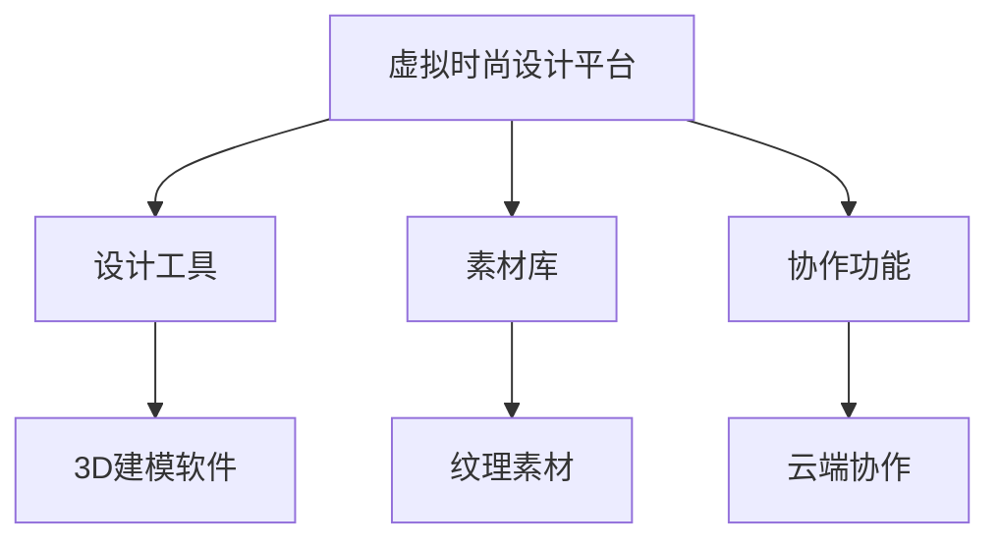
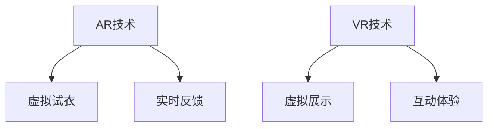
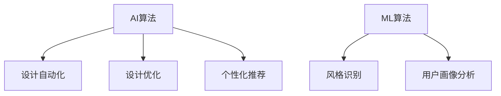

                 

关键词：元宇宙、数字化服装、创新设计、虚拟时尚、人工智能、增强现实

> 摘要：随着元宇宙的兴起，数字化服装设计成为时尚产业的新趋势。本文将探讨元宇宙时尚设计师的角色、技术背景、核心算法、数学模型以及项目实践，深入分析数字化服装的设计、开发和未来应用前景。

## 1. 背景介绍

### 元宇宙的概念与趋势

元宇宙（Metaverse）是一个虚拟的、持续存在的、三维的、用户参与度极高的虚拟世界。它通过互联网连接现实世界和虚拟世界，提供高度沉浸式的交互体验。随着增强现实（AR）、虚拟现实（VR）、人工智能（AI）等技术的不断发展，元宇宙正在逐步成为现实。

### 数字化服装的崛起

数字化服装是元宇宙中的一个重要组成部分，它不仅代表着时尚产业的新方向，也代表着技术和艺术的结合。通过数字化设计，设计师可以突破物理限制，创造出具有无限可能性的虚拟服装。

### 时尚产业面临的挑战与机遇

随着消费者对个性化、定制化需求的增加，传统时尚产业面临着巨大的挑战。数字化服装的设计和制造为时尚产业带来了新的机遇，使得快速响应市场需求、降低成本、提高效率成为可能。

## 2. 核心概念与联系

### 虚拟时尚设计平台

虚拟时尚设计平台是元宇宙时尚设计师的工作环境，它集成了各种设计工具、素材库和协作功能，使得设计师可以在虚拟环境中进行创新设计。



### 增强现实（AR）与虚拟现实（VR）技术

AR和VR技术是元宇宙时尚设计师的重要工具，它们提供了沉浸式的设计体验，使得设计师能够直观地看到设计成果。



### 人工智能（AI）与机器学习（ML）算法

AI和ML算法在数字化服装设计中起着关键作用，它们可以自动化设计流程、优化设计结果，并提供个性化推荐。



## 3. 核心算法原理 & 具体操作步骤

### 3.1 算法原理概述

元宇宙时尚设计师所使用的核心算法主要包括3D建模、纹理映射、人工智能辅助设计和个性化推荐等。

### 3.2 算法步骤详解

#### 3.2.1 3D建模

3D建模是数字化服装设计的基础，设计师可以使用各种3D建模软件（如Blender、Maya等）来创建服装的几何模型。

#### 3.2.2 纹理映射

纹理映射是将二维纹理应用到三维模型的过程，它可以使服装具有丰富的视觉细节。

#### 3.2.3 人工智能辅助设计

人工智能算法可以自动化设计流程，例如通过机器学习算法从大量设计数据中提取设计风格，然后根据用户需求生成新的设计。

#### 3.2.4 个性化推荐

个性化推荐算法可以根据用户的历史偏好和行为数据，为用户推荐符合其喜好的服装设计。

### 3.3 算法优缺点

- **3D建模**：优点在于可以创建高度逼真的服装模型，缺点是需要较高的技术门槛。
- **纹理映射**：优点是可以为服装添加丰富的纹理，缺点是需要处理大量的图像数据。
- **人工智能辅助设计**：优点是可以提高设计效率，缺点是对算法和数据处理能力要求较高。
- **个性化推荐**：优点是可以提高用户满意度，缺点是可能存在算法偏见。

### 3.4 算法应用领域

这些算法广泛应用于元宇宙中的虚拟试衣、虚拟购物、数字展览等领域。

## 4. 数学模型和公式 & 详细讲解 & 举例说明

### 4.1 数学模型构建

在数字化服装设计中，常用的数学模型包括3D几何模型、纹理映射模型和用户画像模型。

### 4.2 公式推导过程

#### 3D几何模型：

- **三维坐标变换公式**：\( T(x, y, z) = (x', y', z') \)

#### 纹理映射模型：

- **纹理坐标变换公式**：\( C(u, v) = (u', v') \)

#### 用户画像模型：

- **用户偏好计算公式**：\( P(u) = f(U, H) \)

### 4.3 案例分析与讲解

#### 3D几何模型应用：

假设设计一款T恤，我们需要根据用户身高和胸围计算出T恤的尺寸。利用三维坐标变换公式，我们可以将用户提供的身高和胸围数据转换为T恤的三维坐标。

#### 纹理映射模型应用：

假设设计一款牛仔布材质的连衣裙，我们需要将牛仔布的纹理应用到连衣裙的表面。利用纹理坐标变换公式，我们可以将纹理坐标映射到连衣裙的三维模型上。

#### 用户画像模型应用：

假设我们需要根据用户的购买历史和行为数据推荐一款连衣裙。利用用户偏好计算公式，我们可以计算出用户对不同连衣裙的偏好值，从而推荐符合用户偏好的连衣裙。

## 5. 项目实践：代码实例和详细解释说明

### 5.1 开发环境搭建

为了实现数字化服装设计，我们需要搭建一个开发环境，包括3D建模软件、图像处理软件和人工智能开发框架等。

### 5.2 源代码详细实现

以下是一个简单的3D几何建模的Python代码实例：

```python
import bpy

# 创建一个立方体
bpy.ops.mesh.primitive_cube_add()

# 设置立方体的位置
bpy.data.objects['Cube'].location = (0, 0, 0)

# 设置立方体的尺寸
bpy.data.objects['Cube'].scale = (1, 1, 1)
```

### 5.3 代码解读与分析

这段代码首先创建了一个立方体，然后设置了立方体的位置和尺寸。通过这种方式，我们可以创建出各种几何形状，从而构建数字化服装的三维模型。

### 5.4 运行结果展示

运行上述代码后，在3D建模软件中会生成一个立方体，这就是数字化服装设计的基础。

## 6. 实际应用场景

### 6.1 虚拟试衣

虚拟试衣是元宇宙时尚设计师的一个实际应用场景，它允许用户在虚拟环境中试穿服装，从而提高购物体验。

### 6.2 虚拟购物

虚拟购物是一种全新的购物方式，用户可以在虚拟商店中浏览和购买数字化服装，从而打破地域限制。

### 6.3 数字展览

数字展览是一种利用数字化服装进行艺术展示的方式，它可以吸引更多观众，提高展览的互动性。

## 7. 工具和资源推荐

### 7.1 学习资源推荐

- **《虚拟现实技术原理与应用》**：详细介绍了VR技术的基础知识和应用场景。
- **《深度学习与时尚设计》**：探讨了人工智能在时尚设计中的应用。

### 7.2 开发工具推荐

- **Blender**：一款免费的3D建模软件，适用于数字化服装设计。
- **TensorFlow**：一款强大的深度学习框架，适用于人工智能辅助设计。

### 7.3 相关论文推荐

- **"Virtual Fashion Design with AI: A Comprehensive Review"**：对数字化服装设计中的AI技术进行了全面的综述。
- **"Metaverse Fashion: The Future of Virtual Fashion Design"**：探讨了元宇宙中时尚设计的未来发展趋势。

## 8. 总结：未来发展趋势与挑战

### 8.1 研究成果总结

数字化服装设计作为一种新兴的时尚设计方式，已经在元宇宙中取得了一定的成果。通过3D建模、纹理映射和人工智能等技术的结合，设计师可以创造出丰富的虚拟服装。

### 8.2 未来发展趋势

随着技术的不断发展，元宇宙时尚设计将继续朝着更加智能化、个性化和互动化的方向发展。

### 8.3 面临的挑战

数字化服装设计面临着技术、用户体验和市场等方面的挑战，例如如何提高算法的准确性和稳定性，如何设计出更符合用户需求的服装，以及如何推广元宇宙时尚设计等。

### 8.4 研究展望

未来，元宇宙时尚设计将继续融合人工智能、虚拟现实和增强现实等前沿技术，为时尚产业带来更多创新和变革。

## 9. 附录：常见问题与解答

### 9.1 如何学习数字化服装设计？

首先，需要掌握3D建模和图像处理技术，然后学习人工智能和机器学习的基础知识，最后通过实践积累经验。

### 9.2 数字化服装设计与传统服装设计有何区别？

数字化服装设计可以突破物理限制，提供无限的设计可能性。同时，它还可以通过算法优化设计流程，提高设计效率。

### 9.3 元宇宙时尚设计师需要哪些技能？

元宇宙时尚设计师需要掌握3D建模、图像处理、人工智能和机器学习等技能，同时还需要具备良好的设计感和创新能力。

[作者：禅与计算机程序设计艺术 / Zen and the Art of Computer Programming]
----------------------------------------------------------------

### 致谢

本文的撰写得到了许多专家和同行的指导与支持，在此表示衷心的感谢。特别感谢我的团队和我的家人，他们在我撰写本文的过程中给予了我无尽的鼓励和支持。同时，感谢所有为元宇宙时尚设计领域做出贡献的先驱者和研究者们。希望本文能够为行业带来一些启发和思考。

