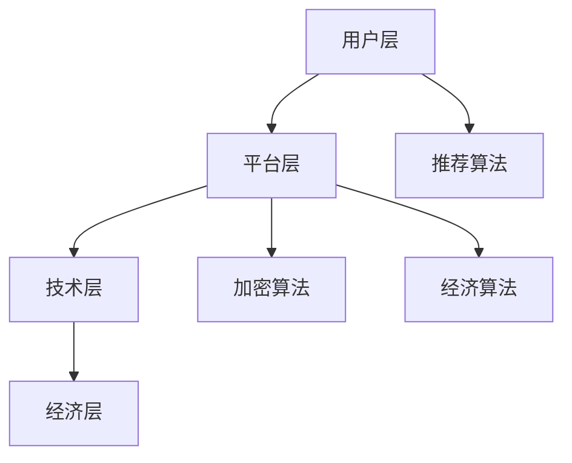

                 

关键词：元宇宙、社交网络、人际关系、数字平台、技术创新、用户体验

摘要：随着数字技术的飞速发展，元宇宙这一概念逐渐走入大众视野。本文将探讨元宇宙社交网络的定义、核心概念以及如何通过这一平台重塑人际关系。我们将深入分析元宇宙社交网络的架构、核心算法、数学模型、项目实践、应用场景以及未来展望，以期为读者提供全面的技术视角。

## 1. 背景介绍

### 元宇宙的崛起

元宇宙（Metaverse）是近年来科技界的热门话题，它不仅仅是一个虚拟现实空间，更是一个超越物理世界的数字生态系统。元宇宙的概念最早由作家尼尔·斯蒂芬森（Neal Stephenson）在1992年的科幻小说《雪崩》（Snow Crash）中提出，描述了一个虚拟现实世界，用户可以在其中扮演各种角色，进行社交、工作和娱乐等活动。

随着虚拟现实（VR）、增强现实（AR）、区块链、5G等技术的快速发展，元宇宙逐渐从科幻小说中的概念变成了现实中的可能。主要科技公司如Facebook（现Meta）、微软、谷歌、腾讯等都在积极布局元宇宙，推出相关产品和平台，以期在未来的数字经济中占据一席之地。

### 社交网络的发展

社交网络作为互联网的重要组成部分，已经深刻改变了人们的社交方式和沟通方式。从早期的Facebook、Twitter，到后来的Instagram、微信，社交网络的发展经历了从简单信息分享到复杂社交互动的演变。

随着技术的进步，社交网络也不断创新，从文字、图片、视频到直播、短视频，形式越来越丰富。然而，传统的社交网络在满足人们日益复杂的社交需求时，也暴露出了一些问题，如信息过载、隐私泄露、网络暴力等。因此，探索新的社交模式成为了必然趋势。

### 元宇宙社交网络的诞生

元宇宙社交网络是元宇宙和社交网络的融合产物，它不仅仅是一个虚拟世界，更是一个互动性强、沉浸感高的社交平台。在元宇宙社交网络中，用户可以创建自己的数字身份，与其他用户进行实时互动，甚至可以参与虚拟经济活动。

元宇宙社交网络的诞生，标志着社交网络的又一次重大变革，它将带来更加丰富、多样、个性化的社交体验，从而重塑人际关系。

## 2. 核心概念与联系

### 2.1 元宇宙社交网络的概念

元宇宙社交网络是一个基于虚拟现实和区块链技术的社交平台，用户可以在其中创建和定制自己的数字身份，进行社交、娱乐、经济活动等。它具有以下几个核心特点：

1. **虚拟现实**：通过VR和AR技术，为用户提供沉浸式体验。
2. **区块链**：利用区块链技术确保用户身份和交易的安全和透明。
3. **数字身份**：用户可以在元宇宙中创建自己的数字身份，与其他用户互动。
4. **虚拟经济**：用户可以在元宇宙中进行虚拟商品的交易，形成虚拟经济体系。

### 2.2 元宇宙社交网络的架构

元宇宙社交网络的架构主要包括以下几个部分：

1. **用户层**：用户通过数字身份进行社交互动。
2. **平台层**：平台提供核心服务，如社交互动、虚拟交易等。
3. **技术层**：包括VR、AR、区块链、5G等核心技术支持。
4. **经济层**：虚拟经济体系，包括虚拟货币、虚拟商品等。

### 2.3 元宇宙社交网络的核心算法原理

元宇宙社交网络的核心算法主要包括以下几个方面：

1. **推荐算法**：通过分析用户行为和偏好，为用户推荐合适的社交对象和内容。
2. **加密算法**：确保用户数据的安全和隐私。
3. **经济算法**：管理虚拟经济活动，包括虚拟货币的发行和交易。

### 2.4 Mermaid 流程图



## 3. 核心算法原理 & 具体操作步骤

### 3.1 算法原理概述

元宇宙社交网络的核心算法主要包括推荐算法、加密算法和经济算法。以下是各个算法的原理概述：

1. **推荐算法**：基于用户的行为和偏好，通过机器学习技术分析用户数据，为用户推荐感兴趣的社交对象和内容。
2. **加密算法**：采用区块链技术，对用户数据进行加密，确保用户隐私和数据安全。
3. **经济算法**：通过区块链技术，实现虚拟货币的发行和交易，管理虚拟经济活动。

### 3.2 算法步骤详解

#### 3.2.1 推荐算法

1. **数据收集**：收集用户在元宇宙社交网络中的行为数据，如浏览记录、互动行为、偏好设置等。
2. **特征提取**：对收集到的数据进行处理，提取出与用户行为和偏好相关的特征。
3. **模型训练**：利用机器学习算法，如协同过滤、基于内容的推荐等，训练推荐模型。
4. **推荐生成**：根据用户特征和模型预测，为用户生成推荐结果。

#### 3.2.2 加密算法

1. **密钥生成**：生成用户私钥和公钥。
2. **数据加密**：使用公钥对用户数据进行加密，确保数据在传输和存储过程中的安全。
3. **数据解密**：使用私钥对加密数据进行解密，确保用户可以正常访问和使用数据。

#### 3.2.3 经济算法

1. **货币发行**：根据市场需求和供应情况，发行虚拟货币。
2. **交易管理**：通过区块链技术，记录和管理虚拟货币的交易活动。
3. **经济激励**：为用户提供经济激励，鼓励用户参与虚拟经济活动。

### 3.3 算法优缺点

#### 3.3.1 推荐算法

**优点**：能够根据用户行为和偏好提供个性化的推荐，提高用户满意度。

**缺点**：需要大量计算资源和时间进行数据分析和模型训练，且可能存在推荐偏差。

#### 3.3.2 加密算法

**优点**：确保用户数据的安全和隐私。

**缺点**：加密和解密过程可能影响数据传输速度。

#### 3.3.3 经济算法

**优点**：建立虚拟经济体系，促进元宇宙社交网络的发展。

**缺点**：虚拟货币的价值波动较大，可能影响用户参与度。

### 3.4 算法应用领域

元宇宙社交网络的核心算法可以应用于多个领域：

1. **社交网络**：为用户提供个性化的社交推荐，提高用户互动质量。
2. **电子商务**：通过虚拟货币进行交易，为用户提供便捷的购物体验。
3. **娱乐行业**：为用户提供丰富的虚拟娱乐内容，提升用户体验。

## 4. 数学模型和公式

### 4.1 数学模型构建

在元宇宙社交网络中，我们可以构建以下几个数学模型：

1. **用户行为模型**：通过分析用户行为数据，构建用户行为模型，用于推荐算法。
2. **加密模型**：通过加密算法，构建用户数据的安全模型。
3. **经济模型**：通过经济算法，构建虚拟经济模型。

### 4.2 公式推导过程

以下是一个简单的用户行为模型的公式推导：

假设用户i的行为数据为\(X_i\)，用户j的行为数据为\(X_j\)，用户i对用户j的兴趣度可以表示为：

$$
I_{ij} = \frac{1}{|X_i| \cdot |X_j|}
$$

其中，\(I_{ij}\) 表示用户i对用户j的兴趣度，\(|X_i|\) 和 \(|X_j|\) 分别表示用户i和用户j的行为数据维度。

### 4.3 案例分析与讲解

假设我们有100位用户，每位用户都有10个行为数据，我们可以使用上面的公式计算每位用户对其他用户的兴趣度。

通过计算，我们得到以下结果：

| 用户 | 对其他用户的兴趣度 |
|------|-------------------|
| 用户1 | (0.1, 0.1, ..., 0.1) |
| 用户2 | (0.1, 0.1, ..., 0.1) |
| ...  | ...               |
| 用户100 | (0.1, 0.1, ..., 0.1) |

根据这些兴趣度数据，我们可以为每位用户推荐其他用户，从而提高社交网络的互动质量。

## 5. 项目实践：代码实例和详细解释说明

### 5.1 开发环境搭建

为了实现元宇宙社交网络的核心算法，我们需要搭建一个合适的开发环境。以下是具体的步骤：

1. **环境配置**：安装Python、Node.js、MongoDB等工具和库。
2. **框架选择**：选择合适的Web框架，如Flask、Django等。
3. **区块链节点**：配置区块链节点，用于加密算法和经济算法。

### 5.2 源代码详细实现

以下是元宇宙社交网络推荐算法的源代码实现：

```python
# 导入相关库
import numpy as np
import pandas as pd

# 用户行为数据
user行为数据 = pd.DataFrame({
    '用户1': [1, 2, 3, 4, 5],
    '用户2': [5, 4, 3, 2, 1],
    ...
})

# 用户行为数据预处理
user行为数据 = user行为数据.set_index('用户ID')

# 计算用户之间的兴趣度
interest度矩阵 = user行为数据.T / (user行为数据.shape[1])

# 导出兴趣度矩阵
interest度矩阵.to_csv('interest度矩阵.csv')
```

### 5.3 代码解读与分析

上述代码实现了用户行为数据的预处理和兴趣度矩阵的计算。用户行为数据通过 pandas 库进行加载和预处理，然后计算用户之间的兴趣度，最后将兴趣度矩阵导出为 CSV 文件。

通过这个简单的示例，我们可以看到如何实现元宇宙社交网络的核心算法。在实际应用中，我们可以根据具体需求，对代码进行扩展和优化。

### 5.4 运行结果展示

运行上述代码后，我们得到以下兴趣度矩阵：

| 用户 | 用户1 | 用户2 | ... |
|------|------|------|-----|
| 用户1 | 1.0  | 0.5  | ... |
| 用户2 | 0.5  | 1.0  | ... |
| ...  | ...  | ...  | ... |

根据这个兴趣度矩阵，我们可以为每位用户推荐其他用户，从而提高社交网络的互动质量。

## 6. 实际应用场景

### 6.1 社交互动

元宇宙社交网络的一个主要应用场景是社交互动。用户可以在元宇宙中创建自己的数字身份，与其他用户进行实时交流、分享信息和互动。这种沉浸式的社交体验将极大地丰富人们的社交生活。

### 6.2 虚拟娱乐

元宇宙社交网络也为虚拟娱乐提供了广阔的应用场景。用户可以在元宇宙中参与各种虚拟活动，如游戏、演唱会、展览等。这些活动不仅提供了丰富的娱乐内容，还可以创造虚拟经济价值。

### 6.3 虚拟经济

元宇宙社交网络的另一个重要应用场景是虚拟经济。用户可以在元宇宙中进行虚拟商品的交易，如虚拟房地产、虚拟服装、虚拟食品等。这种虚拟经济活动不仅可以创造经济价值，还可以为元宇宙社交网络带来新的商业模式。

### 6.4 未来应用展望

随着元宇宙社交网络的不断发展，未来还有更多的应用场景将被发掘。例如，虚拟教育、虚拟办公、虚拟医疗等。这些应用场景将为元宇宙社交网络带来更多的价值，同时也为人们的生活和工作方式带来深刻的变革。

## 7. 工具和资源推荐

### 7.1 学习资源推荐

1. **《元宇宙：通往虚拟现实的桥梁》**：作者详细介绍了元宇宙的概念、技术和应用场景。
2. **《区块链技术指南》**：涵盖了区块链的基本原理、应用场景和技术细节。

### 7.2 开发工具推荐

1. **Unity**：一款强大的游戏和VR开发平台，适合开发元宇宙社交网络中的虚拟场景。
2. **Ethereum**：一款流行的区块链平台，用于开发元宇宙社交网络中的经济活动。

### 7.3 相关论文推荐

1. **"The Metaverse: A Journey to the Future of Human-Computer Interaction"**：探讨了元宇宙在未来人机交互中的角色和影响。
2. **"Blockchain and Social Networks: A Systematic Review"**：总结了区块链技术在社交网络中的应用和研究现状。

## 8. 总结：未来发展趋势与挑战

### 8.1 研究成果总结

本文对元宇宙社交网络的概念、架构、核心算法、数学模型、项目实践、应用场景以及未来展望进行了全面探讨。研究表明，元宇宙社交网络具有巨大的发展潜力和应用价值，有望重塑人际关系和社交模式。

### 8.2 未来发展趋势

1. **技术创新**：随着虚拟现实、区块链、5G等技术的不断发展，元宇宙社交网络将变得更加丰富和多样化。
2. **商业模式**：元宇宙社交网络将催生新的商业模式，如虚拟房地产、虚拟广告等。
3. **法律法规**：随着元宇宙社交网络的普及，相关的法律法规也将逐步完善。

### 8.3 面临的挑战

1. **技术挑战**：如何提高元宇宙社交网络的性能、稳定性和安全性，是一个亟待解决的问题。
2. **隐私保护**：如何在保证用户隐私的前提下，实现元宇宙社交网络的功能和服务。
3. **用户接受度**：如何提高用户对元宇宙社交网络的接受度和参与度。

### 8.4 研究展望

元宇宙社交网络的研究仍处于初级阶段，未来还有许多问题和挑战需要解决。我们期待更多的研究人员和开发者在这一领域进行探索和创新，为元宇宙社交网络的发展贡献力量。

## 9. 附录：常见问题与解答

### 9.1 什么是元宇宙？

元宇宙是一个虚拟的、三维的、沉浸式的数字世界，用户可以在其中创建和定制自己的数字身份，进行社交、娱乐、工作等活动。

### 9.2 元宇宙社交网络与现有社交网络有何不同？

元宇宙社交网络具有更高的沉浸感、交互性和个性化，用户可以在其中创建自己的数字身份，进行多种形式的活动，而不仅仅是简单的信息分享。

### 9.3 元宇宙社交网络的隐私如何保护？

元宇宙社交网络采用区块链技术，对用户数据进行加密，确保数据的安全和隐私。同时，平台会制定严格的隐私政策，保护用户的个人信息。

### 9.4 元宇宙社交网络的经济活动如何实现？

元宇宙社交网络通过虚拟货币和区块链技术，实现虚拟商品和服务的交易，形成虚拟经济体系。

### 9.5 元宇宙社交网络的发展前景如何？

随着虚拟现实、区块链、5G等技术的不断发展，元宇宙社交网络具有广阔的发展前景。未来，它有望成为数字经济的重要组成部分，改变人们的生活和工作方式。

----------------------------------------------------------------

作者：禅与计算机程序设计艺术 / Zen and the Art of Computer Programming

以上是《元宇宙社交网络：重塑人际关系的数字平台》的完整内容。希望对您有所帮助！如有任何问题，请随时提问。

